# Business Process — ProsaUAI

> Este documento é o **guia de negócio de ponta a ponta** do ProsaUAI. Responde a "como funciona exatamente" de qualquer caminho — texto, áudio, imagem, documento, sticker, grupo, duplicata, budget estourado, handoff. Para o *catálogo* de features user-facing, ver [Solution Overview](./solution-overview.md). Para arquitetura técnica, ver [engineering/blueprint.md](../engineering/blueprint.md).
>
> **Legenda**:
> - ✅ **IMPLEMENTADO** — código em produção no branch `develop`.
> - 🔄 **EM EVOLUÇÃO** — parcialmente entregue; detalhe por seção.
> - 📋 **PLANEJADO** — roadmap futuro, sem código ainda.

---

## 0. Visão Geral — o fluxo inteiro em uma tela

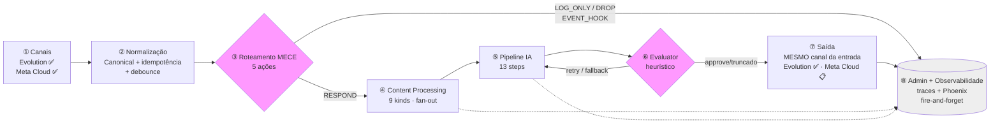
```mermaid
flowchart LR
    IN["① Canais<br/>Evolution ✅<br/>Meta Cloud ✅"]
    NORM["② Normalização<br/>Canonical + idempotência<br/>+ debounce"]
    ROUTE{"③ Roteamento MECE<br/>5 ações"}
    PROC["④ Content Processing<br/>9 kinds · fan-out"]
    PIPE["⑤ Pipeline IA<br/>13 steps"]
    EVAL{"⑥ Evaluator<br/>heurístico"}
    OUT["⑦ Saída<br/>MESMO canal da entrada<br/>Evolution ✅ · Meta Cloud 📋"]
    OBS[("⑧ Admin + Observabilidade<br/>traces + Phoenix<br/>fire-and-forget")]

    IN --> NORM --> ROUTE
    ROUTE -->|RESPOND| PROC --> PIPE --> EVAL
    ROUTE -->|LOG_ONLY / DROP<br/>EVENT_HOOK| OBS
    EVAL -->|approve/truncado| OUT
    EVAL -->|retry / fallback| PIPE
    OUT --> OBS
    PROC -.-> OBS
    PIPE -.-> OBS

    style ROUTE fill:#f9f
    style EVAL fill:#f9f
    style OBS fill:#eee
```

<details>
<summary>🔍 Ver diagrama interno expandido (componentes de cada fase)</summary>

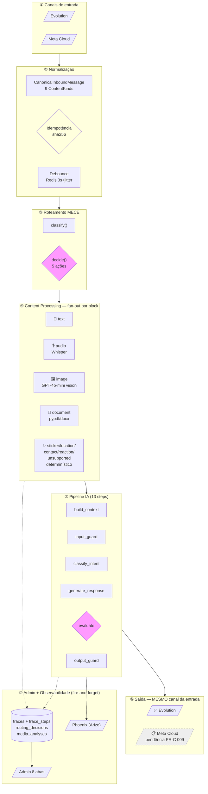
```mermaid
flowchart TD
    subgraph canais["① Canais de entrada"]
        direction LR
        EVO[/"Evolution"/]
        META[/"Meta Cloud"/]
    end

    subgraph normaliza["② Normalização"]
        direction LR
        CANON["CanonicalInboundMessage<br/>9 ContentKinds"]
        IDEM{"Idempotência<br/>sha256"}
        DEB["Debounce<br/>Redis 3s+jitter"]
    end

    subgraph rot["③ Roteamento MECE"]
        direction LR
        CLASS["classify()"]
        DEC{"decide()<br/>5 ações"}
    end

    subgraph proc["④ Content Processing — fan-out por block"]
        direction LR
        TXT["💬 text"]
        AUDIO["🎙️ audio<br/>Whisper"]
        IMG["🖼️ image<br/>GPT-4o-mini vision"]
        DOC["📄 document<br/>pypdf/docx"]
        LIGHT["✨ sticker/location/<br/>contact/reaction/<br/>unsupported<br/>determinístico"]
    end

    subgraph pipe["⑤ Pipeline IA (13 steps)"]
        direction LR
        CTX["build_context"]
        GIN["input_guard"]
        INT["classify_intent"]
        AG["generate_response"]
        EV{"evaluate"}
        GOUT["output_guard"]
    end

    subgraph saida["⑥ Saída — MESMO canal da entrada"]
        direction LR
        OUT_E[/"✅ Evolution"/]
        OUT_M[/"📋 Meta Cloud<br/>pendência PR-C 009"/]
    end

    canais --> normaliza --> rot --> proc --> pipe --> saida

    subgraph obs["⑦ Admin + Observabilidade (fire-and-forget)"]
        direction LR
        TRACES[("traces + trace_steps<br/>routing_decisions<br/>media_analyses")]
        PHX[/"Phoenix (Arize)"/]
        UI[/"Admin 8 abas"/]
    end

    pipe -.-> TRACES
    proc -.-> TRACES
    pipe -.-> PHX
    TRACES --> UI

    style IDEM fill:#ffd
    style DEC fill:#f9f
    style EV fill:#f9f
    style OUT_M fill:#eee,stroke:#999,stroke-dasharray: 5 5
```

</details>

**O que entra**: mensagens WhatsApp via Evolution (gateway não-oficial) ou Meta Cloud API (oficial). 9 modalidades de conteúdo — texto, áudio (PTT ou arquivo), imagem, documento (PDF/DOCX), sticker, localização, contato, reação (emoji), e "unsupported" (vídeo, poll, call, edited, system).

**O que sai** — **regra de ouro**: resposta sai pelo **mesmo canal que recebeu a mensagem**. Mensagem que entrou pela Evolution responde via Evolution; mensagem que entrou pela Meta Cloud responde via Meta Cloud. **Hoje existe gap**: outbound Meta Cloud ainda não implementado — é pendência do PR-C do epic 009 e bloqueia tenants single-canal Meta Cloud. Detalhes em §5.7.

**Multi-tenant por construção**: cada mensagem carrega `instance_name`/`tenant_slug` resolvido em `Tenant` no primeiro hop. Dois tenants em produção — **Ariel (Pace-internal)** e **ResenhAI (Resenha-internal)** — isolados por `tenant_id` + RLS Postgres.

**Observabilidade passiva**: falha em OTel/Phoenix/admin persistence NUNCA bloqueia o caminho crítico. Tudo fire-and-forget com BatchSpanProcessor (force_flush no shutdown).

---

## 1. Canais de Entrada

O ProsaUAI recebe mensagens de duas fontes hoje. Cada canal implementa o protocolo `ChannelAdapter` ([ADR-031](../decisions/ADR-031-multi-source-channel-adapter.md)) com **duas funções puras**: `verify_webhook(request) → TenantIdentity` (autentica) e `normalize(payload, tenant) → CanonicalInboundMessage` (traduz).

> **Invariante arquitetural**: adapters NUNCA tocam Postgres, Redis, LLM, OTel, nem alteram estado global. São tradutores. Pipeline, processors e router não importam nada de `channels/`. Se um novo canal exige mudança fora de `channels/`, a abstração vazou. Adicionar Instagram/Telegram (epic 010) deve seguir esta regra — 4 passos aditivos documentados em `apps/api/prosauai/channels/README.md`.

### 1.1 Evolution API (WhatsApp não-oficial) ✅

Gateway Evolution API self-hosted (ou cloud) que conecta a uma conta WhatsApp via Baileys. Primeiro canal implementado (epic 001), em produção com 2 tenants.

<details>
<summary>📊 Diagrama de fluxo — recepção, auth e normalização</summary>

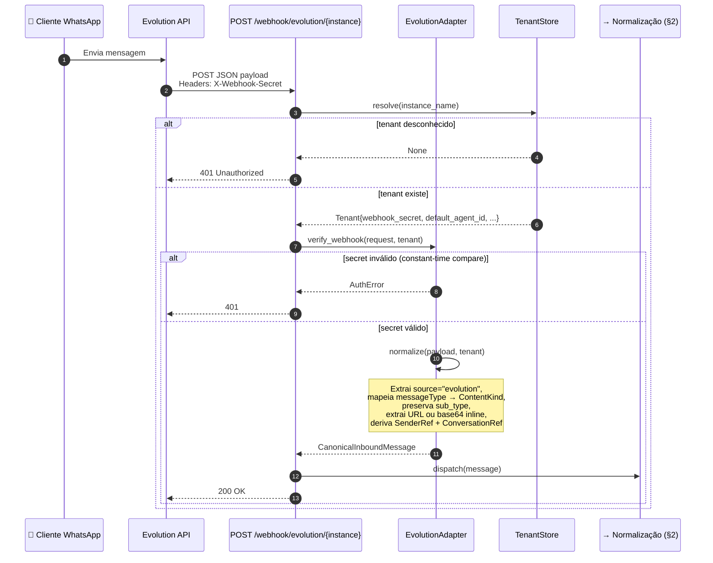
```mermaid
sequenceDiagram
    autonumber
    participant U as 👤 Cliente WhatsApp
    participant E as Evolution API
    participant W as POST /webhook/evolution/{instance}
    participant A as EvolutionAdapter
    participant T as TenantStore
    participant N as → Normalização (§2)

    U->>E: Envia mensagem
    E->>W: POST JSON payload<br/>Headers: X-Webhook-Secret
    W->>T: resolve(instance_name)
    alt tenant desconhecido
        T-->>W: None
        W-->>E: 401 Unauthorized
    else tenant existe
        T-->>W: Tenant{webhook_secret, default_agent_id, ...}
        W->>A: verify_webhook(request, tenant)
        alt secret inválido (constant-time compare)
            A-->>W: AuthError
            W-->>E: 401
        else secret válido
            A->>A: normalize(payload, tenant)
            Note over A: Extrai source="evolution",<br/>mapeia messageType → ContentKind,<br/>preserva sub_type,<br/>extrai URL ou base64 inline,<br/>deriva SenderRef + ConversationRef
            A-->>W: CanonicalInboundMessage
            W->>N: dispatch(message)
            W-->>E: 200 OK
        end
    end
```

</details>

**Descarta** (retorna 204 No Content):
- Webhook de bot próprio — `from_me: true` (echo prevention)
- Eventos não-mensagem que não mapeiam para ContentKind (`connection.update`, `presence.update`)
- Payloads malformados → `InvalidPayloadError` (422) para forçar correção upstream

### 1.2 Meta Cloud API (WhatsApp oficial) ✅ — epic 009 PR-C

Adapter oficial Meta Cloud (WhatsApp Business Platform). Segundo canal implementado — prova que a abstração `ChannelAdapter` suporta fonte independente sem tocar no core.

<details>
<summary>📊 Sequência — 1.2 Meta Cloud API (WhatsApp oficial) ✅ — epic 009 PR-C</summary>

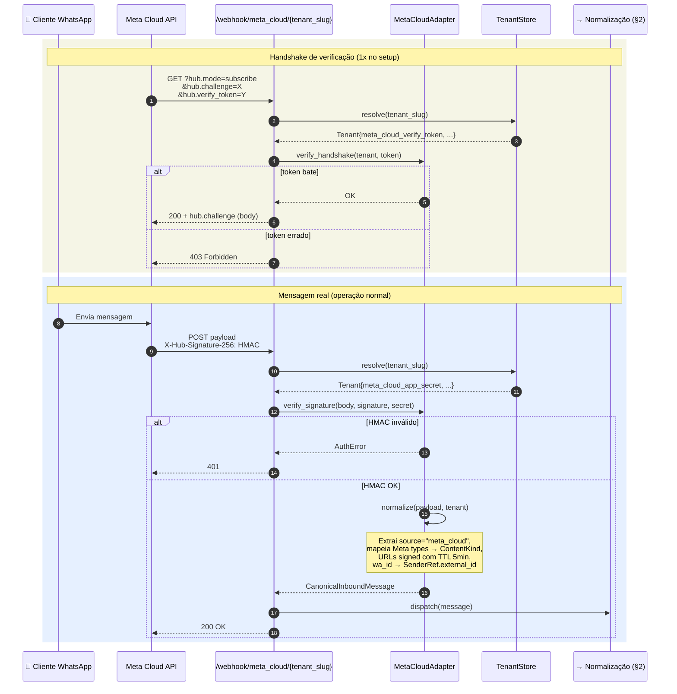
```mermaid
sequenceDiagram
    autonumber
    participant U as 👤 Cliente WhatsApp
    participant M as Meta Cloud API
    participant W as /webhook/meta_cloud/{tenant_slug}
    participant A as MetaCloudAdapter
    participant T as TenantStore
    participant N as → Normalização (§2)

    rect rgb(245, 245, 230)
    Note over U,N: Handshake de verificação (1x no setup)
    M->>W: GET ?hub.mode=subscribe<br/>&hub.challenge=X<br/>&hub.verify_token=Y
    W->>T: resolve(tenant_slug)
    T-->>W: Tenant{meta_cloud_verify_token, ...}
    W->>A: verify_handshake(tenant, token)
    alt token bate
        A-->>W: OK
        W-->>M: 200 + hub.challenge (body)
    else token errado
        W-->>M: 403 Forbidden
    end
    end

    rect rgb(230, 240, 255)
    Note over U,N: Mensagem real (operação normal)
    U->>M: Envia mensagem
    M->>W: POST payload<br/>X-Hub-Signature-256: HMAC
    W->>T: resolve(tenant_slug)
    T-->>W: Tenant{meta_cloud_app_secret, ...}
    W->>A: verify_signature(body, signature, secret)
    alt HMAC inválido
        A-->>W: AuthError
        W-->>M: 401
    else HMAC OK
        A->>A: normalize(payload, tenant)
        Note over A: Extrai source="meta_cloud",<br/>mapeia Meta types → ContentKind,<br/>URLs signed com TTL 5min,<br/>wa_id → SenderRef.external_id
        A-->>W: CanonicalInboundMessage
        W->>N: dispatch(message)
        W-->>M: 200 OK
    end
    end
```

</details>

**Diferenças vs. Evolution**:
- URLs de mídia signed com TTL **5 minutos** (vs. URLs Evolution mais longevas) — cache sha256 reduz misses
- WhatsApp IDs (`wa_id`) têm formato diferente de JIDs — idempotency key agnóstica via `sha256(source+instance+external_id)` já cobre
- `statuses` (ACK, delivered, read) são ignorados hoje — retornam 204

**Limite atual**: outbound para Meta Cloud ainda **NÃO implementado**. Toda resposta sai por Evolution. Para tenants multi-canal, é necessário que exista Evolution configurado — follow-up do PR-C.

### 1.3 Canais planejados 📋

<details>
<summary>📊 Fluxograma — 1.3 Canais planejados 📋</summary>

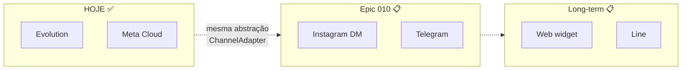
```mermaid
flowchart LR
    subgraph hoje["HOJE ✅"]
        EVO["Evolution"]
        META["Meta Cloud"]
    end
    subgraph next["Epic 010 📋"]
        INSTA["Instagram DM"]
        TELE["Telegram"]
    end
    subgraph longo["Long-term 📋"]
        WEB["Web widget"]
        LINE["Line"]
    end
    hoje -.->|"mesma abstração<br/>ChannelAdapter"| next
    next -.-> longo
```

</details>

| Canal | Epic | Observação |
|-------|------|------------|
| Instagram DM | 010 | Reusa padrão `ChannelAdapter`; meta = "diff zero em pipeline/processors/router" |
| Telegram | 010 | Idem |
| Web widget | — | Sem epic dedicado — após primeiros clientes externos |

---

## 2. Normalização — Canonical Model + Idempotência + Debounce

Tudo que entra vira o mesmo shape antes de qualquer decisão de negócio. Contrato único para o resto do pipeline — isolamento total de particularidades de cada fonte.

### 2.1 CanonicalInboundMessage ✅ ([ADR-030](../decisions/ADR-030-canonical-inbound-message.md))

<details>
<summary>📊 Estrutura — 2.1 CanonicalInboundMessage ✅ ([ADR-030](../decisions/ADR-030-canonical-inbound-message.md))</summary>

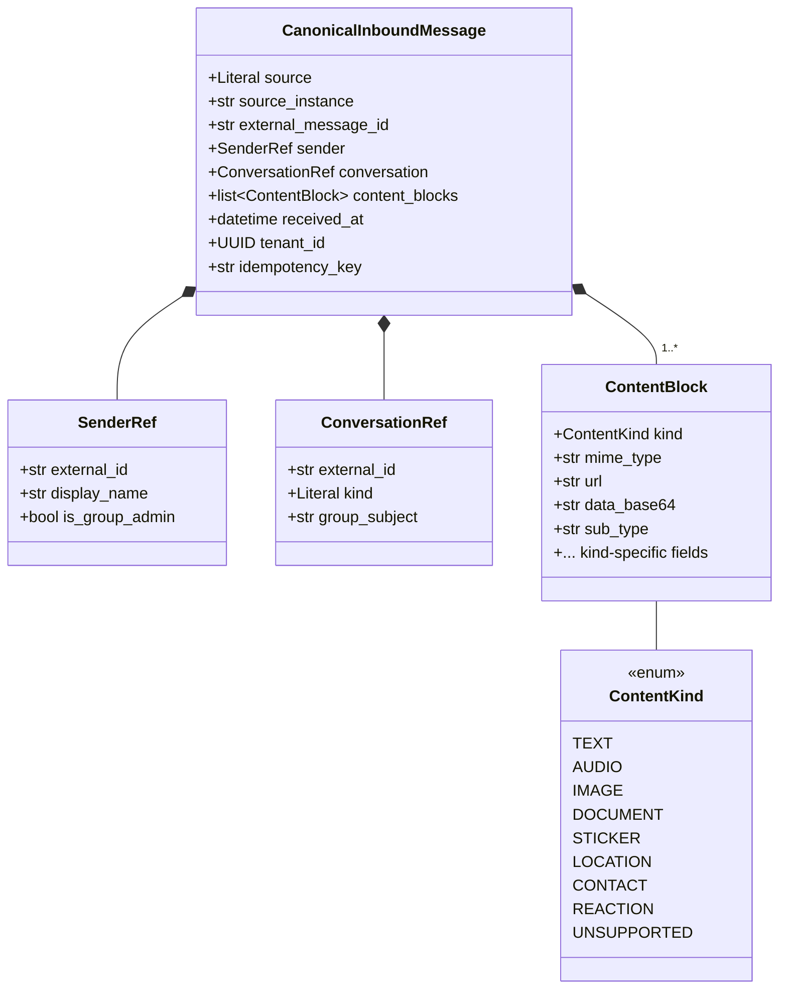
```mermaid
classDiagram
    class CanonicalInboundMessage {
        +Literal source
        +str source_instance
        +str external_message_id
        +SenderRef sender
        +ConversationRef conversation
        +list~ContentBlock~ content_blocks
        +datetime received_at
        +UUID tenant_id
        +str idempotency_key
    }
    class SenderRef {
        +str external_id
        +str display_name
        +bool is_group_admin
    }
    class ConversationRef {
        +str external_id
        +Literal kind
        +str group_subject
    }
    class ContentBlock {
        +ContentKind kind
        +str mime_type
        +str url
        +str data_base64
        +str sub_type
        +... kind-specific fields
    }
    class ContentKind {
        <<enum>>
        TEXT
        AUDIO
        IMAGE
        DOCUMENT
        STICKER
        LOCATION
        CONTACT
        REACTION
        UNSUPPORTED
    }
    CanonicalInboundMessage *-- SenderRef
    CanonicalInboundMessage *-- ConversationRef
    CanonicalInboundMessage *-- "1..*" ContentBlock
    ContentBlock -- ContentKind
```

</details>

**9 ContentKinds** e o que cada uma carrega:

| Kind | Fields específicos | Exemplos |
|------|---------------------|----------|
| `TEXT` | `text` | chat normal |
| `AUDIO` | `url`, `data_base64`, `duration_seconds`, `mime_type` | PTT, .ogg, .mp3 |
| `IMAGE` | `url`, `data_base64`, `caption`, `width`, `height`, `mime_type` | foto, screenshot, print |
| `DOCUMENT` | `url`, `data_base64`, `file_name`, `size_bytes`, `mime_type` | PDF, DOCX |
| `STICKER` | `url`, `sub_type` (animated/static) | sticker WhatsApp |
| `LOCATION` | `latitude`, `longitude`, `location_name` | live location, ponto enviado |
| `CONTACT` | `contact_vcard` | cartão de contato |
| `REACTION` | `reaction_emoji`, `reaction_target_external_id` | ❤️, 👍 |
| `UNSUPPORTED` | `sub_type` (videoMessage, pollMessage, ...) | vídeo, poll, call, edited, system, payment |

**Dados**:
- **Entra**: payload nativo (Evolution ou Meta Cloud)
- **Transforma**: `ChannelAdapter.normalize()` → estrutura canônica; Pydantic valida combinações (ex.: rejeita `sub_type` em kind não-`UNSUPPORTED`)
- **Sai**: `CanonicalInboundMessage` **frozen** (imutável downstream)
- **Persiste**: ainda não — o `save_inbound` (step 5 do pipeline) persiste em `messages` depois do debounce

### 2.2 Idempotência ✅

**Por que existe**: retentativas de webhook (rede instável, timeout do adapter), replays manuais de debug, ou mesmo `external_message_id` chegando por 2 paths. Sem isso, o agente responderia 2x e cobraria LLM em dobro.

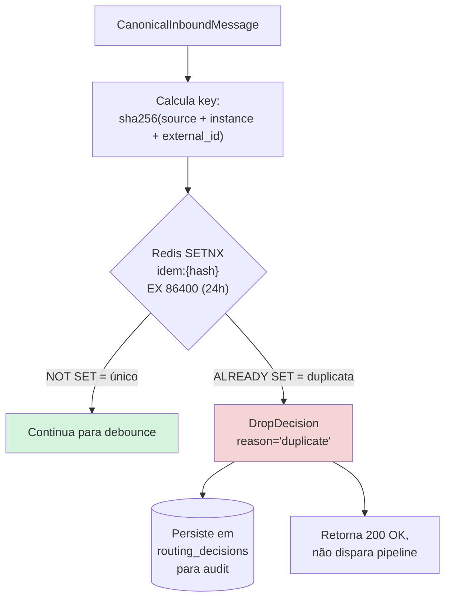
```mermaid
flowchart TD
    M["CanonicalInboundMessage"] --> H["Calcula key:<br/>sha256(source + instance + external_id)"]
    H --> R{"Redis SETNX<br/>idem:{hash}<br/>EX 86400 (24h)"}
    R -->|NOT SET = único| OK["Continua para debounce"]
    R -->|ALREADY SET = duplicata| DROP["DropDecision<br/>reason='duplicate'"]
    DROP --> TR[("Persiste em<br/>routing_decisions<br/>para audit")]
    DROP --> END["Retorna 200 OK,<br/>não dispara pipeline"]
    style OK fill:#d4f4dd
    style DROP fill:#f4d4d4
```

**Por que cross-source**: um tenant pode rodar Evolution e Meta Cloud em paralelo durante migração. `wa_id` da Meta pode colidir com JID Evolution por acaso. Hash do tuplo inteiro elimina o risco.

### 2.3 Debounce — agrupamento de mensagens rápidas ✅

**Por que existe**: usuário manda 3 mensagens em 2s ("oi" / "quero saber" / "sobre o pedido 123"). Sem debounce: pipeline roda 3x, custa 3x LLM, resposta à primeira chega antes das outras 2 serem lidas pelo bot. Contexto quebrado.

<details>
<summary>📊 Sequência — 2.3 Debounce — agrupamento de mensagens rápidas ✅</summary>

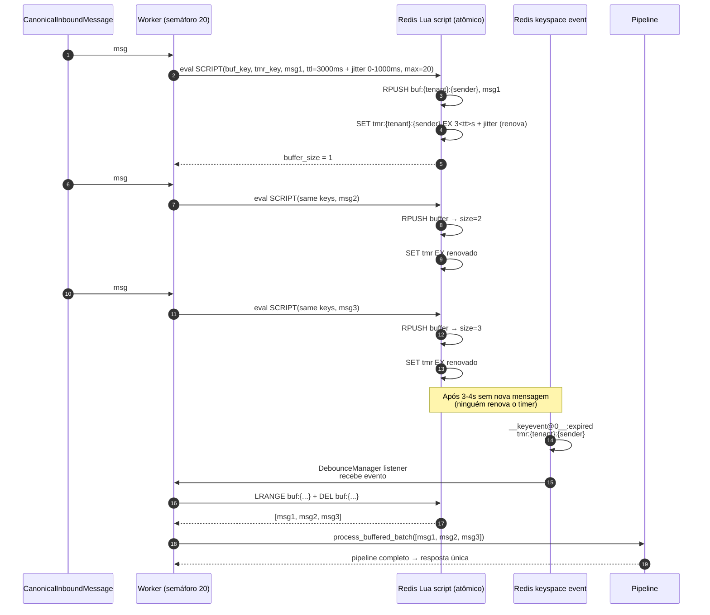
```mermaid
sequenceDiagram
    autonumber
    participant M as CanonicalInboundMessage
    participant W as Worker (semáforo 20)
    participant L as Redis Lua script (atômico)
    participant K as Redis keyspace event
    participant P as Pipeline

    M->>W: msg #1 "oi"
    W->>L: eval SCRIPT(buf_key, tmr_key, msg1, ttl=3000ms + jitter 0-1000ms, max=20)
    L->>L: RPUSH buf:{tenant}:{sender}, msg1
    L->>L: SET tmr:{tenant}:{sender} EX 3<tt>s + jitter (renova)
    L-->>W: buffer_size = 1

    M->>W: msg #2 "quero saber" (1s depois)
    W->>L: eval SCRIPT(same keys, msg2)
    L->>L: RPUSH buffer → size=2
    L->>L: SET tmr EX renovado

    M->>W: msg #3 "sobre pedido 123" (2s depois)
    W->>L: eval SCRIPT(same keys, msg3)
    L->>L: RPUSH buffer → size=3
    L->>L: SET tmr EX renovado

    Note over L,K: Após 3-4s sem nova mensagem<br/>(ninguém renova o timer)
    K->>K: __keyevent@0__:expired<br/>tmr:{tenant}:{sender}
    K->>W: DebounceManager listener<br/>recebe evento
    W->>L: LRANGE buf:{...} + DEL buf:{...}
    L-->>W: [msg1, msg2, msg3]
    W->>P: process_buffered_batch([msg1, msg2, msg3])
    P-->>W: pipeline completo → resposta única
```

</details>

**Detalhes**:
- Lua script atômico: buffer + timer numa operação — sem race condition
- **Jitter aleatório 0-1s**: 100 clientes digitando ao mesmo tempo? TTLs espalhados, flushes não-sincronizados (evita avalanche)
- **`MAX_BUFFER_ITEMS = 20`**: acima disso, flush forçado mesmo sem expirar (evita unbounded memory)
- **Worker limits**: `max_jobs=20`, **semáforo LLM=10** (limita concorrência global)
- **Listener Redis**: `__keyevent@0__:expired` captura expiração sem polling

**Dados**:
- **Entra**: 1 `CanonicalInboundMessage` por vez
- **Agrupa**: buffer renovado atomicamente
- **Dispara**: expiração do timer (3-4s depois da última mensagem)
- **Sai**: `list[CanonicalInboundMessage]` para o pipeline
- **Fallback**: MAX atingido → flush imediato

---

## 3. Roteamento MECE (2 camadas) ✅ — epic 004

Epic 004 estabeleceu um router **declarativo** que substitui ifs hardcoded. Duas camadas garantem que a decisão é **pura** (testável) e o *despacho* é **data-driven** (config YAML por tenant).

<details>
<summary>📊 Fluxograma — 3. Roteamento MECE (2 camadas) ✅ — epic 004</summary>

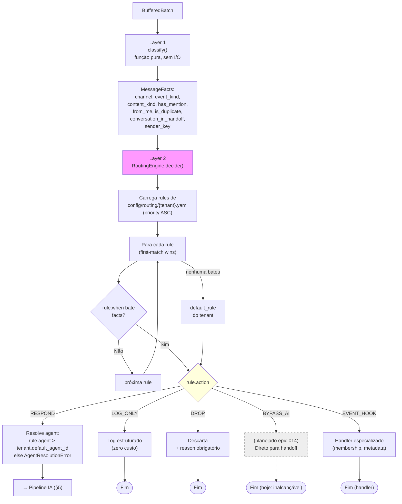
```mermaid
flowchart TD
    BATCH["BufferedBatch"] --> CLASSIFY["Layer 1<br/>classify()<br/>função pura, sem I/O"]
    CLASSIFY --> FACTS["MessageFacts:<br/>channel, event_kind,<br/>content_kind, has_mention,<br/>from_me, is_duplicate,<br/>conversation_in_handoff,<br/>sender_key"]
    FACTS --> DECIDE["Layer 2<br/>RoutingEngine.decide()"]
    DECIDE --> LOAD["Carrega rules de<br/>config/routing/{tenant}.yaml<br/>(priority ASC)"]
    LOAD --> LOOP["Para cada rule<br/>(first-match wins)"]
    LOOP --> MATCH{"rule.when bate<br/>facts?"}
    MATCH -->|Não| NEXT["próxima rule"]
    NEXT --> LOOP
    MATCH -->|Sim| ACTION{"rule.action"}
    LOOP -->|nenhuma bateu| DEFAULT["default_rule<br/>do tenant"]
    DEFAULT --> ACTION

    ACTION -->|RESPOND| RESP["Resolve agent:<br/>rule.agent > tenant.default_agent_id<br/>else AgentResolutionError"]
    ACTION -->|LOG_ONLY| LOG["Log estruturado<br/>(zero custo)"]
    ACTION -->|DROP| DROP["Descarta<br/>+ reason obrigatório"]
    ACTION -->|BYPASS_AI| BYP["(planejado epic 014)<br/>Direto para handoff"]
    ACTION -->|EVENT_HOOK| EH["Handler especializado<br/>(membership, metadata)"]

    RESP --> PIPE["→ Pipeline IA (§5)"]
    LOG --> END1(["Fim"])
    DROP --> END2(["Fim"])
    BYP -.-> END3(["Fim (hoje: inalcançável)"])
    EH --> END4(["Fim (handler)"])

    style DECIDE fill:#f9f
    style ACTION fill:#ffd
    style BYP fill:#eee,stroke:#999,stroke-dasharray: 5 5
```

</details>

### 3.1 Layer 1 — `classify()` (função pura)

Recebe BufferedBatch + estado pré-carregado (tenant, conversation state). Zero I/O.

```python
class MessageFacts:
    channel: Channel                       # individual | group
    event_kind: EventKind                  # message | group_membership | group_metadata | protocol | unknown
    content_kind: ContentKind              # 9 valores
    has_mention: bool                      # grupo: @ariel / @lid match
    from_me: bool                          # bot próprio (echo prevention)
    is_duplicate: bool                     # checkpoint pós-idempotência
    conversation_in_handoff: bool          # SEMPRE False até epic 014
    is_membership_event: bool
    sender_key: str                        # hash derivado para scoping
```

### 3.2 Layer 2 — `RoutingEngine.decide()` (declarativo YAML)

**5 ações MECE** (mutuamente exclusivas + coletivamente exaustivas):

| Ação | Efeito | Quando |
|------|--------|--------|
| `RESPOND` | Pipeline IA completo. `agent_id` resolvido: `rule.agent > tenant.default_agent_id > AgentResolutionError` | Caso comum: cliente mandou texto ou mídia em 1:1, ou @mention em grupo |
| `LOG_ONLY` | Log estruturado sem resposta. **Zero custo LLM.** | Grupo sem @mention, eventos de protocolo irrelevantes |
| `DROP` | Descarta silenciosamente. `reason` obrigatório. | Echo do bot (`from_me`), duplicata (via idempotência), emissor bloqueado |
| `BYPASS_AI` | Pula IA, vai direto para handler humano | **Planejado epic 014** — hoje inalcançável porque `conversation_in_handoff` é sempre False |
| `EVENT_HOOK` | Handler especializado, side-effect sem resposta | Events não-mensagem que precisam ação (ex.: membership change — atualizar lista de grupo) |

**Avaliação**: rules ordenadas por `priority` ASC, first-match wins. Cada rule tem:

```yaml
# config/routing/ariel.yaml (exemplo)
rules:
  - priority: 10
    when:
      from_me: true
    action: drop
    reason: "Echo do próprio bot"

  - priority: 20
    when:
      is_duplicate: true
    action: drop
    reason: "Duplicata pós-debounce"

  - priority: 30
    when:
      event_kind: group_membership
    action: event_hook
    handler: group_membership_handler

  - priority: 40
    when:
      channel: group
      has_mention: false
    action: log_only
    reason: "Grupo sem @mention"

  - priority: 100
    when:
      channel: individual
    action: respond
    # agent herdado de default_agent_id

default:
  action: log_only
  reason: "Não casou em nenhuma rule"
```

**Matchers de @mention em grupo**:
- `mention_phone` — número do bot (legacy `@s.whatsapp.net`)
- `mention_lid_opaque` — @lid opaco (WhatsApp moderno, descoberto empiricamente via capture tool)
- `mention_keywords` — lista (`@ariel`, `@resenhai`)
- Match quando bot é "chamado" na conversa

**Persiste**: cada `Decision` vira 1 row em `public.routing_decisions` (admin-only, sem RLS — [ADR-027](../decisions/ADR-027-admin-tables-no-rls.md)) com `matched_rule`, `action`, `agent_id` resolvido. Retenção 90d. Visível em `/admin/routing`.

**MECE auditado em 4 camadas**:
1. **Tipo** — enums Python Action/ContentKind/EventKind
2. **Schema** — Pydantic discriminated union rejeita overlaps
3. **Runtime** — Action enum exclusivo
4. **CI** — property-based test gera 10k MessageFacts aleatórios, garante exatamente 1 ação bate

---

## 4. Content Processing (step 6 do pipeline) ✅ — epic 009

**Por que existe**: até epic 008 mensagens não-texto eram **descartadas silenciosamente** por um `if message.text:` em `webhooks.py`. Cliente mandava áudio → 200 OK do webhook + SILÊNCIO. Nenhum trace, nenhuma resposta. Epic 009 inseriu o step `content_process` entre `save_inbound` (5) e `build_context` (7), com 1 processor por ContentKind.

### 4.1 Despacho por kind (diagrama central — o que acontece com cada tipo de conteúdo)

<details>
<summary>📊 Fluxograma — 4.1 Despacho por kind (diagrama central — o que acontece com cada tipo de conteúdo)</summary>

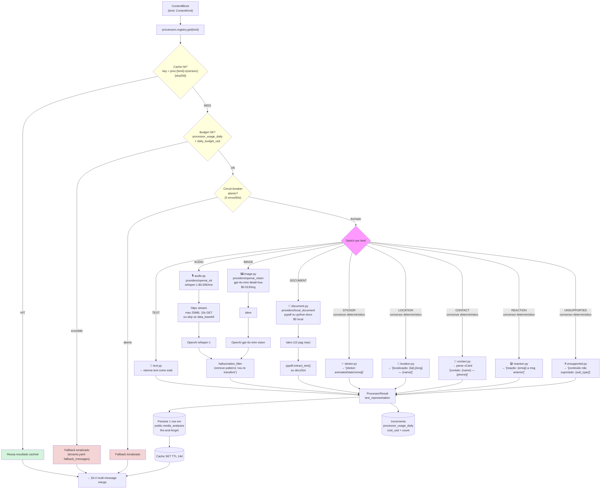
```mermaid
flowchart TD
    B["ContentBlock<br/>(kind: ContentKind)"] --> REG["processors.registry.get(kind)"]
    REG --> CACHE{"Cache hit?<br/>key = proc:{kind}:v{version}:{sha256}"}
    CACHE -->|HIT| OUT1["Reusa resultado cached"]
    CACHE -->|MISS| BUDGET{"Budget OK?<br/>processor_usage_daily<br/>< daily_budget_usd"}
    BUDGET -->|excedido| FB_BUDGET["Fallback tonalizado<br/>(tenants.yaml fallback_messages)"]
    BUDGET -->|OK| BREAKER{"Circuit breaker<br/>aberto?<br/>(5 erros/60s)"}
    BREAKER -->|aberto| FB_BRK["Fallback tonalizado"]
    BREAKER -->|fechado| KIND{"Switch por kind"}

    KIND -->|TEXT| T["📝 text.py<br/>→ retorna text como está"]
    KIND -->|AUDIO| A["🎙️ audio.py<br/>providers/openai_stt<br/>whisper-1 $0.006/min"]
    KIND -->|IMAGE| I["🖼️ image.py<br/>providers/openai_vision<br/>gpt-4o-mini detail=low<br/>$0.013/img"]
    KIND -->|DOCUMENT| D["📄 document.py<br/>providers/local_document<br/>pypdf ou python-docx<br/>$0 local"]
    KIND -->|STICKER<br/>conversor determinístico| S["✨ sticker.py<br/>→ '[sticker: animated/static/emoji]'"]
    KIND -->|LOCATION<br/>conversor determinístico| L["📍 location.py<br/>→ '[localização: {lat},{long} — {name}]'"]
    KIND -->|CONTACT<br/>conversor determinístico| C["👤 contact.py<br/>→ parse vCard<br/>'[contato: {name} — {phone}]'"]
    KIND -->|REACTION<br/>conversor determinístico| R["😀 reaction.py<br/>→ '[reação: {emoji} a msg anterior]'"]
    KIND -->|UNSUPPORTED<br/>conversor determinístico| U["❓ unsupported.py<br/>→ '[conteúdo não suportado: {sub_type}]'"]

    A --> DL["httpx stream<br/>max 25MB, 10s GET<br/>ou skip se data_base64"]
    I --> DL2["idem"]
    D --> DL3["idem (10 pag max)"]

    DL --> LLM_A["OpenAI whisper-1"]
    DL2 --> LLM_I["OpenAI gpt-4o-mini vision"]
    DL3 --> PARSE["pypdf.extract_text()<br/>ou docx2txt"]

    LLM_A --> HF["hallucination_filter<br/>(remove patterns 'vou te transferir')"]
    LLM_I --> HF
    HF --> RES["ProcessorResult<br/>text_representation"]
    PARSE --> RES
    T --> RES
    S --> RES
    L --> RES
    C --> RES
    R --> RES
    U --> RES

    RES --> PERSIST[("Persiste 1 row em<br/>public.media_analyses<br/>fire-and-forget")]
    RES --> INC[("Incrementa<br/>processor_usage_daily<br/>cost_usd + count")]
    PERSIST --> CACHE_SET[("Cache SET TTL 14d")]
    CACHE_SET --> MERGE["→ §4.4 multi-message merge"]
    OUT1 --> MERGE
    FB_BUDGET --> MERGE
    FB_BRK --> MERGE

    style CACHE fill:#ffd
    style BUDGET fill:#ffd
    style BREAKER fill:#ffd
    style KIND fill:#f9f
    style FB_BUDGET fill:#f4d4d4
    style FB_BRK fill:#f4d4d4
    style OUT1 fill:#d4f4dd
```

</details>

### 4.2 Tabela consolidada dos 9 processors

Dois grupos distintos: **providers externos** (podem falhar → fallback tonalizado) vs **conversores determinísticos locais** (input já tem tudo que o processor precisa → não existe "falhar").

| ContentKind | Tipo | Provider/Lógica | Custo | Latência típica | Fallback se provider falhar | Saída |
|-------------|------|-----------------|-------|-----------------|------------------------------|-------|
| `TEXT` | identidade | TextProcessor (passa direto) | $0 | <1ms | n/a | próprio texto |
| `AUDIO` | **provider externo** | OpenAI `whisper-1` ([ADR-033](../decisions/ADR-033-openai-stt-vision-provider.md)) | $0.006/min | 2-5s | "Opa, não consegui ouvir seu áudio — pode me escrever?" | transcript PT-BR (ou idioma detectado) |
| `IMAGE` | **provider externo** | OpenAI `gpt-4o-mini` vision (detail=low) | $0.013/img (85 tokens fixos) | 3-6s | "Não consegui ver sua imagem — pode descrever?" | descrição em linguagem natural |
| `DOCUMENT` | **provider local** | `pypdf` ou `python-docx` em processo | $0 | <1s (≤10 páginas) | "Não consegui ler seu documento" | texto extraído |
| `STICKER` | **conversor determinístico** | lê MIME do block | $0 | <1ms | n/a | `[sticker: animated]`, `[sticker: static]`, `[sticker: emoji]` |
| `LOCATION` | **conversor determinístico** | lê lat/long/nome do block | $0 | <1ms | n/a | `[localização: -23.55, -46.63 — Av Paulista 1000]` |
| `CONTACT` | **conversor determinístico** | parse vCard | $0 | <1ms | n/a | `[contato: João Silva — +5511999998888]` |
| `REACTION` | **conversor determinístico** | lê emoji + target_id do block | $0 | <1ms | n/a | `[reação: ❤️ a msg anterior]` |
| `UNSUPPORTED` | **conversor determinístico** | lê sub_type do block | $0 | <1ms | n/a | `[conteúdo não suportado: videoMessage]` |

**Por que conversores determinísticos não têm fallback**: sticker/location/contact/reaction/unsupported têm **todos os campos necessários no próprio ContentBlock** (já vieram normalizados do adapter). O processor só formata em string. Zero provider call → zero ponto de falha → `cost_usd=0`, `latency_ms=0`, `cache_hit=false`, sempre `status=OK`. Auditável em `media_analyses` com `provider='internal/sticker'` (ou `/location`, `/contact`, `/reaction`, `/unsupported`).

**Por que não passamos sticker/emoji pelo vision**: sticker do WhatsApp é WebP emoji-shaped. Chamar vision é "signal-to-cost ratio" ruim — o LLM iria "descrever um emoji" e gastar $0.013. A convenção é deixar o marker na concatenação e o **LLM de resposta (step 10)** decide se vale a pena reagir em contexto. Se o cliente mandou só um 😄, o agente pode responder com um 😄 também.

#### "Então o bot responde quando recebe só um sticker?"

**Sim, em conversa 1:1 — e a decisão do conteúdo fica com o LLM, não com o processor.** O fluxo é:

<details>
<summary>📊 Fluxograma — "Então o bot responde quando recebe só um sticker?"</summary>

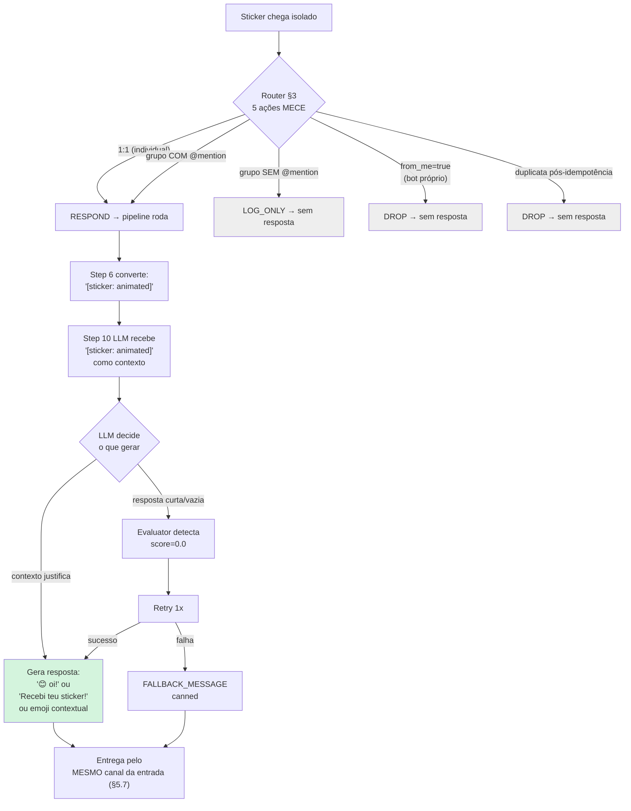
```mermaid
flowchart TD
    S["Sticker chega isolado"] --> R{"Router §3<br/>5 ações MECE"}
    R -->|"1:1 (individual)"| RESP["RESPOND → pipeline roda"]
    R -->|grupo SEM @mention| LOG["LOG_ONLY → sem resposta"]
    R -->|grupo COM @mention| RESP
    R -->|"from_me=true<br/>(bot próprio)"| D1["DROP → sem resposta"]
    R -->|duplicata pós-idempotência| D2["DROP → sem resposta"]

    RESP --> S6["Step 6 converte:<br/>'[sticker: animated]'"]
    S6 --> S10["Step 10 LLM recebe<br/>'[sticker: animated]'<br/>como contexto"]
    S10 --> DEC{"LLM decide<br/>o que gerar"}
    DEC -->|contexto justifica| REPLY["Gera resposta:<br/>'😊 oi!' ou<br/>'Recebi teu sticker!'<br/>ou emoji contextual"]
    DEC -->|resposta curta/vazia| EVAL["Evaluator detecta<br/>score=0.0"]
    EVAL --> RETRY["Retry 1x"]
    RETRY -->|falha| FB["FALLBACK_MESSAGE<br/>canned"]
    RETRY -->|sucesso| REPLY
    REPLY --> DELIVER["Entrega pelo<br/>MESMO canal da entrada (§5.7)"]
    FB --> DELIVER

    style LOG fill:#eee
    style D1 fill:#eee
    style D2 fill:#eee
    style REPLY fill:#d4f4dd
```

</details>

**Mesmo princípio para location/contact/reaction/unsupported**: o marker vai para o LLM, que interpreta e responde. Exemplos:
- **Localização** enviada → LLM pode responder "Anotei sua localização! Como posso ajudar?"
- **Contato** vCard → LLM pode perguntar "Você quer que eu adicione esse contato a algum lugar?"
- **Reação** ❤️ → LLM pode ignorar ou responder com outra reação
- **Unsupported** (vídeo, poll) → LLM pode responder "Recebi seu vídeo mas ainda não consigo assistir — pode descrever?"

**A responsabilidade do conversor determinístico é ÚNICA**: garantir que o pipeline **não engasga** em kinds não-processáveis por LLM e que o LLM recebe um marker legível para decidir.

**Registry é autoritativo**: pipeline step 6 chama `processors.registry.get(block.kind).process(block, ctx)`. Para adicionar uma 10ª modalidade, basta implementar `ContentProcessor` + `register()` em startup — zero edit em pipeline/router.

**Download binário**:
- `httpx` stream para memória, **max 25MB** (limite Whisper), timeout 10s GET + 15s Whisper/Vision
- **Pula download** quando o adapter já enviou `data_base64` inline → reduz latência ~100-300ms
- Rejeita antes de gastar banda se `content-length > 25MB`

### 4.3 Cache obrigatório

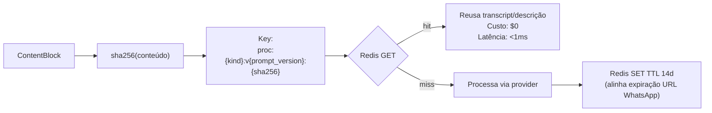
```mermaid
flowchart LR
    B["ContentBlock"] --> H["sha256(conteúdo)"]
    H --> K["Key:<br/>proc:{kind}:v{prompt_version}:{sha256}"]
    K --> R{"Redis GET"}
    R -->|hit| REUSE["Reusa transcript/descrição<br/>Custo: $0<br/>Latência: <1ms"]
    R -->|miss| PROC["Processa via provider"]
    PROC --> SET["Redis SET TTL 14d<br/>(alinha expiração URL WhatsApp)"]
```

- **Key**: `proc:{kind}:v{prompt_version}:{sha256(content)}`
- **TTL**: 14 dias (alinha com expiração natural de signed URL Meta/Evolution)
- **Bump invalidation**: mudar `prompt_version` na key → cache miss forçado sem flush manual
- **Por que sha256 do conteúdo**: mesmo áudio/imagem enviados 2x → reaproveita sem custo (cliente re-encaminha para confirmar, vários clientes enviam o mesmo cartão corporativo)

### 4.4 Budget per-tenant + Circuit Breaker

<details>
<summary>📊 Fluxograma — 4.4 Budget per-tenant + Circuit Breaker</summary>

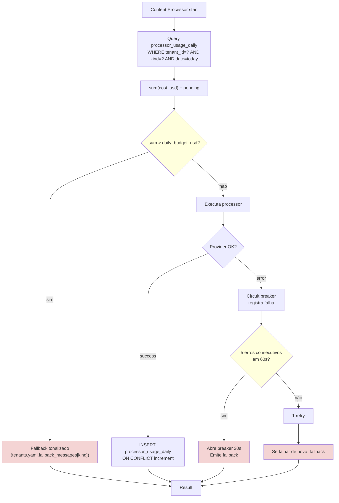
```mermaid
flowchart TD
    START["Content Processor start"] --> QB["Query processor_usage_daily<br/>WHERE tenant_id=? AND kind=? AND date=today"]
    QB --> SUM["sum(cost_usd) + pending"]
    SUM --> CHECK{"sum > daily_budget_usd?"}
    CHECK -->|sim| FALLBACK["Fallback tonalizado<br/>(tenants.yaml.fallback_messages[kind])"]
    CHECK -->|não| RUN["Executa processor"]
    RUN --> TRY{"Provider OK?"}
    TRY -->|success| INC["INSERT processor_usage_daily<br/>ON CONFLICT increment"]
    TRY -->|error| BRK["Circuit breaker<br/>registra falha"]
    BRK --> COUNT{"5 erros consecutivos<br/>em 60s?"}
    COUNT -->|sim| OPEN["Abre breaker 30s<br/>Emite fallback"]
    COUNT -->|não| RETRY["1 retry"]
    RETRY --> FALLBACK2["Se falhar de novo: fallback"]
    INC --> OUT["Result"]
    OPEN --> OUT
    FALLBACK --> OUT
    FALLBACK2 --> OUT

    style CHECK fill:#ffd
    style COUNT fill:#ffd
    style FALLBACK fill:#f4d4d4
    style FALLBACK2 fill:#f4d4d4
    style OPEN fill:#f4d4d4
```

</details>

**`processor_usage_daily`**: tabela admin-only (sem RLS — [ADR-027](../decisions/ADR-027-admin-tables-no-rls.md)). Agregação diária por `(tenant_id, kind, provider, date)`.
**Check pré-run**: single-row query (`SELECT cost_usd FROM processor_usage_daily WHERE ...`) — <1ms.
**Enforcement**: acima do budget → mensagem tonalizada pela persona. **NUNCA** erro técnico cru para o end-user.
**Circuit breaker** (`processors/breaker.py`): 5 erros consecutivos em 60s por provider → abre 30s. Auto-healing.

### 4.5 Multi-message merge — o caso "foto + áudio + texto em 3s"

O debounce (§2.3) pode agrupar **N CanonicalInboundMessages** do mesmo sender em um batch único. Cada uma dessas mensagens pode carregar **M ContentBlocks**. O step 6 faz **fan-out por block** — não por mensagem — e concatena todos os `text_representation` em ordem cronológica numa string única consumida pelo pipeline IA.

**Cenário concreto**: usuário manda em sequência rápida (dentro da janela do debounce):
1. 📸 **Foto** do problema (sem caption)
2. 🎙️ **Áudio** explicando o que está acontecendo (15s)
3. 💬 **Texto** "número do pedido 12345"

<details>
<summary>📊 Sequência — 4.5 Multi-message merge — o caso "foto + áudio + texto em 3s"</summary>

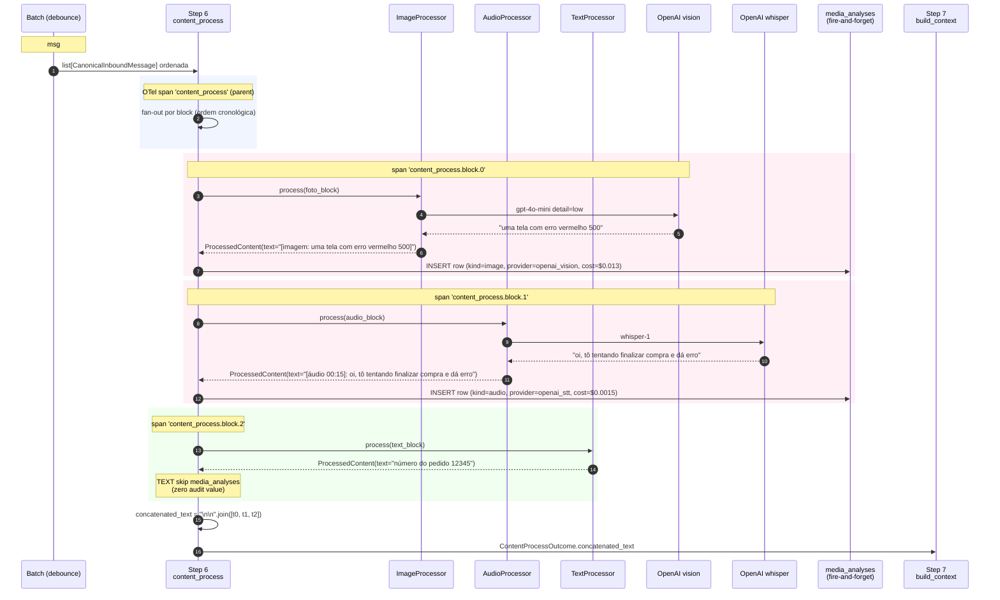
```mermaid
sequenceDiagram
    autonumber
    participant B as Batch (debounce)
    participant S6 as Step 6<br/>content_process
    participant IP as ImageProcessor
    participant AP as AudioProcessor
    participant TP as TextProcessor
    participant VIS as OpenAI vision
    participant STT as OpenAI whisper
    participant MA as media_analyses<br/>(fire-and-forget)
    participant S7 as Step 7<br/>build_context

    Note over B: msg#1 foto<br/>msg#2 áudio (PTT)<br/>msg#3 texto

    B->>S6: list[CanonicalInboundMessage] ordenada

    rect rgb(240, 245, 255)
    Note over S6: OTel span 'content_process' (parent)
    S6->>S6: fan-out por block (ordem cronológica)
    end

    rect rgb(255, 240, 245)
    Note over S6,VIS: span 'content_process.block.0'
    S6->>IP: process(foto_block)
    IP->>VIS: gpt-4o-mini detail=low
    VIS-->>IP: "uma tela com erro vermelho 500"
    IP-->>S6: ProcessedContent(text="[imagem: uma tela com erro vermelho 500]")
    S6->>MA: INSERT row (kind=image, provider=openai_vision, cost=$0.013)
    end

    rect rgb(255, 240, 245)
    Note over S6,STT: span 'content_process.block.1'
    S6->>AP: process(audio_block)
    AP->>STT: whisper-1
    STT-->>AP: "oi, tô tentando finalizar compra e dá erro"
    AP-->>S6: ProcessedContent(text="[áudio 00:15]: oi, tô tentando finalizar compra e dá erro")
    S6->>MA: INSERT row (kind=audio, provider=openai_stt, cost=$0.0015)
    end

    rect rgb(240, 255, 240)
    Note over S6: span 'content_process.block.2'
    S6->>TP: process(text_block)
    TP-->>S6: ProcessedContent(text="número do pedido 12345")
    Note over S6: TEXT skip media_analyses<br/>(zero audit value)
    end

    S6->>S6: concatenated_text = "\n\n".join([t0, t1, t2])
    S6->>S7: ContentProcessOutcome.concatenated_text
```

</details>

**Output consolidado** entregue ao pipeline IA:

```
[imagem: uma tela com erro vermelho 500]

[áudio 00:15]: oi, tô tentando finalizar compra e dá erro

número do pedido 12345
```

**Efeito operacional**:
- 1 única chamada LLM em step 10 com as 3 modalidades como contexto único
- Agente entende "cliente tem erro 500 ao finalizar compra do pedido 12345" e responde apropriadamente
- 2 rows em `public.media_analyses` (foto + áudio) — TEXT é skippado porque não tem valor de audit
- 3 child spans em Trace Explorer dentro do parent `content_process`: `content_process.block.0`, `.1`, `.2`
- Custo deste step: $0.013 (vision) + $0.0015 (whisper 15s) = **$0.0145**

**Ordem preservada** — a ordem de envio é a ordem na concatenação. Suporta casos reais:
- "manda foto, depois áudio explicando" (exemplo acima)
- "manda áudio, depois texto complementar"
- "manda caption + imagem" (1 mensagem, 2 blocks)
- "manda 3 textos rápidos" (debounce junta, pipeline roda 1x)

### 4.6 Feature flags per-tenant (`tenants.yaml`)

```yaml
content_processing:
  enabled: true            # master switch do módulo
  audio_enabled: true
  image_enabled: true
  document_enabled: false  # desligado para este tenant
  daily_budget_usd: 5.0
  fallback_messages:
    audio: "Opa, hoje estou sem energia para áudios longos — pode me resumir por texto?"
    image: "Não consegui ver sua imagem agora — pode descrever?"
    document: "Não consegui ler seu documento — pode colar o conteúdo aqui?"
```

**Default**: tudo `false` (rollout gradual — Ariel primeiro, ResenhAI depois).
**Hot reload**: `config_poller` relê `tenants.yaml` a cada 60s → flag toggle sem restart.

### 4.7 Hallucination filter

`processors/hallucination_filter.py` — pós-processamento em cima do output dos processors LLM (audio/image) que detecta padrões típicos de alucinação ("vou te transferir para nossa equipe", "estou encaminhando") e os substitui por transcript/descrição neutros. Garante que o conteúdo processado reflete apenas o que o usuário enviou.

**Dados (step 6 consolidado)**:
- **Entra**: `list[ContentBlock]` do batch
- **Checa cache** (sha256) → hit = reusa
- **Checa budget** → excedido = fallback tonalizado
- **Checa breaker** → aberto = fallback
- **Processa** provider-específico
- **Filtra alucinação** (audio + image)
- **Persiste**: 1 row em `public.media_analyses` por block (admin-only, fire-and-forget) com transcript/descrição completos, custo, duração, provider, timestamps
- **Agrega**: incrementa `processor_usage_daily.count` + `cost_usd`
- **Sai**: `text_representation` única (concatenação)
- **Retention** ([ADR-034](../decisions/ADR-034-media-retention-policy.md)): `url` NULL após 14d, DELETE completo após 90d via cron diário

---

## 5. Pipeline IA (13 steps) ✅

Orquestrado em `prosauai.conversation.pipeline.process_conversation()`. Cada step emite 1 OTel span + 1 row em `public.trace_steps` (admin-only, fire-and-forget — [ADR-028](../decisions/ADR-028-pipeline-fire-and-forget-persistence.md)). **Timeout end-to-end**: 28s (SLA 30s menos margem para deliver).

### 5.1 Sequência completa

<details>
<summary>📊 Sequência — 5.1 Sequência completa</summary>

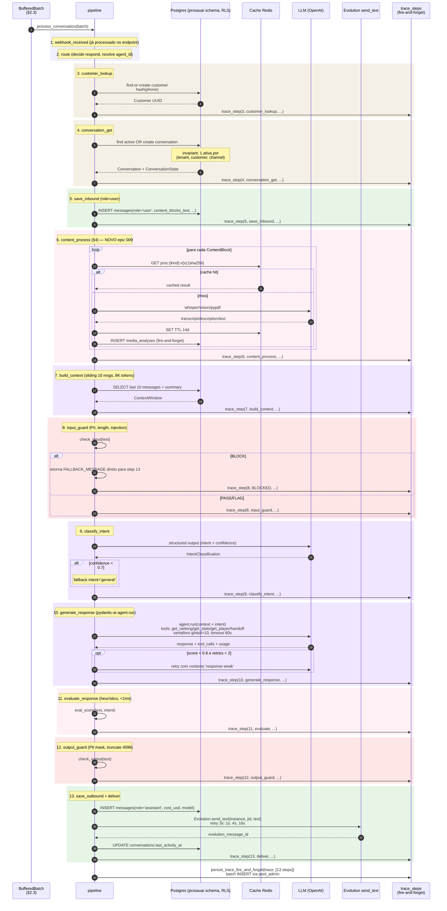
```mermaid
sequenceDiagram
    autonumber
    participant B as BufferedBatch<br/>(§2.3)
    participant P as pipeline
    participant DB as Postgres (prosauai schema, RLS)
    participant C as Cache Redis
    participant L as LLM (OpenAI)
    participant OUT as Evolution send_text
    participant T as trace_steps<br/>(fire-and-forget)

    B->>P: process_conversation(batch)

    rect rgb(240, 240, 255)
    Note over P: 1. webhook_received (já processado no endpoint)
    Note over P: 2. route (decide respond, resolve agent_id)
    end

    rect rgb(245, 240, 230)
    Note over P: 3. customer_lookup
    P->>DB: find-or-create customer<br/>hash(phone)
    DB-->>P: Customer UUID
    P->>T: trace_step(3, customer_lookup, ...)
    end

    rect rgb(245, 240, 230)
    Note over P: 4. conversation_get
    P->>DB: find active OR create conversation
    Note over DB: invariant: 1 ativa por<br/>(tenant, customer, channel)
    DB-->>P: Conversation + ConversationState
    P->>T: trace_step(4, conversation_get, ...)
    end

    rect rgb(230, 245, 230)
    Note over P: 5. save_inbound (role=user)
    P->>DB: INSERT messages(role='user', content_blocks_text, ...)
    P->>T: trace_step(5, save_inbound, ...)
    end

    rect rgb(255, 240, 245)
    Note over P: 6. content_process (§4) — NOVO epic 009
    loop para cada ContentBlock
        P->>C: GET proc:{kind}:v{v}:{sha256}
        alt cache hit
            C-->>P: cached result
        else miss
            P->>L: whisper/vision/pypdf
            L-->>P: transcript/description/text
            P->>C: SET TTL 14d
            P->>DB: INSERT media_analyses (fire-and-forget)
        end
    end
    P->>T: trace_step(6, content_process, ...)
    end

    rect rgb(240, 230, 255)
    Note over P: 7. build_context (sliding 10 msgs, 8K tokens)
    P->>DB: SELECT last 10 messages + summary
    DB-->>P: ContextWindow
    P->>T: trace_step(7, build_context, ...)
    end

    rect rgb(255, 230, 230)
    Note over P: 8. input_guard (PII, length, injection)
    P->>P: check_input(text)
    alt BLOCK
        P->>P: retorna FALLBACK_MESSAGE direto para step 13
        P->>T: trace_step(8, BLOCKED, ...)
    else PASS/FLAG
        P->>T: trace_step(8, input_guard, ...)
    end
    end

    rect rgb(240, 230, 255)
    Note over P: 9. classify_intent
    P->>L: structured output (intent + confidence)
    L-->>P: IntentClassification
    alt confidence < 0.7
        Note over P: fallback intent='general'
    end
    P->>T: trace_step(9, classify_intent, ...)
    end

    rect rgb(240, 230, 255)
    Note over P: 10. generate_response (pydantic-ai agent.run)
    P->>L: agent.run(context + intent)<br/>tools: get_ranking/get_stats/get_player/handoff<br/>semáforo global=10, timeout 60s
    L-->>P: response + tool_calls + usage
    opt score < 0.8 e retries < 2
        P->>L: retry com contexto 'response weak'
    end
    P->>T: trace_step(10, generate_response, ...)
    end

    rect rgb(255, 240, 245)
    Note over P: 11. evaluate_response (heurístico, <1ms)
    P->>P: eval_score(text, intent)
    P->>T: trace_step(11, evaluate, ...)
    end

    rect rgb(255, 230, 230)
    Note over P: 12. output_guard (PII mask, truncate 4096)
    P->>P: check_output(text)
    P->>T: trace_step(12, output_guard, ...)
    end

    rect rgb(230, 245, 230)
    Note over P: 13. save_outbound + deliver
    P->>DB: INSERT messages(role='assistant', cost_usd, model)
    P->>OUT: Evolution.send_text(instance, jid, text)<br/>retry 3x: 1s, 4s, 16s
    OUT-->>P: evolution_message_id
    P->>DB: UPDATE conversations.last_activity_at
    P->>T: trace_step(13, deliver, ...)
    end

    P->>T: persist_trace_fire_and_forget(trace, [13 steps])<br/>batch INSERT via pool_admin
```

</details>

### 5.2 Tabela dos 13 steps

| # | Step | Propósito | Entra | Sai | Skip quando |
|---|------|-----------|-------|-----|-------------|
| 1 | `webhook_received` | Recebe payload bruto | JSON nativo | Request | nunca |
| 2 | `route` | Roteia (layer 1+2), resolve `agent_id` | CanonicalInboundMessage + facts | Decision + agent_id | nunca |
| 3 | `customer_lookup` | Find-or-create customer por `hash(phone)` | `sender.external_id` | Customer UUID | — |
| 4 | `conversation_get` | Find-or-create conversation ativa + timeout de inatividade | customer + channel | Conversation + State | — |
| 5 | `save_inbound` | Persiste mensagem recebida (role=user) | raw message | Message row | — |
| 6 | `content_process` | **[epic 009]** Processa 9 kinds via registry | ContentBlocks | text_representation | TEXT puro trivial (passa direto) |
| 7 | `build_context` | Sliding window 10 msgs + summary async (gera após 20 exchanges) | conversation_state | ContextWindow | nunca |
| 8 | `input_guard` | PII (CPF/tel/email), length, prompt injection | texto consolidado | PASS/FLAG/BLOCK | — |
| 9 | `classify_intent` | LLM structured output → intent + confidence. Fallback `general` se <0.7 | texto sanitizado | IntentClassification | `input_guard=BLOCK` |
| 10 | `generate_response` | pydantic-ai `agent.run()`; tools; semáforo 10, timeout 60s, 1 retry | contexto + intent | GenerationResult | `input_guard=BLOCK` |
| 11 | `evaluate_response` | Heurístico — score 0-1 por fit à intent, tamanho, tonalidade | GenerationResult | APPROVE/RETRY/ESCALATE | — |
| 12 | `output_guard` | PII mask, trunca a 4096 chars | texto | texto sanitizado | `evaluate=BLOCK` |
| 13 | `save_outbound + deliver` | Persiste (role=assistant) + `Evolution.send_text` retry 3x | texto final | evolution_message_id | nunca |

### 5.3 Context assembly — 4 camadas (step 7)

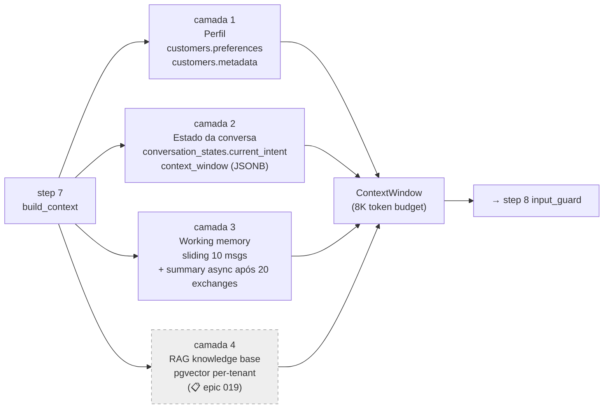
```mermaid
flowchart LR
    S["step 7<br/>build_context"] --> L1["camada 1<br/>Perfil<br/>customers.preferences<br/>customers.metadata"]
    S --> L2["camada 2<br/>Estado da conversa<br/>conversation_states.current_intent<br/>context_window (JSONB)"]
    S --> L3["camada 3<br/>Working memory<br/>sliding 10 msgs<br/>+ summary async após 20 exchanges"]
    S --> L4["camada 4<br/>RAG knowledge base<br/>pgvector per-tenant<br/>(📋 epic 019)"]
    L1 & L2 & L3 & L4 --> CTX["ContextWindow<br/>(8K token budget)"]
    CTX --> STEP8["→ step 8 input_guard"]
    style L4 fill:#eee,stroke:#999,stroke-dasharray: 5 5
```

**Cross-conversation memory**: dados estruturados (`customers.preferences`, metadata, últimas N conversas). **NÃO há** vector long-term memory ainda.

### 5.4 Safety — input_guard (step 8) + output_guard (step 12)

<details>
<summary>📊 Fluxograma — 5.4 Safety — input_guard (step 8) + output_guard (step 12)</summary>

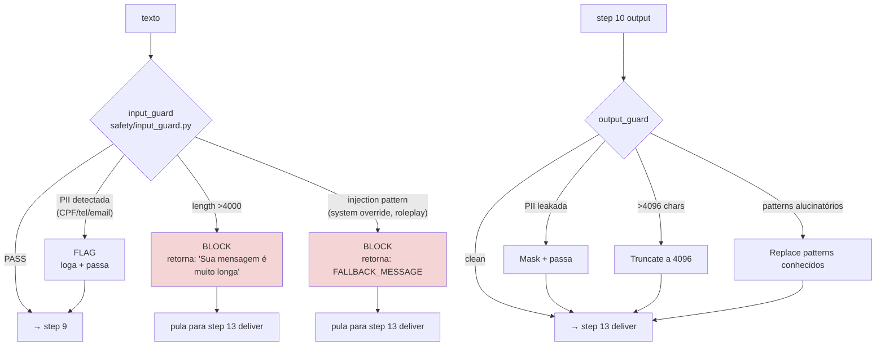
```mermaid
flowchart TD
    IN["texto"] --> G1{"input_guard<br/>safety/input_guard.py"}
    G1 -->|"PII detectada<br/>(CPF/tel/email)"| FLAG["FLAG<br/>loga + passa"]
    G1 -->|length >4000| BLOCK_L["BLOCK<br/>retorna: 'Sua mensagem é<br/>muito longa'"]
    G1 -->|"injection pattern<br/>(system override, roleplay)"| BLOCK_I["BLOCK<br/>retorna: FALLBACK_MESSAGE"]
    G1 -->|PASS| STEP9["→ step 9"]
    FLAG --> STEP9
    BLOCK_L --> END1["pula para step 13 deliver"]
    BLOCK_I --> END2["pula para step 13 deliver"]

    STEP10["step 10 output"] --> G2{"output_guard"}
    G2 -->|PII leakada| MASK["Mask + passa"]
    G2 -->|>4096 chars| TRUNC["Truncate a 4096"]
    G2 -->|patterns alucinatórios| REPLACE["Replace patterns conhecidos"]
    G2 -->|clean| STEP13["→ step 13 deliver"]
    MASK --> STEP13
    TRUNC --> STEP13
    REPLACE --> STEP13

    style BLOCK_L fill:#f4d4d4
    style BLOCK_I fill:#f4d4d4
```

</details>

### 5.5 Agent run — pydantic-ai (step 10)

<details>
<summary>📊 Fluxograma — 5.5 Agent run — pydantic-ai (step 10)</summary>

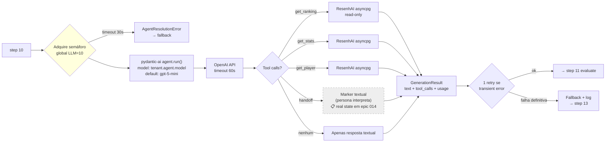
```mermaid
flowchart LR
    STEP10["step 10"] --> SEM{"Adquire semáforo<br/>global LLM=10"}
    SEM -->|timeout 30s| REJ["AgentResolutionError<br/>→ fallback"]
    SEM --> AGENT["pydantic-ai agent.run()<br/>model: tenant.agent.model<br/>default: gpt-5-mini"]
    AGENT --> CALL["OpenAI API<br/>timeout 60s"]
    CALL --> TOOLS{"Tool calls?"}
    TOOLS -->|get_ranking| RES1["ResenhAI asyncpg<br/>read-only"]
    TOOLS -->|get_stats| RES2["ResenhAI asyncpg"]
    TOOLS -->|get_player| RES3["ResenhAI asyncpg"]
    TOOLS -->|handoff| HF["Marker textual<br/>(persona interpreta)<br/>📋 real state em epic 014"]
    TOOLS -->|nenhum| RES["Apenas resposta textual"]
    RES1 & RES2 & RES3 & HF & RES --> OUT["GenerationResult<br/>text + tool_calls + usage"]
    OUT --> RETRY{"1 retry se<br/>transient error"}
    RETRY -->|ok| DONE["→ step 11 evaluate"]
    RETRY -->|falha definitiva| FB["Fallback + log<br/>→ step 13"]

    style SEM fill:#ffd
    style HF fill:#eee,stroke:#999,stroke-dasharray: 5 5
```

</details>

- **Modelo default**: `gpt-5-mini` ([ADR-025](../decisions/ADR-025-gpt5-4-mini-default-model.md)), configurável por agente via `agents.model`
- **Single call default**: um `agent.run()` por conversa ativa
- **Pipeline steps configuráveis por agente** (classifier → clarifier → resolver → specialist): **PLANEJADO epic 022** — hoje só single call
- **Tools**: `get_ranking`, `get_stats`, `get_player` (ResenhAI asyncpg read-only), `handoff` (marker textual)
- **Agent config versionado** ([ADR-019](../decisions/ADR-019-agent-config-versioning.md)): mudar prompt cria nova versão; admin `/admin/agents/{id}` mostra diff e ativa via `audit_log` INSERT
- **Custo tracking**: `calculate_cost(tokens, model)` ([pricing.py](../decisions/ADR-029-cost-pricing-constant.md)) → persiste em `messages.cost_usd` + agrega em `processor_usage_daily`

### 5.6 Evaluator — decision tree (step 11)

> **Importante**: o evaluator de hoje é **heurístico determinístico — NÃO é LLM**. Zero latência adicional (<1ms), zero custo. O objetivo é pegar **falhas óbvias de geração** (resposta vazia, encoding corrompido, resposta curta demais, truncamento por overflow) — **não** avaliar "qualidade de conteúdo" subjetiva. Upgrade para LLM-as-judge já tem protocol pronto (`ResponseEvaluator` em `evaluator.py`) mas não está implementado. Ver §9 (Evals planejadas) para epic 016 online + 017 offline.

**Score é discreto**, não contínuo:

| Score | Significado | Ação pipeline |
|-------|-------------|---------------|
| **1.0** | Output passou todos os heurísticos (length válido, encoding ok, não-vazio) | APPROVE → step 12 |
| **0.5** | Output excedeu 4000 chars e foi **truncado em sentence boundary** (entrega parcial, não é falha) | APPROVE (truncado) → step 12 |
| **0.0** | Output vazio, whitespace-only, encoding garbled (C0/C1 chars fora de `\n\r\t`), ou <10 chars | RETRY (1x) → FALLBACK canned |

**Checks executados** (ordem): empty/whitespace → too-short (<10 chars) → bad-encoding (C0/C1 proibido) → too-long (trunca em sentence boundary, score=0.5).

<details>
<summary>📊 Fluxograma — 5.6 Evaluator — decision tree (step 11)</summary>

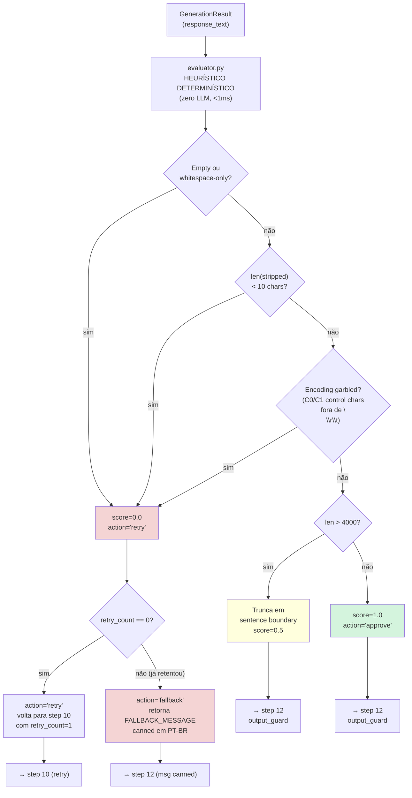
```mermaid
flowchart TD
    GR["GenerationResult<br/>(response_text)"] --> EV["evaluator.py<br/>HEURÍSTICO DETERMINÍSTICO<br/>(zero LLM, <1ms)"]
    EV --> C1{"Empty ou<br/>whitespace-only?"}
    C1 -->|sim| F["score=0.0<br/>action='retry'"]
    C1 -->|não| C2{"len(stripped)<br/>< 10 chars?"}
    C2 -->|sim| F
    C2 -->|não| C3{"Encoding garbled?<br/>(C0/C1 control chars<br/>fora de \\n\\r\\t)"}
    C3 -->|sim| F
    C3 -->|não| C4{"len > 4000?"}
    C4 -->|sim| TRUNC["Trunca em<br/>sentence boundary<br/>score=0.5"]
    C4 -->|não| OK["score=1.0<br/>action='approve'"]

    TRUNC --> STEP12A["→ step 12<br/>output_guard"]
    OK --> STEP12B["→ step 12<br/>output_guard"]

    F --> RT{"retry_count == 0?"}
    RT -->|sim| RETRY["action='retry'<br/>volta para step 10<br/>com retry_count=1"]
    RT -->|"não (já retentou)"| FB["action='fallback'<br/>retorna FALLBACK_MESSAGE<br/>canned em PT-BR"]
    RETRY --> STEP10["→ step 10 (retry)"]
    FB --> STEP12C["→ step 12 (msg canned)"]

    style OK fill:#d4f4dd
    style TRUNC fill:#ffd
    style F fill:#f4d4d4
    style FB fill:#f4d4d4
```

</details>

**O que o evaluator de hoje NÃO faz** (e que se espera confundir com ele):
- ❌ Não avalia "fit à intent" — isso é trabalho do LLM de geração (step 10)
- ❌ Não avalia tonalidade de persona — idem
- ❌ Não detecta tópicos críticos (suicídio, violência, legal) — NENHUM módulo faz isso hoje
- ❌ Não entende semântica — qualquer string válida de 10+ chars UTF-8 clean passa
- ❌ Não emite `ESCALATE` — apenas `approve` ou `retry` ou `fallback`

**ESCALATE → handoff** (o que o usuário lê como "passa para humano") está referenciado em ADRs como comportamento futuro via **tool call do agent** (`handoff` tool como marker textual) combinado com `close_reason='escalated'`. Hoje **não há trigger automático de ESCALATE pelo evaluator**. O real workflow de handoff (PENDING → ASSIGNED → HUMAN_ACTIVE) é escopo do **epic 014** — ver §6.

**Onde o score é persistido**: cada response tem 1 row em `eval_scores` (tabela business com RLS, retention 90d). Campo `quality_score NUMERIC(3,2)` ∈ {0.00, 0.50, 1.00}. Admin `/admin/performance` agrega média por agente ao longo do tempo.

### 5.7 Delivery (step 13) — regra de ouro + retry

**Regra de ouro**: a resposta sai pelo **mesmo canal que recebeu a mensagem**. O `source` do `CanonicalInboundMessage` propaga através do pipeline inteiro e o router de saída despacha para o `MessagingProvider` correspondente:

- Entrou por **Evolution** (`source="evolution"`) → `EvolutionProvider.send_text(instance, jid, text)` ✅
- Entrou por **Meta Cloud** (`source="meta_cloud"`) → `MetaCloudProvider.send_text(phone_number_id, wa_id, text)` **📋 não implementado**

<details>
<summary>📊 Fluxograma — 5.7 Delivery (step 13) — regra de ouro + retry</summary>

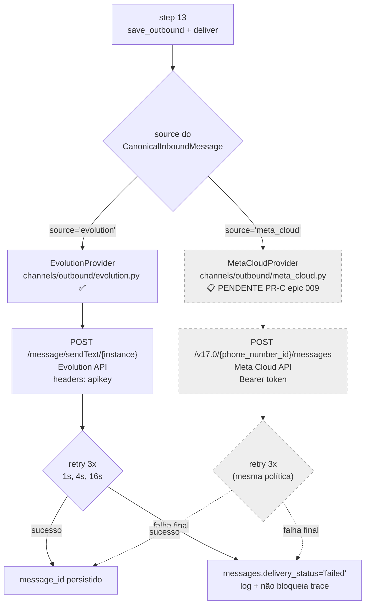
```mermaid
flowchart TD
    S13["step 13<br/>save_outbound + deliver"] --> ROUTE{"source do<br/>CanonicalInboundMessage"}
    ROUTE -->|source='evolution'| E["EvolutionProvider<br/>channels/outbound/evolution.py ✅"]
    ROUTE -->|source='meta_cloud'| M["MetaCloudProvider<br/>channels/outbound/meta_cloud.py<br/>📋 PENDENTE PR-C epic 009"]
    E --> POST_E["POST /message/sendText/{instance}<br/>Evolution API<br/>headers: apikey"]
    M -.-> POST_M["POST /v17.0/{phone_number_id}/messages<br/>Meta Cloud API<br/>Bearer token"]
    POST_E --> R_E{"retry 3x<br/>1s, 4s, 16s"}
    POST_M -.-> R_M{"retry 3x<br/>(mesma política)"}
    R_E -->|sucesso| OK["message_id persistido"]
    R_E -->|falha final| FAIL["messages.delivery_status='failed'<br/>log + não bloqueia trace"]
    R_M -.->|sucesso| OK
    R_M -.->|falha final| FAIL

    style M fill:#eee,stroke:#999,stroke-dasharray: 5 5
    style POST_M fill:#eee,stroke:#999,stroke-dasharray: 5 5
    style R_M fill:#eee,stroke:#999,stroke-dasharray: 5 5
```

</details>

**Status atual (gap)**:
- ✅ `apps/api/prosauai/channels/outbound/evolution.py` existe e implementa `MessagingProvider.send_text` + `send_media`
- ❌ `apps/api/prosauai/channels/outbound/meta_cloud.py` **não existe**
- Consequência: um tenant que só configurou Meta Cloud como canal de entrada **não consegue responder** — resolver isso é follow-up do PR-C do epic 009
- Workaround temporário: tenants multi-canal (que também têm Evolution) respondem via Evolution mesmo recebendo via Meta Cloud — subideal porque o cliente pode notar a inconsistência (ex.: número diferente aparecendo no WhatsApp)

**Retry policy (aplicável a ambos os providers quando implementados)**:

<details>
<summary>📊 Sequência — 5.7 Delivery (step 13) — regra de ouro + retry</summary>

```mermaid
sequenceDiagram
    autonumber
    participant P as pipeline step 13
    participant DB as Postgres (RLS)
    participant MP as MessagingProvider<br/>(Evolution hoje,<br/>Meta Cloud 📋)
    participant U as 👤 Cliente WhatsApp

    P->>DB: INSERT messages(role='assistant',<br/>content, model, cost_usd,<br/>source=<mesmo da entrada>)
    P->>MP: send_text(instance/phone_number_id,<br/>jid/wa_id, text)
    alt attempt 1 OK
        MP-->>P: 200 + message_id
    else attempt 1 fail
        Note over P: wait 1s
        P->>MP: retry #1
        alt attempt 2 OK
            MP-->>P: 200 + message_id
        else attempt 2 fail
            Note over P: wait 4s
            P->>MP: retry #2
            alt attempt 3 OK
                MP-->>P: 200 + message_id
            else attempt 3 fail
                Note over P: wait 16s
                P->>MP: retry #3 (último)
                alt success
                    MP-->>P: 200 + message_id
                else final fail
                    P->>DB: messages.delivery_status='failed'
                    Note over P: log erro,<br/>não bloqueia trace persist
                end
            end
        end
    end
    MP->>U: Mensagem entregue pelo canal de origem
    P->>DB: UPDATE conversations.last_activity_at
    P->>DB: UPDATE conversation_states<br/>message_count++, token_count+=N
```

</details>

**Por que manter o canal de origem importa** (business reason):
- Cliente enxerga um **número/identidade consistente** — se recebe resposta de número diferente, desconfia
- Custo de Meta Cloud (oficial) é diferente de Evolution (não-oficial) — mesclar mina o controle financeiro
- Features específicas (botões, templates aprovados Meta) só existem no Meta Cloud — responder por Evolution perde esse valor
- Multi-canal real só funciona quando outbound respeita origem — caso contrário é single-channel na prática

---

## 6. Handoff Humano 📋 — epic 014

**Estado atual**: parcialmente presente como **1 closing reason** (`escalated`) + **1 marker textual** no agent tool. **SEM state machine, SEM notificação de operador, SEM UI de atendimento humano**.

### 6.1 O que existe hoje

```mermaid
flowchart LR
    EV["step 11 evaluate"] --> DEC{"score/tópico"}
    DEC -->|APPROVE| OK["→ step 12"]
    DEC -->|ESCALATE| C["UPDATE conversations<br/>SET status='closed',<br/>close_reason='escalated'"]
    C --> M["Mensagem padrão:<br/>'Vou passar para nosso time'"]
    M --> END["FIM da conversa<br/>(não há quem retome)"]
    style C fill:#ffd
    style END fill:#f4d4d4
```

- `conversations.close_reason` enum inclui `escalated`, `user_closed`, `inactivity_timeout`, `agent_closed`
- Flag `conversation_in_handoff` no `MessageFacts` sempre `False` ([core/router/facts.py comentário explícito](../../../apps/api/prosauai/core/router/facts.py))
- Agent tool `handoff` marker — persona pode verbalizar "vou te passar" mas é string, não transição de estado
- **Resultado operacional hoje**: ESCALATE fecha a conversa. Ninguém recebe notificação. Se o cliente responder depois, vira conversa nova com IA.

### 6.2 O que epic 014 entregará 📋

```mermaid
stateDiagram-v2
    [*] --> AGENT_ACTIVE
    AGENT_ACTIVE --> PENDING: ESCALATE (score<0.5<br/>ou tópico crítico<br/>ou cliente pediu)
    PENDING --> ASSIGNED: Operador aceita (<5min)
    PENDING --> AGENT_ACTIVE: Timeout (5min)<br/>+ mensagem "Desculpe,<br/>tente de novo"
    ASSIGNED --> HUMAN_ACTIVE: Operador responde (<2min)
    ASSIGNED --> PENDING: Operador desiste<br/>(abandona fila)
    HUMAN_ACTIVE --> COMPLETED: Encerra manual<br/>ou inatividade 30min
    COMPLETED --> AGENT_ACTIVE: Cooldown 5min
```

Entregáveis do epic 014:
- State machine completa (acima)
- Notificação de operador via WebSocket admin (Socket.io já na stack Next.js)
- Resumo gerado via GPT mini para contexto do atendente no momento do aceite
- Timeout de aceite (5min) → retorna para IA
- Timeout de inatividade humana (30min) → COMPLETED auto
- Cooldown 5min → previne ping-pong entre humano e bot
- `conversation_in_handoff` verdadeiro quando HUMAN_ACTIVE → `BYPASS_AI` do router passa a ter efeito real
- Nova aba admin `/admin/handoff` (Handoff Inbox, fila de atendimento)

**Cronograma**: depende de prioridade pós-009. Trigger esperado: **primeiro cliente externo pagante** onde handoff é contratual.

---

## 7. Triggers Proativos 📋 — epic 015

**Estado atual**: não existe módulo `triggers/` nem PG LISTEN/NOTIFY configurado. Toda comunicação é **reativa** — agente só responde, nunca inicia.

### 7.1 O que epic 015 entregará 📋

<details>
<summary>📊 Sequência — 7.1 O que epic 015 entregará 📋</summary>

```mermaid
sequenceDiagram
    autonumber
    participant DB as Postgres prosauai
    participant TE as Trigger Engine<br/>(📋 epic 015)
    participant COOL as Cooldown store<br/>(Redis)
    participant HR as active_hours check
    participant TMPL as Jinja2 template
    participant DEL as deliver (§5.7)
    participant U as 👤 Cliente WhatsApp

    Note over DB: Evento trigger<br/>(INSERT games, group_members, etc.)
    DB->>TE: NOTIFY channel "trigger_{tenant}"<br/>com payload JSON
    TE->>TE: Match contra rules<br/>config/triggers/{tenant}.yaml
    alt nenhuma rule bate
        TE-->>TE: pula (log debug)
    else match
        TE->>COOL: GET cool:{tenant}:{customer}:{rule}
        alt cooldown ativo
            TE-->>TE: pula (anti-spam)
        else cooldown OK
            TE->>HR: Dentro de active_hours?
            alt fora das horas
                TE-->>TE: enfileira para depois
            else dentro
                TE->>TMPL: render(template_name, payload)
                TMPL-->>TE: mensagem final
                TE->>DEL: send_text (pula pipeline IA)
                DEL->>U: Mensagem proativa
                TE->>COOL: SET cool:{...} EX {cooldown_s}
            end
        end
    end
```

</details>

Entregáveis:
- PG LISTEN/NOTIFY em eventos (INSERT em `games`, `group_members`, ou tabelas custom per-tenant)
- Rules per-tenant + template Jinja2 **SEM LLM** (templates estáticos)
- Cooldown por cliente (anti-spam — ex.: máximo 1 proactive por cliente por dia)
- `active_hours` per-tenant (ex.: 08:00-22:00 em seg-sex) — fora disso enfileira
- **Exemplo**: "cliente abriu pedido há 24h sem movimentação → mandar follow-up"

---

## 8. Admin (epic 008 — shipped) ✅

<details>
<summary>📊 Fluxograma — 8. Admin (epic 008 — shipped) ✅</summary>

```mermaid
flowchart LR
    subgraph front["Admin Next.js 15"]
        LOGIN["/admin/login<br/>email + argon2<br/>JWT cookie"]
        OV["/admin/ (Overview)"]
        CONV["/admin/conversations"]
        TR["/admin/traces"]
        PF["/admin/performance"]
        AG["/admin/agents"]
        RT["/admin/routing"]
        TN["/admin/tenants"]
        AU["/admin/audit"]
    end
    subgraph api["Admin API (FastAPI)"]
        AR["/api/admin/*<br/>slowapi rate limit<br/>100 req/min por IP"]
    end
    subgraph db["Postgres"]
        POOL_APP["pool_app<br/>RLS enforça tenant"]
        POOL_ADM["pool_admin<br/>BYPASSRLS<br/>cross-tenant"]
        subgraph admin_tables["public.* (sem RLS)"]
            T1["traces (30d)"]
            T2["trace_steps (30d)"]
            T3["routing_decisions (90d)"]
            T4["media_analyses (14d/90d)"]
            T5["processor_usage_daily"]
            T6["audit_log"]
            T7["admin_users"]
        end
        subgraph biz["prosauai.* (RLS)"]
            B1["customers"]
            B2["conversations"]
            B3["messages"]
            B4["conversation_states"]
            B5["agents + prompts"]
            B6["tenants"]
        end
    end

    front --> AR
    AR --> POOL_ADM
    AR --> POOL_APP
    POOL_ADM --> admin_tables
    POOL_APP --> biz

    style POOL_ADM fill:#ffd
    style POOL_APP fill:#ddf
```

</details>

### 8.1 8 abas operacionais

| Aba | Rota | Propósito user-facing |
|-----|------|------------------------|
| **Overview** | `/admin/` | KPIs cross-tenant hoje: conversas ativas, volume, taxa de handoff (quando epic 014 chegar), custo acumulado, distribuição por intent |
| **Conversations** | `/admin/conversations` + `/admin/conversations/[id]` | Inbox cross-tenant com busca (nome + conteúdo) + filtros (status, tenant). SLA <100ms em 10k+ conversas via denormalização `conversations.last_message_*` |
| **Trace Explorer** | `/admin/traces` + `/admin/traces/[id]` | Waterfall completo dos 13 steps por conversa. Mostra input/output JSONB (truncado a 8KB), transcripts de áudio e descrições de imagem na íntegra, custo + latência por step |
| **Performance** | `/admin/performance` | Custo por modelo no tempo + custo por mídia/dia, latência p50/p95/p99 por step, quality score médio por agente |
| **Agents** | `/admin/agents` + `/admin/agents/[id]` | Lista de agentes per-tenant, visualização de prompt ativo, diff entre versões, botão "activate prompt" (grava em `audit_log`) |
| **Routing** | `/admin/routing` | Audit de decisões MECE — top rules por hit, action distribution, drop reasons |
| **Tenants** | `/admin/tenants` + `/admin/tenants/[slug]` | CRUD tenants + feature flags (`content_processing.*`) + tenant health |
| **Audit** | `/admin/audit` | Timeline de mudanças (prompt activation, tenant config, feature flag toggles) |

### 8.2 Tabelas admin-only (sem RLS — [ADR-027](../decisions/ADR-027-admin-tables-no-rls.md))

Acesso via `pool_admin` (Postgres role com BYPASSRLS). Separado do `pool_app` que respeita RLS.

| Tabela | Epic | Retenção | Conteúdo |
|--------|------|----------|----------|
| `public.traces` | 008 | 30d | Root span por conversa (tenant, conversation_id, started_at, total_cost, status) |
| `public.trace_steps` | 008 | 30d | 1 row por step (trace_id, order, step_name, input_jsonb, output_jsonb, cost, latency_ms, span_id) |
| `public.routing_decisions` | 008 | 90d | 1 row por `Decision` (tenant, matched_rule, action, agent_id, facts_jsonb) |
| `public.media_analyses` | 009 | URL 14d / dados 90d | Análise de mídia (kind, provider, transcript/description, cost, duration_ms) |
| `public.processor_usage_daily` | 009 | agregação (sem retenção explícita) | (tenant, kind, provider, date) → cost_usd, count |
| `public.audit_log` | 007 | long-term | Timeline imutável de ações admin |
| `public.admin_users` | 007 | long-term | Users admin (argon2, MFA planejado) |

### 8.3 Pipeline instrumentation fire-and-forget ([ADR-028](../decisions/ADR-028-pipeline-fire-and-forget-persistence.md))

```mermaid
flowchart LR
    P["pipeline step N"] --> SR["StepRecord<br/>in-memory"]
    SR --> BUF["Lista local no request"]
    BUF --> END["pipeline end"]
    END --> AT["asyncio.create_task(<br/>persist_trace_fire_and_forget(...)<br/>)"]
    AT -.->|não aguarda| USER["Response ao cliente<br/>(caminho crítico liberado)"]
    AT --> ADM["pool_admin<br/>batch INSERT traces + trace_steps"]
    ADM --> DB[(Postgres)]
    ADM -.->|erro| WARN["log warning<br/>NÃO bloqueia"]
    style AT fill:#ffd
    style WARN fill:#f4d4d4
```

- Cada step emite `StepRecord` in-memory (buffer por request)
- `persist_trace_fire_and_forget(trace, steps)` enfileira via `asyncio.create_task` + `pool_admin`
- **Falha na persistência NÃO bloqueia o caminho crítico** — warning em log, pipeline continua
- **Truncation a 8KB** por step JSON (`ensure_ascii=False` para UTF-8 multibyte correto — fix pós-008)
- **Kill switch**: env var `INSTRUMENTATION_ENABLED=false` desativa tudo (útil em emergência de performance)

### 8.4 Autenticação Admin

- Login: email + senha (argon2) → cookie HTTPOnly com JWT
- Pool admin `BYPASSRLS` → admins veem todos tenants cross-cutting
- Rate limiting via slowapi (100 req/min por IP no login)
- Audit log **obrigatório** para ações sensíveis: `activate_prompt`, `tenant_config_update`, `feature_flag_toggle`, `user_disable`

---

## 9. Observabilidade ✅

Arquitetura: **OpenTelemetry SDK + Phoenix (Arize) + structlog bridge**. Fire-and-forget — falhas não bloqueiam.

<details>
<summary>📊 Fluxograma — 9. Observabilidade ✅</summary>

```mermaid
flowchart LR
    subgraph app["apps/api (FastAPI)"]
        HTTP["FastAPI auto-instrument"]
        HX["httpx auto-instrument"]
        RD["redis auto-instrument"]
        PG["asyncpg auto-instrument"]
        DOM["Domínio:<br/>channels, router,<br/>pipeline, processors<br/>spans manuais"]
    end
    subgraph struct["structlog"]
        LG["structured logger"]
        BR["add_otel_context<br/>(trace_id, span_id injetados<br/>em todo log)"]
    end
    subgraph otel["OTel SDK"]
        BSP["BatchSpanProcessor"]
        EXP["OTLP gRPC Exporter"]
    end
    subgraph phx["Phoenix (Arize) self-hosted"]
        UI_P["UI :6006<br/>(dashboards, busca, diff)"]
        ING[":4317 OTLP gRPC"]
        PG_PHX[("Postgres backend<br/>Supabase managed")]
    end

    HTTP & HX & RD & PG & DOM --> BSP
    BSP --> EXP
    EXP --> ING
    ING --> PG_PHX
    UI_P --> PG_PHX
    LG --> BR
    BR -.->|trace_id/span_id| LG
    BSP -.->|force_flush<br/>no shutdown| EXP
```

</details>

**Phoenix (Arize) self-hosted** ([ADR-020](../decisions/ADR-020-phoenix-observability.md)) — substitui LangFuse. Single container, Postgres backend, sem ClickHouse.

**Attributes padronizados** ([observability/conventions.py](../../../apps/api/prosauai/observability/conventions.py)):
- `SpanAttributes.TENANT_ID`, `CONVERSATION_ID`, `STEP_NAME`, `CONTENT_KIND`, `PROVIDER`, `COST_USD`

**Evals** 📋:
- DeepEval + Promptfoo mencionados no roadmap
- Scores online (pre/pós-LLM guardrails) — **planejado epic 016**
- Scores offline (faithfulness, relevance, toxicity por conversa) — **planejado epic 017**
- Hoje: só evaluator heurístico (step 11) — não é LLM-based

---

## 10. Multi-Tenant Lifecycle

Plataforma multi-tenant **por construção** desde epic 003. Cada mensagem carrega `instance_name`/`tenant_slug` → `Tenant` resolvido **antes de qualquer outra etapa**. Três fases de onboarding planejadas, atualmente na **Fase 1**.

### 10.1 Fase 1 — Onboarding manual YAML ✅ (HOJE)

<details>
<summary>📊 Sequência — 10.1 Fase 1 — Onboarding manual YAML ✅ (HOJE)</summary>

```mermaid
sequenceDiagram
    autonumber
    participant Dev as Dev/Admin Pace
    participant Env as .env (gitignored)
    participant Y as config/tenants.yaml
    participant R as config/routing/{tenant}.yaml
    participant Evo as Evolution API
    participant API as ProsaUAI API
    participant Poll as config_poller (60s)

    Dev->>Env: Define PACE_WEBHOOK_SECRET,<br/>PACE_EVOLUTION_API_KEY,<br/>PACE_EVOLUTION_URL
    Dev->>Y: Adiciona tenant entry<br/>(id, instance_name, secrets interpolados)
    Dev->>R: Cria rules YAML<br/>(priorities, matchers, default)
    Dev->>Evo: POST /webhook/set/{instance}<br/>headers.X-Webhook-Secret
    Note over Poll: Em até 60s detecta mudança<br/>em tenants.yaml e reload
    Poll-->>API: TenantStore.reload()
    Dev->>API: Valida com mensagem real do WhatsApp
    opt @mention em grupo (primeiro uso)
        Dev->>Dev: Captura mention_lid_opaque<br/>do payload real
        Dev->>Y: Atualiza mention_lid_opaque
        Note over Poll: Reload automático
    end
    API-->>Dev: Tenant ativo
```

</details>

- 100% manual, aceitável para 2-5 tenants internos
- **Tenants ativos hoje**: Ariel (Pace-internal), ResenhAI (Resenha-internal)
- Hot reload via `config_poller` — mudanças em `tenants.yaml` aplicadas em 60s sem restart
- Sem rollback automatizado, sem auditoria de criação, sem self-service

### 10.2 Fase 2 — Admin API 📋 (planejado)

<details>
<summary>📊 Sequência — 10.2 Fase 2 — Admin API 📋 (planejado)</summary>

```mermaid
sequenceDiagram
    autonumber
    participant Cl as Cliente Externo
    participant Sa as Vendas Pace
    participant AA as Admin API<br/>📋
    participant TS as TenantStore
    participant Ca as Caddy (TLS)<br/>📋
    participant CE as Evolution do cliente
    participant API as ProsaUAI API

    Cl->>Sa: Quer testar/contratar
    Sa->>AA: POST /admin/tenants<br/>(master token)
    AA->>TS: Adiciona tenant + persist YAML
    AA->>AA: Gera webhook_secret aleatório
    AA-->>Sa: {tenant_id, webhook_secret,<br/>instance_url HTTPS}
    Sa->>Cl: Onboarding doc:<br/>"configure webhook na sua Evolution"
    Cl->>CE: POST /webhook/set/{instance}<br/>headers.X-Webhook-Secret
    Cl->>Ca: Mensagem real WhatsApp (HTTPS)
    Ca->>API: Reverse proxy<br/>+ rate limit per-tenant<br/>(Redis sliding window)
    API-->>Cl: Echo (tenant validado)
```

</details>

- Vendas/admin Pace cria tenant via API
- Cliente faz a integração do lado dele (sem acesso ao código Pace)
- Caddy + Let's Encrypt fornece TLS público
- Rate limit per-tenant aplicado ([ADR-021](../decisions/ADR-021-caddy-edge-proxy.md), [ADR-022](../decisions/ADR-022-admin-api.md))
- Hot reload do TenantStore (sem restart) ou reload via admin API
- **Trigger**: **primeiro cliente externo pagante**

### 10.3 Fase 3 — Self-service + Postgres + Stripe 📋 (planejado)

<details>
<summary>📊 Sequência — 10.3 Fase 3 — Self-service + Postgres + Stripe 📋 (planejado)</summary>

```mermaid
sequenceDiagram
    autonumber
    participant Cl as Cliente Externo
    participant S as Signup UI 📋
    participant St as Stripe 📋
    participant AA as Admin API
    participant PG as TenantStore Postgres 📋
    participant Ops as Ops Team
    participant Al as Alerting<br/>(Prometheus + Grafana) 📋

    Cl->>S: Cadastro self-service
    S->>St: Cria customer + checkout
    St-->>S: webhook payment_succeeded
    S->>AA: POST /admin/tenants (Stripe token)
    AA->>PG: INSERT tenant (RLS policies)
    AA-->>S: Credentials
    S-->>Cl: Onboarding wizard:<br/>"configure webhook"
    Cl->>Cl: Configura webhook
    Note over Cl: Operação normal
    Cl->>AA: Envia 1000 msgs/min (anomaly)
    AA->>AA: Circuit breaker<br/>per-tenant abre
    AA->>Al: Métrica spike
    Al->>Ops: PagerDuty alert
    Ops->>AA: PATCH /admin/tenants/{id}<br/>disable=true
    Ops->>Cl: Email + investigação
```

</details>

- Zero intervenção manual no happy path
- Postgres como source of truth ([ADR-023](../decisions/ADR-023-tenant-store-postgres-migration.md)) — RLS, audit trail, backup
- Circuit breaker per-tenant — 1 cliente não derruba outros
- Billing automatizado via Stripe
- Alertas Prometheus quando tenant ultrapassa thresholds
- Migração YAML → Postgres feita **uma única vez**
- **Trigger**: ≥5 tenants reais OU dor operacional documentada

### 10.4 RLS + Schema Isolation ([ADR-024](../decisions/ADR-024-schema-isolation.md))

<details>
<summary>📊 Fluxograma — 10.4 RLS + Schema Isolation ([ADR-024](../decisions/ADR-024-schema-isolation.md))</summary>

```mermaid
flowchart TD
    subgraph PG["Postgres managed (Supabase)"]
        subgraph AUTH["schema auth"]
            A1["Supabase managed<br/>(users, sessions)"]
        end
        subgraph PUB["schema public"]
            P1["admin-only<br/>traces, trace_steps,<br/>routing_decisions,<br/>media_analyses,<br/>processor_usage_daily,<br/>audit_log, admin_users"]
            PF["public.tenant_id()<br/>SECURITY DEFINER<br/>→ app.tenant_id session var"]
        end
        subgraph PROS["schema prosauai"]
            X1["business (RLS):<br/>customers, conversations,<br/>messages, conversation_states,<br/>agents, tenants"]
        end
        subgraph OPS["schema prosauai_ops"]
            O1["ops: retention jobs,<br/>partition management"]
        end
    end
    APP["pool_app<br/>SET app.tenant_id per-conn"] --> PROS
    APP -.->|RLS rejeita<br/>cross-tenant| PUB
    ADMIN["pool_admin<br/>BYPASSRLS"] --> PUB
    ADMIN --> PROS
    ADMIN --> OPS
    X1 -.->|"RLS policy:<br/>tenant_id = public.tenant_id()"| PF
```

</details>

- **4 schemas**: `auth` (Supabase), `public` (admin-only + helper), `prosauai` (business + RLS), `prosauai_ops` (operações)
- Toda tabela business tem `tenant_id UUID NOT NULL` + RLS policy `USING (tenant_id = public.tenant_id())`
- `public.tenant_id()` é `SECURITY DEFINER` — lê session var `app.tenant_id` setada per-connection
- `pool_app` setta tenant na aquisição da conexão → RLS enforça isolamento sem mudança de query
- `pool_admin` tem BYPASSRLS → admin vê tudo cross-tenant

---

## 11. Retenção & LGPD ([ADR-018](../decisions/ADR-018-data-retention-lgpd.md) + [ADR-034](../decisions/ADR-034-media-retention-policy.md))

<details>
<summary>📊 Timeline — 11. Retenção & LGPD ([ADR-018](../decisions/ADR-018-data-retention-lgpd.md) + [ADR-034](../decisions/ADR-034-media-retention-policy.md))</summary>

```mermaid
gantt
    title Retenção por tipo de dado (dias a partir da criação)
    dateFormat X
    axisFormat %d dias
    section Mensagens
    messages (partition drop mensal) :done, msg, 0, 90
    conversations + states           :done, conv, 0, 90
    eval_scores                       :done, eval, 0, 90
    section Observabilidade
    traces                            :done, tr, 0, 30
    trace_steps                       :done, trs, 0, 30
    routing_decisions                 :done, rt, 0, 90
    section Mídia (epic 034)
    media_analyses.url (UPDATE NULL) :crit, url, 0, 14
    media_analyses (DELETE row)       :done, ma, 0, 90
    section Bytes brutos
    bytes de áudio/imagem/doc (NÃO persistidos — só em memória)  :active, raw, 0, 1
```

</details>

| Dado | Retenção | Mecanismo |
|------|----------|-----------|
| `messages` | 90d (configurável 30-365d per-tenant) | DROP PARTITION mensal (table-partitioned) |
| `conversations` + `conversation_states` | 90d | DELETE batch diário |
| `eval_scores` | 90d | idem |
| `traces` + `trace_steps` | 30d | DELETE batch |
| `routing_decisions` | 90d | DELETE batch |
| `media_analyses.url` | 14d | UPDATE SET url=NULL (mantém transcript 90d) |
| `media_analyses` (row) | 90d | DELETE batch |
| **Bytes brutos de mídia** | **nunca persistidos** | Processados em memória, descartados pós-step 6 |

### 11.1 Cron diário

```mermaid
flowchart LR
    C["crontab @daily<br/>apps/api/scripts/retention_cron.py"] --> FLAG{"--dry-run?<br/>(default true)"}
    FLAG -->|sim| PRINT["Loga o que seria deletado<br/>(sem escrita)"]
    FLAG -->|não| DROP["DROP PARTITION messages_YYYY_MM"]
    FLAG -->|não| DEL1["DELETE conversations<br/>WHERE created_at < now()-90d"]
    FLAG -->|não| DEL2["DELETE eval_scores WHERE ..."]
    FLAG -->|não| DEL3["DELETE traces WHERE started_at < now()-30d"]
    FLAG -->|não| DEL4["DELETE trace_steps ON trace_id no-longer-exists"]
    FLAG -->|não| DEL5["DELETE routing_decisions WHERE ..."]
    FLAG -->|não| UP["UPDATE media_analyses SET url=NULL WHERE age > 14d"]
    FLAG -->|não| DEL6["DELETE media_analyses WHERE created_at < now()-90d"]
    DROP & DEL1 & DEL2 & DEL3 & DEL4 & DEL5 & UP & DEL6 --> LOG["Log estruturado<br/>+ métrica Prometheus"]
```

**17 testes** em `tests/integration/scripts/test_retention_cron.py` cobrem cada path.

### 11.2 Consent + SAR

- **Consent no primeiro contato** (epic 003 ✅): cliente novo recebe política de privacidade → sem aceite = só fallback genérico, zero processamento de dado pessoal
- **SAR (Subject Access Request)** (epic 006 ✅): exportação completa de dados de um end-user em 15 dias úteis — inclui transcripts e descrições dentro da janela de 90d

**Bytes brutos de mídia NÃO são persistidos** — somente transcript/descrição. Intencional: reduz superfície LGPD e elimina custo de storage.

---

## 12. O que NÃO está entregue ainda 📋

Roadmap pós-009 (renumerado). Ver [planning/roadmap.md](../planning/roadmap.md) para tabela completa com dependências.

<details>
<summary>📊 Fluxograma — 12. O que NÃO está entregue ainda 📋</summary>

```mermaid
flowchart LR
    DONE["HOJE (epics 001-009) ✅"] --> NEXT["NEXT (próximos ciclos)"]
    NEXT --> E10["📋 010<br/>Instagram + Telegram<br/>adapters"]
    NEXT --> E11["📋 011<br/>OCR PDF escaneado"]
    NEXT --> E12["📋 012<br/>Streaming STT<br/>(avaliar demanda)"]
    NEXT --> E13["📋 013<br/>Agent tools externas"]
    NEXT --> E14["📋 014<br/>Handoff Engine"]
    NEXT --> E15["📋 015<br/>Triggers proativos"]
    NEXT --> E16["📋 016<br/>Evals online"]
    NEXT --> LATER["LATER"]
    LATER --> E17["📋 017<br/>Data Flywheel"]
    LATER --> E19["📋 019<br/>RAG pgvector<br/>per-tenant"]
    LATER --> E20["📋 020<br/>Billing Stripe"]
    LATER --> E21["📋 021<br/>WhatsApp Flows"]
    LATER --> E22["📋 022<br/>Agent pipeline<br/>steps configuráveis"]
```

</details>

| Epic | Feature | Trigger |
|------|---------|---------|
| 010 | **Instagram DM + Telegram adapters** | Reusa padrão ChannelAdapter; valida "diff zero no core" |
| 011 | **OCR de PDF escaneado** | Hoje só lê PDF com texto nativo |
| 012 | **Streaming transcription** | Avaliar demanda — ganho marginal em PT-BR curto |
| 013 | **Agent tools externas** (estoque, agenda, APIs) | Consulta dados reais do tenant, cria registros |
| 014 | **Handoff Engine** (state machine + UI + WebSocket) | Primeiro cliente externo onde handoff é contratual |
| 015 | **Triggers proativos** (PG LISTEN/NOTIFY + Jinja2) | Lembretes, follow-ups, boas-vindas |
| 016 | **Evals online** (guardrails LLM-based pre/pós-gen) | Fundação em epic 002 |
| 017 | **Data Flywheel** | Revisão humana semanal de conversas fracas |
| 019 | **RAG pgvector per-tenant** | Base de conhecimento (manuais, FAQs) |
| 020 | **Billing Stripe** | Depende de Fase 3 multi-tenant |
| 021 | **WhatsApp Flows** | Formulários estruturados dentro do chat |
| 022 | **Agent pipeline steps configuráveis** | classifier → clarifier → resolver → specialist per-agent |

Outras capacidades referenciadas sem epic ativa:
- **Outbound Meta Cloud** (responder pela mesma fonte que recebeu) — follow-up do PR-C 009
- **Admin Handoff Inbox** — UI de atendimento humano (depende de 014)
- **Multi-tenant Public API Fase 2** — Caddy + admin API externa
- **Multi-tenant Self-service Fase 3** — signup + Postgres TenantStore + Stripe + Prometheus

---

## Apêndice A — Glossário de Dados

| Termo | Definição |
|-------|-----------|
| **CanonicalInboundMessage** | Shape único no pipeline independente de fonte. Substitui `InboundMessage` legado (Evolution-specific) a partir de epic 009 |
| **ContentBlock** | Unidade de conteúdo discriminada por `kind`. Uma mensagem tem 1+ blocks (áudio+texto = 2 blocks) |
| **ContentKind** | Enum de 9 valores: text/audio/image/document/sticker/location/contact/reaction/unsupported |
| **MessageFacts** | Output puro de `classify()` — usado por `RoutingEngine.decide()` |
| **Decision** | Discriminated union — 5 subtypes (Respond/LogOnly/Drop/BypassAI/EventHook) |
| **StepRecord** | In-memory struct de 1 step do pipeline. Flushed para `trace_steps` via fire-and-forget |
| **TraceHeader** | Root span da conversa inteira |
| **sender_key** | Hash derivado (`sha256(source+instance+sender.external_id)`) usado como chave de scoping per-tenant |
| **TenantCtx** | Tenant + regras de routing carregadas + matchers de @mention |
| **idempotency_key** | `sha256(source+instance+external_message_id)` — dedup cross-source |
| **text_representation** | String consolidada pós-content_process (áudio+texto concatenados) — consumida pelo pipeline IA |
| **pool_app** | Postgres connection pool que respeita RLS (SET app.tenant_id per-conn) |
| **pool_admin** | Postgres connection pool BYPASSRLS (cross-tenant admin) |

## Apêndice B — Resumo de ADRs relevantes para o processo

| ADR | Título | Relevância |
|-----|--------|------------|
| [001](../decisions/ADR-001-pydantic-ai.md) | pydantic-ai | Framework do agente (step 10) |
| [003](../decisions/ADR-003-redis-streams.md) | Redis streams | Debounce + cache + idempotência |
| [005](../decisions/ADR-005-evolution-api-cloud-mode.md) | Evolution API cloud mode | Canal primário |
| [011](../decisions/ADR-011-pool-rls-multi-tenant.md) | Pool + RLS multi-tenant | Isolamento de dados |
| [018](../decisions/ADR-018-data-retention-lgpd.md) | Data retention LGPD | §11 |
| [020](../decisions/ADR-020-phoenix-observability.md) | Phoenix observability | §9 |
| [024](../decisions/ADR-024-schema-isolation.md) | Schema isolation | §10.4 |
| [025](../decisions/ADR-025-gpt5-4-mini-default-model.md) | GPT-5-mini default | Modelo do agente |
| [027](../decisions/ADR-027-admin-tables-no-rls.md) | Admin tables no-RLS | §8 |
| [028](../decisions/ADR-028-pipeline-fire-and-forget-persistence.md) | Pipeline fire-and-forget | §8.3 |
| [029](../decisions/ADR-029-cost-pricing-constant.md) | Cost pricing constant | Step 10 + §4 |
| [030](../decisions/ADR-030-canonical-inbound-message.md) | Canonical inbound model | §2.1 |
| [031](../decisions/ADR-031-multi-source-channel-adapter.md) | Multi-source channel adapter | §1 |
| [032](../decisions/ADR-032-content-processing-strategy.md) | Content processing strategy | §4 |
| [033](../decisions/ADR-033-openai-stt-vision-provider.md) | OpenAI STT + vision | §4.1, §4.2 |
| [034](../decisions/ADR-034-media-retention-policy.md) | Media retention policy | §4.7, §11 |
| [035](../decisions/ADR-035-meta-cloud-adapter-integration.md) | Meta Cloud adapter integration | §1.2 |

---

> **Próximo passo**: `/madruga:tech-research prosauai` para pesquisar alternativas dos componentes-chave (OpenAI + Evolution + Phoenix + Postgres + Redis). Ver também [domain-model.md](../engineering/domain-model.md) para agregados DDD e [containers.md](../engineering/containers.md) para C4 L2.
