# Business Process — Pipeline Completo

Todos os caminhos da plataforma ProsaUAI: mensagem individual (1:1), grupo (@mention), handoff humano, triggers proativos. **14 modulos, 6 paths de roteamento, 3 decision points.**

> [→ Ver arquitetura de containers](../engineering/blueprint/#containers) | [→ Ver domain model](../engineering/domain-model/)

---

## Visao Geral do Pipeline

---

## Fases do Pipeline

### Fase 1: Entrada (Channel Inbound)

Recepcao, normalizacao e buffering de mensagens WhatsApp

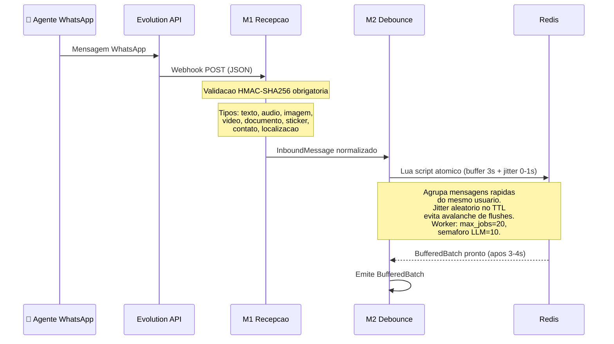

### Fase 2: Decision Point #1 — Smart Router (Two-Phase)

6 caminhos de roteamento + resolucao de agente configuravel por numero

O Smart Router opera em **duas fases**:

**Fase A — Route Classification** (o que acontece): classifica a mensagem em 1 dos 6 paths com base em atributos da mensagem (is_group, @mention, from_me, handoff state). Os 6 paths sao fixos e iguais para todos os tenants.

**Fase B — Agent Resolution** (quem atende): para routes que precisam de agente (SUPPORT, GROUP_RESPOND), avalia as `routing_rules` configuradas para o tenant + phone_number. Avaliacao por priority ASC, first-match wins. Sem regra = `tenants.settings.default_agent_id`.

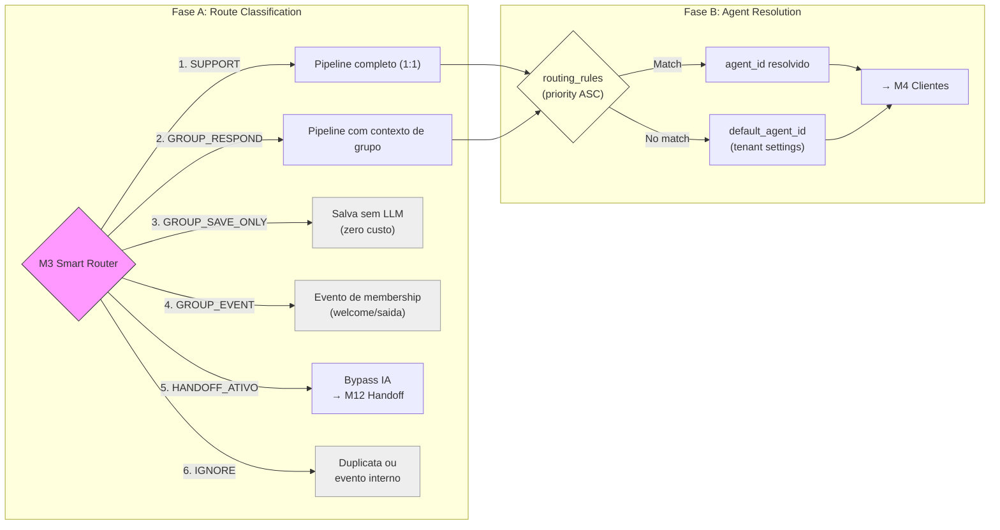

**Caminhos (Fase A):**
- **SUPPORT** → Pipeline completo para mensagem individual (1:1)
- **GROUP_RESPOND** → Mesmo pipeline, com contexto de grupo (@mention)
- **GROUP_SAVE_ONLY** → Salva mensagem no historico sem acionar LLM (zero custo)
- **GROUP_EVENT** → Evento de membership (welcome, saida de membro) — aciona trigger template sem LLM
- **HANDOFF_ATIVO** → Conversa ja escalada — bypass completo da IA, direto para atendente humano
- **IGNORE** → Duplicata detectada ou evento interno — descarta

**Resolucao de agente (Fase B):**
- Cada numero WhatsApp do tenant pode ter `routing_rules` diferentes (ex: individual → vendas, grupo → suporte)
- Regras armazenadas em `routing_rules` table com `match_conditions` JSONB (ex: `{"channel_type": "individual"}`)
- Avaliacao por priority (menor = maior prioridade), first-match wins
- Sem regras configuradas → usa `tenants.settings.default_agent_id`
- Config via admin panel, sem deploy — ver [ADR-006](../decisions/ADR-006-agent-as-data/) e [domain-model](../engineering/domain-model/)

### Fase 3: Pipeline Core (IA)

Gestao de cliente, contexto, guardrails, classificacao e agente IA

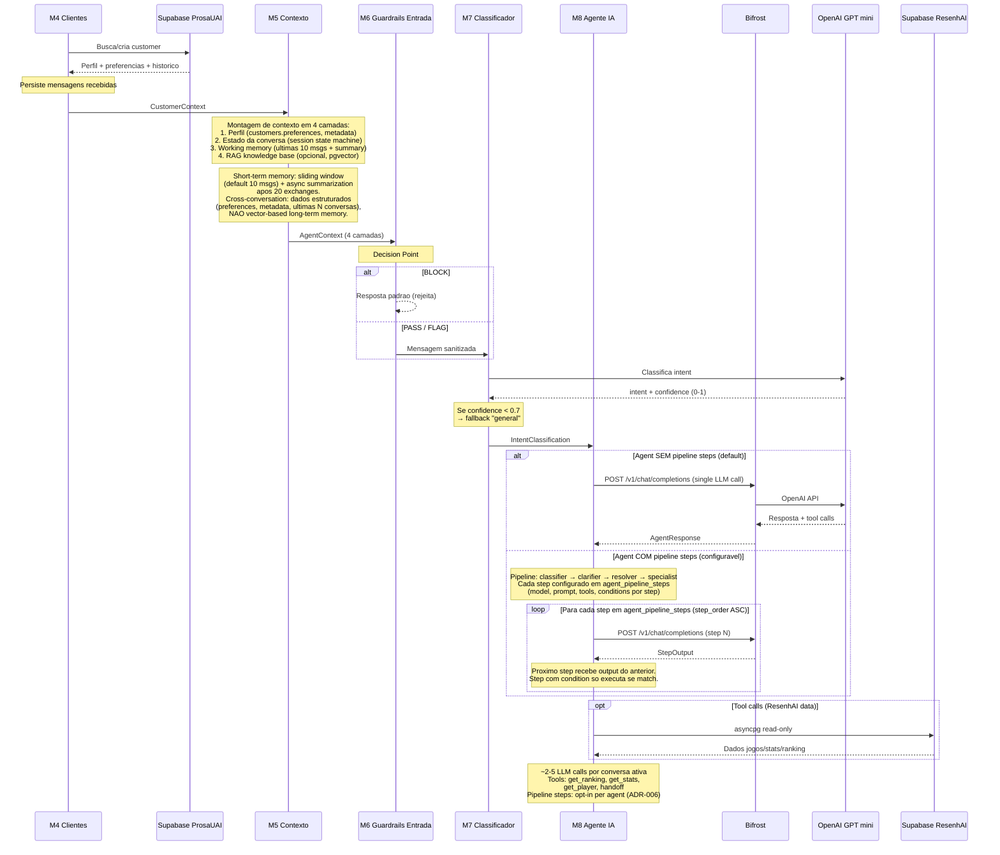

### Fase 4: Decision Point #3 — Avaliador de Qualidade

Aprovacao, retry ou escalacao para humano

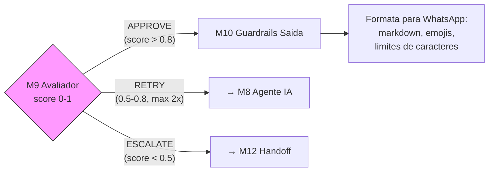

**Criterios de decisao:**
- **APPROVE** (score > 0.8) → Resposta aprovada, segue para formatacao e entrega
- **RETRY** (score 0.5-0.8) → Volta para M8 Agente IA (maximo 2 tentativas antes de escalar)
- **ESCALATE** (score < 0.5 ou topico critico ou request explicito do usuario) → Handoff para humano

### Fase 5: Saida (Channel Outbound)

Entrega da resposta via Evolution API

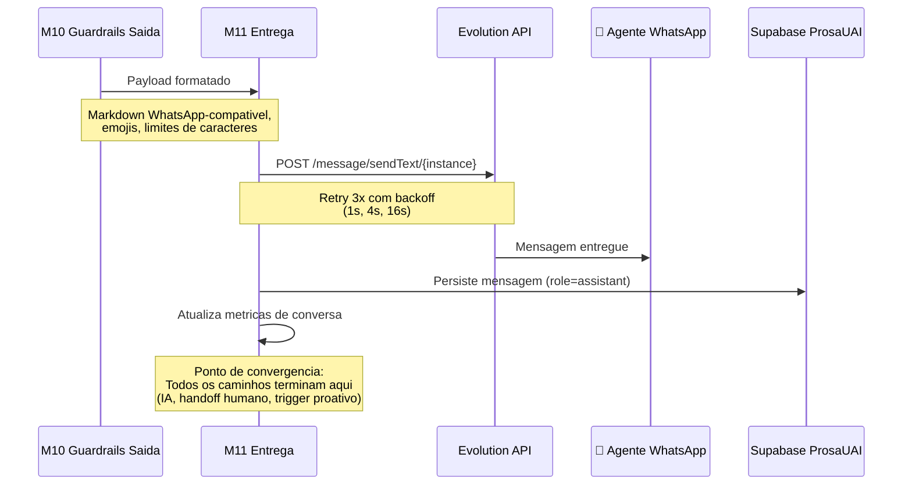

### Fase 6: Handoff Humano

Maquina de estados para transferencia IA → humano

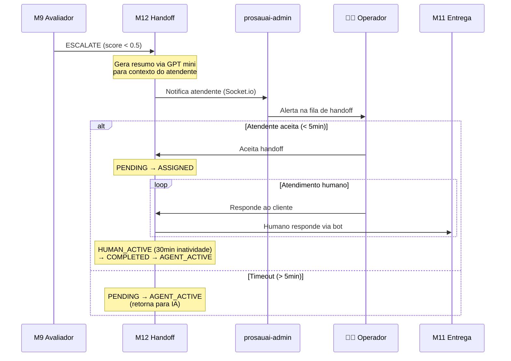

**State Machine do Handoff:**

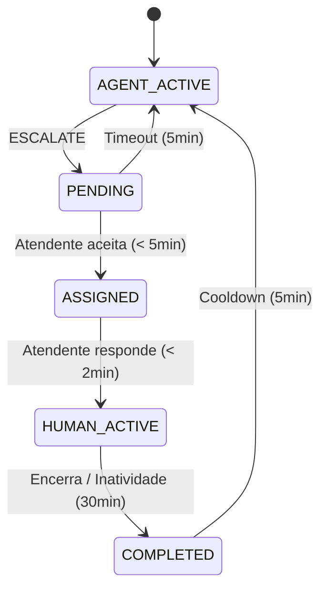

### Fase 7: Triggers Proativos

Mensagens proativas baseadas em eventos — sem LLM

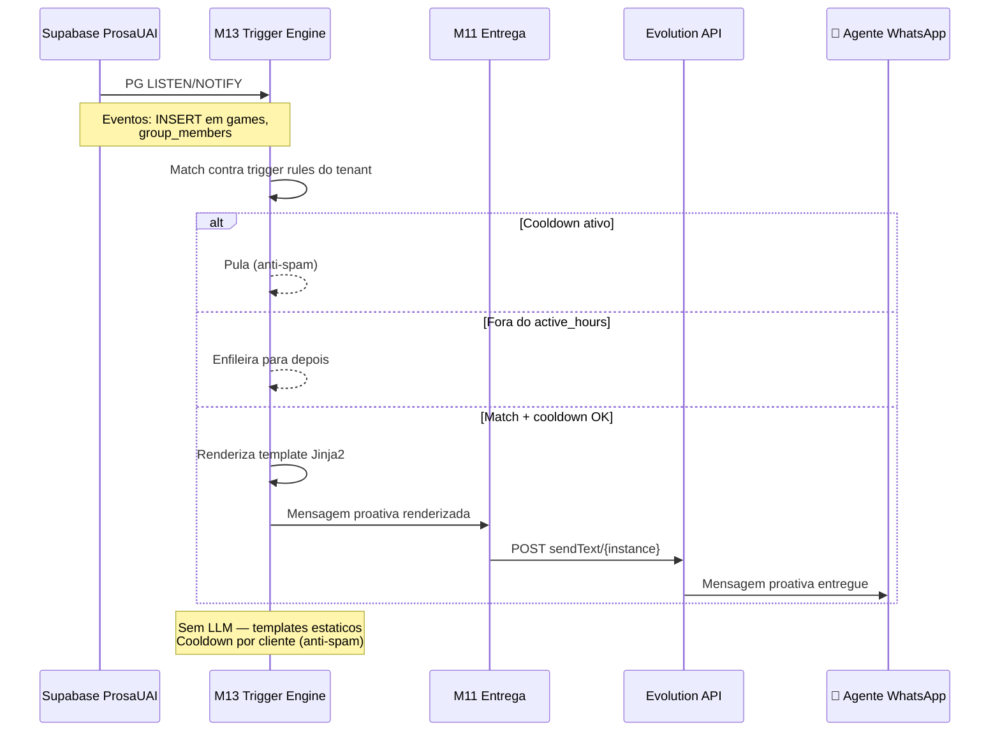

### Fase 8: Observabilidade (passiva)

Tracing distribuido e metricas de qualidade — fire-and-forget

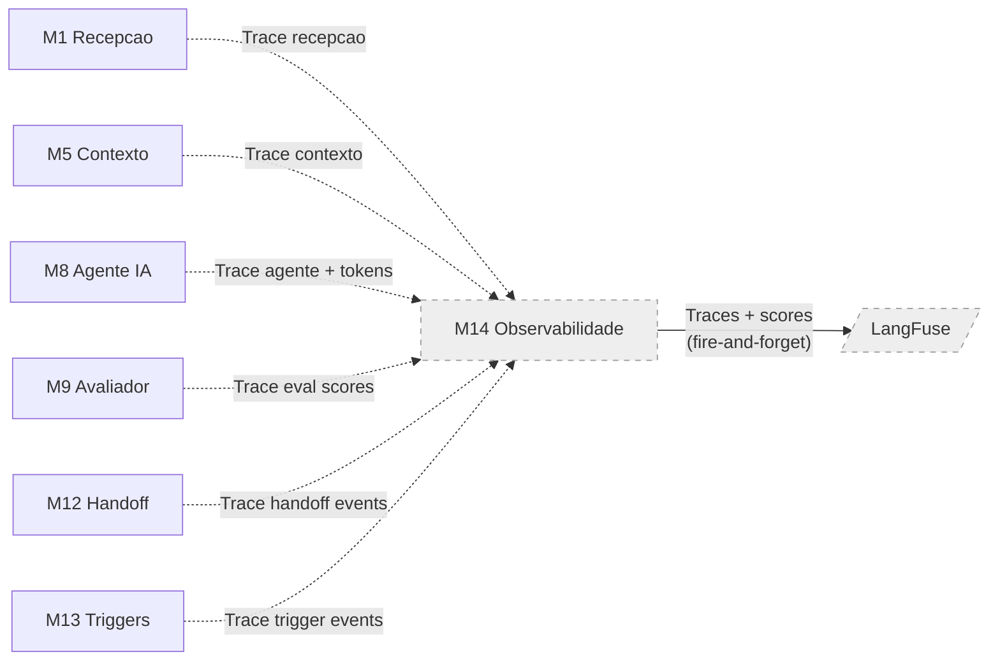

**Stack de observabilidade:**
- **LangFuse**: Traces com spans por modulo (M1-M13)
- **DeepEval + Promptfoo**: Scores de eval (online + offline)
- **trace_id** = conversation_id (correlacao end-to-end)
- **Fire-and-forget**: falha na observabilidade NAO bloqueia o pipeline
- **Prompt versions**: source of truth no LangFuse

---

## Multi-Tenant Lifecycle (Fase 1 → Fase 3)

A partir do epic 003 (Multi-Tenant Foundation), todo fluxo do pipeline acima e **per-tenant por construcao**: cada mensagem entra com `instance_name` no path, e o `TenantResolver` carrega o `Tenant` correto antes de qualquer outra etapa. Esta secao descreve os fluxos especificos de gestao de tenants — quem cria, quem desabilita, quem cobra.

### Fase 1 — Onboarding manual (interno Pace, epic 003)

**Atores:** dev/admin Pace.

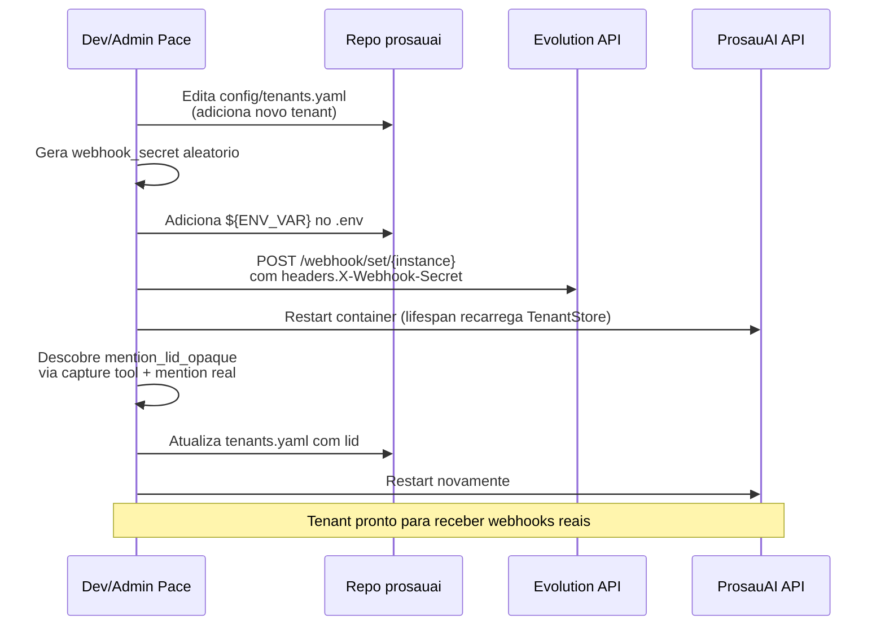

**Caracteristicas:**
- 100% manual
- Aceitavel para 2-5 tenants internos
- Sem rollback automatizado, sem auditoria, sem self-service

### Fase 2 — Onboarding via Admin API (cliente externo, epic 012)

**Atores:** cliente externo + admin Pace.

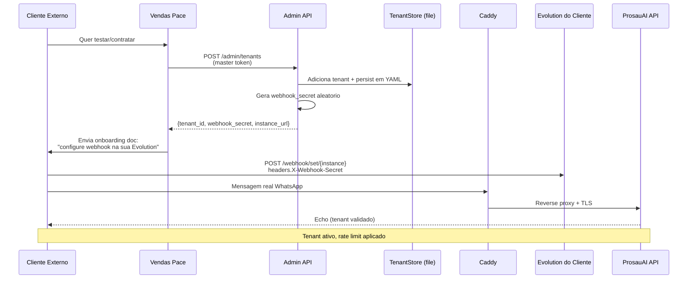

**Caracteristicas:**
- Vendas/admin Pace cria tenant via API
- Cliente faz a integracao do lado dele (sem acesso ao codigo Pace)
- Caddy + Let's Encrypt fornece TLS publico
- Rate limit per-tenant aplicado (Bifrost spend cap + Redis sliding window)
- Hot reload do TenantStore (sem restart) ou reload via admin API

### Fase 3 — Self-service onboarding + ops (epic 013)

**Atores:** cliente externo (sem intervencao Pace) + ops team.

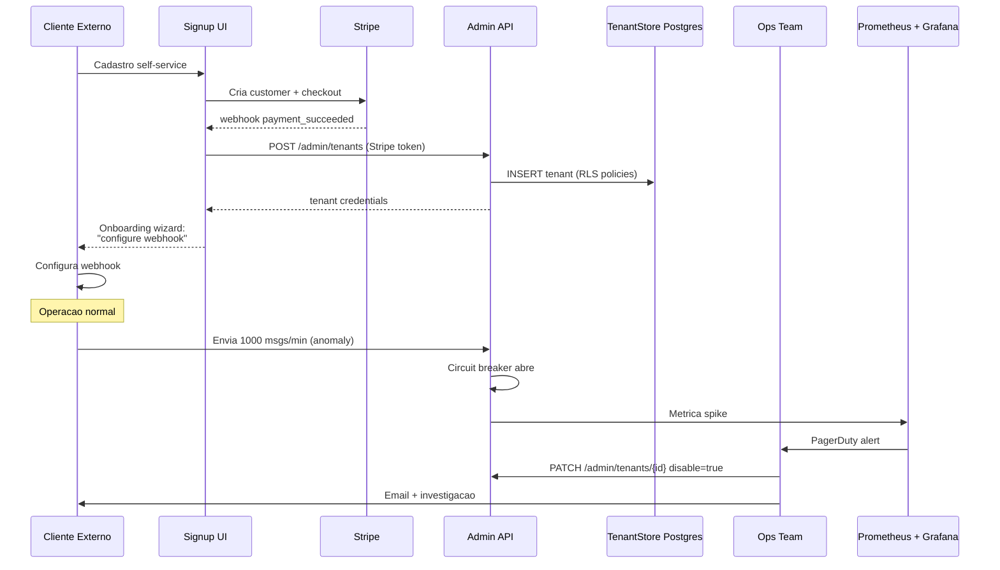

**Caracteristicas:**
- Zero intervencao manual no happy path
- Postgres como source of truth (RLS, audit trail, backup)
- Circuit breaker per-tenant impede 1 cliente derrubar outros
- Billing automatizado via Stripe
- Alertas Prometheus quando tenant ultrapassa thresholds
- Migracao YAML → Postgres feita uma unica vez ([ADR-023](../decisions/ADR-023-tenant-store-postgres-migration.md))

---

> **Proximo passo:** `/madruga:tech-research prosauai` — pesquisar alternativas tecnologicas para implementar este pipeline.
