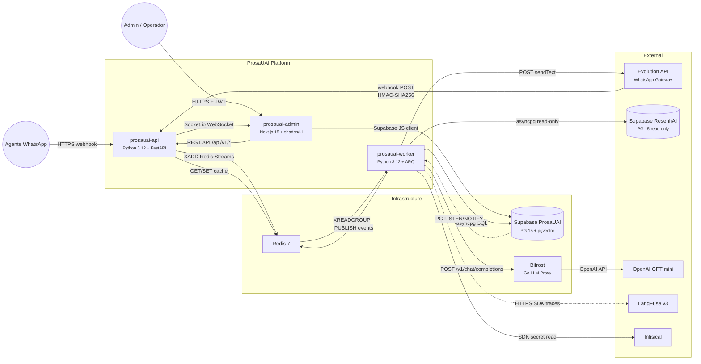

# Blueprint de Engenharia

Referencia tecnica consolidada da plataforma **ProsaUAI — Agentes WhatsApp**: stack, topologia, concerns transversais, NFRs, mapa de dados e glossario.

> **Convencao**: esta pagina consolida o **O QUE** e **COMO**. Para o **POR QUE** de cada decisao, consulte os [ADRs](../decisions/).
>
> Artefatos relacionados: [Domain Model](../domain-model/) · [Context Map](../context-map/) · [Containers](../containers/) · [Integrations](../integrations/) · [ADRs](../decisions/)

---

## 1. Technology Stack

| Componente | Runtime | Porta/Protocolo | Scaling |
|------------|---------|-----------------|---------|
| prosauai-api | Python 3.12, FastAPI + uvicorn | 8040/HTTP | Horizontal (stateless) |
| prosauai-worker | Python 3.12, ARQ (async task queue) | — (consumer) | Horizontal (Redis consumer groups) |
| prosauai-admin | Next.js 15, shadcn/ui | 3000/HTTP | Horizontal (stateless) |
| Redis 7 | Managed ou self-hosted | 6379/TCP | Single instance + Sentinel (HA) |
| Supabase (PG 15 + pgvector + RLS) | Managed (Supabase Cloud) | 5432/TCP | Vertical (managed) |
| Bifrost | Go binary (LLM proxy) | 8080/HTTP | Horizontal (stateless) |
| LangFuse v3 | Docker Compose (self-hosted) | 3000/HTTP | Single instance |
| Infisical | Docker Compose (self-hosted) | 8080/HTTP | Single instance |
| Evolution API | Cloud mode (managed) | — (webhook) | Managed pelo provider |

---

## 2. Deploy Topology

> Visao geral de todos os componentes, atores e conexoes da plataforma.
> Detalhamento C4 L2 dos containers → ver [containers.md](../containers/)
> Integracoes externas detalhadas → ver [integrations.md](../integrations/)



### 2.1 Ambientes

| Ambiente | Finalidade | Infra |
|----------|------------|-------|
| local | Desenvolvimento e testes | Docker Compose completo (todos servicos) |
| staging | QA, red-teaming, testes de integracao | Subset producao; tenants de teste |
| production | Tenants reais | Full stack; monitoring ativo |

### 2.2 CI/CD

> **Nota**: pipeline em definicao. Estrutura planejada abaixo.

| Etapa | Ferramenta | Gate |
|-------|------------|------|
| Lint + type check | ruff, mypy | Blocking |
| Unit tests | pytest | Blocking |
| RLS isolation tests | pytest + Supabase test DB | Blocking |
| Prompt regression | Promptfoo | Warning |
| Security scan | — (a definir no epic 001) | Blocking |
| Deploy staging | — (a definir no epic 001) | Automatico |
| Deploy production | — (a definir no epic 001) | Manual approval |

---

## 3. Folder Structure

<!-- Preencher quando repositorio prosauai-api for criado -->

```text
prosauai-api/
├── src/
│   ├── api/            # FastAPI routes + webhook receiver
│   ├── worker/         # ARQ tasks (debounce, LLM, delivery, eval, trigger)
│   ├── domain/         # Bounded contexts (channel, conversation, safety, operations, observability)
│   ├── infra/          # DB, Redis, external API clients
│   └── shared/         # Value objects, exceptions, config
├── admin/              # Next.js 15 frontend
├── tests/              # pytest (unit + integration + RLS)
└── docker-compose.yml  # Full local environment
```

| Convencao | Regra |
|-----------|-------|
| Bounded contexts | 1 diretorio por BC em `src/domain/` |
| RLS tests | Obrigatorios para toda nova tabela com tenant_id |
| Secrets | Nunca em codigo; sempre via Infisical SDK |

---

## 4. Concerns Transversais

### 4.1 Autenticacao & Autorizacao

| Aspecto | Mecanismo | ADR |
|---------|-----------|-----|
| Autenticacao tenant admin | Supabase Auth (JWT) — login email/password | — |
| Isolamento de dados | Pool + RLS com `SET LOCAL` por transacao | [ADR-011](../decisions/ADR-011-pool-rls-multi-tenant/) |
| Wrapper RLS | `auth.tenant_id()` STABLE SECURITY DEFINER — todas as policies usam | [ADR-011](../decisions/ADR-011-pool-rls-multi-tenant/) |
| Indexes obrigatorios | `tenant_id` em toda tabela de dados, sem excecao | [ADR-011](../decisions/ADR-011-pool-rls-multi-tenant/) |
| Service role key | Nunca exposta no frontend; apenas server-side | [ADR-011](../decisions/ADR-011-pool-rls-multi-tenant/) |
| Tenant context | Sempre `SET LOCAL` (transaction-scoped), nunca `SET` global | [ADR-011](../decisions/ADR-011-pool-rls-multi-tenant/) |

### 4.2 Seguranca & Safety

| Camada | Mecanismo | Latencia | ADR |
|--------|-----------|----------|-----|
| Hard limits | 20 tool calls/conversa, 60s timeout, 8K context tokens, 3 max retries | — | [ADR-016](../decisions/ADR-016-agent-runtime-safety/) |
| Layer A — Regex | Blocklist, PII patterns (CPF, telefone, email), length checks | <5ms | [ADR-016](../decisions/ADR-016-agent-runtime-safety/) |
| Layer B — ML classifier | DistilBERT injection detection + toxicity | ~50ms | [ADR-016](../decisions/ADR-016-agent-runtime-safety/) |
| Layer C — LLM-as-judge | Semantic check em acoes destrutivas (tools high-risk only) | ~200ms | [ADR-016](../decisions/ADR-016-agent-runtime-safety/) |
| Loop detection | Similaridade de pattern + semantic entre ultimas N respostas | — | [ADR-016](../decisions/ADR-016-agent-runtime-safety/) |
| Prompt injection defense | Sandwich pattern (system → user → system), input sanitization, output scan | — | [ADR-016](../decisions/ADR-016-agent-runtime-safety/) |
| Tool safety | Pydantic strict schema, whitelist enforcement, server-side tenant_id injection | — | [ADR-016](../decisions/ADR-016-agent-runtime-safety/) |
| Webhook validation | HMAC-SHA256 por tenant na Evolution API | — | [ADR-017](../decisions/ADR-017-secrets-management/) |

### 4.3 Secrets & Encryption

| Aspecto | Mecanismo | ADR |
|---------|-----------|-----|
| Vault | Infisical self-hosted (MIT license) | [ADR-017](../decisions/ADR-017-secrets-management/) |
| Modelo de encryption | Envelope — KEK master + DEK por tenant | [ADR-017](../decisions/ADR-017-secrets-management/) |
| Rotacao Evolution API keys | A cada 30 dias | [ADR-017](../decisions/ADR-017-secrets-management/) |
| Rotacao LLM keys | A cada 30 dias | [ADR-017](../decisions/ADR-017-secrets-management/) |
| Rotacao webhook secrets | A cada 90 dias | [ADR-017](../decisions/ADR-017-secrets-management/) |
| Rotacao DEK | A cada 180 dias | [ADR-017](../decisions/ADR-017-secrets-management/) |
| Rotacao JWT | A cada 90 dias | [ADR-017](../decisions/ADR-017-secrets-management/) |
| Runtime injection | Via pydantic-ai dependency injection — worker nunca ve raw keys | [ADR-017](../decisions/ADR-017-secrets-management/) |
| Audit trail | Toda operacao (read/rotate/create/delete) com tenant_id, agent_id, IP, timestamp | [ADR-017](../decisions/ADR-017-secrets-management/) |
| Retencao audit | 365 dias | [ADR-017](../decisions/ADR-017-secrets-management/) |

### 4.4 Observabilidade

| Ferramenta | Papel | Integracao |
|------------|-------|------------|
| LangFuse v3 (self-hosted) | Tracing LLM, prompt versioning, sessoes | SDK Python; `trace_id` = `conversation_id` |
| DeepEval | Eval offline: faithfulness, relevance, toxicity, coherence | Batch jobs no worker; resultados em `eval_results` |
| Promptfoo | Regressao de prompts, red-teaming automatizado | CI/CD pipeline; roda contra prompt snapshots |
| `usage_events` | Metricas de consumo, latencia, custo por tenant | Supabase; particao mensal por `event_month` |
| LangFuse traces | Latencia p50/p95/p99 por modulo do pipeline | Fire-and-forget; buffer local em Redis se LangFuse indisponivel |

> Detalhes: [ADR-007](../decisions/ADR-007-langfuse-observability/) | [ADR-008](../decisions/ADR-008-eval-stack/)

### 4.5 Multi-Tenancy

| Mecanismo | Descricao | ADR |
|-----------|-----------|-----|
| Rate limiting | Sliding window Redis por tenant por tier (Free=20, Starter=100, Growth=200, Business=500 RPM) | [ADR-015](../decisions/ADR-015-noisy-neighbor-mitigation/) |
| LLM spend caps | Bifrost daily cap por tier; throttle ao atingir cap | [ADR-015](../decisions/ADR-015-noisy-neighbor-mitigation/) |
| Queue priority | 3 niveis Redis Streams (high/normal/low) por tier; ratio 1:10 anti-starvation | [ADR-015](../decisions/ADR-015-noisy-neighbor-mitigation/) |
| Circuit breaker | Por tenant; threshold 50 erros/5min abre por 5min; half-open testing; DLQ para falhas | [ADR-015](../decisions/ADR-015-noisy-neighbor-mitigation/) |
| Concurrency limits | Free=5, Starter=20, Growth=50, Business=100 requests simultaneos | [ADR-015](../decisions/ADR-015-noisy-neighbor-mitigation/) |
| Data isolation | RLS policies + `SET LOCAL` em toda query | [ADR-011](../decisions/ADR-011-pool-rls-multi-tenant/) |
| Billing metering | `usage_events` com particao mensal; Stripe Metered Billing sync | [ADR-012](../decisions/ADR-012-consumption-billing/) |

### 4.6 Error Handling

| Cenario | Estrategia | Fallback |
|---------|------------|----------|
| LLM timeout/falha | 3 retries com backoff exponencial via Bifrost | Se falham: mensagem amigavel + handoff |
| Evolution API fora | 3 retries exponential backoff (1s → 4s → 16s) | Mensagem reenfileirada no Redis Stream; alerta admin |
| Redis desconectado | Reconnect automatico com exponential backoff | — |
| PG LISTEN/NOTIFY drop | Polling fallback a cada 5s | ARQ cron a cada 30min catch-up de eventos perdidos |
| Rate limit excedido | HTTP 429 + mensagem amigavel ao usuario WhatsApp | Fila de espera; mensagem processada quando slot disponivel |
| Circuit breaker aberto | Requests do tenant vao para DLQ | Half-open apos 5min; 1 request teste; sucesso = fecha |
| Tool execution falha | Retry 1x; se falha novamente, resposta sem tool + log | Alerta no LangFuse trace |
| Webhook HMAC invalido | Request rejeitado com 401 | Log de tentativa + alerta seguranca |
| Debounce flush avalanche | Jitter aleatorio 0-1s no TTL do Lua script (espalha flushes no tempo) | — |
| Worker overload (pico) | ARQ `max_jobs=20` limita batches concorrentes; `asyncio.Semaphore(10)` limita chamadas LLM | Batches excedentes ficam na fila Redis (sem perda); backpressure se fila > 100 jobs |

---

## 5. Qualidade & NFRs

| # | Cenario | Metrica | Target | Mecanismo | Prioridade |
|---|---------|---------|--------|-----------|------------|
| Q1 | Latencia resposta bot | p95 end-to-end (msg recebida → resposta enviada) | <3s | Debounce 3s + LLM streaming + Redis pipeline | Must |
| Q2 | Disponibilidade pipeline | Uptime mensal | 99.5% | Health checks, auto-restart, fallback LLM, DLQ | Must |
| Q3 | Isolamento tenant | Cross-tenant data leak | Zero | RLS + SET LOCAL + integration tests automatizados | Must |
| Q4 | Safety — injection bypass | Taxa de bypass das guardrails | <1% | 3-layer guardrails (regex + ML + LLM-as-judge) | Must |
| Q5 | Throughput Starter | Mensagens/min por tenant | 100 RPM | Redis sliding window rate limiting | Must |
| Q6 | Throughput Business | Mensagens/min por tenant | 500 RPM | Redis sliding window rate limiting | Must |
| Q7 | Custo LLM Starter | Cap diario por tenant | $5/dia | Bifrost spend tracking + throttle | Should |
| Q8 | Retencao automatica | Purge de dados expirados | <=90d default (config 30-365d) | Cron diario com cascade delete | Must |
| Q9 | SAR response (LGPD) | Tempo de resposta a requisicao do titular | <=15 dias | Endpoint dedicado `/api/v1/sar/{customer_id}` | Must |
| Q10 | Eval quality | Faithfulness score medio | >0.8 | DeepEval batch offline + alerta se cai abaixo | Should |
| Q11 | Guardrail latencia | Overhead de seguranca no pipeline | <260ms total (3 layers) | Layer A <5ms, B ~50ms, C ~200ms (so high-risk) | Should |
| Q12 | Secret rotation | Compliance de rotacao | 100% no prazo | Infisical rotation schedules automatizados | Must |

---

## 6. Mapa de Dados & Privacidade

### 6.1 Fluxo de Dados Pessoais

| Dado | Origem | Storage | Retention | PII? | Base Legal LGPD |
|------|--------|---------|-----------|------|-----------------|
| Mensagens (texto, audio, imagem) | Usuario WhatsApp | Supabase `messages` | 90d (config 30-365d) | Sim | Consentimento no 1o contato |
| Numero WhatsApp | Usuario WhatsApp | Supabase `customers.phone` | Vida do registro | Sim | Execucao de contrato |
| Phone hash | Pipeline | Supabase `customers.phone_hash` (SHA-256) | Vida do registro | Pseudonimizado | Legitimo interesse |
| Sessoes ativas | Pipeline processing | Redis (TTL 24h) | 24h auto-expire | Sim | Legitimo interesse |
| Embeddings knowledge base | Admin upload | Supabase pgvector `knowledge_chunks` | Permanente (ate delete manual) | Possivel | Consentimento do tenant |
| LangFuse traces | Pipeline observability | ClickHouse (LangFuse) | 90d | Sim (referencia) | Legitimo interesse |
| Application logs | Todos os servicos | Log rotation local | 30d | Hash only | Legitimo interesse |
| Audit trail (seguranca) | Auth, admin actions, secret ops | Supabase `audit_log` | 365d | Sim | Obrigacao legal |
| Consent records | 1o contato WhatsApp | Supabase `user_consents` | Permanente | Sim | Obrigacao legal |

> PII em logs e traces: sempre SHA-256 hash do phone. Nunca plain text fora do BD principal. ([ADR-018](../decisions/ADR-018-data-retention-lgpd/))

### 6.2 Direitos do Titular (LGPD)

| Direito | Mecanismo | SLA | ADR |
|---------|-----------|-----|-----|
| Acesso (SAR) | Endpoint `/api/v1/sar/{customer_id}` — retorna metadata, conversas, knowledge_mentions, consents, metricas | 15 dias | [ADR-018](../decisions/ADR-018-data-retention-lgpd/) |
| Exclusao | Cascade delete por `phone_hash`: mensagens → embeddings → traces (redact, nao delete) → cache Redis | 15 dias | [ADR-018](../decisions/ADR-018-data-retention-lgpd/) |
| Consentimento | Mensagem de disclosure no 1o contato WhatsApp; opt-in explicito; re-consent se politica muda | Imediato | [ADR-018](../decisions/ADR-018-data-retention-lgpd/) |
| Portabilidade | JSON export via mesmo SAR endpoint | 15 dias | [ADR-018](../decisions/ADR-018-data-retention-lgpd/) |
| Revogacao | Sem consentimento = apenas respostas genericas, sem armazenamento | Imediato | [ADR-018](../decisions/ADR-018-data-retention-lgpd/) |

### 6.3 Compliance Checklist

| Item | Status | Nota |
|------|--------|------|
| Consent flow no 1o contato | Desenhado | [ADR-018](../decisions/ADR-018-data-retention-lgpd/) |
| Retention cron automatico (diario) | Desenhado | [ADR-018](../decisions/ADR-018-data-retention-lgpd/) — cascade delete |
| SAR endpoint | Desenhado | [ADR-018](../decisions/ADR-018-data-retention-lgpd/) — 15 dias SLA |
| PII detection pre-LLM | Desenhado | [ADR-016](../decisions/ADR-016-agent-runtime-safety/) — Layer A regex |
| Encryption at rest | Supabase managed | Transparente via provider |
| Encryption in transit (TLS) | Todas conexoes HTTPS/TLS | Inclui Redis TLS em producao |
| HMAC webhook validation | Desenhado | [ADR-017](../decisions/ADR-017-secrets-management/) — SHA-256 por tenant |
| Envelope encryption secrets | Desenhado | [ADR-017](../decisions/ADR-017-secrets-management/) — KEK + DEK |
| Proibicao fine-tuning sem consent | Politica | [ADR-018](../decisions/ADR-018-data-retention-lgpd/) |
| Proibicao cross-tenant embedding | Politica | [ADR-018](../decisions/ADR-018-data-retention-lgpd/) |

---

## 7. Glossario

| Termo | Definicao | Dominio |
|-------|-----------|---------|
| **Tenant** | Empresa/negocio que usa ProsaUAI. Isolamento completo de dados, config e billing | Plataforma |
| **Pipeline** | Sequencia de 14 modulos (M1-M14) que processa cada mensagem recebida | Core |
| **Handoff** | Transferencia de conversa do agente IA para atendente humano, com maquina de estados | Atendimento |
| **Guardrails** | Filtros de seguranca pre/pos-LLM que bloqueiam conteudo indesejado (3 layers) | Seguranca |
| **Debounce** | Agrupamento de mensagens rapidas (janela 3s + jitter 0-1s via Redis Lua) numa unica request. Jitter previne avalanche de flushes simultaneos sob pico | Core |
| **Cooldown** | Tempo minimo entre mensagens proativas para o mesmo cliente (evitar spam) | Triggers |
| **Bounded Context** | Area logica do sistema com fronteiras definidas (DDD). 5 contextos no ProsaUAI | Arquitetura |
| **ACL** | Anti-Corruption Layer — isola integracao com sistemas externos, traduzindo formatos | Arquitetura |
| **Bifrost** | Proxy LLM em Go — centraliza rate limiting, cost tracking | Infra |
| **Evolution API** | Gateway WhatsApp self-hosted (cloud mode) — conecta ProsaUAI ao WhatsApp sem BSP | Integracao |
| **LangFuse** | Observabilidade LLM: tracing, eval, prompt versioning. Self-hosted v3 | Observabilidade |
| **CSAT** | Customer Satisfaction Score (1-5) coletado apos atendimento humano | Metricas |
| **Channel Adapter** | Interface padrao que abstrai canal de mensageria. Novo canal = novo adapter, zero mudanca no core | Arquitetura |
| **Tool Registry** | Catalogo central de tools com metadata (nome, params, categoria). Alimenta admin e valida configs | Arquitetura |
| **Infisical** | Secret manager open-source (MIT). Envelope encryption (KEK + DEK por tenant) | Seguranca |
| **DLQ** | Dead Letter Queue — fila de mensagens que falharam apos max retries, para reprocessamento manual | Infra |
| **Circuit Breaker** | Padrao que isola tenant com alta taxa de erro, evitando cascata para outros tenants | Resiliencia |
| **Sandwich Pattern** | Defesa contra prompt injection: system prompt antes e depois do input do usuario | Seguranca |
| **SAR** | Subject Access Request — requisicao do titular de dados (LGPD Art. 18) | Compliance |
| **RPM** | Requests Per Minute — metrica primaria de rate limiting por tenant | Metricas |

---

> **Proximo passo:** `/madruga:domain-model prosauai` — modelar bounded contexts, aggregates e invariantes.
