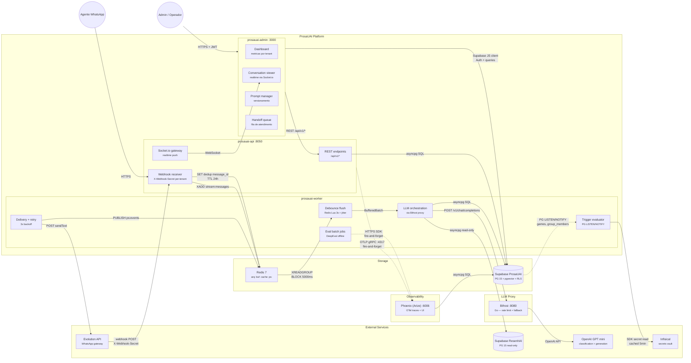
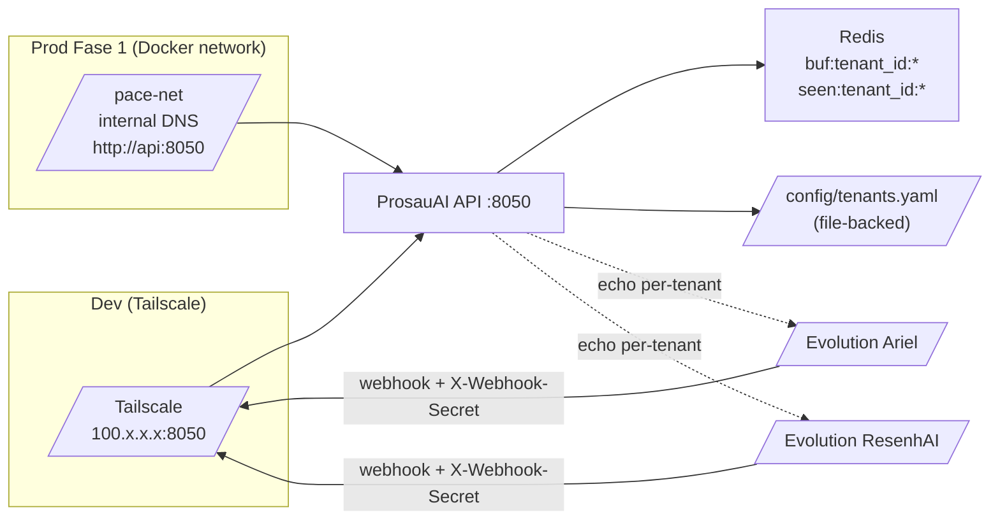
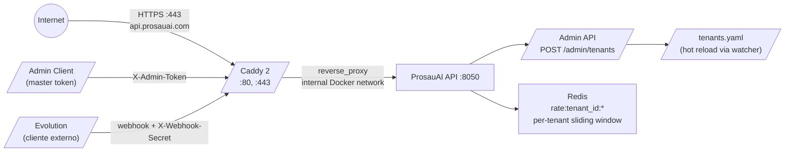
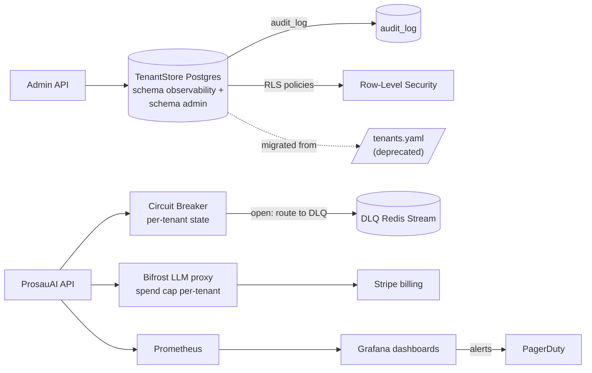

# ProsaUAI — Container Architecture (C4 Level 2)

> C4 Level 2: containers, responsabilidades e comunicacao entre componentes.
>
> BCs e aggregates → ver [domain-model.md](../domain-model/) · Integracoes externas → ver [integrations.md](../integrations/)

---

## Container Diagram

---

## Container Matrix

<!-- Tech choices justified in Blueprint — list technology here without justification -->

| # | Container | Bounded Context | Tecnologia | Responsabilidade | Protocol In | Protocol Out |
|---|-----------|----------------|------------|------------------|-------------|-------------|
| 1 | prosauai-api :8050 | Channel | Python 3.12 + FastAPI | Webhook receiver, REST endpoints, Socket.io gateway | HTTPS (webhook, REST) | Redis keys, Socket.io, asyncpg |
| 2 | prosauai-worker | Conversation, Safety, Operations | Python 3.12 + ARQ | Debounce (Lua 3s + jitter), LLM orchestration (semaphore cap), delivery, eval, triggers. Concurrency: `max_jobs=20`, `llm_semaphore=10`, backpressure at queue depth > 100 | Redis Streams (XREADGROUP) | asyncpg, HTTP (Bifrost, Evolution), OTLP gRPC (Phoenix) |
| 3 | prosauai-admin | — (apresentacao) | Next.js 15 + shadcn/ui | Dashboard, conversation viewer, prompt manager, handoff queue | HTTPS + JWT | REST API, Supabase JS |
| 4 | Redis 7 | — (infra) | Redis | Message streams, cache, PubSub, debounce state | Redis protocol | Redis protocol |
| 5 | Supabase ProsaUAI | — (infra) | PG 15 + pgvector + RLS | Persistent state multi-tenant | asyncpg SQL, Supabase JS | PG LISTEN/NOTIFY |
| 6 | Bifrost :8080 | — (proxy) | Go binary | LLM proxy: rate limit, cost tracking | HTTP POST | OpenAI API |
| 7 | Phoenix (Arize) | Observability | Docker (self-hosted) | Tracing fim-a-fim (OTel spans), waterfall UI, SpanQL queries. Postgres backend (Supabase) | OTLP gRPC :4317 | asyncpg SQL (Supabase) |
| 8 | Infisical | — (infra) | Docker (self-hosted) | Secrets vault: envelope encryption, rotation | HTTPS REST SDK | — |
| 9 | Evolution API | Channel | Cloud mode (managed) | WhatsApp gateway: send/receive messages | HTTP POST (sendText) | Webhook POST |
| 10 | Netdata :19999 | — (infra) | Docker (self-hosted) | Host monitoring: CPU, RAM, disco, containers Docker. Dashboard web. Bind `127.0.0.1` only (acesso via SSH tunnel) | — | HTTP :19999 (dashboard) |
| 11 | retention-cron | Operations | Python 3.12 (same image as API) | Purge diario de dados expirados: DROP PARTITION (messages), batch DELETE (conversations, eval_scores, traces). LGPD compliance | asyncpg SQL | Logs (structlog JSON) |

---

## Communication Protocols

| De | Para | Protocolo | Padrao | Justificativa |
|----|------|-----------|--------|---------------|
| Evolution API | prosauai-api | HTTPS webhook (X-Webhook-Secret) | async | WhatsApp messages inbound |
| prosauai-api | Redis | XADD stream:messages | async | Desacoplamento intake → processing |
| prosauai-api | prosauai-admin | Socket.io WebSocket | async (push) | Realtime updates (new messages, handoff alerts) |
| Redis | prosauai-worker | XREADGROUP (BLOCK 5000ms) | async (pull) | Consumer group permite horizontal scaling |
| prosauai-worker | Bifrost | POST /v1/chat/completions | sync | LLM request-response |
| prosauai-worker | Supabase ProsaUAI | asyncpg SQL | sync | CRUD + RLS per transaction |
| prosauai-worker | Evolution API | POST sendText/{instance} | sync | Envio de resposta ao WhatsApp |
| prosauai-api | Phoenix (Arize) | OTLP gRPC :4317 | async (fire-and-forget) | Tracing OTel spans via BatchSpanProcessor — API continua se Phoenix indisponivel |
| prosauai-worker | Infisical | HTTPS REST SDK (cached 5min) | sync | Secret retrieval |
| Supabase ProsaUAI | prosauai-worker | PG LISTEN/NOTIFY | async (event-driven) | Triggers proativos (games, group_members) |
| prosauai-admin | prosauai-api | REST /api/v1/* | sync | CRUD operations |
| Bifrost | OpenAI GPT mini | OpenAI API | sync | LLM inference |

---

## Scaling Strategy

| Container | Estrategia | Trigger | Notas |
|-----------|-----------|---------|-------|
| prosauai-api | Horizontal | CPU > 70% ou latencia p95 > 500ms | Stateless — qualquer instancia serve |
| prosauai-worker | Horizontal | Queue depth > 100 msgs | Redis consumer groups distribui carga. Cada instancia: `max_jobs=20` (ARQ), `llm_semaphore=10` (asyncio), backpressure se fila > 100. Jitter 0-1s no Lua TTL previne avalanche de flushes |
| prosauai-admin | Horizontal | Usuarios concorrentes > 100 | Stateless Next.js |
| Redis | Single + Sentinel | — | HA via Sentinel; vertical para throughput |
| Supabase | Vertical (managed) | Conexoes > 80% pool | Managed pelo provider. Tabela `messages` particionada mensalmente — purge via DROP PARTITION (<100ms). Partition pruning em queries com filtro `created_at`. Crescimento sustentavel ~365K msgs/ano |
| Bifrost | Horizontal | RPM > 1000 | Stateless Go proxy |
| Phoenix (Arize) | Single instance | — | Tracing nao e critico para pipeline. Postgres backend (Supabase) |
| Infisical | Single instance | — | Cache 5min no client reduz load |
| Netdata | Single instance | — | Temporario (epic 013 substitui por Prometheus+Grafana). mem_limit 256m |
| retention-cron | Single instance | — | Execucao diaria (sleep 86400). mem_limit 128m. Idempotente |

> NFRs globais e targets mensuraveis → ver [blueprint.md](../blueprint/)

---

## Implementation Status

> O diagrama e a Container Matrix acima representam a **arquitetura target**. A tabela abaixo reflete o estado real de cada container apos os epics implementados.

| Container | Status | Epic | Notas |
|-----------|--------|------|-------|
| prosauai-api | ✅ Operacional | 001-006 | Webhook + health + debounce + multi-tenant auth (X-Webhook-Secret) + MECE router + idempotency + **conversation pipeline 12-step** (customer lifecycle, context window, intent classifier, LLM agent pydantic-ai, safety guards 3-layer, tool registry, evaluator) + **DB migrations** (7 files, asyncpg pool, RLS on all tables) + **schema isolation** (`prosauai` + `prosauai_ops`). OTel SDK + structlog bridge. Port 8050. **Nota:** LLM orchestration atualmente roda inline na API (sem worker separado) |
| prosauai-worker | ⏳ Planejado (arquitetura target) | — | Arquitetura target: LLM orchestration, delivery, eval batch e triggers migram para ARQ worker com Redis Streams consumer groups. **Atualmente:** toda logica de conversacao roda inline no prosauai-api. Migracao para worker planejada quando throughput exigir scaling independente |
| prosauai-admin | ⏳ Planejado | — | — |
| Redis 7 | ✅ Operacional | 001-004 | Debounce keys (buf:/tmr:) + keyspace notifications + idempotency (seen:tenant_id:msg_id SETNX 24h) |
| Supabase ProsaUAI | ✅ Schema isolation | 005-006 | Schema `prosauai` (7 tabelas de negocio) + `prosauai_ops` (schema_migrations). `public.tenant_id()` SECURITY DEFINER (Supabase compat — movido de `prosauai_ops`). `gen_random_uuid()` built-in (sem `uuid-ossp`). Messages particionada por mes. Migrations idempotentes com `DROP POLICY IF EXISTS`. Migration runner asyncpg automatizado no startup (advisory lock + checksum). Pool: `statement_cache_size=0` (Supavisor compat), JSONB codec auto. [ADR-024](../decisions/ADR-024-schema-isolation.md) |
| Bifrost | ⏳ Planejado | — | — |
| Phoenix (Arize) | ✅ Operacional | 002, 006 | Substitui LangFuse ([ADR-020](../decisions/ADR-020-phoenix-observability.md)). UI :6006 + gRPC :4317. SQLite em dev, Postgres backend em prod (`PHOENIX_SQL_DATABASE_SCHEMA=observability`) |
| Infisical | ⏳ Planejado | — | Config via .env nesta fase |
| Evolution API | ✅ Integrado | 001 | Cloud mode, mock em testes |
| TenantStore (file) | ✅ Operacional | 003 | YAML file-backed, lifespan loader, ${VAR} interpolation, 2 tenants reais (Ariel + ResenhAI). Migracao para Postgres em [ADR-023](../decisions/ADR-023-tenant-store-postgres-migration.md) |
| Router MECE | ✅ Operacional | 004 | classify() pure + RoutingEngine declarativa + config YAML per-tenant (config/routing/*.yaml) + MECE verification (4 camadas) + MentionMatchers (3 estrategias) |
| Netdata | ✅ Operacional (prod) | 006 | Host monitoring temporario (substitui por Prometheus+Grafana no epic 013). Bind `127.0.0.1:19999`, mem_limit 256m. Acesso via SSH tunnel |
| retention-cron | ✅ Operacional (prod) | 006 | Purge diario LGPD: DROP PARTITION messages, batch DELETE conversations/eval_scores/traces. mem_limit 128m. `--dry-run` default |
| Caddy 2 (edge proxy) | 📋 Planejado | 012 (Fase 2) | TLS automatico via Let's Encrypt; reverse proxy para prosauai-api; rate limit por IP. Ver [ADR-021](../decisions/ADR-021-caddy-edge-proxy.md) |
| Admin API | 📋 Planejado | 012 (Fase 2) | Endpoints `POST/GET/PATCH/DELETE /admin/tenants`; auth via master token. Ver [ADR-022](../decisions/ADR-022-admin-api.md) |
| TenantStore (Postgres) | 📋 Planejado | 013 (Fase 3) | Migracao YAML → Postgres; schema gerenciado em Supabase com RLS herdada de [ADR-011](../decisions/ADR-011-pool-rls-multi-tenant.md). Trigger: >=5 tenants reais |

---

## Multi-Tenant Topology — Faseamento

A arquitetura multi-tenant evolui em 3 fases. Cada fase tem trigger de entrada explicito; nenhuma e antecipada sem dor real para evita-la.

### Fase 1 — Multi-tenant estrutural (epic 003, shipped)

**Topologia:** prosauai-api isolado por rede (Tailscale dev / Docker network privada prod), TenantStore file-backed YAML, 2 tenants reais (Ariel + ResenhAI), per-tenant credentials/keys/idempotency. **Zero porta exposta na internet.**

**Containers novos:** nenhum — refactor estrutural do `prosauai-api` existente.

**Containers que mudam:**
- `prosauai-api`: lifespan carrega `TenantStore.load_from_file()`; novo modulo `core/tenant.py`, `core/tenant_store.py`, `core/idempotency.py`; `api/dependencies.py` reescrito (sem HMAC); `formatter.py` reescrito (12 correcoes).
- `Redis 7`: chaves prefixadas com `tenant_id` (debounce + idempotency); zero impacto operacional.

### Fase 2 — Public API (epic 012)

**Topologia (delta):** Caddy 2 como edge proxy + Admin API. ProsauAI API continua sem `ports:` — so Caddy fala com a internet.

**Containers novos:**
- `caddy` (Caddy 2 alpine) — edge proxy + TLS automatico Let's Encrypt + rate limit por IP.

**Containers que mudam:**
- `prosauai-api`: novo modulo `prosauai/api/admin.py` com endpoints CRUD de tenants; auth via master token; hot reload do TenantStore via inotify ou endpoint dedicado.
- `Redis 7`: novas chaves para rate limiting (`rate:{tenant_id}:msgs`).
- `docker-compose.prod.yml`: adiciona Caddy + volumes `caddy-data` (certs).

**ADRs novos:** [ADR-021](../decisions/ADR-021-caddy-edge-proxy.md), [ADR-022](../decisions/ADR-022-admin-api.md).

### Fase 3 — Operacao em Producao (epic 013)

**Topologia (delta):** TenantStore migrado para Postgres (Supabase + RLS); circuit breaker per-tenant; billing automatizado; alertas Prometheus.

**Containers novos:**
- `prometheus` + `grafana` (single instance cada, observabilidade operacional).
- `bifrost` finalmente promovido de "planejado" para "operacional" (ja documentado em [ADR-002](../decisions/ADR-002-bifrost-llm-proxy.md)).

**Containers que mudam:**
- `prosauai-api`: TenantStore agora usa `TenantStore.load_from_db()` (mesmo interface, loader diferente); circuit breaker module novo; integracao Stripe webhook handler.
- `Supabase ProsaUAI`: novas tables `tenants`, `audit_log`; RLS policies herdam padrao do [ADR-011](../decisions/ADR-011-pool-rls-multi-tenant.md).

**ADR novo:** [ADR-023](../decisions/ADR-023-tenant-store-postgres-migration.md) (trigger e migration plan one-shot).

### Sintese — comparativo das fases

| Container | Fase 1 (epic 003) | Fase 2 (epic 012) | Fase 3 (epic 013) |
|-----------|------------------|------------------|------------------|
| **prosauai-api** | TenantStore file + per-tenant keys + parser corrigido | + Admin API + hot reload + rate limit | + circuit breaker + Stripe handler |
| **Redis 7** | `buf:/tmr:/seen:` prefixados por tenant_id | + `rate:` per-tenant | + DLQ stream per-tenant |
| **TenantStore** | YAML file (gitignored) | YAML file (hot reload) | Postgres + RLS + audit |
| **Caddy 2** | — | Edge proxy + Let's Encrypt | Edge proxy + Let's Encrypt |
| **Admin API** | — | `POST/GET/PATCH/DELETE /admin/tenants` (master token) | + JWT scoped + audit log |
| **Bifrost** | ⏳ Planejado | ⏳ Planejado | ✅ Operacional + spend cap per-tenant |
| **Prometheus + Grafana** | — | — | Operacional + alertas PagerDuty |
| **Stripe** | — | — | Operacional + webhook handler |
| **Porta publica** | 0 | 80 + 443 (so Caddy) | 80 + 443 (so Caddy) |

---

## Premissas e Decisoes

| # | Decisao | Alternativas Consideradas | Justificativa |
|---|---------|---------------------------|---------------|
| 1 | Separar API e Worker em containers distintos | Monolito com threads — rejeitado: scaling independente necessario | Worker processa LLM (lento), API precisa ser rapida para webhooks |
| 2 | Redis como message broker (nao RabbitMQ/Kafka) | RabbitMQ — rejeitado: overhead operacional. Kafka — overkill para ~500 RPM | Redis Streams cobre consumer groups + DLQ + backpressure |
| 3 | Bifrost como proxy LLM separado | SDK direto no worker — rejeitado: rate limiting centralizado + fallback chain | Go binary leve, stateless, horizontal |
| 4 | Next.js para admin (nao React SPA) | SPA puro — rejeitado: SSR melhora SEO/perf para dashboards | Next.js 15 + shadcn/ui — produtividade alta |

---

> **Proximo passo:** `/madruga:context-map prosauai` — mapear relacionamentos DDD entre bounded contexts.
