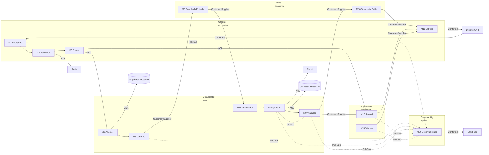

# ProsaUAI — Context Map

> Relacionamentos entre bounded contexts com padroes DDD explicitos.
>
> Definicoes dos BCs → ver [domain-model.md](../domain-model/) · NFRs e stack → ver [blueprint.md](../blueprint/)

---

## Context Diagram

---

## Relacoes entre Contextos

| # | De | Para | Padrao | Justificativa |
|---|-----|------|--------|---------------|
| 1 | Evolution API → Channel (M1) | Conformist | Channel aceita o schema de webhooks sem traducao |
| 2 | Channel (M1) → Channel (M2) | Intra-BC | Mensagem normalizada segue para debounce |
| 3 | Channel (M2) → Channel (M3) | Intra-BC | Batch debounced segue para roteamento |
| 4 | Channel (M3) → Conversation (M4) | ACL | Traduz InboundMessage → ConversationRequest |
| 5 | Channel (M3) → Operations (M12) | ACL | Bypass IA — rota HANDOFF_ATIVO direto para handoff |
| 6 | Conversation (M4) → Conversation (M5) | Intra-BC | CustomerContext alimenta montagem de contexto |
| 7 | Conversation (M5) → Safety (M6) | Customer-Supplier | AgentContext validado por guardrails de entrada |
| 8 | Safety (M6) → Conversation (M7) | Customer-Supplier | Mensagem sanitizada segue para classificacao |
| 9 | Conversation (M7) → Conversation (M8) | Intra-BC | IntentClassification alimenta agente IA |
| 10 | Conversation (M8) → Conversation (M9) | Intra-BC | AgentResponse avaliada por quality check |
| 11 | Conversation (M9) → Conversation (M8) | Intra-BC | RETRY — score 0.5-0.8, max 2 tentativas |
| 12 | Conversation (M9) → Safety (M10) | Customer-Supplier | APPROVE — resposta segue para guardrails de saida |
| 13 | Conversation (M9) → Operations (M12) | Customer-Supplier | ESCALATE — handoff quando score < 0.5 |
| 14 | Safety (M10) → Channel (M11) | Customer-Supplier | Payload formatado segue para entrega |
| 15 | Operations (M12) → Channel (M11) | Intra-flow | Resposta humana entregue via bot |
| 16 | Operations (M13) → Channel (M11) | Customer-Supplier | Triggers proativos enviados via entrega |
| 17 | Channel (M11) → Evolution API | Conformist | Entrega outbound via WhatsApp gateway |
| 18 | Conversation (M8) → Bifrost | ACL | Traduz para formato OpenAI-compatible |
| 19 | Conversation (M8) → Supabase ResenhAI | ACL | Acesso read-only com ACL isolando schema externo |
| 20 | Conversation (M4) → Supabase ProsaUAI | ACL | Repositories com ACL isolam domain models do schema SQL |
| 21 | Channel (M2) → Redis | ACL | Debounce via Lua scripts com ACL isolando detalhes |
| 22 | M1, M5, M8, M9, M12, M13 → Observability (M14) | Pub-Sub | Eventos de todos os modulos para tracing passivo |
| 23 | Observability (M14) → LangFuse | Conformist | Conforma-se ao SDK/API do LangFuse |

---

## Classificacao de Dominios

| Tipo | Bounded Context | Justificativa |
|------|----------------|---------------|
| **Core** | Conversation | Pipeline IA — diferencial competitivo |
| **Supporting** | Channel | Ingestao/entrega — necessario mas substituivel |
| **Supporting** | Safety | Guardrails — critico mas nao diferenciador |
| **Supporting** | Operations | Handoff/triggers — regras de negocio mas nao core |
| **Generic** | Observability | Tracing — poderia ser ferramenta externa |

---

## Padroes Utilizados

| Padrao | Descricao | Quando Usar | Usado Em |
|--------|-----------|-------------|----------|
| **Conformist** | Downstream adota modelo do upstream sem traducao | Upstream estavel e confiavel | Evolution API → Channel, Channel → Evolution API, Observability → LangFuse |
| **ACL** | Traduz modelo externo para modelo interno | Upstream tem modelo diferente | Channel → Conversation, Channel → Operations, Conversation → Bifrost/Supabase, Channel → Redis |
| **Customer-Supplier** | Upstream adapta-se ao que downstream precisa | Downstream tem poder de negociacao | Conversation → Safety, Safety → Conversation, Conversation → Operations, Safety → Channel, Operations → Channel |
| **Pub-Sub** | Publicacao de eventos sem acoplamento direto | Observabilidade passiva | Todos os modulos → Observability |
| **Intra-BC** | Fluxo interno dentro do mesmo bounded context | Modulos do mesmo BC | M1→M2→M3 (Channel), M4→M5 / M7→M8→M9 (Conversation) |

---

## Anti-Padroes Monitorados

| Anti-Padrao | Risco | Status |
|------------|-------|--------|
| Big Ball of Mud | Sem boundaries claros | OK — 5 BCs com fronteiras definidas |
| Shared Kernel excessivo | Acoplamento forte | OK — zero shared kernels |
| God Context | 1 contexto faz tudo | ATENCAO — Conversation tem 5 modulos (M4-M9) |
| Contexto isolado | Contexto sem relacoes | OK — todos os BCs tem relacoes |

---

> **Proximo passo:** `/madruga:epic-breakdown prosauai` — quebrar o projeto em epics Shape Up.
