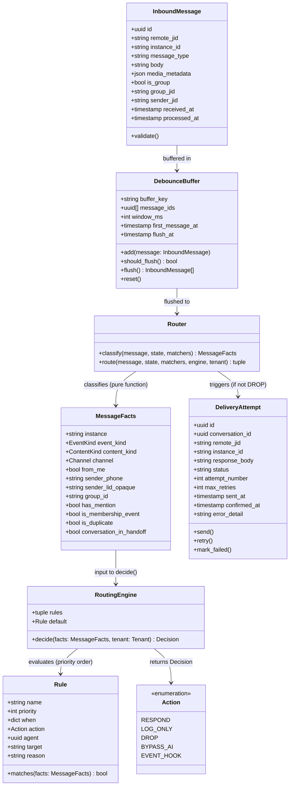
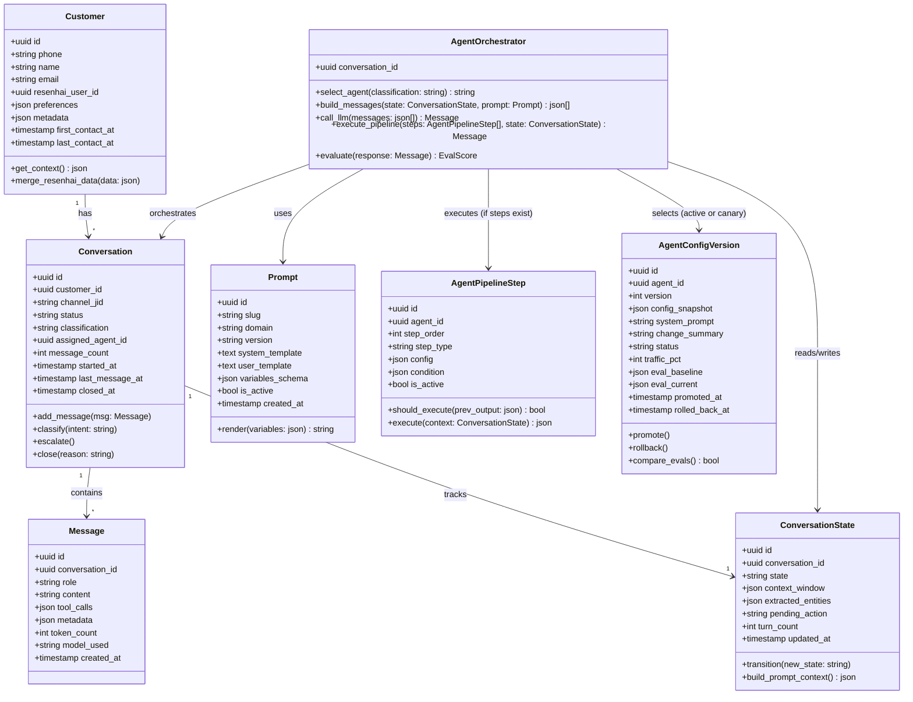
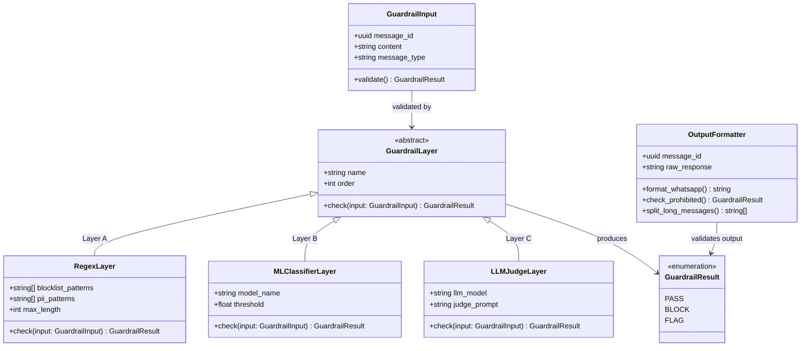
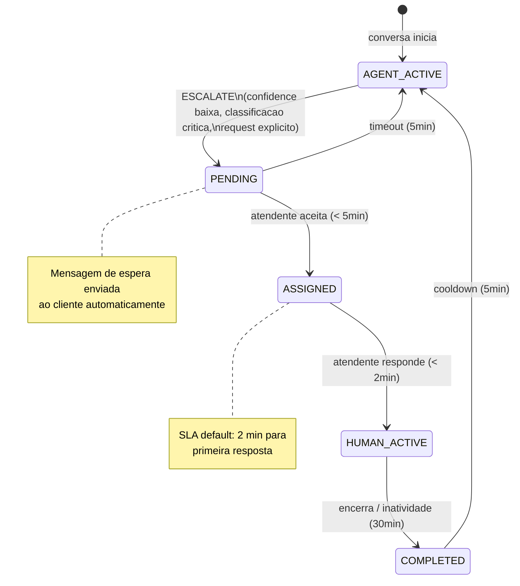
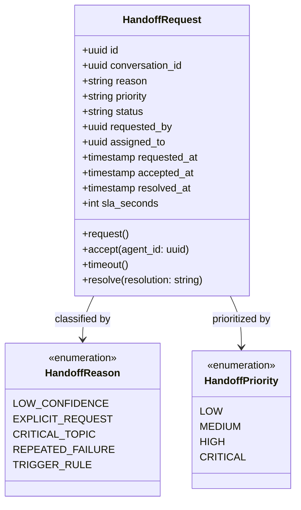
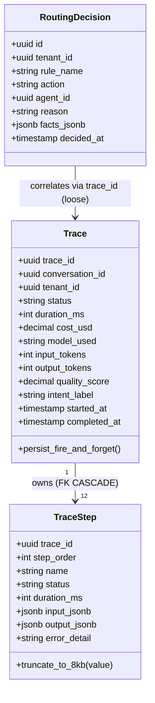

# Domain Model

Consolidacao dos bounded contexts, diagramas de classe (L4), schemas SQL e invariantes do ProsaUAI v2.

> Stack e NFRs → ver [blueprint.md](../blueprint/) · Relacionamentos DDD → ver [context-map.md](../context-map/) · Fluxo de negocio → ver [processo](../business/process/)

---

## Bounded Contexts

| # | Bounded Context | Tipo | Proposito | Modulos | Aggregates |
|---|----------------|------|-----------|---------|------------|
| 1 | **Channel** | Supporting | Ingestao e entrega de mensagens WhatsApp | M1 Recepcao, M2 Debounce, M3 Router, M11 Entrega | InboundMessage, DebounceBuffer, Router, DeliveryAttempt |
| 2 | **Conversation** | Core | Pipeline IA — classificacao, agente, avaliacao | M4 Clientes, M5 Contexto, M7 Classificador, M8 Agente IA, M9 Avaliador | Customer, Conversation, SystemPrompt, Message, ToolCall |
| 3 | **Safety** | Supporting | Guardrails de entrada e saida | M6 Guardrails Entrada, M10 Guardrails Saida | PiiDetector, InjectionDetector, GuardrailCheck |
| 4 | **Operations** | Supporting | Handoff humano e triggers proativos | M12 Handoff, M13 Triggers | HandoffRequest, TriggerRule |
| 5 | **Observability** | Generic | Tracing e metricas | M14 Observabilidade | UsageEvent |
| 6 | **Admin** | Supporting (cross-tenant) | Plataforma operacional: persistencia local de traces/routing + 8 abas admin (epic 008) | M15 Admin API, M16 prosauai-admin UI | Trace, TraceStep, RoutingDecision |

> Relacionamentos entre contextos e padroes DDD → ver [context-map.md](../context-map/)

---

## Channel (M1, M2, M3, M11)

Responsavel por receber mensagens do Evolution API, agrupar mensagens rapidas via debounce, decidir a rota e entregar a resposta de volta ao WhatsApp.

Integracoes: Evolution API, Redis. [→ Ver no fluxo de negocio: Fase 1 (Entrada), Fase 2 (Router), Fase 5 (Saida)](../business/process/)

<details>
<summary><strong>Class Diagram (L4)</strong></summary>



</details>

### Structs de Pipeline (Channel)

```python
class IncomingMessage(BaseModel):
    trace_id: str
    tenant_id: UUID
    agent_id: UUID
    phone: str
    sender_name: str | None
    group_id: str | None          # None = individual, JID = grupo
    channel_type: Literal["individual", "group"]
    message_type: Literal["text", "image", "audio", "video", "document", "sticker", "contact", "location", "live_location", "poll", "reaction", "event"]
    content: str                   # texto ou descricao de midia
    media_url: str | None
    media_type: str | None
    event_type: str | None         # member_joined, member_left, etc.
    raw_payload: dict              # webhook original para debug
    received_at: datetime
```

### Tabelas Fundamentais (Multi-Tenant)

> **Obrigatorio**: TODA tabela de dados DEVE ter `tenant_id UUID NOT NULL REFERENCES tenants(id)` + index + RLS policy. Ver [ADR-011](../decisions/ADR-011-pool-rls-multi-tenant/) para hardening completo.

```sql
-- Wrapper function para RLS (ADR-011 hardening, Supabase compat)
-- Em public schema porque auth schema e gerenciado pelo Supabase (GoTrue)
CREATE OR REPLACE FUNCTION public.tenant_id()
RETURNS UUID AS $$
  SELECT current_setting('app.current_tenant_id', true)::UUID;
$$ LANGUAGE SQL STABLE SECURITY DEFINER;

-- Tenants (ADR-006, ADR-011)
CREATE TABLE tenants (
    id              UUID PRIMARY KEY DEFAULT gen_random_uuid(),
    name            TEXT NOT NULL,
    slug            TEXT NOT NULL UNIQUE,
    billing_tier    TEXT NOT NULL DEFAULT 'free'
                    CHECK (billing_tier IN ('free', 'starter', 'growth', 'business', 'enterprise')),
    settings        JSONB NOT NULL DEFAULT '{}',
    -- settings JSONB keys:
    --   default_agent_id: UUID          -- fallback agent when no routing rule matches
    --   active_hours: JSONB             -- global active hours {"start": "09:00", "end": "18:00"}
    --   timezone: TEXT                  -- e.g. 'America/Sao_Paulo'
    --   max_context_messages: INT       -- sliding window size (default 10)
    --   summarization_threshold: INT    -- trigger async summarization after N exchanges (default 20)
    is_active       BOOLEAN NOT NULL DEFAULT TRUE,
    created_at      TIMESTAMPTZ NOT NULL DEFAULT now(),
    updated_at      TIMESTAMPTZ NOT NULL DEFAULT now()
);

-- Agents — Agent-as-Data (ADR-006)
CREATE TABLE agents (
    id              UUID PRIMARY KEY DEFAULT gen_random_uuid(),
    tenant_id       UUID NOT NULL REFERENCES tenants(id),
    name            TEXT NOT NULL,
    template        TEXT NOT NULL CHECK (template IN ('support_1v1', 'group_responder', 'sales', 'onboarding', 'scheduling')),
    system_prompt   TEXT NOT NULL,
    config          JSONB NOT NULL DEFAULT '{}',  -- tools_enabled, tone, guardrails, triggers, etc
    active_version_id UUID,                       -- FK added after agent_config_versions exists (ADR-019)
    is_active       BOOLEAN NOT NULL DEFAULT TRUE,
    created_at      TIMESTAMPTZ NOT NULL DEFAULT now(),
    updated_at      TIMESTAMPTZ NOT NULL DEFAULT now()
);

ALTER TABLE agents ENABLE ROW LEVEL SECURITY;
CREATE POLICY tenant_isolation ON agents USING (tenant_id = public.tenant_id());
CREATE INDEX idx_agents_tenant ON agents (tenant_id);

-- Agent Config Versions — Canary Rollout (ADR-019)
CREATE TABLE agent_config_versions (
    id              UUID PRIMARY KEY DEFAULT gen_random_uuid(),
    tenant_id       UUID NOT NULL REFERENCES tenants(id),
    agent_id        UUID NOT NULL REFERENCES agents(id),
    version         INT NOT NULL,
    config_snapshot JSONB NOT NULL,          -- snapshot completo do config no momento
    system_prompt   TEXT NOT NULL,           -- snapshot do prompt
    change_summary  TEXT,                    -- descricao da mudanca
    status          TEXT NOT NULL DEFAULT 'draft'
                    CHECK (status IN ('draft', 'canary', 'active', 'rolled_back')),
    traffic_pct     INT NOT NULL DEFAULT 0   -- 0-100, quanto % do trafego recebe esta versao
                    CHECK (traffic_pct >= 0 AND traffic_pct <= 100),
    eval_baseline   JSONB,                  -- scores da versao anterior (snapshot para comparacao)
    eval_current    JSONB,                  -- scores acumulados desta versao
    created_at      TIMESTAMPTZ NOT NULL DEFAULT now(),
    promoted_at     TIMESTAMPTZ,            -- quando virou active (100%)
    rolled_back_at  TIMESTAMPTZ,
    UNIQUE (agent_id, version)
);

ALTER TABLE agent_config_versions ENABLE ROW LEVEL SECURITY;
CREATE POLICY tenant_isolation ON agent_config_versions USING (tenant_id = public.tenant_id());
CREATE INDEX idx_acv_agent ON agent_config_versions (agent_id, status);
CREATE INDEX idx_acv_tenant ON agent_config_versions (tenant_id);

-- FK circular: agents.active_version_id -> agent_config_versions(id)
ALTER TABLE agents ADD CONSTRAINT fk_active_version
    FOREIGN KEY (active_version_id) REFERENCES agent_config_versions(id);

-- Agent Pipeline Steps — sub-routing configuravel (ADR-006 extensao)
-- Implemented in epic 015 — see migration
-- apps/api/db/migrations/20260601000010_create_agent_pipeline_steps.sql
-- (was schema-draft until epic 015 PR-1).
-- Agents SEM pipeline steps executam como single LLM call (backward compatible).
-- Agents COM pipeline steps executam cada step em sequencia (ex: classifier → clarifier → resolver).
-- Cap MAX_PIPELINE_STEPS_PER_AGENT = 5 (CHECK step_order BETWEEN 1 AND 5).
-- Cap config <= 16 KB (CHECK octet_length); cap condition unrestricted (small dict).
-- Index idx_pipeline_agent_active (agent_id, is_active, step_order) is the
-- hot-path lookup index (SC-010 ≤5 ms p95).
CREATE TABLE agent_pipeline_steps (
    id              UUID PRIMARY KEY DEFAULT gen_random_uuid(),
    tenant_id       UUID NOT NULL REFERENCES tenants(id),
    agent_id        UUID NOT NULL REFERENCES agents(id) ON DELETE CASCADE,
    step_order      INT NOT NULL CHECK (step_order BETWEEN 1 AND 5),
    step_type       TEXT NOT NULL CHECK (step_type IN (
        'classifier', 'clarifier', 'resolver', 'specialist', 'summarizer'
    )),
    config          JSONB NOT NULL DEFAULT '{}'  -- model, prompt_slug, tools, thresholds, routing_map
                    CHECK (octet_length(config::text) <= 16384),
    condition       JSONB,                        -- opcional: quando executar (ex: {"classifier.confidence": "<0.6"})
    is_active       BOOLEAN NOT NULL DEFAULT TRUE,
    created_at      TIMESTAMPTZ NOT NULL DEFAULT now(),
    updated_at      TIMESTAMPTZ NOT NULL DEFAULT now(),
    UNIQUE (agent_id, step_order)
);

ALTER TABLE agent_pipeline_steps ENABLE ROW LEVEL SECURITY;
CREATE POLICY tenant_isolation ON agent_pipeline_steps USING (tenant_id = public.tenant_id());
CREATE INDEX idx_pipeline_agent_active ON agent_pipeline_steps (agent_id, is_active, step_order);
CREATE INDEX idx_pipeline_tenant ON agent_pipeline_steps (tenant_id);

-- Epic 015 also adds public.trace_steps.sub_steps JSONB (cap 32 KB total /
-- 4 KB per sub-step) — populated only for the generate_response row when
-- the agent has a pipeline configured. See migration
-- apps/api/db/migrations/20260601000011_alter_trace_steps_sub_steps.sql.

-- User Consents — LGPD (ADR-018)
CREATE TABLE user_consents (
    id              UUID PRIMARY KEY DEFAULT gen_random_uuid(),
    tenant_id       UUID NOT NULL REFERENCES tenants(id),
    user_phone_hash TEXT NOT NULL,  -- SHA-256 do numero (ADR-018: nunca plain text em analytics)
    consented_at    TIMESTAMPTZ NOT NULL DEFAULT now(),
    channel         TEXT NOT NULL DEFAULT 'whatsapp',
    policy_version  TEXT NOT NULL,
    revoked_at      TIMESTAMPTZ
);

ALTER TABLE user_consents ENABLE ROW LEVEL SECURITY;
CREATE POLICY tenant_isolation ON user_consents USING (tenant_id = public.tenant_id());
CREATE INDEX idx_consents_tenant ON user_consents (tenant_id);
CREATE INDEX idx_consents_user ON user_consents (user_phone_hash, tenant_id);
```

### SQL Schema

```sql
-- M1: Mensagens recebidas (raw)
CREATE TABLE inbound_messages (
    id              UUID PRIMARY KEY DEFAULT gen_random_uuid(),
    tenant_id       UUID NOT NULL REFERENCES tenants(id),
    remote_jid      TEXT NOT NULL,
    instance_id     TEXT NOT NULL,
    message_type    TEXT NOT NULL DEFAULT 'text',
    body            TEXT,
    media_metadata  JSONB,
    is_group        BOOLEAN NOT NULL DEFAULT FALSE,
    group_jid       TEXT,
    sender_jid      TEXT,
    received_at     TIMESTAMPTZ NOT NULL DEFAULT now(),
    processed_at    TIMESTAMPTZ,
    created_at      TIMESTAMPTZ NOT NULL DEFAULT now()
);

ALTER TABLE inbound_messages ENABLE ROW LEVEL SECURITY;
CREATE POLICY tenant_isolation ON inbound_messages USING (tenant_id = public.tenant_id());
CREATE INDEX idx_inbound_tenant ON inbound_messages (tenant_id);
CREATE INDEX idx_inbound_remote_jid ON inbound_messages (tenant_id, remote_jid, received_at DESC);
CREATE INDEX idx_inbound_unprocessed ON inbound_messages (processed_at) WHERE processed_at IS NULL;

-- M2: Buffer de debounce (transiente, pode ser Redis-only)
-- Mantido em SQL para auditoria; Redis TTL e a source of truth em runtime
CREATE TABLE debounce_buffers (
    tenant_id       UUID NOT NULL REFERENCES tenants(id),
    buffer_key      TEXT PRIMARY KEY,  -- remote_jid ou group_jid
    message_ids     UUID[] NOT NULL DEFAULT '{}',
    window_ms       INT NOT NULL DEFAULT 3000,
    first_message_at TIMESTAMPTZ NOT NULL,
    flush_at        TIMESTAMPTZ,
    created_at      TIMESTAMPTZ NOT NULL DEFAULT now()
);

ALTER TABLE debounce_buffers ENABLE ROW LEVEL SECURITY;
CREATE POLICY tenant_isolation ON debounce_buffers USING (tenant_id = public.tenant_id());
CREATE INDEX idx_debounce_tenant ON debounce_buffers (tenant_id);

-- M3: Decisoes de roteamento
CREATE TABLE route_decisions (
    id              UUID PRIMARY KEY DEFAULT gen_random_uuid(),
    tenant_id       UUID NOT NULL REFERENCES tenants(id),
    buffer_key      TEXT NOT NULL,
    message_ids     UUID[] NOT NULL,
    decision        TEXT NOT NULL CHECK (decision IN (
        'RESPOND', 'LOG_ONLY', 'DROP', 'BYPASS_AI', 'EVENT_HOOK'
    )),
    reason          TEXT,
    routing_metadata JSONB,
    decided_at      TIMESTAMPTZ NOT NULL DEFAULT now()
);

ALTER TABLE route_decisions ENABLE ROW LEVEL SECURITY;
CREATE POLICY tenant_isolation ON route_decisions USING (tenant_id = public.tenant_id());
CREATE INDEX idx_route_tenant ON route_decisions (tenant_id);
CREATE INDEX idx_route_decision ON route_decisions (tenant_id, decision, decided_at DESC);

-- M3: Routing Rules — configuracao declarativa YAML per-tenant (epic 004)
-- Implementacao atual: rules carregadas de config/routing/{tenant}.yaml no startup.
-- Cada regra tem: name, priority, when (condicoes sobre MessageFacts), action, agent (opcional).
-- classify() puro → MessageFacts; RoutingEngine.decide() avalia rules por priority ASC, first-match wins.
-- Agent resolution: rule.agent > tenant.default_agent_id > AgentResolutionError.
-- MECE garantido em 4 camadas: tipo (enums), schema (pydantic), runtime (discriminated union), CI (property-based).
-- Tabela abaixo e a versao DB-backed planejada para epic 006 (Configurable Routing DB).
CREATE TABLE routing_rules (
    id               UUID PRIMARY KEY DEFAULT gen_random_uuid(),
    tenant_id        UUID NOT NULL REFERENCES tenants(id),
    name             TEXT NOT NULL,            -- identificador unico da regra dentro do tenant
    priority         INT NOT NULL DEFAULT 100, -- menor = maior prioridade
    when_conditions  JSONB NOT NULL,           -- {"channel": "group", "has_mention": true, "event_kind": "message"}
    action           TEXT NOT NULL CHECK (action IN ('RESPOND', 'LOG_ONLY', 'DROP', 'BYPASS_AI', 'EVENT_HOOK')),
    agent_id         UUID REFERENCES agents(id), -- opcional: so para RESPOND
    target           TEXT,                     -- handler target para BYPASS_AI/EVENT_HOOK
    reason           TEXT,                     -- motivo (obrigatorio para DROP)
    is_active        BOOLEAN NOT NULL DEFAULT TRUE,
    created_at       TIMESTAMPTZ NOT NULL DEFAULT now(),
    updated_at       TIMESTAMPTZ NOT NULL DEFAULT now()
);

ALTER TABLE routing_rules ENABLE ROW LEVEL SECURITY;
CREATE POLICY tenant_isolation ON routing_rules USING (tenant_id = public.tenant_id());
CREATE INDEX idx_routing_tenant_priority ON routing_rules (tenant_id, priority);
CREATE INDEX idx_routing_tenant ON routing_rules (tenant_id);

-- M11: Tentativas de entrega
CREATE TABLE delivery_attempts (
    id              UUID PRIMARY KEY DEFAULT gen_random_uuid(),
    tenant_id       UUID NOT NULL REFERENCES tenants(id),
    conversation_id UUID NOT NULL,
    remote_jid      TEXT NOT NULL,
    instance_id     TEXT NOT NULL,
    response_body   TEXT NOT NULL,
    status          TEXT NOT NULL DEFAULT 'pending'
                    CHECK (status IN ('pending', 'sent', 'confirmed', 'failed')),
    attempt_number  INT NOT NULL DEFAULT 1,
    max_retries     INT NOT NULL DEFAULT 3,
    sent_at         TIMESTAMPTZ,
    confirmed_at    TIMESTAMPTZ,
    error_detail    TEXT,
    created_at      TIMESTAMPTZ NOT NULL DEFAULT now()
);

CREATE INDEX idx_delivery_conversation ON delivery_attempts (conversation_id, attempt_number);
CREATE INDEX idx_delivery_pending ON delivery_attempts (status) WHERE status = 'pending';
```

### Invariantes

1. **Toda mensagem recebida e persistida antes de qualquer processamento** — crash recovery garante zero message loss
2. **Debounce window e configuravel por instancia** — default 3s, maximo 10s
3. **RouteDecision e imutavel** — uma vez decidida, nao muda. Reroteamento cria nova decisao
4. **DeliveryAttempt retry com backoff exponencial** — base 2s, max 3 tentativas
5. **Mensagens de grupo sempre carregam `group_jid` e `sender_jid`** — constraint NOT NULL quando `is_group = TRUE`
6. **Buffer flush e atomico** — todas mensagens do buffer sao processadas juntas ou nenhuma
7. **DROP nao cria DeliveryAttempt** — mensagens descartadas terminam no route_decisions

#### Routing Engine (epic 004 — MECE)

8. **Routing rules avaliadas por priority ASC, first-match wins** — sem match usa regra default do tenant
9. **Agent resolution: rule.agent > tenant.default_agent_id > AgentResolutionError** — validacao fail-fast no startup
10. **MECE garantido em 4 camadas** — tipo (enums), schema (pydantic validates overlaps), runtime (discriminated union), CI (property-based testing)
10. **RouteDecision e RoutingRule sao ortogonais** — RouteDecision define o path (SUPPORT, GROUP_RESPOND, etc.), RoutingRule define qual agent_id atende

---

## Conversation — Core Domain (M4, M5, M7, M8, M9)

Dominio central do ProsaUAI. Gerencia o ciclo de vida de conversas, contexto do cliente, classificacao de intencao, orquestracao de agentes de resposta e avaliacao de qualidade.

Integracoes: Bifrost, Supabase ProsaUAI, Supabase ResenhAI. [→ Ver no fluxo de negocio: Fase 3 (Pipeline Core), Fase 4 (Avaliador)](../business/process/)

<details>
<summary><strong>Class Diagram (L4)</strong></summary>



</details>

### Structs de Pipeline (Conversation)

```python
class ClassificationResult(BaseModel):
    intent: Literal["greeting", "ranking_query", "game_query", "account_help",
                     "rules_question", "handoff_request", "general", "out_of_scope"]
    confidence: float              # 0.0-1.0, threshold: 0.7
    explanation: str
```

> **Regra**: Se `confidence < 0.7` → fallback para intent `general`.

### SQL Schema

```sql
-- M4: Customers
-- Nota: phone armazenado em plain text (necessario para envio).
-- Em logs, traces e analytics, usar SHA-256 hash (ADR-018).
CREATE TABLE customers (
    id                UUID PRIMARY KEY DEFAULT gen_random_uuid(),
    tenant_id         UUID NOT NULL REFERENCES tenants(id),
    phone             TEXT NOT NULL,
    name              TEXT,
    email             TEXT,
    resenhai_user_id  UUID,
    preferences       JSONB NOT NULL DEFAULT '{}',
    metadata          JSONB NOT NULL DEFAULT '{}',
    first_contact_at  TIMESTAMPTZ NOT NULL DEFAULT now(),
    last_contact_at   TIMESTAMPTZ NOT NULL DEFAULT now(),
    created_at        TIMESTAMPTZ NOT NULL DEFAULT now(),
    updated_at        TIMESTAMPTZ NOT NULL DEFAULT now(),
    UNIQUE (tenant_id, phone)  -- phone unico POR tenant, nao global
);

ALTER TABLE customers ENABLE ROW LEVEL SECURITY;
CREATE POLICY tenant_isolation ON customers USING (tenant_id = public.tenant_id());
CREATE INDEX idx_customer_tenant ON customers (tenant_id);
CREATE INDEX idx_customer_phone ON customers (tenant_id, phone);
CREATE INDEX idx_customer_resenhai ON customers (resenhai_user_id) WHERE resenhai_user_id IS NOT NULL;

-- M5 + M7 + M8: Conversations
CREATE TABLE conversations (
    id                UUID PRIMARY KEY DEFAULT gen_random_uuid(),
    tenant_id         UUID NOT NULL REFERENCES tenants(id),
    customer_id       UUID NOT NULL REFERENCES customers(id),
    channel_jid       TEXT NOT NULL,
    status            TEXT NOT NULL DEFAULT 'active'
                      CHECK (status IN ('active', 'waiting', 'escalated', 'closed')),
    classification    TEXT,
    assigned_agent_id UUID REFERENCES agents(id),
    message_count     INT NOT NULL DEFAULT 0,
    started_at        TIMESTAMPTZ NOT NULL DEFAULT now(),
    last_message_at   TIMESTAMPTZ,
    closed_at         TIMESTAMPTZ,
    created_at        TIMESTAMPTZ NOT NULL DEFAULT now(),
    updated_at        TIMESTAMPTZ NOT NULL DEFAULT now()
);

ALTER TABLE conversations ENABLE ROW LEVEL SECURITY;
CREATE POLICY tenant_isolation ON conversations USING (tenant_id = public.tenant_id());
CREATE INDEX idx_conv_tenant ON conversations (tenant_id);
CREATE INDEX idx_conv_customer ON conversations (tenant_id, customer_id, started_at DESC);
CREATE INDEX idx_conv_active ON conversations (tenant_id, status) WHERE status = 'active';
CREATE INDEX idx_conv_classification ON conversations (classification) WHERE classification IS NOT NULL;

-- M5: Messages
CREATE TABLE messages (
    id                UUID PRIMARY KEY DEFAULT gen_random_uuid(),
    tenant_id         UUID NOT NULL REFERENCES tenants(id),
    conversation_id   UUID NOT NULL REFERENCES conversations(id),
    role              TEXT NOT NULL CHECK (role IN ('user', 'assistant', 'system', 'tool')),
    content           TEXT,
    tool_calls        JSONB,
    metadata          JSONB NOT NULL DEFAULT '{}',
    token_count       INT,
    model_used        TEXT,
    created_at        TIMESTAMPTZ NOT NULL DEFAULT now()
);

ALTER TABLE messages ENABLE ROW LEVEL SECURITY;
CREATE POLICY tenant_isolation ON messages USING (tenant_id = public.tenant_id());
CREATE INDEX idx_msg_tenant ON messages (tenant_id);
CREATE INDEX idx_msg_conversation ON messages (tenant_id, conversation_id, created_at);

-- M5: Conversation State (contexto vivo da conversa)
-- Estrategia de memoria: hybrid sliding window + summarization async.
-- context_window: ultimas N mensagens verbatim (default N=10 via tenants.settings.max_context_messages).
-- Apos threshold de exchanges (default 20 via tenants.settings.summarization_threshold),
-- summarization async comprime mensagens mais antigas em extracted_entities.conversation_summary.
-- Token budget: system_prompt (~1000) + profile (~500) + messages (variavel) + response (~2000).
--
-- IMPORTANTE: contexto cross-conversation usa dados estruturados (customers.preferences,
-- customers.metadata, query das ultimas N conversas), NAO vector-based long-term memory.
-- pgvector (ADR-013) e exclusivamente para RAG knowledge base, NAO para memoria de conversas.
CREATE TABLE conversation_states (
    id                UUID PRIMARY KEY DEFAULT gen_random_uuid(),
    tenant_id         UUID NOT NULL REFERENCES tenants(id),
    conversation_id   UUID NOT NULL UNIQUE REFERENCES conversations(id),
    state             TEXT NOT NULL DEFAULT 'greeting'
                      CHECK (state IN (
                          'greeting', 'gathering_info', 'processing',
                          'responding', 'awaiting_confirmation', 'escalating', 'closed'
                      )),
    context_window    JSONB NOT NULL DEFAULT '[]',
    extracted_entities JSONB NOT NULL DEFAULT '{}',
    pending_action    TEXT,
    turn_count        INT NOT NULL DEFAULT 0,
    updated_at        TIMESTAMPTZ NOT NULL DEFAULT now()
);

ALTER TABLE conversation_states ENABLE ROW LEVEL SECURITY;
CREATE POLICY tenant_isolation ON conversation_states USING (tenant_id = public.tenant_id());
CREATE INDEX idx_state_tenant ON conversation_states (tenant_id);
CREATE INDEX idx_state_conversation ON conversation_states (conversation_id);

-- M8: Prompts (versionados, slug-based)
-- Nota: prompts sao GLOBAIS da plataforma (compartilhados entre tenants).
-- Excecao documentada a regra "toda tabela tem tenant_id" — prompts sao templates
-- versionados pela equipe de produto, nao configurados por tenant.
-- System prompts customizados por tenant ficam em agents.system_prompt (ADR-006).
CREATE TABLE prompts (
    id                UUID PRIMARY KEY DEFAULT gen_random_uuid(),
    slug              TEXT NOT NULL,
    domain            TEXT NOT NULL,
    version           TEXT NOT NULL,
    system_template   TEXT NOT NULL,
    user_template     TEXT,
    variables_schema  JSONB NOT NULL DEFAULT '{}',
    is_active         BOOLEAN NOT NULL DEFAULT TRUE,
    created_at        TIMESTAMPTZ NOT NULL DEFAULT now(),
    UNIQUE (slug, version)
);

CREATE INDEX idx_prompt_active ON prompts (slug, is_active) WHERE is_active = TRUE;

-- M9: Eval scores (avaliacao de qualidade por mensagem)
-- Schema canonico atual reflete o estado pos-epic 011 (ADR-039):
--   * `evaluator_type` (nao `evaluator`) — column legacy do epic 005
--   * `quality_score`  (nao `score`)     — column legacy do epic 005
--   * `metric`         — adicionada em 011 (PR-A, migration 20260601000001)
--     com DEFAULT 'heuristic_composite' + CHECK (metric IN
--     ('heuristic_composite','answer_relevancy','toxicity','bias',
--      'coherence','human_verdict')).
-- Renomeacao das colunas legacy foi explicitamente rejeitada (R11/ADR-039)
-- para preservar epic 005 + epic 008 sem migracao destrutiva.
CREATE TABLE eval_scores (
    id                UUID PRIMARY KEY DEFAULT gen_random_uuid(),
    tenant_id         UUID NOT NULL REFERENCES tenants(id),
    message_id        UUID REFERENCES messages(id),  -- nullable: deepeval pode targetar conversation-level
    conversation_id   UUID NOT NULL REFERENCES conversations(id),
    evaluator_type    TEXT NOT NULL,                  -- 'heuristic_v1','deepeval','human'
    metric            VARCHAR(50) NOT NULL DEFAULT 'heuristic_composite',
    quality_score     FLOAT NOT NULL CHECK (quality_score >= 0 AND quality_score <= 1),
    details           JSONB,
    created_at        TIMESTAMPTZ NOT NULL DEFAULT now(),
    CONSTRAINT chk_eval_scores_metric
        CHECK (metric IN (
            'heuristic_composite','answer_relevancy','toxicity',
            'bias','coherence','human_verdict'
        ))
);

ALTER TABLE eval_scores ENABLE ROW LEVEL SECURITY;
CREATE POLICY tenant_isolation ON eval_scores USING (tenant_id = public.tenant_id());
CREATE INDEX idx_eval_tenant ON eval_scores (tenant_id);
CREATE INDEX idx_eval_message ON eval_scores (message_id);
CREATE INDEX idx_eval_conversation ON eval_scores (tenant_id, conversation_id, metric);
-- epic 011: aggregate query para Performance AI cards
CREATE INDEX idx_eval_scores_tenant_evaluator_metric_created
    ON eval_scores (tenant_id, evaluator_type, metric, created_at DESC);

-- M9 Extension (epic 011, PR-A): tri-state KPI North Star.
-- Cron `autonomous_resolution_cron` (03:00 UTC) popula a partir da
-- heuristica A canonica (ADR-040). NULL = nao calculado, TRUE = passou,
-- FALSE = explicitamente nao-autonoma. Nao sofre retention 90d
-- (FR-053) — vision precisa janela 18m.
ALTER TABLE conversations ADD COLUMN IF NOT EXISTS auto_resolved BOOLEAN NULL;
CREATE INDEX IF NOT EXISTS idx_conversations_auto_resolved
    ON conversations (tenant_id, auto_resolved, closed_at DESC)
    WHERE auto_resolved IS NOT NULL;

-- M5 Extension (epic 011, PR-A): direct-message discriminator para grupos.
-- DEFAULT TRUE cobre 1:1 retroativamente; pipeline ingestion seta
-- explicitamente para grupos (mention/reply ao bot). Usado pela
-- heuristica A condicao (b) e (c).
ALTER TABLE messages ADD COLUMN IF NOT EXISTS is_direct BOOLEAN NOT NULL DEFAULT TRUE;
CREATE INDEX IF NOT EXISTS idx_messages_conversation_inbound_direct
    ON messages (conversation_id, created_at DESC)
    WHERE direction = 'inbound' AND is_direct = TRUE;

-- Admin-only carve-out (epic 011, PR-B). Sem RLS (ADR-027).
-- Append-only: verdict efetivo = MAX(created_at) por trace_id.
-- 'cleared' e o terceiro valor para "undo" sem deletar (FR-030).
-- FK ON DELETE CASCADE em public.traces(trace_id) garante cleanup
-- automatico via retention 90d + LGPD SAR.
CREATE TABLE IF NOT EXISTS public.golden_traces (
    id                 UUID         PRIMARY KEY DEFAULT gen_random_uuid(),
    trace_id           TEXT         NOT NULL REFERENCES public.traces(trace_id) ON DELETE CASCADE,
    verdict            TEXT         NOT NULL CHECK (verdict IN ('positive','negative','cleared')),
    notes              TEXT,
    created_by_user_id UUID,
    created_at         TIMESTAMPTZ  NOT NULL DEFAULT now()
);
CREATE INDEX IF NOT EXISTS idx_golden_traces_trace_created
    ON public.golden_traces (trace_id, created_at DESC);
```

### Row-Level Security (RLS)

> **CRITICO**: Todas as tabelas acima ja incluem RLS habilitado + policy `tenant_isolation` inline.
> O padrao completo de hardening esta documentado em [ADR-011](../decisions/ADR-011-pool-rls-multi-tenant/).

```sql
-- Wrapper function (definida uma vez, usada em todas as policies)
-- Ver secao "Tabelas Fundamentais" acima

-- Regras inviolaveis (ADR-011):
-- 1. NUNCA usar user_metadata em policies (editavel pelo usuario)
-- 2. NUNCA usar service role key no backend que processa mensagens
-- 3. NUNCA testar RLS com superuser (bypassa por default)
-- 4. TODA view DEVE usar security_invoker = true (PG 15+)
-- 5. Index em toda coluna tenant_id (sem index = 10x slowdown)

-- Testes automatizados cross-tenant (rodar em CI):
-- Criar roles test_tenant_a e test_tenant_b
-- Inserir dados como tenant_a, query como tenant_b → assertar zero resultados
```

### Invariantes

1. **Conversation e o aggregate root** — toda operacao no dominio passa por uma conversa
2. **Messages sao append-only** — nunca editadas ou deletadas em runtime
3. **Conversation so fecha com motivo** — `close(reason)` obrigatorio
4. **Uma conversa ativa por customer/channel** — constraint de unicidade logica
5. **Context window tem tamanho maximo** — trunca mensagens mais antigas mantendo system prompt
6. **Prompt e imutavel apos criacao** — nova versao = novo registro
7. **Eval scores sao asincronos** — nunca bloqueiam o fluxo de resposta
8. **Customer merge e idempotente** — dados do ResenhAI sao merged, nunca sobrescritos
9. **Classification pode mudar mid-conversation** — historico mantido via messages de system
10. **turn_count incrementa a cada par user+assistant** — nao por mensagem individual

#### Agent Config Versioning (ADR-019)

11. **Apenas 1 versao `active` por agent** — constraint logica enforced no app layer
12. **No maximo 1 versao `canary` por agent** — nao permite multiplos canaries simultaneos
13. **`traffic_pct` da canary + active sempre soma 100** — enforced ao ativar canary
14. **Rollback e imediato** — canary → rolled_back, active mantem 100%
15. **`config_snapshot` e imutavel** — editar cria nova versao, nunca modifica existente
16. **Minimum sample size antes de promover** — default 50 conversas, evita decisoes com dados insuficientes

#### Agent Pipeline Steps (ADR-006 extensao)

17. **Pipeline steps executam em step_order sequencial** — zero steps = single LLM call (backward compatible)
18. **Cada step recebe o output do step anterior como input** — primeiro step recebe o ConversationState original
19. **Conditions sao opcionais** — omitido = step sempre executa
20. **Step config e independente do agent config** — model, prompt_slug, tools e thresholds por step

#### Short-Term Memory (M5 Context)

21. **Context window e sliding window de ultimas N mensagens** — default N=10 (configuravel via `tenants.settings.max_context_messages`)
22. **Summarization async apos threshold** — default 20 exchanges. Summary armazenado em `extracted_entities.conversation_summary`
23. **Token budget fixo** — system_prompt (~1000) + profile (~500) + messages (variavel) + response reserve (~2000). Truncar mensagens mais antigas se exceder
24. **Cross-conversation context usa dados estruturados** — `customers.preferences`, `customers.metadata`, query de ultimas N conversas. NAO usa vector-based long-term memory

---

## Safety (M6, M10)

Guardrails de entrada e saida que protegem o pipeline contra conteudo toxico, PII e prompt injection. [→ Ver no fluxo de negocio: Fase 3 (Guardrails Entrada), Fase 5 (Guardrails Saida)](../business/process/)

<details>
<summary><strong>Class Diagram (L4)</strong></summary>



</details>

---

## Operations (M12, M13)

Gerencia transicoes de controle (bot → humano → bot) e automacoes baseadas em regras de trigger.

Integracoes: prosauai-admin, Supabase ProsaUAI, Channel (M11). [→ Ver no fluxo de negocio: Fase 6 (Handoff), Fase 7 (Triggers)](../business/process/)

### M12 — Handoff

<details>
<summary><strong>State Diagram</strong></summary>



</details>

<details>
<summary><strong>Class Diagram — Handoff (L4)</strong></summary>



</details>

### M13 — Triggers (Epic 016)

<details>
<summary><strong>Class Diagram — Triggers (L4)</strong></summary>

```mermaid
classDiagram
    class TriggerConfig {
        <<YAML-only — tenants.yaml>>
        +string id
        +TriggerType type
        +bool enabled
        +json match
        +string template_ref
        +int cooldown_hours
        +int lookahead_hours
    }

    class TriggerEvent {
        +uuid id
        +uuid tenant_id
        +uuid customer_id
        +string trigger_id
        +string template_name
        +timestamptz fired_at
        +timestamptz sent_at
        +TriggerStatus status
        +string error
        +float cost_usd_estimated
        +json payload
        +int retry_count
    }

    class TriggerType {
        <<enumeration>>
        time_before_scheduled_event
        time_after_conversation_closed
        time_after_last_inbound
    }

    class TriggerStatus {
        <<enumeration>>
        queued
        sent
        failed
        skipped
        dry_run
    }

    class TemplateCatalog {
        <<YAML-only — tenants.yaml>>
        +string name
        +string language
        +list components
        +string approval_id
        +float cost_usd
    }

    class CooldownGate {
        <<Redis key>>
        +key cooldown:{tenant}:{customer}:{trigger_id}
        +int ttl_seconds
    }

    class DailyCapGate {
        <<Redis key>>
        +key daily_cap:{tenant}:{customer}:{date}
        +int counter
        +int ttl_26h
    }

    TriggerConfig --> TriggerType : type
    TriggerConfig --> TemplateCatalog : template_ref
    TriggerConfig "1" --> "*" TriggerEvent : produces
    TriggerEvent --> TriggerStatus : status
    TriggerEvent --> CooldownGate : checked before send
    TriggerEvent --> DailyCapGate : checked before send
```

</details>

> **Armazenamento**: `TriggerConfig` e `TemplateCatalog` vivem apenas em `config/tenants.yaml` (zero tabelas no BD para config). Hot-reload <60s via config_poller existente. `TriggerEvent` persiste na tabela `public.trigger_events` (admin-only ADR-027 carve-out — **sem RLS**). Retention 90d via retention-cron (epic 006). [ADR-049](../decisions/ADR-049-trigger-engine-cron-design.md) · [ADR-050](../decisions/ADR-050-template-catalog-yaml.md)

### Structs de Pipeline (Safety)

```python
class EvalResult(BaseModel):
    action: Literal["continue", "handoff", "close"]
    quality_score: float           # 0.0-1.0
    urgencia: Literal["high", "normal"]  # high = SLA 15min, normal = SLA 4h
    summary: str
    reasoning: str
```

> **Score interpretation**: < 0.5 → handoff/close | 0.5-0.8 → continue com cautela | > 0.8 → continue confiante.

### SQL Schema

```sql
-- M12: Handoff requests
CREATE TABLE handoff_requests (
    id              UUID PRIMARY KEY DEFAULT gen_random_uuid(),
    tenant_id       UUID NOT NULL REFERENCES tenants(id),
    conversation_id UUID NOT NULL REFERENCES conversations(id),
    reason          TEXT NOT NULL CHECK (reason IN (
        'LOW_CONFIDENCE', 'EXPLICIT_REQUEST', 'CRITICAL_TOPIC',
        'REPEATED_FAILURE', 'TRIGGER_RULE'
    )),
    priority        TEXT NOT NULL DEFAULT 'MEDIUM'
                    CHECK (priority IN ('LOW', 'MEDIUM', 'HIGH', 'CRITICAL')),
    status          TEXT NOT NULL DEFAULT 'PENDING'
                    CHECK (status IN ('PENDING', 'ASSIGNED', 'HUMAN_ACTIVE', 'COMPLETED')),
    requested_by    UUID,          -- null = sistema automatico
    assigned_to     UUID,          -- agente humano que aceitou
    sla_seconds     INT NOT NULL DEFAULT 300,
    requested_at    TIMESTAMPTZ NOT NULL DEFAULT now(),
    accepted_at     TIMESTAMPTZ,
    resolved_at     TIMESTAMPTZ,
    resolution      TEXT,
    created_at      TIMESTAMPTZ NOT NULL DEFAULT now()
);

ALTER TABLE handoff_requests ENABLE ROW LEVEL SECURITY;
CREATE POLICY tenant_isolation ON handoff_requests USING (tenant_id = public.tenant_id());
CREATE INDEX idx_handoff_tenant ON handoff_requests (tenant_id);
CREATE INDEX idx_handoff_conversation ON handoff_requests (tenant_id, conversation_id, requested_at DESC);
CREATE INDEX idx_handoff_pending ON handoff_requests (tenant_id, status) WHERE status = 'PENDING';
CREATE INDEX idx_handoff_assigned ON handoff_requests (assigned_to) WHERE assigned_to IS NOT NULL;

-- M13: Trigger events (append-only audit trail — admin-only, sem RLS, ADR-027)
CREATE TABLE public.trigger_events (
    id                    UUID PRIMARY KEY DEFAULT gen_random_uuid(),
    tenant_id             UUID NOT NULL,
    customer_id           UUID NOT NULL,
    trigger_id            TEXT NOT NULL,
    template_name         TEXT,
    fired_at              TIMESTAMPTZ NOT NULL DEFAULT now(),
    sent_at               TIMESTAMPTZ,
    status                TEXT NOT NULL CHECK (status IN (
                              'queued', 'sent', 'failed', 'skipped', 'dry_run'
                          )),
    error                 TEXT,
    cost_usd_estimated    NUMERIC(10,6),
    payload               JSONB,
    retry_count           INT NOT NULL DEFAULT 0
);

-- Acesso exclusivamente via pool_admin (BYPASSRLS) — sem ALTER TABLE ENABLE RLS
CREATE INDEX idx_trigger_events_tenant_fired
    ON public.trigger_events (tenant_id, fired_at DESC);
CREATE INDEX idx_trigger_events_customer
    ON public.trigger_events (tenant_id, customer_id, fired_at DESC);
-- Idempotencia camada 2 (FR-017): partial UNIQUE impede double-send sob race
CREATE UNIQUE INDEX idx_trigger_events_idempotent
    ON public.trigger_events (tenant_id, customer_id, trigger_id, date(fired_at))
    WHERE status IN ('sent', 'queued');
CREATE INDEX idx_trigger_events_global_pagination
    ON public.trigger_events (tenant_id, id DESC);
CREATE INDEX idx_trigger_events_stuck
    ON public.trigger_events (tenant_id, fired_at)
    WHERE status = 'queued';
```

### Invariantes

#### Handoff (M12)

1. **Um handoff ativo por conversa** — nao pode ter dois requests pendentes simultaneos
2. **SLA e enforced pelo worker** — job verifica timeout a cada 30s
3. **Timeout retorna ao bot** — cliente recebe mensagem automatica de retomada
4. **Prioridade CRITICAL bypassa fila** — notificacao push imediata
5. **Handoff resolvido e imutavel** — status `resolved` ou `timed_out` nao muda

#### Triggers (M13)

1. **Config YAML-only** — zero tabelas DB para config; hot-reload <60s
2. **Cron singleton** — `pg_try_advisory_lock` garante at-most-one executor por tenant
3. **Anti-spam duplo** — cooldown per `(tenant,customer,trigger_id)` + daily cap per `(tenant,customer,date)`
4. **Idempotencia camada 2** — partial UNIQUE index impede double-send sob race condition
5. **Audit trail imutavel** — `trigger_events` append-only; retention 90d; sem RLS (pool_admin only)

---

## Observability (M14)

Dominio passivo. Consome eventos de todos os outros dominios para prover tracing distribuido, avaliacao de qualidade e metricas de uso. Nunca altera estado de outros dominios. [→ Ver no fluxo de negocio: Fase 8 (Observabilidade)](../business/process/)

### Stack

| Ferramenta | Papel | Integracao |
|-----------|-------|-----------|
| **Phoenix (Arize)** | Tracing distribuido fim-a-fim, waterfall UI, SpanQL queries. Self-hosted, Postgres backend. Substitui LangFuse | OTel SDK Python → OTLP gRPC :4317, fire-and-forget |
| **DeepEval** | Avaliacao offline de qualidade (faithfulness, relevance, toxicity) | Batch jobs no worker, scores → eval_scores |
| **Promptfoo** | Teste de regressao de prompts pre-deploy | CI/CD, red-teaming, comparacao A/B |

### SQL Schema

```sql
-- Eval scores: definicao canonica em Conversation (eval_scores table)
-- Aqui apenas usage_events, especifico de Observability

-- M14: Usage events (metricas de consumo e performance)
CREATE TABLE usage_events (
    id              UUID PRIMARY KEY DEFAULT gen_random_uuid(),
    tenant_id       UUID NOT NULL REFERENCES tenants(id),
    event_type      TEXT NOT NULL,  -- 'llm_call', 'message_processed', 'handoff', 'delivery', etc
    conversation_id UUID,
    customer_id     UUID,
    model           TEXT,           -- 'gpt-4.1-mini', etc
    input_tokens    INT,
    output_tokens   INT,
    latency_ms      INT,
    cost_usd        NUMERIC(10,6),
    metadata        JSONB NOT NULL DEFAULT '{}',
    created_at      TIMESTAMPTZ NOT NULL DEFAULT now()
);

ALTER TABLE usage_events ENABLE ROW LEVEL SECURITY;
CREATE POLICY tenant_isolation ON usage_events USING (tenant_id = public.tenant_id());
CREATE INDEX idx_usage_tenant ON usage_events (tenant_id);
CREATE INDEX idx_usage_type ON usage_events (tenant_id, event_type, created_at DESC);
CREATE INDEX idx_usage_conversation ON usage_events (conversation_id) WHERE conversation_id IS NOT NULL;
CREATE INDEX idx_usage_model ON usage_events (model, created_at DESC) WHERE model IS NOT NULL;

-- Particao por mes (recomendado para volume alto)
-- CREATE TABLE usage_events_2026_03 PARTITION OF usage_events
--     FOR VALUES FROM ('2026-03-01') TO ('2026-04-01');
```

### Queries Uteis

```sql
-- Custo diario por modelo
SELECT
    model,
    DATE(created_at) AS day,
    COUNT(*) AS calls,
    SUM(input_tokens) AS total_input,
    SUM(output_tokens) AS total_output,
    SUM(cost_usd) AS total_cost
FROM usage_events
WHERE event_type = 'llm_call'
GROUP BY model, DATE(created_at)
ORDER BY day DESC, total_cost DESC;

-- Latencia p50/p95/p99 por modelo
SELECT
    model,
    PERCENTILE_CONT(0.50) WITHIN GROUP (ORDER BY latency_ms) AS p50,
    PERCENTILE_CONT(0.95) WITHIN GROUP (ORDER BY latency_ms) AS p95,
    PERCENTILE_CONT(0.99) WITHIN GROUP (ORDER BY latency_ms) AS p99
FROM usage_events
WHERE event_type = 'llm_call'
    AND created_at > now() - INTERVAL '24 hours'
GROUP BY model;

-- Scores medios por metrica (ultima semana)
SELECT
    metric,
    evaluator,
    AVG(score) AS avg_score,
    COUNT(*) AS sample_size
FROM eval_scores
WHERE created_at > now() - INTERVAL '7 days'
GROUP BY metric, evaluator
ORDER BY avg_score ASC;
```

### Invariantes

1. **Observability e read-only** em relacao a outros dominios — nunca altera conversas, mensagens ou estados
2. **Usage events sao fire-and-forget** — falha ao gravar nao bloqueia o fluxo principal
3. **Eval scores podem ser gerados async** — batch jobs no worker processam em background
4. **Retencao de 90 dias para usage_events** — alem disso, agregados em tabela resumo
5. **Phoenix trace_id = conversation_id** — correlacao 1:1 para facilitar debugging. Phoenix substitui LangFuse (epic 002)

---

## Admin — Persistencia Local para Admin Platform (M15, M16)

Bounded context cross-tenant introduzido pelo **epic 008** (Admin Evolution). Espelha a telemetria do pipeline em tabelas `public.*` consultadas pela UI admin sem depender de Phoenix API em runtime. Acesso via `pool_admin` (BYPASSRLS). [→ Ver [ADR-027](../decisions/ADR-027-admin-tables-no-rls/) (tabelas sem RLS) | [ADR-028](../decisions/ADR-028-pipeline-fire-and-forget-persistence/) (fire-and-forget)]

### Modelo

| Entidade | Tabela | Proposito | Retencao | Relacao com Pipeline |
|----------|--------|-----------|----------|----------------------|
| **Trace** | `public.traces` | 1 row por execucao completa do pipeline (parent). Campos: `trace_id` (UUID do OTel span context), `conversation_id`, `tenant_id`, `status` (ok/error), `duration_ms`, `cost_usd`, `model_used`, `input_tokens`, `output_tokens`, `quality_score`, `intent_label`, `started_at`, `completed_at` | **30d** | Criado fire-and-forget em `Pipeline.execute()` apos `deliver` |
| **TraceStep** | `public.trace_steps` | 12 rows por trace cobrindo as etapas canonicas: `webhook_received, route, customer_lookup, conversation_get, save_inbound, build_context, classify_intent, generate_response, evaluate_response, output_guard, save_outbound, deliver`. Campos: `trace_id FK CASCADE`, `step_order INT 1..12`, `name`, `status`, `duration_ms`, `input_jsonb` (8KB max), `output_jsonb` (8KB max), `error_detail` | **30d (cascade)** | 1 `StepRecord` por span OTel existente do pipeline (epic 002) |
| **RoutingDecision** | `public.routing_decisions` | Append-only. Toda decisao do `RoutingEngine.evaluate()` — incluindo `DROP` e `LOG_ONLY` que antes eram invisiveis. Campos: `tenant_id`, `rule_name`, `action`, `agent_id`, `reason`, `facts_jsonb`, `decided_at` | **90d** | Criada pelo `RoutingEngine.evaluate()` via `decision_persist.py` — fire-and-forget |

### Class Diagram (L4)



### Schema SQL

```sql
-- public.traces (ADR-027: sem RLS — acesso via pool_admin BYPASSRLS)
CREATE TABLE public.traces (
    trace_id          UUID PRIMARY KEY,                 -- vem do OTel span context (nao gerado aqui)
    conversation_id   UUID,
    tenant_id         UUID,
    status            TEXT NOT NULL CHECK (status IN ('ok', 'error')),
    duration_ms       INT,
    cost_usd          NUMERIC(10,6),
    model_used        TEXT,
    input_tokens      INT,
    output_tokens     INT,
    quality_score     NUMERIC(4,3) CHECK (quality_score >= 0 AND quality_score <= 1),
    intent_label      TEXT,
    error_detail      TEXT,
    started_at        TIMESTAMPTZ NOT NULL,
    completed_at      TIMESTAMPTZ,
    created_at        TIMESTAMPTZ NOT NULL DEFAULT now()
);

CREATE INDEX idx_traces_tenant_time ON public.traces (tenant_id, started_at DESC);
CREATE INDEX idx_traces_status ON public.traces (status, started_at DESC);
CREATE INDEX idx_traces_conversation ON public.traces (conversation_id) WHERE conversation_id IS NOT NULL;

-- Epic 011 (PR-A, migration 20260601000002): UNIQUE em trace_id e
-- pre-requisito do FK `golden_traces.trace_id REFERENCES public.traces(trace_id)`.
-- OTel garante unicidade global do hex 32-char, zero risco de
-- duplicate em dados existentes. CONCURRENTLY evita lock em prod.
ALTER TABLE public.traces ADD CONSTRAINT traces_trace_id_unique UNIQUE (trace_id);

-- NOTA: o resto deste bloco SQL ainda reflete o draft pre-implementacao
-- do epic 008 (trace_id como PRIMARY KEY UUID, colunas duration_ms/cost_usd
-- nullable, etc). O schema real em producao usa `id UUID PRIMARY KEY` +
-- `trace_id TEXT NOT NULL`. Reconcile completo dessa secao e topico
-- aberto (track via reverse_reconcile no proximo cycle).

-- public.trace_steps (ADR-027: sem RLS)
CREATE TABLE public.trace_steps (
    id                UUID PRIMARY KEY DEFAULT gen_random_uuid(),
    trace_id          UUID NOT NULL REFERENCES public.traces(trace_id) ON DELETE CASCADE,
    step_order        INT NOT NULL CHECK (step_order BETWEEN 1 AND 12),
    name              TEXT NOT NULL CHECK (name IN (
        'webhook_received','route','customer_lookup','conversation_get',
        'save_inbound','build_context','classify_intent','generate_response',
        'evaluate_response','output_guard','save_outbound','deliver'
    )),
    status            TEXT NOT NULL CHECK (status IN ('ok','error','skipped')),
    duration_ms       INT,
    input_jsonb       JSONB,   -- truncado a 8KB no insert
    output_jsonb      JSONB,   -- truncado a 8KB no insert
    error_detail      TEXT,
    created_at        TIMESTAMPTZ NOT NULL DEFAULT now(),
    UNIQUE (trace_id, step_order)
);

CREATE INDEX idx_trace_steps_trace ON public.trace_steps (trace_id);
CREATE INDEX idx_trace_steps_name_status ON public.trace_steps (name, status, created_at DESC);

-- public.routing_decisions (ADR-027: sem RLS)
CREATE TABLE public.routing_decisions (
    id                UUID PRIMARY KEY DEFAULT gen_random_uuid(),
    tenant_id         UUID NOT NULL,
    trace_id          UUID,                    -- correlacao loose (pode ser NULL se rota ocorre fora de trace)
    rule_name         TEXT NOT NULL,
    action            TEXT NOT NULL CHECK (action IN ('RESPOND','LOG_ONLY','DROP','BYPASS_AI','EVENT_HOOK')),
    agent_id          UUID,
    reason            TEXT,
    facts_jsonb       JSONB NOT NULL,
    decided_at        TIMESTAMPTZ NOT NULL DEFAULT now()
);

CREATE INDEX idx_routing_decisions_tenant_time ON public.routing_decisions (tenant_id, decided_at DESC);
CREATE INDEX idx_routing_decisions_action ON public.routing_decisions (action, decided_at DESC);
```

### Fluxo de Persistencia

```
Pipeline.execute()
  -> [12 StepRecords coletados em buffer in-memory]
  -> deliver (caminho critico completo)
  -> asyncio.create_task(persist_trace_fire_and_forget(...))
       -> single transaction: INSERT traces + INSERT trace_steps (batch)
       -> se falha: log.error + skip (nunca bloqueia resposta)

RoutingEngine.evaluate(facts, tenant)
  -> Decision
  -> asyncio.create_task(persist_routing_decision_fire_and_forget(...))
       -> INSERT routing_decisions
```

### Invariantes

1. **Fire-and-forget e inviolavel** — falha de INSERT **NUNCA** bloqueia a entrega da resposta (FR-033, ADR-028)
2. **`trace_id` vem do OTel SDK existente** (epic 002) — sem geracao de UUID adicional; fallback `uuid.uuid4()` se nao houver span ativo
3. **TraceStep tem exatamente 12 rows por trace** — nomes sao canonicos, validados via CHECK constraint
4. **`input_jsonb`/`output_jsonb` truncados a 8KB** no insert — overflow marcado com `[truncated]` no output
5. **RoutingDecision e append-only** — imutavel apos insert, inclui `DROP` e `LOG_ONLY` (antes invisiveis)
6. **Sem RLS nas 3 tabelas** — acesso exclusivo via `pool_admin` (BYPASSRLS) conforme ADR-027. Tenta tentativa de SELECT via `pool_app` falha por nao ter permissao
7. **Retention estendido** — cron do epic 006 purga `traces` (30d), `trace_steps` (cascade via FK), `routing_decisions` (90d). Configuravel via env
8. **`cost_usd` calculado no fim do pipeline** — `tokens_in * $/1k_in + tokens_out * $/1k_out` via `MODEL_PRICING` hardcoded em `pricing.py` (ADR-029)

### Denormalizacao em `conversations` (inbox performance)

Para que a listagem da aba "Conversas" seja <100ms em >10k conversas, epic 008 adicionou 3 colunas ao `conversations`:

```sql
ALTER TABLE conversations ADD COLUMN last_message_id UUID;
ALTER TABLE conversations ADD COLUMN last_message_at TIMESTAMPTZ;
ALTER TABLE conversations ADD COLUMN last_message_preview TEXT;  -- 200 char max
```

Atualizadas no hot path do `save_inbound`/`save_outbound` do pipeline. Invariantes:

9. **`last_message_*` eventualmente consistente** — update assincrono, tolera lag de 1-2s em relacao a `messages`
10. **`last_message_preview` maximo 200 char** — truncado no insert; sem PII unmasked (passa por guard de output)

### Tabelas admin-only (epic 008 — ADR-027)

Alem das 3 tabelas de trace (`traces`, `trace_steps`, `routing_decisions`), o epic 008 adicionou infraestrutura de autenticacao admin e auditoria em `public.*` (sem RLS, acessadas via `pool_admin`):

```sql
-- Admin auth (migration 20260415000002)
CREATE TABLE public.admin_users (
    id UUID PRIMARY KEY DEFAULT gen_random_uuid(),
    email CITEXT UNIQUE NOT NULL,
    password_hash TEXT NOT NULL,
    role TEXT NOT NULL CHECK (role IN ('owner', 'operator', 'viewer')),
    created_at TIMESTAMPTZ NOT NULL DEFAULT now(),
    last_login_at TIMESTAMPTZ
);

-- Audit log (migration 20260415000003) — imutavel, INSERT-only
CREATE TABLE public.audit_log (
    id BIGSERIAL PRIMARY KEY,
    admin_user_id UUID REFERENCES public.admin_users(id),
    action TEXT NOT NULL,
    target_type TEXT,
    target_id TEXT,
    metadata_jsonb JSONB,
    created_at TIMESTAMPTZ NOT NULL DEFAULT now()
);

-- Schema-level grants (migration 20260415000001)
-- pool_admin = BYPASSRLS | pool_app = RLS-enforced
```

Em `trace_steps`, a migration `20260420000005_trace_steps_add_span_id.sql` adicionou coluna `span_id TEXT` para correlacao com o span OTel no Phoenix (waterfall UI).

Invariantes:

11. **`admin_users.role`** em 3 niveis — `owner` cria/edita outros admins; `operator` gerencia tenants e agentes; `viewer` apenas le.
12. **`audit_log` imutavel** — INSERT-only; nenhum path aplicacional faz UPDATE/DELETE. Retention em [ADR-018](../decisions/ADR-018-data-retention-lgpd/) (LGPD).
13. **Roles Postgres (`pool_admin`, `pool_app`)** provisionados pela migration `20260415000001_create_roles_and_grants.sql` — sem eles, aplicacao falha fail-fast no startup.

---

> **Navegacao**: [← Blueprint (L1/L2)](../blueprint/) | [→ Business Process (L5)](../business/process/) — fluxo completo do pipeline com sequenceDiagrams por fase.

---

> Glossario de termos → ver [blueprint.md](../blueprint/)

---

> **Proximo passo:** `/madruga:containers prosauai` — definir containers C4 L2 a partir do domain model.
