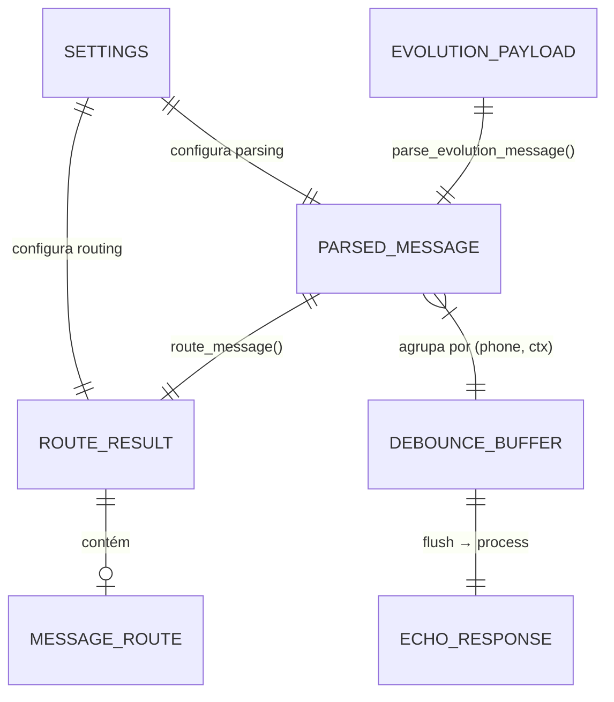
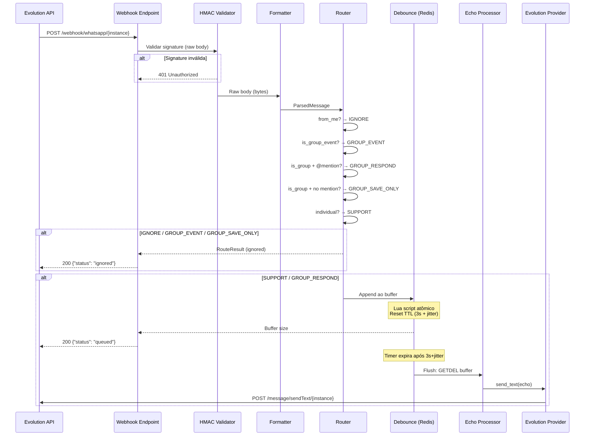

# Data Model: Channel Pipeline

**Epic**: 001-channel-pipeline  
**Date**: 2026-04-09  
**Status**: Complete

> Nota: Este epic não usa banco de dados. As entidades abaixo são modelos em memória (Pydantic/dataclass). Persistência em Supabase virá no epic 002.

---

## 1. Entidades

### 1.1 ParsedMessage

Representação canônica de uma mensagem recebida da Evolution API. Isola o core do formato específico do provider.

```python
class ParsedMessage(BaseModel):
    """Mensagem parseada do webhook da Evolution API."""
    phone: str                        # JID do remetente (e.g., "5511999998888@s.whatsapp.net")
    text: str                         # Texto extraído (vazio se mídia sem caption)
    sender_name: str | None           # Nome do remetente (quando disponível)
    message_id: str                   # ID único da mensagem na Evolution API
    is_group: bool                    # True se remoteJid contém "@g.us"
    group_id: str | None              # JID do grupo (None se individual)
    from_me: bool                     # True se mensagem enviada pelo próprio bot
    mentioned_phones: list[str]       # Lista de JIDs mencionados na mensagem
    media_type: str | None            # "image", "document", "video", "audio", "sticker", "contact", "location" ou None
    media_url: str | None             # URL da mídia (quando disponível)
    timestamp: datetime               # Timestamp da mensagem
    instance: str                     # Nome da instância Evolution API
    is_group_event: bool              # True se é evento de grupo (join/leave)
```

**Regras de validação**:
- `phone` não pode ser vazio
- `message_id` não pode ser vazio
- Se `is_group` é True, `group_id` não pode ser None
- `timestamp` é extraído do payload ou default para `datetime.now(UTC)`

---

### 1.2 MessageRoute (Enum)

Classificação da mensagem que determina o fluxo de processamento.

```python
class MessageRoute(str, Enum):
    SUPPORT = "support"              # Mensagem individual → responder
    GROUP_RESPOND = "group_respond"  # Grupo com @mention → responder
    GROUP_SAVE_ONLY = "group_save"   # Grupo sem @mention → apenas log
    GROUP_EVENT = "group_event"      # Evento de grupo (join/leave) → ignorar
    HANDOFF_ATIVO = "handoff_ativo"  # Stub → IGNORE nesta fase
    IGNORE = "ignore"                # from_me ou inválido → ignorar
```

**Transições de estado**: Não se aplica — MessageRoute é imutável por mensagem.

---

### 1.3 RouteResult

Resultado da classificação contendo a rota, agent_id (futuro), e razão.

```python
@dataclass
class RouteResult:
    route: MessageRoute
    agent_id: UUID | None = None     # None nesta fase; resolvido por routing_rules (epic 003)
    reason: str | None = None        # Razão da classificação (útil para debug/log)
```

**Invariantes**:
- Se `route` é IGNORE ou GROUP_SAVE_ONLY, `agent_id` deve ser None
- Se `route` é SUPPORT ou GROUP_RESPOND, `agent_id` pode ser None (epic 001) ou UUID (epic 003+)
- `reason` é obrigatório quando `route` é HANDOFF_ATIVO ("handoff not implemented")

---

### 1.4 Settings

Configuração externalizada via variáveis de ambiente.

```python
class Settings(BaseSettings):
    model_config = SettingsConfigDict(env_file=".env", env_file_encoding="utf-8")

    # Server
    host: str = "0.0.0.0"
    port: int = 8040
    debug: bool = False

    # Evolution API
    evolution_api_url: str               # URL base da Evolution API
    evolution_api_key: str               # API key para autenticação
    evolution_instance_name: str         # Nome da instância

    # Redis
    redis_url: str = "redis://localhost:6379"

    # Debounce
    debounce_seconds: float = 3.0
    debounce_jitter_max: float = 1.0     # Jitter máximo em segundos (anti-avalanche)

    # Bot identity
    mention_phone: str                    # Phone JID do bot para detecção de @mention
    mention_keywords: str = ""            # Comma-separated keywords (e.g., "@prosauai,@resenhai")

    # Security
    webhook_secret: str                   # HMAC-SHA256 secret para validação de webhook

    @property
    def mention_keywords_list(self) -> list[str]:
        """Parse comma-separated keywords para lista."""
        return [k.strip() for k in self.mention_keywords.split(",") if k.strip()]
```

---

### 1.5 WebhookResponse

Resposta padronizada do endpoint webhook.

```python
class WebhookResponse(BaseModel):
    status: Literal["queued", "ignored"]
    route: str                            # MessageRoute.value
    message_id: str
```

---

### 1.6 HealthResponse

Resposta do health check.

```python
class HealthResponse(BaseModel):
    status: Literal["ok", "degraded"]
    redis: bool = True                    # False se Redis indisponível
```

---

## 2. Relacionamentos



---

## 3. Fluxo de Dados



---

## 4. Buffer de Debounce (Redis Keys)

Não é uma entidade persistente, mas é crucial documentar o schema das keys Redis:

| Key Pattern | Tipo | TTL | Conteúdo |
|-------------|------|-----|----------|
| `buf:{phone}:{group_id\|direct}` | String | 2x debounce (safety) | Mensagens concatenadas com `\n` |
| `tmr:{phone}:{group_id\|direct}` | String | debounce_seconds * 1000 + jitter | "1" (valor irrelevante; apenas TTL importa) |

**Exemplo**:
- Key: `buf:5511999998888:direct` → `"Oi\nTudo bem?\nPreciso de ajuda"`
- Key: `tmr:5511999998888:direct` → `"1"` (TTL: 3500ms)

---

handoff:
  from: speckit.plan (Phase 1 - data-model)
  to: speckit.plan (Phase 1 - contracts)
  context: "Data model definido com 6 entidades em memória (sem DB). ParsedMessage como modelo canônico, MessageRoute enum com 6 rotas, RouteResult com agent_id forward-compatible, Settings com pydantic-settings, dual-key Redis para debounce."
