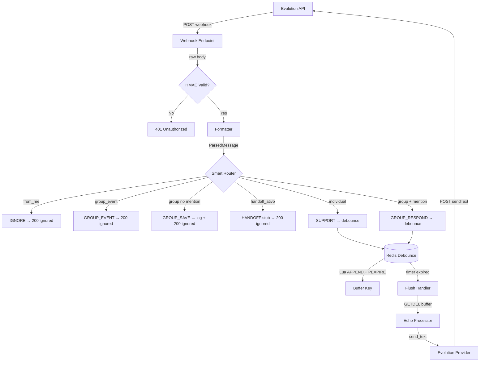

# Implementation Plan: Channel Pipeline

**Branch**: `epic/prosauai/001-channel-pipeline` | **Date**: 2026-04-09 | **Spec**: [spec.md](./spec.md)  
**Input**: Infraestrutura base para receber mensagens WhatsApp via Evolution API, classificar por tipo, aplicar debounce, e responder echo.

## Summary

Criar o repositório `paceautomations/prosauai` do zero (greenfield) com pipeline completo: webhook FastAPI recebe payloads da Evolution API com validação HMAC-SHA256 → formatter extrai ParsedMessage → Smart Router classifica em 6 rotas → Redis debounce agrupa mensagens rápidas via Lua script atômico com dual-key pattern e keyspace notifications → echo response via Evolution API adapter. Sem LLM, sem DB, sem worker — fundação mínima viável para todos os épicos subsequentes.

## Technical Context

**Language/Version**: Python 3.12 + FastAPI >=0.115  
**Primary Dependencies**: FastAPI, uvicorn, pydantic 2.x, pydantic-settings, redis[hiredis] >=5.0, httpx, structlog  
**Storage**: Redis 7 (debounce buffers apenas — sem persistência de dados)  
**Testing**: pytest + pytest-asyncio + httpx (TestClient)  
**Target Platform**: Linux server (Docker container)  
**Project Type**: Web service (API)  
**Performance Goals**: <2s end-to-end (webhook recebido → echo enviado, excluindo latência Evolution API)  
**Constraints**: HMAC-SHA256 obrigatório em toda request (ADR-017); Evolution API v2.x payload instável (ADR-005); debounce jitter obrigatório (blueprint §4.6)  
**Scale/Scope**: Single instance; ~100 msgs/min para echo (sem LLM bottleneck nesta fase)

## Constitution Check

*GATE: Must pass before Phase 0 research. Re-check after Phase 1 design.*

| Princípio | Status | Evidência |
|-----------|--------|-----------|
| I. Pragmatismo | ✅ PASS | Echo sem LLM, sem DB, sem worker — mínimo viável |
| II. Automatizar Repetitivo | ✅ PASS | Docker Compose para setup; fixtures automatizadas |
| III. Conhecimento Estruturado | ✅ PASS | structlog com campos padronizados; payloads como fixtures |
| IV. Ação Rápida | ✅ PASS | Protótipo funcional (echo) antes de adicionar LLM |
| V. Alternativas e Trade-offs | ✅ PASS | Documentados em research.md para cada decisão técnica |
| VI. Honestidade Brutal | ✅ PASS | Limitações explícitas (sem retry, sem idempotência, sem persistence) |
| VII. TDD | ✅ PASS | Testes definidos antes da implementação; 14+ testes target |
| VIII. Decisão Colaborativa | ✅ PASS | Decisões documentadas no pitch.md com rationale |
| IX. Observabilidade | ✅ PASS | structlog em todos os pontos críticos (phone_hash, route, message_id) |

**Re-check pós-Phase 1**: ✅ PASS — design mantém simplicidade (zero abstrações desnecessárias, zero over-engineering).

## Project Structure

### Documentation (this feature)

```text
platforms/prosauai/epics/001-channel-pipeline/
├── plan.md              # Este arquivo
├── research.md          # Phase 0: pesquisa de HMAC, Redis Lua, Evolution API
├── data-model.md        # Phase 1: entidades (ParsedMessage, RouteResult, etc.)
├── quickstart.md        # Phase 1: setup e testes
├── contracts/
│   └── webhook-api.md   # Phase 1: contratos HTTP (webhook + health + Evolution client)
└── tasks.md             # Phase 2: task breakdown (gerado por /speckit.tasks)
```

### Source Code (repositório paceautomations/prosauai)

```text
prosauai/
├── prosauai/
│   ├── __init__.py
│   ├── main.py               # FastAPI app, lifespan (Redis init + keyspace listener)
│   ├── config.py              # Settings via pydantic-settings + .env
│   ├── core/
│   │   ├── __init__.py
│   │   ├── formatter.py       # parse_evolution_message(), format_for_whatsapp()
│   │   ├── router.py          # MessageRoute enum, RouteResult, route_message()
│   │   └── debounce.py        # DebounceManager (Lua script, keyspace subscriber, flush)
│   ├── channels/
│   │   ├── __init__.py
│   │   ├── base.py            # MessagingProvider ABC
│   │   └── evolution.py       # EvolutionProvider (httpx async client)
│   └── api/
│       ├── __init__.py
│       ├── webhooks.py         # POST /webhook/whatsapp/{instance}
│       ├── health.py           # GET /health
│       └── dependencies.py     # verify_webhook_signature(), get_settings(), get_redis()
├── tests/
│   ├── conftest.py             # Fixtures compartilhadas (settings, redis mock, client)
│   ├── fixtures/
│   │   └── evolution_payloads.json  # Payloads reais capturados
│   ├── unit/
│   │   ├── test_router.py      # 8+ testes: 6 rotas + edge cases
│   │   ├── test_formatter.py   # Parsing de todos os tipos de mensagem
│   │   └── test_debounce.py    # Lua script mock, buffer keys, flush
│   └── integration/
│       ├── test_webhook.py     # Fluxo completo: webhook → route → response
│       └── test_health.py      # Health check com/sem Redis
├── pyproject.toml              # Deps, ruff config, pytest config
├── Dockerfile                  # Multi-stage build
├── docker-compose.yml          # api + redis com healthchecks
├── .env.example                # Template de variáveis de ambiente
└── README.md                   # Referência para quickstart.md
```

**Structure Decision**: Estrutura flat com 3 packages (`core/`, `channels/`, `api/`) alinhada com o blueprint do prosauai. Sem camadas desnecessárias (no repository pattern, no service layer — echo é direto demais para isso). A estrutura suporta evolução: `core/` ganha `agents/` no epic 002, `api/` ganha rotas admin no epic 007.

## Complexity Tracking

Nenhuma violação de Constitution Check. Complexidade mínima:
- 3 packages internos (core, channels, api) — abaixo do limiar de concern
- 1 dependência de infra (Redis) — justificada para debounce atômico
- 0 abstrações desnecessárias — MessagingProvider ABC é exigido pelo context-map (ACL)

## Design Decisions

| # | Decisão | Alternativas Rejeitadas | Rationale |
|---|---------|------------------------|-----------|
| D1 | HMAC via FastAPI dependency injection | Middleware ASGI (complexo buffer); Custom APIRoute (over-engineering) | Simples, testável, idiomático FastAPI. Body bytes via `request.body()` |
| D2 | Debounce dual-key Redis (buf: + tmr:) | asyncio.sleep in-memory (perde dados); MULTI/EXEC (não atômico); Streams (over-engineering) | Lua script atômico, sobrevive restart, keyspace notifications para flush |
| D3 | redis.asyncio PubSub para keyspace listener | Polling periódico (latência); Separate process (complexidade) | Async nativo, integra com FastAPI lifespan |
| D4 | Fallback sem debounce quando Redis down | 503 error (perde mensagem); in-memory fallback (dual complexity) | Degrada gracefully — mensagem processada sem agrupamento |
| D5 | httpx async para Evolution API client | aiohttp (dep extra); requests (sync bloqueante) | httpx é padrão para async HTTP em FastAPI; já usado no TestClient |
| D6 | structlog para logging | stdlib logging (sem estrutura); loguru (dep extra sem necessidade) | JSON nativo, processadores chainable, integra com uvicorn |
| D7 | pydantic-settings para config | python-dotenv direto (sem validação); dynaconf (over-engineering) | Validação de tipos, default values, .env loading integrado |

## Architecture Overview



## Risks and Mitigations

| Risco | Probabilidade | Impacto | Mitigação |
|-------|---------------|---------|-----------|
| Evolution API muda payload entre versões | Média | Alto | Adapter pattern + fixtures com payloads reais. Pin version. |
| Redis indisponível durante operação | Baixa | Médio | Fallback: processar sem debounce + warning log |
| Keyspace notifications perdidas | Baixa | Médio | Safety TTL no buffer key (2x debounce) garante cleanup |
| from_me loop infinito | Alta (se não tratado) | Alto | Primeiro check no router: `if from_me: return IGNORE` |
| Payload fixtures desatualizadas | Média | Médio | Fixtures capturadas manualmente do ambiente real antes dos testes |
| Debounce avalanche (muitos flushes simultâneos) | Média | Médio | Jitter 0-1s no TTL distribui flushes no tempo |

## Phase Summary

| Phase | Artifacts | Status |
|-------|-----------|--------|
| Phase 0: Research | [research.md](./research.md) | ✅ Complete |
| Phase 1: Data Model | [data-model.md](./data-model.md) | ✅ Complete |
| Phase 1: Contracts | [contracts/webhook-api.md](./contracts/webhook-api.md) | ✅ Complete |
| Phase 1: Quickstart | [quickstart.md](./quickstart.md) | ✅ Complete |
| Phase 2: Tasks | tasks.md | ⏳ Next (`/speckit.tasks`) |

---

handoff:
  from: speckit.plan
  to: speckit.tasks
  context: "Plan completo com research (HMAC, Redis Lua dual-key, Evolution API adapter), data-model (6 entidades em memória), contracts (webhook API + Evolution client + MessagingProvider ABC), e quickstart. Estrutura do projeto definida (3 packages: core, channels, api). Pronto para task breakdown."
  blockers: []
  confidence: Alta
  kill_criteria: "Evolution API v2.x muda formato de payload de forma incompatível com adapter pattern, ou redis-py remove suporte a keyspace notifications, ou FastAPI depreca lifespan context manager."
