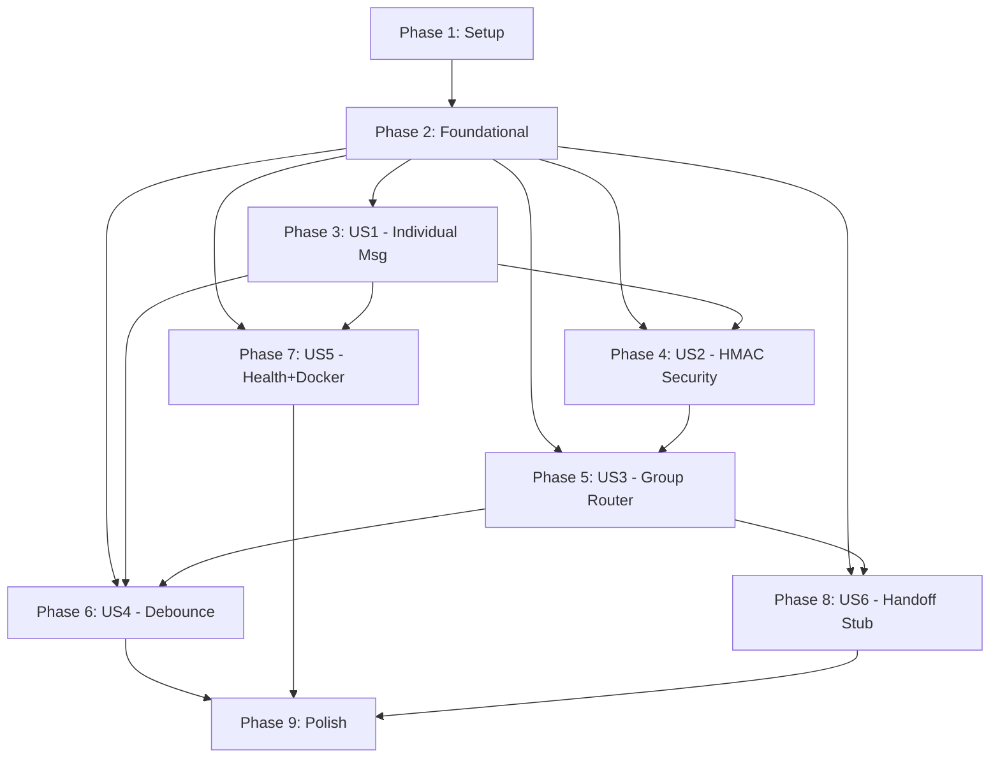

# Tasks: Channel Pipeline

**Input**: Design documents from `platforms/prosauai/epics/001-channel-pipeline/`
**Prerequisites**: plan.md (required), spec.md (required), research.md, data-model.md, contracts/webhook-api.md, quickstart.md
**Tests**: Incluidos — spec exige 14+ testes (8 unit + 6 integration), constitution exige TDD.

**Organization**: Tasks agrupadas por user story. Cada story e um incremento independente e testavel.

## Format: `[ID] [P?] [Story] Description`

- **[P]**: Pode rodar em paralelo (arquivos diferentes, sem dependencias pendentes)
- **[Story]**: User story associada (US1, US2, US3, US4, US5, US6)
- Paths relativos ao repo `paceautomations/prosauai`

---

## Phase 1: Setup (Scaffold do Projeto)

**Purpose**: Criar o repositorio `paceautomations/prosauai` do zero com estrutura de pastas, dependencias e configuracao basica.

- [X] T001 Create project root with pyproject.toml (FastAPI >=0.115, uvicorn, pydantic 2.x, pydantic-settings, redis[hiredis] >=5.0, httpx, structlog; dev: pytest, pytest-asyncio, pytest-cov, ruff) in prosauai/pyproject.toml
- [X] T002 Create folder structure: prosauai/{__init__,main,config}.py, prosauai/core/{__init__,formatter,router,debounce}.py, prosauai/channels/{__init__,base,evolution}.py, prosauai/api/{__init__,webhooks,health,dependencies}.py, tests/{conftest,__init__}.py, tests/unit/, tests/integration/, tests/fixtures/
- [X] T003 [P] Create .env.example with all Settings fields (EVOLUTION_API_URL, EVOLUTION_API_KEY, EVOLUTION_INSTANCE_NAME, REDIS_URL, DEBOUNCE_SECONDS, MENTION_PHONE, MENTION_KEYWORDS, WEBHOOK_SECRET) in prosauai/.env.example
- [X] T004 [P] Create Dockerfile with multi-stage build (builder + runtime) in prosauai/Dockerfile
- [X] T005 [P] Configure ruff (select rules, line-length, target-version) and pytest (asyncio_mode=auto) in prosauai/pyproject.toml

---

## Phase 2: Foundational (Core Models e Infraestrutura Compartilhada)

**Purpose**: Modelos, config, logging e fixtures que TODAS as user stories dependem. DEVE completar antes de qualquer story.

**CRITICAL**: Nenhuma user story pode comecar ate esta fase estar completa.

- [X] T006 Implement Settings class with pydantic-settings (all env vars, mention_keywords_list property, SettingsConfigDict) in prosauai/config.py
- [X] T007 [P] Implement ParsedMessage (BaseModel), MessageRoute (str Enum, 6 values), RouteResult (dataclass with agent_id), WebhookResponse, HealthResponse in prosauai/core/router.py and prosauai/core/formatter.py
- [X] T008 [P] Implement MessagingProvider ABC (send_text, send_media abstract methods) in prosauai/channels/base.py
- [X] T009 [P] Configure structlog with JSON output, processors (timestamper, add_log_level), and uvicorn integration in prosauai/main.py
- [X] T010 [P] Create test fixtures with realistic Evolution API payloads (text, extendedText, image, document, video, audio, sticker, contact, location, group text, group mention, group event, from_me) in tests/fixtures/evolution_payloads.json
- [X] T011 [P] Create shared test fixtures (mock settings, mock redis, test client factory, HMAC signature helper) in tests/conftest.py

**Checkpoint**: Fundacao pronta — modelos, config, ABC, fixtures disponiveis. User stories podem comecar.

---

## Phase 3: User Story 1 — Receber e Responder Mensagem Individual (Priority: P1)

**Goal**: Mensagem individual recebida via webhook → parseada → classificada como SUPPORT → echo response enviada via Evolution API.

**Independent Test**: Enviar POST /webhook/whatsapp/{instance} com payload de mensagem individual valida e verificar echo response.

### Tests for User Story 1

> **NOTE: Escrever testes PRIMEIRO, garantir que FALHAM antes da implementacao**

- [X] T012 [P] [US1] Unit tests for parse_evolution_message() — text, extendedText, image with caption, media without text, unknown type in tests/unit/test_formatter.py
- [X] T013 [P] [US1] Unit tests for EvolutionProvider — send_text success, send_text failure (log+drop), send_media success in tests/unit/test_evolution_provider.py
- [X] T014 [P] [US1] Integration test for full webhook flow — individual message → 200 queued + echo sent in tests/integration/test_webhook.py

### Implementation for User Story 1

- [X] T015 [US1] Implement parse_evolution_message() — extract fields from Evolution API payload for all message types (text, extendedText, image, document, video, audio, sticker, contact, location) in prosauai/core/formatter.py
- [X] T016 [US1] Implement format_for_whatsapp() — format echo text for WhatsApp output in prosauai/core/formatter.py
- [X] T017 [US1] Implement EvolutionProvider (httpx async client) — send_text (POST /message/sendText/{instance}), send_media (POST /message/sendMedia/{instance}), error handling with structlog in prosauai/channels/evolution.py
- [X] T018 [US1] Implement basic route_message() — from_me check (first!), individual → SUPPORT classification in prosauai/core/router.py
- [X] T019 [US1] Implement webhook endpoint POST /webhook/whatsapp/{instance_name} — parse payload, route, return WebhookResponse (status queued/ignored) in prosauai/api/webhooks.py
- [X] T020 [US1] Implement echo processing — for SUPPORT route: send echo via EvolutionProvider, log result with structlog (phone_hash, message_id, route) in prosauai/api/webhooks.py
- [X] T021 [US1] Wire FastAPI app with lifespan (Redis init placeholder), include webhook and health routers in prosauai/main.py

**Checkpoint**: Mensagem individual recebida e respondida com echo. Pipeline basico funcional (sem HMAC, sem debounce, sem grupos).

---

## Phase 4: User Story 2 — Validacao de Seguranca no Webhook (Priority: P1)

**Goal**: Toda request ao webhook e validada via HMAC-SHA256. Requests sem assinatura valida sao rejeitadas com 401.

**Independent Test**: Enviar requests com assinaturas validas, invalidas e ausentes — verificar accept/reject.

### Tests for User Story 2

- [X] T022 [P] [US2] Unit tests for verify_webhook_signature — valid signature, invalid signature, missing header, empty body in tests/unit/test_hmac.py
- [X] T023 [P] [US2] Integration tests — webhook with valid HMAC → 200, without HMAC → 401, with wrong HMAC → 401 in tests/integration/test_webhook.py

### Implementation for User Story 2

- [X] T024 [US2] Implement verify_webhook_signature() dependency — compute HMAC-SHA256 over raw request body bytes, compare_digest, raise HTTPException(401) on failure, return raw body on success in prosauai/api/dependencies.py
- [X] T025 [US2] Integrate HMAC dependency into webhook endpoint — add Depends(verify_webhook_signature), use returned raw body for JSON parsing in prosauai/api/webhooks.py

**Checkpoint**: Webhook seguro. Requests sem HMAC valido sao rejeitadas 100%.

---

## Phase 5: User Story 3 — Classificacao Inteligente de Mensagens de Grupo (Priority: P1)

**Goal**: Mensagens de grupo classificadas em 3 categorias: GROUP_RESPOND (@mention), GROUP_SAVE_ONLY (sem @mention), GROUP_EVENT (join/leave). Apenas GROUP_RESPOND gera resposta.

**Independent Test**: Enviar mensagens de grupo com/sem @mention e eventos de grupo — verificar classificacao e comportamento.

### Tests for User Story 3

- [X] T026 [P] [US3] Unit tests for route_message() group paths — group+mention by phone JID, group+mention by keyword, group without mention, group event (join/leave), multiple mentions, from_me in group in tests/unit/test_router.py
- [X] T027 [P] [US3] Integration tests — group message with @mention → 200 queued + echo, group without mention → 200 ignored + log only, group event → 200 ignored in tests/integration/test_webhook.py

### Implementation for User Story 3

- [X] T028 [US3] Extend route_message() with group classification — is_group_event → GROUP_EVENT, is_group + @mention (phone JID or keywords regex case-insensitive) → GROUP_RESPOND, is_group no mention → GROUP_SAVE_ONLY in prosauai/core/router.py
- [X] T029 [US3] Implement structured logging for GROUP_SAVE_ONLY — log with phone_hash (SHA256 of phone), group_id, route, timestamp via structlog in prosauai/api/webhooks.py
- [X] T030 [US3] Update webhook handler to process GROUP_RESPOND (echo via EvolutionProvider) and GROUP_SAVE_ONLY (log only, no response) in prosauai/api/webhooks.py

**Checkpoint**: Smart Router funcional com 6 rotas. Grupos sem @mention nao geram resposta. Grupos com @mention recebem echo.

---

## Phase 6: User Story 4 — Debounce de Mensagens Rapidas (Priority: P2)

**Goal**: Mensagens rapidas do mesmo usuario agrupadas antes de processar. Janela de 3s + jitter 0-1s. Buffer por (phone, group_id|"direct").

**Independent Test**: Enviar 3 mensagens em <3s — verificar que o sistema processa como uma unica mensagem concatenada com newline.

### Tests for User Story 4

- [X] T031 [P] [US4] Unit tests for DebounceManager — append to buffer (Lua script mock), flush on expiry (GETDEL), buffer key format, jitter range, fallback when Redis down in tests/unit/test_debounce.py
- [X] T032 [P] [US4] Integration test — send 3 messages within 2s → single concatenated echo response in tests/integration/test_webhook.py

### Implementation for User Story 4

- [X] T033 [US4] Implement DebounceManager class — Lua script (APPEND to buf: key + SET tmr: key with PEXPIRE + safety TTL on buf: key), buffer key generation from (phone, group_id|"direct") in prosauai/core/debounce.py
- [X] T034 [US4] Implement keyspace notifications subscriber — psubscribe __keyevent@0__:expired, filter tmr: keys, GETDEL buf: key, call flush handler in prosauai/core/debounce.py
- [X] T035 [US4] Implement fallback — when Redis unavailable during append, process message immediately without debounce, log warning in prosauai/core/debounce.py
- [X] T036 [US4] Integrate debounce into FastAPI lifespan — initialize Redis connection, register Lua script, start keyspace listener as asyncio task, cleanup on shutdown in prosauai/main.py
- [X] T037 [US4] Update webhook handler — for SUPPORT/GROUP_RESPOND routes: append to debounce buffer instead of processing immediately, return "queued" status in prosauai/api/webhooks.py
- [X] T038 [US4] Implement flush handler — on buffer expiry: retrieve concatenated messages, send echo via EvolutionProvider, log with structlog in prosauai/api/webhooks.py or prosauai/core/debounce.py

**Checkpoint**: Debounce funcional. Mensagens rapidas agrupadas. Redis fallback operacional. Pipeline completo: webhook → HMAC → parse → route → debounce → echo.

---

## Phase 7: User Story 5 — Health Check e Operacao via Docker (Priority: P2)

**Goal**: Endpoint /health retorna status da aplicacao (incluindo Redis). Docker Compose sobe api + redis com um comando.

**Independent Test**: `docker compose up` → `curl /health` retorna 200 OK.

### Tests for User Story 5

- [X] T039 [P] [US5] Integration tests for /health — healthy (Redis up) → 200 ok, degraded (Redis down) → 200 degraded in tests/integration/test_health.py

### Implementation for User Story 5

- [X] T040 [US5] Implement health check endpoint GET /health — check Redis connectivity (PING), return HealthResponse with status ok/degraded and redis boolean in prosauai/api/health.py
- [X] T041 [US5] Implement get_redis() dependency — return Redis client from app.state, handle connection errors gracefully in prosauai/api/dependencies.py
- [X] T042 [US5] Create docker-compose.yml — api service (build from Dockerfile, port 8040, env_file, depends_on redis healthy), redis service (redis:7-alpine, --notify-keyspace-events Ex, port 6379, healthcheck with redis-cli ping) in prosauai/docker-compose.yml
- [X] T043 [US5] Add healthcheck to Dockerfile — install curl, CMD curl -f http://localhost:8040/health in prosauai/Dockerfile

**Checkpoint**: Aplicacao operacional via Docker. Health check funcional com deteccao de Redis degradado.

---

## Phase 8: User Story 6 — Handoff Ativo Stub (Priority: P3)

**Goal**: Router reconhece HANDOFF_ATIVO e retorna IGNORE com reason explicativa. Stub para epic 005.

**Independent Test**: Verificar que mensagens classificadas como handoff retornam route IGNORE com reason "handoff not implemented".

### Tests for User Story 6

- [X] T044 [P] [US6] Unit test for HANDOFF_ATIVO stub — route returns IGNORE with reason "handoff not implemented" in tests/unit/test_router.py

### Implementation for User Story 6

- [X] T045 [US6] Add HANDOFF_ATIVO detection logic in route_message() — stub that returns RouteResult(route=IGNORE, reason="handoff not implemented") in prosauai/core/router.py

**Checkpoint**: Enum HANDOFF_ATIVO presente no router. Stub funcional. Sem breaking changes quando epic 005 implementar o handler real.

---

## Phase 9: Polish & Cross-Cutting Concerns

**Purpose**: Melhorias transversais, edge cases, e validacao final.

- [X] T046 [P] Add edge case handling — malformed payload → 400, unknown message type → IGNORE + log, unicode/emoji preservation, messages without text in prosauai/core/formatter.py and prosauai/api/webhooks.py
- [X] T047 [P] Integration test for edge cases — malformed payload → 400, from_me → ignored, unknown type → ignored in tests/integration/test_webhook.py
- [X] T048 Run ruff check and ruff format across entire codebase — zero errors required
- [X] T049 Create README.md with reference to quickstart.md and basic project description in prosauai/README.md
- [X] T050 Run full test suite (pytest) — verify 14+ tests passing (target: ~24 tests)
- [X] T051 Validate docker compose up — api + redis start without errors, /health returns 200 OK within 30s
- [X] T052 Run quickstart.md validation — follow manual webhook test steps from quickstart.md, verify expected responses

---

## Dependencies & Execution Order

### Phase Dependencies



### User Story Dependencies

- **US1 (P1)**: Depende apenas da Foundational (Phase 2). Primeiro incremento funcional.
- **US2 (P1)**: Depende de US1 (webhook endpoint deve existir para adicionar HMAC). ADR-017 obriga — integrar logo apos US1.
- **US3 (P1)**: Depende de US2 (webhook com HMAC ativo). Estende o router com paths de grupo.
- **US4 (P2)**: Depende de US1 + US3 (pipeline completo com routing antes de adicionar debounce). Intercepta o fluxo entre route e echo.
- **US5 (P2)**: Depende de US1 (app FastAPI deve existir). Pode rodar em paralelo com US3/US4.
- **US6 (P3)**: Depende de US3 (router com todos os paths). Adiciona stub para handoff.

### Within Each User Story

1. Testes escritos PRIMEIRO (devem FALHAR antes da implementacao)
2. Models/core antes de services
3. Services antes de endpoints/handlers
4. Implementacao core antes de integracao
5. Story completa antes de mover para proxima prioridade

### Parallel Opportunities

**Phase 2 (Foundational)**:
- T006, T007, T008, T009, T010, T011 — todos podem rodar em paralelo (arquivos diferentes)

**Phase 3 (US1)**:
- T012, T013, T014 — testes em paralelo
- T015, T017 — formatter e provider em paralelo (arquivos diferentes)

**Phase 5 (US3)**:
- T026, T027 — testes em paralelo

**Phase 6 (US4)**:
- T031, T032 — testes em paralelo

**Cross-phase**:
- US5 (Health+Docker) pode rodar em paralelo com US3/US4 apos US1 completo

---

## Parallel Example: User Story 1

```bash
# Launch tests in parallel (must fail first):
Task T012: "Unit tests for parse_evolution_message() in tests/unit/test_formatter.py"
Task T013: "Unit tests for EvolutionProvider in tests/unit/test_evolution_provider.py"
Task T014: "Integration test for webhook flow in tests/integration/test_webhook.py"

# Launch independent implementations in parallel:
Task T015: "Implement parse_evolution_message() in prosauai/core/formatter.py"
Task T017: "Implement EvolutionProvider in prosauai/channels/evolution.py"
```

---

## Implementation Strategy

### MVP First (User Stories 1 + 2 + 3)

1. Complete Phase 1: Setup (scaffold repo)
2. Complete Phase 2: Foundational (models, config, fixtures)
3. Complete Phase 3: US1 — mensagem individual funcional (echo sem HMAC)
4. Complete Phase 4: US2 — HMAC ativo (webhook seguro)
5. Complete Phase 5: US3 — grupos classificados corretamente
6. **STOP and VALIDATE**: Testar todas as 6 rotas com payloads reais
7. Deploy/demo: webhook recebe, classifica, e responde echo

### Incremental Delivery

1. Setup + Foundational → Estrutura pronta
2. US1 → Echo individual funcional (MVP minimo!)
3. US2 → Webhook seguro (ADR-017 compliance)
4. US3 → Grupos classificados (Smart Router completo)
5. US4 → Debounce ativo (UX: sem respostas duplicadas)
6. US5 → Docker operacional (deploy-ready)
7. US6 → Handoff stub (forward-compatible)
8. Polish → Edge cases, lint, validacao final

### Suggested MVP Scope

**MVP = US1 + US2 + US3** (Phases 1-5): Pipeline completo com webhook seguro, routing de 6 tipos, e echo response. Sem debounce (aceitar respostas duplicadas temporariamente). Valida toda a cadeia antes de adicionar complexidade.

---

## Task Summary

| Phase | Story | Tasks | Parallel |
|-------|-------|-------|----------|
| 1: Setup | — | 5 | 3 |
| 2: Foundational | — | 6 | 5 |
| 3: US1 Individual | US1 | 10 | 3 |
| 4: US2 HMAC | US2 | 4 | 2 |
| 5: US3 Groups | US3 | 5 | 2 |
| 6: US4 Debounce | US4 | 8 | 2 |
| 7: US5 Health+Docker | US5 | 5 | 1 |
| 8: US6 Handoff | US6 | 2 | 1 |
| 9: Polish | — | 7 | 2 |
| **Total** | | **52** | **21** |

**Test count**: ~24 testes (12 unit + 8 integration + 4 edge case) — excede o minimo de 14.

---

## Notes

- [P] tasks = arquivos diferentes, sem dependencias pendentes
- [Story] label mapeia task para user story especifica
- Cada user story deve ser completavel e testavel independentemente
- Verificar que testes FALHAM antes de implementar
- Commit apos cada task ou grupo logico
- Parar em qualquer checkpoint para validar story independentemente
- Evitar: tasks vagas, conflitos no mesmo arquivo, dependencias cross-story que quebram independencia
- Paths relativos ao repo paceautomations/prosauai (repo externo, nao este monorepo)

---
handoff:
  from: speckit.tasks
  to: speckit.analyze
  context: "Tasks.md gerado com 52 tasks em 9 fases, organizadas por 6 user stories. MVP = US1+US2+US3 (pipeline completo com HMAC e routing). ~24 testes planejados (excede minimo de 14). Debounce (US4) e Docker (US5) sao incrementos pos-MVP. Pronto para analise de consistencia pre-implementacao."
  blockers: []
  confidence: Alta
  kill_criteria: "Spec ou plan mudam de forma que invalide a organizacao por user stories, ou a quantidade de tasks se mostra insuficiente para cobrir todos os requisitos funcionais (FR-001 a FR-015)."
