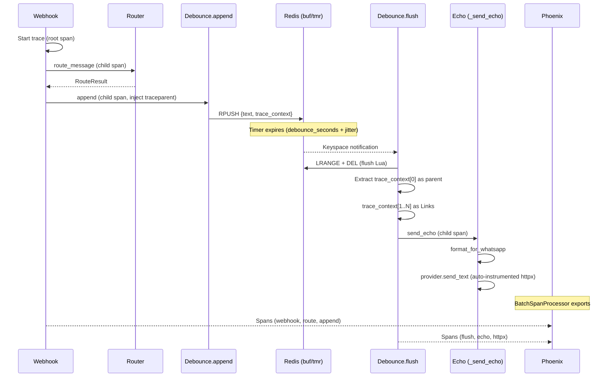

# Data Model — Epic 002: Observability

**Branch**: `epic/prosauai/002-observability` | **Date**: 2026-04-10

## Visão Geral

O epic 002 não introduz entidades de domínio persistidas na aplicação — os dados de traces e spans são gerenciados inteiramente pelo Phoenix (armazenados no Supabase Postgres no schema `observability`). O modelo de dados deste epic foca em:

1. **Entidades OTel** (gerenciadas pelo Phoenix, não pela aplicação)
2. **Atributos de span customizados** (definidos pela aplicação, consumidos pelo Phoenix)
3. **Mudanças no payload Redis** (propagação de trace context no debounce)
4. **Extensão do modelo de configuração** (Settings)
5. **Extensão do modelo de health** (HealthResponse)

---

## 1. Entidades OTel (Schema `observability` — Phoenix-managed)

> Estas tabelas são criadas e gerenciadas pelo Phoenix. A aplicação **não** faz queries diretas nelas — apenas exporta spans via OTLP.

### Trace
| Campo | Tipo | Descrição |
|-------|------|-----------|
| trace_id | TEXT (32 hex) | Identificador único do trace (W3C format) |
| start_time | TIMESTAMP | Início do primeiro span do trace |
| end_time | TIMESTAMP | Fim do último span do trace |
| project_name | TEXT | "prosauai" |

### Span
| Campo | Tipo | Descrição |
|-------|------|-----------|
| span_id | TEXT (16 hex) | Identificador único do span |
| trace_id | TEXT (32 hex) | FK para Trace |
| parent_span_id | TEXT (16 hex) | Span pai (NULL para root span) |
| name | TEXT | Nome do span (ex: "webhook_whatsapp", "route_message") |
| kind | TEXT | INTERNAL, SERVER, CLIENT |
| start_time | TIMESTAMP | Início da operação |
| end_time | TIMESTAMP | Fim da operação |
| status_code | TEXT | OK, ERROR, UNSET |
| status_message | TEXT | Mensagem de erro (se status=ERROR) |
| attributes | JSONB | Atributos do span (prosauai.*, gen_ai.*, etc.) |
| events | JSONB | Events OTel (logs, exceptions) |
| links | JSONB | OTel Links (referências a outros spans/traces) |

---

## 2. SpanAttributes — Namespace Custom `prosauai.*`

### Atributos Obrigatórios (todo span)
| Atributo | Tipo | Fonte | Exemplo |
|----------|------|-------|---------|
| `service.name` | string | Resource | "prosauai-api" |
| `service.version` | string | Resource | "0.1.0" |
| `deployment.environment` | string | Resource | "development" |
| `tenant_id` | string | Resource | "prosauai-default" |

### Atributos de Webhook
| Atributo | Tipo | Span | Exemplo |
|----------|------|------|---------|
| `messaging.system` | string | webhook_whatsapp | "whatsapp" |
| `messaging.destination.name` | string | webhook_whatsapp | "resenhai" (instance) |
| `messaging.message.id` | string | webhook_whatsapp | "BAE5..." |
| `prosauai.phone_hash` | string | webhook_whatsapp | "a1b2c3d4e5f6" |
| `prosauai.is_group` | bool | webhook_whatsapp | false |
| `prosauai.from_me` | bool | webhook_whatsapp | false |
| `prosauai.group_id` | string? | webhook_whatsapp | "120363...@g.us" |
| `http.request.method` | string | auto (FastAPI) | "POST" |
| `http.route` | string | auto (FastAPI) | "/webhook/whatsapp/{instance_name}" |

### Atributos de Routing
| Atributo | Tipo | Span | Exemplo |
|----------|------|------|---------|
| `prosauai.route` | string | route_message | "support" |
| `prosauai.agent_id` | string? | route_message | null (até epic 004) |

### Atributos de Debounce
| Atributo | Tipo | Span | Exemplo |
|----------|------|------|---------|
| `prosauai.debounce.buffer_size` | int | debounce.append | 3 |
| `prosauai.debounce.wait_ms` | int | debounce.flush | 3500 |

### Atributos de Provider
| Atributo | Tipo | Span | Exemplo |
|----------|------|------|---------|
| `prosauai.provider` | string | send_echo | "evolution" |
| `http.response.status_code` | int | auto (httpx) | 200 |

### Atributos GenAI (Placeholder — Epic 003)
| Atributo | Tipo | Span | Exemplo |
|----------|------|------|---------|
| `gen_ai.system` | string | send_echo | "echo" |
| `gen_ai.request.model` | string? | send_echo | null (até epic 003) |

---

## 3. Payload Redis — Mudança de Formato (Debounce)

### Antes (Epic 001)
```
buf:{phone}:{ctx} → "texto msg 1\ntexto msg 2\ntexto msg 3"  (string simples)
```

### Depois (Epic 002)
```
buf:{phone}:{ctx} → Lista Redis (RPUSH)
  [0] → '{"text": "texto msg 1", "trace_context": {"traceparent": "00-abc..."}}'
  [1] → '{"text": "texto msg 2", "trace_context": {"traceparent": "00-def..."}}'
  [2] → '{"text": "texto msg 3", "trace_context": {"traceparent": "00-ghi..."}}'
```

### Modelo do Item
```python
@dataclass
class DebounceItem:
    """Single buffered message with OTel trace context."""
    text: str
    trace_context: dict[str, str] | None = None  # W3C traceparent + tracestate
```

### Migração Lua Script
O Lua script muda de `APPEND` (string concatenation) para `RPUSH` (lista):

```lua
-- Novo Lua Script (RPUSH em vez de APPEND)
local buf_key = KEYS[1]
local tmr_key = KEYS[2]
local item    = ARGV[1]   -- JSON: {"text": "...", "trace_context": {...}}
local tmr_ttl = tonumber(ARGV[2])
local saf_ttl = tonumber(ARGV[3])

local new_len = redis.call('RPUSH', buf_key, item)
redis.call('PEXPIRE', buf_key, saf_ttl)
redis.call('SET', tmr_key, '1', 'PX', tmr_ttl)

return new_len
```

O flush muda de `GETDEL` para `LRANGE` + `DEL` (atomicamente em novo Lua script):

```lua
-- Flush Lua Script
local buf_key = KEYS[1]
local items = redis.call('LRANGE', buf_key, 0, -1)
redis.call('DEL', buf_key)
return items
```

### Retrocompatibilidade
O flush handler tenta parse JSON de cada item. Se falhar (item é texto puro de payload antigo), trata como texto sem trace context.

---

## 4. Extensão do Settings

### Novos Campos
```python
class Settings(BaseSettings):
    # ... campos existentes ...
    
    # -- Observability (epic 002) -----------------------------------------
    phoenix_grpc_endpoint: str = "http://localhost:4317"
    otel_service_name: str = "prosauai-api"
    otel_sampler_arg: float = 1.0  # 1.0 = 100%, 0.1 = 10%
    tenant_id: str = "prosauai-default"
    deployment_env: str = "development"
    otel_enabled: bool = True  # False para desabilitar OTel (ex: testes)
```

---

## 5. Extensão do HealthResponse

### Modelo Atualizado
```python
class ObservabilityHealth(BaseModel):
    """Status do subsistema de observabilidade."""
    status: Literal["ok", "degraded"]
    last_export_success: bool

class HealthResponse(BaseModel):
    """JSON response para GET /health."""
    status: Literal["ok", "degraded"]
    redis: bool = True
    observability: ObservabilityHealth | None = None
```

---

## 6. Diagrama de Fluxo de Dados (Trace Lifecycle)



---

## 7. Invariantes

1. **PII zero**: Nenhum atributo de span contém `phone` cru, `text` raw, ou `payload` Evolution raw
2. **tenant_id obrigatório**: Todo span tem `tenant_id` como Resource attribute
3. **trace_id consistente**: Dentro de um trace, todos os spans compartilham o mesmo `trace_id`
4. **W3C propagation**: O trace_context é propagado entre append e flush via Redis payload
5. **Degradação graciosa**: Se Phoenix/OTel indisponível, o API continua funcionando normalmente
6. **Sampling determinístico**: A decisão de sampling é feita no root span e respeitada por todos os child spans
