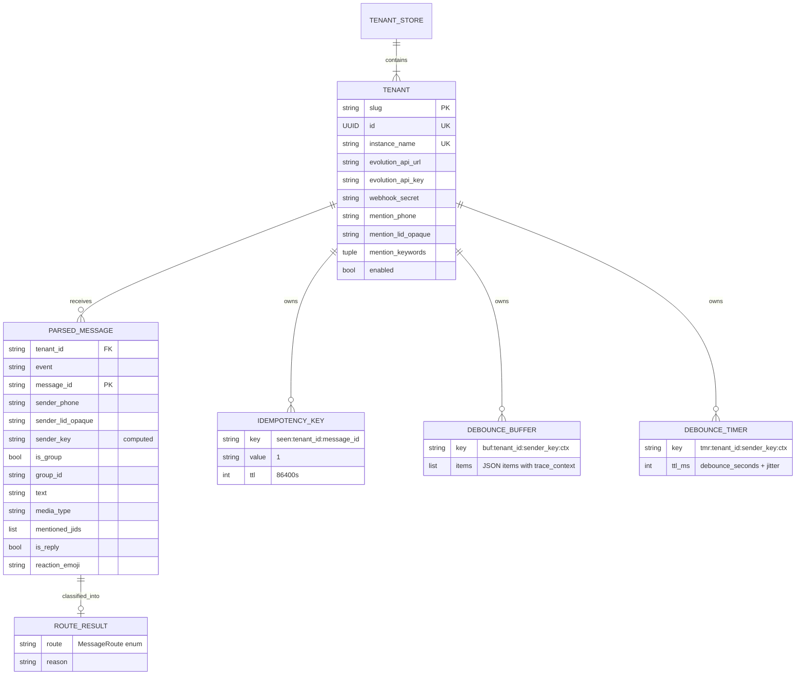
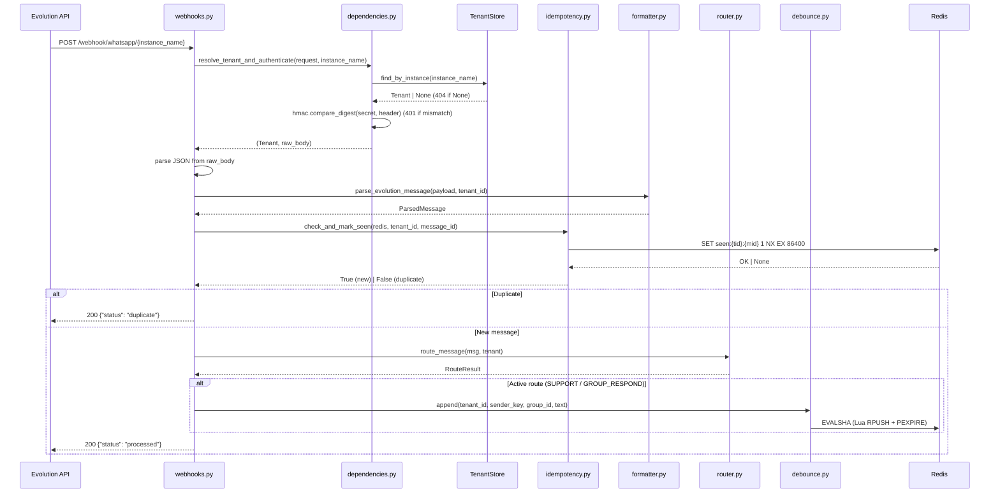

# Data Model — 003 Multi-Tenant Foundation

**Date**: 2026-04-10  
**Epic**: `epic/prosauai/003-multi-tenant-foundation`  
**Spec**: [spec.md](./spec.md) | **Research**: [research.md](./research.md)

---

## 1. Entidades Principais

### 1.1 Tenant

Configuração imutável de um inquilino. Carregada do YAML no startup, indexada por `slug`, `id` (UUID) e `instance_name`.

```python
@dataclass(frozen=True, slots=True)
class Tenant:
    """Immutable per-tenant configuration.

    Loaded from tenants.yaml at startup. Supports N tenants structurally;
    Phase 1 operates with 2 (Ariel + ResenhAI).

    Fields:
        slug: Human-readable identifier (e.g. "pace-internal").
        id: Database tenant UUID for RLS isolation.
        instance_name: Evolution API instance name (e.g. "Ariel").
        evolution_api_url: Base URL for the Evolution API instance.
        evolution_api_key: API key for the Evolution API instance.
        webhook_secret: Shared secret for X-Webhook-Secret validation.
        mention_phone: E.164 phone number for legacy mention detection.
        mention_lid_opaque: 15-digit opaque @lid identifier for modern mention detection.
        mention_keywords: Tuple of keywords for text-based mention detection.
        enabled: Whether the tenant is active (inactive = treated as nonexistent).
    """

    slug: str       # Human-readable identifier (e.g. "pace-internal")
    id: UUID        # Database tenant UUID for RLS isolation
    instance_name: str
    evolution_api_url: str
    evolution_api_key: str
    webhook_secret: str
    mention_phone: str
    mention_lid_opaque: str
    mention_keywords: tuple[str, ...] = field(default=())
    enabled: bool = True
```

**Validações no loader (TenantStore)**:
- `slug` não pode ser vazio ou duplicado.
- `id` (UUID) não pode ser vazio ou duplicado.
- `instance_name` não pode ser vazio ou duplicado.
- `webhook_secret` não pode ser vazio.
- `mention_phone` deve ter pelo menos 10 caracteres.
- `${ENV_VAR}` referenciada deve existir no ambiente.

**Relationships**:
- 1 Tenant → N ParsedMessages (via `tenant_id` campo no ParsedMessage)
- 1 Tenant → N Redis keys (prefixadas por `tenant_id`)
- 1 Tenant → 1 EvolutionProvider instance (criado per-request no flush callback)

---

### 1.2 TenantStore

Coleção indexada de Tenants com lookup O(1).

```python
class TenantStore:
    """File-backed tenant registry with O(1) lookup by slug, id (UUID), and instance_name.

    Loads tenants.yaml at startup, interpolating ${ENV_VAR} references.
    Migration path to DB-backed store (Phase 3, ADR-023) swaps only
    the loader — interface is stable.
    """

    _by_slug: dict[str, Tenant]          # slug → Tenant (e.g. "pace-internal" → Tenant)
    _by_id: dict[UUID, Tenant]           # database UUID → Tenant
    _by_instance: dict[str, Tenant]      # instance_name → Tenant

    def __init__(self, tenants: list[Tenant]) -> None: ...

    @classmethod
    def load_from_file(cls, path: Path) -> TenantStore:
        """Load and validate tenants.yaml with ${ENV_VAR} interpolation.

        Raises:
            FileNotFoundError: YAML file missing.
            ValueError: Invalid YAML, missing env var, duplicate id/instance_name.
        """

    def find_by_instance(self, instance_name: str) -> Tenant | None:
        """O(1) lookup by Evolution instance name. Returns None if not found."""

    def get(self, slug: str) -> Tenant | None:
        """O(1) lookup by tenant slug. Returns None if not found."""

    def get_by_id(self, tenant_id: UUID) -> Tenant | None:
        """O(1) lookup by database tenant UUID. Returns None if not found."""

    def all_active(self) -> list[Tenant]:
        """Return list of all tenants with enabled=True."""
```

**State transitions**: Nenhuma — TenantStore é imutável após construção. Mudanças requerem restart.

---

### 1.3 ParsedMessage (Expandido 12 → 22 campos)

Representação canônica de um evento da Evolution API v2.3.0.

```python
EventType = Literal["messages.upsert", "groups.upsert", "group-participants.update"]

MediaType = Literal[
    "image", "video", "audio", "document", "sticker",
    "location", "live_location", "contact",
    "poll", "event", "reaction",
]

class ParsedMessage(BaseModel):
    """Canonical representation of an Evolution API webhook event.

    Schema único para 3 tipos de evento discriminados por `event`.
    Campos opcionais permitem representar messages, group upserts,
    e participant updates no mesmo schema.
    """

    # -- Tenant context -------------------------------------------------------
    tenant_id: str                        # NEW: resolved from path

    # -- Event metadata -------------------------------------------------------
    event: EventType                      # NEW: discriminator
    instance_name: str                    # was: instance
    instance_id: str | None = None        # NEW: from payload
    message_id: str                       # same
    timestamp: datetime                   # same

    # -- Sender (compound identity) -------------------------------------------
    sender_phone: str | None = None       # NEW: replaces phone (may be None for @lid-only)
    sender_lid_opaque: str | None = None  # NEW: 15-digit @lid identifier
    sender_name: str | None = None        # same
    from_me: bool = False                 # same

    # -- Conversation context -------------------------------------------------
    is_group: bool = False                # same
    group_id: str | None = None           # same

    # -- Content --------------------------------------------------------------
    text: str = ""                        # same
    media_type: MediaType | None = None   # EXPANDED: from str to Literal
    media_url: str | None = None          # same
    media_mimetype: str | None = None     # NEW: from message body
    media_is_ptt: bool = False            # NEW: push-to-talk flag for audio
    media_duration_seconds: int | None = None  # NEW: audio/video duration
    media_has_base64_inline: bool = False  # NEW: flag for inline base64

    # -- Mentions -------------------------------------------------------------
    mentioned_jids: list[str] = Field(default_factory=list)  # RENAMED: was mentioned_phones

    # -- Reply ----------------------------------------------------------------
    is_reply: bool = False                # NEW
    quoted_message_id: str | None = None  # NEW

    # -- Reaction -------------------------------------------------------------
    reaction_emoji: str | None = None     # NEW
    reaction_target_id: str | None = None # NEW

    # -- Group event ----------------------------------------------------------
    is_group_event: bool = False          # same
    group_subject: str | None = None      # NEW
    group_participants_count: int | None = None  # NEW
    group_event_action: str | None = None # NEW: add/remove/promote/demote
    group_event_participants: list[str] = Field(default_factory=list)  # NEW
    group_event_author_lid: str | None = None  # NEW

    @property
    def sender_key(self) -> str:
        """Stable identity for debounce/idempotency. @lid > phone > 'unknown'."""
        return self.sender_lid_opaque or self.sender_phone or "unknown"
```

**Campos removidos do schema antigo**:
- `phone: str` → substituído por `sender_phone: str | None` + `sender_lid_opaque: str | None`
- `mentioned_phones: list[str]` → renomeado para `mentioned_jids: list[str]`

**Campo semântico novo**:
- `sender_key` property → identidade estável para debounce/idempotency keys

---

### 1.4 Idempotency Key (Redis)

```
Key format: seen:{tenant_id}:{message_id}
Value:      "1" (placeholder)
TTL:        86400 seconds (24h)
Operation:  SET NX EX (atomic)
```

**Comportamento**:
- Primeiro sighting: `SET NX` sucede → retorna True (processar)
- Duplicate: `SET NX` falha → retorna False (rejeitar com `{"status": "duplicate"}`)
- TTL expirado: chave removida → próximo sighting é tratado como primeiro
- Redis indisponível: fail-open (processar + log warning)

---

### 1.5 Debounce Keys (Redis)

```
Buffer key: buf:{tenant_id}:{sender_key}:{ctx}
Timer key:  tmr:{tenant_id}:{sender_key}:{ctx}

Where:
  tenant_id  = Tenant.id (e.g. "pace-internal")
  sender_key = sender_lid_opaque or sender_phone (e.g. "146102623948863")
  ctx        = group_id or "direct"
```

**Mudanças vs epic 001**:
- Prefixo `{tenant_id}:` adicionado a todas as chaves
- `phone` substituído por `sender_key` (pode ser @lid ou phone)
- `parse_expired_key()` retorna `(tenant_id, sender_key, group_id)` (antes: `(phone, group_id)`)

---

## 2. Settings (Refatorado)

```python
class Settings(BaseSettings):
    """Global settings — tenant-specific fields removidos."""

    # -- Server ---------------------------------------------------------------
    host: str = "0.0.0.0"
    port: int = 8050
    debug: bool = False

    # -- Redis ----------------------------------------------------------------
    redis_url: str = "redis://localhost:6379"

    # -- Debounce -------------------------------------------------------------
    debounce_seconds: float = 3.0
    debounce_jitter_max: float = 1.0

    # -- Tenant config --------------------------------------------------------
    tenants_config_path: Path = Path("config/tenants.yaml")
    idempotency_ttl_seconds: int = 86400  # 24h

    # -- Observability --------------------------------------------------------
    phoenix_grpc_endpoint: str = "http://localhost:4317"
    otel_service_name: str = "prosauai-api"
    otel_sampler_arg: float = 1.0
    deployment_env: str = "development"
    otel_enabled: bool = True
    otel_grpc_insecure: bool = True

    model_config = SettingsConfigDict(env_file=".env", extra="ignore")
```

**Campos removidos**:
- `evolution_api_url` → movido para `Tenant`
- `evolution_api_key` → movido para `Tenant`
- `evolution_instance_name` → movido para `Tenant`
- `mention_phone` → movido para `Tenant`
- `mention_keywords` → movido para `Tenant`
- `webhook_secret` → movido para `Tenant`
- `tenant_id` → removido (era singleton; agora é per-request)

**Campos novos**:
- `tenants_config_path: Path` → caminho do `tenants.yaml`
- `idempotency_ttl_seconds: int` → TTL para chaves de idempotência

---

## 3. Schema YAML de Tenants

```yaml
# config/tenants.yaml (gitignored; template em config/tenants.example.yaml)
tenants:
  - id: pace-internal
    db_tenant_id: "xxxxxxxx-xxxx-xxxx-xxxx-xxxxxxxxxxxx"  # UUID from tenants table
    instance_name: Ariel
    evolution_api_url: https://evolutionapi.pace-ia.com
    evolution_api_key: ${PACE_EVOLUTION_API_KEY}
    webhook_secret: ${PACE_WEBHOOK_SECRET}
    mention_phone: "5511910375690"
    mention_lid_opaque: "146102623948863"
    mention_keywords:
      - "@ariel"
    enabled: true

  - id: resenha-internal
    db_tenant_id: "yyyyyyyy-yyyy-yyyy-yyyy-yyyyyyyyyyyy"  # UUID from tenants table
    instance_name: ResenhAI
    evolution_api_url: https://evolutionapi.pace-ia.com
    evolution_api_key: ${RESENHA_EVOLUTION_API_KEY}
    webhook_secret: ${RESENHA_WEBHOOK_SECRET}
    mention_phone: "5511970972463"
    mention_lid_opaque: "..."   # descobrir via workflow documentado no README
    mention_keywords:
      - "@resenha"
    enabled: true
```

---

## 4. Diagrama de Relacionamentos



---

## 5. Fluxo de Dados — Webhook Pipeline



---

handoff:
  from: speckit.plan (Phase 1 — data-model)
  to: speckit.plan (Phase 1 — contracts)
  context: "Data model completo com 5 entidades, diagrama ER, e fluxo de dados. ParsedMessage expandido de 12 para 22+ campos, Settings refatorado, Redis key patterns definidos."
  blockers: []
  confidence: Alta
  kill_criteria: "Se ParsedMessage precisar de campos adicionais não previstos, adicionar sem quebrar schema existente (todos campos novos são opcionais)."
