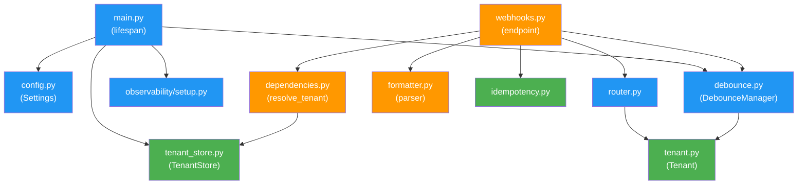

# Implementation Plan: 003 — Multi-Tenant Foundation

**Branch**: `epic/prosauai/003-multi-tenant-foundation` | **Date**: 2026-04-10 | **Spec**: [spec.md](./spec.md)  
**Input**: Fundação multi-tenant estrutural para ProsaUAI — corrigir 3 bloqueios críticos (HMAC imaginário, parser divergente, single-tenant) e desbloquear todos os epics futuros.

## Summary

O epic 001 entregou o webhook + router + debounce contra uma fixture sintética, mas validação empírica com a Evolution API v2.3.0 real revelou 3 bloqueios totais: (1) HMAC imaginário rejeitando 100% dos webhooks, (2) parser divergente silenciando 50% das mensagens, (3) arquitetura single-tenant incompatível com o end-state multi-tenant. Este plano executa a refatoração estrutural: `Tenant` dataclass + `TenantStore` YAML-backed + auth via `X-Webhook-Secret` + parser reescrito contra 26 fixtures reais + idempotência Redis SETNX + debounce com keys prefixadas por tenant + deploy com zero portas expostas. Resultado: sistema funcional com 2 tenants reais (Ariel + ResenhAI) desde o dia 1.

## Technical Context

**Language/Version**: Python 3.12  
**Primary Dependencies**: FastAPI >=0.115, pydantic 2.x, pydantic-settings, redis[hiredis] >=5.0, httpx, structlog, pyyaml, opentelemetry-sdk  
**Storage**: Redis 7 (idempotência + debounce buffers), YAML file (tenant config)  
**Testing**: pytest + pytest-asyncio + fakeredis  
**Target Platform**: Linux server (VPS Hostinger), Docker  
**Project Type**: Web service (API)  
**Performance Goals**: p99 < 100ms para webhook acceptance (auth + idempotency + parse)  
**Constraints**: Zero portas públicas expostas; porta 8050 (não 8040/8080)  
**Scale/Scope**: 2 tenants internos (Ariel + ResenhAI); design suporta N tenants

## Constitution Check

*GATE: Must pass before Phase 0 research. Re-check after Phase 1 design.*

| Principle | Status | Notes |
|-----------|--------|-------|
| I. Pragmatism | ✅ PASS | Alternativa D (multi-tenant estrutural, operando single-tenant-VPS) é a mais pragmática: código suporta N tenants, deploy opera com 2. Zero over-engineering. |
| II. Automate Repetitive | ✅ PASS | Fixture-driven testing automatiza validação do parser. TenantStore loader automatiza interpolação de env vars. |
| III. Structured Knowledge | ✅ PASS | 26 fixtures capturadas são single source of truth. decisions.md acumula micro-decisões. |
| IV. Fast Action | ✅ PASS | Rip-and-replace da HMAC (zero compat layer). Parser reescrito, não patchado. |
| V. Alternatives + Trade-offs | ✅ PASS | research.md documenta ≥3 alternativas por decisão com pros/cons. |
| VI. Brutal Honesty | ✅ PASS | Pitch documenta que 100% dos webhooks são rejeitados e 50% das mensagens silenciadas. Zero sugarcoating. |
| VII. TDD | ✅ PASS | 26 fixtures reais + test_captured_fixtures.py parametrizado. Testes escritos antes da implementação (fixtures já existem). |
| VIII. Collaborative Decision | ✅ PASS | 18 decisões documentadas no pitch com rationale. Spec clarificada com 5 resoluções. |
| IX. Observability + Logging | ✅ PASS | `tenant_id` em todo span + structlog contextvars. Preserva contrato SpanAttributes do epic 002. |

**Post-Phase 1 Re-check**: ✅ Nenhuma violação. Data model mantém simplicidade (frozen dataclass vs Pydantic para Tenant). Zero abstrações desnecessárias.

## Project Structure

### Documentation (this feature)

```text
platforms/prosauai/epics/003-multi-tenant-foundation/
├── plan.md                     # This file
├── research.md                 # Phase 0 output
├── data-model.md               # Phase 1 output
├── quickstart.md               # Phase 1 output
├── contracts/
│   ├── webhook-api.md          # Webhook endpoint contract
│   └── tenant-config.md        # Tenant YAML schema contract
├── spec.md                     # Feature specification
├── pitch.md                    # Epic pitch (Shape Up)
└── decisions.md                # Captured decisions (append-only)
```

### Source Code (prosauai repository)

```text
prosauai/
├── prosauai/
│   ├── main.py                 # MODIFIED: lifespan loads TenantStore, tenant-aware flush
│   ├── config.py               # MODIFIED: remove tenant-specific fields, add tenants_config_path
│   ├── core/
│   │   ├── tenant.py           # NEW: Tenant frozen dataclass
│   │   ├── tenant_store.py     # NEW: TenantStore YAML loader + ${ENV_VAR} interpolation
│   │   ├── idempotency.py      # NEW: check_and_mark_seen() Redis SETNX
│   │   ├── formatter.py        # REWRITTEN: 12 corrections, 22-field ParsedMessage
│   │   ├── router.py           # MODIFIED: route_message(msg, tenant), 3-strategy mention
│   │   └── debounce.py         # MODIFIED: tenant-prefixed keys, tenant_id in signatures
│   ├── api/
│   │   ├── dependencies.py     # REWRITTEN: resolve_tenant_and_authenticate()
│   │   └── webhooks.py         # MODIFIED: full multi-tenant pipeline
│   └── observability/
│       ├── setup.py            # MODIFIED: remove tenant_id from Resource
│       ├── conventions.py      # UNCHANGED: SpanAttributes.TENANT_ID preserved
│       └── ...
├── config/
│   ├── tenants.yaml            # gitignored — active config
│   └── tenants.example.yaml    # committed — template
├── tests/
│   ├── conftest.py             # MODIFIED: sample_tenant, tenant_store fixtures
│   ├── fixtures/
│   │   ├── captured/           # 26 real fixture pairs (already exist)
│   │   └── evolution_payloads.json  # DELETED after T6b-T6j pass
│   ├── unit/
│   │   ├── test_tenant.py      # NEW
│   │   ├── test_tenant_store.py # NEW
│   │   ├── test_idempotency.py # NEW
│   │   ├── test_auth.py        # REWRITTEN (was test_hmac.py)
│   │   ├── test_formatter.py   # REWRITTEN
│   │   ├── test_router.py      # MODIFIED
│   │   └── test_debounce.py    # MODIFIED
│   └── integration/
│       ├── test_captured_fixtures.py  # NEW: parametric 26-fixture suite
│       └── test_webhook.py     # MODIFIED: cross-tenant isolation
├── docker-compose.yml          # MODIFIED: no ports, tenants.yaml volume
├── docker-compose.override.example.yml  # NEW: Tailscale dev bind
├── .env.example                # MODIFIED: per-tenant env vars
├── .gitignore                  # MODIFIED: add config/tenants.yaml
└── pyproject.toml              # MODIFIED: add pyyaml dependency
```

**Structure Decision**: Mantém a estrutura existente do epic 001. Novos módulos (`tenant.py`, `tenant_store.py`, `idempotency.py`) adicionados em `prosauai/core/`. Nenhum diretório novo exceto `config/`. Alinhado com blueprint §4.6 (flat module structure).

## Complexity Tracking

Nenhuma violação de constituição a justificar.

---

## Phase 0: Research

**Status**: ✅ Completo — ver [research.md](./research.md)

9 decisões de design pesquisadas e validadas:
1. Auth via `X-Webhook-Secret` (único mecanismo suportado pela Evolution)
2. Parser reescrito contra 26 fixtures reais
3. Alternativa D (multi-tenant estrutural, YAML-backed)
4. Idempotência Redis SETNX por `(tenant_id, message_id)`
5. 3-strategy mention detection
6. Debounce keys prefixadas por tenant
7. Observability delta (Resource → per-span)
8. Deploy com zero portas públicas
9. Best practices para cada tech choice

---

## Phase 1: Design & Contracts

### 1.1 Data Model

**Status**: ✅ Completo — ver [data-model.md](./data-model.md)

**Entidades principais**:

| Entity | Type | Fields | New? |
|--------|------|--------|------|
| Tenant | `@dataclass(frozen, slots)` | 9 campos | NEW |
| TenantStore | class | 3 methods + loader | NEW |
| ParsedMessage | `BaseModel` | 22+ campos | EXPANDED (was 12) |
| Settings | `BaseSettings` | ~12 campos | REFACTORED (removed 7 tenant fields) |
| Idempotency Key | Redis key | `seen:{tid}:{mid}` | NEW |
| Debounce Keys | Redis keys | `buf:/tmr:{tid}:{sk}:{ctx}` | MODIFIED |

**Mudanças críticas no ParsedMessage**:
- `phone: str` → `sender_phone: str | None` + `sender_lid_opaque: str | None`
- `mentioned_phones` → `mentioned_jids`
- Novos: `tenant_id`, `event`, `media_mimetype`, `media_is_ptt`, `is_reply`, `quoted_message_id`, `reaction_emoji`, `reaction_target_id`, `group_subject`, `group_participants_count`, `group_event_action`, `group_event_participants`, `group_event_author_lid`
- `sender_key` property para identidade estável

### 1.2 Interface Contracts

**Status**: ✅ Completo — ver [contracts/](./contracts/)

| Contract | File | Type |
|----------|------|------|
| Webhook API | [contracts/webhook-api.md](./contracts/webhook-api.md) | HTTP endpoint |
| Tenant Config | [contracts/tenant-config.md](./contracts/tenant-config.md) | YAML schema |

### 1.3 Quickstart

**Status**: ✅ Completo — ver [quickstart.md](./quickstart.md)

---

## Phase 2: Implementation Design

### 2.1 Módulos e Dependências Internas



**Legenda**: 🟢 Novo | 🟠 Reescrito | 🔵 Modificado

### 2.2 Sequência de Implementação

A implementação segue uma sequência bottom-up: camadas sem dependências primeiro, integrações depois.

#### Camada 1 — Fundação (sem dependência entre si)

| Task | File | Tipo | LOC Est. | Depende de |
|------|------|------|----------|------------|
| T1 | `prosauai/core/tenant.py` | NEW | ~40 | Nada |
| T2 | `prosauai/core/tenant_store.py` | NEW | ~100 | T1 |
| T3 | `config/tenants.example.yaml` | NEW | ~30 | T1 |
| T4 | `prosauai/config.py` | MODIFY | ~50 | Nada |
| T5 | `prosauai/core/idempotency.py` | NEW | ~40 | Nada |

#### Camada 2 — Auth + Parser (depende da Camada 1)

| Task | File | Tipo | LOC Est. | Depende de |
|------|------|------|----------|------------|
| T6 | `prosauai/api/dependencies.py` | REWRITE | ~60 | T1, T2 |
| T6b-T6j | `prosauai/core/formatter.py` | REWRITE | ~400 | T1 |

**T6b-T6j detalhado**:
- T6b: `_KNOWN_MESSAGE_TYPES` com nomes reais (13 tipos)
- T6c: Resolução de sender multi-formato (`@lid`/`@s.whatsapp.net`/grupo)
- T6d: Branch `groups.upsert` (data=lista)
- T6e: Branch `group-participants.update` (data=dict sem key)
- T6f: `mentionedJid` de `data.contextInfo` (top-level)
- T6g: `quotedMessage` → `is_reply` + `quoted_message_id`
- T6h: 3-strategy mention detection no schema
- T6i: Ignorar campos irrelevantes silenciosamente
- T6j: `reactionMessage` → `IGNORE` com `reason=reaction`

#### Camada 3 — Router + Debounce (depende da Camada 2)

| Task | File | Tipo | LOC Est. | Depende de |
|------|------|------|----------|------------|
| T7 | `prosauai/core/router.py` | MODIFY | ~30 diff | T1, T6b-T6j |
| T9 | `prosauai/core/debounce.py` | MODIFY | ~80 diff | T1 |

#### Camada 4 — Integração (depende de tudo acima)

| Task | File | Tipo | LOC Est. | Depende de |
|------|------|------|----------|------------|
| T8 | `prosauai/api/webhooks.py` | MODIFY | ~100 diff | T1-T7, T9 |
| T10 | `prosauai/main.py` (lifespan) | MODIFY | ~40 diff | T2, T4 |
| T11 | `prosauai/main.py` (flush) | MODIFY | ~40 diff | T2, T9 |

#### Camada 5 — Observability Delta

| Task | File | Tipo | LOC Est. | Depende de |
|------|------|------|----------|------------|
| T11b | `prosauai/observability/setup.py` | MODIFY | ~10 diff | T4 |
| T11c | `prosauai/observability/conventions.py` | VERIFY | 0 | Nada |
| T11d | `prosauai/api/webhooks.py` | MODIFY | ~10 diff | T8 |
| T11e | `prosauai/core/debounce.py` | MODIFY | ~15 diff | T9 |
| T11f | `prosauai/config.py` | MODIFY | ~5 diff | T4 |

#### Camada 6 — Deploy + Config

| Task | File | Tipo | LOC Est. | Depende de |
|------|------|------|----------|------------|
| T12 | `docker-compose.yml` | MODIFY | ~10 diff | T3 |
| T13 | `docker-compose.override.example.yml` | NEW | ~20 | T12 |
| T14 | `.env.example` + `.gitignore` | MODIFY | ~15 diff | T3 |

#### Camada 7 — Testes

| Task | File | Tipo | LOC Est. | Depende de |
|------|------|------|----------|------------|
| T20 | `tests/conftest.py` | MODIFY | ~60 diff | T1, T2 |
| T16 | `tests/integration/test_captured_fixtures.py` | NEW | ~120 | T6b-T6j, T7 |
| T17 | Delete `evolution_payloads.json` + testes | DELETE | - | T16 |
| T18 | `tests/unit/test_auth.py` | REWRITE | ~80 | T6 |
| T19 | Atualizar test_router/debounce/webhook | MODIFY | ~150 diff | T7, T8, T9 |

#### Camada 8 — Docs + End-to-End

| Task | File | Tipo | LOC Est. | Depende de |
|------|------|------|----------|------------|
| T15 | `README.md` | MODIFY | ~100 diff | T3, T12 |
| T21 | End-to-end real | MANUAL | - | Tudo |

### 2.3 Interfaces Críticas

#### `resolve_tenant_and_authenticate()` — A New Auth Dependency

```python
async def resolve_tenant_and_authenticate(
    request: Request,
    instance_name: str,
) -> tuple[Tenant, bytes]:
    """
    1. Get TenantStore from app.state
    2. find_by_instance(instance_name) → 404 if None or not enabled
    3. Read raw body
    4. Get X-Webhook-Secret header → 401 if missing
    5. hmac.compare_digest(tenant.webhook_secret, header) → 401 if mismatch
    6. Return (tenant, raw_body)
    """
```

**Substitui**: `verify_webhook_signature()` (HMAC-SHA256, removida)

#### `parse_evolution_message()` — Expanded Signature

```python
def parse_evolution_message(
    payload: dict[str, Any],
    *,
    tenant_id: str,
) -> ParsedMessage:
    """
    Now accepts tenant_id as keyword arg.
    Handles 3 event types: messages.upsert, groups.upsert, group-participants.update.
    Returns expanded ParsedMessage with 22+ fields.
    """
```

**Mudança**: Novo kwarg `tenant_id` para popular `ParsedMessage.tenant_id`.

#### `route_message()` — Minimal Interface Change

```python
def route_message(message: ParsedMessage, tenant: Tenant) -> RouteResult:
    """
    ANTES: route_message(message, settings)
    AGORA: route_message(message, tenant)

    Mudança: settings.mention_phone → tenant.mention_phone
             settings.mention_keywords_list → tenant.mention_keywords
             + 3-strategy mention detection (lid → phone → keywords)

    NÃO MUDA: enum MessageRoute, if/elif logic, RouteResult
    """
```

**Constraint**: Diff ≤ 30 linhas (excluindo `_is_bot_mentioned`). Epic 004 faz rip-and-replace.

#### `DebounceManager` — Tenant-Aware Signatures

```python
# append() muda:
async def append(
    self,
    tenant_id: str,      # NEW — required first positional
    sender_key: str,      # was: phone
    *,
    group_id: str | None,
    text: str,
) -> int | None: ...

# FlushCallback muda:
FlushCallback = Callable[
    [str, str, str | None, str],  # (tenant_id, sender_key, group_id, text)
    Awaitable[None],
]

# parse_expired_key() muda:
@staticmethod
def parse_expired_key(key: str) -> tuple[str, str, str | None] | None:
    """Returns (tenant_id, sender_key, group_id) instead of (phone, group_id)."""
```

### 2.4 Estratégia de Migração

A migração é **rip-and-replace** (não incremental):

1. **Auth**: `verify_webhook_signature()` deletada completamente, substituída por `resolve_tenant_and_authenticate()`. Zero código HMAC permanece.
2. **Parser**: `formatter.py` reescrito do zero (estrutura do epic 001 descartada). `_KNOWN_MESSAGE_TYPES` inteiro substituído.
3. **Settings**: 7 campos removidos de uma vez. Imports que referenciam `Settings.mention_phone` etc. quebram — corrigidos nas tasks dependentes.
4. **Testes**: `test_hmac.py` deletado, `test_auth.py` escrito do zero. Fixtures sintéticas deletadas após fixture-driven tests passarem.

**Rationale**: Estados intermediários (e.g., "HMAC removido mas auth novo não existe") quebrariam o serviço. Single PR com todas as mudanças.

### 2.5 Riscos e Mitigações

| Risco | Probabilidade | Impacto | Mitigação |
|-------|---------------|---------|-----------|
| Fixture não cobre edge case real | Baixa | Médio | 26 fixtures capturam cenários mais comuns; edge cases adicionados conforme descobertos |
| `mention_lid_opaque` não descoberto para ResenhAI | Média | Baixo | Workflow documentado; strategy 2 (phone) e 3 (keywords) cobrem como fallback |
| Redis indisponível durante deploy | Baixa | Médio | Fail-open na idempotência; debounce fallback immediate |
| Epic 002 não mergeado antes de 003 | Baixa | Alto | Pre-gate documentado no pitch; verificação manual antes de iniciar |
| Parser futuro da Evolution quebra | Baixa | Alto | Fixtures capturadas são versionadas; nova versão = novas capturas |

### 2.6 LOC Estimate Summary

| Camada | LOC Novo | LOC Diff | LOC Delete |
|--------|----------|----------|------------|
| Fundação (T1-T5) | ~260 | ~50 | 0 |
| Auth + Parser (T6-T6j) | ~460 | 0 | ~85 |
| Router + Debounce (T7, T9) | 0 | ~110 | 0 |
| Integração (T8, T10, T11) | 0 | ~180 | 0 |
| Observability (T11b-T11f) | 0 | ~40 | ~10 |
| Deploy (T12-T14) | ~50 | ~25 | 0 |
| Testes (T16-T20) | ~410 | ~210 | ~100 |
| Docs (T15) | 0 | ~100 | 0 |
| **Total** | **~1180** | **~715** | **~195** |

**Estimativa total com fator 1.75x**: ~3300 LOC (inclui docstrings, argparse, logging, edge case handling).

---

## Phase 2 Planning Complete

### Artifacts Generated

| Artifact | Path | Lines |
|----------|------|-------|
| research.md | `epics/003-multi-tenant-foundation/research.md` | ~200 |
| data-model.md | `epics/003-multi-tenant-foundation/data-model.md` | ~230 |
| webhook-api.md | `epics/003-multi-tenant-foundation/contracts/webhook-api.md` | ~130 |
| tenant-config.md | `epics/003-multi-tenant-foundation/contracts/tenant-config.md` | ~80 |
| quickstart.md | `epics/003-multi-tenant-foundation/quickstart.md` | ~140 |
| plan.md | `epics/003-multi-tenant-foundation/plan.md` | ~350 |

### Key Design Decisions Summary

| # | Decision | Rationale |
|---|----------|-----------|
| 1 | Auth: `X-Webhook-Secret` per-tenant | Único mecanismo suportado pela Evolution |
| 2 | Tenant: frozen dataclass + YAML loader | Performance + imutabilidade; migration path para DB |
| 3 | Parser: rewrite against 26 real fixtures | 12 divergências críticas invalidam patch approach |
| 4 | Idempotency: Redis SETNX per (tenant_id, message_id) | Atomic, tenant-isolated, covers retry window |
| 5 | Debounce: tenant-prefixed keys | Prevents cross-tenant collision |
| 6 | Router: minimal interface change only | Epic 004 owns the rip-and-replace |
| 7 | Observability: tenant_id as per-span attribute | Resource is process-wide; preserves Phoenix dashboards |
| 8 | Deploy: zero public ports | Tailscale dev, Docker network prod |
| 9 | Migration: rip-and-replace, single PR | No intermediate broken states |

---

handoff:
  from: speckit.plan
  to: speckit.tasks
  context: "Plano completo com research, data model, contracts, quickstart e design de implementação. 8 camadas de tasks identificadas, LOC estimado ~3300 (com fator 1.75x). Sequência bottom-up: fundação → auth/parser → router/debounce → integração → observability → deploy → testes → docs. Key constraint: T7 (router) ≤ 30 linhas diff."
  blockers: []
  confidence: Alta
  kill_criteria: "Se Evolution API mudar formato de webhook, se epic 002 não estiver mergeado, ou se requisitos de multi-tenancy mudarem significativamente."
