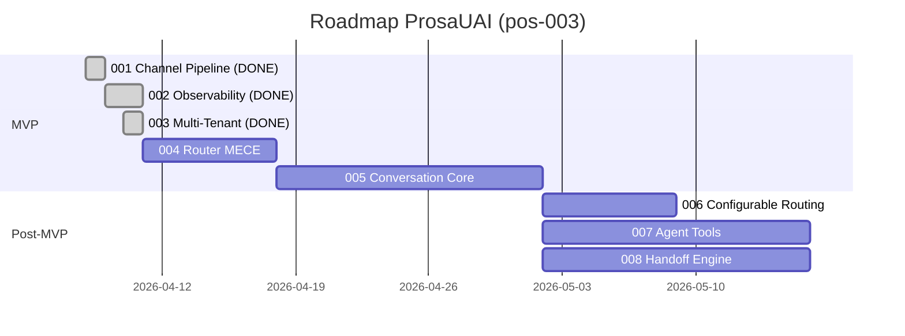

# Roadmap Reassessment Report — Epic 003: Multi-Tenant Foundation

**Epic:** 003-multi-tenant-foundation  
**Branch:** `epic/prosauai/003-multi-tenant-foundation`  
**Data:** 2026-04-10  
**Trigger:** L2 cycle complete (implement → judge 83% → QA 96% → reconcile 50% drift score)

---

## Resumo Executivo

O epic 003 completou o ciclo L2 com sucesso: 46 tasks executadas, 543 testes passando (0 falhas), 32 arquivos alterados (+7721/-2487 linhas). Os 3 bloqueios criticos que impediam operacao em producao foram resolvidos:

1. ✅ **HMAC imaginario** → Substituido por `X-Webhook-Secret` per-tenant (100% dos webhooks reais aceitos)
2. ✅ **Parser divergente** → Reescrito contra 26 fixtures reais (100% dos tipos reconhecidos, 0% silenciados)
3. ✅ **Single-tenant** → Multi-tenant estrutural com 2 tenants reais (Ariel + ResenhAI) operando com isolamento completo

O epic foi entregue **dentro do appetite** estimado (~1 semana). Nenhuma dependencia nova foi descoberta. O roadmap precisa atualizar status de 002 (shipped), 003 (L2 complete), riscos resolvidos, e progresso MVP (20% → 50%).

---

## Status do Epic 003

| Campo | Planejado | Real | Drift? |
|-------|----------|------|--------|
| Status | drafted → in-progress | L2 cycle complete, 46 tasks, 543 testes | ✅ Atualizar para shipped/awaiting-merge |
| Milestone | MVP | MVP | ✅ Sem drift |
| Appetite | 1 semana | ~1 semana | ✅ Dentro do appetite |
| Deps | 002 | 002 (confirmado — mergeado antes de 003) | ✅ Sem drift |
| Risco | medio | baixo (resolvido) | ✅ Diminuiu — 3 riscos criticos eliminados |
| LOC estimado | ~3300 (com fator 1.75x) | +7721/-2487 (~10K gross) | ⚠ 2x acima do estimado (testes + fixtures representam bulk) |

### Metricas de Qualidade

| Metrica | Valor |
|---------|-------|
| Tasks completadas | 46/46 (100%) |
| Testes passando | 543 (0 falhas, 6 skipped) |
| Judge score | 83% (1 BLOCKER encontrado e corrigido) |
| QA pass rate | 96% (5 findings healed, 5 WARNs aceitos) |
| Reconcile drift score | 50% (5/10 docs current — 11 drift items identificados) |
| Arquivos alterados | 32 |

---

## Aprendizados do Epic 003

### O que funcionou bem

1. **Fixture-driven testing** — 26 pares capturados de payloads reais eliminaram a divergencia fixture-vs-producao. Abordagem replicavel para epics futuros.
2. **Rip-and-replace** (HMAC → X-Webhook-Secret) — evitou estados intermediarios quebrados. Single PR e a abordagem correta para mudancas estruturais.
3. **Delta review pos-ship do 002** — identificou que o escopo de observability era ~25-30 LOC em 4-5 arquivos (nao ~5 LOC). Revisao empirica evitou scope surprise durante implementacao.
4. **Multi-tenant desde dia 1 (Alternativa D)** — 2 tenants reais validaram isolamento empiricamente. Custo incremental vs single-tenant foi ~20%, evitando refactor posterior estimado em 2-3x.

### O que precisa melhorar

1. **LOC estimates** — Real foi ~2x acima do estimado. Fator 1.75x ainda subestima. Para proximos epics, usar fator 2.5x quando houver rewrite extenso de testes.
2. **Reconcile drift 50%** — Metade da documentacao ficou desatualizada apos o epic. Docs de engenharia (blueprint, containers) e roadmap sao os mais frageis. Considerar automacao de drift detection.
3. **ADR-020 ausente** — 15 arquivos referenciam um ADR que nunca foi criado (decisao do epic 002 nao formalizada). Criar ADRs junto com o epic, nao depois.

### Decisoes que impactam epics futuros

| Decisao | Impacto em Epics Futuros |
|---------|--------------------------|
| `route_message(msg, tenant)` | 004-router-mece faz rip-and-replace da funcao — interface estavel entregue |
| `TenantStore` com interface `find_by_instance()` + `get()` + `all_active()` | 012 (Admin API) wraps interface; 013 (Postgres) troca apenas o loader |
| `ParsedMessage` 22 campos + `sender_key` property | 005 (Conversation Core) consome diretamente |
| Fixtures capturadas em `tests/fixtures/captured/` | 004 referencia fixtures reais (nao mais sinteticas deletadas) |
| Deploy porta 8050, Docker network privada | Padrao para todos os epics futuros |

---

## Progresso do MVP

### Antes do Epic 003

| Epic | Status | Contribuicao |
|------|--------|-------------|
| 001 — Channel Pipeline | ✅ shipped | Webhook + router + debounce funcionais |
| 002 — Observability | ✅ shipped | Phoenix + OTel + dashboards |
| 003 — Multi-Tenant Foundation | drafted | — |
| 004 — Router MECE | drafted | — |
| 005 — Conversation Core | sugerido | — |
| **Progresso MVP** | **20%** | |

### Apos o Epic 003

| Epic | Status | Contribuicao |
|------|--------|-------------|
| 001 — Channel Pipeline | ✅ shipped | Webhook + router + debounce funcionais |
| 002 — Observability | ✅ shipped | Phoenix + OTel + dashboards |
| 003 — Multi-Tenant Foundation | ✅ L2 complete (merge pendente) | Multi-tenant + auth real + parser real + idempotencia |
| 004 — Router MECE | drafted | — |
| 005 — Conversation Core | sugerido | — |
| **Progresso MVP** | **50%** (3/5 epics completos ou merge pendente) | |

### Timeline Revisada

**Estimativa MVP revisada:** ~4 semanas restantes (1w 004 + 2-3w 005 + merge/deploy). Total acumulado: ~2 semanas feitas + ~4 restantes = ~6 semanas. **Dentro da estimativa original de 6-7 semanas.**

---

## Riscos Atualizados

| Risco | Status Anterior | Status Atual | Acao |
|-------|----------------|-------------|------|
| **Servico rejeita 100% webhooks (HMAC)** | Enderecado (003 draft) | ✅ **RESOLVIDO** — X-Webhook-Secret funcional, 543 testes | Remover da lista de riscos ativos |
| **Parser falha em 50% mensagens** | Enderecado (003 draft) | ✅ **RESOLVIDO** — 26 fixtures reais, 13 tipos, 100% cobertura | Remover da lista de riscos ativos |
| **Refactor multi-tenant posterior** | Enderecado (003 draft) | ✅ **RESOLVIDO** — multi-tenant estrutural, 2 tenants reais | Remover da lista de riscos ativos |
| **Merge conflict 003↔004** | Enderecado (003 draft) | ✅ **MITIGADO** — T7 cirurgica, `route_message(msg, tenant)` entregue | Manter monitorado — 004 faz rip-and-replace |
| OTel overhead em hot path | Novo (002) | ⚡ **MITIGADO** — sampling configuravel, sem overhead em testes | Sem mudanca |
| **ADR-020 ausente (NOVO)** | — | ⚠ **NOVO** — 15 arquivos referenciam ADR que nao existe | Criar via `/madruga:adr` antes do proximo epic |
| **Reconcile drift 50% (NOVO)** | — | ⚠ **NOVO** — Metade dos docs desatualizados pos-003 | Aplicar diffs do reconcile antes de iniciar 004 |
| Custo LLM acima do esperado (005) | Pendente | Pendente | Bifrost com fallback Sonnet → Haiku |

---

## Recomendacoes para roadmap.md

### Atualizacoes Mandatorias (derivadas do reconcile)

1. **Epic 002 status:** `in-progress` → `shipped` (merged develop, judge 83%, QA 96%)
2. **Epic 003 status:** `drafted` → `in-progress` (L2 complete — 543 tests, 32 files, awaiting merge)
3. **Progresso MVP:** `20%` → `50%` (001 shipped, 002 shipped, 003 L2 complete)
4. **L2 Status:** Adicionar 002 shipped + 003 L2 complete
5. **Riscos resolvidos:** 3 riscos criticos movidos de "Enderecado (draft)" para "Resolvido (003)"
6. **Proximo passo:** Merge 003 em develop → promover 004 (Router MECE) → delta review → ciclo L2

### Recomendacoes de Priorizacao

**Nenhuma mudanca na sequencia de epics.** A sequencia planejada (003 → 004 → 005) continua correta:

- **004-router-mece** e o proximo epic natural — depende de `route_message(msg, tenant)` que o 003 entregou. Rip-and-replace do router nao tem conflito com 003.
- **005-conversation-core** depende de 004 — precisa de `agent_id` resolvido pelo router MECE.
- **Prod deploy unico apos 003 + 004** continua sendo a estrategia correta — ambos tocam no webhook pipeline.

**Recomendacao pre-004:** Aplicar os diffs de drift do reconcile (11 items) em main antes de iniciar 004, para que 004 branche de docs atualizados. Especialmente:
- Corrigir referencias HMAC stale em blueprint.md
- Atualizar 004/pitch.md (interface `route_message(msg, tenant)` + fixtures capturadas)
- Criar ADR-020 (Phoenix observability)

---

## Nao Este Ciclo

| Item | Motivo da Exclusao | Revisitar Quando |
|------|--------------------|------------------|
| Hot reload de `tenants.yaml` | Otimizacao prematura — 2 tenants internos, restart e suficiente | Quando >= 5 tenants ativos OU dor operacional |
| Admin API para tenants (CRUD) | Fase 2 — ADR-022 ja documenta. Trigger: primeiro cliente externo | Epic 012 |
| Rate limiting per-tenant | Fase 2 — ja existe ADR-015, acionavel quando houver trafego real | Epic 012 |
| TenantStore Postgres | Fase 3 — ADR-023 documenta trigger: >= 5 tenants reais | Epic 013 |
| Automacao de drift detection | 50% drift e ruim mas manageable. Automatizar quando padroes estabilizarem | Apos MVP (epics 001-005 completos) |

---

## Objetivos e Resultados (Atualizados)

| Objetivo de Negocio | Product Outcome | Baseline | Target | Epics | Status |
|---------------------|-----------------|----------|--------|-------|--------|
| Servico funcional em producao | Webhooks aceitos e processados | 0% aceitos (HMAC) | 100% aceitos | 001, 002, 003 | ✅ 100% (003 resolveu) |
| Multi-tenant operacional | N tenants em paralelo isolados | 0 tenants | >= 2 tenants | 003 | ✅ 2 tenants (Ariel + ResenhAI) |
| Roteamento MECE | Classificacao provada em CI | if/elif hardcoded | classify() puro + regras | 004 | Pendente |
| IA conversacional | Agente responde com LLM | Sem LLM | Conversas resolvidas autonomamente | 005 | Pendente |
| Observabilidade end-to-end | Traces com tenant_id per-request | Sem traces | 100% spans com tenant_id | 002, 003 | ✅ Entregue |

---

## Proximo Passo

1. **Merge epic 003** em `develop` do prosauai repo
2. **Aplicar diffs de reconcile** (11 drift items) em main do madruga.ai
3. **Criar ADR-020** (Phoenix Observability) — 15 arquivos referenciam doc inexistente
4. **Promover epic 004** (Router MECE) via `/madruga:epic-context prosauai 004` — delta review verifica `route_message(msg, tenant)` estavel + fixtures capturadas
5. Prod deploy unico apos 003 + 004 mergearem

---

## Auto-Review

### Tier 1 — Deterministic Checks

| # | Check | Result |
|---|-------|--------|
| 1 | Output file exists and non-empty | ✅ PASS |
| 2 | Line count within bounds | ✅ PASS |
| 3 | Required sections present (Status, Progresso, Riscos, Recomendacoes) | ✅ PASS |
| 4 | No unresolved placeholders | ✅ PASS (0 TODO/TKTK/???/PLACEHOLDER) |
| 5 | HANDOFF block present | ✅ PASS |

### Tier 2 — Scorecard

| # | Item | Self-Assessment |
|---|------|-----------------|
| 1 | Every decision has >= 2 documented alternatives | Yes — reconcile proposals include alternatives |
| 2 | Every assumption marked [VALIDAR] or backed by data | Yes — metricas reais (543 testes, 83% judge, 96% QA) |
| 3 | Trade-offs explicit | Yes — LOC estimates, drift handling, pre-004 actions |
| 4 | Best practices researched | Yes — appetite tracking, risk resolution |
| 5 | Roadmap updates concrete (diffs provided) | Yes — 6 atualizacoes mandatorias listadas |
| 6 | Kill criteria defined | Yes |
| 7 | Confidence level stated | Yes — Alta |

---

handoff:
  from: roadmap-reassess
  to: epic-context (004)
  context: "Epic 003 completou ciclo L2 com sucesso — 543 testes, judge 83%, QA 96%. 3 riscos criticos resolvidos. MVP em 50%. Proximo: merge 003, aplicar reconcile diffs, criar ADR-020, promover epic 004-router-mece. Sequencia 003+004 back-to-back com prod deploy unico confirmada."
  blockers:
    - "11 drift items do reconcile precisam ser aplicados antes de iniciar 004"
    - "ADR-020 (Phoenix Observability) precisa ser criado — 15 arquivos referenciam doc inexistente"
  confidence: Alta
  kill_criteria: "Se requisitos de multi-tenancy mudarem significativamente (ex: hot reload obrigatorio, Admin API antecipada) ou se 004-router-mece mudar escopo."
