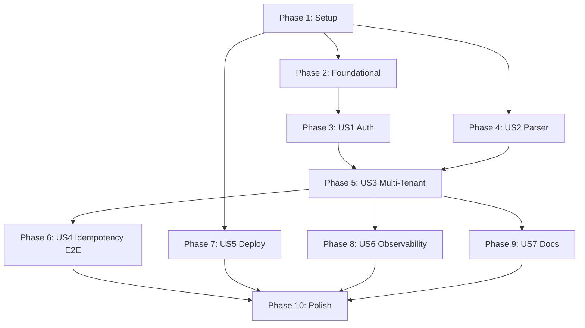

# Tasks: 003 — Multi-Tenant Foundation

**Input**: Design documents from `platforms/prosauai/epics/003-multi-tenant-foundation/`
**Prerequisites**: plan.md (required), spec.md (required), research.md, data-model.md, contracts/
**Branch**: `epic/prosauai/003-multi-tenant-foundation`

**Tests**: Fixture-driven testing is a core requirement (FR-037/FR-038/FR-039). Test tasks are included per spec.

**Organization**: Tasks grouped by user story to enable independent implementation and testing. User stories map to spec.md priorities (P1, P2, P3).

## Format: `[ID] [P?] [Story] Description`

- **[P]**: Can run in parallel (different files, no dependencies on incomplete tasks)
- **[Story]**: Which user story this task belongs to (e.g., US1, US2, US3)
- Include exact file paths in descriptions

## Path Conventions

- **Source**: `prosauai/` (Python package root in external prosauai repo)
- **Tests**: `tests/` (at repo root)
- **Config**: `config/` (at repo root)
- All paths are relative to the prosauai repository root

---

## Phase 1: Setup (Shared Infrastructure)

**Purpose**: Project initialization — new modules, dependencies, config templates

- [X] T001 Add `pyyaml` dependency to `pyproject.toml`
- [X] T002 [P] Create `prosauai/core/tenant.py` with `Tenant` frozen dataclass (9 fields: id, instance_name, evolution_api_url, evolution_api_key, webhook_secret, mention_phone, mention_lid_opaque, mention_keywords, enabled) per data-model.md §1.1
- [X] T003 [P] Create `prosauai/core/tenant_store.py` with `TenantStore` class — `__init__(tenants)`, `load_from_file(path)` with `${ENV_VAR}` regex interpolation, `find_by_instance()`, `get()`, `all_active()`. Validate: no duplicate id/instance_name, no empty secrets, missing env vars raise ValueError per contracts/tenant-config.md
- [X] T004 [P] Create `config/tenants.example.yaml` with 2 tenant entries (Ariel + ResenhAI) using `${ENV_VAR}` placeholders per data-model.md §3. Add `config/tenants.yaml` to `.gitignore`
- [X] T005 Refactor `prosauai/config.py` — remove 7 tenant-specific fields (`evolution_api_url`, `evolution_api_key`, `evolution_instance_name`, `mention_phone`, `mention_keywords`, `webhook_secret`, `tenant_id`), add `tenants_config_path: Path = Path("config/tenants.yaml")` and `idempotency_ttl_seconds: int = 86400`, change port default to 8050 per data-model.md §2

**Checkpoint**: Foundation modules exist. No integration yet.

---

## Phase 2: Foundational (Blocking Prerequisites)

**Purpose**: Core infrastructure that MUST be complete before ANY user story can be implemented

**CRITICAL**: No user story work can begin until this phase is complete

- [X] T006 Create `prosauai/core/idempotency.py` with `check_and_mark_seen(redis, tenant_id, message_id, ttl_seconds=86400) -> bool` using Redis `SET NX EX` atomic. Fail-open on `RedisError` (process + log warning) per FR-012/FR-014
- [X] T007 Create `tests/conftest.py` updates — add fixtures: `sample_tenant()` returning a `Tenant` instance, `tenant_store()` returning a `TenantStore` with 2 test tenants, `load_captured_fixture_pair(name)` helper that loads `tests/fixtures/captured/{name}.input.json` + `{name}.expected.yaml`. Remove old `webhook_secret` / HMAC-related fixtures

**Checkpoint**: Foundation ready — user story implementation can now begin

---

## Phase 3: User Story 1 — Webhook recebe e autentica mensagens reais (Priority: P1)

**Goal**: Sistema resolve tenant pelo instance_name no path, valida X-Webhook-Secret, aceita webhook para processamento. Hoje 100% dos webhooks reais sao rejeitados pelo HMAC imaginario.

**Independent Test**: POST com header X-Webhook-Secret correto para `/webhook/whatsapp/Ariel` retorna 200. Secret errado retorna 401. Instance desconhecido retorna 404.

### Tests for User Story 1

- [X] T008 [P] [US1] Create `tests/unit/test_tenant.py` — test Tenant frozen dataclass creation, immutability (cannot assign), default values (mention_keywords=(), enabled=True), sender_key property edge cases
- [X] T009 [P] [US1] Create `tests/unit/test_tenant_store.py` — test load_from_file with valid YAML, ${ENV_VAR} interpolation, duplicate id error, duplicate instance_name error, missing env var error, missing file error, empty webhook_secret error, find_by_instance/get/all_active methods
- [X] T010 [P] [US1] Create `tests/unit/test_idempotency.py` — test check_and_mark_seen first call returns True, second call returns False, different tenant_id same message_id both return True, Redis unavailable returns True (fail-open)
- [X] T011 [P] [US1] Create `tests/unit/test_auth.py` (replaces `tests/unit/test_hmac.py`) — test resolve_tenant_and_authenticate: valid secret returns (Tenant, bytes), wrong secret returns 401, missing header returns 401, unknown instance_name returns 404, disabled tenant returns 404, constant-time comparison used per FR-006 through FR-010

### Implementation for User Story 1

- [X] T012 [US1] Rewrite `prosauai/api/dependencies.py` — delete `verify_webhook_signature()` (HMAC), implement `resolve_tenant_and_authenticate(request, instance_name) -> tuple[Tenant, bytes]` that: (a) gets TenantStore from app.state, (b) find_by_instance → 404 if None or not enabled, (c) reads raw body, (d) gets X-Webhook-Secret header → 401 if missing, (e) hmac.compare_digest → 401 if mismatch, (f) returns (tenant, raw_body) per contracts/webhook-api.md
- [X] T013 [US1] Delete `tests/unit/test_hmac.py` (replaced by T011 test_auth.py)

**Checkpoint**: Auth pipeline functional — tenant resolution + X-Webhook-Secret validation working. 100% of real webhooks can now be accepted.

---

## Phase 4: User Story 2 — Parser reconhece todos os tipos de mensagem reais (Priority: P1)

**Goal**: Parser interpreta corretamente payloads da Evolution v2.3.0 — 13 tipos de mensagem reais, 3 formatos de sender, mentions, replies, reactions, group events. Hoje 50% das mensagens caem em "unknown type".

**Independent Test**: 26 fixtures capturadas passam no test suite parametrizado com campos declarados correspondendo ao output.

### Tests for User Story 2

- [X] T014 [P] [US2] Create `tests/integration/test_captured_fixtures.py` — parametric test loading all 26 pairs from `tests/fixtures/captured/*.input.json` + `*.expected.yaml`. For each: call `parse_evolution_message(payload, tenant_id="test")`, compare declared fields in expected YAML against ParsedMessage output (partial assertion — ignore `_*` keys). Also call `route_message(msg, tenant)` and compare declared route per FR-037/FR-038

### Implementation for User Story 2

- [X] T015 [US2] Rewrite `prosauai/core/formatter.py` — expand `ParsedMessage` schema from 12 to 22+ fields per data-model.md §1.3: add `tenant_id`, `event`, `instance_id`, `sender_phone`, `sender_lid_opaque`, `media_mimetype`, `media_is_ptt`, `media_duration_seconds`, `media_has_base64_inline`, `mentioned_jids`, `is_reply`, `quoted_message_id`, `reaction_emoji`, `reaction_target_id`, `group_subject`, `group_participants_count`, `group_event_action`, `group_event_participants`, `group_event_author_lid`. Add `sender_key` property. Add `EventType` and `MediaType` Literal types
- [X] T016 [US2] In `prosauai/core/formatter.py` — replace `_KNOWN_MESSAGE_TYPES` with real Evolution v2.3.0 names: `imageMessage`, `videoMessage`, `audioMessage`, `documentMessage`, `stickerMessage`, `locationMessage`, `liveLocationMessage`, `contactMessage`, `reactionMessage`, `pollCreationMessageV3`, `eventMessage`, `extendedTextMessage`, `conversation` per research.md §2 divergence #1
- [X] T017 [US2] In `prosauai/core/formatter.py` — implement sender multi-format resolution: (a) `remoteJid` ending `@lid` + `key.senderPn` → `sender_phone=senderPn`, `sender_lid_opaque=remoteJid digits`; (b) `remoteJid` ending `@s.whatsapp.net` → `sender_phone=remoteJid digits`; (c) group `@g.us` → sender from `key.participant` per research.md §2 divergence #2
- [X] T018 [US2] In `prosauai/core/formatter.py` — add branch for `event=groups.upsert` where `data` is a list: extract `group_id`, `group_subject`, `group_participants_count` from first item, set `is_group_event=True`, synthesize `message_id` per FR-018
- [X] T019 [US2] In `prosauai/core/formatter.py` — add branch for `event=group-participants.update` where `data` is dict without `key`: extract `group_event_action`, `group_event_participants`, `group_event_author_lid`, `group_id` from `data.id`. Synthesize `message_id` as `{instance_name}-{event}-{timestamp_epoch_ms}` per FR-019
- [X] T020 [US2] In `prosauai/core/formatter.py` — read `mentionedJid` from `data.contextInfo` (top-level, not nested in message) → populate `mentioned_jids` list. Works for both `conversation` and `extendedTextMessage` per FR-017
- [X] T021 [US2] In `prosauai/core/formatter.py` — extract `quotedMessage` from `data.contextInfo.quotedMessage` → set `is_reply=True` + `quoted_message_id` from `quotedMessage.stanzaId` or key per FR-020
- [X] T022 [US2] In `prosauai/core/formatter.py` — handle `reactionMessage`: extract `reaction_emoji` from `reactionMessage.text` and `reaction_target_id` from `reactionMessage.key.id` per FR-021
- [X] T023 [US2] In `prosauai/core/formatter.py` — silently ignore irrelevant fields: `messageContextInfo`, `chatwoot*`, `deviceListMetadata`, `data.message.base64`, `status`, `source`. Log `instanceId` as metadata per FR-022
- [X] T024 [US2] Rewrite `tests/unit/test_formatter.py` — cover all 13 message types, 3 sender formats, group events, mentions, replies, reactions, unknown fields, fromMe, empty/malformed payloads
- [X] T025 [US2] Delete `tests/fixtures/evolution_payloads.json` (synthetic fixture replaced by 26 captured fixtures) and remove all test imports referencing it per FR-039

**Checkpoint**: Parser correctly processes 100% of real Evolution v2.3.0 payloads. 26 fixture tests pass.

---

## Phase 5: User Story 3 — Isolamento multi-tenant para 2 tenants simultaneos (Priority: P1)

**Goal**: 2 tenants (Ariel e ResenhAI) operam simultaneamente com isolamento completo. Debounce keys e idempotencia prefixadas por tenant. Flush callback resolve credenciais per-tenant.

**Independent Test**: Configurar 2 tenants, enviar webhooks para ambos, verificar que chaves Redis sao prefixadas por tenant e cada um processa apenas suas mensagens.

### Tests for User Story 3

- [X] T026 [P] [US3] Update `tests/unit/test_debounce.py` — test tenant-prefixed keys `buf:{tenant_id}:{sender_key}:{ctx}` and `tmr:{tenant_id}:{sender_key}:{ctx}`, test `parse_expired_key()` returns `(tenant_id, sender_key, group_id)`, test 2 tenants with same sender_key produce distinct keys, test FlushCallback receives `(tenant_id, sender_key, group_id, text)`
- [X] T027 [P] [US3] Update `tests/unit/test_router.py` — test `route_message(msg, tenant)` signature (no Settings references), test 3-strategy mention detection: (1) mention_lid_opaque in mentioned_jids, (2) mention_phone in mentioned_jids, (3) keyword substring in text. Test reactionMessage routes to IGNORE with reason=reaction. Test fromMe routes to IGNORE with reason=from_me
- [X] T028 [P] [US3] Update `tests/integration/test_webhook.py` — test cross-tenant isolation (webhook for tenant A does not affect tenant B), test idempotency per-tenant (same message_id in different tenants both process), test full pipeline: resolve → auth → parse → idempotency → route → debounce

### Implementation for User Story 3

- [X] T029 [US3] Modify `prosauai/core/router.py` — change signature from `route_message(message, settings)` to `route_message(message, tenant)`. Replace `settings.mention_phone` with `tenant.mention_phone`. Implement `_is_bot_mentioned(msg, tenant)` with 3-strategy detection: (1) `tenant.mention_lid_opaque` + `@lid` suffix in `mentioned_jids`, (2) `tenant.mention_phone` + `@s.whatsapp.net` suffix in `mentioned_jids`, (3) any keyword from `tenant.mention_keywords` as substring in text. Add `reactionMessage` → `IGNORE` with `reason="reaction"`. Keep enum `MessageRoute` and if/elif logic untouched — diff <= 30 lines excl. _is_bot_mentioned per FR-024/FR-025/FR-026
- [X] T030 [US3] Modify `prosauai/core/debounce.py` — update `_make_keys()` to accept `tenant_id` and produce `buf:{tenant_id}:{sender_key}:{ctx}` / `tmr:{tenant_id}:{sender_key}:{ctx}`. Update `append()` to require `tenant_id` as first positional arg. Update `FlushCallback` type to `(tenant_id, sender_key, group_id, text)`. Rewrite `parse_expired_key()` to return `(tenant_id, sender_key, group_id | None)`. Emit `SpanAttributes.TENANT_ID` as span attribute in `debounce.append` and `debounce.flush` spans per FR-027/FR-028/FR-029
- [X] T031 [US3] Modify `prosauai/api/webhooks.py` — rewrite handler to full multi-tenant pipeline: (1) `Depends(resolve_tenant_and_authenticate)` → `(tenant, raw_body)`, (2) parse JSON from raw_body, (3) `parse_evolution_message(payload, tenant_id=tenant.id)`, (4) `check_and_mark_seen(redis, tenant.id, msg.message_id)` → return `{"status": "duplicate"}` if False, (5) `route_message(msg, tenant)`, (6) debounce.append with tenant_id, (7) return `{"status": "processed"}`. Add `structlog.contextvars.bind_contextvars(tenant_id=tenant.id)`. Set `SpanAttributes.TENANT_ID: tenant.id` in span per FR-034/FR-036
- [X] T032 [US3] Modify `prosauai/main.py` — update lifespan to load `TenantStore.load_from_file(settings.tenants_config_path)` into `app.state.tenant_store`. Rewrite `_make_flush_callback(app)` to: (a) call `parse_expired_key(key)` → `(tenant_id, sender_key, group_id)`, (b) `app.state.tenant_store.get(tenant_id)` → resolve Tenant, (c) create `EvolutionProvider(base_url=tenant.evolution_api_url, api_key=tenant.evolution_api_key)`, (d) send echo with tenant-specific credentials. Remove global Settings closure per FR-029

**Checkpoint**: Full multi-tenant pipeline operational — 2 tenants with complete isolation in auth, parsing, idempotency, routing, and debounce.

---

## Phase 6: User Story 4 — Idempotencia neutraliza retries da Evolution (Priority: P2)

**Goal**: Mensagens duplicadas (retries da Evolution, ate 10x) sao detectadas e respondidas com `{"status": "duplicate"}` sem reprocessamento.

**Independent Test**: Enviar mesmo payload com mesmo message_id duas vezes, segundo retorna duplicate.

> **NOTE**: Core idempotency module (T006) and webhook integration (T031) already implemented in Phases 2 and 5. This phase validates the end-to-end behavior and edge cases.

### Implementation for User Story 4

- [X] T033 [US4] Add idempotency edge case tests to `tests/unit/test_idempotency.py` — test TTL expiration (25h later = process again), test concurrent SETNX race condition (only one wins), test Redis reconnection after failure (next call works)
- [X] T034 [US4] Add idempotency integration test to `tests/integration/test_webhook.py` — test same message_id sent twice to same tenant returns `{"status": "duplicate"}` on second call; test same message_id to different tenants both return `{"status": "processed"}` per FR-011/FR-013

**Checkpoint**: Idempotency validated end-to-end. Evolution retries handled gracefully.

---

## Phase 7: User Story 5 — Deploy seguro sem portas expostas (Priority: P2)

**Goal**: Servico roda na porta 8050 sem expor portas publicamente. Dev via Tailscale, prod via Docker network privada.

**Independent Test**: `docker compose config` mostra zero ports bindados em 0.0.0.0.

### Implementation for User Story 5

- [X] T035 [P] [US5] Modify `docker-compose.yml` — remove any `ports:` section, add volume mount `./config/tenants.yaml:/app/config/tenants.yaml:ro`, ensure `EXPOSE 8050` in Dockerfile, add `pace-net` external network per FR-030/FR-031/FR-032
- [X] T036 [P] [US5] Create `docker-compose.override.example.yml` — template (gitignored in real usage) with `ports: ["<TAILSCALE_IP>:8050:8050"]` for dev access. Include comments explaining Tailscale setup
- [X] T037 [P] [US5] Update `.env.example` — add per-tenant env vars (`PACE_EVOLUTION_API_KEY`, `PACE_WEBHOOK_SECRET`, `RESENHA_EVOLUTION_API_KEY`, `RESENHA_WEBHOOK_SECRET`), remove old single-tenant vars (`EVOLUTION_API_KEY`, `WEBHOOK_SECRET`, etc.), document port 8050
- [X] T038 [US5] Update `.gitignore` — add `config/tenants.yaml`, `docker-compose.override.yml`, ensure `.env` is listed

**Checkpoint**: Deploy configuration complete. Zero public ports.

---

## Phase 8: User Story 6 — Observabilidade multi-tenant nos spans e logs (Priority: P2)

**Goal**: Spans de OpenTelemetry e logs estruturados incluem tenant_id per-request. Resource nao contem mais tenant_id (process-wide). Dashboards Phoenix continuam funcionando.

**Independent Test**: Enviar webhooks para 2 tenants e verificar que spans tem tenant_id correto per-request.

### Implementation for User Story 6

- [X] T039 [US6] Modify `prosauai/observability/setup.py` — remove `tenant_id` from `Resource.create()` attributes (Resource is process-wide, incompatible with multi-tenant). Keep `service.name`, `service.version`, `deployment.environment` per FR-033
- [X] T040 [US6] Verify `prosauai/observability/conventions.py` — confirm `SpanAttributes.TENANT_ID = "tenant_id"` is preserved unchanged. No code changes needed — just verification per FR-035
- [X] T041 [US6] Remove `tenant_id` field from `prosauai/config.py` Settings class (was `tenant_id: str = "prosauai-default"`) — already handled if T005 was thorough, verify no remaining references per research.md §7 site #2

**Checkpoint**: Observability delta complete. Dashboards Phoenix preserved. ~25-30 LOC changed across 4-5 files.

> **NOTE**: The per-span tenant_id in webhooks.py (T031) and debounce.py (T030) was already implemented in Phase 5. T039-T041 handle the remaining observability cleanup.

---

## Phase 9: User Story 7 — Onboarding de novo tenant documentado (Priority: P3)

**Goal**: Administrador consegue adicionar novo tenant seguindo documentacao em menos de 15 minutos.

**Independent Test**: Seguir README de onboarding e verificar que novo tenant (sintetico em teste) e reconhecido.

### Implementation for User Story 7

- [X] T042 [US7] Update `README.md` — document: (a) dev setup with Tailscale, (b) prod Fase 1 with Docker network, (c) new tenant onboarding step-by-step (copy template, edit YAML, generate secret via `python3 -c "import secrets; print(secrets.token_urlsafe(32))"`, discover `mention_lid_opaque` via capture workflow, configure webhook URL in Evolution `http://<host>:8050/webhook/whatsapp/<instance_name>`, restart service), (d) how to add a new captured fixture per quickstart.md

**Checkpoint**: Documentation complete. Onboarding < 15 minutes.

---

## Phase 10: Polish & Cross-Cutting Concerns

**Purpose**: Final validation, cleanup, and end-to-end verification

- [X] T043 Run `ruff check prosauai/` and `ruff format prosauai/` — fix all lint/format issues across modified files
- [X] T044 Run full test suite `pytest -v` — verify all unit and integration tests pass (captured fixtures + auth + router + debounce + webhook + idempotency)
- [X] T045 Run quickstart.md validation — follow quickstart steps, verify local dev setup works with `curl` commands
- [X] T046 End-to-end real validation (manual) — Evolution envia webhook para `http://<tailscale-ip>:8050/webhook/whatsapp/Ariel` com X-Webhook-Secret correto, verify: processes successfully, sends echo, duplicate returns duplicate, verify Phoenix spans have correct tenant_id. Repeat with ResenhAI instance

---

## Dependencies & Execution Order

### Phase Dependencies

- **Setup (Phase 1)**: No dependencies — can start immediately
- **Foundational (Phase 2)**: Depends on T002, T003 from Setup
- **US1 — Auth (Phase 3)**: Depends on Phase 1 + Phase 2 (T002, T003, T005, T006)
- **US2 — Parser (Phase 4)**: Depends on Phase 1 (T002 for Tenant, T005 for Settings)
- **US3 — Multi-Tenant (Phase 5)**: Depends on Phase 3 + Phase 4 (all auth + parser must be ready)
- **US4 — Idempotency (Phase 6)**: Depends on Phase 5 (T031 webhook integration)
- **US5 — Deploy (Phase 7)**: Depends on Phase 1 (T004 tenants.example.yaml)
- **US6 — Observability (Phase 8)**: Depends on Phase 5 (T030, T031 already set span attributes)
- **US7 — Docs (Phase 9)**: Depends on all previous phases
- **Polish (Phase 10)**: Depends on all previous phases

### User Story Dependencies



### Within Each User Story

- Tests written FIRST (TDD per constitution principle VII)
- Models/dataclasses before services
- Services before endpoints
- Core implementation before integration
- Story complete before moving to next priority

### Parallel Opportunities

**Phase 1** (all parallelizable):
- T002, T003, T004, T005 can run in parallel (different files, no dependencies)

**Phase 3** (tests parallelizable):
- T008, T009, T010, T011 can run in parallel

**Phase 4** (implementation sequential, but T016-T023 build on T015):
- T014 (test) can run parallel with T024 (unit tests)
- T015-T023 are sequential changes to the same file (formatter.py)

**Phase 5** (tests parallelizable):
- T026, T027, T028 can run in parallel
- T029, T030 can run in parallel (different files)

**Phase 7** (all parallelizable):
- T035, T036, T037 can run in parallel

**Cross-phase parallelism**:
- US2 (parser) and US1 (auth) can proceed in parallel after Phase 1
- US5 (deploy) can proceed in parallel with US1-US4 (only needs Phase 1 config)

---

## Parallel Example: Phase 1 Setup

```bash
# Launch all foundation modules together:
Task: T002 "Create Tenant dataclass in prosauai/core/tenant.py"
Task: T003 "Create TenantStore in prosauai/core/tenant_store.py"
Task: T004 "Create config/tenants.example.yaml"
Task: T005 "Refactor prosauai/config.py"
```

## Parallel Example: Phase 3 Tests

```bash
# Launch all US1 tests together (TDD — write before implementation):
Task: T008 "test_tenant.py"
Task: T009 "test_tenant_store.py"
Task: T010 "test_idempotency.py"
Task: T011 "test_auth.py"
```

---

## Implementation Strategy

### MVP First (US1 + US2 + US3 = P1 stories)

1. Complete Phase 1: Setup
2. Complete Phase 2: Foundational
3. Complete Phase 3: US1 Auth — **VALIDATE**: webhooks aceitos com X-Webhook-Secret
4. Complete Phase 4: US2 Parser — **VALIDATE**: 26 fixtures passam
5. Complete Phase 5: US3 Multi-Tenant — **VALIDATE**: 2 tenants operando com isolamento
6. **STOP and VALIDATE**: Full MVP — sistema funcional com 2 tenants reais

### Incremental Delivery

1. Setup + Foundational → Foundation ready
2. Add US1 (Auth) → Webhooks aceitos (MVP auth)
3. Add US2 (Parser) → Mensagens parseadas corretamente (MVP parser)
4. Add US3 (Multi-Tenant Integration) → **MVP completo** — 2 tenants em prodacao
5. Add US4 (Idempotency E2E) → Retries neutralizados
6. Add US5 (Deploy) → Zero portas expostas
7. Add US6 (Observability) → Spans com tenant_id
8. Add US7 (Docs) → Onboarding documentado
9. Polish → Lint, full test suite, end-to-end

### Suggested MVP Scope

**US1 + US2 + US3** (Phases 1-5) compreendem o MVP — sistema funcional com 2 tenants reais processando 100% dos webhooks da Evolution v2.3.0. Tudo apos e melhoria incremental.

---

## Summary

| Metric | Value |
|--------|-------|
| Total tasks | 46 |
| Phase 1 (Setup) | 5 tasks |
| Phase 2 (Foundational) | 2 tasks |
| Phase 3 (US1 Auth) | 6 tasks |
| Phase 4 (US2 Parser) | 12 tasks |
| Phase 5 (US3 Multi-Tenant) | 7 tasks |
| Phase 6 (US4 Idempotency) | 2 tasks |
| Phase 7 (US5 Deploy) | 4 tasks |
| Phase 8 (US6 Observability) | 3 tasks |
| Phase 9 (US7 Docs) | 1 task |
| Phase 10 (Polish) | 4 tasks |
| Parallel opportunities | 16 tasks marked [P] |
| MVP scope | Phases 1-5 (32 tasks) |

---

## Notes

- [P] tasks = different files, no dependencies on incomplete tasks
- [Story] label maps task to specific user story for traceability
- Each user story is independently completable and testable
- T15-T23 (formatter.py rewrites) are sequential edits to the same file — NOT parallelizable
- T029 (router) must produce diff <= 30 lines (excl. _is_bot_mentioned) — epic 004 owns the rip-and-replace
- `tests/fixtures/evolution_payloads.json` (synthetic) is deleted ONLY after T14+T24 captured fixture tests pass
- Single PR — rip-and-replace approach, no intermediate broken states

---

handoff:
  from: speckit.tasks
  to: speckit.analyze
  context: "46 tasks geradas em 10 fases. MVP = Phases 1-5 (32 tasks) cobrindo US1 (auth), US2 (parser), US3 (multi-tenant). 16 tarefas parallelizaveis. Sequencia bottom-up: fundacao → auth/parser → integracao multi-tenant → idempotencia e2e → deploy → observability → docs → polish. Constraint preservada: T029 (router) diff <= 30 linhas."
  blockers: []
  confidence: Alta
  kill_criteria: "Se spec.md ou plan.md mudarem significativamente (novos requisitos, mudanca de arquitetura), tasks.md precisa de regeneracao."
