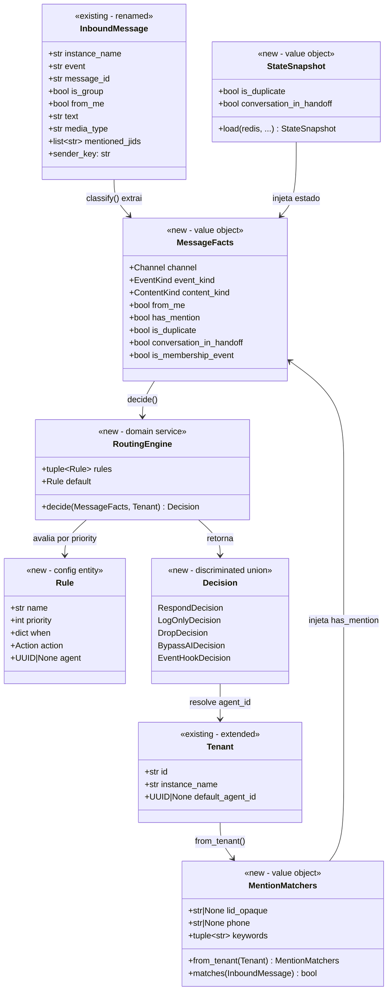

# Data Model — Epic 004: Router MECE

**Date**: 2026-04-10
**Epic**: 004-router-mece
**Branch**: `epic/prosauai/004-router-mece`

---

## Entidades

### 1. MessageFacts (Novo — Layer 1 Output)

Representacao imutavel dos fatos extraidos de uma mensagem. Ortogonal por construcao — cada campo e um eixo independente. Invariantes validadas no construtor.

```python
@dataclass(frozen=True, slots=True)
class MessageFacts:
    # Identidade
    instance: str                          # Nome da instancia Evolution (ex: "Ariel")
    event_kind: EventKind                  # MESSAGE | GROUP_MEMBERSHIP | GROUP_METADATA | PROTOCOL | UNKNOWN
    content_kind: ContentKind              # TEXT | MEDIA | STRUCTURED | REACTION | EMPTY

    # Topologia
    channel: Channel                       # INDIVIDUAL | GROUP
    from_me: bool                          # Echo do proprio bot
    sender_phone: str | None               # E.164 digits (nullable para eventos sem sender)
    sender_lid_opaque: str | None          # LID opaque digits
    group_id: str | None                   # Numeric group ID (sem @g.us)

    # Conteudo
    has_mention: bool                      # Bot foi mencionado (via MentionMatchers)
    is_membership_event: bool              # Evento de add/remove/promote/demote em grupo

    # Estado (pre-carregado via StateSnapshot)
    is_duplicate: bool                     # Mensagem ja processada (idempotency)
    conversation_in_handoff: bool          # Conversa em atendimento humano
```

**Invariantes (`__post_init__`)**:

| # | Invariante | Regra |
|---|-----------|-------|
| 1 | GROUP requer group_id | `channel == GROUP ⟹ group_id is not None` |
| 2 | Mention so em grupo | `has_mention ⟹ channel == GROUP` |
| 3 | Membership requer event_kind correto | `is_membership_event ⟹ event_kind == GROUP_MEMBERSHIP` |

**Enums associados**:

```python
class Channel(StrEnum):
    INDIVIDUAL = "individual"
    GROUP = "group"

class EventKind(StrEnum):
    MESSAGE = "message"
    GROUP_MEMBERSHIP = "group_membership"
    GROUP_METADATA = "group_metadata"
    PROTOCOL = "protocol"
    UNKNOWN = "unknown"

class ContentKind(StrEnum):
    TEXT = "text"
    MEDIA = "media"
    STRUCTURED = "structured"
    REACTION = "reaction"
    EMPTY = "empty"
```

**Espaco de predicados**: `2 (Channel) × 5 (EventKind) × 5 (ContentKind) × 2 (from_me) × 2 (has_mention) × 2 (is_membership_event) × 2 (is_duplicate) × 2 (conversation_in_handoff)` = 1600 combinacoes brutas. Apos aplicar invariantes, ~400 combinacoes validas.

---

### 2. MentionMatchers (Novo — Value Object)

Configuracao imutavel de detecao de mencao do bot, derivada uma vez por tenant no startup.

```python
@dataclass(frozen=True, slots=True)
class MentionMatchers:
    lid_opaque: str | None        # LID opaque do bot no tenant
    phone: str | None             # Telefone do bot no tenant
    keywords: tuple[str, ...]     # Keywords de mencao (ex: "@ariel")
```

**Metodos**:
- `from_tenant(tenant: Tenant) -> MentionMatchers` — classmethod factory
- `matches(message: InboundMessage) -> bool` — verifica se a mensagem menciona o bot usando as 3 estrategias

**Relacao**: 1 MentionMatchers por Tenant. Cached em `app.state.matchers: dict[str, MentionMatchers]`.

---

### 3. StateSnapshot (Novo — Value Object)

Estado pre-carregado do Redis necessario para classificacao, isolando I/O do core puro.

```python
@dataclass(frozen=True, slots=True)
class StateSnapshot:
    is_duplicate: bool             # Key: seen:{tenant_id}:{message_id}
    conversation_in_handoff: bool  # Key: handoff:{tenant_id}:{sender_key}
```

**Metodos**:
- `load(redis, tenant_id, message_id, sender_key) -> StateSnapshot` — async, MGET atomico de 2 keys

**Keys Redis**:

| Key | Escrito por | Lido por | TTL |
|-----|------------|----------|-----|
| `seen:{tenant_id}:{message_id}` | Epic 003 (`check_and_mark_seen`) | Epic 004 (`StateSnapshot.load`) | 86400s |
| `handoff:{tenant_id}:{sender_key}` | Epic 005/011 (contrato aberto) | Epic 004 (`StateSnapshot.load`) | Indefinido |

**Fallback**: Key ausente → `False`. Behavior seguro — mensagem nao e duplicata, conversa nao esta em handoff.

---

### 4. Rule (Novo — Entidade de Config)

Uma regra de roteamento carregada do YAML. Imutavel apos carga.

```python
@dataclass(frozen=True)
class Rule:
    name: str                      # Identificador unico (ex: "drop_self_echo")
    priority: int                  # Ordem de avaliacao (menor = primeiro)
    when: dict[str, Any]           # Condicoes de match (igualdade + conjuncao)
    action: Action                 # RESPOND | LOG_ONLY | DROP | BYPASS_AI | EVENT_HOOK
    agent: UUID | None = None      # Agent especifico (so para RESPOND)
    target: str | None = None      # Target do bypass/hook (so para BYPASS_AI/EVENT_HOOK)
    reason: str | None = None      # Motivo do drop/default
```

**Match semantics**: Cada campo em `when` e comparado por igualdade com o campo correspondente de `MessageFacts`. Campos ausentes = wildcard. Todos devem casar (AND).

---

### 5. Decision (Novo — Discriminated Union)

Resultado do roteamento. 5 subtipos com campos especificos por acao.

```python
class Action(StrEnum):
    RESPOND = "respond"
    LOG_ONLY = "log_only"
    DROP = "drop"
    BYPASS_AI = "bypass_ai"
    EVENT_HOOK = "event_hook"

class RespondDecision(BaseModel):
    action: Literal[Action.RESPOND] = Action.RESPOND
    agent_id: UUID                 # Sempre preenchido (rule.agent ou tenant.default_agent_id)
    matched_rule: str
    reason: str | None = None

class LogOnlyDecision(BaseModel):
    action: Literal[Action.LOG_ONLY] = Action.LOG_ONLY
    matched_rule: str
    reason: str | None = None

class DropDecision(BaseModel):
    action: Literal[Action.DROP] = Action.DROP
    matched_rule: str
    reason: str                    # Obrigatorio — ex: "from_me_loop_guard"

class BypassAIDecision(BaseModel):
    action: Literal[Action.BYPASS_AI] = Action.BYPASS_AI
    target: Literal["m12_handoff"]
    matched_rule: str
    reason: str | None = None

class EventHookDecision(BaseModel):
    action: Literal[Action.EVENT_HOOK] = Action.EVENT_HOOK
    target: Literal["group_membership_handler"]
    matched_rule: str
    reason: str | None = None

Decision = Annotated[
    Union[RespondDecision, LogOnlyDecision, DropDecision, BypassAIDecision, EventHookDecision],
    Field(discriminator="action"),
]
```

---

### 6. RoutingEngine (Novo — Domain Service)

Motor de regras imutavel. Carregado uma vez no startup por tenant.

```python
@dataclass(frozen=True)
class RoutingEngine:
    rules: tuple[Rule, ...]        # Ordenadas por priority ASC
    default: Rule                  # Obrigatoria (schema valida)

    def decide(self, facts: MessageFacts, tenant_ctx: Tenant) -> Decision:
        """Avalia regras por prioridade; primeira que casa ganha."""
        ...
```

**Agent resolution** (dentro de `decide`):
1. Regra tem `agent` → usa `rule.agent`
2. Regra nao tem `agent` → usa `tenant_ctx.default_agent_id`
3. Nenhum dos dois → `RoutingError` ("tenant sem default_agent_id")

**Relacao**: 1 RoutingEngine por tenant. Cached em `app.state.engines: dict[str, RoutingEngine]`.

---

### 7. InboundMessage (Renomeado de ParsedMessage)

Entidade existente do epic 003, renomeada para alinhar com `domain-model.md:40-53`. Zero mudanca de logica — pure rename.

**Campos preservados**: todos os 22+ campos de `ParsedMessage` (formatter.py). Inclui `sender_key` property, `mentioned_jids`, `is_group`, `from_me`, `media_type`, `event`, `group_event_action`, etc.

---

### 8. Tenant (Existente — Estendido)

Entidade do epic 003, estendida com 1 campo aditivo.

```python
@dataclass(frozen=True, slots=True)
class Tenant:
    # Campos existentes (epic 003)
    id: str
    instance_name: str
    evolution_api_url: str
    evolution_api_key: str
    webhook_secret: str
    mention_phone: str
    mention_lid_opaque: str
    mention_keywords: tuple[str, ...] = field(default=())
    enabled: bool = True

    # Novo campo (epic 004)
    default_agent_id: UUID | None = None    # Fallback agent para regras RESPOND sem agent
```

**Backward-compatible**: `default_agent_id=None` e o padrao; tenants existentes continuam funcionando.

---

## Relacoes entre Entidades



## Fluxo de Dados

```
InboundMessage ──┐
                 │
StateSnapshot ───┼── classify() ──→ MessageFacts ──┐
                 │                                   │
MentionMatchers ─┘                                   │
                                                     ├── RoutingEngine.decide() ──→ Decision
                                                     │
Tenant (default_agent_id) ───────────────────────────┘
```

## Mapeamento Legado → Novo

| Legado (003) | Novo (004) | Tipo de Mudanca |
|-------------|-----------|-----------------|
| `ParsedMessage` | `InboundMessage` | Rename |
| `MessageRoute` enum (6 values) | `Action` enum (5 values) + `Decision` union | Substituicao |
| `RouteResult` (route, agent_id, reason) | `Decision` discriminated union (5 subtipos) | Substituicao |
| `route_message()` | `classify()` + `RoutingEngine.decide()` | Split em 2 fases |
| `_is_bot_mentioned()` | `MentionMatchers.matches()` | Extracao para value object |
| `_is_handoff_ativo()` | `StateSnapshot.conversation_in_handoff` | Extracao para state |
| `Tenant` (sem default_agent_id) | `Tenant` (com default_agent_id) | Extensao |
| (nao existia) | `MessageFacts` | Novo |
| (nao existia) | `StateSnapshot` | Novo |
| (nao existia) | `Rule` + `RoutingEngine` | Novo |
| (nao existia) | `config/routing/*.yaml` | Novo |

## Equivalencia de Rotas

| `MessageRoute` Legado | `Action` Novo | `Decision` Subtipo |
|-----------------------|--------------|-------------------|
| `SUPPORT` | `RESPOND` | `RespondDecision(agent_id=...)` |
| `GROUP_RESPOND` | `RESPOND` | `RespondDecision(agent_id=...)` |
| `GROUP_SAVE_ONLY` | `LOG_ONLY` | `LogOnlyDecision` |
| `GROUP_EVENT` | `EVENT_HOOK` | `EventHookDecision(target="group_membership_handler")` |
| `HANDOFF_ATIVO` | `BYPASS_AI` | `BypassAIDecision(target="m12_handoff")` |
| `IGNORE` | `DROP` | `DropDecision(reason="...")` |
