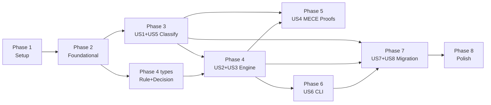

# Tasks: Router MECE — Classificacao Pura + Regras Externalizadas + Agent Resolution

**Input**: Design documents from `platforms/prosauai/epics/004-router-mece/`
**Prerequisites**: plan.md (required), spec.md (required), research.md, data-model.md, contracts/router-api.md, quickstart.md
**Branch**: `epic/prosauai/004-router-mece`

**Tests**: Sim — o pitch e spec exigem 95+ testes (property tests, unit, integration). TDD aplicado conforme Constitution VII.

**Organization**: Tasks agrupadas por user story para implementacao e teste independentes. US1+US5 e US2+US3 sao consolidadas por acoplamento forte (classify depende de MentionMatchers; engine depende de agent resolution).

## Format: `[ID] [P?] [Story] Description`

- **[P]**: Pode rodar em paralelo (arquivos diferentes, sem dependencias)
- **[Story]**: Qual user story (US1..US8) — Setup e Foundational nao tem label

## Path Conventions

- **Source**: `prosauai/` (repo externo `paceautomations/prosauai`)
- **Config**: `config/routing/` (repo externo)
- **Tests**: `tests/` (repo externo)
- **Docs**: `platforms/prosauai/` (repo madruga.ai)

---

## Phase 1: Setup

**Purpose**: Rename legado, scaffold do novo modulo, extensao do Tenant

- [X] T001 Rename `ParsedMessage` para `InboundMessage` em `prosauai/core/formatter.py` — alterar nome da classe, manter arquivo; atualizar todos os imports em `prosauai/core/router.py`, `prosauai/api/webhooks.py`, `prosauai/core/debounce.py`, e todos os arquivos de teste que referenciam `ParsedMessage`
- [X] T002 Adicionar `default_agent_id: UUID | None = None` ao dataclass `Tenant` em `prosauai/core/tenant.py`; atualizar `_build_tenant()` em `prosauai/core/tenant_store.py` para ler `default_agent_id` do YAML quando presente; adicionar comentario em `tenants.example.yaml`
- [X] T003 Criar testes para T001 e T002: 1 teste em `tests/unit/test_tenant.py` validando `default_agent_id=None` por default + 1 teste em `tests/unit/test_tenant_store.py` validando loader le UUID quando presente; rodar testes existentes do 003 para confirmar zero regressao no rename
- [X] T004 Scaffold do modulo `prosauai/core/router/` com arquivos vazios: `__init__.py`, `facts.py`, `matchers.py`, `engine.py`, `loader.py`, `verify.py`, `errors.py`

---

## Phase 2: Foundational — Core Types & Data Model

**Purpose**: Tipos base que TODAS as user stories dependem. DEVE completar antes de qualquer US.

**CRITICAL**: Nenhuma implementacao de user story pode comecar sem estes tipos.

- [X] T005 [P] Implementar error types em `prosauai/core/router/errors.py`: `RoutingError` (base), `RoutingConfigError` (config validation), `AgentResolutionError` (RESPOND sem agent)
- [X] T006 [P] Implementar enums em `prosauai/core/router/facts.py`: `Channel` (INDIVIDUAL, GROUP), `EventKind` (MESSAGE, GROUP_MEMBERSHIP, GROUP_METADATA, PROTOCOL, UNKNOWN), `ContentKind` (TEXT, MEDIA, STRUCTURED, REACTION, EMPTY) — todos `StrEnum`
- [X] T007 Implementar `MessageFacts` frozen dataclass em `prosauai/core/router/facts.py` com 12 campos (instance, event_kind, content_kind, channel, from_me, sender_phone, sender_lid_opaque, group_id, has_mention, is_membership_event, is_duplicate, conversation_in_handoff) + 3 invariantes em `__post_init__` (GROUP requer group_id, mention so em GROUP, membership requer GROUP_MEMBERSHIP event_kind)
- [X] T008 Criar testes de `MessageFacts` em `tests/unit/test_facts.py`: construcao valida para cada Channel x EventKind x ContentKind, rejeicao de invariantes violadas (GROUP sem group_id, mention em INDIVIDUAL, membership sem GROUP_MEMBERSHIP), frozen immutability (12+ testes)
- [X] T009 [P] Implementar `Action` enum (RESPOND, LOG_ONLY, DROP, BYPASS_AI, EVENT_HOOK) + 5 subtipos de `Decision` como discriminated union pydantic em `prosauai/core/router/engine.py`: `RespondDecision`, `LogOnlyDecision`, `DropDecision`, `BypassAIDecision`, `EventHookDecision` + type alias `Decision` com `Field(discriminator="action")`
- [X] T010 Criar testes dos 5 subtipos de `Decision` em `tests/unit/test_engine.py`: construcao valida de cada subtipo, serializacao/deserializacao via `model_dump()`/`model_validate()`, discriminator resolve corretamente, campos invalidos rejeitados (ex: agent_id em DropDecision) (5+ testes)
- [X] T011 [P] Implementar `Rule` frozen dataclass em `prosauai/core/router/engine.py` com campos (name, priority, when, action, agent, target, reason) + metodo `matches(facts: MessageFacts) -> bool` (igualdade + conjuncao: cada campo em `when` comparado por igualdade, campos ausentes = wildcard, AND de todos)
- [X] T012 Criar testes de `Rule.matches()` em `tests/unit/test_engine.py`: match exato, wildcard (when vazio = match all), conjuncao parcial, campo desconhecido ignorado, match com enums string vs StrEnum (12+ testes)
- [X] T013 [P] Implementar `StateSnapshot` frozen dataclass em `prosauai/core/router/facts.py` com `is_duplicate: bool` e `conversation_in_handoff: bool` + classmethod async `load(redis, tenant_id, message_id, sender_key)` que faz `MGET` de 2 keys (`seen:{tenant_id}:{message_id}` + `handoff:{tenant_id}:{sender_key}`) e retorna `StateSnapshot` com fallback `False` para keys ausentes

**Checkpoint**: Todos os tipos base definidos e testados — user stories podem comecar

---

## Phase 3: US1 + US5 — Classificacao MECE + Deteccao de Mencao Tenant-Aware (Priority: P1)

**Goal**: Classificar cada mensagem em fatos ortogonais e deterministicos (US1) usando deteccao de mencao configuravel por tenant (US5). Funcao `classify()` pura, sem I/O.

**Independent Test**: Enviar qualquer payload de mensagem e verificar que o resultado e deterministico, completo e nao-ambiguo. Testar deteccao de mencao com configs de tenants diferentes.

### Tests for US1 + US5

> **NOTE: Write tests FIRST, ensure they FAIL before implementation**

- [X] T014 [P] [US1] Criar testes de `StateSnapshot.load()` em `tests/unit/test_facts.py`: key existente retorna True, key ausente retorna False (fallback seguro), `conversation_in_handoff=False` quando key handoff nao existe (contrato aberto), MGET atomico com 2 keys (4+ testes com Redis mock via `unittest.mock.AsyncMock`)
- [X] T015 [P] [US5] Criar testes de `MentionMatchers` em `tests/unit/test_matchers.py`: match por LID opaque JID, match por phone JID, match por keyword substring (case-insensitive), no-match quando nenhuma estrategia casa, `from_tenant()` constroi corretamente de `Tenant`, matchers de tenants diferentes produzem resultados diferentes para mesma mensagem (6+ testes)
- [X] T016 [P] [US1] Criar testes de `classify()` em `tests/unit/test_facts.py`: mensagem individual texto → channel=INDIVIDUAL/event_kind=MESSAGE/content_kind=TEXT, mensagem grupo com mention → has_mention=True, reaction → content_kind=REACTION, from_me=true → from_me=True, duplicata → is_duplicate=True, handoff ativo → conversation_in_handoff=True, evento membership → is_membership_event=True/event_kind=GROUP_MEMBERSHIP, media message → content_kind=MEDIA (15+ testes cobrindo cada combinacao de fato)

### Implementation for US1 + US5

- [ ] T017 [US5] Implementar `MentionMatchers` frozen dataclass em `prosauai/core/router/matchers.py` com campos (lid_opaque, phone, keywords), classmethod `from_tenant(tenant: Tenant)`, e metodo `matches(message: InboundMessage) -> bool` implementando 3 estrategias de deteccao: LID JID lookup, phone JID lookup, keyword substring case-insensitive
- [ ] T018 [US1] Implementar funcao `classify(message: InboundMessage, state: StateSnapshot, matchers: MentionMatchers) -> MessageFacts` pura em `prosauai/core/router/facts.py` — extrair channel de `message.is_group`, event_kind de `message.event`, content_kind de `message.media_type`/`message.text`/`message.event`, from_me de `message.from_me`, has_mention de `matchers.matches(message)`, is_membership_event de `message.event == "group-participants.update"`, is_duplicate e conversation_in_handoff de `state`
- [ ] T019 [US1] Exportar `classify`, `MessageFacts`, `StateSnapshot`, `Channel`, `EventKind`, `ContentKind` no `prosauai/core/router/__init__.py` como public API parcial

**Checkpoint**: Layer 1 completa — classificacao pura funcional e testavel isoladamente

---

## Phase 4: US2 + US3 — Regras Externalizadas + Agent Resolution (Priority: P1)

**Goal**: Avaliar regras de roteamento externas (YAML per-tenant) com prioridade e resolver agent_id para decisoes RESPOND. Garantir que regras sao mutuamente exclusivas por construcao.

**Independent Test**: Criar/editar YAML de configuracao e verificar que o sistema carrega, valida (rejeita invalidos), e aplica regras na ordem de prioridade. Verificar que toda decisao RESPOND tem agent_id valido.

### Tests for US2 + US3

- [ ] T020 [P] [US2] Criar testes de `RoutingEngine.decide()` em `tests/unit/test_engine.py`: primeira regra que casa ganha, default aplicado quando nenhuma casa, prioridade respeitada (menor numero primeiro), regras com `when` mais especifico nao sao avaliadas se uma anterior ja casou (10+ testes)
- [ ] T021 [P] [US3] Criar testes de agent resolution em `tests/unit/test_engine.py`: regra RESPOND com agent especifico → usa agent da regra, regra RESPOND sem agent + tenant com default → usa tenant default, regra RESPOND sem agent + tenant sem default → `AgentResolutionError`, decisoes LOG_ONLY/DROP/BYPASS_AI/EVENT_HOOK nao tentam resolver agent (4+ testes)
- [ ] T022 [P] [US2] Criar testes do YAML loader em `tests/unit/test_loader.py`: carga valida com 9 regras, rejeicao de config sem `default`, rejeicao de `priority` duplicado, rejeicao de campo desconhecido (extra="forbid"), rejeicao de `action` invalida, validacao de `version: 1`, validacao de `tenant` obrigatorio, carga de multiplos arquivos independentes (15+ testes negativos)
- [ ] T023 [P] [US2] Criar testes do overlap analysis em `tests/unit/test_loader.py`: duas regras com `when` identico → overlap detectado, regra generica (wildcard) + regra especifica com campo adicional → overlap detectado, duas regras disjuntas por campo → sem overlap, guards universais com `when` parcial verificados corretamente, config real `ariel.yaml` passa sem overlap (8+ testes)

### Implementation for US2 + US3

- [ ] T024 [US2] Implementar `RoutingEngine` frozen dataclass em `prosauai/core/router/engine.py` com `rules: tuple[Rule, ...]` (ordenadas por priority ASC) e `default: Rule`; metodo `decide(facts: MessageFacts, tenant_ctx: Tenant) -> Decision` que itera regras, retorna Decision da primeira que casa; se nenhuma casa, aplica default
- [ ] T025 [US3] Implementar agent resolution dentro de `RoutingEngine.decide()`: para action RESPOND, resolver agent_id de `rule.agent` ou fallback `tenant_ctx.default_agent_id`; se ambos None, raise `AgentResolutionError` com mensagem clara
- [ ] T026 [US2] Implementar pydantic models para schema YAML em `prosauai/core/router/loader.py`: `RuleConfig` (name, priority, when, action, agent, target, reason), `RoutingConfig` (version, tenant, rules, default) com `model_config = ConfigDict(extra="forbid")`; validators para `version == 1`, `priority` unico, `default` obrigatorio
- [ ] T027 [US2] Implementar funcao `load_routing_config(path: Path) -> RoutingEngine` em `prosauai/core/router/loader.py` que le YAML, valida via pydantic, converte para `Rule` + `RoutingEngine`
- [ ] T028 [US2] Implementar overlap analysis pairwise em `prosauai/core/router/loader.py`: funcao `check_no_overlaps(rules: list[Rule])` que gera todos os `MessageFacts` validos (~400 combinacoes do produto cartesiano de enums filtrado por invariantes), para cada par de regras verifica se algum fact casa com ambas; se overlap encontrado, raise `RoutingConfigError` com nomes das regras conflitantes. Integrar no `load_routing_config()` apos parse
- [ ] T029 [P] [US2] Criar fixture `config/routing/ariel.yaml` com 9 regras para tenant pace-internal: drop_self_echo (p0), drop_duplicate (p1), drop_reaction (p2), handoff_bypass (p5), group_membership (p10), individual_support (p100), group_mention_support (p110), group_silent_log (p120) + default RESPOND
- [ ] T030 [P] [US2] Criar fixture `config/routing/resenhai.yaml` para tenant resenha-internal com priorities community-first: group_mention_support priority mais baixo, group_silent_log obrigatorio, individual_support priority 100 + default RESPOND
- [ ] T031 [US2] Exportar `RoutingEngine`, `Rule`, `Decision`, subtipos, `Action`, `load_routing_config` no `prosauai/core/router/__init__.py`

**Checkpoint**: Layer 2 completa — engine de regras funcional com configs reais validadas. Classificacao + decisao funcionam end-to-end em testes.

---

## Phase 5: US4 — Decisoes Tipadas + Provas MECE (Priority: P2)

**Goal**: Provar por construcao que toda mensagem casa com exatamente 1 regra (MECE) usando property tests exaustivos. Garantir que consumidores tratam todos os 5 tipos de decisao exaustivamente.

**Independent Test**: Rodar property tests que enumeram todas as ~400 combinacoes validas de MessageFacts e verificam unicidade de match contra cada config YAML real.

### Tests for US4 (Property-Based)

- [ ] T032 [US4] Criar test exaustivo em `tests/unit/test_mece_exhaustive.py`: gerar todas as combinacoes validas de `MessageFacts` do produto cartesiano `Channel x EventKind x ContentKind x bool^5` (filtrando invariantes invalidas); para cada combinacao e cada fixture YAML real (ariel.yaml, resenhai.yaml), assertar `len(matching_rules) == 1` (ou 0 + default); verificar que default e sempre alcancavel
- [ ] T033 [US4] Criar Hypothesis test em `tests/unit/test_mece_exhaustive.py`: usar `@given(st.text(), st.text(), st.from_regex(...))` para campos livres (instance, sender_phone, group_id) combinados com enums fixos; verificar que campos string livres nao afetam unicidade do match
- [ ] T034 [US4] Criar teste de reachability em `tests/unit/test_mece_reachability.py`: para cada regra que filtra por `instance` especifico em cada fixture YAML, verificar que existe ao menos 1 combinacao de facts que a atinge (detecta shadow rules — regras que nunca matcham porque wildcard precede)

**Checkpoint**: MECE provado em CI — nenhuma combinacao valida de fatos casa com 0 ou 2+ regras

---

## Phase 6: US6 — Verificacao e Explicacao de Configuracao (Priority: P2)

**Goal**: Prover CLI para verificar configs e explicar roteamento, executavel localmente e em CI. Pre-commit hook bloqueia configs invalidas.

**Independent Test**: Rodar verificador contra arquivos validos e invalidos; rodar explicador contra cenarios especificos de fatos.

### Tests for US6

- [ ] T035 [P] [US6] Criar testes de CLI `verify` em `tests/unit/test_verify.py`: config valida → exit 0 + "N rules loaded", config sem default → exit 1 + mensagem de erro, config com overlap → exit 1 + nomes das regras conflitantes (3+ testes)
- [ ] T036 [P] [US6] Criar testes de CLI `explain` em `tests/unit/test_verify.py`: facts de mensagem individual → "individual_support matched", facts de from_me=true → "drop_self_echo matched", facts invalidos (JSON malformado) → exit 1 (3+ testes)

### Implementation for US6

- [ ] T037 [US6] Implementar CLI `verify` em `prosauai/core/router/verify.py`: argparse com subcomando `verify <path>`, chama `load_routing_config()`, printa resultado ou erro, exit code 0/1
- [ ] T038 [US6] Implementar CLI `explain` em `prosauai/core/router/verify.py`: argparse com subcomando `explain --tenant <slug> --facts <json>`, carrega config do tenant, parseia facts JSON, roda `engine.decide()`, printa regra casada + reason + detalhes de match
- [ ] T039 [US6] Configurar pre-commit hook para rodar `python -m prosauai.core.router.verify` em todos os `config/routing/*.yaml` alterados em `.pre-commit-config.yaml`

**Checkpoint**: DX completa — config invalida nao entra no repo, operador pode simular roteamento localmente

---

## Phase 7: US7 + US8 — Observabilidade + Migracao Transparente (Priority: P3)

**Goal**: Instrumentar router com 2 spans OTel irmaos (classify + decide) e substituir completamente o router legado preservando equivalencia comportamental com as 26 fixtures reais do epic 003.

**Independent Test**: Enviar mensagens e verificar spans no Phoenix com atributos corretos. Rodar 26 fixtures reais contra novo router e comparar acoes com router legado.

### Tests for US7 + US8

- [ ] T040 [P] [US7] Criar testes de constantes OTel em `tests/unit/test_conventions.py`: validar existencia e formato das 6 novas constantes (MATCHED_RULE, ROUTING_ACTION, DROP_REASON, EVENT_HOOK_TARGET, MESSAGE_IS_REACTION, MESSAGE_MEDIA_TYPE) no namespace flat `prosauai.*`
- [ ] T041 [P] [US8] Criar teste de equivalencia em `tests/integration/test_captured_fixtures.py`: para cada uma das 26 fixtures reais do 003, classificar com novo `classify()` + `engine.decide()` e assertar que a `Action` resultante e equivalente ao `MessageRoute` legado (usando tabela de equivalencia: SUPPORT→RESPOND, GROUP_RESPOND→RESPOND, GROUP_SAVE_ONLY→LOG_ONLY, GROUP_EVENT→EVENT_HOOK, HANDOFF_ATIVO→BYPASS_AI, IGNORE→DROP); atualizar `TEST_TENANTS` com `default_agent_id=None`

### Implementation for US7

- [ ] T042 [US7] Adicionar 6 novas constantes em `prosauai/observability/conventions.py`: `MATCHED_RULE = "prosauai.matched_rule"`, `ROUTING_ACTION = "prosauai.action"`, `DROP_REASON = "prosauai.drop_reason"`, `EVENT_HOOK_TARGET = "prosauai.event_target"`, `MESSAGE_IS_REACTION = "prosauai.is_reaction"`, `MESSAGE_MEDIA_TYPE = "prosauai.media_type"`

### Implementation for US8 — Migracao

- [ ] T043 [US8] Migrar `prosauai/api/webhooks.py` para usar `await route(message, redis, engine, matchers, tenant)` em vez de `route_message(msg, tenant)`; implementar `match/case` sobre `Decision` com tratamento exaustivo dos 5 subtipos; adicionar 2 spans irmaos `router.classify` + `router.decide` sob span `webhook_whatsapp` com atributos OTel das novas constantes; remover span legado `route_message`
- [ ] T044 [US8] Migrar `prosauai/main.py` lifespan para carregar `RoutingEngine` + `MentionMatchers` no startup: iterar tenants ativos, carregar `config/routing/{tenant.id}.yaml` via `load_routing_config()`, construir `MentionMatchers.from_tenant(tenant)`, armazenar em `app.state.engines: dict[str, RoutingEngine]` e `app.state.matchers: dict[str, MentionMatchers]`; fail-fast se tenant ativo nao tem config YAML correspondente
- [ ] T045 [US8] Implementar funcao `route()` async em `prosauai/core/router/__init__.py`: orquestra `StateSnapshot.load()` → `classify()` → `engine.decide()`, retorna `Decision`
- [ ] T046 [US8] Remover enum `MessageRoute`, `RouteResult`, funcoes `route_message()`, `_is_bot_mentioned()`, `_is_handoff_ativo()` de `prosauai/core/router.py` (arquivo legado); grep para confirmar zero consumers restantes
- [ ] T047 [US8] Atualizar ou substituir `tests/unit/test_router.py` (003) — migrar testes relevantes para os novos arquivos de teste granulares (`test_facts.py`, `test_engine.py`, `test_matchers.py`) ou deletar se ja cobertos

**Checkpoint**: Router legado completamente substituido. 26 fixtures passam. Spans OTel visiveis. Zero referencias ao enum legado.

---

## Phase 8: Polish & Cross-Cutting Concerns

**Purpose**: Atualizacao de documentacao, validacao final, cleanup

- [ ] T048 [P] Atualizar `platforms/prosauai/business/process.md`: Fase B (Agent Resolution) deixa de ser promessa e vira documentacao da implementacao real com `classify()` + `RoutingEngine.decide()` + agent resolution
- [ ] T049 [P] Atualizar `platforms/prosauai/engineering/domain-model.md`: Router aggregate com `classify()` + `decide()` separados; `InboundMessage` confirmado como aggregate name; `Tenant` com `default_agent_id` flat (nao JSONB settings)
- [ ] T050 Validacao final: rodar `grep -r "MessageRoute\|route_message\|RouteResult\|_is_bot_mentioned\|_is_handoff_ativo" prosauai/` → zero matches; rodar `grep -r "ParsedMessage" prosauai/ tests/` → zero matches; rodar todos os testes `pytest tests/ -v` → 95+ testes passando
- [ ] T051 Rodar verificacao `quickstart.md`: executar comandos do quickstart (verify ariel.yaml, explain com facts de exemplo, pytest) e confirmar que todos funcionam conforme documentado

---

## Dependencies & Execution Order

### Phase Dependencies

- **Setup (Phase 1)**: Sem dependencias — pode comecar imediatamente
- **Foundational (Phase 2)**: Depende de Phase 1 (T004 scaffold) — BLOQUEIA todas as user stories
- **US1+US5 (Phase 3)**: Depende de Phase 2 (MessageFacts, StateSnapshot, enums)
- **US2+US3 (Phase 4)**: Depende de Phase 2 (Rule, Decision, Action) + Phase 3 (classify para overlap analysis usar valid_facts)
- **US4 (Phase 5)**: Depende de Phase 3 + Phase 4 (precisa de classify + engine + configs YAML reais)
- **US6 (Phase 6)**: Depende de Phase 4 (loader funcional)
- **US7+US8 (Phase 7)**: Depende de Phase 3 + Phase 4 + Phase 6 (todas as camadas funcionais para migracao)
- **Polish (Phase 8)**: Depende de Phase 7 (migracao completa)

### User Story Dependencies



### Within Each Phase

- Tests DEVEM ser escritos e FALHAR antes da implementacao (TDD — Constitution VII)
- Types/models antes de services
- Services antes de integracao
- Core implementation antes de CLI/tooling

### Parallel Opportunities

**Phase 1**: T001, T002 podem rodar em paralelo (arquivos diferentes)
**Phase 2**: T005, T006, T009, T011, T013 marcados [P] — arquivos diferentes
**Phase 3**: T014, T015, T016 (testes) em paralelo; T017, T018 sequenciais (T017 antes de T018)
**Phase 4**: T020, T021, T022, T023 (testes) em paralelo; T029, T030 (fixtures YAML) em paralelo
**Phase 5**: T032, T033, T034 podem rodar em paralelo (arquivos de teste diferentes)
**Phase 6**: T035, T036 (testes) em paralelo; T037, T038 sequenciais
**Phase 7**: T040, T041 (testes) em paralelo; T042 em paralelo com T043-T045
**Phase 8**: T048, T049 em paralelo

---

## Parallel Example: Phase 2 (Foundational)

```bash
# Launch all [P] tasks in parallel (different files):
Task T005: "Error types in prosauai/core/router/errors.py"
Task T006: "Enums in prosauai/core/router/facts.py"
Task T009: "Decision subtypes in prosauai/core/router/engine.py"
Task T011: "Rule dataclass in prosauai/core/router/engine.py"
Task T013: "StateSnapshot in prosauai/core/router/facts.py"

# Then sequential (depend on types above):
Task T007: "MessageFacts in prosauai/core/router/facts.py" (depends on T006 enums)
Task T008: "Tests for MessageFacts" (depends on T007)
Task T010: "Tests for Decision" (depends on T009)
Task T012: "Tests for Rule.matches()" (depends on T011)
```

## Parallel Example: Phase 3 (US1+US5 Classify)

```bash
# Launch all tests in parallel (TDD: write first, ensure they fail):
Task T014: "StateSnapshot.load() tests in tests/unit/test_facts.py"
Task T015: "MentionMatchers tests in tests/unit/test_matchers.py"
Task T016: "classify() tests in tests/unit/test_facts.py"

# Then implementation:
Task T017: "MentionMatchers in prosauai/core/router/matchers.py"
Task T018: "classify() in prosauai/core/router/facts.py" (depends on T017)
Task T019: "Export public API in __init__.py"
```

---

## Implementation Strategy

### MVP First (Phase 1-4: Setup + Foundational + US1+US5 + US2+US3)

1. Complete Phase 1: Setup (rename + scaffold + tenant extension)
2. Complete Phase 2: Foundational (core types — bloqueia tudo)
3. Complete Phase 3: US1+US5 (classify puro + mention detection)
4. Complete Phase 4: US2+US3 (engine + loader + configs)
5. **STOP and VALIDATE**: Rodar testes unit + integration parcial. Classify + Decide funcionam end-to-end com configs reais.

### Incremental Delivery

1. Setup + Foundational → Types compilam e testam isoladamente
2. US1+US5 → Layer 1 funcional: classificacao MECE provavel
3. US2+US3 → Layer 2 funcional: engine de regras com configs reais
4. US4 → MECE provado formalmente via property tests
5. US6 → DX completa: CLI verify + explain + pre-commit
6. US7+US8 → Migracao completa: router legado removido, spans OTel ativos
7. Polish → Docs atualizados, zero drift, 95+ testes passando

### Risk Mitigation Sequence

A ordem de implementacao prioriza riscos maiores primeiro:
1. **T007-T008** (MessageFacts invariantes): se o espaco de facts explodir alem de ~1000, enumeracao exaustiva fica inviavel — descobrir cedo
2. **T028** (overlap analysis): se falsos-positivos em guards universais forem problematicos, ajustar antes de property tests
3. **T041** (fixture equivalence): se as 26 fixtures nao mapeiam para o novo sistema, e blocker — rodar antes da migracao completa

---

## Summary

| Metrica | Valor |
|---------|-------|
| **Total de tasks** | 51 |
| **Tasks por user story** | US1+US5: 6 impl + 3 test = 9, US2+US3: 8 impl + 4 test = 12, US4: 3 test, US6: 3 impl + 2 test = 5, US7+US8: 6 impl + 2 test = 8 |
| **Oportunidades de paralelismo** | 22 tasks marcadas [P] |
| **MVP scope** | Phase 1-4 (33 tasks): classify + engine + configs reais funcionais |
| **LOC estimado (prod)** | ~1210 (com multiplicador 1.5x do CLAUDE.md) |
| **LOC estimado (test)** | ~1160 |
| **Testes target** | 95+ (70+ unit, 15+ integration, property tests, CLI tests) |

---

## Notes

- [P] tasks = arquivos diferentes, sem dependencias mutuas
- [Story] label mapeia task para user story especifica
- Cada user story e independentemente completavel e testavel (apos foundational)
- TDD: testes escritos e falhando ANTES da implementacao
- Commit apos cada task ou grupo logico
- Stop em qualquer checkpoint para validar independentemente
- `conversation_in_handoff` sera sempre `False` ate epic 005/011 — contrato aberto documentado

---
handoff:
  from: speckit.tasks
  to: speckit.analyze
  context: "Tasks.md completo com 51 tasks organizadas em 8 fases por user story. 22 oportunidades de paralelismo. MVP scope = Phase 1-4 (33 tasks). Estimativa 1210 LOC prod + 1160 LOC test. TDD aplicado em todas as fases. Proximo passo: analise de consistencia spec/plan/tasks antes de implementar."
  blockers: []
  confidence: Alta
  kill_criteria: "Se o espaco de MessageFacts validos explodir alem de ~1000 combinacoes tornando enumeracao exaustiva inviavel, ou se as 26 fixtures reais do epic 003 nao puderem ser mapeadas para o novo sistema de decisions."
