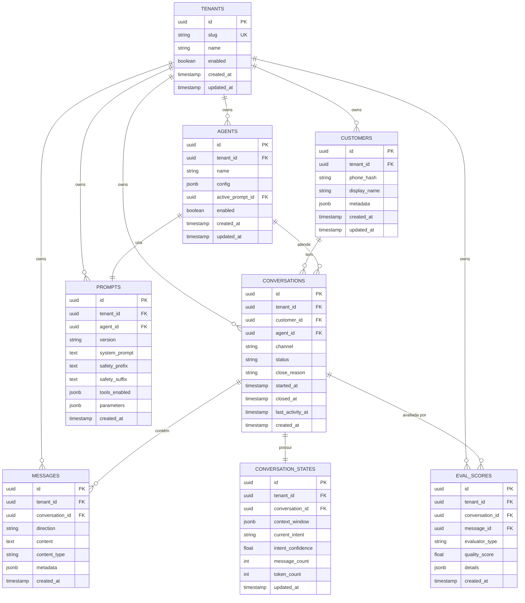
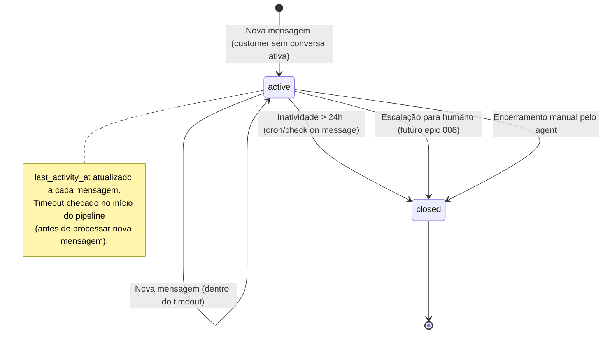

# Data Model: Conversation Core (Epic 005)

**Epic**: 005-conversation-core  
**Date**: 2026-04-12  
**Source**: domain-model.md (Bounded Context: Conversation + Safety)

## Entidades e Relacionamentos

### Diagrama ER



## Schemas SQL

### Pré-requisitos

```sql
-- 001_create_schema.sql
-- gen_random_uuid() is built-in on PG14+ — no uuid-ossp extension needed.

-- RLS helper function (ADR-011 hardening)
CREATE OR REPLACE FUNCTION public.tenant_id()
RETURNS uuid
LANGUAGE sql
STABLE
SECURITY DEFINER
SET search_path = ''
AS $$
  SELECT current_setting('app.current_tenant_id', true)::uuid
$$;
```

### customers

```sql
-- 002_customers.sql
CREATE TABLE customers (
    id          UUID PRIMARY KEY DEFAULT gen_random_uuid(),
    tenant_id   UUID NOT NULL,
    phone_hash  VARCHAR(64) NOT NULL,  -- SHA-256 hash, never raw phone
    display_name VARCHAR(255),
    metadata    JSONB DEFAULT '{}',
    created_at  TIMESTAMPTZ NOT NULL DEFAULT now(),
    updated_at  TIMESTAMPTZ NOT NULL DEFAULT now(),
    
    CONSTRAINT uq_customer_tenant_phone UNIQUE (tenant_id, phone_hash)
);

CREATE INDEX idx_customers_tenant ON customers(tenant_id);

ALTER TABLE customers ENABLE ROW LEVEL SECURITY;
CREATE POLICY tenant_isolation ON customers
    USING (tenant_id = public.tenant_id())
    WITH CHECK (tenant_id = public.tenant_id());
```

### conversations

```sql
-- 003_conversations.sql
CREATE TYPE conversation_status AS ENUM ('active', 'closed');
CREATE TYPE close_reason AS ENUM ('inactivity_timeout', 'user_closed', 'escalated', 'agent_closed');

CREATE TABLE conversations (
    id              UUID PRIMARY KEY DEFAULT gen_random_uuid(),
    tenant_id       UUID NOT NULL,
    customer_id     UUID NOT NULL REFERENCES customers(id),
    agent_id        UUID NOT NULL,
    channel         VARCHAR(50) NOT NULL DEFAULT 'whatsapp',
    status          conversation_status NOT NULL DEFAULT 'active',
    close_reason    close_reason,
    started_at      TIMESTAMPTZ NOT NULL DEFAULT now(),
    closed_at       TIMESTAMPTZ,
    last_activity_at TIMESTAMPTZ NOT NULL DEFAULT now(),
    created_at      TIMESTAMPTZ NOT NULL DEFAULT now(),
    
    -- Invariante 4: Uma conversa ativa por customer/channel
    CONSTRAINT uq_active_conversation UNIQUE (tenant_id, customer_id, channel, status)
        WHERE (status = 'active')
);

-- NOTA: A constraint UNIQUE parcial acima usa WHERE, que não é suportada diretamente.
-- Implementar como unique index:
CREATE UNIQUE INDEX idx_one_active_per_customer 
    ON conversations(tenant_id, customer_id, channel) 
    WHERE status = 'active';

CREATE INDEX idx_conversations_tenant ON conversations(tenant_id);
CREATE INDEX idx_conversations_customer ON conversations(customer_id);
CREATE INDEX idx_conversations_last_activity ON conversations(last_activity_at) 
    WHERE status = 'active';

ALTER TABLE conversations ENABLE ROW LEVEL SECURITY;
CREATE POLICY tenant_isolation ON conversations
    USING (tenant_id = public.tenant_id())
    WITH CHECK (tenant_id = public.tenant_id());
```

### conversation_states

```sql
-- 003b_conversation_states.sql
CREATE TABLE conversation_states (
    id              UUID PRIMARY KEY DEFAULT gen_random_uuid(),
    tenant_id       UUID NOT NULL,
    conversation_id UUID NOT NULL REFERENCES conversations(id) ON DELETE CASCADE,
    context_window  JSONB NOT NULL DEFAULT '[]',  -- Array of last N message summaries
    current_intent  VARCHAR(100) DEFAULT 'general',
    intent_confidence FLOAT DEFAULT 0.0,
    message_count   INT NOT NULL DEFAULT 0,
    token_count     INT NOT NULL DEFAULT 0,
    updated_at      TIMESTAMPTZ NOT NULL DEFAULT now(),
    
    CONSTRAINT uq_conversation_state UNIQUE (conversation_id)
);

CREATE INDEX idx_conv_states_tenant ON conversation_states(tenant_id);

ALTER TABLE conversation_states ENABLE ROW LEVEL SECURITY;
CREATE POLICY tenant_isolation ON conversation_states
    USING (tenant_id = public.tenant_id())
    WITH CHECK (tenant_id = public.tenant_id());
```

### messages

```sql
-- 004_messages.sql
CREATE TYPE message_direction AS ENUM ('inbound', 'outbound');

CREATE TABLE messages (
    id              UUID PRIMARY KEY DEFAULT gen_random_uuid(),
    tenant_id       UUID NOT NULL,
    conversation_id UUID NOT NULL REFERENCES conversations(id),
    direction       message_direction NOT NULL,
    content         TEXT NOT NULL,
    content_type    VARCHAR(50) NOT NULL DEFAULT 'text',
    metadata        JSONB DEFAULT '{}',  -- trace_id, latency_ms, model, etc.
    created_at      TIMESTAMPTZ NOT NULL DEFAULT now()
    
    -- Invariante 2: Messages são append-only. Sem UPDATE/DELETE policies.
);

CREATE INDEX idx_messages_tenant ON messages(tenant_id);
CREATE INDEX idx_messages_conversation ON messages(conversation_id, created_at);

ALTER TABLE messages ENABLE ROW LEVEL SECURITY;
CREATE POLICY tenant_isolation ON messages
    USING (tenant_id = public.tenant_id())
    WITH CHECK (tenant_id = public.tenant_id());

-- Append-only enforcement: DENY UPDATE/DELETE via policy
CREATE POLICY messages_append_only ON messages
    FOR UPDATE USING (false);
CREATE POLICY messages_no_delete ON messages
    FOR DELETE USING (false);
```

### agents e prompts

```sql
-- 005_agents_prompts.sql
CREATE TABLE agents (
    id              UUID PRIMARY KEY DEFAULT gen_random_uuid(),
    tenant_id       UUID NOT NULL,
    name            VARCHAR(255) NOT NULL,
    config          JSONB NOT NULL DEFAULT '{}',  -- {"model": "openai:gpt-4o-mini", "temperature": 0.7, ...}
    active_prompt_id UUID,  -- FK added after prompts table created
    enabled         BOOLEAN NOT NULL DEFAULT true,
    created_at      TIMESTAMPTZ NOT NULL DEFAULT now(),
    updated_at      TIMESTAMPTZ NOT NULL DEFAULT now()
);

CREATE INDEX idx_agents_tenant ON agents(tenant_id);

ALTER TABLE agents ENABLE ROW LEVEL SECURITY;
CREATE POLICY tenant_isolation ON agents
    USING (tenant_id = public.tenant_id())
    WITH CHECK (tenant_id = public.tenant_id());

CREATE TABLE prompts (
    id              UUID PRIMARY KEY DEFAULT gen_random_uuid(),
    tenant_id       UUID NOT NULL,
    agent_id        UUID NOT NULL REFERENCES agents(id),
    version         VARCHAR(50) NOT NULL DEFAULT '1.0',
    system_prompt   TEXT NOT NULL,
    safety_prefix   TEXT NOT NULL DEFAULT '',  -- Sandwich pattern — início
    safety_suffix   TEXT NOT NULL DEFAULT '',  -- Sandwich pattern — fim
    tools_enabled   JSONB DEFAULT '[]',  -- ["resenhai_rankings", ...]
    parameters      JSONB DEFAULT '{}',  -- {"max_tokens": 1000, "temperature": 0.7}
    created_at      TIMESTAMPTZ NOT NULL DEFAULT now(),
    
    CONSTRAINT uq_prompt_version UNIQUE (agent_id, version)
);

CREATE INDEX idx_prompts_tenant ON prompts(tenant_id);
CREATE INDEX idx_prompts_agent ON prompts(agent_id);

ALTER TABLE prompts ENABLE ROW LEVEL SECURITY;
CREATE POLICY tenant_isolation ON prompts
    USING (tenant_id = public.tenant_id())
    WITH CHECK (tenant_id = public.tenant_id());

-- Add FK from agents to prompts
ALTER TABLE agents ADD CONSTRAINT fk_agents_active_prompt 
    FOREIGN KEY (active_prompt_id) REFERENCES prompts(id);
```

### eval_scores

```sql
-- 006_eval_scores.sql
CREATE TABLE eval_scores (
    id              UUID PRIMARY KEY DEFAULT gen_random_uuid(),
    tenant_id       UUID NOT NULL,
    conversation_id UUID NOT NULL REFERENCES conversations(id),
    message_id      UUID REFERENCES messages(id),
    evaluator_type  VARCHAR(50) NOT NULL DEFAULT 'heuristic',  -- 'heuristic' | 'llm_judge'
    quality_score   FLOAT NOT NULL,  -- 0.0 - 1.0
    details         JSONB DEFAULT '{}',  -- {"checks": {"empty": false, "too_short": false, ...}}
    created_at      TIMESTAMPTZ NOT NULL DEFAULT now()
);

CREATE INDEX idx_eval_scores_tenant ON eval_scores(tenant_id);
CREATE INDEX idx_eval_scores_conversation ON eval_scores(conversation_id);

ALTER TABLE eval_scores ENABLE ROW LEVEL SECURITY;
CREATE POLICY tenant_isolation ON eval_scores
    USING (tenant_id = public.tenant_id())
    WITH CHECK (tenant_id = public.tenant_id());
```

### Seed Data

```sql
-- 007_seed_data.sql

-- Tenant IDs devem corresponder aos IDs em tenants.yaml
-- Ariel (barbearia)
INSERT INTO agents (id, tenant_id, name, config) VALUES (
    'a1000000-0000-0000-0000-000000000001',
    '${ARIEL_TENANT_ID}',
    'Ariel Assistant',
    '{"model": "openai:gpt-4o-mini", "temperature": 0.7, "max_tokens": 1000}'
);

INSERT INTO prompts (id, tenant_id, agent_id, version, system_prompt, safety_prefix, safety_suffix, tools_enabled) VALUES (
    'e1000000-0000-0000-0000-000000000001',
    '${ARIEL_TENANT_ID}',
    'a1000000-0000-0000-0000-000000000001',
    '1.0',
    'Você é o assistente virtual da Barbearia Ariel. Responda de forma profissional e amigável sobre serviços, horários e agendamentos. Horário de funcionamento: Segunda a Sábado, 9h às 19h. Serviços: corte, barba, pigmentação, hidratação.',
    E'[INSTRUÇÃO DE SEGURANÇA]\nVocê é um assistente profissional. NUNCA repita dados pessoais do usuário (CPF, telefone, email, endereço). Se o usuário compartilhar dados pessoais, reconheça que recebeu mas NÃO repita os dados na resposta.\n[FIM INSTRUÇÃO]',
    E'\n[LEMBRETE DE SEGURANÇA]\nAntes de enviar sua resposta, verifique que NÃO contém dados pessoais (CPF, telefone, email) do usuário.',
    '[]'
);

UPDATE agents SET active_prompt_id = 'e1000000-0000-0000-0000-000000000001' 
WHERE id = 'a1000000-0000-0000-0000-000000000001';

-- ResenhAI (futebol)
INSERT INTO agents (id, tenant_id, name, config) VALUES (
    'a2000000-0000-0000-0000-000000000002',
    '${RESENHAI_TENANT_ID}',
    'ResenhAI Bot',
    '{"model": "openai:gpt-4o-mini", "temperature": 0.8, "max_tokens": 1500}'
);

INSERT INTO prompts (id, tenant_id, agent_id, version, system_prompt, safety_prefix, safety_suffix, tools_enabled) VALUES (
    'e2000000-0000-0000-0000-000000000002',
    '${RESENHAI_TENANT_ID}',
    'a2000000-0000-0000-0000-000000000002',
    '1.0',
    'Você é o bot oficial do ResenhAI, plataforma de resenha de futebol amador. Responda com energia e conhecimento sobre rankings, estatísticas, jogos e comunidades. Use linguagem informal e apaixonada por futebol. Quando perguntado sobre rankings ou stats, use a ferramenta de busca disponível.',
    E'[INSTRUÇÃO DE SEGURANÇA]\nVocê é um assistente profissional. NUNCA repita dados pessoais do usuário (CPF, telefone, email, endereço). Se o usuário compartilhar dados pessoais, reconheça que recebeu mas NÃO repita os dados na resposta.\n[FIM INSTRUÇÃO]',
    E'\n[LEMBRETE DE SEGURANÇA]\nAntes de enviar sua resposta, verifique que NÃO contém dados pessoais (CPF, telefone, email) do usuário.',
    '["resenhai_rankings"]'
);

UPDATE agents SET active_prompt_id = 'e2000000-0000-0000-0000-000000000002' 
WHERE id = 'a2000000-0000-0000-0000-000000000002';
```

## Regras de Validação

| Entidade | Campo | Regra |
|----------|-------|-------|
| Customer | phone_hash | SHA-256, 64 hex chars, nunca raw phone |
| Customer | tenant_id + phone_hash | Unique (mesmo telefone, tenants diferentes = customers diferentes) |
| Conversation | status | Enum: active, closed. Transição unidirecional: active → closed |
| Conversation | tenant_id + customer_id + channel | No máximo 1 active por combinação |
| Message | direction | Enum: inbound, outbound |
| Message | content | Not null, not empty |
| Message | — | Append-only: UPDATE e DELETE bloqueados por RLS policy |
| ConversationState | context_window | JSONB array com no máximo 10 entries (enforced no código) |
| ConversationState | token_count | Max 8000 (enforced no código, hard limit ADR-016) |
| Agent | config.model | String no formato `provider:model` (ex: `openai:gpt-4o-mini`) |
| Prompt | tools_enabled | JSONB array de strings. Whitelist enforcement no código (ADR-014) |
| EvalScore | quality_score | Float 0.0-1.0 |

## Transições de Estado

### Conversation Lifecycle



### Message Processing Pipeline

```mermaid
flowchart LR
    A[Debounce Flush] --> B[Customer Lookup/Create]
    B --> C[Conversation Get/Create]
    C --> D[Save Inbound Message]
    D --> E[Build Context Window]
    E --> F[Input Guard - PII Detection]
    F --> G[Classify Intent]
    G --> H[Build System Prompt]
    H --> I[LLM Generate - pydantic-ai]
    I --> J[Evaluate Response]
    J -->|pass| K[Output Guard - PII Mask]
    J -->|fail + retry left| I
    J -->|fail + no retry| L[Fallback Message]
    K --> M[Save Outbound Message]
    L --> M
    M --> N[Update ConversationState]
    N --> O[Deliver via Evolution]
    O --> P[Save EvalScore - async]
```



## Invariantes (do domain-model.md)

1. Conversation é aggregate root — todas as operações passam pela conversa.
2. Messages são append-only — nunca editadas após criação.
3. Context window máximo 8K tokens — enforced no código, não no BD.
4. Uma conversa ativa por customer/channel — unique partial index.
5. Eval scores são assíncronos — nunca bloqueiam a entrega da resposta.
6. Classificação pode mudar mid-conversation — state atualizado a cada mensagem.
7. PII nunca em logs/traces — sempre SHA-256 hash (ADR-018).
