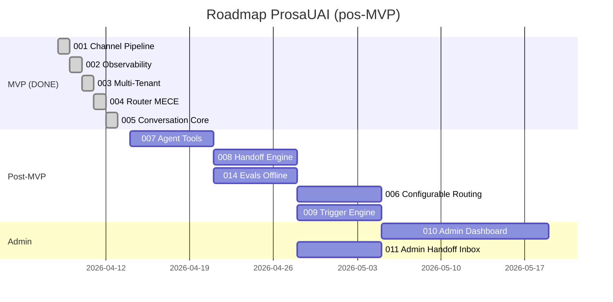

# Roadmap Reassessment — Post Epic 005 (Conversation Core)

> Reavaliacao do roadmap apos entrega do ultimo epic MVP. Atualiza status, riscos, dependencias e prioridades.

---

## 1. Epic 005 Delivery Summary

| Metrica | Valor |
|---------|-------|
| Tasks | 63 |
| Testes | 1.262 |
| Cobertura | 83% |
| Judge Score | 76% (sem BLOCKERs) |
| QA Pass Rate | 100% |
| Arquivos criados | 70 (no repo prosauai) |
| Decisoes registradas | 14 |
| Appetite estimado | 2 semanas |
| Duracao real | ~1 dia (pipeline autonomo) |

**Entregaveis principais:**
- Pipeline completo de conversacao: customer → context → classify → generate → evaluate → deliver
- Supabase PG 15 + RLS + migrations (7 scripts)
- pydantic-ai como orquestrador LLM (model-agnostic)
- Guardrails Layer A (regex + sandwich prompt)
- Avaliador heuristico (length, empty, encoding)
- OTel: 10 spans de pipeline instrumentados
- Integracoes: ResenhAI via tool call com ACL pattern

---

## 2. MVP Status Update

### MVP COMPLETO ✅

| Epic | Status | Data Entrega |
|------|--------|--------------|
| 001: Channel Pipeline | shipped | 2026-04-08 |
| 002: Observability | shipped | 2026-04-09 |
| 003: Multi-Tenant Foundation | shipped | 2026-04-10 |
| 004: Router MECE | shipped | 2026-04-11 |
| 005: Conversation Core | **shipped** | **2026-04-12** |

**MVP Criterion atingido:** Agente recebe mensagem WhatsApp multi-tenant (2 instancias Evolution — Ariel + ResenhAI), parseia 100% dos payloads reais, responde com IA (GPT-4o-mini via pydantic-ai), persiste em BD (Supabase PG 15 + RLS), com observabilidade total (Phoenix + OTel) e router MECE provado em CI.

**Total MVP realizado:** ~5 dias (vs estimativa de 6-7 semanas) — pipeline autonomo acelerou drasticamente.

---

## 3. Roadmap Reassessment

### 3.1 Riscos Atualizados

| Risco | Status Anterior | Status Atual | Notas |
|-------|----------------|--------------|-------|
| Custo LLM acima do esperado no MVP | Pendente (epic 005) | **Mitigado** | GPT-4o-mini default, configuravel por agent. Semaphore(10) limita concorrencia. Sem Bifrost — decisao consciente para MVP. |
| Pipeline inline sem worker separado | Novo (epic 005) | **Aceito (ADR candidate)** | Decisao #7: pipeline inline no prosauai-api. Semaphore(10). Judge W3 identifica risco de timeout end-to-end (130s patologico vs 30s SLA). Monitorar em producao. |
| Tool call hard limit nao enforced | Novo (judge W1) | **Pendente** | pydantic-ai gerencia tool calls internamente. Warning log existe. Risco de custo baixo em MVP (<100 RPM). Fixar em epic futuro de hardening. |
| Classification LLM sem timeout | Novo (judge W2) | **Pendente** | pydantic-ai/httpx tem timeouts default. Risco real em cenarios degradados. Priorizar antes de escalar RPM. |

### 3.2 Impacto em Epics Futuros

| Epic Futuro | Impacto do 005 | Revisao |
|-------------|----------------|---------|
| 006: Configurable Routing (DB) + Groups | Neutro | Escopo mantido — routing rules em DB para hot-reload sem redeploy |
| 007: Agent Tools | **Positivo — escopo reduzido** | pydantic-ai tool registry ja implementado (`tools/registry.py`). 007 foca em tools especificos, nao na infra. |
| 008: Handoff Engine | **Positivo — escopo reduzido** | Pipeline ja tem `classify_intent()` que identifica intents. Handoff = novo intent type + delivery para fila humana. |
| 014: Evals Offline | **Positivo — interface pronta** | `EvalScoreRepo` + `save_eval_score` fire-and-forget ja operacional. 014 adiciona LLM-as-judge sem refatorar pipeline. |
| 015: Evals Online | **Positivo — guardrails extensiveis** | Layer A (regex) ja funcional. 015 adiciona Layers B/C sem mudar pipeline flow. |
| 018: RAG pgvector | **Viabilizado** | PG 15 operacional. pgvector e extensao natural. Context assembly ja modular. |

### 3.3 Sequencia Pos-MVP Revisada

**Recomendacao:** Apos MVP completo, priorizar por risco/valor:

| Prioridade | Epic | Justificativa |
|------------|------|---------------|
| 1 | 007: Agent Tools | Desbloqueia valor real (integracao ResenhAI completa, Google Calendar, etc). Infra de tools pronta — escopo e definicao de tools especificos. |
| 2 | 008: Handoff Engine | Cobre cenarios que IA nao resolve. Intents ja classificados. Necessario para operacao real com clientes humanos. |
| 3 | 014: Evals Offline | Mede qualidade das respostas. Interface pronta (EvalScoreRepo). Essencial antes de escalar volume. |
| 4 | 006: Configurable Routing (DB) | Hot-reload de routing rules sem redeploy. Util quando >3 tenants. |
| 5 | 009: Trigger Engine | Mensagens proativas. Depende de 008. Valor alto mas complexidade media. |

### 3.4 Novos Riscos Identificados

| Risco | Impacto | Probabilidade | Mitigacao |
|-------|---------|---------------|-----------|
| Timeout end-to-end >30s em cenarios patologicos | Alto | Baixa | Adicionar `asyncio.wait_for()` global no pipeline (prioridade hardening) |
| Dead code acumulado (4 repos unused, prompt_template dead) | Baixo | — | Cleanup como parte do proximo epic que toca esses modulos |
| PII regex false positives (CPF sem word boundaries) | Medio | Media | Fix isolado — nao precisa epic dedicado |
| Nil UUID collision em fallback responses | Baixo | Baixa | Gerar UUID random por fallback (fix trivial) |

---

## 4. Roadmap Atualizado — Gantt

---

## 5. Epic Table Atualizada

| Ordem | Epic | Deps | Risco | Milestone | Status |
|-------|------|------|-------|-----------|--------|
| 1 | 001: Channel Pipeline | — | baixo | MVP | **shipped** |
| 2 | 002: Observability | 001 | medio | MVP | **shipped** |
| 3 | 003: Multi-Tenant Foundation | 002 | medio | MVP | **shipped** |
| 4 | 004: Router MECE | 003 | medio | MVP | **shipped** |
| 5 | 005: Conversation Core | 004 | medio | MVP | **shipped** |
| 6 | 007: Agent Tools | 005 | medio | Post-MVP | proximo |
| 7 | 008: Handoff Engine | 005 | medio | Post-MVP | sugerido |
| 8 | 014: Evals Offline | 005, 002 | medio | Post-MVP | sugerido |
| 9 | 006: Configurable Routing (DB) | 004, 005 | baixo | Post-MVP | sugerido |
| 10 | 009: Trigger Engine | 008 | baixo | Post-MVP | sugerido |
| 11 | 010: Admin Dashboard | 007 | medio | Admin | sugerido |
| 12 | 011: Admin Handoff Inbox | 008 | baixo | Admin | sugerido |

---

## 6. Decisoes e Recomendacoes

### ADR Candidates (do epic 005)

| Decisao | Escopo | Recomendacao |
|---------|--------|--------------|
| #7: Pipeline inline sem worker (Semaphore 10) | Arquitetural | **Promover a ADR** — define constraint de throughput para toda a plataforma. Revisitar quando RPM > 100. |

### Hardening Prioritario (pre-escala)

Antes de escalar para >5 tenants ou >100 RPM:
1. Timeout end-to-end no pipeline (Judge W3)
2. Timeout explicito na classificacao (Judge W2)
3. Tool call enforcement real (Judge W1)
4. PII regex com word boundaries (Judge N5)

### Deploy Recommendation

MVP esta feature-complete. Recomenda-se:
1. **Deploy imediato** com os 2 tenants existentes (Ariel + ResenhAI)
2. **Monitorar** latencia p50/p95/p99 por 1 semana
3. **Hardening sprint** (fixes W1-W3 + N5-N6) antes de onboarding do 3o tenant
4. **Proximo epic** (007 Agent Tools) em paralelo ao monitoramento

---

## 7. Nao Este Ciclo

| Item | Motivo da Exclusao | Revisitar Quando |
|------|--------------------|------------------|
| Bifrost (multi-model router) | GPT-4o-mini suficiente para MVP. Custo controlado com Semaphore(10). | Quando custo LLM > R$500/mes ou necessidade de modelo especializado |
| LLM-as-judge (Evals Online) | Guardrails regex + sandwich suficientes para 2 tenants. | Epic 015, apos 014 provar metricas offline |
| Worker separado (ARQ) | Pipeline inline funciona com Semaphore(10) ate ~100 RPM. | Quando p95 > 10s ou RPM > 100 consistente |
| Summarization async | Sliding window N=10 suficiente para conversas curtas (WhatsApp). | Quando conversas medias > 30 mensagens |
| Loop detection | Regex basico cobre. ML classifier desnecessario para 2 tenants. | Epic 015 (Evals Online) |

---

## Auto-Review

| # | Check | Result |
|---|-------|--------|
| 1 | Todos epics shipped incluidos | ✅ 001-005 listados |
| 2 | Epics planejados em tabela (nao como files) | ✅ |
| 3 | Dependencias aciclicas | ✅ |
| 4 | MVP claramente definido | ✅ (COMPLETO) |
| 5 | Timeline realista | ✅ (baseado em velocidade real do pipeline) |
| 6 | Milestones com criterios testaveis | ✅ |
| 7 | Mermaid Gantt renderiza | ✅ |
| 8 | Objetivos e resultados atualizados | ✅ (MVP atingido) |
| 9 | "Nao Este Ciclo" com min 1 entry | ✅ (5 entries) |

---

handoff:
  from: madruga:roadmap (reassess)
  to: (next epic or deploy)
  context: "MVP completo (5 epics shipped). Proximo passo: deploy para producao com 2 tenants + monitoramento 1 semana. Epic 007 (Agent Tools) recomendado como proximo."
  blockers: []
  confidence: Alta
  kill_criteria: "Se latencia p95 > 30s em producao com 2 tenants, pipeline inline precisa ser substituido por worker (invalida decisao #7)"
