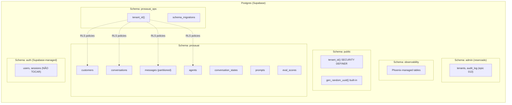
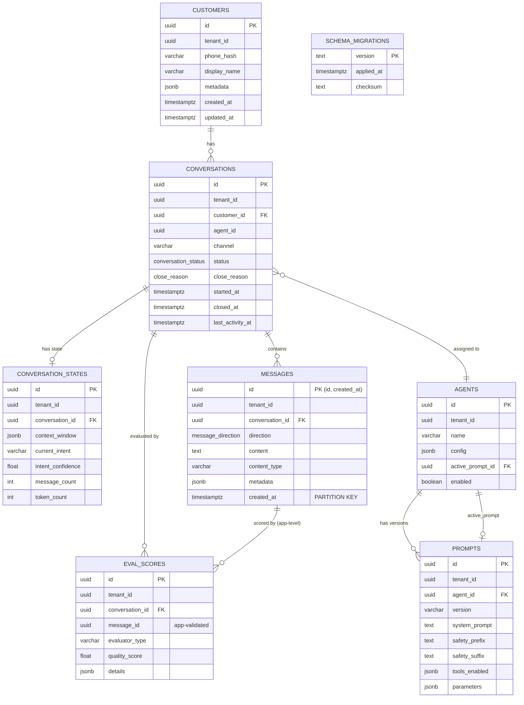
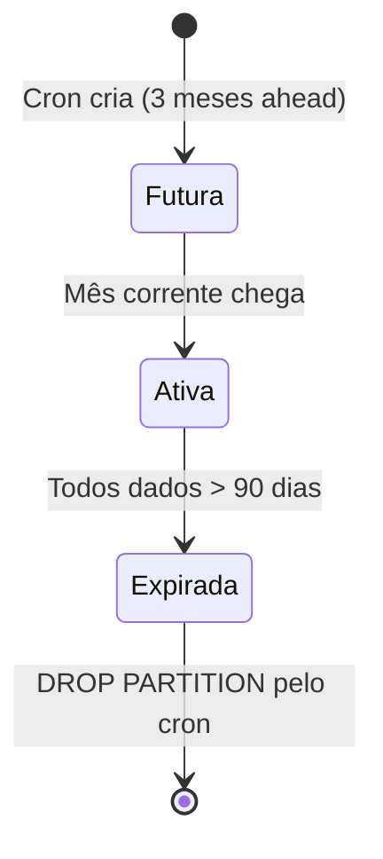
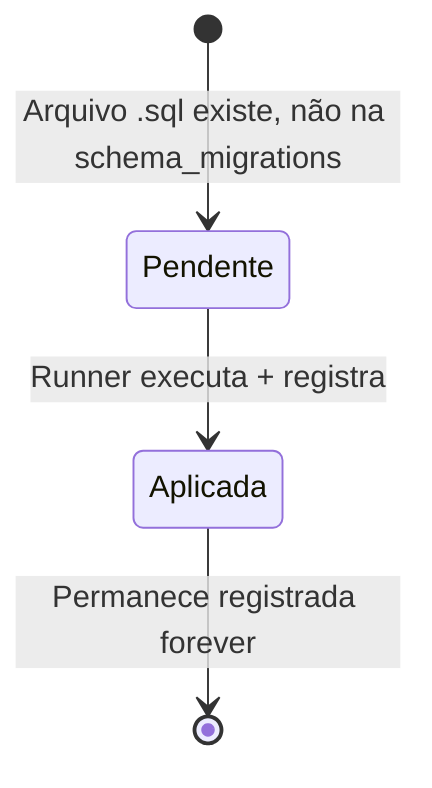

# Data Model: Production Readiness

**Epic**: 006-production-readiness
**Data**: 2026-04-12
**Status**: Completo

## Visão Geral dos Schemas

Este epic reorganiza o layout de schemas do Postgres para compatibilidade com Supabase e isolamento de namespaces.



## Entidades Novas

### prosauai_ops.schema_migrations

Tabela de tracking para o migration runner. Registra quais migrations já foram aplicadas.

| Campo | Tipo | Constraints | Descrição |
|---|---|---|---|
| version | TEXT | PRIMARY KEY | Nome do arquivo de migration (ex: `001_create_schema`) |
| applied_at | TIMESTAMPTZ | NOT NULL DEFAULT now() | Timestamp de quando a migration foi aplicada |
| checksum | TEXT | | SHA-256 do conteúdo do arquivo (detecção de drift) |

```sql
CREATE TABLE IF NOT EXISTS prosauai_ops.schema_migrations (
    version    TEXT PRIMARY KEY,
    applied_at TIMESTAMPTZ NOT NULL DEFAULT now(),
    checksum   TEXT
);
```

## Entidades Modificadas

### prosauai.messages (particionada)

A tabela `messages` é reescrita como particionada por `RANGE (created_at)` com partições mensais.

**Mudanças em relação ao epic 005:**

| Aspecto | Antes (epic 005) | Depois (epic 006) |
|---|---|---|
| Schema | `public.messages` | `prosauai.messages` |
| PK | `id UUID PRIMARY KEY` | `PRIMARY KEY (id, created_at)` — PK composta obrigatória |
| Particionamento | Nenhum | `PARTITION BY RANGE (created_at)` |
| UNIQUE em id | Implícito (era PK) | Não é possível UNIQUE(id) sozinho — PG exige partition key em unique constraints. UNIQUE(id, created_at) implícito na PK composta |
| FK inbound | `eval_scores.message_id REFERENCES messages(id)` via PK | **FK removida** — PG não suporta FK referenciando coluna non-unique em tabela particionada. Integridade garantida por UUID v4 (collision ~0) + validação na app |
| RLS function | `auth.tenant_id()` | `prosauai_ops.tenant_id()` |

**DDL Completo:**

```sql
CREATE TABLE prosauai.messages (
    id              UUID NOT NULL DEFAULT gen_random_uuid(),
    tenant_id       UUID NOT NULL,
    conversation_id UUID NOT NULL REFERENCES prosauai.conversations(id),
    direction       message_direction NOT NULL,
    content         TEXT NOT NULL,
    content_type    VARCHAR(50) NOT NULL DEFAULT 'text',
    metadata        JSONB DEFAULT '{}',
    created_at      TIMESTAMPTZ NOT NULL DEFAULT now(),

    PRIMARY KEY (id, created_at)
) PARTITION BY RANGE (created_at);

-- Nota: UNIQUE(id) sozinho NÃO é possível em PG partitioned tables.
-- A PK composta (id, created_at) garante unicidade dentro de cada partição.
-- UUID v4 garante unicidade global na prática (collision probability ~1e-37).
-- FK de eval_scores.message_id removida — validação na app layer.

-- Index para RLS filter pushdown
CREATE INDEX idx_messages_tenant ON prosauai.messages(tenant_id);

-- Index para context window queries
CREATE INDEX idx_messages_conversation ON prosauai.messages(conversation_id, created_at);
```

**Partições (criadas automaticamente pelo cron):**

```sql
-- Exemplo: partição para abril 2026
CREATE TABLE IF NOT EXISTS prosauai.messages_2026_04
    PARTITION OF prosauai.messages
    FOR VALUES FROM ('2026-04-01') TO ('2026-05-01');
```

### Todas as Tabelas — Mudança de Schema

Todas as 8 tabelas migram de `public.*` para `prosauai.*`:

| Tabela | Schema Anterior | Schema Novo | Mudanças Adicionais |
|---|---|---|---|
| customers | public | prosauai | RLS → `prosauai_ops.tenant_id()` |
| conversations | public | prosauai | RLS → `prosauai_ops.tenant_id()` |
| conversation_states | public | prosauai | RLS → `prosauai_ops.tenant_id()` |
| messages | public | prosauai | Particionamento + PK composta + RLS |
| agents | public | prosauai | RLS → `prosauai_ops.tenant_id()` |
| prompts | public | prosauai | RLS → `prosauai_ops.tenant_id()` |
| eval_scores | public | prosauai | message_id sem FK (limitação PG particionamento) — validação app-level |

### public.tenant_id() — Função RLS Helper

> **Nota:** O plano original (epic 006) colocava a função em `prosauai_ops.tenant_id()`.
> Na implementação final, foi movida para `public.tenant_id()` por compatibilidade
> com Supabase (que restringe criação de schemas customizados em managed Postgres).
> Ver ADR-024 para o racional completo.

Substitui `auth.tenant_id()`. Semântica idêntica, namespace `public` por compatibilidade Supabase.

```sql
CREATE OR REPLACE FUNCTION public.tenant_id()
RETURNS uuid
LANGUAGE sql
STABLE
SECURITY DEFINER
SET search_path = ''
AS $$
  SELECT current_setting('app.current_tenant_id', true)::uuid
$$;
```

## Relacionamentos Entre Entidades



## Regras de Validação

### Invariantes Mantidos (do epic 005)

1. **Tenant isolation**: Todas as tabelas têm `tenant_id` + RLS via `prosauai_ops.tenant_id()`
2. **Messages append-only**: Policies `messages_append_only` (deny UPDATE) e `messages_no_delete` (deny DELETE) preservadas
3. **One active conversation**: Partial unique index `(tenant_id, customer_id, channel) WHERE status='active'`
4. **Prompt versioning**: Unique constraint `(agent_id, version)` em prompts

### Invariantes Novos (epic 006)

5. **Partição obrigatória**: INSERTs em `messages` requerem partição existente para o mês do `created_at`. Partições criadas 3 meses à frente pelo cron.
6. **Migration tracking**: Toda migration aplicada é registrada em `prosauai_ops.schema_migrations`. Re-execução é no-op.
7. **Schema isolation**: Nenhum objeto custom em `auth`. `public` contem apenas `tenant_id()` SECURITY DEFINER e usa `gen_random_uuid()` built-in (sem extensions adicionais).

## Transições de Estado

### Lifecycle de Partição



### Lifecycle de Migration



## Impacto na Connection Pool

**pool.py** — Única mudança necessária:

```python
pool = await asyncpg.create_pool(
    dsn=settings.database_url,
    min_size=settings.pool_min_size,
    max_size=settings.pool_max_size,
    command_timeout=60.0,
    server_settings={'search_path': 'prosauai,prosauai_ops,public'},
)
```

Com `search_path` configurado no pool, todas as queries existentes em `repositories.py` funcionam sem modificação — `SELECT * FROM messages` resolve como `prosauai.messages` transparentemente.

---

handoff:
  from: speckit.plan (Phase 1 - data model)
  to: speckit.plan (Phase 1 - contracts)
  context: "Data model completo. Schema layout definido (prosauai + prosauai_ops). Particionamento de messages documentado. Impacto em pool.py mapeado."
  blockers: []
  confidence: Alta
