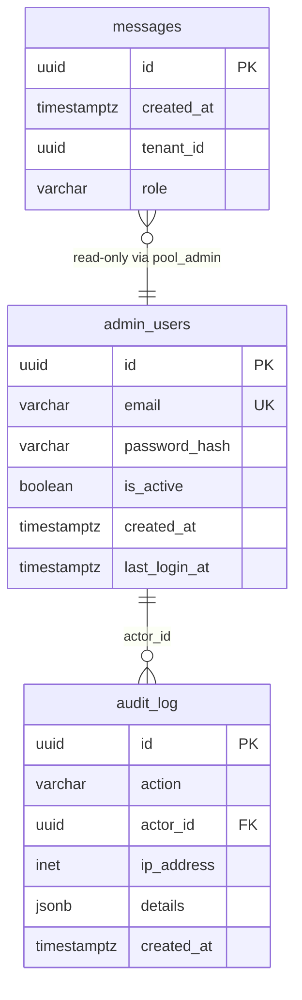
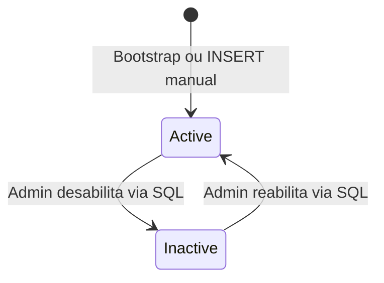

# Data Model — Epic 007: Admin Front Dashboard Inicial

**Branch**: `epic/prosauai/007-admin-front-dashboard` | **Date**: 2026-04-15

## Entidades Novas

### admin_users

Administradores do painel. Tabela em `public` (decisão #6 — ADR-024 drift aceito).

| Campo | Tipo | Constraints | Descrição |
|-------|------|-------------|-----------|
| id | UUID | PK, DEFAULT gen_random_uuid() | Identificador único |
| email | VARCHAR(255) | UNIQUE, NOT NULL | Email de login |
| password_hash | VARCHAR(255) | NOT NULL | Hash bcrypt (passlib) |
| is_active | BOOLEAN | NOT NULL, DEFAULT true | Permite desabilitar sem deletar |
| created_at | TIMESTAMPTZ | NOT NULL, DEFAULT now() | Data de criação |
| last_login_at | TIMESTAMPTZ | NULL | Último login bem-sucedido |

**Índices**:
- `idx_admin_users_email` em `email` (lookup no login)

**RLS**: Desabilitado — tabela administrativa, acessada apenas via `pool_admin` (BYPASSRLS). Sem coluna `tenant_id` (admins são cross-tenant).

**Owner**: `app_owner` (NOLOGIN). GRANTs para `service_role`: SELECT, INSERT, UPDATE.

### audit_log

Eventos de auditoria de autenticação. Tabela em `public` (decisão #6).

| Campo | Tipo | Constraints | Descrição |
|-------|------|-------------|-----------|
| id | UUID | PK, DEFAULT gen_random_uuid() | Identificador único |
| action | VARCHAR(50) | NOT NULL | Tipo do evento: `login_success`, `login_failed`, `rate_limit_hit`, `logout` |
| actor_id | UUID | NULL, FK → admin_users(id) | Admin que executou a ação (NULL para falhas) |
| ip_address | INET | NOT NULL | IP de origem da requisição |
| details | JSONB | DEFAULT '{}' | Metadados adicionais (email tentado, user_agent, etc.) |
| created_at | TIMESTAMPTZ | NOT NULL, DEFAULT now() | Timestamp do evento |

**Índices**:
- `idx_audit_log_created_at` em `created_at DESC` (consulta cronológica)
- `idx_audit_log_action` em `action` (filtro por tipo de evento)

**RLS**: Desabilitado — tabela administrativa, acessada apenas via `pool_admin`.

**Owner**: `app_owner`. GRANTs para `service_role`: SELECT, INSERT.

## Entidades Existentes Impactadas

### messages (existente — schema `public`)

Tabela principal do pipeline de mensagens. **Não é alterada** neste epic. Consumida read-only pelo dashboard admin via `pool_admin` (BYPASSRLS).

| Campo Relevante | Tipo | Uso no Dashboard |
|-----------------|------|------------------|
| id | UUID | PK |
| created_at | TIMESTAMPTZ | Agregação por dia (KPI + gráfico) |
| tenant_id | UUID | Existente para RLS, ignorado no admin (cross-tenant) |
| role | VARCHAR | Filtro: apenas `role = 'user'` para "mensagens recebidas" |

**Índice novo**:
- `idx_messages_created_at` em `created_at DESC` (decisão #15 — otimizar agregação cross-tenant por dia)

### schema_migrations (nova — dbmate)

Tabela de controle do dbmate. Criada automaticamente pelo `dbmate up`.

| Campo | Tipo | Descrição |
|-------|------|-----------|
| version | VARCHAR(128) | ID da migration (timestamp) |
| applied | BOOLEAN | Se foi aplicada |

## Roles de Banco (Expansão ADR-011)

### Roles novas/modificadas (Migration 010)

| Role | Tipo | Atributos | Propósito |
|------|------|-----------|-----------|
| app_owner | NOLOGIN | NOSUPERUSER, NOCREATEDB | Owner de todas as tabelas. Nunca conecta diretamente. |
| authenticated | LOGIN | NOSUPERUSER, NOCREATEDB | Pipeline de mensagens. RLS enforced. |
| service_role | LOGIN | NOSUPERUSER, BYPASSRLS | Admin endpoints. Acessa dados cross-tenant. |

**GRANTs via ALTER DEFAULT PRIVILEGES**:
```sql
-- authenticated: acessa tabelas de negócio com RLS
GRANT SELECT, INSERT, UPDATE, DELETE ON ALL TABLES IN SCHEMA public TO authenticated;

-- service_role: acessa tudo (admin)
GRANT SELECT, INSERT, UPDATE, DELETE ON ALL TABLES IN SCHEMA public TO service_role;

-- FORCE RLS para authenticated (mesmo sendo owner de sessão)
ALTER TABLE messages FORCE ROW LEVEL SECURITY;
ALTER TABLE conversations FORCE ROW LEVEL SECURITY;
-- ... todas as tabelas de negócio
```

## Diagrama de Relacionamento



## State Transitions

### admin_users.is_active



Sem CRUD via interface neste epic — gerenciamento de admins é manual (bootstrap env vars ou INSERT direto).

### audit_log.action (Enum de valores)

| Valor | Trigger | actor_id | details |
|-------|---------|----------|---------|
| `login_success` | POST /admin/auth/login (200) | admin UUID | `{"email": "...", "user_agent": "..."}` |
| `login_failed` | POST /admin/auth/login (401) | NULL | `{"email": "...", "reason": "invalid_credentials"}` |
| `rate_limit_hit` | POST /admin/auth/login (429) | NULL | `{"email": "...", "ip": "..."}` |
| `logout` | POST /admin/auth/logout (200) | admin UUID | `{"user_agent": "..."}` |

## Query Principal — Dashboard KPI

```sql
-- Mensagens recebidas por dia, últimos 30 dias, cross-tenant
WITH date_range AS (
    SELECT generate_series(
        (CURRENT_DATE AT TIME ZONE 'America/Sao_Paulo') - INTERVAL '29 days',
        CURRENT_DATE AT TIME ZONE 'America/Sao_Paulo',
        '1 day'::interval
    )::date AS day
)
SELECT
    dr.day,
    COALESCE(COUNT(m.id), 0) AS message_count
FROM date_range dr
LEFT JOIN messages m
    ON (m.created_at AT TIME ZONE 'America/Sao_Paulo')::date = dr.day
    AND m.role = 'user'
GROUP BY dr.day
ORDER BY dr.day ASC;
```

**Performance**: Índice `idx_messages_created_at` + range scan 30 dias. Estimativa com 365K msgs/ano (~1K/dia): <50ms.

---
handoff:
  from: data-model.md
  to: contracts
  context: "Modelo de dados definido: 2 tabelas novas (admin_users, audit_log), 1 índice novo em messages, 3 roles expandidas. Query KPI com gap-fill via generate_series."
  blockers: []
  confidence: Alta
  kill_criteria: "Se o Supabase gerenciado não permitir CREATE ROLE ou ALTER TABLE OWNER, o modelo de roles precisa ser adaptado."
