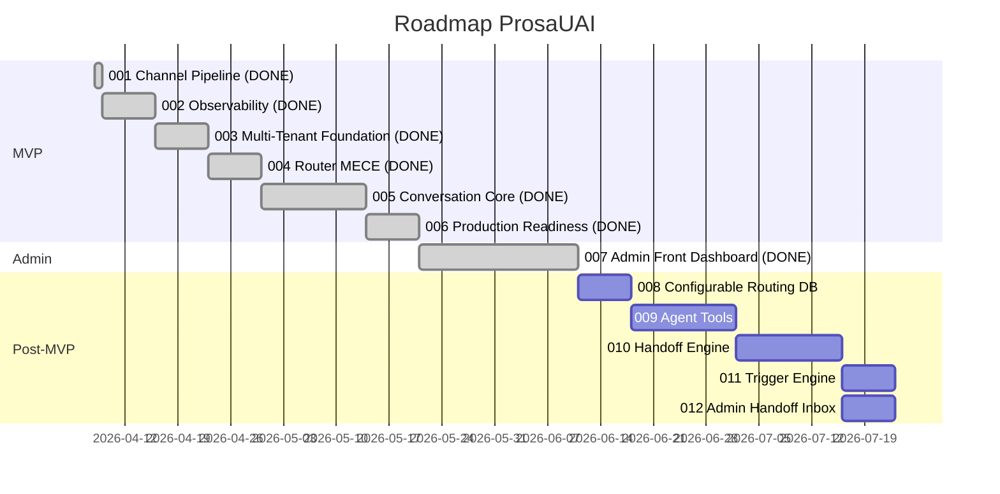
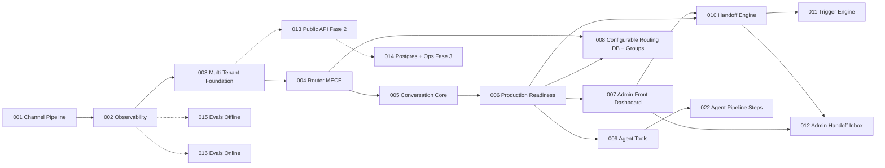

# Roadmap Reassessment — Epic 007: Admin Front — Dashboard Inicial

**Data:** 15/04/2026 | **Branch:** `epic/prosauai/007-admin-front-dashboard`
**Epic Status:** Completo (56/56 tasks, Judge 85%, QA 87%, 824 testes, 250 arquivos)

---

## 1. O Que o Epic 007 Entregou

Epic 007 entregou a fundação completa do painel administrativo do ProsaUAI:

| Entrega | Detalhes |
|---------|---------|
| **Monorepo pnpm** | Repositório reestruturado: `apps/api/` (FastAPI), `apps/admin/` (Next.js 15), `packages/types/` |
| **Autenticação admin** | JWT HS256 via FastAPI, bcrypt, cookie `admin_token`, rate limiting slowapi 5/min |
| **Dashboard de mensagens** | Gráfico de barras (mensagens/dia 30d cross-tenant) + KPI total. shadcn Chart + recharts |
| **Dual asyncpg pools** | `pool_tenant` (RLS enforced) + `pool_admin` (BYPASSRLS) com roles dedicadas |
| **dbmate migrations** | Substituiu `docker-entrypoint-initdb.d`. Tracking via `schema_migrations` |
| **Admin bootstrap** | Primeiro admin via env vars, idempotente com ON CONFLICT |
| **Health check** | `GET /health` verifica DB + Redis |
| **Audit log** | Tabela `audit_log` para eventos de autenticação |

### Decisões Relevantes (do decisions.md)

- **Decisão #1**: Epic 007 antecipado — "Configurable Routing" empurrado para 008+
- **Decisão #14**: dbmate adotado como migration tool (substituiu docker-entrypoint-initdb.d)
- **Decisão #22**: Route group `(authenticated)` no Next.js App Router para separar login de pages autenticadas

### Qualidade

| Métrica | Valor |
|---------|-------|
| Tasks | 56/56 (100%) |
| Judge Score | 85% (3 BLOCKERs fixed, 2 WARNINGs open) |
| QA Pass Rate | 87% (824 testes, 10 healed, 0 unresolved) |
| Reconcile Drift Score | 33% (6/9 docs outdated — patches propostos) |
| Decisões 1-way-door escapadas | 0 |

---

## 2. Impacto no Roadmap

### 2.1 Resequenciamento Confirmado

Epic 007 confirmou a decisão de antecipar o dashboard admin. O roadmap anterior listava:

| Antes (roadmap 2026-04-13) | Agora (pós-007) |
|---------------------------|-----------------|
| 007: Configurable Routing (DB) + Groups | 007: Admin Front — Dashboard Inicial (**shipped**) |
| 008: Agent Tools | 008: Configurable Routing (DB) + Groups (antigo 007) |
| 009: Handoff Engine | 009: Agent Tools (antigo 008) |
| 010: Trigger Engine | 010: Handoff Engine (antigo 009) |
| 011: Admin Dashboard | — (absorvido pelo 007) |
| 012: Admin Handoff Inbox | 011: Trigger Engine (antigo 010) |

**Nota:** O antigo epic 011 (Admin Dashboard) foi absorvido pelo 007. A fundação (monorepo, auth, dashboard) já existe — próximas telas admin são incrementais.

### 2.2 O Que 007 Desbloqueou

A fundação criada pelo 007 desbloqueia diretamente os seguintes epics futuros, que agora são **incrementais** em vez de greenfield:

1. **Admin CRUD de Tenants** — tela sobre a fundação monorepo + auth + layout existentes
2. **Admin Conversation Viewer** — tela nova em `/admin/conversations` usando mesma stack
3. **Admin Handoff Inbox** — tela de fila de atendimento humano
4. **Admin Agent Config** — configuração de agentes via UI

Todos esses usam a mesma infra: Next.js 15, shadcn/ui, TanStack Query, dual pool, auth JWT.

### 2.3 Follow-ups Gerados pelo 007

Do plan.md, judge-report.md e reconcile-report.md:

| # | Follow-up | Origem | Prioridade Sugerida |
|---|-----------|--------|---------------------|
| 1 | Cleanup ADR-024: mover tabelas para schemas corretos (`prosauai`, `admin`) | plan.md follow-ups | Later |
| 2 | Migrar auth para GoTrue + httpOnly cookie + refresh token | judge WARNING #4, plan.md | Later (trigger: portal de cliente) |
| 3 | Rate limit IP+email real (refactor slowapi ou middleware custom) | judge BLOCKER #2 (parcial) | Later (Tailscale mitiga) |
| 4 | Triggers `audit_log` para mutações admin (CRUD tenants etc.) | plan.md follow-ups | Quando Admin CRUD entrar |
| 5 | Rate limit tenant-level | plan.md follow-ups | Later (portal de cliente) |
| 6 | Admin CRUD via interface (hoje só bootstrap/SQL) | spec.md assumptions | Next |
| 7 | Gráfico por tenant + filtros + export CSV | pitch.md backlog curto | Next |
| 8 | Socket.io real-time para conversation viewer | plan.md follow-ups | Later |
| 9 | `lru_cache` no JWT secret impede rotação sem restart | judge NIT, QA WARN | Later |
| 10 | Cobertura unit tests módulos admin (39% → 80%+) | QA WARN | Next epic que tocar admin |

---

## 3. Roadmap Atualizado — Proposta

### MVP

**Status:** ✅ COMPLETO (epics 001-006, inalterado)

### Epic Table Atualizada

| Ordem | Epic | Deps | Risco | Milestone | Status |
|-------|------|------|-------|-----------|--------|
| 1 | 001: Channel Pipeline | — | baixo | MVP | **shipped** |
| 2 | 002: Observability (Phoenix + OTel) | 001 | medio | MVP | **shipped** |
| 3 | 003: Multi-Tenant Foundation | 002 | medio | MVP | **shipped** |
| 4 | 004: Router MECE | 003 | medio | MVP | **shipped** |
| 5 | 005: Conversation Core | 004 | medio | MVP | **shipped** |
| 6 | 006: Production Readiness | 005 | baixo | MVP | **shipped** |
| 7 | 007: Admin Front — Dashboard Inicial | 006 | medio | Admin | **shipped** (56 tasks, 824 testes, judge 85%, QA 87%) |
| 8 | 008: Configurable Routing (DB) + Groups | 004, 006 | baixo | Post-MVP | sugerido — escopo reduzido pelo 004 |
| 9 | 009: Agent Tools | 006 | medio | Post-MVP | sugerido |
| 10 | 010: Handoff Engine | 006, 007 | medio | Post-MVP | sugerido — agora depende de 007 (monorepo + auth) |
| 11 | 011: Trigger Engine | 010 | baixo | Post-MVP | sugerido |
| 12 | 012: Admin Handoff Inbox | 010, 007 | baixo | Admin | sugerido — incremental sobre 007 |

### Próximos Epics (candidatos)

| # | Título | Descrição | Complexidade | Prioridade Sugerida |
|---|--------|-----------|-------------|---------------------|
| 013 | Multi-Tenant Public API (Fase 2) | Caddy edge proxy + admin API (CRUD tenants) + rate limiting per-tenant + onboarding externo. **Trigger: primeiro cliente externo pagante.** | Grande (2 sem) | Later |
| 014 | TenantStore Postgres + Ops (Fase 3) | YAML → Postgres, circuit breaker per-tenant, billing, alertas. **Trigger: >=5 tenants reais.** | Grande (3 sem) | Later |
| 015 | Evals Offline | Score automático por conversa (faithfulness, relevance, toxicity) | Médio (1 sem) | Next |
| 016 | Evals Online | Guardrails pré/pós-LLM em tempo real | Médio (1 sem) | Next |
| 017 | Data Flywheel | Ciclo semanal de melhoria com revisão humana | Médio (1 sem) | Later |
| 018 | Multi-Tenant Self-Service | Cadastro self-service, onboarding autônomo | Grande (2 sem) | Later |
| 019 | RAG pgvector | Base de conhecimento com embeddings por tenant | Grande (2 sem) | Later |
| 020 | Billing Stripe | Cobrança automática com tiers e consumo medido | Grande (3 sem) | Later |
| 021 | WhatsApp Flows | Formulários estruturados dentro do WhatsApp | Médio (1 sem) | Later |
| 022 | Agent Pipeline Steps | Pipeline configurável por agente | Grande (2 sem) | Later |
| NEW | Admin Dashboard Avançado | Gráfico por tenant, filtros, export CSV, conversation viewer | Médio (1 sem) | Next |
| NEW | Admin CRUD Tenants | CRUD de tenants via UI admin (substituir SQL direto) | Médio (1 sem) | Next |

### Gantt Atualizado

### Dependencies Atualizadas

---

## 4. Milestones Atualizados

| Milestone | Epics | Critério de Sucesso | Estimativa |
|-----------|-------|---------------------|------------|
| **MVP** | 001–006 | ✅ **COMPLETO.** Pipeline multi-tenant com observabilidade e infra production-ready | realizado |
| **Admin v1** | 007 | ✅ **COMPLETO.** Fundação monorepo + auth + dashboard funcional | realizado |
| **Post-MVP** | 008–011 | Routing configurável, tools, handoff humano, triggers | ~6 semanas |
| **Admin v2** | 012 + Admin Dashboard Avançado + Admin CRUD Tenants | Inbox handoff + visualização por tenant + gestão tenants via UI | ~4 semanas |
| **Public API (Fase 2)** | 013 | Caddy + Admin API + onboarding externo. Trigger: primeiro cliente pagante | ~2 semanas |
| **Ops (Fase 3)** | 014 | TenantStore Postgres + circuit breaker + billing + alertas. Trigger: >=5 tenants | ~3 semanas |

---

## 5. Riscos do Roadmap — Atualizados

| Risco | Status | Impacto | Probabilidade | Mitigação |
|-------|--------|---------|---------------|-----------|
| Evolution API payload muda | **Mitigado (001)** | Baixo | Baixa | Adapter pattern + 122 testes |
| Custo LLM acima do esperado | **Parcialmente mitigado (005)** | Médio | Baixa | pydantic-ai configurável + semáforo |
| Schema collision Supabase | **Mitigado (006)** | Baixo | Baixa | Schemas dedicados prosauai + prosauai_ops |
| Disco VPS cheio | **Mitigado (006)** | Baixo | Baixa | Log rotation + Netdata monitoring |
| LGPD non-compliance | **Mitigado (006)** | Baixo | Baixa | retention-cron diário |
| **Cookie JWT não-httpOnly** | **Aceito (007)** | Médio | Baixa | [DECISAO DO USUARIO] Tailscale + CSP mitigam. Follow-up com GoTrue |
| **Cobertura testes admin abaixo de 80%** | **Novo (007)** | Médio | Média | Testes integração cobrem, mas requerem DB. Aumentar cobertura unit no próximo epic admin |
| **Rate limit IP-only (não IP+email)** | **Aceito (007)** | Baixo | Baixa | Tailscale (~3 users). Refactor quando público |
| **6 docs com drift pós-007** | **Novo (007)** | Médio | Alta | Reconcile propôs patches — aplicar no merge do epic |

---

## 6. Não Este Ciclo

| Item | Motivo da Exclusão | Revisitar Quando |
|------|--------------------|------------------|
| GoTrue / Supabase Auth | Overengineering para ~3 users internos em Tailscale. JWT HS256 funcional | Primeiro cliente externo ou portal público |
| Schema isolation ADR-024 | ADR aceita mas nunca aplicada. Tabelas ainda em `public`. Cleanup é trabalho de infraestrutura sem valor visível | >=10 tabelas ou confusão de naming |
| Admin CRUD de usuários via UI | Neste epic, bootstrap via env vars é suficiente | Quando houver >3 admins ou rotação frequente |
| Gráfico por tenant + filtros | Dashboard cross-tenant já entrega visibilidade operacional mínima | Próximo epic admin ou quando houver >5 tenants |
| Socket.io real-time | Dashboard não precisa de real-time. Refresh manual ou polling TanStack Query suficiente | Epic de conversation viewer |
| Testes e2e browser (Playwright) | QA L5/L6 skipped por falta de infraestrutura. Funcionalidade validada manualmente | Quando CI tiver browser headless configurado |

---

## 7. Recomendação de Próximo Epic

**Recomendação:** Prosseguir com **epic 008: Configurable Routing (DB) + Groups** (antigo 007).

**Justificativa:**
1. Escopo reduzido pelo epic 004 (engine declarativa já existe) — estimativa ~1 semana
2. Desbloqueia routing dinâmico sem redeploy (YAML → DB)
3. Baixo risco — extensão de infra já provada
4. Não depende de decisões externas (ao contrário de Public API que espera cliente pagante)

**Alternativa:** Se a prioridade for visibilidade operacional, considerar **Admin Dashboard Avançado** (gráfico por tenant, filtros) — aproveita toda a fundação do 007 enquanto está fresca.

---

## 8. Objetivos e Resultados

| Objetivo de Negócio | Product Outcome (leading indicator) | Baseline | Target | Epics |
|---------------------|--------------------------------------|----------|--------|-------|
| Atendimento 24/7 sem humano | Conversas resolvidas autonomamente/mês | 0 (pré-MVP) | 70% em 18 meses | 001-005 (shipped) |
| Visibilidade operacional | Tempo para verificar saúde do sistema | ~10min (psql + logs) | <30s (2 cliques) | 007 (**shipped**) |
| Multi-tenant escalável | Tenants ativos simultâneos | 2 (internos) | 50 em 6 meses | 003 (shipped), 013, 014 |
| Handoff eficiente | Tempo médio de handoff IA→humano | N/A | <30s | 010, 012 |
| Routing inteligente | % de mensagens roteadas corretamente | ~85% (MECE 4 camadas) | >95% | 004 (shipped), 008 |

---

handoff:
  from: madruga:roadmap
  to: (merge epic branch)
  context: "Roadmap reassessment completo pós-epic 007. Dashboard admin shipped (56 tasks, judge 85%, QA 87%). Antigo epic 011 (Admin Dashboard) absorvido pelo 007. Resequenciamento confirmado: Configurable Routing agora é 008. 10 follow-ups registrados. 6 docs com drift — patches do reconcile devem ser aplicados no merge. Próximo sugerido: epic 008 (Configurable Routing DB)."
  blockers: []
  confidence: Alta
  kill_criteria: "Se o deploy de produção VPS revelar que a fundação monorepo + dual pool tem overhead inaceitável (startup >30s, memory >2GB), reavaliar a arquitetura antes de prosseguir com épics admin incrementais."
