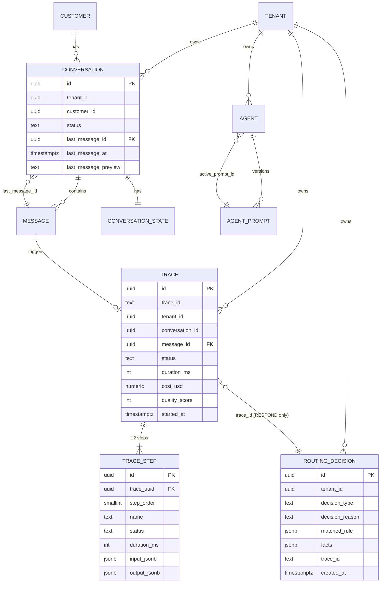

# Phase 1 — Data Model: Admin Evolution

**Feature Branch**: `epic/prosauai/008-admin-evolution`
**Date**: 2026-04-17
**Spec**: [spec.md](./spec.md) | **Research**: [research.md](./research.md)

---

## Entidades novas

### 1. `public.traces`

Representa a execução completa do pipeline de IA para uma mensagem recebida.

```sql
CREATE TABLE public.traces (
  id                UUID        PRIMARY KEY DEFAULT gen_random_uuid(),
  trace_id          TEXT        NOT NULL,                          -- hex 32 chars do OTel SDK
  tenant_id         UUID        NOT NULL,                          -- FK lógica (sem constraint para não bloquear insert em tenant deletado — retention resolve)
  conversation_id   UUID        NOT NULL,                          -- FK lógica → conversations(id)
  message_id        UUID        NOT NULL,                          -- FK lógica → messages(id)
  status            TEXT        NOT NULL CHECK (status IN ('success', 'error', 'degraded')),
  duration_ms       INTEGER     NOT NULL CHECK (duration_ms >= 0),
  tokens_in         INTEGER     NOT NULL DEFAULT 0,
  tokens_out        INTEGER     NOT NULL DEFAULT 0,
  model             TEXT,                                          -- ex: "gpt-4o-mini"
  cost_usd          NUMERIC(10, 6),                                -- NULL se modelo não mapeado
  intent            TEXT,                                          -- intent classificado (ou fallback/unknown)
  intent_confidence NUMERIC(4, 3) CHECK (intent_confidence BETWEEN 0 AND 1),
  quality_score     SMALLINT    CHECK (quality_score BETWEEN 0 AND 100),
  error_type        TEXT,                                          -- NULL se status='success'
  error_message     TEXT,
  started_at        TIMESTAMPTZ NOT NULL,
  ended_at          TIMESTAMPTZ NOT NULL,
  created_at        TIMESTAMPTZ NOT NULL DEFAULT now()
);

-- Índices
CREATE INDEX idx_traces_tenant_started ON public.traces (tenant_id, started_at DESC);
CREATE INDEX idx_traces_trace_id       ON public.traces (trace_id);
CREATE INDEX idx_traces_conversation   ON public.traces (conversation_id, started_at DESC);
CREATE INDEX idx_traces_status_started ON public.traces (status, started_at DESC) WHERE status != 'success';
CREATE INDEX idx_traces_started_brin   ON public.traces USING BRIN (started_at);

COMMENT ON TABLE public.traces IS 'Pipeline execution trace (parent of trace_steps). NO RLS — admin-only via pool_admin.';
```

**Validações**:
- `ended_at >= started_at` (enforced em aplicação).
- `duration_ms = (ended_at - started_at)` em ms (enforced em aplicação).
- `cost_usd` NULL quando `model` não mapeado em `MODEL_PRICING`.

**State transitions** (conceitual — tabela append-only): status passa de "in progress" (não persistido) → "success" | "error" | "degraded" no INSERT final.

**Relacionamentos**:
- 1:N → `trace_steps` (ON DELETE CASCADE)
- N:1 lógico → `conversations`, `messages`, `tenants` (sem FK física para evitar bloqueio em retention)

---

### 2. `public.trace_steps`

Representa uma das 12 etapas do pipeline dentro de um trace.

```sql
CREATE TABLE public.trace_steps (
  id              UUID        PRIMARY KEY DEFAULT gen_random_uuid(),
  trace_uuid      UUID        NOT NULL REFERENCES public.traces(id) ON DELETE CASCADE,
  step_order      SMALLINT    NOT NULL CHECK (step_order BETWEEN 1 AND 12),
  name            TEXT        NOT NULL,
  status          TEXT        NOT NULL CHECK (status IN ('success', 'error', 'skipped')),
  duration_ms     INTEGER     NOT NULL CHECK (duration_ms >= 0),
  started_at      TIMESTAMPTZ NOT NULL,
  ended_at        TIMESTAMPTZ NOT NULL,
  input_jsonb     JSONB,                                      -- truncado para 8KB no servidor
  input_truncated BOOLEAN     NOT NULL DEFAULT false,
  input_size      INTEGER,                                    -- tamanho original antes da truncagem
  output_jsonb    JSONB,                                      -- truncado para 8KB no servidor
  output_truncated BOOLEAN    NOT NULL DEFAULT false,
  output_size     INTEGER,
  model           TEXT,                                       -- quando step envolve LLM (generate_response, classify_intent)
  tokens_in       INTEGER,
  tokens_out      INTEGER,
  tool_calls      JSONB,                                      -- array de { name, args, result } quando tools executadas
  error_type      TEXT,
  error_message   TEXT,
  error_stack     TEXT,                                       -- opcional, pode ficar NULL em prod
  created_at      TIMESTAMPTZ NOT NULL DEFAULT now(),
  UNIQUE (trace_uuid, step_order)
);

-- Índices
CREATE INDEX idx_trace_steps_trace       ON public.trace_steps (trace_uuid, step_order);
CREATE INDEX idx_trace_steps_status_name ON public.trace_steps (status, name) WHERE status != 'success';
CREATE INDEX idx_trace_steps_started_brin ON public.trace_steps USING BRIN (started_at);

COMMENT ON TABLE public.trace_steps IS '12 pipeline steps per trace. JSONB inputs/outputs truncated to 8KB.';
```

**12 step names fixos** (ordem):
1. `webhook_received`
2. `route`
3. `customer_lookup`
4. `conversation_get`
5. `save_inbound`
6. `build_context`
7. `classify_intent`
8. `generate_response`
9. `evaluate_response`
10. `output_guard`
11. `save_outbound`
12. `deliver`

Enforcement: nome validado em código (não no DB — CHECK constraint com IN (...) seria rígido demais se pipeline evoluir; validação em `StepRecord.__post_init__`).

**Truncagem**:
- Antes do INSERT, `input_jsonb`/`output_jsonb` passam por `truncate_jsonb(value, max_bytes=8192)`.
- Se tamanho original > 8192 → `input_truncated = true`, `input_size = len(json.dumps(original))`.
- Strings internas longas são cortadas e sufixadas com `"[…truncated N bytes]"`.

---

### 3. `public.routing_decisions`

Decisão tomada pelo roteador MECE para cada mensagem recebida.

```sql
CREATE TABLE public.routing_decisions (
  id                   UUID        PRIMARY KEY DEFAULT gen_random_uuid(),
  tenant_id            UUID        NOT NULL,                        -- FK lógica
  external_message_id  TEXT,                                        -- idempotency key do webhook Evolution
  customer_phone_hash  TEXT        NOT NULL,                        -- SHA-256 do telefone E.164 (já existente no router)
  decision_type        TEXT        NOT NULL
                                   CHECK (decision_type IN (
                                     'RESPOND', 'DROP', 'LOG_ONLY', 'BYPASS_AI', 'EVENT_HOOK'
                                   )),
  decision_reason      TEXT        NOT NULL,                        -- ex: "sender_is_bot", "rule_matched:<id>"
  matched_rule         JSONB,                                       -- snapshot do RoutingRule (pode ser NULL se default)
  facts                JSONB       NOT NULL,                        -- snapshot do MessageFacts computado
  trace_id             TEXT,                                        -- hex; preenchido apenas se decision=RESPOND
  agent_target         TEXT,                                        -- slug do agente alvo quando RESPOND
  created_at           TIMESTAMPTZ NOT NULL DEFAULT now()
);

-- Índices
CREATE INDEX idx_routing_tenant_created     ON public.routing_decisions (tenant_id, created_at DESC);
CREATE INDEX idx_routing_decision_type      ON public.routing_decisions (decision_type, created_at DESC);
CREATE INDEX idx_routing_phone_hash         ON public.routing_decisions (customer_phone_hash, created_at DESC);
CREATE INDEX idx_routing_trace_id           ON public.routing_decisions (trace_id) WHERE trace_id IS NOT NULL;
CREATE INDEX idx_routing_created_brin       ON public.routing_decisions USING BRIN (created_at);

COMMENT ON TABLE public.routing_decisions IS 'All routing decisions (incl. DROPs). NO RLS — admin-only via pool_admin.';
```

**Justificativa sem RLS**: novo ADR na PR 0 documenta — admin é consumidor cross-tenant por design (ADR-011 carve-out). Apps que escrevem (pipeline/router) usam `pool_admin` também.

**Retention**: 90 dias default (configurável). `retention-cron` do epic 006 executa `DELETE FROM routing_decisions WHERE created_at < now() - '90 days'::interval`.

---

### 4. Alterações em `public.conversations` (existente)

Denormalização para listagem <100 ms.

```sql
ALTER TABLE public.conversations
  ADD COLUMN last_message_id      UUID       REFERENCES public.messages(id) ON DELETE SET NULL,
  ADD COLUMN last_message_at      TIMESTAMPTZ,
  ADD COLUMN last_message_preview TEXT;                              -- max 200 chars, stripped

CREATE INDEX idx_conversations_tenant_last_msg
  ON public.conversations (tenant_id, last_message_at DESC NULLS LAST);

COMMENT ON COLUMN public.conversations.last_message_preview IS 'Denormalized LEFT(content, 200) of last message. Updated by pipeline save_inbound/save_outbound.';
```

**Backfill** (script a rodar após migration):

```sql
UPDATE public.conversations c SET
  last_message_id      = m.id,
  last_message_at      = m.created_at,
  last_message_preview = LEFT(regexp_replace(m.content, '\s+', ' ', 'g'), 200)
FROM (
  SELECT DISTINCT ON (conversation_id)
    conversation_id, id, created_at, content
  FROM public.messages
  ORDER BY conversation_id, created_at DESC
) m
WHERE c.id = m.conversation_id;
```

Executar via script Python com progress bar (estimativa ~30 min em produção com ~50k conversas).

**Invariante**: campos podem ficar NULL para conversas sem mensagens (estado legítimo pós-criação, antes do primeiro `save_inbound`).

---

## Entidades existentes (consultadas, não alteradas)

### `public.customers`
Colunas consumidas: `id`, `tenant_id`, `display_name`, `phone_hash`, `phone_e164_masked`, `tags`, `metadata`, `created_at`.

### `public.conversations` (além dos campos novos)
Consumidas: `id`, `tenant_id`, `customer_id`, `channel`, `status`, `intent_current`, `intent_confidence`, `quality_score_avg`, `opened_at`, `sla_breach_at`.

### `public.messages`
Consumidas: `id`, `conversation_id`, `tenant_id`, `role` (inbound/ai_assistant/human_operator), `content`, `metadata` (inclui `operator_name` para bolhas humanas — FR-023), `created_at`.

### `public.conversation_states`
Consumidas: `conversation_id`, `sla_breach_at`, `handoff_started_at`.

### `public.audit_log` (epic 007)
Consumidas: `id`, `created_at`, `user_id`, `user_email`, `action`, `ip`, `user_agent`, `target_type`, `target_id`, `details` (JSONB).

### `public.tenants`
Consumidas: `id`, `slug`, `name`, `enabled`, `config` (JSONB), `created_at`.

### `public.agents`
Consumidas: `id`, `tenant_id`, `slug`, `name`, `enabled`, `model`, `temperature`, `max_tokens`, `tools` (JSONB), `active_prompt_id`, `created_at`.

### `public.agent_prompts`
Consumidas: `id`, `agent_id`, `version`, `safety_prefix`, `system_prompt`, `safety_suffix`, `created_at`, `notes`.

---

## Entidades virtuais (não persistidas)

### `ActivityEvent`
Composição de 5 SELECTs (R8 — research). Campos expostos:
- `kind`: `new_conversation` | `sla_breach` | `pipeline_error` | `fallback_intent` | `ai_resolved`
- `id`: UUID do objeto subjacente
- `tenant_id`: UUID
- `created_at`: TIMESTAMPTZ
- `ref`: UUID do objeto navegável (conversation_id ou trace_id)
- `label`: TEXT computado em aplicação (ex: "Nova conversa de João Silva")

### `TenantHealth`
Agregação em aplicação (R6 — cache 5 min). Campos:
- `tenant_id`, `tenant_slug`, `tenant_name`
- `active_conversations`: INT (count conversations WHERE status='open')
- `messages_24h`: INT (count messages WHERE created_at > now() - 24h)
- `quality_score_avg`: NUMERIC (avg traces.quality_score WHERE started_at > now() - 24h)
- `latency_p95_ms`: INT (p95 traces.duration_ms)
- `containment_rate`: NUMERIC (% conversas fechadas sem handoff)
- `fallback_rate`: NUMERIC (definição FR-050)
- `errors_24h`: INT (count traces WHERE status='error')
- `last_message_at`: TIMESTAMPTZ (max conversations.last_message_at)
- `status`: `verde` | `âmbar` | `vermelho` | `—` (regra FR-015 em `lib/health-rules.ts` espelhada por `apps/api/.../health.py`)

### `PipelineLatencyBreakdown`
Para gráfico latency waterfall (FR-053):
- `step_name`: TEXT
- `p50_ms`, `p95_ms`, `p99_ms`: INT
- `segments`: [p50, p95-p50, p99-p95] para stacked bar

---

## Cost Map (constante em código)

Tipo: `dict[str, tuple[Decimal, Decimal]]`
Local: `apps/api/prosauai/conversation/pricing.py`
Conteúdo: ver R14 (research.md).

---

## ER Diagram (conceitual)



---

## Volume & Retention matrix

| Tabela | Volume estimado/ano | Retention default | Tamanho estável |
|--------|---------------------|-------------------|-----------------|
| traces | 3.6 M rows | 30 d | ~100 MB |
| trace_steps | 43 M rows | 30 d (cascade) | ~1.2 GB |
| routing_decisions | 3.6 M rows | 90 d | ~180 MB |
| conversations (novas colunas) | 50 K rows | forever (app data) | +~20 MB |

Totais: ~1.5 GB de overhead estável. Aceitável para instância Supabase Pro (100 GB+).

---

## Campos sensíveis (LGPD)

| Tabela | Campo | Tratamento |
|--------|-------|-----------|
| trace_steps | input_jsonb | Pode conter PII do cliente. Retention 30 d + truncate 8 KB. UI mascarada quando step=`build_context` mostra telefone. |
| trace_steps | output_jsonb | Resposta do AI → conteúdo direcionado ao cliente. Mesmo tratamento. |
| routing_decisions | facts | Contém `customer_phone_hash` (SHA-256). Retention 90 d. |
| conversations | last_message_preview | Primeiros 200 chars da última mensagem. Retention = retention da conversa (não tocada por este epic). |

`retention-cron` (epic 006) estendido com 3 DELETEs novos (R11). Nenhum campo em claro de CPF/cartão/etc. — policy Pace já proíbe no input.
