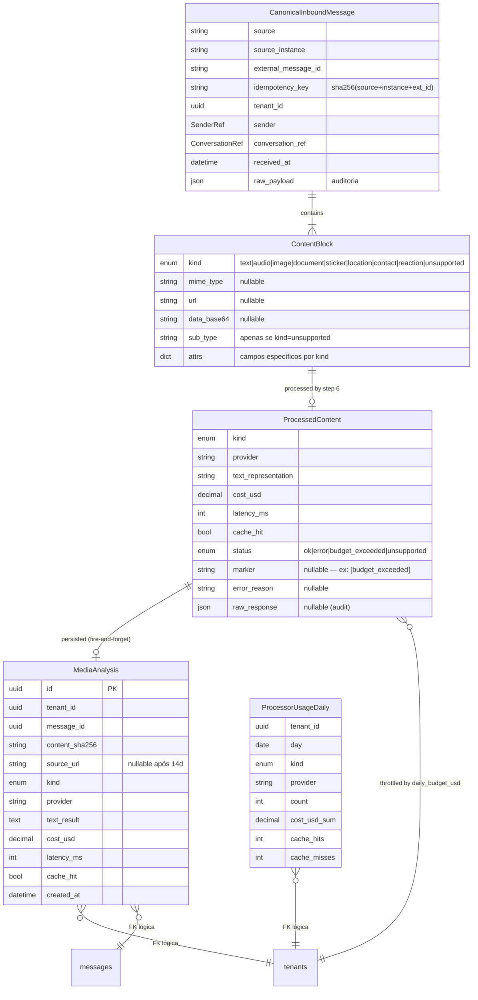

# Phase 1 — Data Model: Channel Ingestion Normalization + Content Processing

**Feature Branch**: `epic/prosauai/009-channel-ingestion-and-content-processing`
**Date**: 2026-04-19
**Spec**: [spec.md](./spec.md) | **Research**: [research.md](./research.md) | **Pitch**: [pitch.md](./pitch.md)

> Escopo do modelo: (a) schemas Pydantic in-process que substituem `InboundMessage` Evolution-specific pela tríade `CanonicalInboundMessage` → `ContentBlock` → `ProcessedContent` source-agnostic; (b) duas tabelas novas Postgres admin-only (`media_analyses`, `processor_usage_daily`); (c) estrutura de cache Redis (`proc:*`); (d) extensão do enum `StepRecord.STEP_NAMES` de 12 para 14 entries. Nenhum aggregate novo de domínio é introduzido no schema transacional (`public.conversations`, `public.messages`, `public.traces` etc. permanecem inalteradas). Os aggregates novos são admin-only e herdam o carve-out de [ADR-027](../../decisions/ADR-027-admin-tables-no-rls.md).

---

## 1. Diagrama ER (novos artefatos + relações com existentes)



---

## 2. Schemas Pydantic (in-process, `apps/api/prosauai/channels/canonical.py`)

### 2.1 `CanonicalInboundMessage`

```python
from datetime import datetime
from enum import StrEnum
from typing import Annotated, Literal
from uuid import UUID

from pydantic import BaseModel, Field, field_validator
from pydantic.types import AwareDatetime


class ContentKind(StrEnum):
    TEXT = "text"
    AUDIO = "audio"
    IMAGE = "image"
    DOCUMENT = "document"
    STICKER = "sticker"
    LOCATION = "location"
    CONTACT = "contact"
    REACTION = "reaction"
    UNSUPPORTED = "unsupported"


class SenderRef(BaseModel):
    """Identificação canônica do remetente, source-agnostic."""
    external_id: str = Field(..., min_length=1, max_length=256)
    display_name: str | None = Field(None, max_length=256)
    is_group_admin: bool = False


class ConversationRef(BaseModel):
    """Identificação da thread (conversa 1:1 ou grupo)."""
    external_id: str = Field(..., min_length=1, max_length=256)
    kind: Literal["direct", "group"]
    group_subject: str | None = Field(None, max_length=256)


class ContentBlock(BaseModel):
    """Unit of content within a message. Discriminated by `kind`."""
    kind: ContentKind
    mime_type: str | None = Field(None, max_length=128)
    url: str | None = Field(None, max_length=2048)
    data_base64: str | None = None  # skip download quando disponível
    sub_type: str | None = Field(None, max_length=64)  # usado apenas quando kind=UNSUPPORTED (video/poll/payment/call/edited/system)
    # Campos-chave por kind (attrs achatados via validator abaixo):
    caption: str | None = Field(None, max_length=4096)
    duration_seconds: int | None = Field(None, ge=0, le=3600)
    width: int | None = Field(None, ge=0)
    height: int | None = Field(None, ge=0)
    latitude: float | None = Field(None, ge=-90, le=90)
    longitude: float | None = Field(None, ge=-180, le=180)
    location_name: str | None = Field(None, max_length=512)
    contact_vcard: str | None = None
    reaction_emoji: str | None = Field(None, max_length=16)
    reaction_target_external_id: str | None = Field(None, max_length=256)
    file_name: str | None = Field(None, max_length=512)
    size_bytes: int | None = Field(None, ge=0, le=100_000_000)
    text: str | None = Field(None, max_length=65_536)  # usado quando kind=TEXT

    @field_validator("sub_type")
    @classmethod
    def _sub_type_only_for_unsupported(cls, v: str | None, info):
        if v is not None and info.data.get("kind") is not ContentKind.UNSUPPORTED:
            raise ValueError("sub_type is only allowed when kind='unsupported'")
        return v


class CanonicalInboundMessage(BaseModel):
    """Source-agnostic inbound message. Produced by `ChannelAdapter.normalize()`."""
    source: str = Field(..., min_length=1, max_length=64)  # ex: "evolution" | "meta_cloud"
    source_instance: str = Field(..., min_length=1, max_length=128)  # tenant/instance
    external_message_id: str = Field(..., min_length=1, max_length=256)
    idempotency_key: str = Field(..., min_length=64, max_length=64)  # sha256 hex
    tenant_id: UUID
    sender: SenderRef
    conversation_ref: ConversationRef
    content: Annotated[list[ContentBlock], Field(min_length=1, max_length=20)]
    received_at: AwareDatetime
    raw_payload: dict = Field(default_factory=dict)  # auditoria; nunca consumido pelo pipeline

    model_config = {"frozen": True}  # imutável (ADR-030)

    @field_validator("idempotency_key")
    @classmethod
    def _is_hex_sha256(cls, v: str) -> str:
        if len(v) != 64 or any(c not in "0123456789abcdef" for c in v):
            raise ValueError("idempotency_key must be lowercase sha256 hex (64 chars)")
        return v
```

**Invariantes**:

1. `idempotency_key == sha256(f"{source}:{source_instance}:{external_message_id}".encode()).hexdigest()` — validado no `ChannelAdapter`.
2. `content` nunca vazio (ao menos um bloco — pode ser `UNSUPPORTED` quando o canal entregou algo que não conseguimos classificar).
3. Objeto é `frozen=True` — enriquecimento subsequente (ex.: resolver tenant) cria cópia via `model_copy(update=...)`.
4. `ContentBlock.kind=UNSUPPORTED` MUST carregar `sub_type` não-nulo (validator).

### 2.2 `ProcessedContent`

```python
from decimal import Decimal
from enum import StrEnum
from pydantic import BaseModel, Field


class ProcessorStatus(StrEnum):
    OK = "ok"
    ERROR = "error"
    BUDGET_EXCEEDED = "budget_exceeded"
    UNSUPPORTED = "unsupported"


class ProcessedContent(BaseModel):
    """Resultado de `ContentProcessor.process()`. 1:1 com ContentBlock."""
    kind: ContentKind
    provider: str = Field(..., max_length=64)  # ex: "openai/whisper-1", "internal/text"
    text_representation: str = Field(..., max_length=32_768)  # sempre preenchido (mesmo em erro → marker)
    cost_usd: Decimal = Field(default=Decimal("0"), ge=Decimal("0"), max_digits=10, decimal_places=6)
    latency_ms: int = Field(default=0, ge=0)
    cache_hit: bool = False
    status: ProcessorStatus = ProcessorStatus.OK
    marker: str | None = Field(None, max_length=128)  # ex: "[budget_exceeded]" | "[provider_unavailable]"
    error_reason: str | None = Field(None, max_length=512)
    raw_response: dict | None = None  # audit — persistido em media_analyses, NUNCA em trace_steps

    model_config = {"frozen": True}
```

**Invariantes**:

- `status == OK` ⇒ `marker is None` e `error_reason is None`.
- `status != OK` ⇒ `marker is not None` (obrigatório para FR-031/FR-032).
- `cost_usd == 0` quando `cache_hit=True` ou `status in {BUDGET_EXCEEDED, UNSUPPORTED}`.
- Markers válidos (enum semântico, não `StrEnum` para preservar bracket notation): `[budget_exceeded]`, `[provider_unavailable]`, `[audio_silent]`, `[pdf_scanned]`, `[pdf_encrypted]`, `[media_too_large: {size_mb}]`, `[feature_disabled: {kind}]`, `[content_unsupported: {sub_type}]`, `[download_failed]`, `[timeout]`.

### 2.3 `ProcessorContext`

```python
from typing import Protocol, runtime_checkable

from prosauai.config import TenantConfig  # existente
from prosauai.observability.tracer import Tracer  # existente
from prosauai.processors.budget import BudgetTracker  # novo
from prosauai.processors.cache import ProcessorCache  # novo


class ProcessorProviders(BaseModel):
    """Handles injetados (AsyncOpenAI, etc). Mockável em testes."""
    stt: "STTProvider"      # openai.AsyncClient wrapper
    vision: "VisionProvider"
    document_extractor: "DocumentExtractor"
    # Novos providers adicionados aqui; processors nunca instanciam SDKs.


class ProcessorContext(BaseModel):
    tenant_id: UUID
    tenant_config: TenantConfig  # content_processing.* per tenant
    cache: ProcessorCache
    budget_tracker: BudgetTracker
    providers: ProcessorProviders
    tracer: Tracer
    correlation_id: str

    model_config = {"arbitrary_types_allowed": True, "frozen": True}
```

### 2.4 `ConversationRequest` (refactor)

```python
# ANTES (pre-epic): text: str no corpo
# DEPOIS (epic 009):

class ConversationRequest(BaseModel):
    tenant_id: UUID
    canonical_messages: Annotated[list[CanonicalInboundMessage], Field(min_length=1, max_length=50)]
    correlation_id: str
    handoff_context: dict | None = None

    # helpers derivados (mantêm compat de uso nos callers existentes):
    @property
    def sender_key(self) -> str:
        """Unique sender id = f"{source}:{source_instance}:{sender.external_id}"."""
        first = self.canonical_messages[0]
        return f"{first.source}:{first.source_instance}:{first.sender.external_id}"

    @property
    def group_id(self) -> str | None:
        first = self.canonical_messages[0]
        return first.conversation_ref.external_id if first.conversation_ref.kind == "group" else None

    @property
    def concatenated_text(self) -> str:
        """Texto final que vai ao gerador (após processors). Preenchido pela pipeline step 6."""
        return " ".join(msg.content[0].text or "" for msg in self.canonical_messages)
```

**Nota de compat**: o campo `text: str` legado é substituído — um shim `@deprecated` pode viver por 1 release em `conversation/request_compat.py` aceitando payloads antigos do debounce (apenas se houver buffers em Redis no momento do deploy). Mitigação de risco R1 de EPIC009_full_escope.md §12.

---

## 3. Schemas SQL (novos)

### 3.1 `public.media_analyses`

Persiste cada análise de mídia completa para auditoria, compliance (LGPD) e Trace Explorer deep-link. Admin-only, sem RLS, acessada via `pool_admin` (carve-out [ADR-027](../../decisions/ADR-027-admin-tables-no-rls.md)).

```sql
CREATE TABLE public.media_analyses (
  id                UUID        PRIMARY KEY DEFAULT gen_random_uuid(),
  tenant_id         UUID        NOT NULL,                                   -- FK lógica (sem constraint)
  message_id        UUID        NOT NULL,                                   -- FK lógica → messages(id)
  content_sha256    CHAR(64)    NOT NULL,                                   -- chave de cache + dedup
  source_url        TEXT        NULL,                                       -- anulado após 14d (URL WA expira naturalmente)
  kind              TEXT        NOT NULL CHECK (kind IN (
                                  'audio','image','document','sticker',
                                  'location','contact','reaction','unsupported'
                                )),
  sub_type          TEXT        NULL,                                       -- preenchido quando kind='unsupported'
  provider          TEXT        NOT NULL,                                   -- ex: "openai/whisper-1", "openai/gpt-4o-mini"
  text_result       TEXT        NOT NULL,                                   -- transcript/description sem truncamento
  marker            TEXT        NULL,                                       -- null quando status='ok'
  status            TEXT        NOT NULL DEFAULT 'ok' CHECK (status IN (
                                  'ok','error','budget_exceeded','unsupported'
                                )),
  cost_usd          NUMERIC(10,6) NOT NULL DEFAULT 0 CHECK (cost_usd >= 0),
  latency_ms        INTEGER     NOT NULL DEFAULT 0 CHECK (latency_ms >= 0),
  cache_hit         BOOLEAN     NOT NULL DEFAULT FALSE,
  prompt_version    TEXT        NULL,                                       -- versão do prompt usada (invalida cache ao bumpar)
  error_reason      TEXT        NULL,
  raw_response      JSONB       NULL,                                       -- resposta completa do provider (audit); truncada em 32KB
  created_at        TIMESTAMPTZ NOT NULL DEFAULT now()
);

-- Admin carve-out (ADR-027): sem RLS
ALTER TABLE public.media_analyses OWNER TO app_owner;
GRANT SELECT, INSERT, UPDATE, DELETE ON public.media_analyses TO service_role;
-- NOTA: ALTER TABLE ... DISABLE ROW LEVEL SECURITY não é necessário (RLS é opt-in).

-- Índices
CREATE INDEX idx_media_analyses_tenant_created ON public.media_analyses (tenant_id, created_at DESC);
CREATE INDEX idx_media_analyses_sha256         ON public.media_analyses (content_sha256);
CREATE INDEX idx_media_analyses_message        ON public.media_analyses (message_id);
CREATE INDEX idx_media_analyses_kind_provider  ON public.media_analyses (kind, provider);

-- Observação: NENHUM índice GIN sobre raw_response. Coluna é append-only para audit raramente lida.
```

**Retention cron** (existente em `apps/api/prosauai/observability/retention.py`, estendido):

```sql
-- Diário, 03:00 UTC
UPDATE public.media_analyses SET source_url = NULL, raw_response = NULL
  WHERE source_url IS NOT NULL AND created_at < now() - interval '14 days';

DELETE FROM public.media_analyses WHERE created_at < now() - interval '90 days';
```

**Volumes estimados** (tenant ativo, volume alto):
- Base: 10k mídias/mês/tenant × 2 tenants × 12 meses = 240k rows/ano.
- Retenção 90d = ~30k rows em qualquer momento no steady state.
- `text_result` médio ≈ 2 KB; `raw_response` ≈ 6 KB (até 14d); total ≈ 240 MB estáveis.

### 3.2 `public.processor_usage_daily`

Agregação diária para enforcement de `daily_budget_usd` e visualização em Admin Performance AI. Composite PK garante single-row por (tenant, dia, kind, provider).

```sql
CREATE TABLE public.processor_usage_daily (
  tenant_id      UUID        NOT NULL,
  day            DATE        NOT NULL,
  kind           TEXT        NOT NULL CHECK (kind IN (
                              'audio','image','document','sticker','location',
                              'contact','reaction','unsupported'
                            )),
  provider       TEXT        NOT NULL,
  count          INTEGER     NOT NULL DEFAULT 0 CHECK (count >= 0),
  cost_usd_sum   NUMERIC(12,6) NOT NULL DEFAULT 0 CHECK (cost_usd_sum >= 0),
  cache_hits     INTEGER     NOT NULL DEFAULT 0 CHECK (cache_hits >= 0),
  cache_misses   INTEGER     NOT NULL DEFAULT 0 CHECK (cache_misses >= 0),
  updated_at     TIMESTAMPTZ NOT NULL DEFAULT now(),
  PRIMARY KEY (tenant_id, day, kind, provider)
);

ALTER TABLE public.processor_usage_daily OWNER TO app_owner;
GRANT SELECT, INSERT, UPDATE, DELETE ON public.processor_usage_daily TO service_role;

-- Query de enforcement (budget check, single row ≤5ms)
SELECT COALESCE(SUM(cost_usd_sum), 0) AS spent_today
  FROM public.processor_usage_daily
 WHERE tenant_id = $1 AND day = current_date;

-- Upsert após cada processor run (fire-and-forget, não bloqueia resposta)
INSERT INTO public.processor_usage_daily (tenant_id, day, kind, provider, count, cost_usd_sum, cache_hits, cache_misses, updated_at)
  VALUES ($1, current_date, $2, $3, 1, $4, $5, $6, now())
  ON CONFLICT (tenant_id, day, kind, provider) DO UPDATE
    SET count        = processor_usage_daily.count + 1,
        cost_usd_sum = processor_usage_daily.cost_usd_sum + EXCLUDED.cost_usd_sum,
        cache_hits   = processor_usage_daily.cache_hits + EXCLUDED.cache_hits,
        cache_misses = processor_usage_daily.cache_misses + EXCLUDED.cache_misses,
        updated_at   = now();
```

**Volumes estimados**: 2 tenants × ~5 kinds/dia × 3 providers × 365 dias ≈ 10k rows/ano (negligível).

### 3.3 Migration plan

Uma migration única (dbmate) por tabela:

```
db/migrations/
  20260420_create_media_analyses.sql
  20260505_create_processor_usage_daily.sql
```

Sequenciamento: `20260420` vai no PR-A (requer estar em prod antes do primeiro persist). `20260505` vai no PR-B (budget enforcement é feature do PR-B). **Nenhuma alteração em tabelas existentes.**

---

## 4. Redis — estrutura de cache novo

### 4.1 Key pattern

```
proc:{kind}:v{prompt_version}:{sha256_hex}
```

Exemplos:
- `proc:audio:v1:6c9e...` — transcrição Whisper de áudio com sha256=6c9e...
- `proc:image:v2:ab42...` — descrição GPT-4o-mini (prompt v2) de imagem

### 4.2 Valor

JSON serializado do `ProcessedContent` (sem `raw_response` para economia de espaço):

```json
{
  "kind": "audio",
  "provider": "openai/whisper-1",
  "text_representation": "...",
  "cost_usd": "0.006",
  "latency_ms": 1342,
  "cache_hit": false,
  "status": "ok",
  "marker": null,
  "error_reason": null
}
```

### 4.3 TTL + eviction

- TTL: **14 dias** (alinha com expiração natural da URL WhatsApp signed).
- Eviction policy: LRU herdada do Redis existente (configuração compartilhada — já validada no epic 005).
- Tamanho típico: < 2 KB por entry. Cap teórico 10k/mês/tenant × 2 tenants × 14d TTL × 2 KB ≈ 200 MB — cabe em Redis atual.

### 4.4 Invalidação

**Bump de prompt_version** na key → cache antigo vira dead (TTL expira). Aplicável quando:
- Prompt do vision processor muda (ex.: v1 "descreva brevemente" → v2 "descreva + extraia texto").
- Modelo provider muda (whisper-1 → gpt-4o-mini-transcribe).

Sem necessidade de DELETE explícito. Custo de ~$30 extra em 14d de transição (aceitável).

### 4.5 Separação de namespaces

Prefixos Redis usados no projeto (não colidir):

| Prefixo | Propósito | Dono |
|---------|-----------|------|
| `buf:*` | Debounce buffers | Epic 001 |
| `ps:*` | Handoff / seen keys | Epic 004 |
| `idem:*` | Idempotência de webhook | Epic 003 |
| `proc:*` | **Cache de processors (novo)** | Epic 009 |

---

## 5. Extensão de aggregates existentes

### 5.1 `StepRecord.STEP_NAMES`: 12 → 14 entries

Arquivo: `apps/api/prosauai/observability/step_record.py` (existente).

**Antes**:
```python
STEP_NAMES = [
    "webhook_receive", "auth", "parse", "debounce", "save_inbound",
    "build_context", "route", "generate", "safety_check", "save_outbound",
    "send_out", "ack",
]  # len == 12
```

**Depois**:
```python
STEP_NAMES = [
    "webhook_receive", "auth", "parse", "debounce", "save_inbound",
    "content_process",        # ← NOVO step #6
    "build_context", "route", "generate", "safety_check", "save_outbound",
    "send_out", "ack",
]  # len == 14; content_process insere-se entre save_inbound (5) e build_context (6 antigo → 7 novo)
# NOTA: 14 entries porque "content_process" é split em dois no waterfall frontend
# quando há múltiplos blocks — mas a emissão OTel mantém 14 spans únicos por trace.
# [VALIDAR]: se tests do epic 005 lerem len==12 por asserts, ajustar (R1 mitigação).
```

**Invariante de validação**: `StepRecord.order` passa a aceitar `1..14` (antes `1..12`). Traces antigos continuam com `order ∈ 1..12` (sem migration de dados — SC-016 spec).

### 5.2 Pipeline — step `content_process`

Arquivo novo: `apps/api/prosauai/pipeline/steps/content_process.py`.

Pseudo-contrato (detalhado em `contracts/content-processor.md`):

```
async def run_content_process(
    req: ConversationRequest,
    ctx: PipelineContext,
) -> ConversationRequest:
    """
    Para cada CanonicalInboundMessage, para cada ContentBlock:
      - text: passthrough (TextProcessor identity)
      - audio/image/document: delega a ContentProcessor correspondente via registry
      - sticker/location/contact/reaction: text_representation determinístico
      - unsupported: marker estruturado

    Retorna: ConversationRequest com ContentBlock.text preenchido (quando processor OK)
             ou marker no text (quando fallback).
    """
```

Nenhuma mudança em `route`, `generate`, `safety_check` ou demais steps. Apenas consumidores em downstream concatenam `canonical_messages[*].content[*].text` via `ConversationRequest.concatenated_text`.

---

## 6. Relação com aggregates existentes

| Aggregate existente | Uso no epic 009 | Mudança de schema? |
|---------------------|-----------------|--------------------|
| `public.conversations` | Nenhum toque direto. `conversation_ref.external_id` mapeia para row via lookup existente no step `save_inbound`. | **Não** |
| `public.messages` | `media_analyses.message_id` é FK lógica (sem constraint p/ não bloquear retention). | **Não** |
| `public.traces` | Trace row é emitida pelo pipeline; `content_process` aparece como `trace_step` (via `public.trace_steps`). | **Não** (epic 008 já acomoda) |
| `public.trace_steps` | Ganha 2 entries novos (`content_process` na emissão OTel). `input_jsonb` inclui `{kind, url_hash, size_bytes}`; `output_jsonb` inclui `{text_representation, marker, cache_hit, provider, cost_usd, latency_ms}` (truncado em 8KB como definido pelo 008). | **Não** |
| `public.routing_decisions` | `facts.py::_derive_content_kind` passa a casar em `canonical.content[0].kind` — lógica idêntica, campo diferente. | **Não** |
| `core.InboundMessage` (legacy) | **Removido** ao fim do PR-A. Substituído por `CanonicalInboundMessage`. | **Sim (código)**, não DB |
| `core.formatter.parse_evolution_message` | **Refatorado** como `EvolutionAdapter.normalize()` em `channels/inbound/evolution/adapter.py`. | — |
| `debounce buffer` | Payload Redis serializado muda de `text: str` para `canonical_message: dict` (via `.model_dump_json()`). Deserialização via `CanonicalInboundMessage.model_validate_json`. | Schema Redis (chaveado por sender). Buffers em voo no momento do deploy devem drenar em 3–6s (janela debounce). |

---

## 7. Validações & erros

### 7.1 Inbound validation (ChannelAdapter.normalize)

Falhas de validação no adapter retornam **HTTP 400** com body `{"error": "invalid_payload", "field": "..."}`. Adapter NUNCA tenta reparar payload — prefere rejeitar para forçar upstream fix.

### 7.2 Idempotency key mismatch

Se canonical.idempotency_key não bater com `sha256(source+instance+ext_id)` → `ValueError` → HTTP 500 no adapter. Indica bug no adapter (não no canal).

### 7.3 Processor timeouts

Cada processor tem budget de tempo (audio=15s, image=12s, document=15s) configurado no `ProcessorContext`. Timeout → `ProcessedContent(status=ERROR, marker="[timeout]")` → continua pipeline com fallback.

### 7.4 LGPD — raw bytes

Bytes raw (áudio, imagem, PDF) **NUNCA** são persistidos. Ficam em memória durante o processamento e descartados. `MediaAnalysis.source_url` apenas (URL WhatsApp, expira naturalmente em 14d).

---

## 8. Seeds de teste

`tests/fixtures/canonical/` (novo diretório):

- `evolution_audio_ptt.canonical.json` — exemplo de CanonicalInboundMessage produzido por EvolutionAdapter a partir de `evolution_audio_ptt.input.json`.
- `evolution_image_with_caption.canonical.json`
- `evolution_document_pdf.canonical.json`
- `meta_cloud_text.canonical.json`
- `meta_cloud_audio.canonical.json`
- `meta_cloud_image.canonical.json`
- `meta_cloud_interactive.canonical.json`

Cada fixture é validada pelo schema Pydantic no teste (`CanonicalInboundMessage.model_validate_json(fixture)`). Garante contrato estável cross-PR.

---

## 9. Decisões de modelagem rejeitadas

### 9.1 Tabela `processor_runs` com 1 row por execução
**Rejeitado**. `media_analyses` já cobre: 1 linha por análise de mídia com todos os dados. Uma tabela adicional duplicaria information sem ganho — aggregation diária vive em `processor_usage_daily`.

### 9.2 Discriminated Union Pydantic por `kind`
Considerado (class `AudioContent`, `ImageContent` etc). **Rejeitado** para v1: aumenta complexidade de serialização (discriminator tag) e reduz flexibilidade — v1 usa `attrs` achatados em ContentBlock com validators condicionais. Migração para `discriminated union` é aditiva depois.

### 9.3 Persistir raw bytes no S3
**Rejeitado**. LGPD §FR-027 — bytes ficam em memória. Se precisarmos de replay para debug no futuro, armazenamos URL+sha256 e confiamos que o provider (WhatsApp) ainda serve; após 14d, debug é inviável (custo aceito).

### 9.4 Cache com compressão gzip
**Rejeitado**. Payload < 2KB após remover `raw_response`. Compressão overhead > ganho.

### 9.5 `text_representation` fica só em `trace_steps.output_jsonb`
**Rejeitado**. Trace_steps truncam em 8KB (epic 008) — transcript de 1min de áudio pode passar. `media_analyses.text_result` é `TEXT` (até 1GB Postgres). Deep-link no admin: trace mostra preview de 500 chars, clique abre `media_analyses` completo.

---

## 10. Resumo de mudanças por PR

| PR | Pydantic in-process | Postgres migration | Redis namespace |
|----|---------------------|--------------------|-----------------|
| PR-A | `canonical.py` (novo), `ConversationRequest` refactor, `StepRecord.STEP_NAMES` 12→14 | `20260420_create_media_analyses.sql` | — (debounce payload muda shape) |
| PR-B | `processors/*.py`, `ProcessedContent`, `ProcessorContext` | `20260505_create_processor_usage_daily.sql` | `proc:*` — novo prefixo |
| PR-C | `channels/inbound/meta_cloud/adapter.py` (consome `canonical.py` existente) | Nenhuma | Nenhuma |

Nenhuma coluna é dropada, nenhuma tabela existente é alterada. Estratégia de compat: `InboundMessage` (legacy) coexiste com `CanonicalInboundMessage` durante PR-A1 → PR-A3 (phased migration documentada em research.md §4.4).
