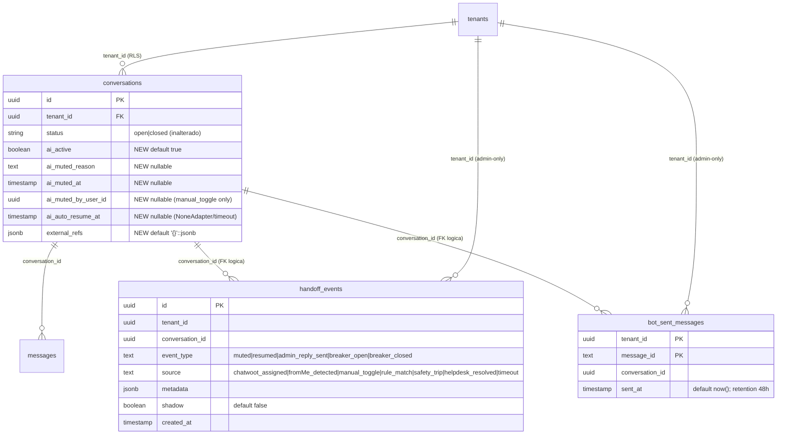

# Phase 1 — Data Model: Handoff Engine + Multi-Helpdesk Integration

**Feature Branch**: `epic/prosauai/010-handoff-engine-inbox`
**Date**: 2026-04-23
**Spec**: [spec.md](./spec.md) | **Research**: [research.md](./research.md) | **Pitch**: [pitch.md](./pitch.md)

> Escopo do modelo: (a) 6 colunas novas em `public.conversations` (tenant-scoped, RLS existente [ADR-011](../../decisions/ADR-011-pool-rls-multi-tenant.md)); (b) 2 tabelas novas admin-only em `public.*` (`handoff_events`, `bot_sent_messages`) sob carve-out [ADR-027](../../decisions/ADR-027-admin-tables-no-rls.md); (c) schemas Pydantic in-process para transicoes de estado e eventos; (d) Redis key pattern (`handoff:wh:*` TTL 24h); (e) schema `tenants.yaml` extends (blocos `helpdesk` + `handoff`). Nenhum aggregate novo de dominio transacional — `conversations`, `messages`, `traces`, `trace_steps` permanecem inalterados.

---

## 1. Diagrama ER (novos artefatos + relacoes com existentes)



---

## 2. Migrations SQL (3 arquivos aditivos, PR-A)

### 2.1 `20260501000001_create_handoff_fields.sql` (conversations extends)

```sql
-- MIGRATION: Add handoff state columns to conversations.
-- PR-A epic 010. Aditivo. Defaults preservam comportamento existente.

BEGIN;

ALTER TABLE public.conversations
    ADD COLUMN ai_active BOOLEAN NOT NULL DEFAULT TRUE,
    ADD COLUMN ai_muted_reason TEXT NULL,
    ADD COLUMN ai_muted_at TIMESTAMPTZ NULL,
    ADD COLUMN ai_muted_by_user_id UUID NULL,
    ADD COLUMN ai_auto_resume_at TIMESTAMPTZ NULL,
    ADD COLUMN external_refs JSONB NOT NULL DEFAULT '{}'::jsonb;

-- Invariant checks (application-enforced; constraints aqui sao safety net)
ALTER TABLE public.conversations
    ADD CONSTRAINT chk_ai_muted_reason_valid CHECK (
        ai_muted_reason IS NULL
        OR ai_muted_reason IN (
            'chatwoot_assigned',
            'fromMe_detected',
            'manual_toggle',
            'rule_match',
            'safety_trip'
        )
    ),
    ADD CONSTRAINT chk_ai_muted_consistency CHECK (
        (ai_active = TRUE AND ai_muted_reason IS NULL AND ai_muted_at IS NULL AND ai_muted_by_user_id IS NULL AND ai_auto_resume_at IS NULL)
        OR (ai_active = FALSE AND ai_muted_reason IS NOT NULL AND ai_muted_at IS NOT NULL)
    );

-- Indices parciais: queries hot path filtram por ai_active=false
CREATE INDEX idx_conversations_ai_muted
    ON public.conversations (tenant_id, ai_muted_at DESC)
    WHERE ai_active = FALSE;

CREATE INDEX idx_conversations_ai_auto_resume
    ON public.conversations (ai_auto_resume_at)
    WHERE ai_auto_resume_at IS NOT NULL;

-- GIN index em external_refs so se virar hotspot (deferido)
-- CREATE INDEX idx_conversations_external_refs ON public.conversations USING GIN (external_refs);

COMMIT;
```

### 2.2 `20260501000002_create_handoff_events.sql` (append-only, admin-only)

```sql
-- MIGRATION: Create handoff_events append-only table.
-- PR-A epic 010. Admin-only via pool_admin (carve-out ADR-027).

BEGIN;

CREATE TABLE public.handoff_events (
    id UUID PRIMARY KEY DEFAULT gen_random_uuid(),
    tenant_id UUID NOT NULL,
    conversation_id UUID NOT NULL,
    event_type TEXT NOT NULL CHECK (event_type IN (
        'muted',
        'resumed',
        'admin_reply_sent',
        'breaker_open',
        'breaker_closed'
    )),
    source TEXT NOT NULL CHECK (source IN (
        'chatwoot_assigned',
        'fromMe_detected',
        'manual_toggle',
        'rule_match',
        'safety_trip',
        'helpdesk_resolved',
        'timeout'
    )),
    metadata JSONB NOT NULL DEFAULT '{}'::jsonb,
    shadow BOOLEAN NOT NULL DEFAULT FALSE,
    created_at TIMESTAMPTZ NOT NULL DEFAULT NOW()
);

CREATE INDEX idx_handoff_events_tenant_created
    ON public.handoff_events (tenant_id, created_at DESC);

CREATE INDEX idx_handoff_events_conversation_created
    ON public.handoff_events (conversation_id, created_at DESC);

-- Cleanup retention 90d gerenciado por handoff_events_cleanup_cron (nao trigger).
-- RLS NAO aplicado: admin-only carve-out ADR-027. Acessado via pool_admin BYPASSRLS.

COMMIT;
```

### 2.3 `20260501000003_create_bot_sent_messages.sql` (tracking, admin-only)

```sql
-- MIGRATION: Create bot_sent_messages tracking table for NoneAdapter fromMe detection.
-- PR-A epic 010. Admin-only via pool_admin (carve-out ADR-027). Retention 48h via cron.

BEGIN;

CREATE TABLE public.bot_sent_messages (
    tenant_id UUID NOT NULL,
    message_id TEXT NOT NULL,
    conversation_id UUID NOT NULL,
    sent_at TIMESTAMPTZ NOT NULL DEFAULT NOW(),
    PRIMARY KEY (tenant_id, message_id)
);

CREATE INDEX idx_bot_sent_messages_sent_at
    ON public.bot_sent_messages (sent_at);

CREATE INDEX idx_bot_sent_messages_conversation
    ON public.bot_sent_messages (tenant_id, conversation_id, sent_at DESC);

-- Cleanup retention 48h gerenciado por bot_sent_messages_cleanup_cron.
-- RLS NAO aplicado: admin-only carve-out ADR-027. Acessado via pool_admin BYPASSRLS.

COMMIT;
```

---

## 3. Schemas Pydantic (in-process)

### 3.1 `apps/api/prosauai/handoff/state.py` (transicoes)

```python
from datetime import datetime
from enum import StrEnum
from typing import Any
from uuid import UUID

from pydantic import BaseModel, Field, model_validator
from pydantic.types import AwareDatetime


class MuteReason(StrEnum):
    """5 origens validas de mute (FR-007, decisao 5 pitch)."""
    CHATWOOT_ASSIGNED = "chatwoot_assigned"
    FROM_ME_DETECTED = "fromMe_detected"
    MANUAL_TOGGLE = "manual_toggle"
    RULE_MATCH = "rule_match"
    SAFETY_TRIP = "safety_trip"


class ResumeSource(StrEnum):
    """3 gatilhos validos de return-to-bot (FR-013)."""
    HELPDESK_RESOLVED = "helpdesk_resolved"
    MANUAL_TOGGLE = "manual_toggle"
    TIMEOUT = "timeout"


class HandoffState(BaseModel):
    """Estado consolidado de handoff de uma conversation, read-only snapshot."""
    conversation_id: UUID
    tenant_id: UUID
    ai_active: bool
    ai_muted_reason: MuteReason | None = None
    ai_muted_at: AwareDatetime | None = None
    ai_muted_by_user_id: UUID | None = None
    ai_auto_resume_at: AwareDatetime | None = None
    external_refs: dict[str, Any] = Field(default_factory=dict)

    @model_validator(mode="after")
    def _validate_consistency(self):
        """Invariantes §3.1 research: ai_active ↔ ai_muted_* consistency."""
        if self.ai_active:
            if any(x is not None for x in (
                self.ai_muted_reason, self.ai_muted_at,
                self.ai_muted_by_user_id, self.ai_auto_resume_at,
            )):
                raise ValueError("ai_active=True but mute fields not null")
        else:
            if self.ai_muted_reason is None or self.ai_muted_at is None:
                raise ValueError("ai_active=False but reason/at null")
            if (
                self.ai_muted_by_user_id is not None
                and self.ai_muted_reason is not MuteReason.MANUAL_TOGGLE
            ):
                raise ValueError("ai_muted_by_user_id non-null requires reason=manual_toggle")
        return self


class MuteRequest(BaseModel):
    """Input para state.mute_conversation() public API."""
    conversation_id: UUID
    tenant_id: UUID
    reason: MuteReason
    source: str  # MuteReason | ResumeSource aliased (eventSource). Valida no state.py.
    auto_resume_at: AwareDatetime | None = None
    triggered_by_user_id: UUID | None = None
    metadata: dict[str, Any] = Field(default_factory=dict)

    @model_validator(mode="after")
    def _validate_user_id_only_for_manual(self):
        if self.triggered_by_user_id is not None and self.reason is not MuteReason.MANUAL_TOGGLE:
            raise ValueError("triggered_by_user_id only valid with reason=manual_toggle")
        return self


class ResumeRequest(BaseModel):
    """Input para state.resume_conversation() public API."""
    conversation_id: UUID
    tenant_id: UUID
    source: ResumeSource
    triggered_by_user_id: UUID | None = None
    metadata: dict[str, Any] = Field(default_factory=dict)
```

### 3.2 `apps/api/prosauai/handoff/events.py`

```python
from datetime import datetime
from enum import StrEnum
from typing import Any
from uuid import UUID, uuid4

from pydantic import BaseModel, Field
from pydantic.types import AwareDatetime


class HandoffEventType(StrEnum):
    MUTED = "muted"
    RESUMED = "resumed"
    ADMIN_REPLY_SENT = "admin_reply_sent"
    BREAKER_OPEN = "breaker_open"
    BREAKER_CLOSED = "breaker_closed"


class HandoffEventRecord(BaseModel):
    """Evento append-only em public.handoff_events (admin-only carve-out)."""
    id: UUID = Field(default_factory=uuid4)
    tenant_id: UUID
    conversation_id: UUID
    event_type: HandoffEventType
    source: str  # valido conforme FR-007 / FR-013 / breaker
    metadata: dict[str, Any] = Field(default_factory=dict)
    shadow: bool = False
    created_at: AwareDatetime | None = None  # preenchido pelo DB DEFAULT NOW()


async def persist_event(pool, event: HandoffEventRecord) -> None:
    """Fire-and-forget insert (ADR-028). Falha NUNCA bloqueia caller."""
    try:
        async with pool.acquire() as conn:
            await conn.execute(
                """
                INSERT INTO public.handoff_events
                    (id, tenant_id, conversation_id, event_type, source, metadata, shadow)
                VALUES ($1, $2, $3, $4, $5, $6::jsonb, $7)
                """,
                event.id, event.tenant_id, event.conversation_id,
                event.event_type.value, event.source, event.metadata, event.shadow,
            )
    except Exception as exc:  # noqa: BLE001 — fire-and-forget
        logger.exception("handoff_event_persist_failed", event_id=str(event.id), exc_info=exc)
```

### 3.3 `apps/api/prosauai/handoff/bot_sent.py`

```python
from uuid import UUID
from pydantic import BaseModel, Field


class BotSentMessageRecord(BaseModel):
    tenant_id: UUID
    message_id: str = Field(..., min_length=1, max_length=256)
    conversation_id: UUID
    # sent_at preenchido pelo DB DEFAULT NOW()


async def track_bot_send(pool, record: BotSentMessageRecord) -> None:
    """Fire-and-forget INSERT. ON CONFLICT DO NOTHING por idempotencia (retries do bot)."""
    try:
        async with pool.acquire() as conn:
            await conn.execute(
                """
                INSERT INTO public.bot_sent_messages (tenant_id, message_id, conversation_id)
                VALUES ($1, $2, $3)
                ON CONFLICT (tenant_id, message_id) DO NOTHING
                """,
                record.tenant_id, record.message_id, record.conversation_id,
            )
    except Exception as exc:  # noqa: BLE001
        logger.exception("bot_sent_track_failed", message_id=record.message_id, exc_info=exc)


async def lookup_bot_echo(pool, tenant_id: UUID, message_id: str, tolerance_seconds: int = 10) -> bool:
    """Retorna True se o message_id foi enviado pelo bot nas ultimas 48h
    (com tolerance_seconds de janela para echos pos-send)."""
    async with pool.acquire() as conn:
        row = await conn.fetchrow(
            """
            SELECT 1 FROM public.bot_sent_messages
            WHERE tenant_id = $1 AND message_id = $2 AND sent_at > now() - interval '48 hours'
            LIMIT 1
            """,
            tenant_id, message_id,
        )
    return row is not None
```

### 3.4 `apps/api/prosauai/handoff/external_refs.py`

```python
"""
Shape opaco de conversations.external_refs JSONB.
Key per-helpdesk. Adicao de novo helpdesk = nova key, sem migration.

Exemplos:
  {}                                                       # inicial
  {"chatwoot": {"conversation_id": 123, "inbox_id": 4}}    # apos linkage
  {"chatwoot": {...}, "blip": {...}}                       # futuro (epic 010.1)
"""
from typing import Any
from uuid import UUID

from pydantic import BaseModel, Field


class ChatwootRef(BaseModel):
    conversation_id: int = Field(..., ge=1)
    inbox_id: int = Field(..., ge=1)


def upsert_chatwoot_ref(current: dict[str, Any], ref: ChatwootRef) -> dict[str, Any]:
    """Pure function — retorna novo dict. Caller faz UPDATE SQL."""
    return {**current, "chatwoot": ref.model_dump()}
```

---

## 4. Transicoes de estado (state.py pseudo-algoritmo)

### 4.1 `mute_conversation`

```
async def mute_conversation(pool, req: MuteRequest) -> HandoffState:
    async with pool.acquire() as conn:
        async with conn.transaction():
            # 1. Advisory lock per-conversation (serializa webhook + fromMe + manual + cron)
            await conn.execute(
                "SELECT pg_advisory_xact_lock(hashtext($1::text))",
                str(req.conversation_id),
            )
            
            # 2. Read current state
            current = await conn.fetchrow(
                "SELECT ai_active, ai_muted_reason FROM conversations WHERE id=$1 FOR UPDATE",
                req.conversation_id,
            )
            if current is None:
                raise ConversationNotFound(req.conversation_id)
            
            # 3. Resolve tenant.handoff.mode (shadow vs real)
            tenant_cfg = await load_tenant_handoff_config(req.tenant_id)
            if tenant_cfg.mode == "off":
                return HandoffState.from_row(current, req)  # no-op
            
            # 4. If shadow: persist event with shadow=True, do NOT update conversations
            if tenant_cfg.mode == "shadow":
                event = HandoffEventRecord(
                    tenant_id=req.tenant_id,
                    conversation_id=req.conversation_id,
                    event_type=HandoffEventType.MUTED,
                    source=req.reason.value,
                    metadata={**req.metadata, "real_ai_active_would_be": False},
                    shadow=True,
                )
                await persist_event(pool, event)  # fire-and-forget fora transacao
                return HandoffState.from_row(current, req)
            
            # 5. mode == "on": update conversation + emit event
            if current["ai_active"] is False:
                # Already muted — idempotent no-op (nao reemite evento)
                return HandoffState.from_row(current, req)
            
            await conn.execute(
                """
                UPDATE conversations
                SET ai_active = FALSE,
                    ai_muted_reason = $2,
                    ai_muted_at = now(),
                    ai_muted_by_user_id = $3,
                    ai_auto_resume_at = $4
                WHERE id = $1
                """,
                req.conversation_id,
                req.reason.value,
                req.triggered_by_user_id,
                req.auto_resume_at,
            )
            
            # Advisory lock auto-released on COMMIT
    
    # 6. Post-commit: persist event + fire side effects (ADR-028 fire-and-forget)
    event = HandoffEventRecord(
        tenant_id=req.tenant_id,
        conversation_id=req.conversation_id,
        event_type=HandoffEventType.MUTED,
        source=req.source,  # reason ou helpdesk_event alias
        metadata=req.metadata,
    )
    await persist_event(pool, event)
    
    return HandoffState(
        conversation_id=req.conversation_id,
        tenant_id=req.tenant_id,
        ai_active=False,
        ai_muted_reason=req.reason,
        ai_muted_at=datetime.now(UTC),
        ai_muted_by_user_id=req.triggered_by_user_id,
        ai_auto_resume_at=req.auto_resume_at,
    )
```

### 4.2 `resume_conversation`

Espelho simetrico — limpa todos os campos `ai_muted_*` + `ai_auto_resume_at`, emite evento `resumed` com `source` (helpdesk_resolved | manual_toggle | timeout).

### 4.3 Safety net no pipeline step `generate`

```python
# apps/api/prosauai/conversation/pipeline/steps/generate.py
async def execute(ctx: StepContext) -> StepResult:
    async with ctx.pool.acquire() as conn:
        row = await conn.fetchrow(
            "SELECT ai_active, ai_muted_reason FROM conversations WHERE id=$1 FOR UPDATE",
            ctx.conversation_id,
        )
    if not row["ai_active"]:
        ctx.trace.emit_step(
            name="ai_muted_skip",
            input={"conversation_id": str(ctx.conversation_id)},
            output={"ai_muted_reason": row["ai_muted_reason"]},
            status="skipped",
        )
        return StepResult(should_deliver=False, reason="handoff_active")
    
    # Proceed with normal LLM call
    ...
```

---

## 5. Redis namespaces

| Prefix | TTL | Owner | Proposito |
|--------|-----|-------|-----------|
| `handoff:wh:{chatwoot_event_id}` | 24h | PR-B webhook handler | Idempotency SETNX — dedup de retries Chatwoot |
| `handoff:{tenant}:{sender_key}` (legacy) | — | epic 004 placeholder | **Deprecated PR-A** (log `handoff_redis_legacy_read`), **removed PR-B** apos 7d zero leituras |
| `breaker:helpdesk:{tenant}:{helpdesk}` | 60s (sliding) | PR-B circuit breaker | Counter de falhas + estado open/half-open/closed |

**Colisoes verificadas**: nenhuma com `buf:*` (epic 001), `proc:*` (epic 009), `idem:*` (epic 003), `ps:*` (epic 004 outras).

---

## 6. Schema extends `tenants.yaml`

### 6.1 Schema formal (validado pelo config_poller)

```yaml
# Pydantic shape em apps/api/prosauai/tenants/config.py (EXTEND)
class HelpdeskConfig(BaseModel):
    type: Literal["chatwoot", "none"]  # v1; "blip"|"zendesk" futuro
    # chatwoot-specific:
    base_url: HttpUrl | None = None          # obrigatorio se type=chatwoot
    account_id: int | None = None            # obrigatorio se type=chatwoot
    inbox_id: int | None = None              # obrigatorio se type=chatwoot
    api_token: SecretStr | None = None       # via infisical ref
    webhook_secret: SecretStr | None = None  # via infisical ref

    @model_validator(mode="after")
    def _chatwoot_required_fields(self):
        if self.type == "chatwoot":
            missing = [
                f for f in ("base_url", "account_id", "inbox_id", "api_token", "webhook_secret")
                if getattr(self, f) is None
            ]
            if missing:
                raise ValueError(f"helpdesk.type=chatwoot requires: {missing}")
        return self


class HandoffConfig(BaseModel):
    mode: Literal["off", "shadow", "on"] = "off"
    auto_resume_after_hours: int | None = Field(default=24, ge=1, le=168)
    human_pause_minutes: int = Field(default=30, ge=1, le=1440)
    rules: list[str] = Field(default_factory=list)  # nomes de regras router epic 004


class TenantConfig(BaseModel):
    # ... campos existentes
    helpdesk: HelpdeskConfig | None = None
    handoff: HandoffConfig = Field(default_factory=HandoffConfig)
```

### 6.2 Exemplos reais

```yaml
# config/tenants.yaml — PR-B entrega este schema
tenants:
  ariel:
    id: "00000000-0000-0000-0000-000000000001"
    helpdesk:
      type: chatwoot
      base_url: https://chatwoot.pace.ai
      account_id: 1
      inbox_id: 3
      api_token: !infisical chatwoot/ariel/api_token
      webhook_secret: !infisical chatwoot/ariel/webhook_secret
    handoff:
      mode: off          # inicial; Pace muda para shadow → on
      auto_resume_after_hours: 24
      human_pause_minutes: 30
      rules: []

  resenhai:
    id: "00000000-0000-0000-0000-000000000002"
    helpdesk:
      type: chatwoot
      base_url: https://chatwoot.pace.ai
      account_id: 1
      inbox_id: 4
      api_token: !infisical chatwoot/resenhai/api_token
      webhook_secret: !infisical chatwoot/resenhai/webhook_secret
    handoff:
      mode: off
      auto_resume_after_hours: 48  # tenant prefere janela maior
      human_pause_minutes: 30
      rules:
        - customer_requests_human
        - unresolved_after_3_turns

  example_no_helpdesk:
    id: "00000000-0000-0000-0000-00000000000X"
    helpdesk:
      type: none
    handoff:
      mode: off
      auto_resume_after_hours: 24
      human_pause_minutes: 30
      rules: []
```

### 6.3 Validacao reload

`config_poller` a cada 60s:

1. Parse YAML → instancia `TenantConfig` per tenant.
2. Se qualquer tenant fail validation (ex: `auto_resume_after_hours: 200` fora do range 1..168) → **rejeita o reload inteiro**, mantem config anterior em memoria, emite metric `tenant_config_reload_failed{tenant=<slug>}` + log ERROR.
3. Diffs aplicados atomicamente em memoria. RTO rollback de feature flag <= 60s (FR-042).

---

## 7. Fluxos de dados

### 7.1 Webhook Chatwoot assignee_changed → mute

```
Chatwoot → POST /webhook/helpdesk/chatwoot/{tenant_slug}
  1. Lookup tenant por slug → 404 se inexistente
  2. Verify HMAC via tenant.helpdesk.webhook_secret → 401 se invalido
  3. Idempotency: Redis SETNX handoff:wh:{event_id} TTL 24h → 200 OK se duplicate
  4. Parse payload:
     - conversation_updated com assignee_id novo nao-null → on_conversation_assigned()
     - conversation_updated com assignee_id indo para null → on_conversation_resolved()
     - conversation_status_changed com status=resolved → on_conversation_resolved()
     - qualquer outro type → log "chatwoot_webhook_unhandled" + 200 OK
  5. Resolve conversation_id via external_refs.chatwoot.conversation_id
     - Se nao encontrado → 200 OK + metric chatwoot_webhook_unlinked_total (lazy populate via pipeline)
  6. Chama state.mute_conversation(reason=chatwoot_assigned, source=chatwoot_assigned, metadata={assignee_id: ...})
     OU state.resume_conversation(source=helpdesk_resolved)
  7. Responde 200 OK ao Chatwoot
  8. Side effects fire-and-forget pos-commit (push transcripts pendentes como private note)
```

### 7.2 Evolution webhook fromMe → NoneAdapter mute (PR-B)

```
Evolution → POST /webhook/evolution/{instance_name} (hook existente PR-B extende)
  1. Parse payload canonical (epic 009)
  2. Se tenant.helpdesk.type != 'none' → skip fromMe logic (retorno normal do webhook)
  3. Se payload.fromMe != true → skip (mensagem do cliente)
  4. Se canonical.is_group == true → log "noneadapter_group_skip" + return (decisao 21)
  5. lookup = await lookup_bot_echo(pool, tenant_id, message_id)
  6. Se lookup == true → log "noneadapter_bot_echo" + return (decisao 8)
  7. Senao:
     state.mute_conversation(
       reason=fromMe_detected,
       source=fromMe_detected,
       auto_resume_at=now() + tenant.handoff.human_pause_minutes * 60s,
       metadata={message_id, sent_at: payload.timestamp},
     )
```

### 7.3 Scheduler auto_resume (PR-B)

```
every 60s (singleton via pg_try_advisory_lock('handoff_resume_cron')):
  1. candidates = SELECT id, tenant_id FROM conversations
                  WHERE ai_active = FALSE
                    AND ai_auto_resume_at IS NOT NULL
                    AND ai_auto_resume_at < now()
                  LIMIT 100 (batch)
  2. For each candidate:
     state.resume_conversation(source=timeout)
  3. Log summary: resumed=N, skipped_locked=M (advisory lock loss)
```

### 7.4 Admin composer → helpdesk delegation (PR-C)

```
POST /admin/conversations/{id}/reply
  body: {text: "..."}
  1. Auth JWT → extrai admin_user.sub + admin_user.email
  2. Fetch conversation → verifica tenant scope (ou pool_admin BYPASSRLS)
  3. tenant_cfg = load_tenant_handoff_config(conversation.tenant_id)
  4. adapter = registry.get_adapter(tenant_cfg.helpdesk.type)
  5. Se adapter.helpdesk_type == 'none' → 409 {error: 'no_helpdesk_configured'}
  6. external_ref = conversation.external_refs.chatwoot (ou outro)
  7. await adapter.send_operator_reply(
       tenant_id=..., external_conv_id=external_ref.conversation_id,
       text=body.text, sender_name=admin_user.email,
     )
     # Chatwoot API call via httpx; respeita circuit breaker per-helpdesk
  8. persist_event(HandoffEventRecord(
       event_type=admin_reply_sent,
       source=manual_toggle,  # semantica de acao admin
       metadata={admin_user_id: admin_user.sub, message_preview: text[:100]},
     ))
  9. Retorna 200 OK + {helpdesk_message_id: ...}
```

---

## 8. Validacoes por camada

| Camada | Validacao | Erro |
|--------|-----------|------|
| HTTP inbound webhook | HMAC assinatura | 401 Unauthorized |
| HTTP inbound webhook | tenant_slug existe | 404 Not Found |
| HTTP inbound webhook | payload JSON valido | 400 Bad Request |
| HTTP inbound webhook | qualquer outra falha | 200 OK + log (evita retry storm) |
| Service `state.mute` | Conversation existe | `ConversationNotFound` → 404 caller |
| Service `state.mute` | `MuteRequest` consistency | `ValueError` (Pydantic) → 500 caller (bug) |
| DB migration | CHECK constraint `chk_ai_muted_consistency` | Rejeita UPDATE invalido (safety net) |
| Adapter `send_operator_reply` | Helpdesk API status 2xx | `HelpdeskAPIError` → circuit breaker increment |
| Adapter `send_operator_reply` | Helpdesk API status 429 | `HelpdeskRateLimit` → retry com backoff |
| Admin `POST /reply` | helpdesk_type != 'none' | 409 Conflict |
| Config poller | `auto_resume_after_hours` in [1..168] | Rejeita reload + metric |

---

## 9. Alternativas rejeitadas (schema-level)

| Alternativa | Rejeitada por |
|-------------|---------------|
| Enum `conversation_status` incluindo `pending_handoff`/`in_handoff` | Viola decisao 1 (boolean vs enum). Cresce pressao por enum values futuros ("snoozed", etc.). Boolean + event sourcing captura tudo. |
| Tabela `conversation_state_transitions` em vez de `handoff_events` | Acoplamento de state transitions genericas. Handoff-only e mais claro. Se outro tipo de state virar precisar (futuro), cria tabela propria. |
| Coluna `is_in_handoff` (negativa) em vez de `ai_active` (positiva) | Double-negative confunde queries (`WHERE NOT is_in_handoff`). `ai_active` e positiva: "bot pode falar aqui?". |
| `external_refs` como colunas separadas (`chatwoot_conversation_id`, `blip_conversation_id`, ...) | Migration por helpdesk novo. JSONB e ideal aqui: cardinalidade alta (helpdesks) x baixa frequencia de escrita. |
| `bot_sent_messages` com coluna `delete_after TIMESTAMPTZ` e trigger cleanup | Triggers escondem logica. Cron explicito e debugavel. Retention policy fica em um lugar so (cron). |
| `handoff_events.metadata` como colunas normalizadas (assignee_id, rule_name, ...) | Cada tipo de evento tem metadata diferente — normalizar forca schema rigido. JSONB e trade-off consciente: perde constraint strict, ganha flexibilidade. Indices GIN podem ser adicionados on-demand. |
| Separar `handoff_mutes` e `handoff_resumes` como 2 tabelas | Duplicacao de indices e queries. 1 tabela com `event_type` e suficiente. |
| Redis list para queue de `auto_resume` candidates | Complica: entrada na queue precisa ser idempotente (crash recovery), advisory lock + SQL query e suficiente para <10k conversas/tenant. |

---

## 10. Impacto em tabelas existentes

| Tabela | Impacto | Risco |
|--------|---------|-------|
| `public.conversations` | +6 colunas (aditivo, todas com defaults). Index criado. | Baixo. Migration em transacao, reversivel via rollback. Leituras existentes nao quebram. |
| `public.messages` | Sem alteracao | Zero |
| `public.traces` | Sem alteracao | Zero |
| `public.trace_steps` | Usado pelo pipeline para emitir `ai_muted_skip` | Zero (schema inalterado; apenas novo `name` enum value emitido) |
| `public.routing_decisions` | Sem alteracao | Zero |

**Invariantes**:
- Todas migrations sao aditivas (ALTER ADD COLUMN / CREATE TABLE). Zero `ALTER DROP` ou `UPDATE` em migrations.
- Rollback: `dbmate rollback` funciona sem data loss nas 3 migrations.

---

handoff:
  from: data-model (Phase 1)
  to: contracts + quickstart (Phase 1) + tasks (Phase 2)
  context: "Data model consolidado: 3 migrations aditivas (conversations +6 cols, handoff_events append-only, bot_sent_messages tracking), 4 modulos Pydantic (state, events, bot_sent, external_refs), Redis key pattern (handoff:wh:*), tenants.yaml schema extends (HelpdeskConfig + HandoffConfig). Advisory lock + fire-and-forget + CHECK constraints cobrem race + durability + safety."
  blockers: []
  confidence: Alta
