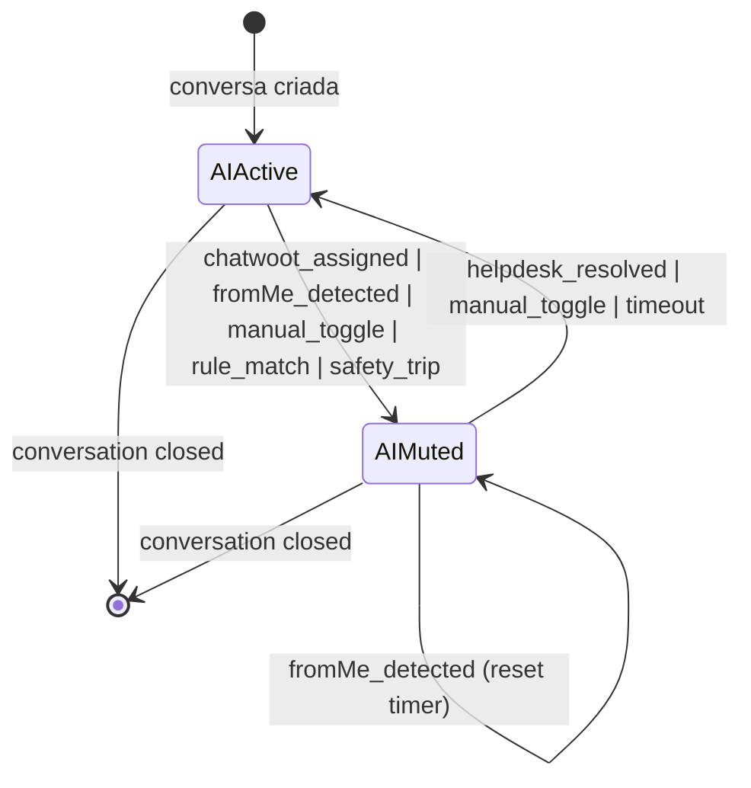

# Phase 0 — Research: Handoff Engine + Multi-Helpdesk Integration

**Feature Branch**: `epic/prosauai/010-handoff-engine-inbox`
**Date**: 2026-04-23
**Spec**: [spec.md](./spec.md) | **Pitch**: [pitch.md](./pitch.md) | **Decisions**: [decisions.md](./decisions.md)

> Este documento consolida o escopo tecnico integral do epic 010, as 22 decisoes capturadas no pitch, as 14 resolucoes do epic-context (2026-04-23), os 6 Q&A resolvidos autonomamente na clarify pass, e as alternativas consideradas/rejeitadas. Todas as `NEEDS CLARIFICATION` estao resolvidas. Artefatos Phase 1 (`data-model.md`, `contracts/`, `quickstart.md`) consomem este research + spec + pitch + decisions.md inalterados.

---

## 1. Problema e contexto historico

### 1.1 Sintoma observavel em producao

Em Ariel e ResenhAI (2 tenants ativos em producao), ocorre regularmente o seguinte:

1. Cliente envia mensagem via WhatsApp → pipeline ProsaUAI processa → bot responde.
2. Atendente humano do tenant abre a conversa no Chatwoot (integracao Evolution operacional desde 2026-03; todo webhook Evolution carrega `chatwootConversationId` — ver [tests/fixtures/captured/README.md:208-211](apps/api/tests/fixtures/captured/README.md#L208-L211)).
3. Atendente responde via Chatwoot. Evolution entrega a mensagem ao WhatsApp do cliente.
4. Cliente replica no WhatsApp.
5. Pipeline ProsaUAI recebe o webhook, **nao sabe que humano assumiu**, e o bot responde por cima do humano.

Resultado operacional: conversa dupla, UX quebrada, atendente frustrado — reclamacao direta do time Pace em 3 tenants diferentes.

### 1.2 Evidencia tecnica da lacuna

- **Status `pending_handoff` declarado mas nao materializado**: [apps/api/prosauai/db/queries/conversations.py:16](apps/api/prosauai/db/queries/conversations.py#L16) carrega o comentario literal "not yet materialised in the DB schema". Nenhum enum ou trigger usa esse valor.
- **Flag router sempre false**: [core/router/facts.py:66](apps/api/prosauai/core/router/facts.py#L66) declara `conversation_in_handoff=False` com comentario obsoleto "sera sempre False ate epic 005/011" — referencia a epics ja passados, nunca materializado.
- **Safety guards sem via de escape**: epic 005 (Conversation Core) implementou guards que podem disparar escalacao para humano (ex: tool failure, repeated PII leak) mas nao existe destinatario — evento e logado e a conversa continua com o bot.
- **Customer-initiated handoff sem destino**: classifier do epic 004 pode detectar "quero falar com um atendente" via regra `customer_requests_human`, mas o fact `handoff` e emitido sem efeito.

### 1.3 Contrato com a vision

- **Vision [business/vision.md:169](../../business/vision.md#L169)**: "Handoff — Transferencia de conversa do agente para atendente humano com todo o contexto".
- **Principio #2 do produto [business/solution-overview.md:86](../../business/solution-overview.md#L86)**: "IA e copiloto, nao piloto. O agente responde e resolve, mas o humano sempre pode assumir".

Ambos impossiveis hoje. Este epic fecha o buraco.

### 1.4 Abrangencia multi-tenant e multi-helpdesk

Ariel e ResenhAI compartilham **uma instancia Chatwoot Pace** operada em VPS propria. Futuros tenants podem ter:

- (a) Chatwoot proprio em VPS propria — ex: cliente enterprise.
- (b) Nenhum helpdesk — atendente responde direto do celular com WhatsApp Business; detectavel via `fromMe:true` no Evolution.
- (c) Blip, Zendesk, Freshdesk, Front — escopo futuro (epic 010.1).

Shape do `tenants.yaml` acomoda todos os casos sem codigo per-deployment.

---

## 2. Decisoes travadas (locked)

### 2.1 Do pitch.md (2026-04-22)

| # | Decisao | Referencia |
|---|---------|-----------|
| 1 | **Boolean `ai_active` single-bit** substitui state machine multi-step. Handoff = ausencia de AI, nao estado intermediario. | ADR-036 novo |
| 2 | **Postgres unica fonte de verdade**. Router le `ai_active` direto do PG em `customer_lookup`. Redis legacy deprecated no PR-A, removido PR-B. | Q1-B epic-context |
| 3 | `HelpdeskAdapter` Protocol com 5 metodos. Registry por `helpdesk_type`. Espelha `ChannelAdapter` do epic 009. | ADR-037 novo |
| 4 | Escopo v1: `ChatwootAdapter` + `NoneAdapter`. Blip/Zendesk adiados para epic 010.1. Dois shapes radicalmente diferentes validam a abstracao. | §B2 pitch |
| 5 | 5 origens validas de mute: `chatwoot_assigned`, `fromMe_detected`, `manual_toggle`, `rule_match`, `safety_trip`. Cada uma → evento `handoff_events.source`. | §B5 + safety guards |
| 6 | Return-to-bot: 3 gatilhos priorizados (`helpdesk_resolved > manual_toggle > timeout`). Scheduler = asyncio periodic task + advisory lock singleton. Cadencia 60s. | Q2-A epic-context |
| 7 | Webhook idempotente via Redis SETNX TTL 24h + HMAC per-tenant. Push private note fire-and-forget. | ADR-037; BP2-3 |
| 8 | NoneAdapter `fromMe` detection: `message_id` sem match em `bot_sent_messages` → mute + `auto_resume_at = now + human_pause_minutes` (default 30 min). Group chat skip silencioso. Retention 48h + cleanup cron 12h. | Q5, Q2 add-on epic-context |
| 9 | `conversations.external_refs JSONB` — sem migration por helpdesk novo. Ex: `{"chatwoot": {"conversation_id": 123, "inbox_id": 4}}`. | §B7 pitch |
| 10 | Transcripts continuam rodando em handoff. ChatwootAdapter empurra como private note fire-and-forget; NoneAdapter skip silencioso. | §B8 pitch |
| 11 | `pg_advisory_xact_lock(hashtext(conversation_id))` em qualquer transicao de `ai_active`. | BP5 pitch |
| 12 | Pipeline `generate`: `SELECT ai_active FOR UPDATE` antes do LLM call; skip sem delivery se flip aconteceu. | BP6 pitch |
| 13 | Ordenacao estrita: mute primeiro (DB commit) → side effects fire-and-forget depois. | BP7 pitch |
| 14 | Feature flag `handoff.mode: off \| shadow \| on` (default `off`). Shadow emite eventos sem mutar (mede false-mute rate). Removivel apos validacao. | Q3-B epic-context |
| 15 | Composer admin: escape hatch ops (<=5% trafego). `sender_name=<admin.email>`, audit `metadata.admin_user_id`. NoneAdapter → 409. | Q4-A epic-context |
| 16 | `tenants.yaml` blocos ortogonais: `helpdesk: {type, credentials...}` + `handoff: {mode, auto_resume_after_hours, human_pause_minutes, rules}`. | §B9 pitch |
| 17 | `handoff_events` append-only em `public` (admin-only carve-out ADR-027). | BP1 pitch |
| 18 | Operator IDs externos em `metadata`, **nao tagueados** em Prometheus. Counters agregados. | BP9 pitch |
| 19 | OTel baggage `conversation_id + tenant_id` desde webhook inbound ate POST pro helpdesk. | BP10 pitch |
| 20 | Chatwoot deployment: 3 cenarios no mesmo shape (Pace shared multi-inboxes, per-tenant, sem). | §B10 pitch |
| 21 | v1 handoff so 1:1. Grupo continua sempre com bot — semantica ambigua. Backlog. | §C pitch |
| 22 | Meta Cloud janela 24h: adapter retorna erro → admin alerta "cliente precisa escrever primeiro". | §C pitch |

### 2.2 Da clarify pass (2026-04-23)

Resolvidos autonomamente em modo dispatch com base em best practices e consistencia com epics vizinhos (004, 008, 009).

| Q | Pergunta | Resolucao | Confianca |
|---|----------|-----------|-----------|
| 1 | Retention `handoff_events`? | **90 dias full-detail**, cleanup cron diario singleton. Agregados via query em runtime (sem materialized view v1). | Alta |
| 2 | Quais events Chatwoot processar? | **2 tipos apenas**: `conversation_updated` (delta `assignee_id`) + `conversation_status_changed` (`resolved`). Outros: log + 200 OK no-op. | Media (depende fixture real) |
| 3 | Shape `handoff.rules[]`? | **Array de strings com nomes de regras existentes do router epic 004**. Sem DSL novo. Default `[]`. | Alta |
| 4 | Range `auto_resume_after_hours`? | Default **24**. Range **1..168** (1h a 1 semana). `null` desabilita timeout. Fora do range → config_poller rejeita reload. | Alta |
| 5 | Quando popular `external_refs.chatwoot`? | **No pipeline step `customer_lookup`** — UPDATE atomico quando webhook Evolution carrega `chatwootConversationId` nao-null e JSONB ainda nao tem. | Media (depende fixture real Evolution com conversationId pre-existente em dev) |

---

## 3. Arquitetura de solucao

### 3.1 Modelo de estado (ADR-036)

```
conversations.ai_active BOOLEAN NOT NULL DEFAULT TRUE
conversations.ai_muted_reason TEXT NULL          -- 1 dos 5 valores em §2.1 decisao 5
conversations.ai_muted_at TIMESTAMPTZ NULL       -- set quando ai_active → false
conversations.ai_muted_by_user_id UUID NULL      -- para manual_toggle apenas
conversations.ai_auto_resume_at TIMESTAMPTZ NULL -- NoneAdapter sets; scheduler consome
conversations.external_refs JSONB NOT NULL DEFAULT '{}'::jsonb
```

**Invariantes**:
- Quando `ai_active=true`: todos os campos `ai_muted_*` e `ai_auto_resume_at` DEVEM ser `NULL`.
- Quando `ai_active=false`: `ai_muted_reason` e `ai_muted_at` DEVEM ser non-null; `ai_auto_resume_at` pode ser non-null (NoneAdapter fromMe timeout).
- `ai_muted_by_user_id` e non-null apenas quando `ai_muted_reason='manual_toggle'`.

**Transicoes**:



### 3.2 Event sourcing (ADR-036 + ADR-027 carve-out)

```
public.handoff_events (
  id UUID PRIMARY KEY,
  tenant_id UUID NOT NULL,
  conversation_id UUID NOT NULL,
  event_type TEXT NOT NULL,  -- muted | resumed | admin_reply_sent | breaker_open | breaker_closed
  source TEXT NOT NULL,      -- chatwoot_assigned | fromMe_detected | manual_toggle | rule_match | safety_trip
                             --                  | helpdesk_resolved | timeout
  metadata JSONB NOT NULL DEFAULT '{}'::jsonb,
  shadow BOOLEAN NOT NULL DEFAULT FALSE,
  created_at TIMESTAMPTZ NOT NULL DEFAULT NOW()
)
```

Append-only. Retention 90d via `handoff_events_cleanup_cron`. Indices `(tenant_id, created_at)` + `(conversation_id, created_at)`.

### 3.3 HelpdeskAdapter pattern (ADR-037)

```python
@runtime_checkable
class HelpdeskAdapter(Protocol):
    helpdesk_type: str  # "chatwoot", "none", future: "blip", "zendesk"

    async def verify_webhook_signature(self, request: Request, secret: str) -> None: ...
    async def on_conversation_assigned(self, tenant_id: UUID, external_conv_id: str, assignee_id: str, metadata: dict) -> None: ...
    async def on_conversation_resolved(self, tenant_id: UUID, external_conv_id: str, metadata: dict) -> None: ...
    async def push_private_note(self, tenant_id: UUID, external_conv_id: str, text: str) -> None: ...
    async def send_operator_reply(self, tenant_id: UUID, external_conv_id: str, text: str, sender_name: str) -> None: ...
```

**ChatwootAdapter**: httpx client + HMAC X-Webhook-Secret verify + Chatwoot API v1 (`/api/v1/accounts/{account_id}/conversations/{id}/messages` para private_note e operator reply).

**NoneAdapter**: nao expõe webhook. `on_conversation_assigned` etc. sao no-ops (helpdesk nao existe). `send_operator_reply` levanta `HelpdeskNotConfigured` → endpoint admin retorna 409. Deteccao fromMe vive em um hook no webhook Evolution, nao no adapter diretamente (adapter fica puro; hook integra).

### 3.4 NoneAdapter fromMe detection (ADR-038)

**Entrada**: webhook Evolution com `fromMe: true`.

**Algoritmo** (executado em `api/webhooks/evolution.py` quando `tenant.helpdesk.type == 'none'`):

```
1. Se inbound.is_group → log 'noneadapter_group_skip' → return (sem mute)
2. lookup = SELECT tenant_id FROM bot_sent_messages
            WHERE tenant_id=$1 AND message_id=$2 AND sent_at > now() - interval '48 hours'
3. Se lookup encontrou → echo do bot → log 'noneadapter_bot_echo' → return (sem mute)
4. Se lookup vazio → humano respondeu → chama state.mute_conversation(
                          conversation_id,
                          reason='fromMe_detected',
                          auto_resume_at=now + tenant.handoff.human_pause_minutes)
```

**Tabela**:
```
public.bot_sent_messages (
  tenant_id UUID NOT NULL,
  message_id TEXT NOT NULL,
  conversation_id UUID NOT NULL,
  sent_at TIMESTAMPTZ NOT NULL DEFAULT NOW(),
  PRIMARY KEY (tenant_id, message_id)
)
```

Retention 48h. Cleanup `bot_sent_messages_cleanup_cron` cadencia 12h, singleton via `pg_try_advisory_lock(hashtext('bsm_cleanup_cron'))`.

### 3.5 Race prevention (BP5)

Toda transicao de `ai_active` em `handoff/state.py` abre transacao e chama `SELECT pg_advisory_xact_lock(hashtext(conversation_id::text))`. 4 triggers possiveis (webhook Chatwoot, fromMe Evolution, toggle admin, scheduler auto_resume) competem por locks disjuntos (granularidade por conversation) — zero contention em volumes reais.

### 3.6 Pipeline safety net (BP6)

Step `generate` faz:
```sql
SELECT ai_active, ai_muted_reason FROM conversations WHERE id = $1 FOR UPDATE;
```
Se `ai_active=false`, emite trace step `ai_muted_skip` com `ai_muted_reason` no metadata e retorna sem chamar LLM. Amortizado: se `customer_lookup` ja leu `ai_active` no inicio do pipeline, step `generate` confirma o estado (race window = tempo entre start e gen; sem safety net, bot pode falar por cima do humano se mute ocorreu mid-pipeline).

Step `customer_lookup` amortiza o read de `ai_active` junto com o SELECT do customer — single roundtrip PG. Substitui o read Redis atual em [api/webhooks/__init__.py:175](apps/api/prosauai/api/webhooks/__init__.py#L175).

### 3.7 Scheduler arquitetura

3 cron tasks como asyncio periodic tasks no FastAPI lifespan (`main.py`):

| Cron | Cadencia | Singleton lock | Acao |
|------|----------|----------------|------|
| `handoff_auto_resume_cron` | 60s | `pg_try_advisory_lock(hashtext('handoff_resume_cron'))` | `UPDATE conversations SET ai_active=true WHERE ai_auto_resume_at < now()` |
| `bot_sent_messages_cleanup_cron` | 12h | `pg_try_advisory_lock(hashtext('bsm_cleanup_cron'))` | `DELETE FROM bot_sent_messages WHERE sent_at < now() - interval '48 hours'` |
| `handoff_events_cleanup_cron` | 24h | `pg_try_advisory_lock(hashtext('handoff_events_cleanup'))` | `DELETE FROM handoff_events WHERE created_at < now() - interval '90 days'` (batches 1000) |

Shutdown graceful: `asyncio.wait(pending_tasks, timeout=5s)` no lifespan.shutdown evento antes de fechar pool DB.

### 3.8 Feature flag + shadow mode

`tenants.yaml`:

```yaml
tenants:
  ariel:
    helpdesk:
      type: chatwoot
      base_url: https://chatwoot.pace.ai
      account_id: 1
      inbox_id: 3
      api_token: !secret chatwoot.ariel.api_token
      webhook_secret: !secret chatwoot.ariel.webhook_secret
    handoff:
      mode: off  # off | shadow | on
      auto_resume_after_hours: 24
      human_pause_minutes: 30
      rules: []
  resenhai:
    helpdesk:
      type: chatwoot
      base_url: https://chatwoot.pace.ai
      account_id: 1
      inbox_id: 4
      api_token: !secret chatwoot.resenhai.api_token
      webhook_secret: !secret chatwoot.resenhai.webhook_secret
    handoff:
      mode: off
      auto_resume_after_hours: 24
      human_pause_minutes: 30
      rules: [customer_requests_human, unresolved_after_3_turns]
  newtenant_sem_helpdesk:
    helpdesk:
      type: none
    handoff:
      mode: off
      auto_resume_after_hours: 24
      human_pause_minutes: 30
      rules: []
```

**Shadow mode**: `state.mute_conversation` checa `tenant.handoff.mode`. Em `shadow`, insere evento com `shadow=true` e **nao** atualiza `conversations.ai_active`. Pipeline `generate` safety net ignora shadow events (sempre le `ai_active` real). Metricas Performance AI renderizam eventos shadow em cor distinta.

---

## 4. Sequenciamento de PRs e gates

Ver plan.md §Cronograma e §Sequenciamento para detalhes; resumo aqui:

- **PR-A (1 semana)**: data model + `HelpdeskAdapter` + `ChatwootAdapter` basico + pipeline safety net.
- **PR-B (1 semana)**: `NoneAdapter` + webhooks + scheduler + circuit breaker + shadow mode.
- **PR-C (1 semana)**: admin UI (badges + toggle + composer) + Performance AI 4 cards + rollout gradual.

Cut-line: PR-C sacrificavel se PR-B estourar (valor core = PR-A+B).

---

## 5. Testing strategy

### 5.1 Unit

- `tests/unit/handoff/test_state.py` — mute/resume isolados com testcontainers-postgres; valida advisory lock via `asyncio.gather(10x same conversation)` esperando exatamente 1 commit.
- `tests/unit/handoff/test_chatwoot.py` — HMAC positive/negative; API v1 calls mockados via respx; 2 event types parseados corretamente; eventos desconhecidos → 200 OK no-op.
- `tests/unit/handoff/test_none.py` — fromMe com message_id em `bot_sent_messages` → no mute; fromMe sem match → mute; group chat → skip + log; echo tolerance 10s.
- `tests/unit/handoff/test_events.py` — insert fire-and-forget; falha de insert nao bubble-up.
- `tests/unit/handoff/test_breaker.py` — 5 falhas em 60s → open; 30s → half-open; 1 sucesso → closed.
- `tests/unit/handoff/test_scheduler.py` — freezegun para auto_resume_at no passado; singleton lock (second task retorna sem executar); shutdown graceful com iteration mid-flight.

### 5.2 Contract

- `tests/contract/test_helpdesk_adapter_contract.py` parametrizado sobre `[ChatwootAdapter(), NoneAdapter()]`:
  - `isinstance(adapter, HelpdeskAdapter)` → True
  - 5 metodos presentes + signatures corretas
  - Errors sao subclasses de `HelpdeskAdapterError`

### 5.3 Integration

- `tests/integration/test_handoff_flow_chatwoot.py`: webhook assignee_changed → mute → inbound cliente → trace `ai_muted_skip` → webhook resolved → resume → inbound cliente → bot responde.
- `tests/integration/test_handoff_flow_none_adapter.py`: bot envia → `bot_sent_messages` populada → fromMe humano → mute → aguarda `ai_auto_resume_at` → cron resume → inbound → bot responde.
- `tests/integration/test_handoff_concurrent_transitions.py`: 10 mutes paralelos na mesma conversa → apenas 1 vence.
- `tests/integration/test_handoff_composer_admin.py`: POST /admin/conversations/{id}/reply → Chatwoot API call → evento `admin_reply_sent` persistido; tenant NoneAdapter → 409.

### 5.4 Benchmarks (gate merge)

- `tests/benchmarks/test_text_latency_no_regression.py` (PR-A): 100 mensagens texto em sequencia; p95 ≤ baseline epic 009 + 5ms.
- `tests/benchmarks/test_webhook_latency.py` (PR-B): 50 webhooks Chatwoot; p95 webhook → mute < 500ms.

### 5.5 E2E Playwright

- Reuso infra epic 008.
- Spec E2E em `admin/e2e/handoff.spec.ts`: admin login → lista conversas → abre conversa com `ai_active=false` → ve badge vermelho → clica "Retomar AI" → badge vira verde → usa composer emergencia → mensagem aparece no Chatwoot.

### 5.6 Fixtures reais (task T000 em PR-A)

Capturar em dev Chatwoot Pace:
- `chatwoot_conversation_updated_assignee.input.json` — webhook de `conversation_updated` com `assignee_id` indo de null → non-null.
- `chatwoot_conversation_updated_unassigned.input.json` — mesmo tipo com assignee_id indo de non-null → null.
- `chatwoot_conversation_status_resolved.input.json` — webhook de `conversation_status_changed` com `status=resolved`.
- `evolution_fromMe_human.input.json` — webhook Evolution `fromMe:true` com `message_id` nao-tracking (humano).

---

## 6. Alternativas consideradas e rejeitadas

### 6.1 Enum state machine `open → pending_handoff → in_handoff → resolved`

**Por que tentador**: e o shape que o comment em `db/queries/conversations.py:16` sugeria originalmente. Ortodoxo em sistemas CRM classicos.

**Por que rejeitado**: usuario Pace reformulou corretamente — "conversas **sempre** aparecem no Chatwoot e no WhatsApp; o que muda e **se o bot responde**". Estado multi-step cria:
- Semantica falsa: "in_handoff" e igual a "mute ativo"; "pending_handoff" e igual a "mute nao aplicado ainda", o que nao existe (transicoes sao instantaneas, nao 2-fase).
- Complexidade extra em queries e UI: toda query precisa saber 3 estados, nao 1 bit.
- Enum growth pressure: "transferred_to_other_agent"? "snoozed"? Slippery slope.

Single bit boolean + event sourcing captura tudo com 1 migration aditiva e 0 ambiguidade semantica.

### 6.2 Redis como fonte de verdade (write-through PG)

**Por que tentador**: leitura de `ai_active` em cada inbound Evolution (hot path) parecia custosa em PG. Redis lookup e O(1) em memoria.

**Por que rejeitado**: 
- Router ja faz `SELECT customer` em `customer_lookup` (single PG roundtrip). Amortizar `ai_active` no mesmo SELECT elimina a questao sem custo adicional (FR-022).
- Redis write-through introduz classe de bugs sob particao: Redis ACK antes do PG commit → cliente ve Redis reflect mute, PG perde commit → divergencia. Two-phase commit para 1 bit e overengineering.
- Telemetria do epic 004 mostra que read `conversation_in_handoff` ja passa por Redis hoje; a linha e **codigo morto** (sempre false). Migrar para PG nao muda latencia — elimina codigo.

Postgres e unica fonte de verdade. Redis usado apenas para idempotency key (SETNX 24h TTL).

### 6.3 ARQ worker dedicado para auto_resume scheduler

**Por que tentador**: ARQ ja esta no stack blueprint (ver [engineering/blueprint.md §1](../../engineering/blueprint.md#1-technology-stack)). Workers escalam horizontalmente.

**Por que rejeitado**:
- Volume esperado ~100 conversas/min SLA. ARQ e overkill.
- Asyncio periodic task + `pg_try_advisory_lock` singleton entrega mesma garantia com zero overhead de infraestrutura nova.
- Blueprint tera que ser revisado em epic futuro caso volume justifique — decisao operacional pos-epic.

### 6.4 `bot_sent_messages` em Redis (TTL 48h via EXPIRE)

**Por que tentador**: elimina a migration. Redis e mais leve para lookup `fromMe` em hot path.

**Por que rejeitado**:
- Cross-restart data loss: se bot reinicia, Redis volatil perde todos os IDs das ultimas 48h. Evolution pode retornar echo de mensagem enviada pre-restart → false positive mute (bot mata o proprio bot apos deploy).
- PG com PK `(tenant_id, message_id)` + index em `sent_at` e <1ms em volumes reais (~100k linhas/tenant).
- Tradeoff: +1 tabela + cleanup cron, mas previne classe de bugs em deploy windows.

### 6.5 DSL novo para `handoff.rules[]`

**Por que tentador**: permitiria expressar condicoes ricas por tenant sem editar codigo (ex: `"trigger on customer_sentiment<0.3 AND message_count>5"`).

**Por que rejeitado**:
- Epic 004 ja tem engine de regras com evaluator YAML. Reuso integral.
- `rules[]` e array de **nomes** de regras existentes (strings). Quando regra casa durante step `route`, router emite `state.mute_conversation(reason='rule_match', metadata={rule_name})`.
- Zero DSL novo. Adicionar regras novas = adicionar no epic 004 repo (ou via hot-reload YAML). Handoff e consumer, nao producer de regras.

### 6.6 Shared "Pace Ops" agent no Chatwoot (composer identity)

**Por que tentador**: nao expoe emails internos Pace no Chatwoot do tenant. Mais limpo do ponto de vista de privacy externa.

**Por que rejeitado**:
- Perde auditoria granular: se o atendente do tenant pergunta "quem da Pace respondeu isso?" — resposta "Pace Ops" nao ajuda.
- Audit log em `handoff_events.metadata.admin_user_id` ja existe para uso interno Pace. Exposicao externa via `sender_name` adiciona contexto para o tenant.
- Risco R9 aceito conscientemente (spec A14). Se virar problema em algum tenant enterprise — fallback para "Pace Ops" agent e ~30 LOC em epic follow-up.

### 6.7 Status enum `pending_handoff` como valor final

**Por que tentador**: comment original no codigo sugeria isso. "Decisao ja tomada" aparente.

**Por que rejeitado**: viola decisao 1 (boolean vs enum). O comment era um TODO nao implementado, nao uma decisao. Remover o comment + nao materializar o status e o certo.

### 6.8 Store operator name (Chatwoot agent profile fetch)

**Por que tentador**: admin UI poderia mostrar "Atribuido a Joao Silva" em vez de "Agent #123".

**Por que rejeitado**:
- Privacy cross-tenant: operadores Pace (que operam shared Chatwoot) nao querem nome em admin ProsaUAI visivel por outros tenants.
- Overhead de fetch: cada webhook teria que chamar `GET /api/v1/accounts/{acc}/agents/{id}` — rate limit risk.
- ID externo em `metadata` basta para audit. Display "Agent #123" no admin e aceitavel para v1.

### 6.9 Trigger Postgres para mute automatico

**Por que tentador**: `AFTER INSERT ON messages WHERE fromMe=TRUE THEN UPDATE conversations SET ai_active=FALSE` — atomico, zero latencia.

**Por que rejeitado**:
- Triggers escondem logica de negocio do codigo Python — dificil debugar.
- Precisa incorporar logica do `bot_sent_messages` lookup (bot echo filter) — trigger complexa com JOIN e condicao temporal.
- Shadow mode ficaria impossivel (trigger sempre muta).
- Circuit breaker e fire-and-forget sao triviais em Python, nao em trigger.

Logica em Python com advisory lock + evento e auditavel, testavel e flexivel.

### 6.10 Webhook Chatwoot polling (GET `/conversations?status=open`)

**Por que tentador**: elimina dependencia de webhook Chatwoot estar configurado corretamente pelo ops do tenant.

**Por que rejeitado**:
- Latencia ruim: p95 << 500ms impossivel com polling 10s.
- Custo Chatwoot API: 2 tenants × 1 request/10s × ~8640 requests/dia = 17280 req/dia → 10k limite enterprise pode virar problema.
- Chatwoot webhooks sao padrao; ops e trivial de configurar (1 POST no admin Chatwoot).

---

## 7. Metricas de observabilidade

### 7.1 Metricas Prometheus/OTel

- `handoff_events_total{tenant, event_type, source}` — counter. Incrementado em toda persistencia de `handoff_events`.
- `handoff_duration_seconds_bucket{tenant}` — histogram. Tempo entre `muted` e `resumed` do mesmo `conversation_id`.
- `helpdesk_webhook_latency_seconds{tenant, helpdesk}` — histogram. Tempo entre `POST /webhook/helpdesk/*` e commit PG `ai_active=false`.
- `helpdesk_api_error_total{tenant, helpdesk, endpoint, http_status}` — counter. Falhas em outbound para Chatwoot (private note, operator reply).
- `helpdesk_breaker_open{tenant, helpdesk}` — gauge (0|1). Alerta quando >5min aberto.
- `bot_sent_messages_total{tenant}` — counter. Mensagens enviadas pelo bot (gravadas em `bot_sent_messages`).
- `handoff_shadow_events_total{tenant, source}` — counter. Eventos shadow (nao mutados) para comparar com realidade pos-`on`.

**Regra de cardinalidade**: zero labels com cardinalidade alta (conversation_id, operator_id, message_id). Tenant + event_type + source + helpdesk e o cap de labels.

### 7.2 OTel baggage

`tenant_id` e `conversation_id` propagados como baggage do webhook inbound original (Evolution ou Chatwoot) ate:
- pipeline steps (`customer_lookup`, `generate`, ...)
- operacoes outbound (Chatwoot API, Evolution send)
- insert em `handoff_events`

Trace Explorer (epic 008) mostra a cadeia completa: webhook → state.mute → event.persist → pipeline skip → (depois) webhook resolve → state.resume → pipeline gen.

### 7.3 Logs estruturados (structlog)

Fields padrao em todo log de `handoff/*`:
- `tenant_id`
- `conversation_id`
- `event_type` (quando aplicavel)
- `source` (quando aplicavel)
- `helpdesk_type`
- `admin_user_id` (quando acao admin)

Exemplos:
```
logger.info("handoff_muted", ai_muted_reason="chatwoot_assigned", assignee_id="123", tenant_id=...)
logger.info("noneadapter_group_skip", message_id=..., tenant_id=...)
logger.info("noneadapter_bot_echo", message_id=..., sent_at=..., tenant_id=...)
logger.warn("handoff_redis_legacy_read", path="router.facts", count=<per-tenant counter>)
```

### 7.4 Admin Performance AI (cards)

- **Taxa**: `COUNT(DISTINCT conversation_id) WHERE muted events > 0 / COUNT(DISTINCT conversation_id)` no periodo.
- **Duracao media**: `AVG(resumed_at - muted_at)` emparelhando por `conversation_id` no periodo.
- **Breakdown por origem**: `COUNT(*) GROUP BY source` em pie chart Recharts.
- **SLA breaches**: `COUNT(*) WHERE source='timeout'` (scheduler teve que intervir).

Filtros compartilhados com epic 008: range de datas, tenant selector. Shadow events em cor distinta.

---

## 8. Riscos e mitigacoes

Ver [pitch.md §Risks](./pitch.md#risks) para tabela completa com probabilidade/impacto. Resumo dos mais relevantes:

| # | Risco | Mitigacao |
|---|-------|-----------|
| R1 | Chatwoot muda formato webhook | Fixtures reais + contract test + versao fixada em tenants.yaml |
| R2 | fromMe false positive (bot echo) | `bot_sent_messages` tracking + janela tolerancia 10s + teste dedicado |
| R3 | Advisory lock contention | Per-conversation granularity; stress test valida |
| R4 | Circuit breaker esconde falhas | Metric + alerta >5min aberto |
| R5 | Auto-resume 24h re-engaja conversa encerrada | Silent resume; primeiro inbound passa guards |
| R6 | Composer confusao identidade | Sender name = admin.email + badge no note |
| R7 | Chatwoot shared bottleneck >20 tenants | Rate limit per-tenant (implementado on-demand) |
| R8 | Migration impacto producao | Aditiva + default off |
| R9 | Email Pace exposto no Chatwoot tenant | Aceito conscientemente |
| R10 | Redis legacy key leitor esquecido | PR-A log path; PR-B remove apos 7d zero leituras |

---

## 9. Scope-out explicito

Do [pitch.md §Scope-out](./pitch.md#scope-out-o-que-nao-entra):

1. **Blip, Zendesk, Freshdesk, Front adapters** — epic 010.1 quando houver cliente.
2. **Skills-based routing / queue prioritization no helpdesk** — helpdesk resolve nativamente.
3. **Handoff em group chat** — semantica ambigua, backlog.
4. **Template Meta Cloud fora da janela 24h** — adapter retorna erro com alerta UI; engenharia de templates e epic separado.
5. **Transfer entre atendentes** — Chatwoot ja faz.
6. **SLA breach via Slack/email** — publica metric events; integracao com canais e epic 014 (Alerting + WhatsApp Quality).
7. **Migration conversas historicas** — nao re-processa. `ai_active=true` default.
8. **Dashboard operator leaderboard** — se virar demanda, follow-up.

---

## 10. Pre-epic cleanup executado (2026-04-22)

Antes do branch 010, develop recebeu cleanup:

- Agentes moved para modo prompt-only.
- Deletados `apps/api/prosauai/tools/resenhai.py` + `apps/api/tests/tools/test_resenhai.py`.
- Seed migration `20260101000008_seed_data.sql` atualizado (`tools_enabled: []`).
- Nova migration forward `20260422000001_clear_tools_enabled.sql` limpa DBs existentes.
- 2117 tests passaram sem regressao.
- Registry pattern preservado para epic 013 (Agent Tools v2).

Branch `epic/prosauai/010-handoff-engine-inbox` parte de develop pos-cleanup. Nao ha debito anterior.

---

handoff:
  from: research (Phase 0)
  to: data-model + contracts + quickstart (Phase 1)
  context: "Research consolidado: 22 decisoes locked + 5 Q&As clarify resolvidos + 10 alternativas rejeitadas justificadas. Zero NEEDS CLARIFICATION. Arquitetura: single bit ai_active + HelpdeskAdapter Protocol (ChatwootAdapter + NoneAdapter v1) + event sourcing + advisory lock + asyncio scheduler. Ready para Phase 1 artifacts."
  blockers: []
  confidence: Alta
