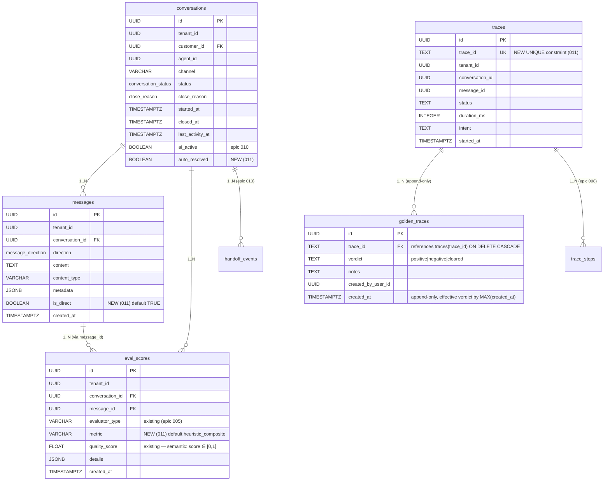

# Data Model: Epic 011 — Evals

**Phase 1 output** — schemas Pydantic, SQL migrations, ER diagram, validacoes por camada, `tenants.yaml` schema extension, rejected alternatives.

---

## 1. ER diagram



---

## 2. Migrations (SQL)

5 migrations aditivas em PR-A (#1-#4) e PR-B (#5). Todas idempotentes via `IF NOT EXISTS` / `IF NOT VALID`.

### 2.1 Migration 1 — `eval_scores` add metric (PR-A)

`apps/api/db/migrations/20260601000001_alter_eval_scores_add_metric.sql`

```sql
-- migrate:up
-- Epic 011: Evals — add metric discriminator column to eval_scores.
-- Schema epic 005 has evaluator_type + quality_score; metric is new in 011
-- to support DeepEval multi-metric output (answer_relevancy/toxicity/bias/coherence).
--
-- ADD COLUMN vs RENAME: we keep existing column names (evaluator_type, quality_score)
-- to preserve epic 005 code + epic 008 admin pool queries. See ADR-039.

ALTER TABLE eval_scores
    ADD COLUMN IF NOT EXISTS metric VARCHAR(50) NOT NULL DEFAULT 'heuristic_composite';

-- Backfill existing rows (all heuristic from epic 005) explicitly.
UPDATE eval_scores
SET metric = 'heuristic_composite'
WHERE metric IS NULL OR metric = '';

-- CHECK constraint enforces allowed values (enum at DB level).
ALTER TABLE eval_scores
    ADD CONSTRAINT IF NOT EXISTS chk_eval_scores_metric
    CHECK (metric IN (
        'heuristic_composite',
        'answer_relevancy',
        'toxicity',
        'bias',
        'coherence',
        'human_verdict'
    ));

-- Index for aggregation queries (admin: WHERE evaluator_type=... AND metric=... AND tenant_id=... ORDER BY created_at).
CREATE INDEX IF NOT EXISTS idx_eval_scores_tenant_evaluator_metric_created
    ON eval_scores (tenant_id, evaluator_type, metric, created_at DESC);

-- migrate:down
DROP INDEX IF EXISTS idx_eval_scores_tenant_evaluator_metric_created;
ALTER TABLE eval_scores DROP CONSTRAINT IF EXISTS chk_eval_scores_metric;
ALTER TABLE eval_scores DROP COLUMN IF EXISTS metric;
```

### 2.2 Migration 2 — `public.traces` UNIQUE trace_id (PR-A)

`apps/api/db/migrations/20260601000002_alter_traces_unique_trace_id.sql`

```sql
-- migrate:up
-- Epic 011: Evals — promote public.traces(trace_id) index to UNIQUE constraint.
-- Required for golden_traces FK. OTel trace_id is globally unique (32-char hex)
-- by spec, so zero risk of duplicates in existing data.
-- CONCURRENTLY avoids table lock during index build.

-- Step 1: build new unique index concurrently.
CREATE UNIQUE INDEX CONCURRENTLY IF NOT EXISTS idx_traces_trace_id_unique
    ON public.traces (trace_id);

-- Step 2: drop the old non-unique index (redundant now).
DROP INDEX IF EXISTS idx_traces_trace_id;

-- Step 3: bind the unique index to a UNIQUE constraint (required for FK).
ALTER TABLE public.traces
    ADD CONSTRAINT traces_trace_id_unique
    UNIQUE USING INDEX idx_traces_trace_id_unique;

-- migrate:down
ALTER TABLE public.traces DROP CONSTRAINT IF EXISTS traces_trace_id_unique;
CREATE INDEX IF NOT EXISTS idx_traces_trace_id ON public.traces (trace_id);
```

**Rollback risk**: low. If duplicates exist unexpectedly, `CREATE UNIQUE INDEX CONCURRENTLY` will fail (without impacting live traffic) and ops team will investigate. Cleanup playbook: `DELETE FROM public.traces WHERE ctid NOT IN (SELECT MIN(ctid) FROM public.traces GROUP BY trace_id)`.

### 2.3 Migration 3 — `conversations.auto_resolved` (PR-A)

`apps/api/db/migrations/20260601000003_alter_conversations_auto_resolved.sql`

```sql
-- migrate:up
-- Epic 011: Evals — autonomous resolution boolean populated by daily cron.
-- NULL = not yet calculated. TRUE = heuristic A passed (no mute + no escalation
-- regex + >=24h customer silence). FALSE = explicitly non-autonomous.
--
-- Tri-state intentional: NULL is a valid "pending" state.

ALTER TABLE conversations
    ADD COLUMN IF NOT EXISTS auto_resolved BOOLEAN NULL;

-- Index for KPI query + retention scan.
-- Partial index: only non-null rows (most queries filter on computed value).
CREATE INDEX IF NOT EXISTS idx_conversations_auto_resolved
    ON conversations (tenant_id, auto_resolved, closed_at DESC)
    WHERE auto_resolved IS NOT NULL;

-- migrate:down
DROP INDEX IF EXISTS idx_conversations_auto_resolved;
ALTER TABLE conversations DROP COLUMN IF EXISTS auto_resolved;
```

### 2.4 Migration 4 — `messages.is_direct` (PR-A)

`apps/api/db/migrations/20260601000004_alter_messages_is_direct.sql`

```sql
-- migrate:up
-- Epic 011: Evals — direct-message discriminator for group chats.
-- DEFAULT TRUE covers:
--   (a) 100% of 1:1 conversations retroactively (all messages are direct by definition),
--   (b) group messages pre-epic as best-effort (FP acceptable — see R6 in plan.md).
--
-- Pipeline ingestion (channels/canonical.py + channels/inbound/evolution/adapter.py)
-- will set explicitly for groups going forward (is_direct = is_group AND
-- (has_mention OR is_reply_to_bot_outbound)).
--
-- Used by autonomous_resolution_cron heuristic A (FR-015) to filter non-directed
-- inbound in group chats.

ALTER TABLE messages
    ADD COLUMN IF NOT EXISTS is_direct BOOLEAN NOT NULL DEFAULT TRUE;

-- Index for heuristic A query: filter inbound directed msgs per conversation.
-- Partial: only inbound direct msgs (outbound and group-non-direct are irrelevant).
CREATE INDEX IF NOT EXISTS idx_messages_conversation_inbound_direct
    ON messages (conversation_id, created_at DESC)
    WHERE direction = 'inbound' AND is_direct = TRUE;

-- migrate:down
DROP INDEX IF EXISTS idx_messages_conversation_inbound_direct;
ALTER TABLE messages DROP COLUMN IF EXISTS is_direct;
```

### 2.5 Migration 5 — `public.golden_traces` (PR-B)

`apps/api/db/migrations/20260601000005_create_golden_traces.sql`

```sql
-- migrate:up
-- Epic 011: Evals — admin curation of exemplar traces.
-- NO RLS (admin-only carve-out, ADR-027). Append-only: effective verdict per
-- trace_id = row with MAX(created_at). 'cleared' value is the append-only way
-- to un-star a trace.
--
-- FK ON DELETE CASCADE to public.traces: retention 90d of traces + LGPD SAR
-- automatically clean up golden_traces. Requires UNIQUE on traces.trace_id
-- (migration 20260601000002).
--
-- References: spec FR-028..FR-031, ADR-027 (admin-tables-no-rls), ADR-039.

CREATE TABLE IF NOT EXISTS public.golden_traces (
    id                 UUID          PRIMARY KEY DEFAULT gen_random_uuid(),
    trace_id           TEXT          NOT NULL REFERENCES public.traces(trace_id) ON DELETE CASCADE,
    verdict            TEXT          NOT NULL CHECK (verdict IN ('positive', 'negative', 'cleared')),
    notes              TEXT,
    created_by_user_id UUID,
    created_at         TIMESTAMPTZ   NOT NULL DEFAULT now()
);

-- Index for effective-verdict query (MAX(created_at) per trace_id).
CREATE INDEX IF NOT EXISTS idx_golden_traces_trace_created
    ON public.golden_traces (trace_id, created_at DESC);

-- Index for reverse lookup (who starred what).
CREATE INDEX IF NOT EXISTS idx_golden_traces_user_created
    ON public.golden_traces (created_by_user_id, created_at DESC)
    WHERE created_by_user_id IS NOT NULL;

COMMENT ON TABLE public.golden_traces IS
    'Admin-curated exemplar traces for Promptfoo CI suite growth. Append-only. NO RLS — admin via pool_admin (ADR-027).';

-- Ownership + grants (pattern from epic 008).
ALTER TABLE public.golden_traces OWNER TO app_owner;
GRANT SELECT, INSERT ON public.golden_traces TO service_role;

-- migrate:down
REVOKE SELECT, INSERT ON public.golden_traces FROM service_role;
DROP INDEX IF EXISTS idx_golden_traces_user_created;
DROP INDEX IF EXISTS idx_golden_traces_trace_created;
DROP TABLE IF EXISTS public.golden_traces;
```

---

## 3. Pydantic models

### 3.1 `EvalScoreRecord` (persistence input)

```python
# apps/api/prosauai/evals/models.py
from datetime import datetime
from typing import Literal
from uuid import UUID

from pydantic import BaseModel, Field, field_validator


EvaluatorType = Literal["heuristic_v1", "deepeval", "human"]
"""
Persistido em `eval_scores.evaluator_type` (VARCHAR(50)). Epic 005 usava
'heuristic' (sem sufixo); manter 'heuristic_v1' para v1 do epic 011 e
documentar migracao futura em ADR-039.
"""

Metric = Literal[
    "heuristic_composite",
    "answer_relevancy",
    "toxicity",
    "bias",
    "coherence",
    "human_verdict",
]


class EvalScoreRecord(BaseModel):
    """Unit of persistence in `eval_scores`. Produced by heuristic_online,
    deepeval_batch, or human curation."""

    tenant_id: UUID
    conversation_id: UUID
    message_id: UUID | None = None  # nullable in schema; deepeval may target conversation-level
    evaluator_type: EvaluatorType
    metric: Metric
    quality_score: float = Field(ge=0.0, le=1.0)
    details: dict = Field(default_factory=dict)

    @field_validator("quality_score", mode="before")
    @classmethod
    def clip_score(cls, v: float) -> float:
        """Defense against DeepEval library bug returning scores outside [0,1]."""
        if v is None:
            raise ValueError("quality_score is required")
        return max(0.0, min(1.0, float(v)))
```

### 3.2 `GoldenTraceRecord`

```python
class GoldenVerdict(StrEnum):
    POSITIVE = "positive"
    NEGATIVE = "negative"
    CLEARED = "cleared"


class GoldenTraceRecord(BaseModel):
    """Admin curation event. Append-only — effective verdict per trace_id
    is the row with MAX(created_at)."""

    trace_id: str = Field(pattern=r"^[0-9a-f]{32}$")  # OTel hex 32-char
    verdict: GoldenVerdict
    notes: str | None = None
    created_by_user_id: UUID | None = None
```

### 3.3 `TenantEvalConfig` (tenants.yaml bloco)

```python
class EvalAlerts(BaseModel):
    relevance_min: float = Field(default=0.6, ge=0.0, le=1.0)
    toxicity_max: float = Field(default=0.05, ge=0.0, le=1.0)
    autonomous_resolution_min: float = Field(default=0.3, ge=0.0, le=1.0)


class DeepEvalConfig(BaseModel):
    model: Literal["gpt-4o-mini", "gpt-4o", "claude-haiku-3-5"] = "gpt-4o-mini"
    """Whitelist — extending requires cost analysis + ADR update."""


class TenantEvalConfig(BaseModel):
    """Bloco `evals.*` em `tenants.yaml`. Re-lido pelo config_poller <=60s."""

    mode: Literal["off", "shadow", "on"] = "off"
    offline_enabled: bool = False
    online_sample_rate: float = Field(default=1.0, ge=0.0, le=1.0)
    alerts: EvalAlerts = Field(default_factory=EvalAlerts)
    deepeval: DeepEvalConfig = Field(default_factory=DeepEvalConfig)
```

---

## 4. `tenants.yaml` schema extension

Bloco adicionado per-tenant:

```yaml
tenants:
  ariel:
    # ... campos existentes (handoff, helpdesk, agent, etc) ...
    evals:
      mode: shadow          # off | shadow | on
      offline_enabled: true
      online_sample_rate: 1.0
      alerts:
        relevance_min: 0.6
        toxicity_max: 0.05
        autonomous_resolution_min: 0.3
      deepeval:
        model: gpt-4o-mini

  resenhai:
    # ...
    evals:
      mode: off             # rollout 7d apos Ariel estabilizar em on
```

**Defaults** quando bloco `evals:` esta ausente: equivalente a `mode: off` + todos os campos default. `config_poller` + `TenantEvalConfig.model_validate` trata graciosamente.

**Rejeicao**: valores invalidos (`mode: xyz`, `online_sample_rate: 1.5`) sao rejeitados pelo validator pydantic; config_poller loga erro e mantem config anterior (fallback safe).

---

## 5. Query patterns

### 5.1 Heuristico online persist (fire-and-forget)

```sql
INSERT INTO eval_scores (tenant_id, conversation_id, message_id, evaluator_type, metric, quality_score, details)
VALUES ($1, $2, $3, 'heuristic_v1', 'heuristic_composite', $4, $5);
```

Chamado via `asyncio.create_task(persist_score(...))` no step `evaluate` do pipeline.

### 5.2 Autonomous resolution heuristic A

```sql
-- Identify candidates (closed conversations, not yet scored, >24h since last customer activity).
WITH candidate_conversations AS (
    SELECT c.id, c.tenant_id
    FROM conversations c
    WHERE c.auto_resolved IS NULL
      AND c.closed_at < NOW() - INTERVAL '24 hours'
    LIMIT 1000
),
-- Apply heuristic A per candidate.
heuristic_a AS (
    SELECT
        c.id,
        c.tenant_id,
        -- (a) no mute event
        NOT EXISTS (
            SELECT 1 FROM handoff_events he
            WHERE he.conversation_id = c.id AND he.kind = 'mute'
        ) AS no_mute,
        -- (b) no escalation regex in direct inbound
        NOT EXISTS (
            SELECT 1 FROM messages m
            WHERE m.conversation_id = c.id
              AND m.direction = 'inbound'
              AND m.is_direct = TRUE
              AND m.content ~* '\y(humano|atendente|pessoa|alguem real)\y'
        ) AS no_escalation,
        -- (c) customer silent >=24h (last directed inbound >24h ago)
        (
            SELECT MAX(m.created_at) FROM messages m
            WHERE m.conversation_id = c.id
              AND m.direction = 'inbound'
              AND m.is_direct = TRUE
        ) < NOW() - INTERVAL '24 hours' AS customer_silent
    FROM candidate_conversations c
)
-- Update in single batch.
UPDATE conversations c
SET auto_resolved = (h.no_mute AND h.no_escalation AND h.customer_silent)
FROM heuristic_a h
WHERE c.id = h.id;
```

Wrapped em `pg_try_advisory_lock(hashtext('autonomous_resolution_cron'))` (singleton).

### 5.3 DeepEval sampler (stratified by intent)

```sql
-- Sample up to N messages from yesterday, stratified by intent from traces.
WITH yesterday_outbound AS (
    SELECT
        m.id AS message_id,
        m.conversation_id,
        m.tenant_id,
        m.content,
        t.intent
    FROM messages m
    LEFT JOIN public.traces t ON t.message_id = m.id
    WHERE m.tenant_id = $1
      AND m.direction = 'outbound'
      AND m.created_at >= NOW() - INTERVAL '25 hours'
      AND m.created_at <  NOW() - INTERVAL '1 hour'
      AND LENGTH(m.content) <= 32000
),
per_intent_bucket AS (
    SELECT *,
        ROW_NUMBER() OVER (PARTITION BY COALESCE(intent, 'unknown') ORDER BY random()) AS rn,
        COUNT(*) OVER (PARTITION BY COALESCE(intent, 'unknown')) AS bucket_size
    FROM yesterday_outbound
)
-- Take proportional share per intent, cap total at N.
SELECT message_id, conversation_id, content, intent
FROM per_intent_bucket
WHERE rn <= GREATEST(1, (bucket_size * $2 / (SELECT COUNT(*) FROM yesterday_outbound))::int)
LIMIT $2;
```

### 5.4 Effective golden verdict

```sql
-- Returns the latest verdict per trace_id (append-only history).
SELECT DISTINCT ON (trace_id)
    trace_id, verdict, notes, created_by_user_id, created_at
FROM public.golden_traces
ORDER BY trace_id, created_at DESC;
```

Promptfoo generator filters `WHERE verdict != 'cleared'`.

### 5.5 Admin metrics aggregator (for Performance AI cards)

```sql
-- Answer relevancy trend (7d) per tenant.
SELECT
    DATE_TRUNC('day', created_at) AS day,
    AVG(quality_score) AS avg_score,
    COUNT(*) AS sample_size
FROM eval_scores
WHERE tenant_id = $1  -- or omitted for ?tenant=all via pool_admin
  AND evaluator_type = 'deepeval'
  AND metric = 'answer_relevancy'
  AND created_at >= NOW() - INTERVAL '7 days'
GROUP BY 1
ORDER BY 1;
```

### 5.6 Retention cron

```sql
DELETE FROM eval_scores
WHERE created_at < NOW() - INTERVAL '90 days'
RETURNING tenant_id;

-- Count deleted per tenant for metric emission (eval_scores_retention_deleted_total).
```

---

## 6. Validations per layer

| Layer | Validation | Enforcement |
|-------|-----------|-------------|
| Pydantic | `quality_score ∈ [0,1]` | `field_validator(mode="before")` clips and logs warn |
| Pydantic | `evaluator_type ∈ {heuristic_v1, deepeval, human}` | `Literal` type |
| Pydantic | `metric ∈ {heuristic_composite, answer_relevancy, toxicity, bias, coherence, human_verdict}` | `Literal` type |
| Pydantic | `trace_id` matches OTel hex (32 chars) | `Field(pattern=...)` |
| Pydantic | `online_sample_rate ∈ [0.0, 1.0]` | `Field(ge=0.0, le=1.0)` |
| Pydantic | `mode ∈ {off, shadow, on}` | `Literal` type |
| DB | `eval_scores.metric ∈ enum` | `CHECK` constraint |
| DB | `golden_traces.verdict ∈ {positive, negative, cleared}` | `CHECK` constraint |
| DB | `golden_traces.trace_id` references valid trace | `FOREIGN KEY` + `ON DELETE CASCADE` |
| DB | `conversations.auto_resolved` tri-state | default NULL, no CHECK |
| DB | `messages.is_direct` non-null boolean | `NOT NULL DEFAULT TRUE` |
| RLS | `eval_scores` tenant isolation | Existing policy (epic 005) |
| RLS | `golden_traces` admin-only | NO RLS (carve-out ADR-027) |
| Config | `evals.deepeval.model ∈ whitelist` | `Literal` + pydantic validator |

---

## 7. Rejected schema alternatives

| Alternative | Rejected because |
|-------------|-----------------|
| RENAME `eval_scores.evaluator_type → evaluator` + `quality_score → score` | Breaks epic 005 code paths + epic 008 pool_admin queries. Cosmetic change without value. ADR-039. |
| `golden_traces` with soft-delete (`deleted_at TIMESTAMPTZ`) | Violates append-only invariant (FR-030). `verdict='cleared'` as 3rd enum value preserves audit trail. |
| `golden_traces.trace_id UUID FK → traces.id` | Admin sees OTel hex `trace_id` in UI, not internal UUID. Natural FK is on hex field. |
| `conversations.auto_resolved` as tri-state enum (`pending`/`yes`/`no`) | NULL is a valid sentinel in Postgres and simpler than custom enum. |
| `messages.is_direct` in `metadata JSONB` | Queries become slow (JSONB parse), not indexable, schema evolution implicit. |
| Separate `eval_metrics` lookup table instead of `CHECK (metric IN ...)` | Overkill for 6 known values; enum is cheaper + clearer. |
| `eval_scores` partitioned by `created_at` month | Volume steady-state ~1-2M rows in 90d is small for Postgres; partition adds ops complexity. Revisit if >50M rows. |

---

## 8. References

- [plan.md §Schema migrations](./plan.md#schema-migrations)
- [research.md §Schema research & migrations](./research.md#schema-research--migrations)
- [spec.md FR-001..FR-054](./spec.md#requirements)
- [contracts/evaluator-persist.md](./contracts/evaluator-persist.md)
- [../../decisions/ADR-027-admin-tables-no-rls.md](../../decisions/ADR-027-admin-tables-no-rls.md)
- [../../decisions/ADR-028-pipeline-fire-and-forget-persistence.md](../../decisions/ADR-028-pipeline-fire-and-forget-persistence.md)
