# Phase 1 — Data Model (Epic 012)

**Source**: derived from spec.md FR-001..FR-006, FR-022..FR-025, FR-044, FR-072..FR-076 + research.md R3, R9.

**Schema**: `prosauai` (existente, ADR-024). 2 novas tabelas, 1 nova extension PG, 1 novo Storage bucket.

---

## 1. Entity Relationship Diagram

```mermaid
erDiagram
    tenants ||--o{ documents : "owns"
    tenants ||--o{ knowledge_chunks : "owns"
    documents ||--o{ knowledge_chunks : "FK CASCADE"
    agents }o--o{ knowledge_chunks : "agent_id NULL=shared"
    admin_users ||--o{ documents : "uploaded_by_user_id"

    tenants {
        UUID id PK
        TEXT slug UK
        BOOL enabled
    }

    documents {
        UUID id PK
        UUID tenant_id FK
        TEXT source_name
        TEXT source_hash
        TEXT source_type "CHECK md|txt|pdf"
        TEXT storage_path
        BIGINT size_bytes
        UUID uploaded_by_user_id FK_NULL
        TIMESTAMPTZ uploaded_at
        INT chunks_count
        TEXT embedding_model
    }

    knowledge_chunks {
        UUID id PK
        UUID tenant_id FK
        UUID agent_id FK_NULL "NULL=shared"
        UUID document_id FK_CASCADE
        INT chunk_index
        TEXT content
        INT tokens
        VECTOR_1536 embedding
        TEXT embedding_model
        JSONB metadata
        TIMESTAMPTZ created_at
    }

    agents {
        UUID id PK
        UUID tenant_id FK
        JSONB tools_enabled
    }
```

---

## 2. Tables

### 2.1 `documents`

Representa um arquivo raw uploaded por tenant. 1 row = 1 documento logico (replace-by-source_name = DELETE old + INSERT new em transaction).

```sql
CREATE TABLE prosauai.documents (
    id                      UUID PRIMARY KEY DEFAULT gen_random_uuid(),
    tenant_id               UUID NOT NULL REFERENCES prosauai.tenants(id) ON DELETE CASCADE,
    source_name             TEXT NOT NULL,
    source_hash             TEXT NOT NULL,                                  -- SHA-256 do raw
    source_type             TEXT NOT NULL CHECK (source_type IN ('md','txt','pdf')),
    storage_path            TEXT NOT NULL,                                  -- 'knowledge/{tenant_id}/{document_id}.{ext}'
    size_bytes              BIGINT NOT NULL CHECK (size_bytes >= 1),        -- FR-074 reject empty
    uploaded_by_user_id     UUID REFERENCES prosauai.admin_users(id) ON DELETE SET NULL,
    uploaded_at             TIMESTAMPTZ NOT NULL DEFAULT now(),
    chunks_count            INT NOT NULL CHECK (chunks_count >= 1),         -- FR-074 reject zero-chunk
    embedding_model         TEXT NOT NULL,                                  -- 'text-embedding-3-small'
    CONSTRAINT documents_tenant_source_unique UNIQUE (tenant_id, source_name)
);

-- RLS (alinhado ADR-011)
ALTER TABLE prosauai.documents ENABLE ROW LEVEL SECURITY;
CREATE POLICY tenant_isolation ON prosauai.documents
    USING (tenant_id = current_setting('app.tenant_id')::uuid);

-- Indexes
CREATE INDEX documents_tenant_uploaded_at_idx
    ON prosauai.documents (tenant_id, uploaded_at DESC);

-- Grants (alinhado epic 003 / ADR-027)
GRANT SELECT, INSERT, DELETE ON prosauai.documents TO prosauai_app;
GRANT SELECT, INSERT, DELETE ON prosauai.documents TO prosauai_admin;  -- BYPASSRLS
```

**Validation rules**:

- `size_bytes >= 1` (FR-074, two-layer empty file rejection — first layer).
- `source_type IN ('md','txt','pdf')` (FR-012, CHECK constraint enforces server-side).
- `chunks_count >= 1` enforced apos chunking (FR-074, second layer empty rejection).
- `UNIQUE(tenant_id, source_name)` enabled atomic-replace pattern (FR-015).
- `source_hash` armazenado mas em v1 nao usado para dedup automatica (FR-072 — integrity-check apenas; baseline para 012.1).

**State transitions**:

```mermaid
stateDiagram-v2
    [*] --> Uploading: POST /admin/knowledge/documents
    Uploading --> Validated: format ok, size ok, quotas ok, rag.enabled=true
    Validated --> Extracted: extractor (PyMuPDF | passthrough)
    Extracted --> Chunked: chunker (MD-aware | fixed-size)
    Chunked --> Rejected_NoChunks: chunks_count == 0 (422)
    Chunked --> Embedded: bifrost /v1/embeddings (batch 100)
    Embedded --> Stored: Supabase Storage upload
    Stored --> Persisted: BEGIN; [DELETE old if replace] INSERT documents + chunks; COMMIT
    Persisted --> [*]: 201 OK
    Validated --> Rejected_QuotaExceeded: quota check failed (413)
    Embedded --> Rejected_EmbedderDown: 3 retries failed (503)
    Stored --> Rejected_StorageFailed: rollback (503)
    Persisted --> Deleted: DELETE /admin/knowledge/documents/{id}
    Deleted --> [*]: 204 No Content
```



### 2.2 `knowledge_chunks`

Representa um trecho indexado para retrieval. Alinhado ADR-013 + colunas adicionais.

```sql
CREATE TABLE prosauai.knowledge_chunks (
    id              UUID PRIMARY KEY DEFAULT gen_random_uuid(),
    tenant_id       UUID NOT NULL REFERENCES prosauai.tenants(id) ON DELETE CASCADE,
    agent_id        UUID REFERENCES prosauai.agents(id) ON DELETE SET NULL,    -- NULL = shared
    document_id     UUID NOT NULL REFERENCES prosauai.documents(id) ON DELETE CASCADE,
    chunk_index     INT NOT NULL,
    content         TEXT NOT NULL,
    tokens          INT NOT NULL CHECK (tokens >= 10),                          -- MIN_CHUNK_TOKENS
    embedding       VECTOR(1536) NOT NULL,
    embedding_model TEXT NOT NULL,                                              -- audit + query isolation
    metadata        JSONB NOT NULL DEFAULT '{}'::jsonb,
    created_at      TIMESTAMPTZ NOT NULL DEFAULT now(),
    CONSTRAINT knowledge_chunks_doc_index_unique UNIQUE (document_id, chunk_index)
);

-- RLS (alinhado ADR-011)
ALTER TABLE prosauai.knowledge_chunks ENABLE ROW LEVEL SECURITY;
CREATE POLICY tenant_isolation ON prosauai.knowledge_chunks
    USING (tenant_id = current_setting('app.tenant_id')::uuid);

-- Indexes
CREATE INDEX knowledge_chunks_embedding_hnsw_idx
    ON prosauai.knowledge_chunks
    USING hnsw (embedding vector_cosine_ops)
    WITH (m = 16, ef_construction = 64);                                        -- ADR-013, R3

CREATE INDEX knowledge_chunks_tenant_agent_idx
    ON prosauai.knowledge_chunks (tenant_id, agent_id)
    WHERE agent_id IS NOT NULL;                                                 -- Partial index para per-agent

CREATE INDEX knowledge_chunks_document_idx
    ON prosauai.knowledge_chunks (document_id, chunk_index);                    -- Cascade efficiency

-- Grants
GRANT SELECT, INSERT, DELETE ON prosauai.knowledge_chunks TO prosauai_app;
GRANT SELECT, INSERT, DELETE ON prosauai.knowledge_chunks TO prosauai_admin;
```

**Validation rules**:

- `tokens >= 10` (MIN_CHUNK_TOKENS, FR-074 — chunks degenerate sao mergeados/descartados pelo chunker; CHECK aqui e ultima defesa).
- `chunk_index` deve ser unico por documento (UNIQUE composto).
- `embedding_model` deve ser igual em todos chunks de um tenant (consistency invariant — enforced em application via `documents.embedding_model`; a DB nao enforce porque migracao de modelo precisa janela transitoria).
- HNSW index nao e UNIQUE — multiplos chunks podem ter embedding similar (esperado).

**Per-agent filtering query (FR-035)**:

```sql
SELECT id, content, document_id, embedding <=> $1::vector AS distance
FROM prosauai.knowledge_chunks
WHERE tenant_id = $2
  AND (agent_id IS NULL OR agent_id = $3)
  AND embedding_model = $4
ORDER BY distance
LIMIT $5;  -- top_k clamped to 20 server-side
```

**Cascade rules**:

- `documents` deletado -> `knowledge_chunks` cascade DELETE (FK ON DELETE CASCADE) — consistencia automatica.
- `agents` deletado -> `knowledge_chunks.agent_id` SET NULL (chunks viram shared do tenant ao inves de orfaos com FK invalida).
- `tenants` deletado -> ambos cascade (SAR delete, FR-067).

---

## 3. Storage bucket

```yaml
bucket: knowledge
policy:
  service_role_only: true   # Pace API service-role tem RW; nenhum publico
path_convention: 'knowledge/{tenant_id}/{document_id}.{ext}'
file_size_limit: 10MB       # alinhado FR-013 default; per-tenant override em rag.max_upload_mb
retention: indefinida       # tenant decide quando deletar; SAR cascade limpa
signed_url_ttl: 5 minutos   # FR-020
```

**Cascade**: SAR delete tenant -> DELETE Storage prefix `knowledge/{tenant_id}/` (FR-067). Implementado via Supabase Storage SDK `bucket.list(prefix) -> bucket.remove(paths)`.

**Integrity check (futuro)**: re-hash do raw em Storage comparado com `documents.source_hash`; mismatch loga `knowledge_document_integrity_violation` (R14, edge case).

---

## 4. Pydantic models (application layer)

### 4.1 `RagConfig` (config_poller schema)

```python
from pydantic import BaseModel, Field, field_validator

class RagConfig(BaseModel):
    """Per-tenant RAG configuration loaded from tenants.yaml.

    Hot-reloaded by config_poller (epic 010) within <=60s.
    """
    enabled: bool = False
    top_k: int = Field(default=5, ge=1, le=20)              # FR-034 hard cap
    max_upload_mb: int = Field(default=10, ge=1, le=50)
    max_documents_per_tenant: int = Field(default=200, ge=1, le=1000)
    max_chunks_per_tenant: int = Field(default=10000, ge=100, le=50000)  # absolute hard cap
    min_distance_threshold: float | None = Field(default=None, ge=0.0, le=2.0)

    @field_validator('max_chunks_per_tenant')
    @classmethod
    def enforce_absolute_cap(cls, v: int) -> int:
        # Defense in depth — even if YAML parsed successfully, never exceed.
        return min(v, 50000)
```

### 4.2 `DocumentRecord` (API response)

```python
from datetime import datetime
from uuid import UUID
from pydantic import BaseModel

class DocumentRecord(BaseModel):
    """Returned by GET /admin/knowledge/documents."""
    document_id: UUID
    tenant_id: UUID
    source_name: str
    source_type: Literal['md', 'txt', 'pdf']
    storage_path: str
    size_bytes: int
    chunks_count: int
    embedding_model: str
    uploaded_by_user_id: UUID | None
    uploaded_at: datetime

class DocumentUploadResponse(BaseModel):
    """Returned by POST /admin/knowledge/documents (201)."""
    document_id: UUID
    source_name: str
    source_type: Literal['md', 'txt', 'pdf']
    chunks_created: int
    total_tokens: int
    cost_usd: float
    embedding_model: str
    replaced_existing: bool                 # true if atomic-replace happened
```

### 4.3 `SearchKnowledgeInput` / `ChunkResult` (tool schema)

```python
from pydantic import BaseModel, Field

class SearchKnowledgeInput(BaseModel):
    """LLM-facing input. tenant_id/agent_id NEVER appear here — server-side injection."""
    query: str = Field(..., min_length=1, max_length=2000)
    top_k: int = Field(default=5, ge=1, le=20)              # FR-034 hard cap

class ChunkResult(BaseModel):
    """LLM-facing output."""
    text: str
    source_name: str
    source_type: Literal['md', 'txt', 'pdf']
    distance: float                          # cosine distance, lower = more similar
    document_id: UUID
```

### 4.4 `ErrorResponse` (canonical)

```python
class ErrorResponse(BaseModel):
    error: Literal[
        'unsupported_format',
        'max_upload_mb_exceeded',
        'empty_file',
        'rag_not_enabled_for_tenant',
        'embeddings_provider_down',
        'tenant_quota_exceeded',
        'no_chunks_extracted',
        'pdf_no_extractable_text',
        'pdf_encrypted',
        'pdf_extraction_failed',
        'document_not_found',
        'concurrent_upload_in_progress',
    ]
    hint: str | None = None
    # Per-error optional fields:
    limit_mb: int | None = None              # max_upload_mb_exceeded
    accepted: list[str] | None = None        # unsupported_format
    dimension: Literal['documents', 'chunks'] | None = None  # quota
    current: int | None = None
    limit: int | None = None
    source_type: str | None = None           # no_chunks_extracted
```

---

## 5. Audit log schema (structlog event_types)

Sem tabela DB. Eventos canonicos via structlog (FR-076):

```python
# 5 event types canonicos:
'knowledge_document_uploaded'
'knowledge_document_deleted'
'knowledge_document_downloaded'    # signed URL emitida
'knowledge_search_executed'
'knowledge_document_replace_detected'  # subset de uploaded com replaced_existing=true

# Campos obrigatorios em todos:
{
    'tenant_id': UUID,
    'actor_user_id': UUID | None,    # null se Pace ops via service-role
    'document_id': UUID | None,      # null para search
    'source_name': str | None,       # null para search
    'action_result': Literal['success', 'failed', 'rejected'],
    'timestamp': str,                 # ISO 8601
    'request_id': str,                # OTel trace_id ou req X-Request-ID
}

# Campos opcionais por evento:
# uploaded: chunks_count, tokens, cost_usd, replaced_existing
# deleted: chunks_count_removed
# downloaded: signed_url_ttl_seconds
# search: query_tokens, chunks_returned, distance_top1, agent_id
# rejected: failure_reason (enum ErrorResponse.error)
```

---

## 6. Quotas enforcement

**Pre-check no upload endpoint** (FR-073):

```sql
-- Documents quota
SELECT count(*) FROM prosauai.documents WHERE tenant_id = $1;
-- Compare to tenant.rag.max_documents_per_tenant
-- Exception: if replacing existing source_name, doc count delta = 0

-- Chunks quota (estimated)
SELECT coalesce(sum(chunks_count), 0) FROM prosauai.documents WHERE tenant_id = $1;
-- Compare (current + estimated_chunks - replaced_chunks) to tenant.rag.max_chunks_per_tenant
-- Hard cap absolute: enforced server-side: min(config_value, 50000)
```

**Soft warning at 80%**: log estruturado `knowledge_quota_threshold_reached` para ops triagem antes de bloqueio.

**Replace handling**: se source_name ja existe, antes de check, calcular `replaced_chunks = SELECT chunks_count FROM documents WHERE tenant_id=$1 AND source_name=$2`. Subtrai do total estimado.

---

## 7. Migration files

Arquivos em `apps/api/db/migrations/`:

```
20260601000006_create_pgvector_extension.sql       # CREATE EXTENSION IF NOT EXISTS vector
20260601000007_create_documents.sql                # tabela + RLS + indexes + grants
20260601000008_create_knowledge_chunks.sql         # tabela + HNSW + RLS + grants
20260601000009_create_knowledge_storage_bucket.py  # script idempotente Python (CLI supabase ou REST)
```

Migration order: 06 -> 07 -> 08 -> 09. 06 e idempotente (operacao manual via Supabase SQL editor ja foi feita uma vez por ops).

**Rollback** (dbmate down):

```sql
-- Down order: 08 -> 07 -> 06 (reverse)
DROP TABLE prosauai.knowledge_chunks CASCADE;     -- 08
DROP TABLE prosauai.documents CASCADE;            -- 07
-- 06: NAO drop extension (poderia afetar outras tabelas/clientes)
-- 09: limpar bucket (manual, tenant data!)
```

---

## 8. Performance characteristics

| Operacao | Volume tipico | Latencia esperada | Index usado |
|----------|---------------|-------------------|-------------|
| INSERT document + N chunks | ate 200 chunks/doc | <30s end-to-end (embedding bound) | pk inserts + HNSW build |
| SELECT cosine top_k | 5-20 chunks retornados | <50ms p95 (10k chunks/tenant) | HNSW |
| SELECT documents list | ate 200 docs/tenant | <100ms p95 | tenant_uploaded_at_idx |
| DELETE document (cascade) | ate 200 chunks | <500ms (cascade FK) | document_idx |
| RLS policy check | constant per-row | <1ms | partial index agent_id |

**HNSW perf invariant**: para volumes ate 50k chunks/tenant (hard cap), `ef_search=40` (default) garante recall@5 >=0.95 com latencia <50ms. Acima disso, considerar `ef_search` tuning ou shard por agent_id.

---

handoff:
  from: data-model (Phase 1)
  to: contracts (Phase 1)
  context: "Schema completo: 2 novas tabelas (documents, knowledge_chunks), 1 extension PG (vector), 1 Storage bucket, 4 pydantic models (RagConfig, DocumentRecord, SearchKnowledgeInput, ErrorResponse), 5 event_types audit. Migrations 06-09 idempotentes. RLS herda ADR-011. HNSW alinhado ADR-013."
  blockers: []
  confidence: Alta
  kill_criteria: "pgvector dim 1536 incompativel com Supabase managed PG corrente -> escalation infra. CHECK constraint em chunks_count >= 1 muito restritivo (impede insert intermediario em transaction) -> revisar para deferred constraint ou app-level check."
