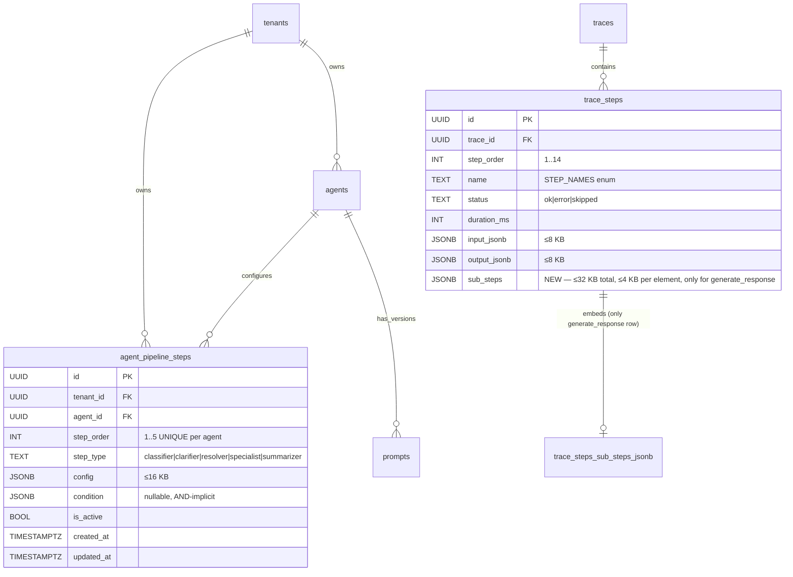

# Data Model — Phase 1: Agent Pipeline Steps

**Epic**: 015-agent-pipeline-steps
**Date**: 2026-04-27
**Scope**: 1 nova tabela (`agent_pipeline_steps`) + 1 ALTER em tabela existente (`trace_steps.sub_steps` JSONB).

---

## ER Diagram



---

## Migration 1: `20260601000010_create_agent_pipeline_steps.sql`

```sql
-- migrate:up
-- Epic 015 — Agent Pipeline Steps (sub-routing configurável por agente)
-- Materializa o schema-draft de domain-model.md linha 244 + ADR-006 (Agent-as-Data extensão).
-- Backward compatible: agentes sem rows nesta tabela executam exatamente como hoje (single LLM call).

CREATE TABLE IF NOT EXISTS public.agent_pipeline_steps (
    id          UUID        PRIMARY KEY DEFAULT gen_random_uuid(),
    tenant_id   UUID        NOT NULL REFERENCES public.tenants(id),
    agent_id    UUID        NOT NULL REFERENCES public.agents(id) ON DELETE CASCADE,
    step_order  INT         NOT NULL CHECK (step_order BETWEEN 1 AND 5),
    step_type   TEXT        NOT NULL CHECK (
        step_type IN ('classifier', 'clarifier', 'resolver', 'specialist', 'summarizer')
    ),
    config      JSONB       NOT NULL DEFAULT '{}'::jsonb
                            CHECK (octet_length(config::text) <= 16384),
    condition   JSONB,
    is_active   BOOLEAN     NOT NULL DEFAULT TRUE,
    created_at  TIMESTAMPTZ NOT NULL DEFAULT now(),
    updated_at  TIMESTAMPTZ NOT NULL DEFAULT now(),

    CONSTRAINT uq_pipeline_agent_order UNIQUE (agent_id, step_order)
);

-- Index para RLS filter pushdown + query principal do hot path
CREATE INDEX IF NOT EXISTS idx_pipeline_agent_active
    ON public.agent_pipeline_steps (agent_id, is_active, step_order);
CREATE INDEX IF NOT EXISTS idx_pipeline_tenant
    ON public.agent_pipeline_steps (tenant_id);

-- Row-Level Security — isolation per tenant (ADR-011)
ALTER TABLE public.agent_pipeline_steps ENABLE ROW LEVEL SECURITY;

DROP POLICY IF EXISTS tenant_isolation ON public.agent_pipeline_steps;
CREATE POLICY tenant_isolation ON public.agent_pipeline_steps
    USING (tenant_id = public.tenant_id())
    WITH CHECK (tenant_id = public.tenant_id());

-- Trigger para updated_at (assume função `set_updated_at` existente do epic 005)
DROP TRIGGER IF EXISTS trg_pipeline_steps_updated_at ON public.agent_pipeline_steps;
CREATE TRIGGER trg_pipeline_steps_updated_at
    BEFORE UPDATE ON public.agent_pipeline_steps
    FOR EACH ROW
    EXECUTE FUNCTION public.set_updated_at();

COMMENT ON TABLE public.agent_pipeline_steps IS
    'Epic 015: pipeline steps per agent (classifier→clarifier→resolver→specialist→summarizer). '
    'Zero rows = single LLM call (backward compatible). Max 5 steps per agent.';
COMMENT ON COLUMN public.agent_pipeline_steps.config IS
    'JSONB ≤16 KB. Schema depends on step_type. Validated in app via validate_steps_payload().';
COMMENT ON COLUMN public.agent_pipeline_steps.condition IS
    'JSONB AND-implícito, sintaxe {"path.to.value": "<op><literal>"}. '
    'Operadores: <, >, <=, >=, ==, !=, in. Sem OR/parens v1. NULL = sempre executa.';

-- migrate:down
DROP TRIGGER IF EXISTS trg_pipeline_steps_updated_at ON public.agent_pipeline_steps;
DROP POLICY IF EXISTS tenant_isolation ON public.agent_pipeline_steps;
DROP INDEX IF EXISTS public.idx_pipeline_tenant;
DROP INDEX IF EXISTS public.idx_pipeline_agent_active;
DROP TABLE IF EXISTS public.agent_pipeline_steps;
```

### Notes

- `ON DELETE CASCADE` no FK `agent_id` garante que ao deletar um agente, seus pipeline_steps somem juntos. Não há órfãos.
- `octet_length(config::text) <= 16384` é o cap de 16 KB validado no banco (defesa-em-profundidade — app valida antes).
- Sem cap em `condition` (assumido pequeno: dezenas de bytes, regra de 1-3 chaves).
- Constraint `step_order BETWEEN 1 AND 5` é a defesa de borda do `MAX_PIPELINE_STEPS_PER_AGENT = 5` constante em código. Insert de step 6 falha com check_violation.

### Validation rules (aplicadas no app — `validate_steps_payload`)

1. `len(steps) <= MAX_PIPELINE_STEPS_PER_AGENT (5)`.
2. `step_order` valores forman sequência `1..N` sem gaps nem duplicatas.
3. Cada `step_type ∈ {classifier|clarifier|resolver|specialist|summarizer}`.
4. `octet_length(config::text) <= 16384`.
5. Schema de `config` é validado contra Pydantic discriminated union (ver `apps/api/prosauai/admin/schemas/pipeline_steps.py`):
   - **classifier**: requer `model: str`, `intent_labels: list[str]` (≥2 entries), opcional `prompt_slug`, `timeout_seconds` (default 30, max 60).
   - **clarifier**: requer `model: str`, `prompt_slug: str` (referência válida em `prompts.version`), opcional `timeout_seconds`, `max_question_length` (default 140).
   - **resolver**: requer `model: str`, `prompt_slug`, opcional `tools_enabled: list[str]`, `timeout_seconds`.
   - **specialist**: requer `default_model: str`; opcional `routing_map: dict[str, str]` (intent→model), `prompt_slug`, `tools_enabled`, `timeout_seconds`. Cada `model` em `routing_map.values()` E `default_model` consultado contra `pricing.PRICING_TABLE` — modelo desconhecido → 422.
   - **summarizer**: requer `model: str`; opcional `max_input_messages` (default 20), `prompt_slug`, `timeout_seconds`.
6. `condition` JSONB:
   - Se presente, é `dict[str, str]`.
   - Cada `value` matches `^(<=|>=|!=|==|<|>|in)\s*(.+)$`.
   - Cada `key` é dotted path com componentes alphanumeric/underscore (ex: `classifier.confidence`, `context.message_count`).
7. Pelo menos 1 step de tipo `specialist`, `clarifier` ou `resolver` por pipeline (DEVE produzir resposta ao cliente). Erro 422 com mensagem "pipeline must end in a step that produces customer response".

---

## Migration 2: `20260601000011_alter_trace_steps_sub_steps.sql`

```sql
-- migrate:up
-- Epic 015 — Adiciona coluna sub_steps em trace_steps para registrar
-- pipeline executor sub-spans (classifier → clarifier → specialist).
-- Populada apenas no row name='generate_response' quando o agente tem pipeline_steps.
-- NULL em todos os outros casos (top-level rows + agentes single-call).

ALTER TABLE public.trace_steps
    ADD COLUMN IF NOT EXISTS sub_steps JSONB;

COMMENT ON COLUMN public.trace_steps.sub_steps IS
    'Epic 015: pipeline sub-spans for generate_response only. '
    'Capped at 32 KB total; each sub-step truncated to 4 KB by app. '
    'NULL when agent has no pipeline_steps (single-call path).';

-- migrate:down
ALTER TABLE public.trace_steps
    DROP COLUMN IF EXISTS sub_steps;
```

### Notes

- `ADD COLUMN IF NOT EXISTS` é idempotente (FR-072) e online em PG ≥11 (sem rewrite, sem lock pesado).
- Coluna sem RLS — herda regra do épico 008 (ADR-027): tabelas `public.trace_steps` são admin-only e acessadas via `pool_admin`.
- Sem índice (não há query case que filtre por `sub_steps`); filtros de Trace Explorer usam `output_jsonb->>'terminating_step'` na própria row.

---

## Sub-step JSONB shape (in-app)

Cada elemento do array `sub_steps` segue um schema espelhado ao `StepRecord` top-level, mas com campos limitados ao que faz sentido para sub-spans:

```jsonc
{
  "order": 1,                               // 1..5, ordem de execução
  "step_type": "classifier",                // classifier|clarifier|resolver|specialist|summarizer
  "status": "ok",                           // ok|error|skipped
  "duration_ms": 312,
  "started_at": "2026-04-27T15:23:01.123Z",
  "ended_at":   "2026-04-27T15:23:01.435Z",
  "model": "openai:gpt-5-nano",             // null para skipped
  "tokens_in": 124,
  "tokens_out": 18,
  "cost_usd": 0.000037,                     // calculado via pricing.calculate_cost()
  "input": { "user_message": "oi tudo bem?", "intent_labels": ["greeting","billing","..."] },
  "input_truncated": false,
  "output": { "intent": "greeting", "confidence": 0.94 },
  "output_truncated": false,
  "tool_calls": null,                       // só populado em resolver/specialist
  "condition_evaluated": null,              // string descrevendo a condição quando step skipped por condition
  "error_type": null,                       // populado quando status=error
  "error_message": null,
  "terminating": false                      // true se este step produziu a resposta final ao cliente
}
```

### Truncation rules

- Cada sub-step inteiro serializado a JSON: se `len(json_bytes) > 4096`, `input` e `output` são reduzidos para `{"truncated": true, "preview": "<first ~1.5KB>"}` separadamente (mesma lógica de `_truncate_value` em `step_record.py`).
- Após truncate por sub-step, o array completo é serializado: se `len > 32768`, manter os primeiros N que cabem + adicionar elemento sentinel `{"truncated_omitted_count": K}` no final.
- Métrica Prometheus `trace_steps_substeps_bytes_p95` adicionada para alertar se cap for ativado em prod.

---

## `messages.metadata` extension (sem migration)

Coluna `messages.metadata JSONB` já existe (épico 003 — multi-tenant foundation). Pipeline executor escreve campos adicionais:

```jsonc
{
  // ... campos existentes (channel, etc) ...
  "terminating_step": "clarifier",                 // string, qual step produziu a resposta
  "pipeline_step_count": 3,                        // int, quantos steps configurados
  "pipeline_version": "unversioned-v1"             // string, fixa "unversioned-v1" enquanto agent_config_versions não existe (D-PLAN-02)
}
```

**Para mensagens single-call (sem pipeline)**: nenhum desses 3 campos é escrito (FR-064).

---

## Volume estimates

| Entidade | Volume estável (steady state) |
|----------|-------------------------------|
| `agent_pipeline_steps` rows | ~30 (6 tenants × 5 steps max em adoção full) |
| `trace_steps.sub_steps` populated rows | ~30 k/dia × 30 d retention × ~2 KB/row = ~**1.8 GB** cumulativos |
| `trace_steps.sub_steps` NULL rows (single-call) | sem custo extra (NULL JSONB = ~1 byte) |
| `messages.metadata` size delta | ~80 bytes adicionais por mensagem outbound de pipeline (negligível) |

Cabe folgado no orçamento de storage do épico 008 (~10 GB). Métricas:
- `agent_pipeline_steps_count` (gauge per tenant).
- `trace_steps_substeps_count` (counter incrementado quando sub_steps populated).
- `trace_steps_substeps_bytes_p95` (histogram).

---

## Rollback path

Se este épico precisar ser revertido:

```sql
-- Desabilitar todos os pipelines sem deletar a tabela (rollback rápido)
UPDATE public.agent_pipeline_steps SET is_active = FALSE;
-- Pipeline executor vê 0 active steps → caminho default ativa.

-- Rollback completo (raro)
-- 1. Marcar feature flag desligada (se houver)
-- 2. Aplicar migrate:down dos 2 arquivos (drop column → drop table)
-- 3. Sub_steps históricos somem (aceitável — eram observability, não dados de negócio)
```

---

## References

- Domain model existente: [`platforms/prosauai/engineering/domain-model.md`](../../engineering/domain-model.md) §244 (schema-draft).
- Epic 008 trace_steps: `apps/api/db/migrations/20260420000002_create_trace_steps.sql`.
- Epic 005 agents: `apps/api/db/migrations/20260101000006_agents_prompts.sql`.
- StepRecord shape: `apps/api/prosauai/conversation/step_record.py`.
- ADR-027 (admin tables sem RLS), ADR-028 (fire-and-forget), ADR-029 (pricing constant).
