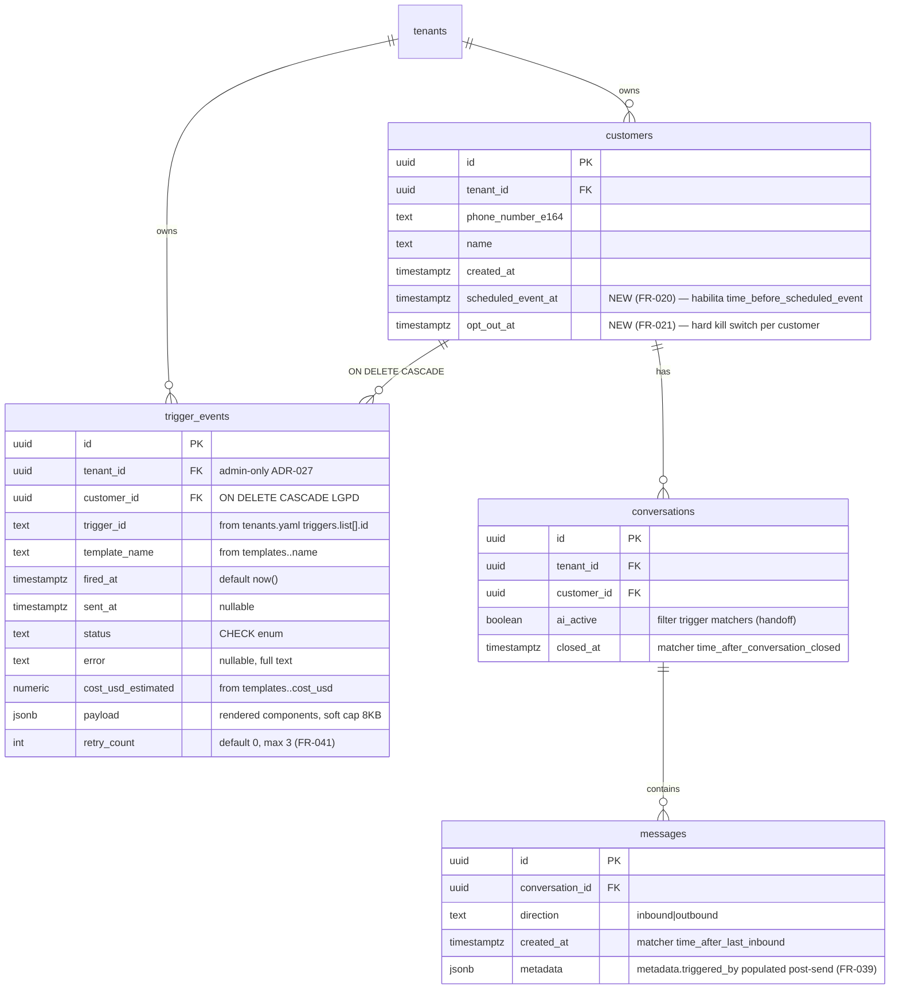
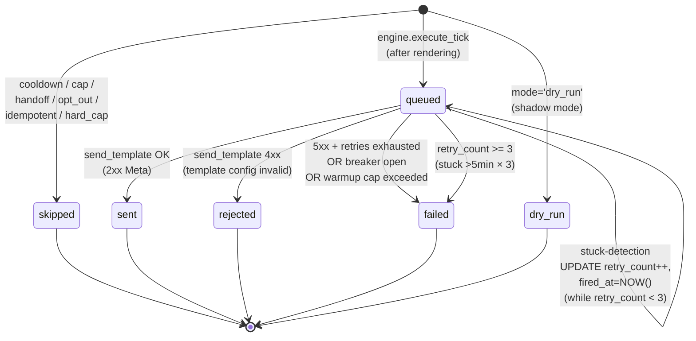

# Data Model — Epic 016 Trigger Engine

**Phase 1 output**. DDL completo, ER, cap policy, retention, indexes.

> Schema-of-truth: `apps/api/db/migrations/` em `paceautomations/prosauai`. Esta paginae **espelho** do que sera commitado em PR-A.1.

---

## 1. Migrations

### 1.1 `20260601000020_create_trigger_events.sql` (NEW)

```sql
-- Migration: 20260601000020 — create public.trigger_events
-- ADR-027: admin-only carve-out (sem RLS)
-- Append-only audit trail. Retention 90d via cron epic 006.
-- Idempotencia: partial UNIQUE INDEX em (tenant, customer, trigger_id, fired_at::date)
--   onde status IN ('sent', 'queued') — defesa em profundidade contra race condition.

-- migrate:up
CREATE TABLE public.trigger_events (
    id                  UUID PRIMARY KEY DEFAULT gen_random_uuid(),
    tenant_id           UUID NOT NULL REFERENCES public.tenants(id),
    customer_id         UUID NOT NULL REFERENCES public.customers(id) ON DELETE CASCADE,
    trigger_id          TEXT NOT NULL,
    template_name       TEXT NOT NULL,
    fired_at            TIMESTAMPTZ NOT NULL DEFAULT now(),
    sent_at             TIMESTAMPTZ,
    status              TEXT NOT NULL CHECK (status IN ('queued','sent','failed','skipped','rejected','dry_run')),
    error               TEXT,
    cost_usd_estimated  NUMERIC(10,4),
    payload             JSONB,
    retry_count         INT NOT NULL DEFAULT 0
);

-- Indexes
CREATE INDEX idx_trigger_events_tenant_fired
    ON public.trigger_events (tenant_id, fired_at DESC);

CREATE INDEX idx_trigger_events_customer_fired
    ON public.trigger_events (customer_id, fired_at DESC);

-- FR-017: idempotencia DB defense-in-depth
CREATE UNIQUE INDEX trigger_events_idempotency_idx
    ON public.trigger_events (tenant_id, customer_id, trigger_id, (fired_at::date))
    WHERE status IN ('sent', 'queued');

-- Suporte a stuck-detection (FR-041) — index parcial para hot rows
CREATE INDEX idx_trigger_events_stuck
    ON public.trigger_events (fired_at, retry_count)
    WHERE status = 'queued';

COMMENT ON TABLE public.trigger_events IS
    'Audit trail of proactive trigger executions. Admin-only (ADR-027 carve-out, no RLS). '
    'Retention 90d. SAR cascade via customer_id ON DELETE CASCADE.';

COMMENT ON COLUMN public.trigger_events.status IS
    'queued: persisted but not sent (stuck-detection scope). '
    'sent: Meta API confirmed. failed: 5xx/timeout after retries. '
    'skipped: cooldown/cap/handoff/opt_out/idempotent_db_race. '
    'rejected: Meta 4xx (template config invalid). '
    'dry_run: shadow mode (mode: dry_run on trigger config).';

COMMENT ON COLUMN public.trigger_events.retry_count IS
    'FR-041 stuck-detection counter. Incremented via UPDATE in-place when '
    'row stuck in status=queued >5min. Max 3 retries before status=failed.';

COMMENT ON COLUMN public.trigger_events.payload IS
    'Rendered template parameters (JSONB). Soft cap 8 KB enforced in app. '
    'Used for audit + drill-down in admin viewer.';

-- migrate:down
DROP TABLE public.trigger_events;
```

### 1.2 `20260601000021_alter_customers_add_scheduled_event_at.sql` (NEW)

```sql
-- Migration: 20260601000021 — add customers.scheduled_event_at
-- Habilita matcher time_before_scheduled_event (FR-020).
-- TIMESTAMPTZ obriga TZ explicito.

-- migrate:up
ALTER TABLE public.customers
    ADD COLUMN IF NOT EXISTS scheduled_event_at TIMESTAMPTZ;

-- Partial index: anti-bloat (NULL e maioria, exclui da arvore)
CREATE INDEX IF NOT EXISTS idx_customers_scheduled_event
    ON public.customers (tenant_id, scheduled_event_at)
    WHERE scheduled_event_at IS NOT NULL;

COMMENT ON COLUMN public.customers.scheduled_event_at IS
    'Optional next event timestamp (ResenhAI: next match; clinic: next consult). '
    'When set + customers.opt_out_at IS NULL, matcher time_before_scheduled_event '
    'fires N hours before.';

-- migrate:down
DROP INDEX IF EXISTS idx_customers_scheduled_event;
ALTER TABLE public.customers DROP COLUMN IF EXISTS scheduled_event_at;
```

### 1.3 `20260601000022_alter_customers_add_opt_out_at.sql` (NEW)

```sql
-- Migration: 20260601000022 — add customers.opt_out_at
-- Hard kill switch per customer (FR-021).
-- Sem index dedicado: uso e WHERE filter em queries de matcher (combo com tenant_id);
-- volume de opt_out e baixo (~1-5%) — full table scan filtra rapido com sequential prefetch.

-- migrate:up
ALTER TABLE public.customers
    ADD COLUMN IF NOT EXISTS opt_out_at TIMESTAMPTZ;

COMMENT ON COLUMN public.customers.opt_out_at IS
    'Customer opt-out timestamp. NULL = consenting. '
    'Set manually via PATCH /admin/customers/{id} (D-PLAN-09: '
    'NLP auto-detector deferred to 016.1+). '
    'Matchers always filter WHERE opt_out_at IS NULL when consent_required=true (default).';

-- migrate:down
ALTER TABLE public.customers DROP COLUMN IF EXISTS opt_out_at;
```

### 1.4 `20260601000023_extend_retention_cron_trigger_events.sql` (NEW)

```sql
-- Migration: 20260601000023 — extend retention cron (epic 006) for trigger_events
-- Adiciona DELETE statement para 90d retention.

-- migrate:up
-- Extend existing retention function from epic 006
CREATE OR REPLACE FUNCTION public.run_retention_cron()
RETURNS TABLE(table_name TEXT, deleted_count BIGINT)
LANGUAGE plpgsql
SECURITY DEFINER
AS $$
BEGIN
    -- ... existing retention logic from epic 006 ...

    -- NEW: trigger_events 90d
    RETURN QUERY
    WITH deleted AS (
        DELETE FROM public.trigger_events
        WHERE fired_at < NOW() - INTERVAL '90 days'
        RETURNING id
    )
    SELECT 'trigger_events'::TEXT, COUNT(*)::BIGINT FROM deleted;
END;
$$;

-- migrate:down
-- Restaura versao anterior (epic 006 schema dump). Ver runbook.
```

---

## 2. ER Diagram



---

## 3. Cap Policy

| Limite | Valor | Enforced em | Justificativa |
|--------|-------|-------------|---------------|
| Customers/trigger/tick | 100 | `LIMIT 100` SQL no matcher (defense layer 1) + Python `len(rows) <= 100` assertion | Anti-tsunami; protege contra config errado matchear 1000 customers |
| Cooldown default | 24h | `tenants.yaml triggers.list[].cooldown_hours` | Anti-spam per `(tenant, customer, trigger_id)` |
| Daily cap default | 3 proativos/customer/dia | `tenants.yaml triggers.daily_cap_per_customer` | Anti-ban global per customer |
| Retention `trigger_events` | 90 dias | Cron epic 006 (DELETE WHERE fired_at < NOW() - 90d) | LGPD + storage |
| Retention metricas Prometheus | 30 dias | Prometheus existing config | Suficiente para alert + analytics curto-prazo |
| `payload` JSONB soft cap | 8 KB | `pydantic.BaseModel.model_validate` em runtime | Anti-bloat; row payload audit, nao state |
| `error` text | 4 KB | `pydantic.BaseModel.model_validate` truncate | Anti-bloat; full Meta error message cabe |
| Cardinality Prometheus | <50K series total | Lint no startup (`metrics.py:cardinality_lint`) | Operacional Grafana / Prom retention |
| Cron tick duration | <2s p95 | Hard cap 100 + indexes + index-only scan | NFR matcher |
| Stuck-detection retry max | 3 | `retry_count < 3` query filter | Apos 3 retries, status=failed (sem retry infinito) |
| Cron cadence | 15s default, range [10s, 300s] | Pydantic validator | Lag aceitavel + custo Postgres |
| Cost gauge cadence | 60s default, range [30s, 600s] | Pydantic validator | Suficiente para alert >R$50/dia em 5min |

---

## 4. Storage Estimate

### 4.1 `trigger_events` projecao 30d

Assumindo:
- 6 tenants ativos
- 3 triggers ativos por tenant em media
- 100 customers/trigger/tick (cap)
- 4 ticks/min (15s cadence)
- 24h × 30d = 720h = 43.2K min

**Worst case rows/mes/tenant**:
3 triggers × 100 customers × 4 ticks/min × 60 min × 24h × 30d = **~38.4M rows/mes/tenant**

**Realistic (95% sao skipped por cooldown/cap/handoff/opt_out)**:
- 95% skipped (status='skipped', sem `payload` heavy) — ~36.5M × 200 bytes = ~7.3 GB/mes/tenant
- 5% sent/dry_run (com payload) — ~1.9M × 1500 bytes = ~2.85 GB/mes/tenant
- Total: ~10 GB/mes/tenant × 6 tenants × 3 (90d retention) = **~180 GB cumulativos**

**[VALIDAR] em load test**: estimativa pode ser 5-10x menor em producao real (poucos triggers ativos por tenant; muitos customers fora janela).

**Mitigacao caso real exceda**:
- Reduzir retention para 30d (ainda atende LGPD audit)
- Particionar tabela por mes (PG declarative partitioning)
- Reduzir hard cap para 50 customers/tick

### 4.2 Indexes overhead

| Index | Tamanho estimado (30d full retention) |
|-------|---------------------------------------|
| `idx_trigger_events_tenant_fired` | ~500 MB (uuid + timestamptz × 38M rows × 6 tenants) |
| `idx_trigger_events_customer_fired` | ~500 MB |
| `trigger_events_idempotency_idx` (partial sent/queued) | ~50 MB (5% rows match WHERE) |
| `idx_trigger_events_stuck` (partial queued) | <10 MB (stuck e raro) |

Total indexes ~1 GB cumulativos. Aceitavel.

### 4.3 `customers.scheduled_event_at` index

Partial index `WHERE scheduled_event_at IS NOT NULL`:
- Estimativa: 5-20% de customers tem evento agendado
- 100K customers × 15% × 16 bytes (uuid + timestamptz) = ~240 KB

Trivial.

---

## 5. Query plans esperados

### 5.1 Matcher `time_before_scheduled_event`

```sql
SELECT id, phone_number_e164, name, scheduled_event_at, created_at
FROM customers
WHERE scheduled_event_at >= $1 AND scheduled_event_at < $2
  AND opt_out_at IS NULL
ORDER BY created_at ASC
LIMIT 100
-- with SET LOCAL app.tenant_id = $tenant
```

**Plan esperado**:
```
Limit (100)
  -> Index Scan on idx_customers_scheduled_event (cost ~0.01ms)
       Index Cond: (tenant_id = current_setting('app.tenant_id')::uuid
                    AND scheduled_event_at >= $1
                    AND scheduled_event_at < $2)
       Filter: (opt_out_at IS NULL)
       Sort: (created_at ASC)
```

P95 esperado: <50ms.

### 5.2 Matcher `time_after_conversation_closed`

```sql
SELECT c.id, c.phone_number_e164, c.name, c.created_at, conv.closed_at
FROM customers c
INNER JOIN conversations conv ON conv.customer_id = c.id
WHERE conv.closed_at >= $1 AND conv.closed_at < $2
  AND conv.ai_active = TRUE
  AND c.opt_out_at IS NULL
ORDER BY c.created_at ASC
LIMIT 100
```

**Plan esperado**:
```
Limit (100)
  -> Nested Loop (cost ~5ms p/ 100 rows)
       -> Index Scan on conversations.closed_at idx
            Filter: (ai_active=true)
       -> Index Lookup on customers.id
            Filter: (opt_out_at IS NULL)
```

P95 esperado: <100ms.

### 5.3 Matcher `time_after_last_inbound`

```sql
WITH last_inbound AS (
    SELECT conversation_id, MAX(created_at) AS last_at
    FROM messages
    WHERE direction = 'inbound'
    GROUP BY conversation_id
)
SELECT c.id, c.phone_number_e164, c.name, li.last_at
FROM customers c
INNER JOIN conversations conv ON conv.customer_id = c.id
INNER JOIN last_inbound li ON li.conversation_id = conv.id
WHERE li.last_at >= $1 AND li.last_at < $2
  AND conv.closed_at IS NULL  -- conversa aberta
  AND conv.ai_active = TRUE
  AND c.opt_out_at IS NULL
ORDER BY c.created_at ASC
LIMIT 100
```

**Plan esperado**: CTE materialization + 2 nested loops. P95 esperado: <200ms.

**Otimizacao se exceder budget**: criar `messages.last_inbound_at` denormalizado em `conversations` (epic 008 padrao denormalizacao para inbox <100ms). Adiar para 016.1+ se PR-A perf test indicar.

### 5.4 Idempotency check (app-level FR-017 layer 1)

```sql
SELECT 1 FROM trigger_events
WHERE tenant_id = $1 AND customer_id = $2 AND trigger_id = $3
  AND fired_at::date = $4
  AND status IN ('sent', 'queued')
LIMIT 1
```

**Plan esperado**: Index Only Scan via `trigger_events_idempotency_idx`. P95 <1ms.

### 5.5 Admin viewer cursor pagination

```sql
SELECT te.id, te.tenant_id, te.customer_id, c.phone_number_e164,
       te.trigger_id, te.template_name, te.fired_at, te.sent_at,
       te.status, te.cost_usd_estimated, te.error, te.retry_count
FROM trigger_events te
JOIN customers c ON c.id = te.customer_id
WHERE te.tenant_id = $1
  AND (te.fired_at, te.id) < ($cursor_fired_at, $cursor_id)
  AND te.status = $2
ORDER BY te.fired_at DESC, te.id DESC
LIMIT 26
```

**Plan esperado**: Index Scan on `idx_trigger_events_tenant_fired` + JOIN. P95 <300ms (SC-006).

---

## 6. RLS Policies

### 6.1 `trigger_events` — admin-only (ADR-027 carve-out)

**Sem RLS habilitada**. Acesso garantido apenas via `pool_admin` (BYPASSRLS). Todas queries da admin API usam `pool_admin`.

```sql
-- Esta migration NAO inclui ENABLE ROW LEVEL SECURITY ou CREATE POLICY.
-- ADR-027 carve-out: tabelas de auditoria admin-only sem RLS.
-- pool_admin (BYPASSRLS) e o unico caminho de leitura/escrita.
-- engine.py escreve via pool_admin; matchers leem customers/conversations via pool_tenant (RLS).
```

### 6.2 `customers.scheduled_event_at` + `customers.opt_out_at`

Herdam RLS existente de `customers` (epic 003). Matchers usam `pool_tenant` com `SET LOCAL app.tenant_id`.

---

## 7. LGPD Cascading Behavior

### 7.1 SAR Delete

Quando operador executa `DELETE FROM customers WHERE id = $X` para SAR:
1. PG `ON DELETE CASCADE` em `trigger_events.customer_id` apaga **todos rows** daquele customer.
2. Audit trail per-customer e perdido (proposito da SAR).
3. Metricas operacionais agregadas (`trigger_cost_today_usd{tenant}` em Prometheus retention 30d) **permanecem intactas** — nao dependem de `customer_id`.
4. Nao ha trigger Postgres adicional — CASCADE e suficiente.

### 7.2 Retention 90d

Cron `run_retention_cron()` (epic 006 estendido) roda diariamente:
```sql
DELETE FROM public.trigger_events WHERE fired_at < NOW() - INTERVAL '90 days';
```

Sem condicional adicional. Index `idx_trigger_events_tenant_fired` suporta o range scan rapido.

### 7.3 `[VALIDAR]` DPO/juridico — anonimizacao alternativa

Se DPO/juridico requerer audit trail completo apos SAR (com PII redacted), 016.1+ implementa:
- Migration: `customer_id NULLABLE` (drop CASCADE).
- Trigger PG: BEFORE DELETE em `customers` → UPDATE `trigger_events SET customer_id=NULL, payload=jsonb_build_object('redacted', true)`.
- Admin viewer mostra `[REDACTED]` em rows com `customer_id IS NULL`.

Esta opcao adiada para 016.1 — DPO precisa confirmar requisito.

---

## 8. tenants.yaml schema (config)

> Esta nao e DDL Postgres mas e o schema da config persisted em `tenants.yaml` que o engine le.

```yaml
# Per-tenant section in tenants.yaml
<tenant_slug>:
  # ... existing tenant config (epic 003+) ...

  # NEW (epic 016)
  triggers:
    enabled: false                       # default OFF (per-tenant kill switch FR-005)
    cadence_seconds: 15                  # cron tick interval (range 10..300)
    cost_gauge_cadence_seconds: 60       # gauge update interval (range 30..600)
    daily_cap_per_customer: 3            # global cap (range 1..10)
    list:
      - id: ariel_match_reminder        # unique per tenant, regex ^[a-z][a-z0-9_]*$
        type: time_before_scheduled_event
        enabled: true
        mode: live                       # live | dry_run
        lookahead_hours: 1               # 0..168
        cooldown_hours: 24               # 1..720
        template_ref: match_reminder_pt  # MUST exist in templates.* (FR-042)
        match:
          intent_filter: any             # "any" or list[str]
          agent_id_filter: any           # "any" or list[uuid]
          min_message_count: 0           # >=0
          consent_required: true         # default true

  # NEW (epic 016)
  templates:
    match_reminder_pt:                   # key referenced by triggers.list[].template_ref
      name: ariel_match_reminder         # Meta template name (post-approval)
      language: pt_BR
      components:
        - type: body
          parameters:
            - type: text
              ref: "{{ customer.name }}"
            - type: text
              ref: "{{ customer.scheduled_event_at | format_time }}"
      approval_id: meta_approval_xyz123  # Meta Business Manager approval reference
      cost_usd: 0.0085                   # default 0.0085 (R$ ~0.05)
```

**Validacao Pydantic** (FR-004 + FR-042):
- Startup: `_validate_template_refs()` checa cross-ref. Falha → servico nao sobe.
- Hot reload: rejeita config invalida + alerta + mantem snapshot anterior.

---

## 9. Pydantic Models (apps/api/prosauai/triggers/models.py)

```python
from datetime import datetime
from decimal import Decimal
from enum import StrEnum
from typing import Literal
from uuid import UUID

from pydantic import BaseModel, Field, field_validator


class TriggerType(StrEnum):
    time_before_scheduled_event = "time_before_scheduled_event"
    time_after_conversation_closed = "time_after_conversation_closed"
    time_after_last_inbound = "time_after_last_inbound"
    # custom = "custom"  # 016.1+


class TriggerMode(StrEnum):
    live = "live"
    dry_run = "dry_run"


class TriggerStatus(StrEnum):
    queued = "queued"
    sent = "sent"
    failed = "failed"
    skipped = "skipped"
    rejected = "rejected"
    dry_run = "dry_run"


class TriggerMatch(BaseModel):
    intent_filter: list[str] | Literal["any"] = "any"
    agent_id_filter: list[UUID] | Literal["any"] = "any"
    min_message_count: int = Field(ge=0, default=0)
    consent_required: bool = True


class TriggerConfig(BaseModel):
    id: str = Field(min_length=1, max_length=80, pattern=r"^[a-z][a-z0-9_]*$")
    type: TriggerType
    enabled: bool = True
    mode: TriggerMode = TriggerMode.live
    lookahead_hours: int = Field(ge=0, le=168)
    cooldown_hours: int = Field(ge=1, le=720)
    template_ref: str = Field(min_length=1)
    match: TriggerMatch = TriggerMatch()


class TemplateComponent(BaseModel):
    type: Literal["body", "header", "footer", "button"]
    parameters: list[dict]  # passa direto para Meta — schema livre v1


class TemplateConfig(BaseModel):
    name: str = Field(min_length=1, max_length=100)
    language: str = Field(default="pt_BR", pattern=r"^[a-z]{2}_[A-Z]{2}$")
    components: list[TemplateComponent]
    approval_id: str = Field(min_length=1)
    cost_usd: Decimal = Field(ge=0, default=Decimal("0.0085"))


class TenantTriggersConfig(BaseModel):
    enabled: bool = False
    cadence_seconds: int = Field(ge=10, le=300, default=15)
    cost_gauge_cadence_seconds: int = Field(ge=30, le=600, default=60)
    daily_cap_per_customer: int = Field(ge=1, le=10, default=3)
    list: list[TriggerConfig] = Field(default_factory=list)


class TriggerEventRecord(BaseModel):
    """Mirror of public.trigger_events row."""
    id: UUID
    tenant_id: UUID
    customer_id: UUID
    trigger_id: str
    template_name: str
    fired_at: datetime
    sent_at: datetime | None = None
    status: TriggerStatus
    error: str | None = None
    cost_usd_estimated: Decimal | None = None
    payload: dict | None = None
    retry_count: int = 0


class CustomerMatch(BaseModel):
    """Output of matchers — enriched customer row."""
    id: UUID
    tenant_id: UUID
    phone_number_e164: str
    name: str | None = None
    scheduled_event_at: datetime | None = None
    created_at: datetime
    ai_active: bool = True
    opt_out_at: datetime | None = None
```

---

## 10. State machine (status transitions)



---

handoff:
  from: speckit.plan (data-model phase)
  to: speckit.plan (contracts phase)
  context: "DDL completo: 4 migrations (trigger_events + 2 customers ALTER + retention extension); ER + state machine; cap policy + storage estimate ~180 GB cumulativos 90d 6 tenants worst case (validar em load); query plans projetados para matchers + idempotency + admin viewer; LGPD CASCADE comportamento documentado; tenants.yaml schema + Pydantic models prontos."
  blockers: []
  confidence: Alta
  kill_criteria: "Schema invalido se: (a) load test mostrar trigger_events crescer >50GB em 30d com 6 tenants → reduzir retention 30d ou particionar; (b) DPO requerer anonimizacao em vez de delete → drop CASCADE + add trigger PG redact; (c) matcher time_after_last_inbound query plan exceder 500ms p95 → denormalizar messages.last_inbound_at em conversations."
