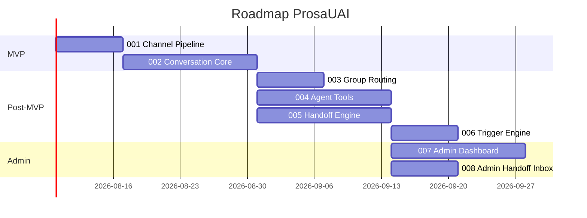
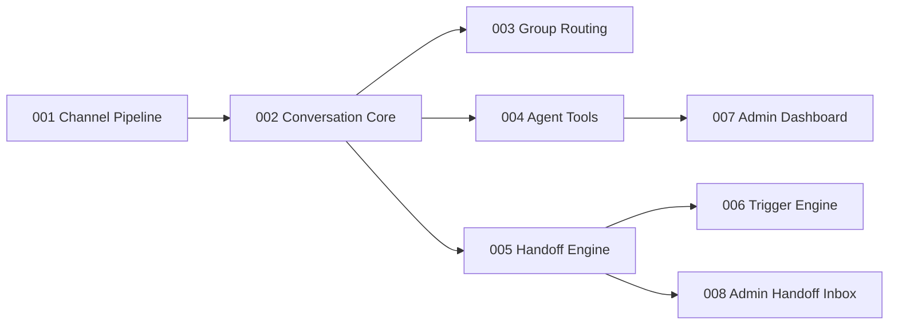

# ProsaUAI — Delivery Roadmap

> Sequenciamento de epics, milestones e definicao de MVP. Atualizado: 2026-04-07.

---

## Status

**Lifecycle:** design — nenhum codigo implementado ainda.
**L1 Pipeline:** 12/13 nodes completos. Revisao completa realizada em 2026-04-07.
**L1 Pendente:** codebase-map (opcional — plataforma greenfield, sem valor agregado).
**Proximo marco:** iniciar epic 001 (Channel Pipeline) via `/epic-context prosauai 001`.

---

## MVP

**MVP Epics:** 001-channel-pipeline + 002-conversation-core
**MVP Criterion:** Agente recebe mensagem WhatsApp, responde com IA (nao echo), persiste em BD.
**Total MVP Estimate:** ~3 semanas (1w + 2w)

---

## Delivery Sequence

---

## Epic Table

> **Convencao:** apenas o epic 001 tem pitch file criado. Demais sao sugestoes no roadmap — arquivos serao criados sob demanda quando o epic for iniciado via `/epic-context`.

| Ordem | Epic | Deps | Risco | Milestone | Status |
|-------|------|------|-------|-----------|--------|
| 1 | 001: Channel Pipeline | — | baixo | MVP | **proposed** (pitch criado) |
| 2 | 002: Conversation Core | 001 | medio | MVP | sugerido (sem arquivo) |
| 3 | 003: Group Routing | 002 | baixo | Post-MVP | sugerido |
| 4 | 004: Agent Tools | 002 | medio | Post-MVP | sugerido |
| 5 | 005: Handoff Engine | 002 | medio | Post-MVP | sugerido |
| 6 | 006: Trigger Engine | 005 | baixo | Post-MVP | sugerido |
| 7 | 007: Admin Dashboard | 004 | medio | Admin | sugerido |
| 8 | 008: Admin Handoff Inbox | 005 | baixo | Admin | sugerido |

### Epics Futuros (criados conforme necessidade)

| Epic | Descricao | Deps Provavel | Prioridade |
|------|-----------|---------------|------------|
| 009: Evals Offline | Score automatico por conversa (faithfulness, relevance, toxicity) | 002 | Next |
| 010: Evals Online | Guardrails pre/pos-LLM em tempo real | 002 | Next |
| 011: Data Flywheel | Ciclo semanal de melhoria com revisao humana | 009, 010 | Later |
| 012: Multi-Tenant Self-Service | Cadastro self-service, onboarding autonomo | 007 | Later |
| 013: RAG pgvector | Base de conhecimento com embeddings por tenant | 002 | Later |
| 014: Billing Stripe | Cobranca automatica com tiers e consumo medido | 012 | Later |
| 015: WhatsApp Flows | Formularios estruturados dentro do WhatsApp | 002 | Later |

---

## Dependencies

---

## Milestones

| Milestone | Epics | Criterio de Sucesso | Estimativa |
|-----------|-------|---------------------|------------|
| **MVP** | 001, 002 | Agente responde mensagens WhatsApp com IA, persiste conversas, funciona em grupo | ~3 semanas |
| **Post-MVP** | 003-006 | Routing de grupo, tools, handoff humano, triggers proativos | ~6 semanas |
| **Admin** | 007-008 | Dashboard + fila de atendimento humano funcionais | ~3 semanas |

---

## Riscos do Roadmap

| Risco | Impacto | Probabilidade | Mitigacao |
|-------|---------|---------------|-----------|
| Evolution API payload muda entre versoes | Medio | Media | Adapter pattern + testes com payloads reais |
| Custo LLM acima do esperado no MVP | Alto | Baixa | Bifrost com fallback Sonnet → Haiku |
| Complexidade de grupo subestimada | Medio | Media | Grupo separado em epic dedicado (003) |

---

*Proximos passos: L1 revisado e completo (12/13). Iniciar epic 001 via `/epic-context prosauai 001` para criar branch e entrar no ciclo L2.*

---

> **Proximo passo:** `/epic-context prosauai 001` — iniciar o ciclo L2 com o epic Channel Pipeline.
