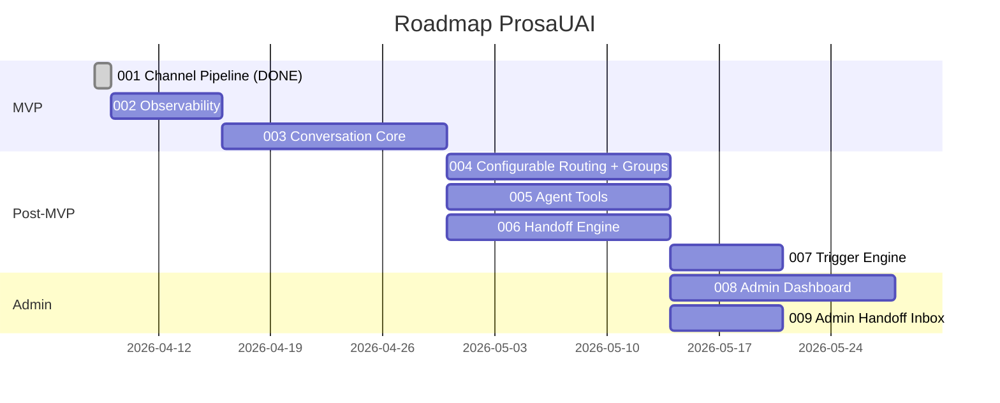
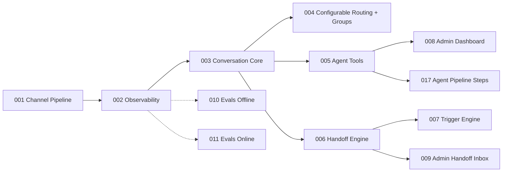

# ProsaUAI — Delivery Roadmap

> Sequenciamento de epics, milestones e definicao de MVP. Atualizado: 2026-04-10 (pos-epic 001 + insercao do 002-observability).

---

## Status

**Lifecycle:** building — epic 001 (Channel Pipeline) entregue 2026-04-09.
**L1 Pipeline:** 12/13 nodes completos. Revisao completa realizada em 2026-04-07.
**L1 Pendente:** codebase-map (opcional — plataforma greenfield, sem valor agregado).
**L2 Status:** Epic 001 shipped (52 tasks, 122 testes, judge 92%, QA 97%).
**Proximo marco:** iniciar epic 002 (Observability) via `/madruga:epic-context prosauai 002`.

---

## MVP

**MVP Epics:** 001-channel-pipeline + 002-observability + 003-conversation-core
**MVP Criterion:** Agente recebe mensagem WhatsApp, responde com IA (nao echo), persiste em BD, **com observabilidade total da jornada de cada mensagem desde o webhook ate a resposta enviada**.
**Total MVP Estimate:** ~4 semanas (1w done + 1w + 2w)
**Progresso MVP:** 33% (001 entregue, falta 002 + 003)

---

## Delivery Sequence

---

## Epic Table

> **Convencao:** apenas o epic 001 tem pitch file criado (shipped). Demais sao sugestoes no roadmap — arquivos serao criados sob demanda quando o epic for iniciado via `/madruga:epic-context`.
>
> **Renumeracao 2026-04-10:** Epic 002-observability inserido. Epics 002-008 anteriores foram bumpados para 003-009. ADR-007 (LangFuse v3) torna-se acionavel a partir do epic 002.

| Ordem | Epic | Deps | Risco | Milestone | Status |
|-------|------|------|-------|-----------|--------|
| 1 | 001: Channel Pipeline | — | baixo | MVP | **shipped** (52 tasks, 122 testes, judge 92%) |
| 2 | 002: Observability (LangFuse + OTel) | 001 | medio | MVP | **next** (proximo a iniciar) |
| 3 | 003: Conversation Core | 002 | medio | MVP | sugerido |
| 4 | 004: Configurable Routing + Groups | 003 | medio | Post-MVP | sugerido |
| 5 | 005: Agent Tools | 003 | medio | Post-MVP | sugerido |
| 6 | 006: Handoff Engine | 003 | medio | Post-MVP | sugerido |
| 7 | 007: Trigger Engine | 006 | baixo | Post-MVP | sugerido |
| 8 | 008: Admin Dashboard | 005 | medio | Admin | sugerido |
| 9 | 009: Admin Handoff Inbox | 006 | baixo | Admin | sugerido |

### Epics Futuros (criados conforme necessidade)

| Epic | Descricao | Deps Provavel | Prioridade |
|------|-----------|---------------|------------|
| 010: Evals Offline | Score automatico por conversa (faithfulness, relevance, toxicity) — **fundacao em 002** | 003, 002 | Next |
| 011: Evals Online | Guardrails pre/pos-LLM em tempo real — **traces em 002** | 003, 002 | Next |
| 012: Data Flywheel | Ciclo semanal de melhoria com revisao humana | 010, 011 | Later |
| 013: Multi-Tenant Self-Service | Cadastro self-service, onboarding autonomo | 008 | Later |
| 014: RAG pgvector | Base de conhecimento com embeddings por tenant | 003 | Later |
| 015: Billing Stripe | Cobranca automatica com tiers e consumo medido | 013 | Later |
| 016: WhatsApp Flows | Formularios estruturados dentro do WhatsApp | 003 | Later |
| 017: Agent Pipeline Steps | Pipeline de processamento configuravel por agente (classifier → clarifier → resolver → specialist) | 005 | Later |

---

## Dependencies

---

## Milestones

| Milestone | Epics | Criterio de Sucesso | Estimativa |
|-----------|-------|---------------------|------------|
| **MVP** | 001, 002, 003 | Agente responde mensagens WhatsApp com IA, persiste conversas, funciona em grupo, **com observabilidade total da jornada de cada mensagem** | ~4 semanas |
| **Post-MVP** | 004-007 | Routing configuravel por phone + grupos, tools, handoff humano, triggers proativos | ~7 semanas |
| **Admin** | 008-009 | Dashboard + fila de atendimento humano funcionais | ~3 semanas |

---

## Riscos do Roadmap

| Risco | Status | Impacto | Probabilidade | Mitigacao |
|-------|--------|---------|---------------|-----------|
| Evolution API payload muda entre versoes | **Mitigado (epic 001)** | Baixo | Baixa | Adapter pattern + 122 testes com fixtures reais |
| Custo LLM acima do esperado no MVP | Pendente (epic 003) | Alto | Baixa | Bifrost com fallback Sonnet → Haiku |
| Complexidade de grupo subestimada | **Eliminado (epic 001)** | — | — | Smart Router 6 rotas funcional |
| ClickHouse (LangFuse v3) ops complexity | Novo (epic 002) | Medio | Media | Profile docker-compose `obs`, fixar versoes, Phoenix como fallback documentado (ADR-007) |
| OTel overhead em hot path do webhook | Novo (epic 002) | Baixo | Baixa | Sampling configuravel + benchmark p50/p95/p99 antes/depois |
| Reconcile pendente do epic 001 (12 propostas) | Carregado (epic 002) | Baixo | — | Aplicar como primeira tarefa do epic 002 (status updates de docs) |

---

*Proximos passos: Epic 001 entregue. Iniciar epic 002 (Observability) via `/madruga:epic-context prosauai 002` para criar branch e entrar no ciclo L2.*

---

> **Proximo passo:** `/madruga:epic-context prosauai 002` — iniciar o ciclo L2 com o epic Observability (LangFuse v3 + OTel).
