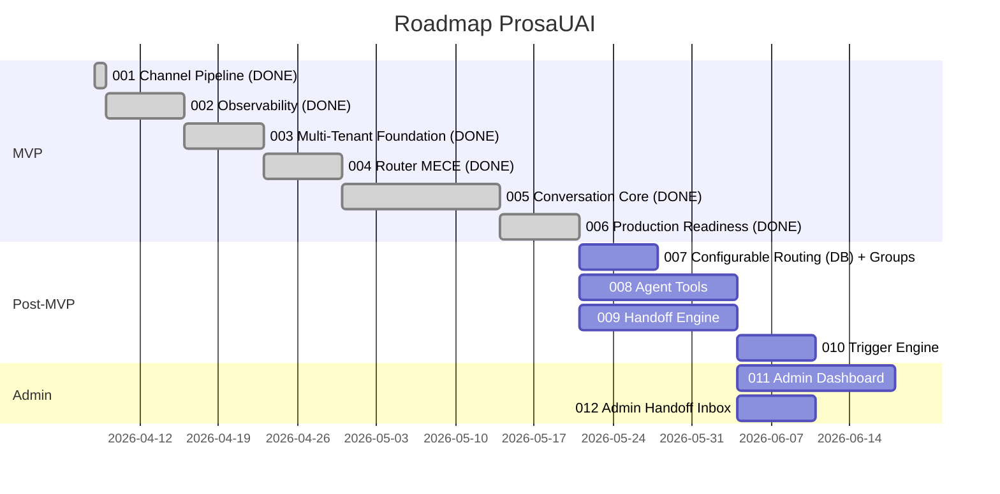
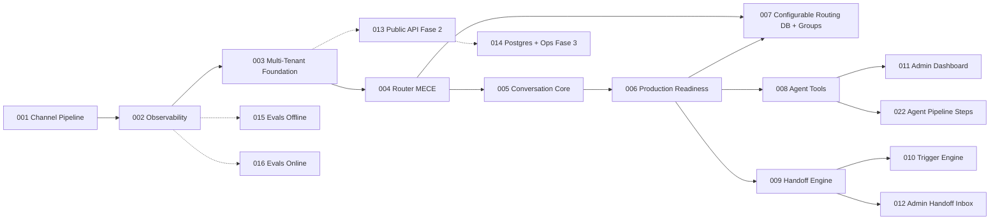

# ProsaUAI — Delivery Roadmap

> Sequenciamento de epics, milestones e definicao de MVP. Atualizado: 2026-04-13 (MVP completo — todos 6 epics shipped).

---

## Status

**Lifecycle:** building — **MVP completo** (6/6 epics shipped). Proximo: primeiro deploy de producao VPS.
**L1 Pipeline:** 12/13 nodes completos. Revisao completa realizada em 2026-04-07.
**L1 Pendente:** codebase-map (opcional — plataforma greenfield, sem valor agregado).
**L2 Status:** Epic 001 shipped (52 tasks, 122 testes, judge 92%, QA 97%). Epic 002 shipped (Phoenix + OTel). Epic 003 shipped (multi-tenant auth + parser reality + deploy). Epic 004 shipped (MECE routing engine + agent resolution). Epic 005 shipped (conversation pipeline 12-step, LLM agent pydantic-ai, safety guards, tool registry, 52 test files). Epic 006 shipped (schema isolation, migration runner, data retention, log persistence, host monitoring — 34 tasks, 67 testes, judge 88%, QA 100%).
**Proximo marco:** primeiro deploy de producao VPS (2 vCPU, 4GB RAM, 40GB SSD). Post-MVP: epic 007 (Configurable Routing DB + Groups).

---

## MVP

**MVP Epics:** 001-channel-pipeline + 002-observability + 003-multi-tenant-foundation + 004-router-mece + 005-conversation-core + 006-production-readiness
**MVP Criterion:** Agente recebe mensagem WhatsApp **multi-tenant** (>=2 instancias Evolution reais), parseia 100% dos payloads reais, responde com IA, persiste em BD, **com observabilidade total da jornada**, **router MECE provado em CI**, e **infra production-ready** (schema isolation, log persistence, data retention, host monitoring).
**Total MVP Estimate:** ~7-8 semanas (realizado)
**Progresso MVP:** **100%** (todos 6 epics shipped)

---

## Delivery Sequence

---

## Epic Table

> **Convencao:** apenas epics shipped/in-progress/drafted tem pitch file criado. Demais sao sugestoes — arquivos serao criados sob demanda quando o epic for iniciado via `/madruga:epic-context`.
>
> **Renumeracao 2026-04-10 (2a):** Slot 003 reservado para novo epic (escopo a definir pelo usuario). Router MECE movido de draft@003 para draft@004. Epics a partir do antigo 003 bumpados +2 (Conversation Core → 005, Configurable Routing → 006, etc.). Router MECE (004) reduz escopo do 006 drasticamente — engine declarativa ja entrega.
>
> **Definicao do slot 003 (2026-04-10):** epic 003 agora e **Multi-Tenant Foundation** (auth + parser reality fix + deploy isolado + tenant abstraction). Pre-requisito duro para 004+, baseado em [docs/prosauai/IMPLEMENTATION_PLAN.md](../../../docs/prosauai/IMPLEMENTATION_PLAN.md). Sequencia 003 + 004 e back-to-back, single prod deploy apos os dois mergerem. Fase 2 (Caddy + Admin API + rate limit) e Fase 3 (Postgres TenantStore + billing) **documentadas agora** em [ADR-021](../decisions/ADR-021-caddy-edge-proxy.md), [ADR-022](../decisions/ADR-022-admin-api.md), [ADR-023](../decisions/ADR-023-tenant-store-postgres-migration.md).
>
> **Renumeracao 2026-04-12 (3a):** Slot 006 inserido para **Production Readiness** (schema isolation, log persistence, data retention, particionamento, host monitoring, migration runner). Gaps identificados ao cruzar ADRs aprovados com estado real do codigo. Antigo 006 (Configurable Routing) → 007. Demais epics bumpados +1. Epics futuros re-referenciados.

| Ordem | Epic | Deps | Risco | Milestone | Status |
|-------|------|------|-------|-----------|--------|
| 1 | 001: Channel Pipeline | — | baixo | MVP | **shipped** (52 tasks, 122 testes, judge 92%) |
| 2 | 002: Observability (Phoenix + OTel) | 001 | medio | MVP | **shipped** (Phoenix + OTel SDK + structlog bridge) |
| 3 | 003: Multi-Tenant Foundation (auth + parser reality + deploy) | 002 | medio | MVP | **shipped** (TenantStore YAML, X-Webhook-Secret auth, 26 fixtures, idempotency Redis) |
| 4 | 004: Router MECE | 003 | medio | MVP | **shipped** (classify() + RoutingEngine declarativa, MECE 4 camadas, config YAML per-tenant) |
| 5 | 005: Conversation Core | 004 | medio | MVP | **shipped** (conversation pipeline 12-step, LLM agent pydantic-ai, safety guards 3-layer, tool registry, 52 test files) |
| 6 | 006: Production Readiness | 005 | baixo | MVP | **shipped** (schema isolation, migration runner, data retention LGPD, log persistence, host monitoring Netdata — 34 tasks, 67 testes, judge 88%, QA 100%) |
| 7 | 007: Configurable Routing (DB) + Groups | 004, 006 | baixo | Post-MVP | sugerido — escopo reduzido pelo 004 |
| 8 | 008: Agent Tools | 006 | medio | Post-MVP | sugerido |
| 9 | 009: Handoff Engine | 006 | medio | Post-MVP | sugerido |
| 10 | 010: Trigger Engine | 009 | baixo | Post-MVP | sugerido |
| 11 | 011: Admin Dashboard | 008 | medio | Admin | sugerido |
| 12 | 012: Admin Handoff Inbox | 009 | baixo | Admin | sugerido |

### Epics Futuros (criados conforme necessidade)

| Epic | Descricao | Deps Provavel | Prioridade |
|------|-----------|---------------|------------|
| 013: Multi-Tenant Public API (Fase 2) | Caddy edge proxy + admin API (CRUD tenants) + rate limiting per-tenant + onboarding externo. **Trigger: primeiro cliente externo pagante.** | 003, 012 | Later |
| 014: TenantStore Postgres + Ops (Fase 3) | Migracao YAML → Postgres com schema gerenciado; circuit breaker per-tenant; billing/usage tracking; alertas Prometheus. **Trigger: >=5 tenants reais ou dor operacional.** | 013, 018 | Later |
| 015: Evals Offline | Score automatico por conversa (faithfulness, relevance, toxicity) — **fundacao em 002** | 006, 002 | Next |
| 016: Evals Online | Guardrails pre/pos-LLM em tempo real — **traces em 002** | 006, 002 | Next |
| 017: Data Flywheel | Ciclo semanal de melhoria com revisao humana | 015, 016 | Later |
| 018: Multi-Tenant Self-Service | Cadastro self-service, onboarding autonomo (depende de Admin API do 013) | 013, 011 | Later |
| 019: RAG pgvector | Base de conhecimento com embeddings por tenant | 006 | Later |
| 020: Billing Stripe | Cobranca automatica com tiers e consumo medido | 014, 018 | Later |
| 021: WhatsApp Flows | Formularios estruturados dentro do WhatsApp | 006 | Later |
| 022: Agent Pipeline Steps | Pipeline de processamento configuravel por agente (classifier → clarifier → resolver → specialist) | 008 | Later |

---

## Dependencies

---

## Milestones

| Milestone | Epics | Criterio de Sucesso | Estimativa |
|-----------|-------|---------------------|------------|
| **MVP** | 001, 002, 003, 004, 005, 006 | ✅ **COMPLETO.** Agente responde mensagens WhatsApp **multi-tenant** com IA, parseia 100% dos payloads reais, persiste conversas, funciona em grupo, **com observabilidade total + router MECE provado em CI + infra production-ready** (schema isolation, logs, retention, monitoring) | realizado |
| **Post-MVP** | 007-010 | Routing configuravel via DB + grupos, tools, handoff humano, triggers proativos | ~6 semanas |
| **Admin** | 011-012 | Dashboard + fila de atendimento humano funcionais | ~3 semanas |
| **Public API (Fase 2)** | 013 | Caddy + Admin API + onboarding de cliente externo. Trigger: primeiro cliente pagante. | ~2 semanas |
| **Ops (Fase 3)** | 014 | TenantStore Postgres + circuit breaker + billing + alertas. Trigger: >=5 tenants reais ou dor operacional | ~3 semanas |

---

## Riscos do Roadmap

| Risco | Status | Impacto | Probabilidade | Mitigacao |
|-------|--------|---------|---------------|-----------|
| Evolution API payload muda entre versoes | **Mitigado (epic 001)** | Baixo | Baixa | Adapter pattern + 122 testes com fixtures reais |
| Custo LLM acima do esperado no MVP | **Parcialmente mitigado (epic 005)** | Medio | Baixa | pydantic-ai com modelo configuravel por agente + semaforo concorrencia (10). Bifrost (rate limit + spend cap) planejado para Fase 3 |
| Complexidade de grupo subestimada | **Eliminado (epic 001)** | — | — | Smart Router 6 rotas funcional |
| Observability ops complexity | **Mitigado (epic 002)** | Baixo | Baixa | Phoenix (Arize) substitui LangFuse — single container, Postgres backend, sem ClickHouse ([ADR-020](../decisions/ADR-020-phoenix-observability.md)) |
| OTel overhead em hot path do webhook | **Mitigado (epic 002)** | Baixo | Baixa | Sampling configuravel + BatchSpanProcessor fire-and-forget |
| Reconcile pendente do epic 001 (12 propostas) | **Eliminado (epic 002)** | — | — | Aplicado durante epic 002 |
| Router nao-MECE hardcoded bloqueia agent resolution | **Eliminado (epic 004)** | — | — | `classify()` puro + `RoutingEngine` declarativa + MECE 4 camadas (tipo/schema/runtime/CI). Agent resolution implementada |
| **Servico rejeita 100% dos webhooks reais (HMAC imaginario)** | **Eliminado (epic 003)** | — | — | X-Webhook-Secret per-tenant validado empiricamente com 2 tenants reais |
| **Parser falha em 50% das mensagens reais (messageType errados)** | **Eliminado (epic 003)** | — | — | 12 correcoes contra 26 fixtures capturadas reais; 13 tipos de mensagem suportados |
| Refactor multi-tenant posterior seria doloroso | **Eliminado (epic 003)** | — | — | Multi-tenant estrutural desde dia 1; 2 tenants reais (Ariel + ResenhAI) operando em paralelo |
| Merge conflict entre 003 (router T7) e 004 (router rip-and-replace) | **Eliminado** | — | — | Sequencia back-to-back executada sem conflitos |
| **Schema collision com Supabase (auth + public)** | **Mitigado (epic 006)** | — | — | Schemas dedicados `prosauai` + `prosauai_ops`. `public.tenant_id()` SECURITY DEFINER. Migrations idempotentes com `gen_random_uuid()` (sem `uuid-ossp`). [ADR-024](../decisions/ADR-024-schema-isolation.md) |
| **Disco VPS cheio (logs + Phoenix SQLite + pgdata)** | **Mitigado (epic 006)** | — | — | Log rotation Docker json-file (max 1.25GB stack). Phoenix Postgres backend em prod. Netdata host monitoring (:19999) |
| **LGPD non-compliance (sem purge de dados)** | **Mitigado (epic 006)** | — | — | retention-cron diario: DROP PARTITION messages, batch DELETE conversations/eval_scores/traces. `--dry-run` default. 17 testes. [ADR-018](../decisions/ADR-018-data-retention-lgpd.md) |

---

*MVP completo: todos 6 epics shipped (001-006). Proximo: primeiro deploy de producao VPS.*

---

> **Proximo passo:** Primeiro deploy de producao VPS (2 vCPU, 4GB RAM, 40GB SSD) com `docker compose -f docker-compose.yml -f docker-compose.prod.yml up`. Post-MVP: epic 007 (Configurable Routing DB + Groups) ou epic 008 (Agent Tools) conforme prioridade.
>
> **Supabase deployment readiness (epic 006):** Migrations hardened (idempotent, `gen_random_uuid()`, sem `uuid-ossp`), tenants table (008) created, dual slug/UUID tenant identity implemented. Schema isolation (`prosauai` + `prosauai_ops`) pronto para Supabase managed.
