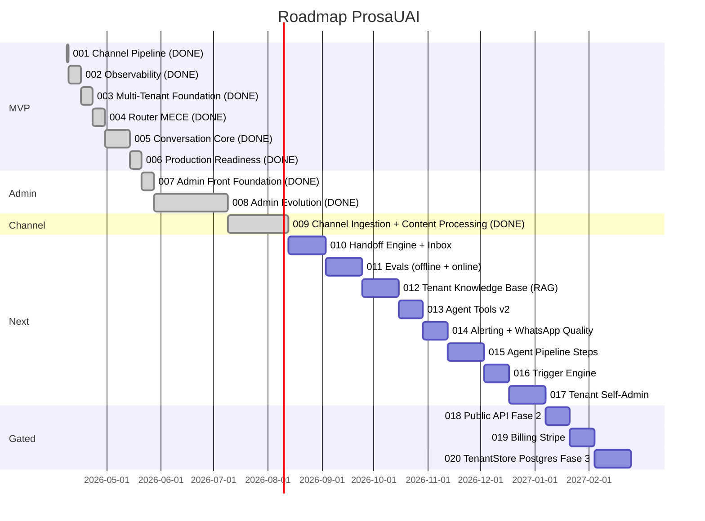
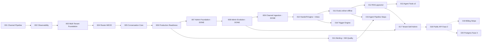

# ProsaUAI — Delivery Roadmap

> Sequenciamento de epics, milestones e definicao de MVP. Atualizado: 2026-04-22 (MVP + Admin + Channel Ingestion shipped; roadmap pos-MVP reordenado).

---

## Status

**Lifecycle:** building — **MVP completo** (6/6 epics shipped) + **Admin shipped** (007+008) + **Channel Ingestion shipped** (009, merged 2026-04-20). Proximo: epic 010 Handoff Engine + Inbox.
**L1 Pipeline:** 12/13 nodes completos. Revisao completa realizada em 2026-04-07.
**L1 Pendente:** codebase-map (opcional — plataforma greenfield, sem valor agregado).
**L2 Status:** Epic 001 shipped (52 tasks, 122 testes, judge 92%, QA 97%). Epic 002 shipped (Phoenix + OTel). Epic 003 shipped (multi-tenant auth + parser reality + deploy). Epic 004 shipped (MECE routing engine + agent resolution). Epic 005 shipped (conversation pipeline 12-step, LLM agent pydantic-ai, safety guards, tool registry, 52 test files). Epic 006 shipped (schema isolation, migration runner, data retention, log persistence, host monitoring — 34 tasks, 67 testes, judge 88%, QA 100%). Epic 007 shipped (admin front foundation — sidebar, login, pool_admin BYPASSRLS, dbmate migrations). Epic 008 shipped (Admin Evolution — 8 abas operacionais, 3 tabelas admin-only, ~25 endpoints, pipeline instrumentation fire-and-forget). **Epic 009 shipped** (Channel Ingestion + Content Processing — Canonical schema, Evolution+Meta Cloud adapters, 9 processors audio/image/document/sticker/location/contact/reaction/unsupported/text, feature flags per-tenant, budget + cache + circuit breaker).
**Proximo marco:** epic 010 (Handoff Engine + Inbox) — materializar `pending_handoff` no DB + UI atendente humano.

---

## MVP

**MVP Epics:** 001-channel-pipeline + 002-observability + 003-multi-tenant-foundation + 004-router-mece + 005-conversation-core + 006-production-readiness
**MVP Criterion:** Agente recebe mensagem WhatsApp **multi-tenant** (>=2 instancias Evolution reais), parseia 100% dos payloads reais, responde com IA, persiste em BD, **com observabilidade total da jornada**, **router MECE provado em CI**, e **infra production-ready** (schema isolation, log persistence, data retention, host monitoring).
**Total MVP Estimate:** ~7-8 semanas (realizado)
**Progresso MVP:** **100%** (todos 6 epics shipped)
**Post-MVP shipped:** 007 (Admin Foundation) + 008 (Admin Evolution) + 009 (Channel Ingestion + Content Processing — audio/imagem/documento funcionais end-to-end).

---

## Delivery Sequence

---

## Epic Table

> **Convencao:** apenas epics shipped/in-progress/drafted tem pitch file criado. Demais sao sugestoes — arquivos serao criados sob demanda quando o epic for iniciado via `/madruga:epic-context`.
>
> **Renumeracao 2026-04-10 (2a):** Slot 003 reservado para **Multi-Tenant Foundation**. Router MECE movido para 004. Epics antigos bumpados +2.
>
> **Renumeracao 2026-04-12 (3a):** Slot 006 inserido para **Production Readiness**. Demais epics bumpados +1.
>
> **Renumeracao 2026-04-17 (4a):** Slot 008 adotado para **Admin Evolution**. Slot 007 preenchido com "Admin Front Foundation". "Admin Dashboard" absorvido por 008.
>
> **Renumeracao 2026-04-22 (5a — pos-MVP reorder):** com 009 shipped (Channel Ingestion + Content Processing mergeado 2026-04-20), revisao completa do roadmap pos-MVP. Decisoes travadas: (a) Evals offline + online **fundidos** em epic 011 unico; (b) **RAG antes de Agent Tools v2** (destrava onboarding self-service); (c) cortes do antigo 017 Flywheel / 021 Flows / 022 Agent Pipeline / streaming transcription foram **movidos para backlog someday-maybe** com triggers explicitos (nao descartados); (d) numeracao reconciliada entre `roadmap.md`, `solution-overview.md` e `vision.md`. Ver proxima tabela "Epics Futuros" abaixo.

| Ordem | Epic | Deps | Risco | Milestone | Status |
|-------|------|------|-------|-----------|--------|
| 1 | 001: Channel Pipeline | — | baixo | MVP | **shipped** (52 tasks, 122 testes, judge 92%) |
| 2 | 002: Observability (Phoenix + OTel) | 001 | medio | MVP | **shipped** (Phoenix + OTel SDK + structlog bridge) |
| 3 | 003: Multi-Tenant Foundation | 002 | medio | MVP | **shipped** (TenantStore YAML, X-Webhook-Secret auth, 26 fixtures, idempotency Redis) |
| 4 | 004: Router MECE | 003 | medio | MVP | **shipped** (classify() + RoutingEngine declarativa, MECE 4 camadas, config YAML per-tenant) |
| 5 | 005: Conversation Core | 004 | medio | MVP | **shipped** (pipeline 12-step, LLM agent pydantic-ai, safety guards 3-layer, tool registry, 52 test files) |
| 6 | 006: Production Readiness | 005 | baixo | MVP | **shipped** (schema isolation, migration runner, data retention LGPD, log persistence, Netdata) |
| 7 | 007: Admin Front Foundation | 006 | baixo | Admin | **shipped** (sidebar+login Next.js 15, pool_admin BYPASSRLS, dbmate migrations) |
| 8 | 008: Admin Evolution | 006, 007 | medio | Admin | **shipped** (8 abas, 3 tabelas admin-only, ~25 endpoints, pipeline instrumentation fire-and-forget) |
| 9 | 009: Channel Ingestion + Content Processing | 008 | medio | Channel | **shipped** (Canonical schema, Evolution+Meta Cloud adapters, 9 processors, feature flags, budget, cache, circuit breaker — merged 2026-04-20) |
| 10 | **010: Handoff Engine + Inbox** | 009 | medio | Next | **next** — materializa `pending_handoff`, UI atendente humano, SLA + timeout→bot, notificacao realtime. Funde antigo "010 Handoff Engine" + "013 Admin Handoff Inbox". |
| 11 | 011: Evals (offline + online fundidos) | 002, 010 | medio | Next | suggested — faithfulness/relevance/toxicity por conversa + guardrails pre/pos-LLM em runtime. Funde antigo 015+016. |
| 12 | 012: Tenant Knowledge Base (RAG pgvector) | 006 | medio | Next | suggested — upload FAQ/catalogo via admin, retrieval no pipeline. Destrava onboarding self-service + sobe baseline de resolucao autonoma. Antigo 019 promovido. |
| 13 | 013: Agent Tools v2 | 011, 012 | medio | Next | suggested — conectores declarativos (estoque, agenda, CRM generico). Amplia `tools/registry.py` alem de `resenhai_rankings`. Antigo 009 renumerado. |
| 14 | 014: Alerting + WhatsApp Quality | 006 | medio | Next | suggested — Prometheus+Alertmanager, quality score poller, warm-up per-number, circuit breaker de send. Gate de producao para 1o cliente externo. |
| 15 | 015: Agent Pipeline Steps | 011, 014 | medio | Next | suggested — pipeline de processamento configuravel por agente (classifier → clarifier → resolver → specialist). Antigo 022 promovido. |
| 16 | 016: Trigger Engine | 010 | baixo | Next | suggested — PG LISTEN/NOTIFY → mensagens proativas (lembretes, follow-ups). Antigo 011 renumerado. |
| 17 | 017: Tenant Self-Admin | 008, 012 | medio | Next | suggested — scoped JWT + UI tenant-facing com subset das 8 abas + upload de KB. Pre-requisito real para billing e Fase 2 publica. |
| 18 | 018: Public API Fase 2 | 003, 017 | medio | Gated | **gate: 1o cliente externo pagante** — Caddy edge proxy + admin API + rate-limit per-tenant + onboarding externo. Antigo 013 Futuros. |
| 19 | 019: Billing Stripe | 017, 018 | medio | Gated | **gate: >=1 cliente pagando manualmente** — tiers + consumo medido. Antigo 020 Futuros. |
| 20 | 020: TenantStore Postgres Fase 3 | 018 | alto | Gated | **gate: >=5 tenants reais OU dor operacional** — migracao YAML→Postgres, circuit breaker per-tenant, billing events. Antigo 014 Futuros. |

### Backlog someday-maybe (nao cortados — promovem sob trigger)

| Epic backlog | Descricao | Trigger para promover |
|--------------|-----------|------------------------|
| Data Flywheel | Ciclo semanal de melhoria com revisao humana; detecta respostas fracas via evals e sugere correcoes de prompt | >=20 tenants gerando volume suficiente de conversas para revisao manter custo de review < valor da melhoria |
| WhatsApp Flows | Formularios estruturados (listas, botoes, templates aprovados) dentro do WhatsApp nativo | demanda real de cliente por captura estruturada OU tier Business exige Flows como diferencial |
| Streaming Transcription | Audio transcrito em tempo real durante a fala (em vez de apos fim do PTT) | p95 Whisper > 5s sustentado por 30d OU demanda recorrente de audios longos (>2min) em PT-BR |
| Multi-Tenant Self-Service Signup | Cadastro totalmente autonomo via web — sem onboarding humano | Public API Fase 2 estavel + admin manual virou gargalo (>=5 pedidos/semana) |
| Instagram DM + Telegram (novos inbound channels) | Reusa `ChannelAdapter` do 009 para canais adicionais | cliente real demanda canal nao-WhatsApp OU validacao arquitetural de multi-source vira prioridade |
| PDF Escaneado (OCR remoto) | OCR para PDFs digitalizados (boletos, contratos fotografados) — hoje retorna aviso | demanda de segmento Servicos/Juridico para leitura de documentos nao-texto-nativo |

> **Disciplina do backlog:** nenhum epic backlog vira "next" sem o trigger correspondente ser observado. Evita expansao especulativa de escopo.

---

## Dependencies

---

## Milestones

| Milestone | Epics | Criterio de Sucesso | Estimativa |
|-----------|-------|---------------------|------------|
| **MVP** | 001, 002, 003, 004, 005, 006 | ✅ **COMPLETO.** Agente responde mensagens WhatsApp **multi-tenant** com IA, parseia 100% dos payloads reais, persiste conversas, funciona em grupo, **com observabilidade total + router MECE provado em CI + infra production-ready** | realizado |
| **Admin** | 007, 008 | ✅ **COMPLETO.** 007 (foundation) + 008 (Admin Evolution — 8 abas operacionais). | realizado |
| **Channel** | 009 | ✅ **COMPLETO.** Canonical schema, Evolution+Meta Cloud adapters, 9 processors, feature flags per-tenant. | realizado |
| **Next (Human loop + qualidade)** | 010, 011, 012, 013, 014, 015, 016 | Handoff Engine + Inbox (010), Evals fundidos (011), RAG (012), Agent Tools v2 (013), Alerting + WA Quality (014), Agent Pipeline Steps (015), Trigger Engine (016). Destrava "IA e copiloto" + 70% resolucao autonoma medida + self-service onboarding. | ~18 semanas (1 dev FT) |
| **Tenant-facing** | 017 | Tenant Self-Admin (scoped JWT + UI tenant-facing). Pre-requisito para Public API e billing. | ~3 semanas |
| **Gated (comercial)** | 018, 019, 020 | **018:** Public API Fase 2 (trigger: 1o cliente externo pagante) · **019:** Billing Stripe (trigger: >=1 cliente pagando manualmente) · **020:** TenantStore Postgres Fase 3 (trigger: >=5 tenants OU dor operacional) | on-demand |

---

## Riscos do Roadmap

| Risco | Status | Impacto | Probabilidade | Mitigacao |
|-------|--------|---------|---------------|-----------|
| Evolution API payload muda entre versoes | **Mitigado (epic 001)** | Baixo | Baixa | Adapter pattern + 122 testes com fixtures reais |
| Custo LLM acima do esperado no MVP | **Parcialmente mitigado (epic 005)** | Medio | Baixa | pydantic-ai com modelo configuravel por agente + semaforo concorrencia (10). Bifrost (rate limit + spend cap) planejado para Fase 3 |
| Complexidade de grupo subestimada | **Eliminado (epic 001)** | — | — | Smart Router 6 rotas funcional |
| Observability ops complexity | **Mitigado (epic 002)** | Baixo | Baixa | Phoenix (Arize) substitui LangFuse — single container, Postgres backend, sem ClickHouse ([ADR-020](../decisions/ADR-020-phoenix-observability.md)) |
| OTel overhead em hot path do webhook | **Mitigado (epic 002)** | Baixo | Baixa | Sampling configuravel + BatchSpanProcessor fire-and-forget |
| Reconcile pendente do epic 001 (12 propostas) | **Eliminado (epic 002)** | — | — | Aplicado durante epic 002 |
| Router nao-MECE hardcoded bloqueia agent resolution | **Eliminado (epic 004)** | — | — | `classify()` puro + `RoutingEngine` declarativa + MECE 4 camadas (tipo/schema/runtime/CI). Agent resolution implementada |
| **Servico rejeita 100% dos webhooks reais (HMAC imaginario)** | **Eliminado (epic 003)** | — | — | X-Webhook-Secret per-tenant validado empiricamente com 2 tenants reais |
| **Parser falha em 50% das mensagens reais (messageType errados)** | **Eliminado (epic 003)** | — | — | 12 correcoes contra 26 fixtures capturadas reais; 13 tipos de mensagem suportados |
| Refactor multi-tenant posterior seria doloroso | **Eliminado (epic 003)** | — | — | Multi-tenant estrutural desde dia 1; 2 tenants reais (Ariel + ResenhAI) operando em paralelo |
| Merge conflict entre 003 (router T7) e 004 (router rip-and-replace) | **Eliminado** | — | — | Sequencia back-to-back executada sem conflitos |
| **Schema collision com Supabase (auth + public)** | **Mitigado (epic 006)** | — | — | Schemas dedicados `prosauai` + `prosauai_ops`. `public.tenant_id()` SECURITY DEFINER. Migrations idempotentes com `gen_random_uuid()` (sem `uuid-ossp`). [ADR-024](../decisions/ADR-024-schema-isolation.md) |
| **Disco VPS cheio (logs + Phoenix SQLite + pgdata)** | **Mitigado (epic 006)** | — | — | Log rotation Docker json-file (max 1.25GB stack). Phoenix Postgres backend em prod. Netdata host monitoring (:19999) |
| **LGPD non-compliance (sem purge de dados)** | **Mitigado (epic 006)** | — | — | retention-cron diario: DROP PARTITION messages, batch DELETE conversations/eval_scores/traces. `--dry-run` default. 17 testes. [ADR-018](../decisions/ADR-018-data-retention-lgpd.md) |
| **`pool_admin.max_size=5` esgota com 2-3 admins simultaneos** | **ABERTO (epic 008 B5)** | Alto | Alta | Aumentar `admin_pool_max_size` para 20 em `config.py` antes do merge; patch no repo externo `paceautomations/prosauai` |
| **8KB truncation de `trace_steps` pode ultrapassar limite em UTF-8 multibyte** | **ABERTO (epic 008 B3)** | Medio | Baixa | Fix em `step_record._truncate_value` (`ensure_ascii=False` + revalidacao de bytes); patch no repo externo |
| **`INSTRUMENTATION_ENABLED` kill switch ausente** | **ABERTO (epic 008 B1)** | Alto | Baixa | Adicionar env flag em `.env.example` + guard em `pipeline.py` e `trace_persist.py`; patch no repo externo |
| **`activate_prompt` sem INSERT em `audit_log`** | **ABERTO (epic 008 B2)** | Alto | Media | Adicionar INSERT em `agents.py:427-454`; patch no repo externo |
| **Phase 12 smoke (epic 008) nunca executado em container real** | **ABERTO (epic 008 B4)** | Alto | Certeza | Executar runbook `benchmarks/pipeline_instrumentation_smoke.md` no primeiro deploy staging |
| **Cost sparkline O(N) round-trips em dashboard** | **Aberto (epic 008 W2)** | Medio | Alta (hit em qualquer dashboard view) | Consolidar em single JOIN ou VIEW materializada; endereca em 010 ou patch dedicado |
| **ILIKE sem trigram GIN index degrada inbox >10k conversas** | **Aberto (epic 008 W7)** | Medio | Media | Adicionar `pg_trgm` + GIN index antes de 10k conversas; SC-005 inbox <100ms nao garantido em escala |
| **`pending_handoff` status existe no DB mas nao e materializado** | **Aberto — endereca em 010** | Alto | Certeza | Toda conversa que precisa de humano hoje fica em silencio. Epic 010 materializa engine + inbox para fechar o buraco |
| **Sem medicao de 70% resolucao autonoma (North Star da vision)** | **Aberto — endereca em 011** | Alto | Certeza | Vision promete 70% mas nao ha evals. Epic 011 funde offline+online para provar ou refutar a tese |
| **Onboarding <15 min impossivel sem RAG** | **Aberto — endereca em 012** | Alto | Alta | Cada tenant hoje exige YAML hand-crafted. Epic 012 (RAG pgvector) destrava upload FAQ/catalogo via admin |
| **Ban de numero WhatsApp sem monitoring** | **Aberto — endereca em 014** | Alto | Media | Risco #4 da vision. Epic 014 adiciona quality score poller + warm-up + circuit breaker de send |

---

*MVP + Admin + Channel completos (001-009 shipped). Proximo foco: Human loop + qualidade (010-016) para provar 70% resolucao autonoma e fechar buraco de handoff antes do primeiro cliente externo.*

---

> **Proximo passo:** iniciar epic 010 (Handoff Engine + Inbox) via `/madruga:epic-context 010`. Funde antigo "010 Handoff Engine" + "013 Admin Handoff Inbox" em um bundle unico mergeavel em `develop`. Racional: `pending_handoff` status ja existe no schema mas nao e materializado — toda conversa que precisa de humano hoje fica em silencio. Epic 010 fecha esse buraco com UI atendente + SLA + timeout→bot + notificacao realtime.
>
> **Supabase deployment readiness (epic 006):** Migrations hardened (idempotent, `gen_random_uuid()`, sem `uuid-ossp`), tenants table (008) created, dual slug/UUID tenant identity implemented. Schema isolation (`prosauai` + `prosauai_ops`) pronto para Supabase managed.
