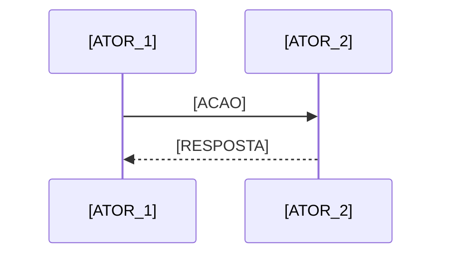

# ResenhAI — Business Process

> Fluxos core de negócio com happy path e exceções.

---

<!-- ACTION REQUIRED: Use `/business-process resenhai` para gerar automaticamente. -->
<!-- Cada fluxo deve ter: diagrama Mermaid (sequence), happy path, exceções, atores envolvidos. -->
<!-- CONVENÇÃO: O E2E flowchart deve anotar skills inline ("\n(/command)") e cada flow deve ter uma Skill Map table (ver pipeline-dag-knowledge.md). -->

## Fluxo 1: [NOME_DO_FLUXO]

### Diagrama

### Skill Map — Fluxo 1

<!-- Para fluxos do madruga pipeline: cada step mapeia para uma skill /command. Para fluxos de produto: deixar vazio ou marcar N/A. -->

| Step | Skill | Trigger | Output |
|------|-------|---------|--------|
| 1 | <!-- ex: /vision --> | <!-- evento que dispara --> | <!-- artefato gerado --> |

### Happy Path

1. <!-- Preencher -->

### Exceções

- <!-- Preencher -->
