# ResenhAI — Business Process

> Mapa de fluxos do ResenhAI no formato hybrid. **§0–§6** descrevem o pipeline de mensageria WhatsApp (recebe → valida → roteia → sincroniza → onboarding via OTP). **§7–§12** descrevem as jornadas user-facing que o jogador e o dono vivenciam no app (onboarding, resenha do dia a dia, registrar jogo, campeonato, cobrança). Catálogo de features → ver [solution-overview](./solution-overview/). Arquitetura técnica detalhada → ver [containers.md](../engineering/containers.md) e [domain-model.md](../engineering/domain-model.md).
>
> **Legenda**: ✅ IMPLEMENTADO · 🔄 EM EVOLUÇÃO · 📋 PLANEJADO

---

## 0. Visão Geral — o fluxo inteiro em uma tela

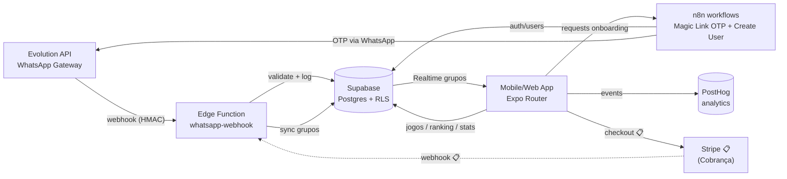
```mermaid
flowchart LR
    Evol[Evolution API<br/>WhatsApp Gateway]
    EF[Edge Function<br/>whatsapp-webhook]
    N8N[n8n workflows<br/>Magic Link OTP + Create User]
    Sup[(Supabase<br/>Postgres + RLS)]
    App[Mobile/Web App<br/>Expo Router]
    PH[(PostHog<br/>analytics)]
    Stripe["Stripe 📋<br/>(Cobrança)"]

    Evol -->|"webhook (HMAC)"| EF
    EF -->|"validate + log"| Sup
    EF -->|"sync grupos"| Sup
    App -->|"requests onboarding"| N8N
    N8N -->|"auth/users"| Sup
    N8N -->|"OTP via WhatsApp"| Evol
    App -->|"jogos / ranking / stats"| Sup
    App -->|"events"| PH
    App -->|"checkout 📋"| Stripe
    Stripe -.->|"webhook 📋"| EF
    Sup -->|"Realtime grupos"| App
```

🔍 Ver diagrama interno expandido (componentes de cada fase)

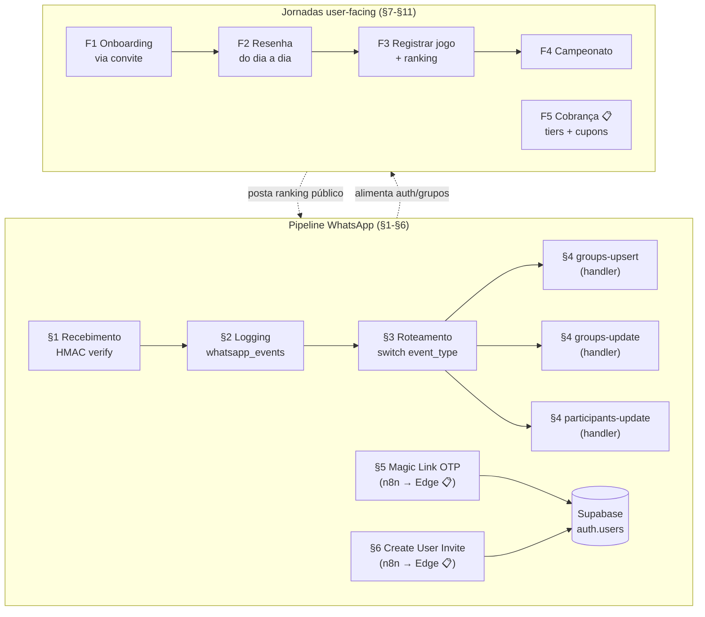
```mermaid
flowchart TB
    subgraph Pipeline["Pipeline WhatsApp (§1-§6)"]
        direction LR
        P1["§1 Recebimento<br/>HMAC verify"] --> P2["§2 Logging<br/>whatsapp_events"] --> P3["§3 Roteamento<br/>switch event_type"]
        P3 --> P4a["§4 groups-upsert<br/>(handler)"]
        P3 --> P4b["§4 groups-update<br/>(handler)"]
        P3 --> P4c["§4 participants-update<br/>(handler)"]
        P5["§5 Magic Link OTP<br/>(n8n → Edge 📋)"] --> Sup1[(Supabase<br/>auth.users)]
        P6["§6 Create User Invite<br/>(n8n → Edge 📋)"] --> Sup1
    end
    subgraph Journeys["Jornadas user-facing (§7-§11)"]
        direction LR
        F1["F1 Onboarding<br/>via convite"] --> F2["F2 Resenha<br/>do dia a dia"] --> F3["F3 Registrar jogo<br/>+ ranking"] --> F4["F4 Campeonato"]
        F5["F5 Cobrança 📋<br/>tiers + cupons"]
    end
    Pipeline -.->|"alimenta auth/grupos"| Journeys
    Journeys -.->|"posta ranking público"| Pipeline
```

> **Regra de ouro**: cada mensagem WhatsApp recebida produz exatamente uma resposta tipada (sucesso/erro), sempre via Evolution API. Toda mutação no banco é precedida de validação HMAC. Magic Link OTP é a **única** porta de entrada de novos usuários — falha aqui bloqueia onboarding inteiro.

**O que entra**: webhooks da Evolution API (`groups.upsert` / `groups.update` / `participants.update`); requests do app mobile/web (registrar jogo, criar campeonato, cobrança 📋); requests do app para n8n (Magic Link, Create User para convite).
**O que sai**: mensagens WhatsApp via Evolution (OTP, convites, ranking público diário/semanal); telas atualizadas no app (ranking, stats, histórico); webhooks Stripe 📋.
**Multi-tenant por construção**: tenant = **grupo**. RLS isola dados por `grupo_id` ou `user_id` em todas as tabelas (32 policies — codebase-context §7).
**Observabilidade passiva**: PostHog (eventos client-side); `whatsapp_events` (audit do pipeline); `admin_audit_log` (mutações sensíveis); `logger.ts` com PII masking obrigatório (CLAUDE.md:117-125).

---

## 1. Recebimento WhatsApp ✅

📊 Sequência — Evolution API entrega ao webhook

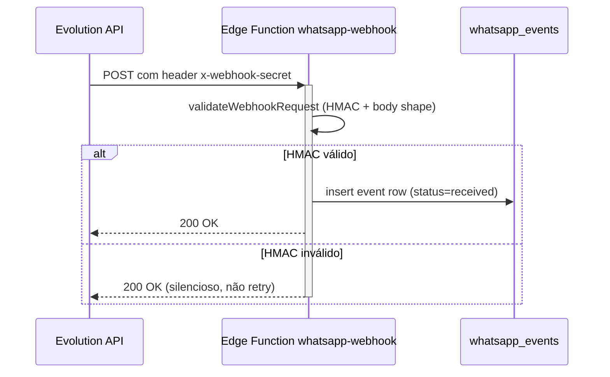
```mermaid
sequenceDiagram
    participant Evol as Evolution API
    participant EF as Edge Function whatsapp-webhook
    participant Log as whatsapp_events
    Evol->>+EF: POST com header x-webhook-secret
    EF->>EF: validateWebhookRequest (HMAC + body shape)
    alt HMAC válido
        EF->>Log: insert event row (status=received)
        EF-->>Evol: 200 OK
    else HMAC inválido
        EF-->>-Evol: 200 OK (silencioso, não retry)
    end
```

A Edge Function `whatsapp-webhook` (Deno, runtime Supabase) é a porta única do pipeline WhatsApp. Recebe todos os eventos da Evolution API, valida HMAC com `RESENHAI_WEBHOOK_SECRET` e responde **sempre 200** — mesmo em erro de roteamento, falhas vão para `whatsapp_events.error_message` (não bloqueia retry da Evolution e não vaza telemetria para o gateway).

**Entra**: payload Evolution `{event, instance, data: {...}}` + header `x-webhook-secret`.
**Transforma**: HMAC SHA256 verify; extração de `groupId`; normalização do evento.
**Sai**: 200 OK síncrono + dispatch assíncrono para handler.
**Persiste**: 1 row em `whatsapp_events` (raw payload + status para audit).
**Descarta**: requests com HMAC inválido (200 silencioso, sem persistência); requests com body malformado (loga em `error_message` mas responde 200).

---

## 2. Validação & Logging ✅

📊 Fluxograma — validação HMAC + audit

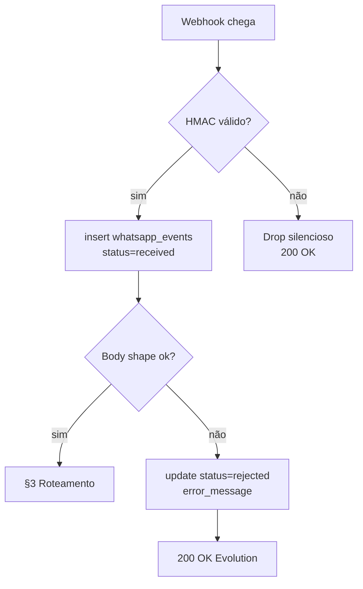
```mermaid
flowchart TD
    In[Webhook chega] --> V{HMAC válido?}
    V -->|"sim"| L[insert whatsapp_events<br/>status=received]
    V -->|"não"| Drop[Drop silencioso<br/>200 OK]
    L --> Body{Body shape ok?}
    Body -->|"sim"| Route[§3 Roteamento]
    Body -->|"não"| Err[update status=rejected<br/>error_message]
    Err --> Resp[200 OK Evolution]
```

A validação HMAC é o único gate antes de qualquer mutação. A regra "sempre 200" é deliberada: a Evolution API faz retry agressivo em qualquer status ≥ 300, e o pipeline prefere logar e seguir do que travar a fila do gateway.

**Entra**: request bruto + header HMAC.
**Transforma**: `validateWebhookRequest()` (HMAC SHA256) → checagem de campos obrigatórios.
**Sai**: payload normalizado para roteamento OU rejeição registrada.
**Persiste**: `whatsapp_events` row com `status` ∈ {`received`, `rejected`, `unhandled`, `processed`, `error`}.
**Descarta**: HMAC-inválidos não persistem (zero footprint de spam/ataque).

---

## 3. Roteamento de Eventos ✅

📊 Decisão — switch sobre event_type

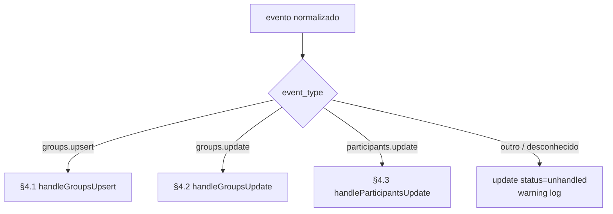
```mermaid
flowchart TD
    Ev["evento normalizado"] --> R{event_type}
    R -->|"groups.upsert"| H1[§4.1 handleGroupsUpsert]
    R -->|"groups.update"| H2[§4.2 handleGroupsUpdate]
    R -->|"participants.update"| H3[§4.3 handleParticipantsUpdate]
    R -->|"outro / desconhecido"| Un[update status=unhandled<br/>warning log]
```

O roteador é um switch determinístico. Cada handler é responsável por uma sub-operação atômica e idempotente — chamadas duplicadas pela Evolution API (retry em caso de timeout) não corrompem o estado.

**Entra**: `whatsapp_events` row com `event_type` ∈ {`groups.upsert`, `groups.update`, `participants.update`}.
**Transforma**: dispatch para handler dedicado (delegação).
**Sai**: chamada ao handler correspondente.
**Persiste**: — nada persiste aqui (handler persiste o efeito de domínio).
**Descarta**: eventos com `event_type` desconhecido (loga warning, marca `whatsapp_events.status='unhandled'`, sem ação).

---

## 4. Sincronização de Grupo (handlers) ✅

> **Regra de ouro**: o estado da tabela `grupos` deve refletir o estado real do grupo WhatsApp. Reconciliação roda a cada `groups.upsert` (idempotente). Participantes não-mapeados a `users.id` ficam em `pending_whatsapp_links` (TTL 30min auto-expire) até o cadastro completar.

📊 Sequência — handler groups-upsert (caminho mais quente)

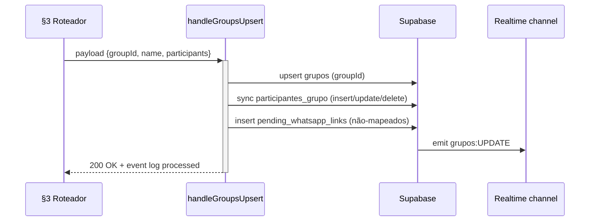
```mermaid
sequenceDiagram
    participant Disp as §3 Roteador
    participant H as handleGroupsUpsert
    participant DB as Supabase
    participant RT as Realtime channel
    Disp->>+H: payload {groupId, name, participants}
    H->>DB: upsert grupos (groupId)
    H->>DB: sync participantes_grupo (insert/update/delete)
    H->>DB: insert pending_whatsapp_links (não-mapeados)
    DB->>RT: emit grupos:UPDATE
    H-->>-Disp: 200 OK + event log processed
```

Os 3 handlers — `groups-upsert`, `groups-update`, `participants-update` — vivem em `supabase/functions/whatsapp-webhook/handlers/`. Cada um mantém um pedaço da tabela `grupos` em sincronia. O Realtime channel emite o evento de mudança, que dispara re-render no app de quem está com a tela de grupo aberta.

**Entra**: payload com `groupId`, `participants[]`, `name`, `avatarUrl`.
**Transforma**: upsert/update na tabela `grupos`; reconciliação de `participantes_grupo`; mapeamento telefone↔`users.id` (parcial — não-mapeados ficam pendentes).
**Sai**: row atualizada + canal Realtime emite evento → app sincroniza.
**Persiste**: `grupos` (upsert), `participantes_grupo` (insert/update/delete), `pending_whatsapp_links` (TTL 30min).
**Descarta**: participantes que não vinculam a `users.id` em 30min — TTL expira e a row é removida; usuário precisa reentrar no grupo para reativar o convite.

---

## 5. Geração Magic Link OTP 🔄 — débito epic-002-edge-migration

> **Regra de ouro**: É a **única** porta de entrada de novos usuários no produto. Falha aqui = onboarding bloqueado, conversão zero. Hoje roda em **n8n self-hosted** (Easypanel) — débito de consolidação para Edge Functions documentado no roadmap.

📊 Sequência — fluxo Magic Link OTP atual (n8n)

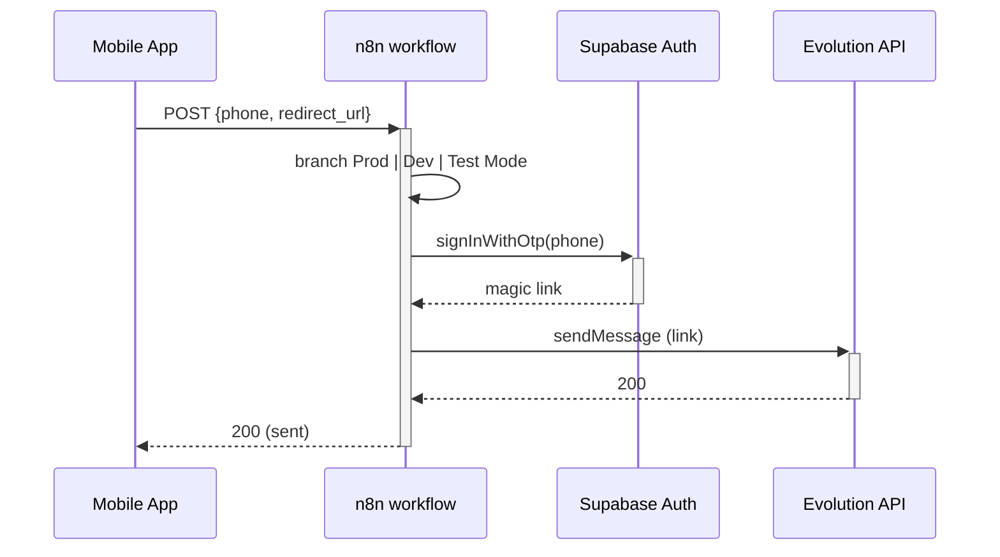
```mermaid
sequenceDiagram
    participant App as Mobile App
    participant N8N as n8n workflow
    participant Sup as Supabase Auth
    participant Evol as Evolution API
    App->>+N8N: POST {phone, redirect_url}
    N8N->>N8N: branch Prod | Dev | Test Mode
    N8N->>+Sup: signInWithOtp(phone)
    Sup-->>-N8N: magic link
    N8N->>+Evol: sendMessage (link)
    Evol-->>-N8N: 200
    N8N-->>-App: 200 (sent)
```

Workflow de 15 nós com branches `Prod`/`Dev`/`Test Mode` para isolar staging do envio real (test mode não chama Evolution). É o ponto mais frágil do pipeline — qualquer downtime do n8n trava signups novos. Migração para Edge Function elimina o terceiro componente, simplifica observabilidade e remove dependência de manutenção do contêiner Easypanel.

**Entra**: `{phone, redirect_url}` do app mobile (POST).
**Transforma**: branch ambiente → chama `auth.signInWithOtp()` no Supabase → envia magic link via Evolution.
**Sai**: 200 ao app (link enviado) ou erro tipado (`Respond Error Supabase` / `Respond Error WhatsApp`).
**Persiste**: `auth.users` (Supabase nativo); `users` via trigger `handle_new_user`.
**Descarta**: telefones sem opt-in WhatsApp registrado (Evolution rejeita, n8n loga e responde erro).

---

## 6. Criação de Auth User para Convite 🔄 — débito epic-002-edge-migration

📊 Sequência — fluxo Create User For Invite (n8n)

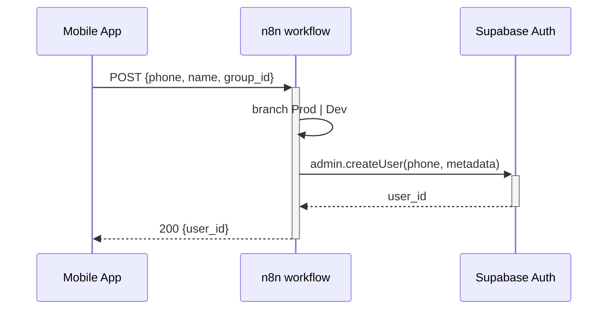
```mermaid
sequenceDiagram
    participant App as Mobile App
    participant N8N as n8n workflow
    participant Sup as Supabase Auth
    App->>+N8N: POST {phone, name, group_id}
    N8N->>N8N: branch Prod | Dev
    N8N->>+Sup: admin.createUser(phone, metadata)
    Sup-->>-N8N: user_id
    N8N-->>-App: 200 {user_id}
```

Workflow de 8 nós, mais simples que o Magic Link. Idempotente: se o telefone já tem `users.id`, retorna o existente em vez de criar duplicata. Mesmo débito de migração para Edge Function.

**Entra**: `{phone, name, group_id}` do fluxo de convite (F1).
**Transforma**: cria row em `auth.users` via Service Key admin; trigger `handle_new_user` cria `users` row e linka.
**Sai**: 200 com `user_id` ao app, que segue para anexar o user ao `participantes_grupo`.
**Persiste**: `auth.users`, `users` (via trigger).
**Descarta**: telefones já cadastrados retornam o `user_id` existente (não-erro, idempotente).

---

## 7. Jornadas do Usuário (user-journey)

> Daqui em diante, foco muda do pipeline para as jornadas que o usuário vivencia no app. Cada jornada referencia o pipeline acima onde aplicável (especialmente F1, que depende de §5 e §6).

### Visão End-to-End

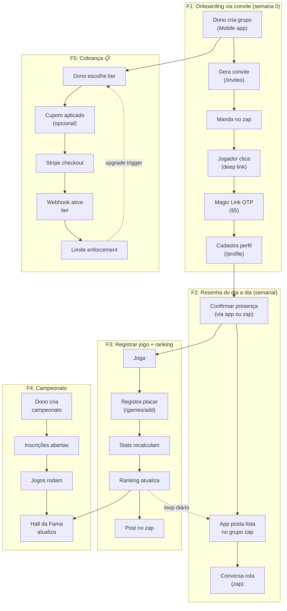
```mermaid
flowchart TB
    subgraph F1["F1: Onboarding via convite (semana 0)"]
        direction LR
        F1A["Dono cria grupo<br/>(Mobile app)"] --> F1B["Gera convite<br/>(/invites)"] --> F1C["Manda no zap"] --> F1D["Jogador clica<br/>(deep link)"] --> F1E["Magic Link OTP<br/>(§5)"] --> F1F["Cadastra perfil<br/>(/profile)"]
    end
    subgraph F2["F2: Resenha do dia a dia (semanal)"]
        direction LR
        F2A["Confirmar presença<br/>(via app ou zap)"] --> F2B["App posta lista<br/>no grupo zap"] --> F2C["Conversa rola<br/>(zap)"]
    end
    subgraph F3["F3: Registrar jogo + ranking"]
        direction LR
        F3A["Joga"] --> F3B["Registra placar<br/>(/games/add)"] --> F3C["Stats recalculam"] --> F3D["Ranking atualiza"] --> F3E["Post no zap"]
    end
    subgraph F4["F4: Campeonato"]
        direction LR
        F4A["Dono cria<br/>campeonato"] --> F4B["Inscrições abertas"] --> F4C["Jogos rodam"] --> F4D["Hall da Fama<br/>atualiza"]
    end
    subgraph F5["F5: Cobrança 📋"]
        direction LR
        F5A["Dono escolhe tier"] --> F5B["Cupom aplicado<br/>(opcional)"] --> F5C["Stripe checkout"] --> F5D["Webhook ativa<br/>tier"] --> F5E["Limite enforcement"]
    end
    F1F --> F2A
    F2A --> F3A
    F3D -.->|"loop diário"| F2B
    F3D --> F4D
    F1A --> F5A
    F5E -.->|"upgrade trigger"| F5A
```

### Flow Overview

| # | Flow | Atores | Frequência | Impacto |
|---|------|--------|-----------|---------|
| F1 | **Onboarding via convite WhatsApp** | Dono, Jogador novo | a cada novo membro `[VALIDAR — extraível: count(participantes_grupo) por grupo/mês]` | bloqueia adoção se §5/§6 falhar |
| F2 | **Resenha do dia a dia** | Jogador, Dono | semanal por grupo `[VALIDAR — extraível: posts ranking/grupo/semana]` | core de retenção e ritual |
| F3 | **Registrar jogo + atualização de ranking** | Jogador (qualquer membro) | múltiplas/semana `[VALIDAR — extraível: count(jogos) por grupo/semana]` | core do produto |
| F4 | **Campeonato — criar, inscrever, rodar, fechar** | Dono, Jogador | mensal/quinzenal `[VALIDAR — extraível: count(campeonatos ativos)]` | upsell tier Rei + retenção |
| F5 | **Cobrança & Upgrade (📋)** | Dono | uma vez + recorrente | destrava receita ativa |

### Skill Map por flow (resumo)

| Flow | Telas/áreas envolvidas (do app) | Pipeline backend |
|------|--------------------------------|------------------|
| F1 | `app/(auth)/*`, `app/(app)/groups/invite.tsx`, `services/supabase/invites.ts` | §5 OTP + §6 Create User + §4 sync grupo |
| F2 | `app/(app)/(tabs)/index.tsx` (presença), `services/whatsapp/sendMessage.ts` (post ranking) | (nenhum — leitura + push para WhatsApp) |
| F3 | `app/(app)/games/add.tsx`, `services/supabase/database.ts` (jogos+stats) | (nenhum — escrita direta + recálculo via SQL functions) |
| F4 | `app/(app)/management/resenha.tsx`, `components/management/CreateChampionshipModal.tsx` | (nenhum no caminho crítico) |
| F5 | 📋 `app/(app)/billing/*` (a criar), Stripe Checkout, webhook Stripe → §1 EF | 📋 epic-001-stripe |

---

## 8. Deep Dive — F1: Onboarding via convite WhatsApp

> Sem F1, não há produto. Cada novo membro depende de §5 (OTP) e §6 (Create User).

### Happy Path

📊 Sequência — convite até primeiro jogo registrado

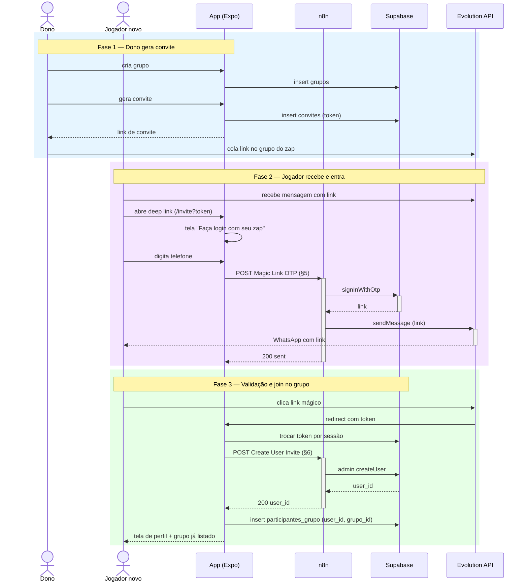
```mermaid
sequenceDiagram
    actor Dono
    actor Jogador as Jogador novo
    participant App as App (Expo)
    participant N8N as n8n
    participant Sup as Supabase
    participant Evol as Evolution API

    rect rgb(230, 245, 255)
    note over Dono, App: Fase 1 — Dono gera convite
    Dono->>App: cria grupo
    App->>Sup: insert grupos
    Dono->>App: gera convite
    App->>Sup: insert convites (token)
    App-->>Dono: link de convite
    Dono->>Evol: cola link no grupo do zap
    end

    rect rgb(245, 230, 255)
    note over Jogador, Evol: Fase 2 — Jogador recebe e entra
    Jogador->>Evol: recebe mensagem com link
    Jogador->>App: abre deep link (/invite?token)
    App->>App: tela "Faça login com seu zap"
    Jogador->>App: digita telefone
    App->>+N8N: POST Magic Link OTP (§5)
    N8N->>+Sup: signInWithOtp
    Sup-->>-N8N: link
    N8N->>+Evol: sendMessage (link)
    Evol-->>-Jogador: WhatsApp com link
    N8N-->>-App: 200 sent
    end

    rect rgb(230, 255, 230)
    note over Jogador, Sup: Fase 3 — Validação e join no grupo
    Jogador->>Evol: clica link mágico
    Evol->>App: redirect com token
    App->>Sup: trocar token por sessão
    App->>+N8N: POST Create User Invite (§6)
    N8N->>Sup: admin.createUser
    Sup-->>N8N: user_id
    N8N-->>-App: 200 user_id
    App->>Sup: insert participantes_grupo (user_id, grupo_id)
    App-->>Jogador: tela de perfil + grupo já listado
    end
```

**Premissas do flow:**
- Convite válido por 7 dias `[VALIDAR — checar TTL em supabase/migrations/*invite_link_multi_use*]`.
- Link de convite é multi-uso (até N redempções `[VALIDAR]`).
- `pending_whatsapp_links` cobre o gap entre clique e cadastro completo (TTL 30min).

### Exceções

📊 Sequência — exceções F1 (OTP falha, link expirou)

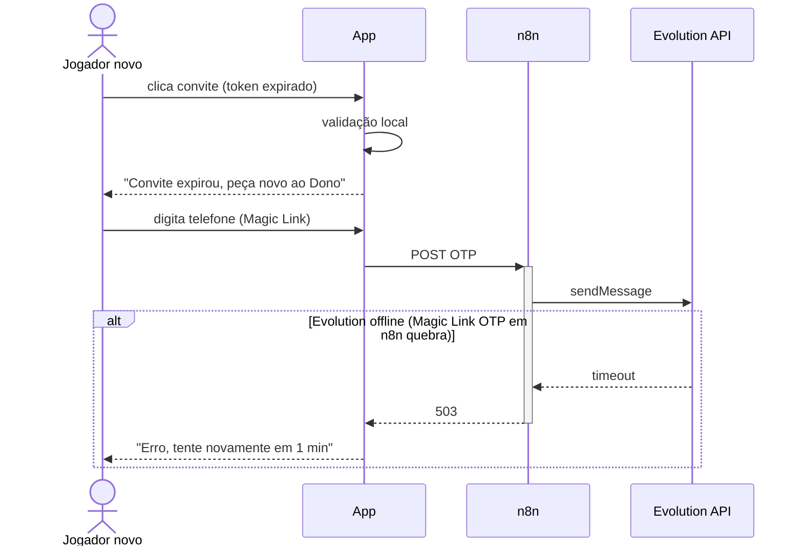
```mermaid
sequenceDiagram
    actor Jogador as Jogador novo
    participant App
    participant N8N as n8n
    participant Evol as Evolution API
    Jogador->>App: clica convite (token expirado)
    App->>App: validação local
    App-->>Jogador: "Convite expirou, peça novo ao Dono"
    Jogador->>App: digita telefone (Magic Link)
    App->>+N8N: POST OTP
    N8N->>Evol: sendMessage
    alt Evolution offline (Magic Link OTP em n8n quebra)
        Evol-->>N8N: timeout
        N8N-->>-App: 503
        App-->>Jogador: "Erro, tente novamente em 1 min"
    end
```

**Edge cases tratados**:
- Convite expirado → mensagem clara, sem retry automático.
- Telefone sem opt-in WhatsApp → Evolution rejeita; app sugere "abra primeiro o zap e mande qualquer mensagem para o número do bot".
- n8n offline → onboarding bloqueado por completo (motivação central do épico de migração).

---

## 9. Deep Dive — F2: Resenha do dia a dia

> Foco em **interações do dia/semana** entre jogos: confirmar presença, conversar no zap, ler o ranking público postado pelo app.

### Happy Path

📊 Sequência — semana típica de uma resenha

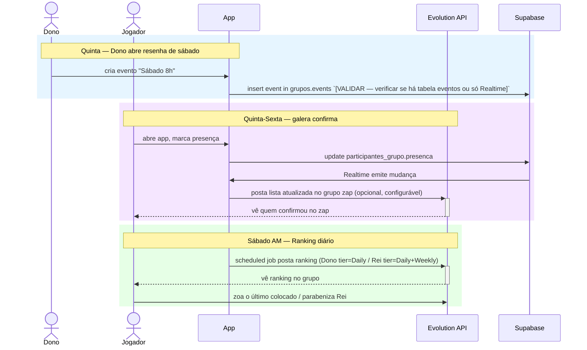
```mermaid
sequenceDiagram
    actor Dono
    actor Jogador
    participant App
    participant Evol as Evolution API
    participant Sup as Supabase

    rect rgb(230, 245, 255)
    note over Dono, App: Quinta — Dono abre resenha de sábado
    Dono->>App: cria evento "Sábado 8h"
    App->>Sup: insert event in grupos.events `[VALIDAR — verificar se há tabela eventos ou só Realtime]`
    end

    rect rgb(245, 230, 255)
    note over Jogador, Evol: Quinta-Sexta — galera confirma
    Jogador->>App: abre app, marca presença
    App->>Sup: update participantes_grupo.presenca
    Sup->>App: Realtime emite mudança
    App->>+Evol: posta lista atualizada no grupo zap (opcional, configurável)
    Evol-->>-Jogador: vê quem confirmou no zap
    end

    rect rgb(230, 255, 230)
    note over Jogador, Evol: Sábado AM — Ranking diário
    App->>+Evol: scheduled job posta ranking (Dono tier=Daily / Rei tier=Daily+Weekly)
    Evol-->>-Jogador: vê ranking no grupo
    Jogador->>Evol: zoa o último colocado / parabeniza Rei
    end
```

**Premissas do flow:**
- A scheduling do post de ranking diário ainda é **manual** ou via job externo `[VALIDAR — não encontrei scheduler em supabase/functions/]`.
- Tier Dono recebe post diário; tier Rei recebe diário + semanal (pricing.md:47, 67).

### Exceções

📊 Sequência — exceções F2 (Evolution offline, ninguém confirma)

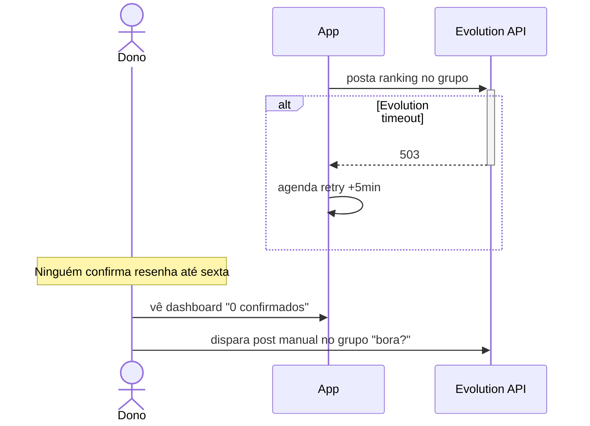
```mermaid
sequenceDiagram
    actor Dono
    participant App
    participant Evol as Evolution API
    App->>+Evol: posta ranking no grupo
    alt Evolution timeout
        Evol-->>-App: 503
        App->>App: agenda retry +5min
    end
    Note over Dono: Ninguém confirma resenha até sexta
    Dono->>App: vê dashboard "0 confirmados"
    Dono->>Evol: dispara post manual no grupo "bora?"
```

**Edge cases tratados**:
- Evolution timeout → retry com backoff exponencial.
- Resenha sem confirmação → produto não interrompe, Dono usa zap manual (vetor para feature futura: "lembrete inteligente").

---

## 10. Deep Dive — F3: Registrar jogo + atualização de ranking

> O loop core do produto. Cada partida disputada vira input. Stats e ranking são output em segundos.

### Happy Path

📊 Sequência — registrar 1 jogo

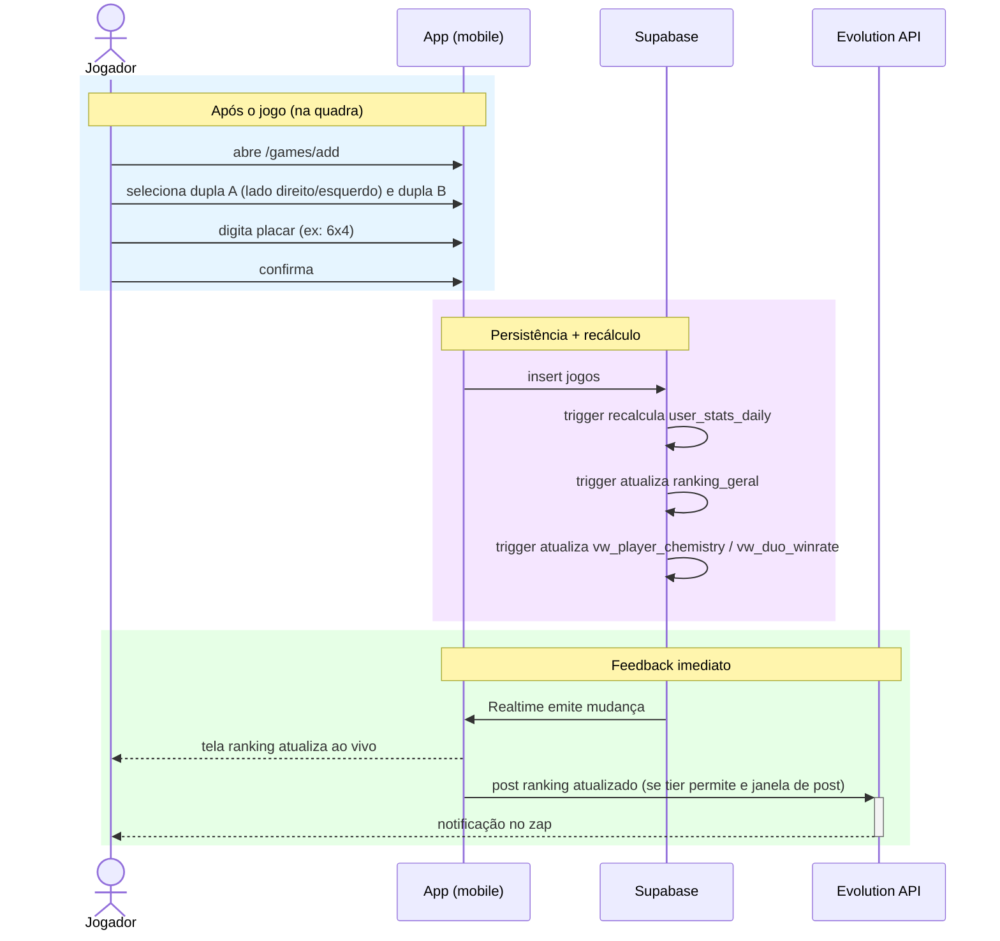
```mermaid
sequenceDiagram
    actor Jogador
    participant App as App (mobile)
    participant Sup as Supabase
    participant Evol as Evolution API

    rect rgb(230, 245, 255)
    note over Jogador, App: Após o jogo (na quadra)
    Jogador->>App: abre /games/add
    Jogador->>App: seleciona dupla A (lado direito/esquerdo) e dupla B
    Jogador->>App: digita placar (ex: 6x4)
    Jogador->>App: confirma
    end

    rect rgb(245, 230, 255)
    note over App, Sup: Persistência + recálculo
    App->>Sup: insert jogos
    Sup->>Sup: trigger recalcula user_stats_daily
    Sup->>Sup: trigger atualiza ranking_geral
    Sup->>Sup: trigger atualiza vw_player_chemistry / vw_duo_winrate
    end

    rect rgb(230, 255, 230)
    note over App, Evol: Feedback imediato
    Sup->>App: Realtime emite mudança
    App-->>Jogador: tela ranking atualiza ao vivo
    App->>+Evol: post ranking atualizado (se tier permite e janela de post)
    Evol-->>-Jogador: notificação no zap
    end
```

**Premissas do flow:**
- Recálculo de stats é **síncrono via SQL functions/triggers** (codebase-context.md §7: 48 funções/triggers).
- Tabela `jogos` persiste cada partida; views (22) calculam stats agregadas em leitura.
- Ranking é uma view (`ranking_geral`), não uma tabela materializada `[VALIDAR — confirmar se é view ou matview]`.

### Exceções

📊 Sequência — exceções F3 (jogo duplicado, placar inválido)

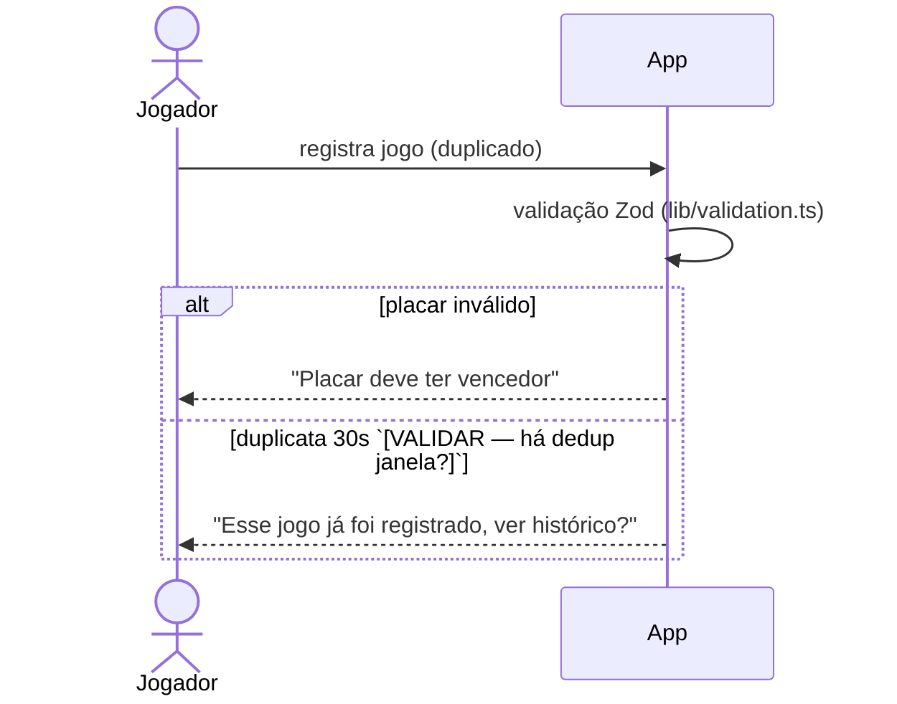
```mermaid
sequenceDiagram
    actor Jogador
    participant App
    Jogador->>App: registra jogo (duplicado)
    App->>App: validação Zod (lib/validation.ts)
    alt placar inválido
        App-->>Jogador: "Placar deve ter vencedor"
    else duplicata 30s `[VALIDAR — há dedup janela?]`
        App-->>Jogador: "Esse jogo já foi registrado, ver histórico?"
    end
```

**Edge cases tratados**:
- Placar inválido (Zod schema em `lib/validation.ts:1-1212`).
- Tentativa de registrar jogo em grupo onde Jogador não é membro (RLS bloqueia).
- Edição posterior de placar `[VALIDAR — checar se há fluxo de "corrigir jogo" ou só admin]`.

---

## 11. Deep Dive — F4: Campeonato

> Camada acima de F3. Reúne jogos sob um campeonato, com inscrição, regulamento e Hall da Fama no fim.

### Happy Path

📊 Sequência — ciclo de vida do campeonato

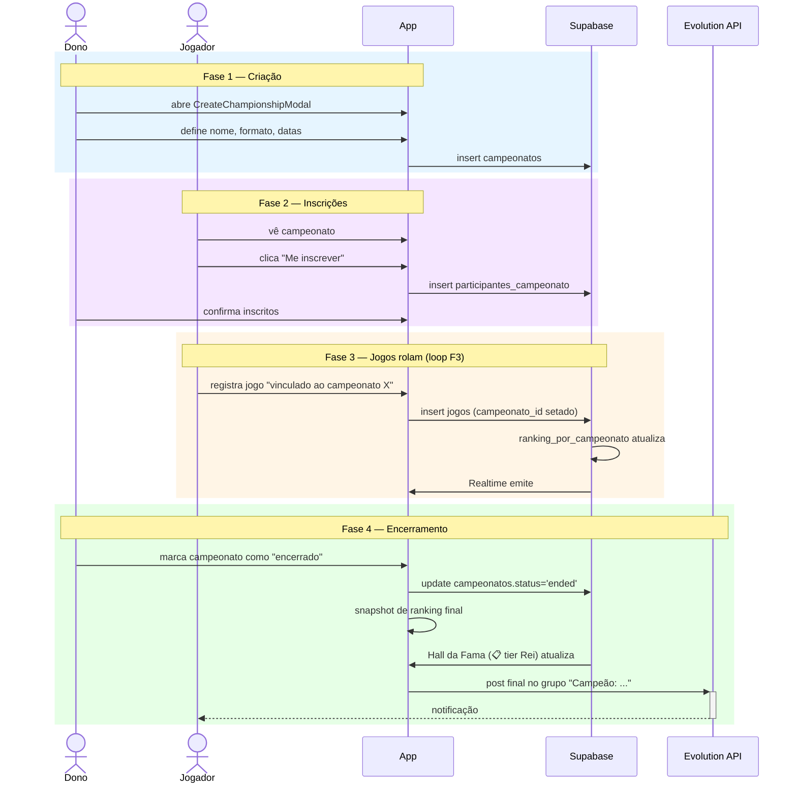
```mermaid
sequenceDiagram
    actor Dono
    actor Jogador
    participant App
    participant Sup as Supabase
    participant Evol as Evolution API

    rect rgb(230, 245, 255)
    note over Dono, App: Fase 1 — Criação
    Dono->>App: abre CreateChampionshipModal
    Dono->>App: define nome, formato, datas
    App->>Sup: insert campeonatos
    end

    rect rgb(245, 230, 255)
    note over Jogador, App: Fase 2 — Inscrições
    Jogador->>App: vê campeonato
    Jogador->>App: clica "Me inscrever"
    App->>Sup: insert participantes_campeonato
    Dono->>App: confirma inscritos
    end

    rect rgb(255, 245, 230)
    note over Jogador, Sup: Fase 3 — Jogos rolam (loop F3)
    Jogador->>App: registra jogo "vinculado ao campeonato X"
    App->>Sup: insert jogos (campeonato_id setado)
    Sup->>Sup: ranking_por_campeonato atualiza
    Sup->>App: Realtime emite
    end

    rect rgb(230, 255, 230)
    note over Dono, Evol: Fase 4 — Encerramento
    Dono->>App: marca campeonato como "encerrado"
    App->>Sup: update campeonatos.status='ended'
    App->>App: snapshot de ranking final
    Sup->>App: Hall da Fama (📋 tier Rei) atualiza
    App->>+Evol: post final no grupo "Campeão: ..."
    Evol-->>-Jogador: notificação
    end
```

**Premissas do flow:**
- Ranking por campeonato é incremental (cada jogo vinculado atualiza `vw_player_*` filtrado por campeonato).
- Hall da Fama é **feature de tier Rei** (📋 epic-001-stripe).
- Limite de campeonatos ativos: **1 no Dono / 10 no Rei** (pricing.md:46, 64).

### Exceções

**Edge cases tratados** (sem diagrama dedicado — texto):
- Tentativa de criar campeonato além do limite do tier → modal de upgrade (📋 quando F5 estiver live).
- Inscrição em campeonato sem ser membro do grupo → bloqueio por RLS.
- Encerramento sem jogos registrados → permitido (campeonato "esvaziado" fica visível no histórico).

---

## 12. Deep Dive — F5: Cobrança & Upgrade 📋 epic-001-stripe

> Toda esta seção é planejada. Sem cobrança ativa hoje. Será o épico que destrava receita.

### Happy Path planejado

📊 Sequência — Dono escolhe tier + paga + recebe acesso

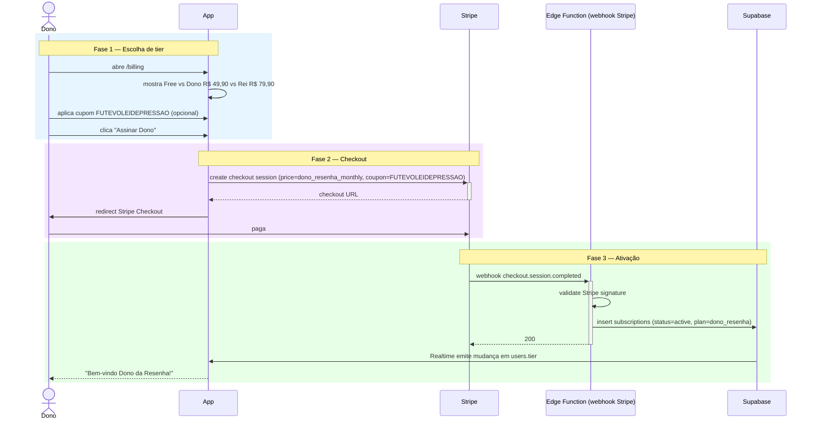
```mermaid
sequenceDiagram
    actor Dono
    participant App
    participant Stripe
    participant EF as Edge Function (webhook Stripe)
    participant Sup as Supabase

    rect rgb(230, 245, 255)
    note over Dono, App: Fase 1 — Escolha de tier
    Dono->>App: abre /billing
    App->>App: mostra Free vs Dono R$ 49,90 vs Rei R$ 79,90
    Dono->>App: aplica cupom FUTEVOLEIDEPRESSAO (opcional)
    Dono->>App: clica "Assinar Dono"
    end

    rect rgb(245, 230, 255)
    note over App, Stripe: Fase 2 — Checkout
    App->>+Stripe: create checkout session (price=dono_resenha_monthly, coupon=FUTEVOLEIDEPRESSAO)
    Stripe-->>-App: checkout URL
    App->>Dono: redirect Stripe Checkout
    Dono->>Stripe: paga
    end

    rect rgb(230, 255, 230)
    note over Stripe, Sup: Fase 3 — Ativação
    Stripe->>+EF: webhook checkout.session.completed
    EF->>EF: validate Stripe signature
    EF->>Sup: insert subscriptions (status=active, plan=dono_resenha)
    EF-->>-Stripe: 200
    Sup->>App: Realtime emite mudança em users.tier
    App-->>Dono: "Bem-vindo Dono da Resenha!"
    end
```

**Premissas do flow planejado:**
- Webhook Stripe será gerido pela mesma Edge Function `whatsapp-webhook` ou função dedicada `stripe-webhook` `[DECISAO DO USUARIO]`.
- Tabela `subscriptions` ainda não existe (criada no épico — codebase-context.md §14 confirma).
- Enforcement de limites (20/50 membros, 1/3 grupos) lê `subscriptions.plan_name` em todas as queries críticas.

### Exceções planejadas

**Edge cases a cobrir no épico**:
- Cartão recusado → Stripe retorna `payment_failed`; app mantém Free tier.
- Cupom inválido/expirado → checkout rejeita antes do redirect.
- Downgrade Dono→Free → grupos acima do limite ficam read-only (não destrutivo).
- Upgrade Dono→Rei mid-cycle → pro-rata via Stripe (default).
- Webhook duplicado → idempotência via `stripe_event_id` único `[DECISAO DO USUARIO]`.

---

## 13. O que NÃO está entregue ainda 📋

| Epic | Feature | Trigger |
|------|---------|---------|
| **epic-001-stripe** | Cobrança ponta-a-ponta (tiers, cupons, enforcement, upgrade flow, Hall da Fama, badge 👑, AI ilimitado) | Q3/2026 ou primeiro pagamento real |
| **epic-002-edge-migration** | Migração `Magic Link OTP` + `Create User For Invite` de n8n para Supabase Edge Functions | Após Stripe ou em paralelo (sem dependência) |
| **epic-003-observability** | Painel de saúde do produto (uptime do pipeline §1-§6, latência de OTP, conversão de convite, erros agregados) | Quando houver ≥ 100 grupos ativos pagos |
| **epic-004-resenha-refactor** | Decomposição da god-screen `app/(app)/management/resenha.tsx` (2200 LOC, 18 commits/90d) | Quando velocidade de feature em F4 cair perceptivelmente |
| **epic-005-database-decomposition** | Quebra de `services/supabase/database.ts` (1598 LOC) por bounded context (grupos, jogos, users, stats) | Junto com refactor de resenha.tsx ou logo após |
| **epic-006-stripe-pricing** (referência docs) | Spec `006-stripe-pricing` declarada em CLAUDE.md:376 — confirmar se é o mesmo escopo de epic-001 ou separado | Antes do épico Stripe ser quebrado em PRs |

---

## Apêndice A — Glossário de Dados

| Termo | Definição |
|-------|-----------|
| **whatsapp_events** | Tabela audit do pipeline §1-§4. Cada webhook recebido vira 1 row com raw payload + status. |
| **grupos** | Tabela canônica do tenant. Espelha o estado do grupo WhatsApp real, sincronizada por handlers §4. |
| **participantes_grupo** | Lista de membros (M:N entre `users` e `grupos`). Inclui presença e role. |
| **pending_whatsapp_links** | Buffer TTL 30min para participantes detectados pelo webhook que ainda não cadastraram. |
| **convites** | Token de convite (link multi-uso). Validade configurável. |
| **jogos** | Cada partida registrada — duplas, placar, datetime, opcional `campeonato_id`. |
| **campeonatos** | Conjunto de jogos sob mesmo regulamento + janela temporal. |
| **user_stats_daily/weekly/camp** | Stats agregadas pré-calculadas por trigger (otimização de leitura). |
| **ranking_geral** | View que ordena jogadores do grupo por pontos (calculado a partir de jogos). |
| **vw_player_*** | Views de stats individuais (chemistry, winrate, sangue_frio, attendance, rival_saldo). |
| **subscriptions** 📋 | A criar — relaciona `user_id` ao tier ativo + status Stripe. |
| **Magic Link OTP** | Código de uso único enviado via WhatsApp para autenticar — única porta de entrada. |
| **Idempotency** | Garantia de que duplicar uma chamada (retry da Evolution, retry do Stripe) não corrompe estado. |

## Apêndice B — ADRs relevantes

| ADR | Título | Relevância neste documento |
|-----|--------|----------------------------|
| `[VALIDAR — gerado em Fase 2]` ADR-001 | Mobile framework Expo + RN | F1-F4: o app cliente do usuário |
| `[VALIDAR]` ADR-005 | Backend Supabase (Postgres + RLS + Edge + Auth) | §1-§4 (Edge Functions), §5-§6 (Auth), tudo |
| `[VALIDAR]` ADR-006 | Workflow externo n8n (Easypanel) | §5-§6 (débito a migrar) |
| `[VALIDAR]` ADR-007 | Channel WhatsApp Evolution API | §1, §5, §6, F2 (post ranking) |
| `[VALIDAR]` ADR-008 | Analytics PostHog | observabilidade transversal |
| `[VALIDAR]` ADR-NNN | Edge migration (a definir no épico-002) | §5-§6 — racional da consolidação |

> Apêndice será populado após `/madruga:adr resenhai` (Fase 2.2 deste plano).
