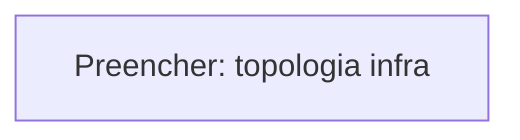

# Blueprint de Engenharia

Referencia tecnica consolidada da plataforma **ResenhAI**: stack, topologia, concerns transversais, NFRs, mapa de dados e glossario.

> **Convencao**: esta pagina consolida o **O QUE** e **COMO**. Para o **POR QUE** de cada decisao, consulte os [ADRs](../decisions/).

---

## 1. Technology Stack

| Categoria | Escolha | ADR | Alternativas Consideradas |
|-----------|---------|-----|---------------------------|
| <!-- Preencher --> | | | |

---

## 2. Deploy Topology

### 2.1 Topologia

<!-- Diagrama Mermaid infra-level: onde roda, como conecta. NAO detalhar C4 L2 aqui. -->



> Detalhamento C4 L2 dos containers → ver [containers.md](../containers/)

### 2.2 Ambientes

| Ambiente | Finalidade | Infra |
|----------|------------|-------|
| local | Desenvolvimento | <!-- Preencher --> |
| staging | QA | <!-- Preencher --> |
| production | Tenants reais | <!-- Preencher --> |

### 2.3 CI/CD

| Etapa | Ferramenta | Gate |
|-------|------------|------|
| <!-- Preencher --> | | |

---

## 3. Folder Structure

Arquitetura de diretorios do software com proposito de cada modulo.

### 3.1 Arvore

```text
<!-- Preencher com estrutura anotada -->
```

### 3.2 Convencoes

| Convencao | Regra |
|-----------|-------|
| <!-- Preencher --> | |

---

## 4. Concerns Transversais

### 4.1 Autenticacao & Autorizacao

| Aspecto | Mecanismo | ADR |
|---------|-----------|-----|
| <!-- Preencher --> | | |

### 4.2 Seguranca & Safety

| Camada | Mecanismo | Latencia | ADR |
|--------|-----------|----------|-----|
| <!-- Preencher --> | | | |

### 4.3 Secrets & Encryption

| Aspecto | Mecanismo | ADR |
|---------|-----------|-----|
| <!-- Preencher --> | | |

### 4.4 Observabilidade

| Ferramenta | Papel | Integracao |
|------------|-------|------------|
| <!-- Preencher --> | | |

### 4.5 Multi-Tenancy

| Mecanismo | Descricao | ADR |
|-----------|-----------|-----|
| <!-- Preencher --> | | |

### 4.6 Error Handling

| Cenario | Estrategia | Fallback |
|---------|------------|----------|
| <!-- Preencher --> | | |

---

## 5. Qualidade & NFRs

| # | Cenario | Metrica | Target | Mecanismo | Prioridade |
|---|---------|---------|--------|-----------|------------|
| Q1 | <!-- Preencher --> | | | | |

---

## 6. Mapa de Dados & Privacidade

### 6.1 Fluxo de Dados Pessoais

| Dado | Origem | Storage | Retention | PII? | Base Legal |
|------|--------|---------|-----------|------|------------|
| <!-- Preencher --> | | | | | |

### 6.2 Direitos do Titular

| Direito | Mecanismo | SLA | ADR |
|---------|-----------|-----|-----|
| <!-- Preencher --> | | | |

### 6.3 Compliance Checklist

| Item | Status | Nota |
|------|--------|------|
| <!-- Preencher --> | | |

---

## 7. Glossario

| Termo | Definicao | Dominio |
|-------|-----------|---------|
| <!-- Preencher --> | | |
