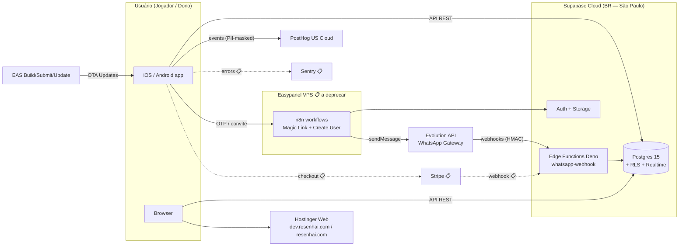

# ResenhAI — Engineering Blueprint

> Decisões de engenharia, cross-cutting concerns e topologia. Stack já em produção (HEAD `09abf73`); blueprint reflete o que existe + débitos conhecidos. Última atualização: 2026-05-04.

---

## Technology Stack

Tabela derivada das 12 ADRs aprovadas (ver [decisions/](../decisions/)).

| Categoria | Escolha | ADR | Alternativas Rejeitadas |
|-----------|---------|-----|-------------------------|
| Mobile framework | Expo SDK 54 + React Native 0.81 + Expo Router 6 | [ADR-001](../decisions/ADR-001-mobile-framework-expo-rn/) | Flutter (custo de migração); Native (2 codebases inviável) |
| State/data layer | TanStack Query 5.90 + Zod 4.1 (persist) | [ADR-002](../decisions/ADR-002-state-data-tanstack-query-zod/) | SWR (sem persist robusto); Apollo (sem GraphQL); RTK Query (Redux extra) |
| Forms | React Hook Form 7.66 + Zod | [ADR-003](../decisions/ADR-003-form-react-hook-form-zod/) | Formik (controlled re-render); Final Form (comunidade) |
| Styling | NativeWind 4.1 + Tailwind 3.4 | [ADR-004](../decisions/ADR-004-styling-nativewind/) | Tamagui (setup pesado); Restyle (sem web); StyleSheet (sem theming) |
| BaaS (consolidado) | Supabase (Postgres+Auth+Storage+Realtime+Edge) | [ADR-005](../decisions/ADR-005-baas-supabase/) | Firebase (NoSQL); AWS Amplify (multi-serviço); Pocketbase (self-host) |
| Workflow orchestration | Supabase Edge Functions Deno (n8n é transitório) | [ADR-006](../decisions/ADR-006-workflow-orchestration-edge-functions/) | n8n (legacy, VM extra); Inngest (overkill); Cloudflare Workers (vendor extra) |
| WhatsApp gateway | Evolution API self-hosted | [ADR-007](../decisions/ADR-007-whatsapp-gateway-evolution-api/) | Cloud API (sem group sync); Z-API (mesmo risco + custo); Twilio |
| Payment processor 📋 | Stripe (planejado, épico-001) | [ADR-008](../decisions/ADR-008-payment-processor-stripe/) | Pagar.me (Billing manual); Iugu; Asaas; MercadoPago |
| Test stack | Jest 29.7 + Playwright 1.57 (+ Maestro 📋 native E2E) | [ADR-009](../decisions/ADR-009-test-stack-jest-playwright-maestro/) | Vitest (preset RN imaturo); Detox (flaky) |
| Build & Deploy | EAS (Expo) + GitHub Actions | [ADR-010](../decisions/ADR-010-build-deploy-eas-github-actions/) | Codemagic (sem OTA); fastlane (manutenção lenta); App Center (EOL) |
| Product analytics | PostHog 4.34 (US Cloud) | [ADR-011](../decisions/ADR-011-product-analytics-posthog/) | Mixpanel (sem flags/replay); Amplitude (custo); GA4 (web-first) |
| Error tracking 📋 | Sentry (proposto, gap atual) | [ADR-012](../decisions/ADR-012-error-tracking-sentry/) | Bugsnag (RN menor); Rollbar; logging ad-hoc (atual) |

---

## Deploy Topology

Visão de infraestrutura — onde tudo roda e como conecta. Detalhamento C4 L2 dos containers → ver [containers.md](../containers/).



---

## Folder Structure

Estrutura espelha o repo `paceautomations/resenhai-expo@09abf73` (codebase-context.md §5).

```text
resenhai-expo/
├── app/                  # Expo Router file-based — (auth)/, (app)/, (app)/(tabs)/, (app)/management/ (~14.9k LOC)
├── components/           # Design system + domínio: common/ ui/ header/ resenha/ management/ (~11k LOC)
├── services/             # Integrações externas:
│   ├── supabase/         #   client, auth, database, invites, logging, storage, userStatus, users
│   ├── whatsapp/         #   sendMessage
│   └── analytics.ts      #   PostHog SDK
├── hooks/                # React Query hooks + queryKeys factory (CLAUDE.md:71-83)
├── lib/                  # design-system, validation (Zod schemas — 1212 LOC)
├── utils/                # logger.ts (PII masking obrigatório — CLAUDE.md:117-125)
├── contexts/             # AppContext.tsx
├── providers/            # React Query persist provider
├── supabase/             # 40 migrations + dumps + functions/whatsapp-webhook (Deno)
├── n8n_backend/          # 4 workflows JSON 📋 a migrar
├── __tests__/            # Jest 1695 testes (10 subdirs)
├── e2e/                  # Playwright 203 testes (5 grupos)
├── scripts/              # db-sync.sh + tsx scripts
├── docker/               # Dockerfile + nginx.conf (web Hostinger)
├── plugins/              # withForceLightMode (Expo config plugin)
└── .github/workflows/    # deploy-hostinger.yml, deploy-supabase.yml
```

| Convenção | Regra |
|-----------|-------|
| **Imports relativos** | Sempre via `@/...` (alias `tsconfig.json`); evitar caminhos `../../` |
| **Platform branching** | Extensões `.web.ts` / `.web.tsx`; Metro resolve por plataforma (CLAUDE.md:64-65 do resenhai-expo) |
| **queryKey discipline** | Toda query usa key do factory `hooks/queryKeys.ts` (sem strings inline) |
| **PII masking obrigatório** | Logs JAMAIS contêm raw `userId`, `email`, `phone`. Usar `maskUserId/maskEmail/maskPhone` de `utils/logger.ts` |
| **Design tokens** | Cores e spacing via `lib/design-system.ts` + `tailwind.config.js`. Sem cores hardcoded |
| **Subscription cleanup** | Todo `useEffect` com canal Realtime do Supabase deve ter cleanup explícito (CLAUDE.md:97-105) |
| **Migrations idempotentes** | `IF NOT EXISTS` + `DO $$ ... END IF; $$` em ALTER/POLICY/PUBLICATION (CLAUDE.md:362-366) |
| **Zod single source of truth** | Schemas em `lib/validation.ts` reaproveitados cliente + Edge Function |

---

## Cross-Cutting Concerns

### Authentication & Authorization

- **Auth**: Supabase Auth nativo + Magic Link OTP via WhatsApp ([ADR-005](../decisions/ADR-005-baas-supabase/), [ADR-006](../decisions/ADR-006-workflow-orchestration-edge-functions/)).
- **Authorization**: PostgreSQL Row Level Security (RLS) — 32 policies em produção isolam dados por `grupo_id` ou `user_id` (codebase-context.md §7).
- **Single porta de entrada**: Magic Link OTP é a única forma de cadastro — cita business-process.md §5.

### Logging & Observability

Stack canônica via `utils/logger.ts` (centralizador):

| Nível | Destino | Uso |
|-------|---------|-----|
| `info` / `event` | **PostHog** ([ADR-011](../decisions/ADR-011-product-analytics-posthog/)) | Eventos de produto, funnels, retention |
| `audit` | **Supabase `logs_sistema` + `admin_audit_log`** | Mutações sensíveis e audit trail |
| `error` | 📋 **Sentry** ([ADR-012](../decisions/ADR-012-error-tracking-sentry/)) — hoje cai em `services/supabase/logging.ts` | Stack traces Hermes, release health, performance tracing |
| `whatsapp_event` | **`whatsapp_events` table** | Audit do pipeline §1-§4 da business-process |

Todos os destinos passam por **PII masking** (CLAUDE.md:117-125) — email/phone/userId nunca ficam raw.

### Error Handling

- **Cliente**: Zod parse-or-fail em todo input/output → mensagens user-friendly via `i18n` `[VALIDAR — sem lib i18n; PT-BR puro]`.
- **Edge Function whatsapp-webhook**: HMAC inválido → `200 OK silencioso` (não retry); body malformado → `200 OK + status='rejected'` em `whatsapp_events` (business-process §2).
- **n8n workflows** (📋 transitório): branches `Respond Error Supabase` / `Respond Error WhatsApp` retornam erro tipado ao cliente.
- **Realtime subscriptions**: cleanup obrigatório no `useEffect` (CLAUDE.md:97-105 do resenhai-expo).

### Configuration

- **Cliente** (Expo): `.env` local = staging; `eas.json` profiles definem produção (CLAUDE.md:296). Variáveis em `.env.example` (codebase-context.md §10).
- **Edge Function**: secrets via `supabase secrets set` (`RESENHAI_WEBHOOK_SECRET`, etc.).
- **n8n**: env vars no Easypanel container 📋 (sai com épico-002).
- **Conhecido gap**: 4 secrets em scripts/CI fora de `.env.example` (`STAGING_DB_URL`, `PRODUCTION_DB_URL`, `SUPABASE_PROJECT_REF`, Apple-Specific Password) — sincronizar em ítem do épico-error-tracking.

### Security

- **HMAC validation** em webhook WhatsApp (`RESENHAI_WEBHOOK_SECRET`) — rejeita requests não-autenticados antes de qualquer mutação.
- **RLS** em todas as tabelas com dados de usuário (32 policies — codebase-context.md §7).
- **PII masking** em todos os logs (CLAUDE.md:117-125).
- **Magic Link OTP** evita armazenar senhas; sem campos de password no schema.
- **Service Key** (admin Supabase) usado APENAS em Edge Functions / n8n — nunca exposto ao cliente.
- **Stripe webhooks 📋**: validação de `Stripe-Signature` + idempotency via `stripe_event_id` único.

---

## NFRs (Non-Functional Requirements)

> Targets aspiracionais; medição depende de épico-error-tracking + dashboards PostHog. Hoje sem instrumentação completa.

| NFR | Target | Métrica | Como Medir |
|-----|--------|---------|------------|
| P95 latência API (REST PostgREST) | < 300ms | response time / endpoint | PostHog timing events `[VALIDAR — pendente Sentry performance]` |
| P95 latência ranking update | < 500ms (do registrar jogo até Realtime) | tempo client-to-client | Sentry performance tracing 📋 |
| Disponibilidade do produto (mobile + web) | 99,5% | uptime mensal | Statuspage `[VALIDAR — não configurado]` |
| Disponibilidade do pipeline WhatsApp | 99% | uptime do webhook + n8n | Sentry release health 📋 + alerts 📋 |
| Error rate em telas críticas (registrar jogo, OTP, checkout 📋) | < 1% | session error rate | Sentry release health 📋 |
| Conversão Magic Link OTP (link enviado → cadastro completo) | > 70% | funnel | PostHog funnels |
| Tempo até primeiro grupo (cold start dev) | < 2 min | UX timing | PostHog timing |
| Recovery (RTO) em incidente Edge Function | < 30 min | tempo até rollback | EAS Update OTA `[VALIDAR — runbook formal]` |
| Cobertura de testes | 70% mínimo / 80% novo / 90% critical (auth/payments/invites) | lcov.info | `jest --coverage` (CLAUDE.md:172-174 do resenhai-expo) |

---

## Data Map

| Store | Tipo | Dados | Tamanho estimado |
|-------|------|-------|------------------|
| Supabase Postgres | Relational | 15 tabelas + 22 views (codebase-context.md §7) | `[VALIDAR — extraível via query]` |
| Supabase Storage | Object | bucket `images/*` (avatares, fotos de jogo/perfil) | `[VALIDAR — extraível]` |
| Supabase `whatsapp_events` | Audit (Postgres) | webhooks Evolution recebidos, com payload raw | sem TTL atualmente `[VALIDAR — considerar retention 30d]` |
| Supabase `logs_sistema` | Audit (Postgres) | logs de aplicação | sem TTL `[VALIDAR — retention]` |
| Supabase `admin_audit_log` | Audit (Postgres) | mutações sensíveis (admin actions) | sem TTL `[VALIDAR — retention]` |
| Supabase `pending_whatsapp_links` | TTL Postgres | links de convite pendentes | TTL 30min auto-expire |
| Supabase `convites` | Token (Postgres) | tokens de convite multi-uso | sem TTL formal `[VALIDAR — checar migration `*invite_link_multi_use*`]` |
| Async storage (cliente) | Cache | persist da TanStack Query — quais queries persistem `[VALIDAR — `~6MB iOS limit`]` | até 6MB |
| PostHog Cloud (US) | Analytics | eventos product (PII-masked) | crescente; sem retention configurada `[VALIDAR]` |
| Sentry 📋 | Errors | stack traces Hermes + release health | 5k events/mo (free) |

---

## Technical Glossary

| Termo | Definição |
|-------|-----------|
| **Magic Link OTP** | Código de uso único enviado via WhatsApp para autenticação — única porta de entrada de novos usuários |
| **HMAC** | Validação de assinatura criptográfica em webhooks Evolution (`RESENHAI_WEBHOOK_SECRET`) e Stripe 📋 |
| **RLS** | Row Level Security — policy SQL no Postgres que filtra acesso por `auth.uid()` ou `grupo_id` |
| **Edge Function** | Função serverless Deno no Supabase, mesma região do DB |
| **Realtime** | Canal `grupos` que emite eventos de sync ao app conectado |
| **queryKey factory** | `hooks/queryKeys.ts` — fonte única de chaves para invalidação cirúrgica do cache TanStack Query |
| **PII masking** | `maskUserId/maskEmail/maskPhone` em `utils/logger.ts` — obrigatório antes de qualquer log/event |
| **Migration idempotente** | SQL com `IF NOT EXISTS` + `DO $$ ... END IF; $$` que pode ser re-executado sem erro |
| **OTA Update** | EAS Update — entrega bundle JS atualizado sem submeter à App Store / Google Play |
| **n8n transitório** | 4 workflows hoje em produção (Magic Link OTP, Create User, Group sync) marcados para migração via épico-002-edge-migration |
| **God-screen** | `app/(app)/management/resenha.tsx` (2200 LOC, 18 commits/90d) — débito de decomposição (épico-004) |
| **God-DB-layer** | `services/supabase/database.ts` (1598 LOC) — débito de quebra por bounded context (épico-005) |

---

## Testing Scaffold

Bloco a aplicar em `platform.yaml` (extraído do `playwright.config.ts` do resenhai-expo):

```yaml
testing:
  startup:
    type: npm
    command: npm run web                        # Expo web dev em http://localhost:8081
    ready_timeout: 240                          # 240s (Metro dev server) — 15s se for static (npx serve dist)
  health_checks:
    - http://localhost:8081
  urls:
    - http://localhost:8081
  required_env:
    - EXPO_PUBLIC_ENVIRONMENT
    - EXPO_PUBLIC_PRODUCTION_SUPABASE_URL
    - EXPO_PUBLIC_PRODUCTION_SUPABASE_ANON_KEY
    - EXPO_PUBLIC_POSTHOG_API_KEY
    - EXPO_PUBLIC_POSTHOG_HOST
  env_file: .env.example
  journeys_file: testing/journeys.md
```

Jornadas de teste (J-001..J-N) → ver [testing/journeys.md](../testing/journeys.md).
