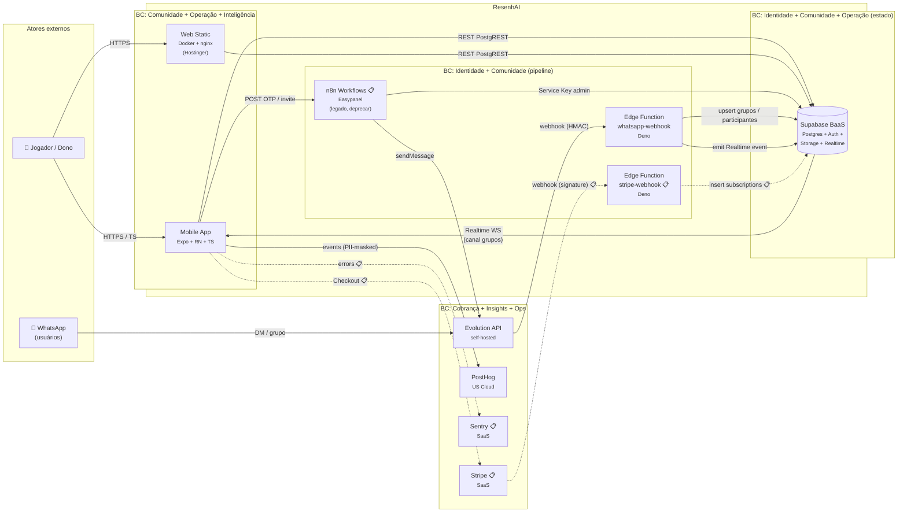

# ResenhAI — Container Architecture (C4 Level 2)

> Decomposição em containers reflete o que está em produção em `paceautomations/resenhai-expo@09abf73` + caminho declarado pelo ADR-006 (n8n → Edge Functions) e ADRs 008/012 (Stripe + Sentry 📋). NFRs e justificativas de stack vivem em [blueprint.md](../blueprint/) — aqui só listamos a tecnologia.

---

## Container Diagram

---

## Container Matrix

| # | Container | Bounded Context (proprietário) | Technology | Responsabilidade | Protocolo In | Protocolo Out |
|---|-----------|-------------------------------|------------|------------------|--------------|---------------|
| 1 | **Mobile App** | Comunidade + Operação + Inteligência | Expo SDK 54 + RN 0.81 + Expo Router 6 + TS 5.9 | UI iOS/Android/Web — Onboarding, jogos, ranking, stats | (gestos do usuário) | REST PostgREST → Supabase; HTTP → n8n; HTTP → PostHog/Sentry/Stripe |
| 2 | **Web Static** | Comunidade + Operação + Inteligência | Docker + nginx (Hostinger), bundle exportado via `expo export --platform web` | Servir bundle web estático; não-stateful | HTTPS | (cliente faz requests diretos a Supabase/n8n) |
| 3 | **Supabase BaaS** | Identidade + Comunidade + Operação (estado canônico) | Postgres 15 + RLS + Auth + Storage + Realtime (managed by Supabase) | Schema canônico (15 tabelas + 22 views), 32 RLS policies, OTP, buckets de imagem, Realtime channel `grupos` | REST (PostgREST), gRPC interno, JWT auth | Realtime WS para clientes; trigger calls para Edge Functions |
| 4 | **Edge Function whatsapp-webhook** | Identidade + Comunidade (pipeline) | Deno (Supabase Edge runtime) | Recebe webhook Evolution → valida HMAC → roteia para handlers (`groups-upsert`, `groups-update`, `participants-update`) | HTTPS POST (HMAC) | SQL → Supabase; logs → `whatsapp_events` |
| 5 | **Edge Function stripe-webhook 📋** | Cobrança | Deno (Supabase Edge runtime) — a criar épico-001 | Receber webhook Stripe → validar signature → ativar/desativar subscription | HTTPS POST (Stripe-Signature) | SQL → Supabase (`subscriptions`) |
| 6 | **n8n Workflows 📋** | Identidade (transitório) | n8n self-hosted (Easypanel) — **legado, sai com épico-002** | Hoje: Magic Link OTP + Create User For Invite + WhatsappGroup_New/Prod (4 workflows) | HTTPS POST | HTTP → Supabase Auth admin; HTTP → Evolution API |
| 7 | **Evolution API** | Identidade + Comunidade (gateway) | Evolution API self-hosted (Baileys) `[VALIDAR — host atual: provavelmente Easypanel]` | Gateway WhatsApp — envia mensagens (OTP, ranking, convites), recebe eventos de grupo | HTTPS REST (autorização token) | webhook HMAC → Edge Function `whatsapp-webhook` |
| 8 | **External SaaS (PostHog + Sentry 📋 + Stripe 📋 + EAS)** | Insights + Ops + Cobrança | SaaS (managed) | PostHog: analytics+flags+replays; Sentry: errors; Stripe: cobrança; EAS: build/submit/update | HTTPS REST + webhooks | (resposta sync ou webhook) |

---

## Communication Protocols

| From | To | Protocolo | Padrão | Por quê |
|------|-----|-----------|--------|---------|
| Mobile App | Supabase | REST PostgREST + JWT | sync request/response | Operação padrão CRUD; auth via Supabase Auth (ADR-005) |
| Mobile App | Supabase | Realtime WS | sub/pub | Canal `grupos` (sync de membros + jogos novos no grupo) |
| Mobile App | n8n 📋 | HTTPS POST (JSON) | sync | Magic Link OTP + Create User For Invite — sai com épico-002 |
| Mobile App | PostHog | HTTPS POST (batch) | async fire-and-forget | Eventos de produto, PII-masked |
| Mobile App | Sentry 📋 | HTTPS POST (batch) | async fire-and-forget | Errors + performance traces |
| Mobile App | Stripe 📋 | HTTPS GET (Checkout redirect) | sync | Redirect-based checkout |
| Evolution API | Edge Function whatsapp-webhook | HTTPS POST + header `x-webhook-secret` (HMAC) | async push | Webhook entrega eventos de grupo (codebase-context.md §8) |
| Edge Function | Supabase | SQL via supabase-js admin | sync | Mutações privilegiadas (sync de grupo, audit log) |
| Edge Function | Supabase Realtime | trigger via insert/update | event-driven | Realtime channel emite mudança a clientes |
| Stripe 📋 | Edge Function stripe-webhook | HTTPS POST + header `Stripe-Signature` | async push | Webhook ativa/desativa subscription |
| n8n 📋 | Supabase | HTTPS REST (Service Key admin) | sync | `auth.signInWithOtp`, `admin.createUser` |
| n8n 📋 | Evolution API | HTTPS POST | sync | sendMessage (OTP / convite) |
| EAS | Mobile App | OTA (expo-updates protocol) | async push | OTA updates de bundle JS pós-deploy |

> Convenção: protocolos `📋` correspondem a containers/integrações ainda não implementados.

---

## Scaling Strategy

| Container | Estratégia | Trigger | Notas |
|-----------|-----------|---------|-------|
| Mobile App | Distribuição (não-escalável no sentido tradicional) | adoção crescente | EAS Update entrega novas versões; sem replicação por usuário |
| Web Static | Horizontal (CDN nginx) | qualquer carga | Hostinger SSH+Docker; cache estático |
| Supabase BaaS | Plan upgrade Pro → Team → Enterprise | Connection pool > 60% sustentado, ou `[VALIDAR — query latência > 300ms p99]` | Lock-in ADR-005; multi-region BR ainda não disponível |
| Edge Function whatsapp-webhook | Auto-scale managed (Supabase Edge) | (gerenciado pelo Supabase) | Cold start ~50-200ms; sem ação manual |
| Edge Function stripe-webhook 📋 | Auto-scale managed | (gerenciado) | Idem |
| n8n 📋 (transitório) | Vertical (VPS Easypanel) | (não escalar — sai em épico-002) | — |
| Evolution API | Vertical (VPS) + replicação manual de instâncias | ban / queda de sessão QR | Mitigação ADR-007: rotação de números, 2-3 instâncias secundárias |
| External SaaS | (gerenciado pelo provedor) | — | Pricing escala com uso; monitorar limite gratuito (PostHog 1M events/mo) |

> NFRs globais (P95 latência, availability, error rate) → ver [blueprint.md §NFRs](../blueprint/).

---

## Assumptions and Decisions

| # | Decisão | Alternativas Consideradas | Justificativa |
|---|---------|---------------------------|---------------|
| 1 | **8 containers no diagrama** (3 SaaS empacotados em "External SaaS") | (a) Listar PostHog/Sentry/Stripe como 3 containers separados (`= 10 containers`); (b) Listar como 1 (escolhido). | Diagrama legível; cada SaaS já tem ADR próprio (ADR-008, ADR-011, ADR-012). Empacotar foca atenção no que opera dentro do produto. |
| 2 | **Supabase como 1 container** (não 4) | (a) Postgres + Auth + Storage + Realtime como 4 containers (4-way split); (b) 1 container BaaS (escolhido). | ADR-005 consolidou Supabase como 1 escolha; do ponto de vista de operação é 1 dashboard, 1 region, 1 plan. Internamente o Postgres é o estado canônico — o resto deriva. |
| 3 | **Edge Functions whatsapp-webhook e stripe-webhook como containers separados** (mesmo runtime Deno) | (a) Container único "Edge Functions" (genérico); (b) 1 container por função (escolhido). | Cada função tem owner de bounded context distinto (Identidade vs Cobrança); SLA, secrets e código são independentes. Justifica decomposição mesmo no mesmo runtime. |
| 4 | **n8n como container 📋 transitório** | (a) Omitir (sai em breve); (b) Manter visível com 📋 (escolhido). | Visibilidade do débito de migração no diagrama é mais valiosa do que limpeza visual; remove na reconcile pós-épico-002. |
| 5 | **Web Static separado do Mobile App** | (a) 1 container "Cliente Expo" (web e mobile juntos); (b) 2 containers (escolhido). | Pipeline de deploy diferente (mobile via EAS Build/Update; web via GH Actions+Hostinger Docker); consequência operacional distinta justifica separação. |

---

## Próximo passo

→ `/madruga:context-map resenhai` — mapear relacionamentos DDD entre os 6 bounded contexts (incluindo padrões Customer/Supplier, ACL, Conformist, Big Ball of Mud).
