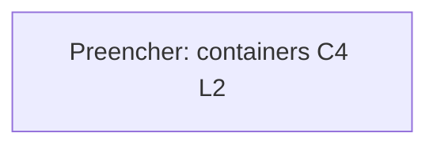

# ResenhAI — Container Architecture (C4 Level 2)

> C4 Level 2: containers, responsabilidades e comunicacao entre componentes.

## Container Diagram

---

## Container Matrix

<!-- Tech choices justified in Blueprint — list technology here without justification -->

| # | Container | Bounded Context | Tecnologia | Responsabilidade | Protocol In | Protocol Out |
|---|-----------|----------------|------------|------------------|-------------|-------------|
| <!-- Preencher --> | | | | | | |

---

## Communication Protocols

| De | Para | Protocolo | Padrao | Justificativa |
|----|------|-----------|--------|---------------|
| <!-- Preencher --> | | | | |

---

## Scaling Strategy

| Container | Estrategia | Trigger | Notas |
|-----------|-----------|---------|-------|
| <!-- Preencher --> | | | |

> NFRs globais e targets mensuraveis → ver [blueprint.md](../blueprint/)

---

## Implementation Status

<!-- Status real de cada container vs o desenho. Atualizado por reconcile/reverse-reconcile. -->

| Container | Status | Epic | Notas |
|-----------|--------|------|-------|
| <!-- Preencher --> | ✅ shipped / 🚧 em curso / 📋 planejado | | |

---

## Premissas e Decisoes

| # | Decisao | Alternativas Consideradas | Justificativa |
|---|---------|---------------------------|---------------|
| <!-- Preencher --> | | | |
