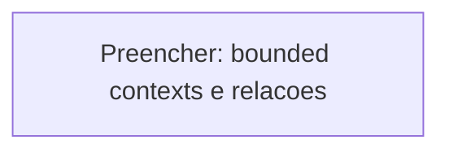

# DDD Context Map

> BCs referenciados por nome — definicoes completas em [domain-model.md](../domain-model/).

## Context Diagram

<!-- AUTO:domains -->
<!-- Diagrama Mermaid com relacionamentos DDD entre bounded contexts -->

<!-- /AUTO:domains -->

---

## Relacoes entre Contextos

<!-- AUTO:relations -->
| # | Upstream | Downstream | Padrao | Direcao | Justificativa |
|---|----------|-----------|--------|---------|---------------|
| <!-- Preencher --> | | | | | |
<!-- /AUTO:relations -->

---

## Padroes Utilizados

| Padrao | Descricao | Quando Usar | Usado Em |
|--------|-----------|-------------|----------|
| <!-- Preencher --> | | | |

---

## Classificacao de Dominios

<!-- DDD: Core (diferencial competitivo) / Supporting (necessario, nao diferenciado) / Generic (commodity). -->

| Bounded Context | Tipo | Justificativa |
|-----------------|------|---------------|
| <!-- Preencher --> | Core / Supporting / Generic | |

---

## Anti-Padroes Monitorados

<!-- Padroes que nao queremos repetir. Sintoma + mitigacao. -->

| Anti-padrao | Sintoma | Mitigacao |
|-------------|---------|-----------|
| <!-- Preencher --> | | |
