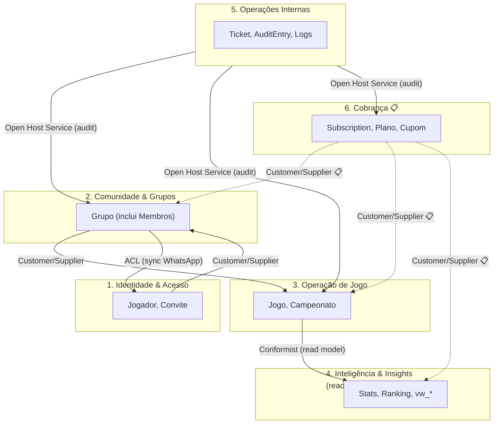

# ResenhAI — Context Map

> Relacionamentos entre os 6 bounded contexts do [domain-model](../domain-model/) com padrões DDD explícitos. Última atualização: 2026-05-04.

---

## Context Diagram

---

## Relationship Table

| # | Upstream | Downstream | Pattern | Direção | Justificativa |
|---|----------|-----------|---------|---------|---------------|
| 1 | Identidade & Acesso | Comunidade & Grupos | Customer/Supplier | I → C | Comunidade depende do `Jogador` que Identidade cria; Identidade não conhece Grupo. Tradicional upstream→downstream com Identidade evoluindo primeiro. |
| 2 | Comunidade & Grupos | Operação de Jogo | Customer/Supplier | C → O | Operação só roda jogo entre membros do Grupo (invariante 4 de `Jogo`). Grupo não muda quando regras de jogo mudam — direção clara. |
| 3 | Operação de Jogo | Inteligência & Insights | Conformist | O → N | Insights é read model puro (CQRS-like) — segue 100% o schema de `Jogo` e `Campeonato` via triggers SQL. Não negocia, conforma. |
| 4 | Comunidade & Grupos | Identidade & Acesso | ACL (Anti-Corruption Layer) | C → I | Sync WhatsApp (handlers `groups-upsert`, `participants-update`) traduz `wpp_user` da Evolution API → `Jogador` interno via `pending_whatsapp_links` (TTL 30min). ACL evita que o modelo do WhatsApp polua Identidade. |
| 5 | Cobrança 📋 | Comunidade & Grupos | Customer/Supplier 📋 | B → C | Tier limita membros por grupo (Dono=20, Rei=50). Grupo consulta tier ativo do `criadoPor` — invariante 5 do aggregate `Grupo`. |
| 6 | Cobrança 📋 | Operação de Jogo | Customer/Supplier 📋 | B → O | Tier limita campeonatos ativos (Dono=1, Rei=10). Invariante 4 do aggregate `Campeonato`. |
| 7 | Cobrança 📋 | Inteligência & Insights | Customer/Supplier 📋 | B → N | Tier destrava badge 👑, AI ilimitado, Hall da Fama. Insights consulta tier para projetar dados premium. |
| 8 | Operações Internas | (Comunidade + Operação + Cobrança) | Open Host Service (audit) | Ops → * | `admin_audit_log` é canal padronizado append-only — qualquer contexto que sofre mutação sensível publica audit. Ops consome via dashboards admin. |

---

## Patterns Used

| Pattern | Descrição | Quando usar | Usado em |
|---------|-----------|-------------|----------|
| **Customer/Supplier** | Upstream fornece, downstream consome; upstream sabe que tem clientes mas não negocia | Quando direção é clara e upstream evolui primeiro | Relacionamentos #1, #2, #5 📋, #6 📋, #7 📋 |
| **Conformist** | Downstream adota integralmente o modelo upstream | Quando upstream é estável e custo de divergir não compensa | Relacionamento #3 (Insights conforma com Operação) |
| **ACL (Anti-Corruption Layer)** | Tradução protegida entre modelo externo e interno | Quando modelos divergem e contaminação é risco | Relacionamento #4 (sync WhatsApp → Jogador) |
| **Open Host Service** | Canal/protocolo padronizado para múltiplos consumidores | Quando muitos contextos publicam para 1 consumidor | Relacionamento #8 (Ops consome audit de N contextos) |
| **Shared Kernel** | Não usamos | Acoplamento mais forte; só com forte coordenação de times | (intencionalmente vazio) |
| **Published Language** | Não-explícito | Padrão neutro entre N contextos | (não aplicável neste tamanho) |

---

## Anti-Patterns Detectados

| Anti-Pattern | Onde aparece hoje | Risco | Mitigação |
|-------------|-------------------|-------|-----------|
| **Big Ball of Mud** | `services/supabase/database.ts` (1598 LOC, codebase-context.md §13) atende Comunidade + Operação + Inteligência sem separação clara por bounded context | Mudança em entidade vaza para outros contextos; testes ficam acoplados | Épico-005-database-decomposition: quebrar por bounded context (`grupos.ts`, `jogos.ts`, `users.ts`, `stats.ts`) |
| **God Context candidato** | Operação de Jogo tem 2 aggregates (Jogo, Campeonato) + nuance de que `app/(app)/management/resenha.tsx` (2200 LOC) concentra UI de múltiplos sub-fluxos | UI single-screen mistura responsabilidades de invariante de Jogo com gestão de Campeonato | Épico-004-resenha-refactor: decompor god-screen em sub-rotas (Expo Router) |
| **Excessive Shared Kernel** | Não detectado | — | — |

---

## Próximo passo

→ `/madruga:epic-breakdown resenhai` — quebrar o trabalho restante em épicos Shape Up. **WARNING: 1-way-door** — escopo de épico define todo o downstream do roadmap.
