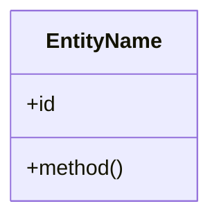

# Domain Model

Consolidacao dos dominios taticos: bounded contexts, entidades, diagramas de classe, schemas SQL e invariantes.

---

## Bounded Contexts

<!-- Tabela de BCs — sem diagrama Mermaid (relacionamentos ficam em context-map.md) -->

| # | Bounded Context | Proposito | Justificativa de Separacao | Aggregates Chave |
|---|----------------|-----------|---------------------------|------------------|
| <!-- Preencher --> | | | | |

> Relacionamentos entre contextos e padroes DDD → ver [context-map.md](../context-map/)

---

<!-- Adicione UMA secao por bounded context usando o template abaixo.
     Use `/domain-model resenhai` para gerar. Pre-requisitos: blueprint + business-process. -->

<!-- ==== TEMPLATE PARA CADA BOUNDED CONTEXT (copiar e preencher) ==== -->

## [Nome do Bounded Context]

**Purpose**: <!-- 1 frase -->

**Ubiquitous Language**: <!-- termos chave do dominio -->

### Aggregates

| Aggregate | Root | Invariantes |
|-----------|------|-------------|
| <!-- Preencher --> | | |

### Class Diagram



### SQL Schema

```sql
-- Preencher
```

### Invariantes de Negocio

- <!-- Preencher -->

<!-- ==== /TEMPLATE ==== -->
