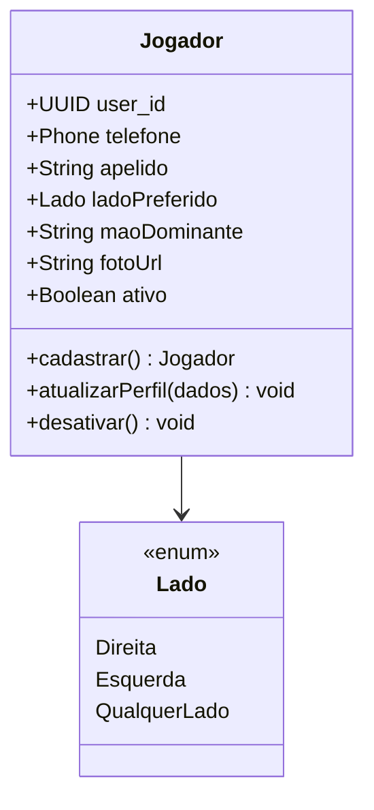
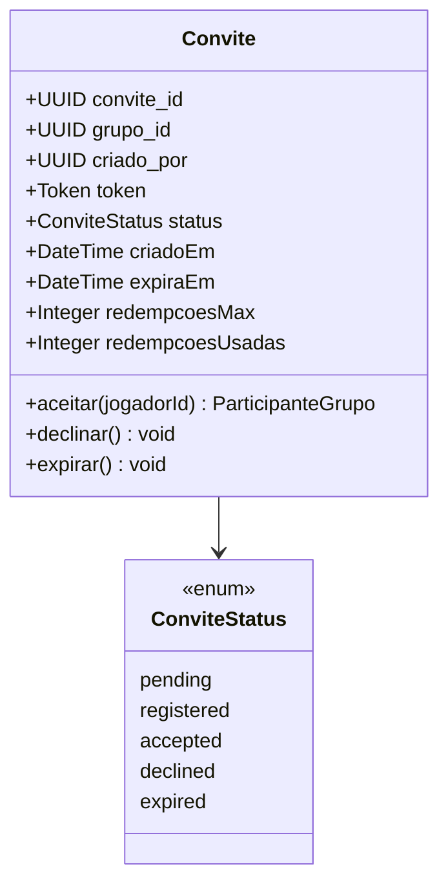
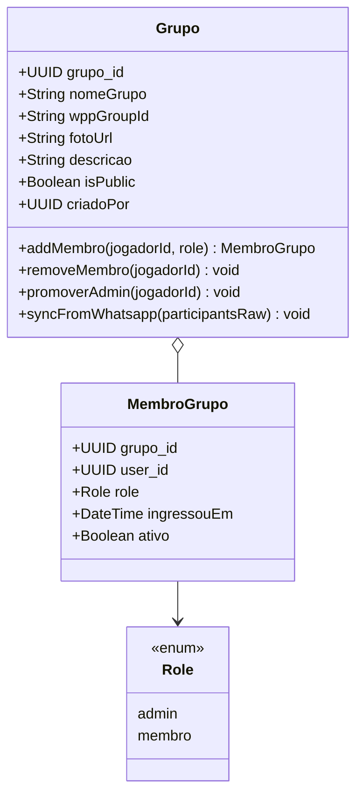
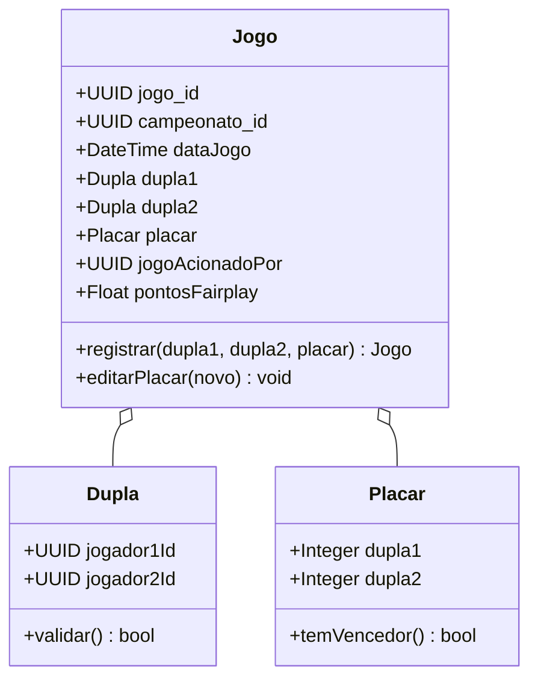
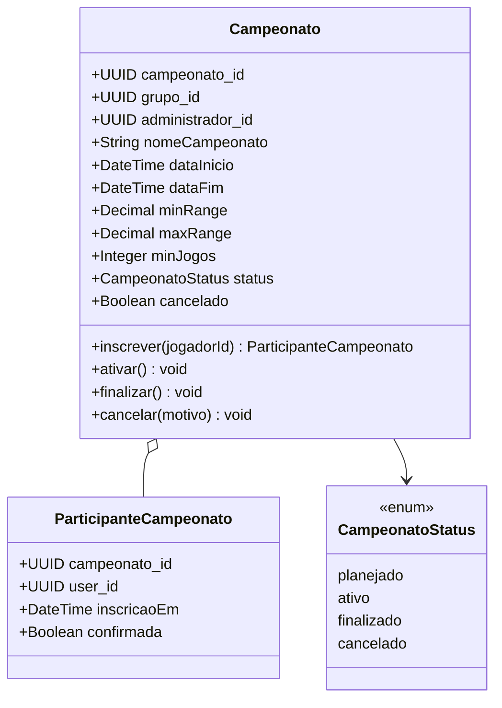
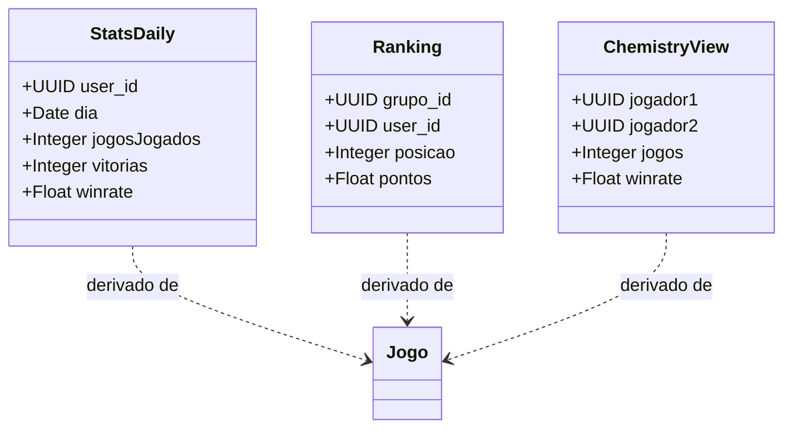
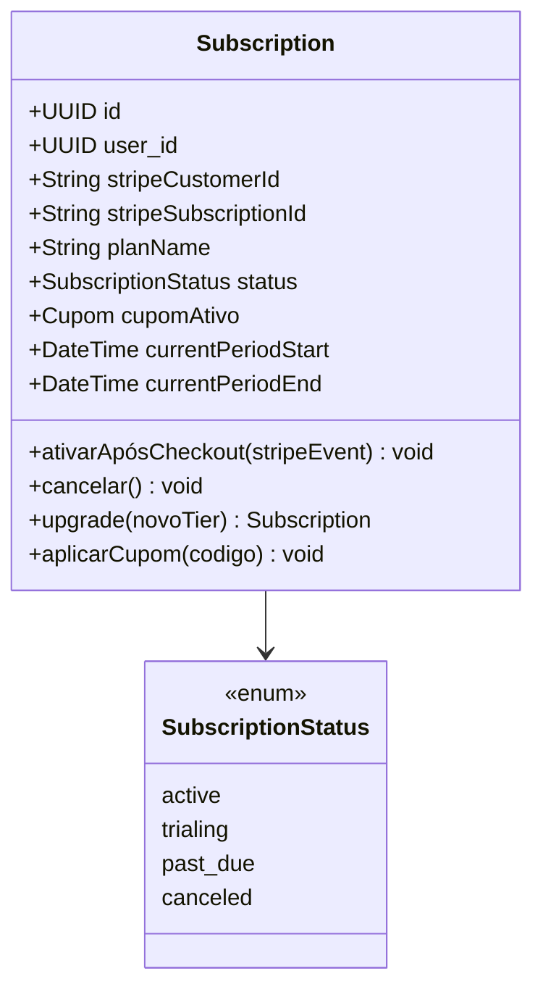

# ResenhAI — Domain Model

> Modelo DDD com bounded contexts, aggregates, entidades, value objects e invariantes. Reflete o schema real em produção (`paceautomations/resenhai-expo@09abf73`, `supabase/dumps/prod_schema.sql`). Última atualização: 2026-05-04.

---

## Bounded Contexts

| # | Contexto | Propósito | Justificativa de separação | Aggregates principais |
|---|----------|-----------|----------------------------|----------------------|
| 1 | **Identidade & Acesso** | Onboarding, autenticação via Magic Link OTP, perfil do jogador, convites para grupo | Lifecycle independente (auth/cadastro acontece antes de qualquer outra ação); ubiquitous language própria (`Jogador novo`, `convite`, `OTP`) | `Jogador`, `Convite` |
| 2 | **Comunidade & Grupos** | Criação e gestão de grupos, vínculo de membros, sync com WhatsApp | Lifecycle de grupo é independente do jogo; convive com sync externo (Evolution API); language própria (`Grupo`, `Dono da Resenha`, `Membro`) | `Grupo` (inclui Membros) |
| 3 | **Operação de Jogo** | Registro de partidas, criação de campeonatos, inscrições | Operação é o coração do produto — tem invariantes próprios (placar válido, duplas distintas, ranking de campeonato); language própria (`Jogo`, `Campeonato`, `Dupla`, `Placar`) | `Jogo` (root próprio), `Campeonato` |
| 4 | **Inteligência & Insights** | Stats individuais, ranking, química com dupla, sangue frio, badge 👑 | Read model puro derivado de Operação de Jogo; views agregadas no DB; sem invariantes de mutação — não é aggregate, é projeção CQRS-like | `Stats` (read models), `Ranking` (read model) |
| 5 | **Operações Internas** | Suporte ao usuário, audit de mutações sensíveis, logs do sistema | Lifecycle separado (chamados de suporte vivem em paralelo); language ops (`Ticket`, `Audit`, `Log`) | `Ticket`, `AuditEntry` |
| 6 | **Cobrança & Monetização 📋** | Tiers, subscriptions Stripe, cupons, enforcement de limites | Decisão arquitetural confirmada (ADR-008) mas ainda não implementada; lifecycle e language próprios (`Subscription`, `Plano`, `Cupom`) | `Subscription`, `Plano` |

> Relacionamentos entre contextos e padrões DDD → ver [context-map.md](../context-map/).

---

## Bounded Context 1: Identidade & Acesso

### Canvas

| Aspecto | Descrição |
|---------|-----------|
| **Nome** | Identidade & Acesso |
| **Propósito** | Cadastro via Magic Link OTP, perfil do jogador e convites para grupo |
| **Linguagem ubíqua** | Jogador, Convite, Magic Link OTP, `pending_whatsapp_link`, `convite.status` (pending → accepted/declined/expired) |
| **Aggregates** | `Jogador`, `Convite` |

### Aggregate: Jogador

**Root entity:** `Jogador`



**Entities:** `Jogador` — identifica o usuário do produto, mapeia 1:1 com `auth.users` via `handle_new_user` trigger.

**Value Objects:**
- `Phone` — número WhatsApp normalizado (E.164); validado por Zod schema; imutável; é o identificador secundário do jogador.
- `Lado` — enum `Direita`/`Esquerda`/`Qualquer lado` (do schema Postgres `Lado`); imutável.

**Invariants:**

| # | Invariante | Descrição | Quando checar |
|---|-----------|-----------|---------------|
| 1 | `telefone único` | Cada `Phone` E.164 corresponde a no máximo 1 jogador ativo | criação + atualização de telefone |
| 2 | `auth-user-link` | Todo `Jogador` tem 1 row em `auth.users` correspondente | criação (via trigger `handle_new_user`) |
| 3 | `apelido não-vazio` | `apelido` é obrigatório e mínimo 2 chars | criação + atualização |

### Aggregate: Convite

**Root entity:** `Convite`



**Entities:** `Convite`.
**Value Objects:** `Token` — opaque string única, gerada na criação, imutável.

**Invariants:**

| # | Invariante | Descrição | Quando checar |
|---|-----------|-----------|---------------|
| 1 | `unique-token` | Cada `Token` aparece em no máximo 1 row de `convites` | criação |
| 2 | `redempcoes ≤ max` | `redempcoesUsadas <= redempcoesMax` (multi-uso configurável) | aceitação |
| 3 | `status-flow` | Transições válidas: `pending → registered → accepted/declined/expired`. Outras combinações rejeitadas | mutação de status |
| 4 | `não aceitar expirado` | Convite com `expiraEm < now()` ou `status='expired'` não pode ser aceito | aceitação |

### SQL Schema (atual em produção)

```sql
-- Aggregate: Convite (existente)
CREATE TABLE convites (
    convite_id uuid PRIMARY KEY DEFAULT gen_random_uuid(),
    grupo_id uuid NOT NULL REFERENCES grupos(grupo_id),
    criado_por uuid REFERENCES users(user_id),
    token text NOT NULL UNIQUE,
    status convite_status DEFAULT 'pending' NOT NULL,
    -- TTL e multi-uso adicionados via migration 20260216000000_invite_link_multi_use
    expira_em timestamptz,
    redempcoes_max integer DEFAULT 1,
    redempcoes_usadas integer DEFAULT 0,
    created_at timestamptz DEFAULT now() NOT NULL
);
```

---

## Bounded Context 2: Comunidade & Grupos

### Canvas

| Aspecto | Descrição |
|---------|-----------|
| **Nome** | Comunidade & Grupos |
| **Propósito** | Criar grupo, gerenciar membros, sincronizar estado com WhatsApp |
| **Linguagem ubíqua** | Grupo, Dono da Resenha, Membro, `wpp_group_id`, sync, Realtime channel |
| **Aggregates** | `Grupo` (inclui Membros) |

### Aggregate: Grupo (inclui Membros)

**Root entity:** `Grupo` (inclui `MembroGrupo` como entidade interna).



**Entities:**
- `Grupo` — root do aggregate.
- `MembroGrupo` — entidade interna (corresponde a `participantes_grupo`); só acessível via `Grupo` em mutações.

**Value Objects:** — (nenhum dedicado neste contexto; `wppGroupId` é string opaca).

**Invariants:**

| # | Invariante | Descrição | Quando checar |
|---|-----------|-----------|---------------|
| 1 | `criador-é-admin` | `criado_por` é automaticamente promovido a `admin` no insert do grupo | criação |
| 2 | `pelo-menos-um-admin` | Aggregate sempre tem `>= 1 MembroGrupo com role='admin' AND ativo=true` | mutação de roles + remoção de membros |
| 3 | `wppGroupId-único-quando-presente` | Se `wpp_group_id != null`, é único entre todos os grupos | criação + sync |
| 4 | `membro-único-no-grupo` | Cada `(grupo_id, user_id)` é único | criação de `MembroGrupo` |
| 5 | `tier-respeita-limite-membros` | Total de membros ativos ≤ limite do tier do dono (Dono=20, Rei=50, Enterprise=ilimitado) | inserção de novo membro (📋 quando F5 entrar) |

### SQL Schema (atual em produção)

```sql
-- Aggregate: Grupo
CREATE TABLE grupos (
    grupo_id uuid PRIMARY KEY DEFAULT gen_random_uuid(),
    nome_grupo text,
    wpp_group_id text,
    wpp_nome_grupo text,
    foto_grupo text,
    descricao_grupo text,
    is_public boolean DEFAULT false,
    created_by uuid REFERENCES users(user_id),
    created_at timestamptz DEFAULT now() NOT NULL,
    updated_at timestamptz DEFAULT now() NOT NULL,
    deleted_at timestamptz
);

CREATE TABLE participantes_grupo (
    grupo_id uuid REFERENCES grupos(grupo_id),
    user_id uuid REFERENCES users(user_id),
    role text NOT NULL DEFAULT 'membro',
    ingressou_em timestamptz DEFAULT now(),
    ativo boolean DEFAULT true,
    PRIMARY KEY (grupo_id, user_id)
);
```

---

## Bounded Context 3: Operação de Jogo

### Canvas

| Aspecto | Descrição |
|---------|-----------|
| **Nome** | Operação de Jogo |
| **Propósito** | Registrar partidas, gerenciar campeonatos, inscrever participantes |
| **Linguagem ubíqua** | Jogo, Campeonato, Dupla, Placar, Inscrição, modalidade (futevôlei / beach tennis / vôlei de areia), `pontos_fairplay` |
| **Aggregates** | `Jogo` (aggregate root próprio), `Campeonato` (separado, com inscrições) |

### Aggregate: Jogo

**Root entity:** `Jogo` — aggregate root **próprio** (não pertence a `Campeonato`); referência fraca opcional via `campeonato_id` (jogo avulso é o caso mais comum).



**Entities:** `Jogo`.

**Value Objects:**
- `Dupla` — par `(jogador1Id, jogador2Id)`; imutável; valida que os 2 IDs são distintos.
- `Placar` — par `(pontosDupla1, pontosDupla2)`; imutável; valida vencedor único.

**Invariants:**

| # | Invariante | Descrição | Quando checar |
|---|-----------|-----------|---------------|
| 1 | `4 jogadores distintos` | `dupla1.jogador1Id`, `dupla1.jogador2Id`, `dupla2.jogador1Id`, `dupla2.jogador2Id` são 4 UUIDs distintos | registrar |
| 2 | `placar-tem-vencedor` | `placar.dupla1 != placar.dupla2` (sem empate em areia) | registrar + editar |
| 3 | `placar-positivo` | `placar.dupla1 + placar.dupla2 > 0` | registrar + editar |
| 4 | `jogadores-são-membros-do-grupo` | Os 4 jogadores são `MembroGrupo` ativos no grupo do jogo | registrar |
| 5 | `data-jogo-não-futura` | `data_jogo <= now() + 1h` (tolerância pequena para fuso horário) | registrar |
| 6 | `campeonato-ativo-se-vinculado` | Se `campeonato_id` setado, `campeonato.status IN ('planejado','ativo')` | registrar |

### Aggregate: Campeonato

**Root entity:** `Campeonato` — inclui `ParticipanteCampeonato` como entidade interna (inscrições).



**Entities:** `Campeonato`, `ParticipanteCampeonato` (interna).

**Invariants:**

| # | Invariante | Descrição | Quando checar |
|---|-----------|-----------|---------------|
| 1 | `data-fim-after-inicio` | `dataFim > dataInicio` | criação + edição |
| 2 | `status-flow` | Transições válidas: `planejado → ativo → finalizado | cancelado`; cancelamento permitido em qualquer estado pré-`finalizado` | mutação de status |
| 3 | `administrador-é-admin-do-grupo` | `administrador_id` deve ser `MembroGrupo.role='admin'` no grupo do campeonato | criação |
| 4 | `tier-respeita-limite-campeonatos-ativos` | Grupos do tier Dono têm máx 1 campeonato `ativo`; Rei tem máx 10 | ativar |
| 5 | `participantes-são-membros-do-grupo` | Todo `ParticipanteCampeonato` é `MembroGrupo` ativo do grupo do campeonato | inscrição |
| 6 | `min_range ≤ max_range` | Range de classificação válido | criação |

### SQL Schema (atual em produção, com triggers/funções)

```sql
-- Aggregate: Jogo
CREATE TABLE jogos (
    jogo_id uuid PRIMARY KEY DEFAULT gen_random_uuid(),
    campeonato_id uuid REFERENCES campeonatos(campeonato_id),  -- nullable
    data_jogo timestamptz NOT NULL,
    dupla1_jogador1_id uuid REFERENCES users(user_id),
    dupla1_jogador2_id uuid REFERENCES users(user_id),
    dupla2_jogador1_id uuid REFERENCES users(user_id),
    dupla2_jogador2_id uuid REFERENCES users(user_id),
    placar_dupla1 integer NOT NULL,
    placar_dupla2 integer NOT NULL,
    jogo_acionado_por uuid REFERENCES users(user_id),
    pontos_fairplay double precision,
    created_at timestamptz DEFAULT now(),
    updated_at timestamptz DEFAULT now(),
    deleted_at timestamptz
);
-- Trigger: recalcula user_stats_daily/weekly/camp após insert/update (Inteligência & Insights)

-- Aggregate: Campeonato
CREATE TABLE campeonatos (
    campeonato_id uuid PRIMARY KEY DEFAULT gen_random_uuid(),
    grupo_id uuid NOT NULL REFERENCES grupos(grupo_id),
    administrador_id uuid REFERENCES users(user_id),
    nome_campeonato text NOT NULL,
    data_inicio timestamptz NOT NULL,
    data_fim timestamptz NOT NULL,
    min_range numeric(6,2) DEFAULT 0.4,
    max_range numeric(6,2) DEFAULT 3,
    min_jogos integer DEFAULT 20,
    status campeonato_status DEFAULT 'planejado' NOT NULL,
    cancelado boolean DEFAULT false NOT NULL,
    created_at timestamptz DEFAULT now() NOT NULL,
    updated_at timestamptz DEFAULT now() NOT NULL
);
```

---

## Bounded Context 4: Inteligência & Insights (Read Models / CQRS-like)

> **Importante:** este contexto é puramente de leitura. Não há aggregates de mutação aqui — todas as estruturas são views ou tabelas materializadas/agregadas a partir de `Jogo`. Por isso o canvas tem "Read Models" em vez de "Aggregates".

### Canvas

| Aspecto | Descrição |
|---------|-----------|
| **Nome** | Inteligência & Insights |
| **Propósito** | Calcular ranking persistente, stats individuais, química com dupla, sangue frio, attendance, rival saldo, badge 👑 |
| **Linguagem ubíqua** | Ranking, Stats, química, sangue frio, attendance, rival saldo, Hall da Fama, Rei da Praia |
| **Read Models** | `Stats` (daily/weekly/camp), `Ranking` (geral, por campeonato, por dia), 16 views `vw_player_*` / `vw_duo_*` |

### Read Models



**Read Models** (não-aggregates):
- `user_stats_daily` / `user_stats_weekly` / `user_stats_camp` — tabelas com triggers que recalculam após cada `Jogo` registrado.
- `ranking_geral` (view) — ordena jogadores do grupo por `pontos`.
- `ranking_por_campeonato` (view) — filtrada por `campeonato_id`.
- `vw_player_chemistry` — química com dupla recorrente.
- `vw_player_winrate`, `vw_player_attendance`, `vw_player_sangue_frio`, `vw_player_rival_saldo` — métricas individuais.
- `vw_duo_*` — métricas por dupla.
- `vw_active_groups`, `vw_active_users`, `jogos_enriquecidos` — dashboards operacionais.

> **Sem invariantes de mutação aqui** — leitura é projetada do schema de Operação de Jogo. Inconsistência (ex: `winrate > 1.0`) só pode ocorrer se um trigger falhar; é monitoramento, não invariante de domínio.

> **Badge 👑 (Rei da Praia)**: derivado de `tier='rei_praia'` (Cobrança 📋) cruzado com posição #1 em `ranking_geral` `[VALIDAR — definir algoritmo exato no épico-001-stripe]`.

---

## Bounded Context 5: Operações Internas

### Canvas

| Aspecto | Descrição |
|---------|-----------|
| **Nome** | Operações Internas |
| **Propósito** | Suporte ao usuário (chamados), audit de mutações sensíveis, logging do sistema |
| **Linguagem ubíqua** | Ticket, Audit, Log, severidade, prioridade |
| **Aggregates** | `Ticket`, `AuditEntry` (append-only) |

### Aggregate: Ticket (Suporte)

**Root entity:** `Ticket` (`tickets_suporte`).

**Invariants:**

| # | Invariante | Descrição |
|---|-----------|-----------|
| 1 | `status-flow` | `aberto → em_andamento → resolvido | cancelado` |
| 2 | `requesterId-é-jogador-ativo` | `user_id` aponta para `Jogador` com `ativo=true` |

### Aggregate: AuditEntry (append-only)

**Root entity:** `AuditEntry` (`admin_audit_log`).

**Invariants:**

| # | Invariante | Descrição |
|---|-----------|-----------|
| 1 | `append-only` | Rows nunca são editadas nem deletadas (mesmo via super_admin) |
| 2 | `actor-presente` | Toda entrada tem `actor_user_id` (quem fez a mutação) e `target_*` |

### Tabela `logs_sistema`

Não é aggregate — é log estruturado (não tem identidade de domínio, é puramente operacional). Acumula `info`/`warn`/`error` com PII masking obrigatório (CLAUDE.md:117-125 do resenhai-expo).

---

## Bounded Context 6: Cobrança & Monetização 📋 (planejado, épico-001-stripe)

### Canvas

| Aspecto | Descrição |
|---------|-----------|
| **Nome** | Cobrança & Monetização |
| **Propósito** | Subscriptions Stripe, tiers, cupons, enforcement de limites, upgrade flow |
| **Linguagem ubíqua** | Subscription, Plano (Free / Dono / Rei / Enterprise), Cupom, tier, pro-rata |
| **Aggregates** | `Subscription` (root), `Plano` (catálogo), `Cupom` |

### Aggregate: Subscription 📋

**Root entity:** `Subscription` (a criar — referenciada por ADR-008).



**Invariants planejados:**

| # | Invariante | Descrição |
|---|-----------|-----------|
| 1 | `1-subscription-ativa-por-user` | No máximo 1 `Subscription` com `status='active'` por `user_id` |
| 2 | `idempotência-stripe-event` | Cada `stripe_event_id` é processado no máximo 1 vez |
| 3 | `tier-corresponde-stripe-product` | `planName` mapeia 1:1 com Stripe product (`dono_resenha`, `rei_praia`) |
| 4 | `cupom-aplicado-respeita-limite-redemptions` | Cupom `FUTEVOLEIDEPRESSAO` aceita ≤ 500 redempções totais |

> Schema SQL desta seção será gerado no épico-001-stripe.

---

## Glossário Ubíquo (Linguagem)

| Termo | Definição |
|-------|-----------|
| **Jogador** | Usuário cadastrado no produto, identificado por `auth.users` + `users` row |
| **Dono da Resenha** | Jogador que criou o grupo + tem `subscriptions.plan='dono_resenha'` 📋 |
| **Membro** | Jogador ativo em pelo menos 1 grupo (linha em `participantes_grupo`) |
| **Grupo** | Comunidade fixa — aggregate raiz com Membros como entidades internas |
| **Convite** | Token (multi-uso, com TTL) que permite jogador novo entrar num grupo |
| **Jogo** | Partida registrada — aggregate root com Dupla e Placar como VOs |
| **Campeonato** | Conjunto de Jogos sob mesmo regulamento + janela temporal |
| **Dupla** | Par ordenado de jogadores em um Jogo (lado direito + lado esquerdo na quadra) |
| **Placar** | Par de inteiros (pontos dupla1, pontos dupla2) sem empate |
| **Ranking** | Read model derivado de Jogos — view `ranking_geral`/`ranking_por_campeonato` |
| **Stats** | Read models agregados — winrate, química, sangue frio, attendance, rival saldo |
| **Hall da Fama** | Histórico de campeões + Reis da Praia mensais — feature 📋 do tier Rei |
| **Magic Link OTP** | Token de cadastro enviado via WhatsApp; única porta de entrada de novo jogador |
| **Subscription** 📋 | Vínculo `user_id ↔ tier ativo` mediado pelo Stripe |
| **Tier** | Free (Jogador grátis), Dono (R$ 49,90), Rei (R$ 79,90), Enterprise — definidos no ADR-008 |

---

## Próximo passo

→ `/madruga:containers resenhai` — derivar containers C4 L2 a partir deste modelo + ADR-005, ADR-006, ADR-007.
