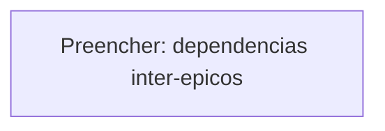

# ResenhAI — Delivery Roadmap

> Sequência de épicos, dependências e milestones.

---

<!-- ACTION REQUIRED: Use `/madruga:roadmap resenhai` para gerar automaticamente. -->

## Status

<!-- Snapshot atual: epics shipped / em curso / proximos. Atualizado por reconcile e roadmap. -->

---

## MVP

<!-- Epicos minimos para entrega de valor (1-way-door). -->

---

## Delivery Sequence

<!-- Sequencia justificada: por que essa ordem, riscos primeiro, mecanicos no fim. -->

### Sequencia e Justificativa

<!-- Preencher -->

---

## Epic Table

| # | Epico | Status | Dependencias | Ciclo |
|---|-------|--------|-------------|-------|
| <!-- Preencher --> | | ✅ shipped / 🚧 em curso / 📋 planejado | | |

### Epics Futuros (criados conforme necessidade)

<!-- Lista de candidatos sem pitch.md ainda — promovidos via /madruga:epic-context quando entram no L2. -->

---

## Dependencies

<!-- Diagrama Mermaid ou tabela de dependencias inter-epicos -->

---

## Milestones

<!-- Marcos visiveis: lancamentos, integrations, certificacoes -->

| Milestone | Quando | Critério de aceite |
|-----------|--------|--------------------|
| <!-- Preencher --> | | |

---

## Riscos do Roadmap

| Risco | Prob | Impacto | Mitigacao |
|-------|------|---------|-----------|
| <!-- Preencher --> | | | |

---

## Nao Este Ciclo

<!-- O que foi explicitamente descartado deste ciclo (e porque). -->

- <!-- Preencher -->
