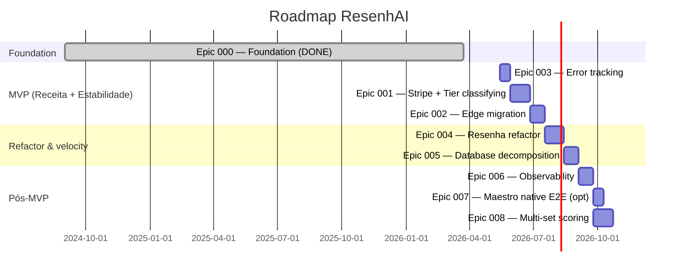
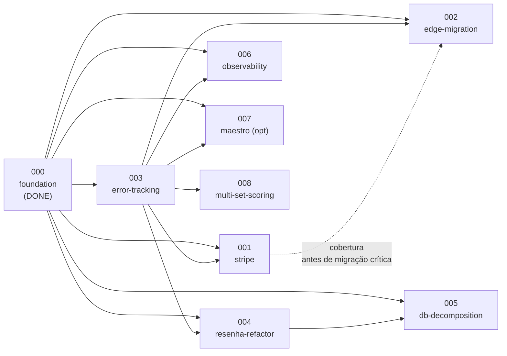

# ResenhAI — Delivery Roadmap

> Sequenciamento dos 9 épicos por dependência + risco. Epic 000 retroativo (DONE) + 8 épicos planejados (P1-P3). Última atualização: 2026-05-05.

---

## MVP

- **MVP Epics:** 003-error-tracking + 001-stripe + 002-edge-migration
- **Critério de MVP:** **1.000 grupos pagantes em Dez/2026** (vision §1) com onboarding estável (zero downtime de OTP em 30d) e cobrança ativa (primeiro pagamento real registrado).

> Justificativa: sem cobrança não há receita; sem error tracking estamos cegos durante migração crítica; sem edge migration o onboarding é um single point of failure.

---

## Objetivos e Resultados

| Objetivo de Negócio | Product Outcome (leading indicator) | Baseline | Target | Epics |
|---------------------|--------------------------------------|----------|--------|-------|
| **Receita ativa** | Grupos pagantes (Dono + Rei) | 0 (hoje) | **1.000 em Dez/2026** | 001 |
| **Estabilidade do onboarding** | Uptime do Magic Link OTP (24h) | `[VALIDAR]` (sem instrumentação) | ≥ 99% | 002, 003 |
| **Visibilidade operacional** | Crashes detectados via Sentry | 0% (invisível hoje) | 100% dos crashes em ≤ 5 min | 003 |
| **Velocity de feature** | Tempo médio de delivery em "gestão de resenha" | `[VALIDAR — extraível por commit time]` | redução 40% | 004, 005 |
| **Detecção pró-ativa de incidentes** | MTTD (mean time to detect) | "horas (reclamação manual)" | < 5 min | 006 |
| **Conversão pós-cupom** (épico 001) | % cupom → pagante M4 | `[VALIDAR — pós-launch]` | > 60% | 001 |

> Cada épico conecta a pelo menos 1 outcome. Épicos puramente arquiteturais (004, 005) impactam **velocity de feature**, que é o leading indicator de "tempo até features de alto valor (ex: novos esportes, integrações)".

---

## Delivery Sequence

> **Atenção**: estimativas Shape Up (appetite) — não comprometimento contratual. Janela MVP entre 2026-05-15 e ~2026-08-30 (~15 semanas, ~3.5 meses).

---

## Epic Table

| Order | Epic | Deps | Risk | Appetite | Milestone |
|-------|------|------|------|----------|-----------|
| 0 | 000-foundation (DONE) | — | — | retroativo | Foundation ✅ |
| 1 | **003-error-tracking** | 000 | low | 2 sem | MVP — pré-requisito |
| 2 | **001-stripe** | 003 | high (regulatório PIX, conversão pós-cupom) | 4 sem | MVP — receita ativa |
| 3 | **002-edge-migration** | 003 | medium (migração crítica de onboarding) | 3 sem | MVP — estabilidade |
| 4 | 004-resenha-refactor | 003 | medium (regressão visual) | 4 sem | Pós-MVP — velocity |
| 5 | 005-database-decomposition | 003, 004 | medium (mock patches em 1695 testes) | 3 sem | Pós-MVP — velocity |
| 6 | 006-observability | 003 | low | 3 sem | Pós-MVP — operacional |
| 7 | 007-maestro-native-e2e (opt) | 003 | low | 2 sem | Opcional / futuro |
| 8 | **008-multi-set-scoring** | 003 | medium (migração de schema `jogos` + dados existentes) | 4 sem | Pós-MVP — fecha débito ADR-015 (beach-volei best-of-3 sets real) |

### Epic 008 — Multi-set scoring (rabbit hole resumido)

**Problema**: [`lib/game-rules.ts:GAME_RULES`](../../resenhai-expo/lib/game-rules.ts#L53-L75) declara `numberOfSets: 3` para beach-volei, mas o schema atual de `jogos` é single-set integer (`placar_dupla1/2`) — beach-volei roda como 1-set efetivo silenciosamente. Reconhecido formalmente em [ADR-015](../decisions/ADR-015-game-rules-per-modalidade/).

**Solução proposta** (Shape Up — não comprometimento):
- Nova tabela `jogo_sets (jogo_id, set_index, placar_dupla1, placar_dupla2, vencedor)` ou colunas dinâmicas em `jogos`.
- UI de N sets em `app/(app)/games/add.tsx` baseada em `GAME_RULES[modality].numberOfSets`.
- Migração de dados legados: cada jogo existente vira `set_index=1`.
- Trigger de stats reescrito para considerar quem ganhou o **jogo** (best-of), não apenas placar agregado.

**Rabbit holes**:
- Decidir se `pontos_fairplay` muda quando passar a usar sets reais (provavelmente não — é por jogo, não set).
- Backfill de `vw_player_*` views.
- App em produção precisa rodar com schema novo + bundle antigo (rolling deploy).

**Acceptance criteria**:
- Beach-volei registra placar de 3 sets (best-of-3); jogo é decidido pelo 2º set vencido.
- Migração 100% reversível em < 5 min.
- Zero perda de dados em jogos legados.

> Não criar `epics/008-multi-set-scoring/pitch.md` — épicos planejados vivem só aqui no roadmap (CLAUDE.md:194-195).

---

## Dependencies

> 003-error-tracking é o "fundamental enabler" — bloqueia 6 épicos. Investir cedo paga em todos os subsequentes.

---

## Milestones

| Milestone | Epics | Critério de Sucesso | Estimativa |
|-----------|-------|----------------------|-----------|
| **Foundation ✅** | 000 | App em produção com 1898 testes verdes; HEAD `09abf73` | DONE (2026-03-24) |
| **MVP — Receita** | 003 + 001 + 002 | (a) 100% dos crashes mobile/web/Edge no Sentry com source map; (b) primeiro pagamento Stripe real registrado; (c) zero downtime de OTP em 30d pós-cutover | ~Aug/2026 (15 sem após start) |
| **Pós-MVP — Velocity** | 004 + 005 | (a) `resenha.tsx` ≤ 500 LOC; (b) `database.ts` removido (≤ 400 LOC por módulo); (c) coverage mantida ≥ 90% critical | ~Nov/2026 |
| **v1.0 — 1.000 grupos pagantes** | 001 + (loop de iteração) | 1.000 grupos com `subscriptions.status='active'` | **Dez/2026** (meta firme) |
| **Operacional** | 006 (+ 007 opcional) | MTTD < 5 min para SLO breach + alerts proativos | ~Q1/2027 |

---

## Roadmap Risks

| Risco | Impacto | Probabilidade | Mitigação |
|-------|---------|---------------|-----------|
| Conversão pós-cupom < 40% (epic 001) | Crítico (NS de receita não-atingido) | Alta (ProfitWell: cupons > 30% dobram churn) | Cupom v2 já reduzido para 50% (vs 80% v1); onboarding forte M1-3; email sequence |
| Ban Evolution API durante MVP | Crítico (onboarding bloqueado) | Média | ADR-007: rotação de números, instâncias secundárias; revisitar Cloud API caso Group API seja liberada |
| Migração n8n→Edge introduz bug em OTP (epic 002) | Crítico (sign-up bloqueado) | Média | Cutover gradual via flag por workflow; rollback redirect |
| Refactor god-screen (epic 004) introduz regressão UX | Alto | Média | Reforçar Playwright E2E + screenshot diff antes do merge |
| 1.000 grupos pagantes em 2026 não atingidos | Alto (financeiro) | Média | Monitorar funnel mensal; revisar pricing tier após M6 |
| Custo PIX Stripe inviabilizar margem | Médio | Baixa | Monitorar margem mensal; gatilho < 70% → reavaliar Pagar.me |
| Sazonalidade verão→inverno reduz uso (declarado pelo founder como NÃO relevante) | Baixo | Baixa | Sem ação imediata; reavaliar em jun/2027 |

---

## Nao Este Ciclo

| Item | Motivo da Exclusão | Revisitar Quando |
|------|--------------------|------------------|
| **i18n / multi-idioma** | Mercado-alvo é BR; introdução adiciona complexidade sem ganho de receita imediato | Quando expansão para LatAm (México, Argentina) for tese ativa |
| **WhatsApp Cloud API oficial (Meta)** | Não cobre group sync — bloqueador funcional (ADR-007) | Quando Meta liberar Group Messaging API oficial |
| **Compliance LGPD formal** (DPO + auditoria + DSR formal) | Tier B2C SMB não exige hoje; PII masking já em produção | Quando 1º cliente Enterprise (Arena B2B) demandar contratualmente |
| **Apps de festival/torneio único (alternativo)** | Foco no rachão recorrente (vision §3) — torneio único é espaço de LetzPlay | Nunca (boundary explícita do produto — vision §2 "Onde NÃO jogamos") |
| **Hall da Fama por federação/CBT** | Status visível ao grupo é suficiente para retenção; CBT é canal regulatório separado (ADR-007) | Quando Enterprise Arena demandar para validar campeonatos federados |
| **Pagamento via PIX direto sem Stripe** | ADR-008 escolheu Stripe para Billing nativo (subs/cupons/pro-rata); reescrever Billing tem ROI negativo | Quando margem PIX < 70% e Pagar.me virar trigger |
| **Self-host Sentry / Supabase** | LGPD ainda não exige; complexidade ops > ganho | Quando volume cobrança ou erros > tier paid (avaliar GlitchTip / self-host PostgREST) |
| **Pickleball / Padel / Futsal** | Escopo definido como "esportes de areia" (vision §2); diluiria identidade de marca | Quando categoria de areia plateaur (TAM saturado) |

---

## Próximo passo

→ `/madruga:epic-context resenhai 003-error-tracking` — entrar no L2 cycle do épico fundacional (ou `--draft` para planejar antes de criar branch).

> **Sequencial constraint**: somente 1 épico por plataforma pode estar `in_progress` por vez (ver `pipeline-dag-knowledge.md`). Iniciar 003 antes pelo portal `Start` ou via `POST /api/epics/resenhai/003-error-tracking/start`.
